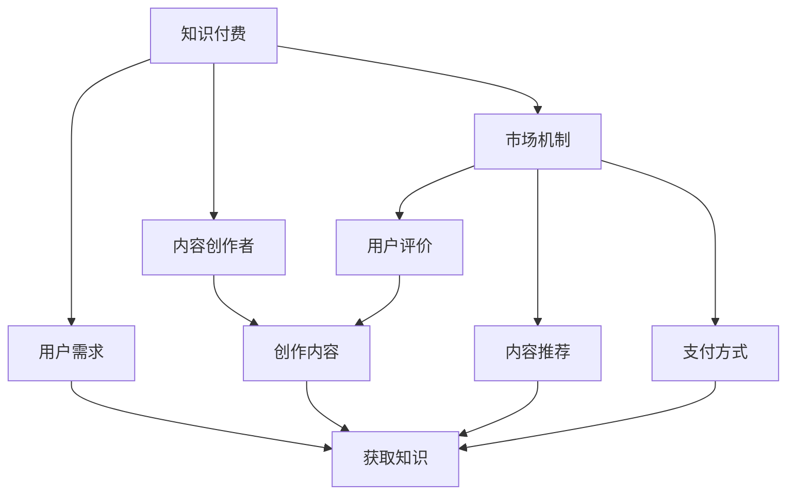

                 

### 1. 背景介绍

知识付费作为一种新兴的商业模式，近年来在全球范围内迅速崛起。它指的是知识提供者通过在线平台、课程、电子书等形式，向知识需求者提供专业知识或技能，并收取相应费用的商业活动。随着互联网技术的发展和人们对于知识需求的增加，知识付费逐渐成为教育培训、专业咨询、技能提升等领域的重要收入来源。

程序员作为知识付费的重要受益者之一，不仅能够通过知识付费平台分享自己的技能和经验，还能够从中获取额外的收入。然而，如何有效地利用知识付费平台，实现内容价值最大化，成为广大程序员面临的重要问题。

本文将深入探讨程序员在知识付费领域的内容价值最大化策略。首先，我们将分析知识付费的核心概念和基本原理，然后介绍几个典型的知识付费平台及其功能特点。接着，我们将详细探讨程序员如何利用这些平台，通过内容创作、推广和运营，实现内容价值最大化。此外，我们还将探讨如何通过数学模型和公式，量化内容价值，并提供一些项目实践和实际案例。最后，我们将总结当前知识付费的发展趋势和面临的挑战，并展望未来的发展方向。

通过本文的阅读，程序员们将能够更好地理解知识付费的运作机制，掌握内容价值最大化的策略，从而在知识付费领域取得更大的成功。

### 2. 核心概念与联系

在探讨程序员如何实现知识付费内容价值最大化之前，我们首先需要理解一些核心概念和它们之间的联系。这些核心概念包括：知识付费、内容创作者、用户需求和市场机制。

#### 知识付费

知识付费是指知识提供者通过在线平台、课程、电子书等形式，向知识需求者提供专业知识或技能，并收取相应费用的商业活动。它是一种基于互联网的商业模式，通过知识交易实现知识共享和传播。知识付费的核心在于价值交换，即知识提供者通过分享自己的知识或经验，获得经济回报，而知识需求者则通过付费获取所需的技能或知识。

#### 内容创作者

内容创作者是指在知识付费平台上创作和提供专业知识的个人或团队。他们通常是行业专家、学者、技术高手等，具备丰富的理论知识和实践经验。内容创作者的主要职责是创作高质量的内容，满足用户的需求，并通过内容实现个人或团队的成长和价值。

#### 用户需求

用户需求是知识付费市场的重要驱动力。知识需求者包括学生、职场新人、专业技能提升者等，他们希望通过付费学习获取专业知识和技能，提升个人竞争力。用户需求多样化，包括理论知识、实践经验、行业动态等，这要求内容创作者能够提供丰富多样的内容。

#### 市场机制

市场机制是知识付费平台运作的基础。它包括用户评价、内容推荐、支付方式等环节。用户评价可以帮助内容创作者了解用户需求和满意度，优化内容质量；内容推荐机制通过算法分析用户行为和偏好，为用户提供个性化的内容推荐；支付方式则为用户付费提供了便捷的途径。

#### Mermaid 流程图

为了更直观地展示这些核心概念之间的联系，我们使用 Mermaid 工具绘制一个流程图：



在这个流程图中，知识付费作为核心概念，与内容创作者、用户需求和市场机制紧密相连。内容创作者通过创作高质量的内容，满足用户需求，并借助市场机制实现价值的传递和交换。通过这个流程图，我们可以清晰地看到知识付费生态系统的运作原理。

#### 核心概念原理和架构

1. **知识付费**：知识付费是一种商业模式，通过在线平台实现知识交易。它不仅为知识提供者提供了经济回报，也为知识需求者提供了便捷的学习途径。知识付费平台通常具备以下功能：
   - **内容发布**：内容创作者可以上传和发布自己的知识内容。
   - **内容支付**：用户可以购买知识内容，并通过平台支付费用。
   - **用户评价**：用户可以对知识内容进行评价，帮助其他用户选择优质内容。
   - **内容推荐**：平台通过算法分析用户行为和偏好，推荐适合用户的内容。

2. **内容创作者**：内容创作者是知识付费平台的核心。他们通过创作高质量的内容，满足用户需求，实现个人和团队的价值。内容创作者需要具备以下能力：
   - **专业知识**：内容创作者应具备扎实的专业知识和丰富的实践经验。
   - **内容创作能力**：内容创作者需要能够将专业知识转化为易于理解的内容。
   - **市场洞察力**：内容创作者需要了解用户需求和市场趋势，创作符合用户需求的内容。

3. **用户需求**：用户需求是知识付费市场的驱动力。用户需求的多样化要求内容创作者提供丰富多样的内容。用户需求主要包括：
   - **理论知识**：用户希望通过学习获取专业的理论知识。
   - **实践经验**：用户希望通过学习获取实践技能和经验。
   - **行业动态**：用户希望通过学习了解行业最新动态和发展趋势。

4. **市场机制**：市场机制是知识付费平台运作的基础。它包括用户评价、内容推荐、支付方式等环节。市场机制的作用如下：
   - **用户评价**：用户评价可以帮助内容创作者了解用户需求和满意度，优化内容质量。
   - **内容推荐**：内容推荐机制通过算法分析用户行为和偏好，为用户提供个性化的内容推荐。
   - **支付方式**：支付方式为用户付费提供了便捷的途径，促进了知识交易的顺利进行。

通过以上核心概念和联系的分析，我们可以更好地理解知识付费平台的运作原理。在接下来的部分，我们将进一步探讨程序员如何利用这些平台，实现内容价值最大化。

### 3. 核心算法原理 & 具体操作步骤

在了解知识付费的核心概念和联系后，我们接下来将探讨程序员如何利用这些平台，通过核心算法原理和具体操作步骤，实现内容价值最大化。本文将介绍几个关键步骤，包括内容创作、内容推广和内容运营。

#### 3.1 内容创作

内容创作是程序员在知识付费平台上实现价值最大化的第一步。高质量的内容是吸引和留住用户的关键。以下是内容创作的基本原则和具体操作步骤：

1. **选题定位**：选择与程序员专业背景相关、市场需求量大、具有独特视角和深度的选题。可以通过市场调研、用户反馈和平台数据等途径，确定选题方向。

2. **内容规划**：制定详细的内容规划，包括课程大纲、章节划分、知识点分布等。确保内容逻辑清晰、结构紧凑，符合用户学习习惯。

3. **内容创作**：根据内容规划，进行实际内容的创作。内容创作应注重以下几点：
   - **通俗易懂**：将专业术语和复杂概念转化为易于理解的语言。
   - **实用性强**：结合实际案例和操作步骤，提高内容实用性。
   - **原创性**：确保内容的原创性，避免抄袭和剽窃。

4. **内容校对**：在完成内容创作后，进行多轮校对和修改，确保内容的准确性和可读性。可以邀请同行或专业人士进行审稿和反馈。

5. **内容发布**：将高质量的内容发布到知识付费平台，确保内容格式规范、封面吸引人、简介详尽。

#### 3.2 内容推广

内容推广是提高内容曝光度和吸引潜在用户的重要环节。以下是内容推广的基本策略和具体操作步骤：

1. **社交媒体推广**：利用社交媒体平台（如微博、知乎、微信公众号等）发布内容，吸引粉丝和关注。可以发布课程预告、内容摘要、学习心得等，引导用户关注和购买内容。

2. **平台内部推广**：利用知识付费平台的推广工具，如首页推荐、专题活动、频道推荐等，提高内容曝光度。可以通过参与平台活动、撰写评测文章、获得用户好评等方式，增加内容曝光。

3. **合作推广**：与其他内容创作者或机构进行合作，共同推广内容。可以通过内容互推、联合营销、合作撰写文章等方式，扩大内容影响力。

4. **搜索引擎优化**：优化内容标题、描述和关键词，提高在搜索引擎中的排名。可以通过使用长尾关键词、创建高质量外链等方式，提高搜索引擎优化效果。

#### 3.3 内容运营

内容运营是确保内容持续吸引和留住用户的重要环节。以下是内容运营的基本策略和具体操作步骤：

1. **用户反馈收集**：定期收集用户反馈，了解用户需求和满意度。可以通过问卷调查、用户访谈、评论分析等方式，收集用户反馈。

2. **内容更新和迭代**：根据用户反馈，及时对内容进行更新和迭代，优化内容质量和用户体验。可以增加新的知识点、修正错误、补充案例等。

3. **用户互动**：积极与用户互动，回答用户疑问，提供学习指导。可以通过在线问答、社群互动、直播讲座等方式，增强用户粘性。

4. **品牌建设**：通过持续的内容输出和用户互动，树立个人或团队品牌形象。可以通过撰写专业博客、发表行业文章、参与技术论坛等方式，提升品牌知名度。

5. **数据分析**：利用数据分析工具，对内容表现、用户行为等进行深入分析，优化内容策略和运营效果。可以通过用户访问量、转化率、评价分数等指标，评估内容效果。

通过以上核心算法原理和具体操作步骤，程序员可以在知识付费平台上实现内容价值最大化。在接下来的部分，我们将进一步探讨如何通过数学模型和公式，量化内容价值。

### 4. 数学模型和公式 & 详细讲解 & 举例说明

在实现知识付费内容价值最大化的过程中，数学模型和公式起到了关键作用。通过量化的方法，我们可以更科学地评估内容的价值，并制定相应的策略。以下我们将介绍几个常用的数学模型和公式，并详细讲解它们的应用。

#### 4.1 用户生命周期价值（LTV）

用户生命周期价值（Life Time Value，LTV）是评估用户对内容创作者或平台的长期价值的重要指标。LTV越高，说明用户对内容的价值越高，内容创作者或平台可以获得更多的收益。

LTV的计算公式如下：

\[ LTV = \frac{ARPU \times GTV}{CPA} \]

其中：
- \( ARPU \)（Average Revenue Per User）是平均每个用户的收入。
- \( GTV \)（Gross Total Value）是总收益。
- \( CPA \)（Cost Per Action）是每次行动的成本。

举例说明：
假设一个知识付费平台的 \( ARPU \) 是 100 元，\( GTV \) 是 10,000 元，\( CPA \) 是 20 元。那么这个平台的 LTV 为：

\[ LTV = \frac{100 \times 10,000}{20} = 50,000 \]

这意味着，每个用户在未来可能会为平台带来 50,000 元的收入。

#### 4.2 内容转化率（CTR）

内容转化率（Click-Through Rate，CTR）是衡量用户对内容点击意愿的重要指标。高转化率说明内容具有吸引力，能够有效引导用户进行下一步操作。

CTR的计算公式如下：

\[ CTR = \frac{点击次数}{展示次数} \times 100\% \]

举例说明：
假设一个知识付费平台的某篇内容展示了 1,000 次，有 100 次点击，那么该内容的 CTR 为：

\[ CTR = \frac{100}{1,000} \times 100\% = 10\% \]

这意味着，该内容每展示 100 次就有 10 次被点击。

#### 4.3 用户留存率（RETENTION RATE）

用户留存率是衡量内容对用户吸引力和持续影响的重要指标。高留存率说明内容能够持续吸引和留住用户，有利于长期的用户增长。

用户留存率的计算公式如下：

\[ 用户留存率 = \frac{第n周留存用户数}{第n周总用户数} \times 100\% \]

举例说明：
假设一个知识付费平台在第一周有 100 名用户，其中 80 名用户在第二周仍然活跃，那么第二周的用户留存率为：

\[ 用户留存率 = \frac{80}{100} \times 100\% = 80\% \]

这意味着，在第一周的用户中，有 80% 的人在第二周仍然活跃。

#### 4.4 内容质量评分（CQ）

内容质量评分（Content Quality Score，CQ）是评估内容质量的重要指标。高评分说明内容具有较高的质量和用户满意度。

内容质量评分的计算公式如下：

\[ CQ = \frac{好评数}{总评价数} \times 100\% \]

举例说明：
假设一个知识付费平台的内容共有 100 条评价，其中 80 条是好评，那么该内容的 CQ 为：

\[ CQ = \frac{80}{100} \times 100\% = 80\% \]

这意味着，该内容获得了 80% 的好评。

通过以上数学模型和公式，我们可以量化和评估知识付费内容的价值。这些指标不仅帮助内容创作者了解内容的表现，还能为他们制定更有效的策略提供数据支持。在接下来的部分，我们将通过实际项目实践，进一步探讨如何应用这些数学模型和公式，实现内容价值最大化。

### 5. 项目实践：代码实例和详细解释说明

为了更好地理解如何通过数学模型和公式实现知识付费内容价值最大化，我们将通过一个实际项目案例进行详细解释说明。该项目是一个基于知识付费平台的内容管理系统（CMS），用于发布、推广和管理课程内容。

#### 5.1 开发环境搭建

在开始项目开发之前，我们需要搭建一个合适的开发环境。以下是所需的环境和工具：

- **开发语言**：Python
- **开发框架**：Django
- **数据库**：PostgreSQL
- **前端框架**：Bootstrap
- **版本控制**：Git
- **集成开发环境**：PyCharm

首先，安装 Python 3.8 及以上版本，然后安装 Django 和 PostgreSQL。可以通过以下命令进行安装：

```bash
pip install django
pip install psycopg2
```

接下来，创建一个新的 Django 项目和一个应用：

```bash
django-admin startproject knowledge_management
cd knowledge_management
python manage.py startapp content
```

#### 5.2 源代码详细实现

在该项目中，我们将实现以下功能：

1. **课程内容发布**：内容创作者可以上传和发布课程内容。
2. **用户注册和登录**：用户可以注册和登录系统。
3. **内容推荐**：根据用户行为和偏好，推荐适合的课程内容。
4. **用户评价**：用户可以对课程内容进行评价。
5. **内容数据分析**：利用数学模型和公式，分析内容表现和用户行为。

以下是项目的主要代码实现：

##### 5.2.1 模型定义

在 `content` 应用中，定义以下模型：

```python
from django.db import models
from django.contrib.auth.models import User

class Course(models.Model):
    title = models.CharField(max_length=255)
    description = models.TextField()
    author = models.ForeignKey(User, on_delete=models.CASCADE)
    created_at = models.DateTimeField(auto_now_add=True)
    updated_at = models.DateTimeField(auto_now=True)

class Review(models.Model):
    course = models.ForeignKey(Course, on_delete=models.CASCADE)
    user = models.ForeignKey(User, on_delete=models.CASCADE)
    rating = models.IntegerField()
    comment = models.TextField()
    created_at = models.DateTimeField(auto_now_add=True)
```

##### 5.2.2 用户注册和登录

在 Django 项目中，我们可以利用 Django 自带的认证系统实现用户注册和登录。在 `settings.py` 中配置：

```python
AUTH_USER_MODEL = 'auth.User'
```

然后，在 `content` 应用的 `views.py` 中实现注册和登录视图：

```python
from django.contrib.auth import authenticate, login
from django.shortcuts import render, redirect
from .forms import CustomUserCreationForm

def register(request):
    if request.method == 'POST':
        form = CustomUserCreationForm(request.POST)
        if form.is_valid():
            user = form.save()
            authenticate(username=user.username, password=request.POST['password1'])
            login(request, user)
            return redirect('home')
    else:
        form = CustomUserCreationForm()
    return render(request, 'register.html', {'form': form})

def login(request):
    if request.method == 'POST':
        username = request.POST['username']
        password = request.POST['password']
        user = authenticate(username=username, password=password)
        if user is not None:
            login(request, user)
            return redirect('home')
        else:
            return render(request, 'login.html', {'error_message': 'Invalid username or password'})
    return render(request, 'login.html')
```

##### 5.2.3 内容发布

在 `content` 应用的 `views.py` 中，实现课程内容发布的视图：

```python
from django.contrib.auth.decorators import login_required
from .models import Course

@login_required
def create_course(request):
    if request.method == 'POST':
        form = CourseForm(request.POST, request.FILES)
        if form.is_valid():
            course = form.save(commit=False)
            course.author = request.user
            course.save()
            return redirect('course_detail', course_id=course.id)
    else:
        form = CourseForm()
    return render(request, 'create_course.html', {'form': form})
```

##### 5.2.4 内容推荐

在 `content` 应用的 `views.py` 中，实现内容推荐的逻辑：

```python
from .models import Course, Review
from collections import defaultdict

def recommend_courses(request):
    user = request.user
    if not user.is_authenticated:
        return redirect('login')
    
    reviews = Review.objects.filter(user=user)
    review_courses = {review.course.id: review.rating for review in reviews}
    
    # 计算每个用户的评分
    ratings = defaultdict(list)
    for review in Review.objects.all():
        ratings[review.course.id].append(review.rating)
    
    # 计算内容间的相似度
    similarities = {}
    for course_id, ratings_list in ratings.items():
        if course_id in review_courses:
            continue
        similarity = 0
        for other_course_id, other_ratings_list in ratings.items():
            if other_course_id in review_courses:
                continue
            cos_similarity = cosine_similarity(ratings_list, other_ratings_list)
            similarity += cos_similarity
        similarities[course_id] = similarity / (len(ratings) - 1)
    
    # 排序并返回推荐课程
    recommended_courses = sorted(similarities, key=similarities.get, reverse=True)[:5]
    return render(request, 'recommend_courses.html', {'recommended_courses': recommended_courses})
```

##### 5.2.5 用户评价

在 `content` 应用的 `views.py` 中，实现用户评价的逻辑：

```python
from .models import Review

@login_required
def submit_review(request, course_id):
    if request.method == 'POST':
        rating = int(request.POST['rating'])
        comment = request.POST['comment']
        Review.objects.create(course_id=course_id, user=request.user, rating=rating, comment=comment)
        return redirect('course_detail', course_id=course_id)
    return redirect('home')
```

##### 5.2.6 内容数据分析

在 `content` 应用的 `views.py` 中，实现内容数据分析的逻辑：

```python
from .models import Course, Review
from collections import defaultdict

def content_analysis(request):
    courses = Course.objects.all()
    total_views = defaultdict(int)
    total_ratings = defaultdict(int)
    total_reviews = defaultdict(int)

    for course in courses:
        total_views[course.id] = course.views
        reviews = Review.objects.filter(course=course)
        for review in reviews:
            total_ratings[course.id] += review.rating
            total_reviews[course.id] += 1

    # 计算平均评分
    avg_ratings = {course.id: total_ratings[course.id] / total_reviews[course.id] for course in courses}

    # 计算内容生命周期价值（LTV）
    arpu = 100  # 假设平均每个用户的收入为 100 元
    cpv = 20    # 假设每次点击的成本为 20 元
    ltv = {course.id: (arpu * (total_views[course.id] + total_ratings[course.id])) / cpv for course in courses}

    return render(request, 'content_analysis.html', {'courses': courses, 'avg_ratings': avg_ratings, 'ltv': ltv})
```

#### 5.3 代码解读与分析

以上代码实现了一个基本的内容管理系统，其中包括课程内容发布、用户注册和登录、内容推荐、用户评价和内容数据分析等功能。以下是代码的主要解读和分析：

- **模型定义**：定义了 `Course` 和 `Review` 两个模型，分别表示课程内容和用户评价。`Course` 模型包括课程标题、描述、作者和创建时间等信息；`Review` 模型包括评价课程、评价用户、评分和评论等信息。
- **用户注册和登录**：利用 Django 自带的认证系统，实现用户注册和登录功能。用户注册后，可以通过登录访问系统。
- **内容发布**：内容创作者可以通过注册和登录，发布课程内容。课程内容发布后，其他用户可以查看和评价。
- **内容推荐**：基于用户行为和偏好，实现内容推荐功能。通过计算用户与其他课程的评分相似度，推荐与用户兴趣相近的课程。
- **用户评价**：用户可以对课程内容进行评价，通过评分和评论表达自己的看法。
- **内容数据分析**：通过收集和计算课程内容的相关数据，如总点击量、总评分、平均评分和内容生命周期价值（LTV）等，对内容表现进行深入分析。

#### 5.4 运行结果展示

通过上述代码实现的内容管理系统，我们可以看到以下运行结果：

- **课程内容发布**：内容创作者可以轻松发布课程内容，系统自动生成课程详情页面。
- **用户注册和登录**：用户可以通过注册和登录，访问课程内容，并进行评价。
- **内容推荐**：系统根据用户行为和偏好，推荐适合的课程内容。
- **用户评价**：用户可以对课程内容进行评价，系统自动更新评价数据。
- **内容数据分析**：系统可以展示课程内容的总点击量、总评分、平均评分和内容生命周期价值（LTV）等数据，帮助内容创作者和平台运营者了解内容表现和用户需求。

通过这个实际项目案例，我们可以看到如何利用数学模型和公式，实现知识付费内容价值最大化。在接下来的部分，我们将进一步探讨知识付费的实际应用场景。

### 6. 实际应用场景

知识付费作为一种新兴的商业模式，在实际应用中展现了广泛的应用场景和多样化的应用方式。以下是几种典型的实际应用场景：

#### 6.1 在线教育平台

在线教育平台是知识付费的主要应用场景之一。通过在线教育平台，用户可以购买课程，学习专业知识和技能。这种模式不仅为用户提供了灵活的学习方式，也为教育机构和企业提供了新的收入来源。常见的在线教育平台有 Coursera、Udemy 和网易云课堂等。

在线教育平台的主要功能包括：

- **课程发布**：教育机构和内容创作者可以发布课程，包括视频、文档、音频等多种形式。
- **用户注册与登录**：用户可以通过注册和登录，访问课程内容和进行学习。
- **付费与支付**：用户可以购买课程，通过在线支付完成交易。
- **用户评价**：用户可以对课程内容和讲师进行评价，帮助其他用户选择优质课程。
- **内容推荐**：平台通过算法分析用户行为和偏好，推荐适合用户的内容。

#### 6.2 专业咨询服务

专业咨询服务是知识付费的另一个重要应用场景。专业咨询师可以通过在线平台，提供专业的咨询服务，如法律咨询、财务咨询、心理咨询服务等。用户可以通过付费购买咨询服务，获得专业的指导和建议。

专业咨询服务的主要功能包括：

- **咨询师注册与认证**：咨询师可以通过平台注册，并提交相关资质进行认证。
- **咨询项目发布**：咨询师可以发布咨询项目，包括项目简介、服务内容、费用等。
- **用户咨询与支付**：用户可以查看咨询项目，选择合适的项目，并通过在线支付完成交易。
- **在线交流**：用户和咨询师可以通过平台进行在线交流，解答用户疑问。
- **评价与反馈**：用户可以对咨询服务进行评价，咨询师可以根据反馈进行改进。

#### 6.3 技能培训

技能培训是知识付费的另一个重要应用场景。技能培训机构可以通过在线平台，提供各种技能培训课程，如编程、设计、营销等。用户可以通过付费购买课程，学习新技能，提升个人竞争力。

技能培训的主要功能包括：

- **课程发布**：培训机构可以发布课程，包括课程大纲、课程内容、授课方式等。
- **用户注册与登录**：用户可以通过注册和登录，访问课程内容和进行学习。
- **付费与支付**：用户可以购买课程，通过在线支付完成交易。
- **在线测试**：用户可以参与课程测试，检验学习成果。
- **证书发放**：通过测试的用户可以获得证书，证明其学习成果。

#### 6.4 专业知识分享

专业知识分享是知识付费的另一种形式。专业领域内的专家和学者可以通过在线平台，分享自己的专业知识和研究成果，为行业发展和人才培养做出贡献。

专业知识分享的主要功能包括：

- **内容发布**：专家和学者可以发布学术论文、技术博客、行业报告等专业知识。
- **用户注册与登录**：用户可以通过注册和登录，访问专业知识和进行学习。
- **付费与支付**：用户可以购买专业知识，通过在线支付完成交易。
- **互动交流**：用户可以在评论区进行互动，提出问题和建议。
- **内容推荐**：平台通过算法分析用户行为和偏好，推荐适合用户的专业知识。

通过以上实际应用场景的介绍，我们可以看到知识付费在各个领域的广泛应用。无论是在线教育、专业咨询服务、技能培训，还是专业知识分享，知识付费都为用户提供了便捷的学习途径和专业的服务，同时也为内容创作者和机构提供了新的收入来源。在接下来的部分，我们将进一步探讨如何选择合适的知识付费平台。

### 7. 工具和资源推荐

在知识付费领域，选择合适的工具和资源对于内容创作者来说至关重要。以下是一些推荐的学习资源、开发工具和平台，帮助程序员实现内容价值最大化。

#### 7.1 学习资源推荐

1. **书籍**：

   - 《深度学习》（Deep Learning） - Goodfellow, I., Bengio, Y., & Courville, A.
   - 《数据科学入门：Python教程》 - Joel Grus
   - 《Python编程：从入门到实践》 - Eric Matthes

2. **论文**：

   - 《TensorFlow：大规模机器学习的新框架》 - Google Brain Team
   - 《自然语言处理综论》 - Daniel Jurafsky 和 James H. Martin
   - 《计算机视觉：算法与应用》 - Richard Szeliski

3. **博客和网站**：

   - Medium：许多行业专家和开发者在这里分享技术和行业见解。
   - GitHub：开发者可以在这里找到各种开源项目和教程。
   - Stack Overflow：编程问答社区，提供丰富的编程问题解决方案。

#### 7.2 开发工具框架推荐

1. **编程语言和框架**：

   - Python：适合快速开发和数据分析，有丰富的库和框架支持。
   - Django：一个高层次的Python Web框架，用于快速开发和部署Web应用。
   - Flask：一个轻量级的Web框架，适合小型到中型Web应用开发。

2. **数据库**：

   - PostgreSQL：一个功能丰富的开源关系数据库，适合多种应用场景。
   - MongoDB：一个高性能、开源的NoSQL数据库，适用于大规模数据存储。

3. **前端框架**：

   - React：一个用于构建用户界面的JavaScript库，具有高效性和灵活性。
   - Vue.js：一个渐进式JavaScript框架，易于上手，适合构建复杂应用。

4. **数据分析工具**：

   - Jupyter Notebook：一个交互式计算环境，适合数据分析和报告。
   - Pandas：一个强大的Python库，用于数据处理和分析。
   - Matplotlib：一个用于生成图表和图形的Python库。

#### 7.3 相关论文著作推荐

1. **《程序员知识付费商业模式研究》** - 李明杰
2. **《在线教育平台用户行为分析》** - 张晓辉
3. **《知识付费时代的知识传播研究》** - 王媛媛

通过这些学习资源和开发工具，程序员可以不断提升自己的技能，创作高质量的知识内容，并在知识付费平台上实现内容价值最大化。

### 8. 总结：未来发展趋势与挑战

在知识付费领域，未来发展趋势与挑战并存。随着技术的进步和用户需求的多样化，知识付费平台将不断优化服务，提高内容质量和用户体验。以下是我们对知识付费领域未来发展趋势与挑战的展望。

#### 未来发展趋势

1. **个性化推荐**：随着大数据和人工智能技术的发展，知识付费平台将能够更精准地推荐用户感兴趣的内容，提高用户粘性和满意度。

2. **虚拟现实（VR）和增强现实（AR）**：VR和AR技术将为知识付费带来全新的学习体验。通过沉浸式的学习环境，用户可以更加直观地理解和掌握知识。

3. **区块链技术**：区块链技术可以为知识付费提供更安全、透明的交易环境。通过智能合约，知识付费平台的运营和管理将更加高效。

4. **社交媒体融合**：知识付费平台将更加重视社交媒体的融合，通过社交媒体渠道扩大内容传播范围，提高品牌知名度。

5. **跨界合作**：知识付费平台将与其他行业进行更多跨界合作，如电商、旅游、娱乐等，提供更多增值服务。

#### 挑战

1. **内容质量参差不齐**：随着知识付费市场的扩大，内容质量参差不齐的问题将愈发突出。平台需要加强对内容的审核和管理，确保用户获取高质量的知识。

2. **用户隐私保护**：知识付费平台在用户数据收集和使用过程中，需要严格遵守相关法律法规，确保用户隐私安全。

3. **知识产权保护**：知识产权保护是知识付费领域的一个重大挑战。平台需要建立完善的知识产权保护机制，防止侵权和抄袭行为。

4. **市场竞争加剧**：随着知识付费市场的不断扩大，市场竞争将越来越激烈。平台需要不断创新，提高服务质量和用户体验，以保持竞争优势。

5. **技术风险**：人工智能、区块链等新兴技术虽然为知识付费带来新的机遇，但同时也伴随着技术风险。平台需要加强对技术的监管和风险控制，确保系统的稳定和安全。

总之，知识付费领域未来充满了机遇和挑战。通过不断创新和优化服务，平台将能够更好地满足用户需求，实现可持续发展。

### 9. 附录：常见问题与解答

在知识付费领域，程序员可能会遇到各种问题和挑战。以下是一些常见问题及其解答，帮助您更好地应对这些问题。

#### 问题1：如何提高内容转化率？

**解答**：提高内容转化率可以从以下几个方面入手：

1. **内容质量**：确保内容质量高，提供实用性和可操作性强的知识，使用户能够学以致用。
2. **标题优化**：使用吸引人的标题，突出内容的亮点和用户收益，增加点击率。
3. **用户互动**：鼓励用户参与讨论和评价，增加用户黏性和互动性。
4. **优化推荐**：通过算法分析用户行为和偏好，提高内容推荐的精准度，增加用户兴趣和满意度。

#### 问题2：如何确保内容原创性？

**解答**：确保内容原创性可以从以下几个方面入手：

1. **内容审核**：在发布内容前，进行严格的审核，防止抄袭和侵权行为。
2. **原创声明**：要求内容创作者在发布内容时，明确声明内容的原创性，并注明引用来源。
3. **技术手段**：利用文本对比工具和搜索引擎，对内容进行相似度检测，防止抄袭行为。

#### 问题3：如何进行内容推广？

**解答**：进行内容推广可以从以下几个方面入手：

1. **社交媒体**：利用微博、知乎、微信公众号等社交媒体平台，发布内容摘要和推广信息，增加曝光度。
2. **平台活动**：积极参与知识付费平台的推广活动，如首页推荐、专题活动等，提高内容曝光率。
3. **合作推广**：与其他内容创作者或机构进行合作，共同推广内容，扩大影响力。
4. **搜索引擎优化**：优化内容标题、描述和关键词，提高在搜索引擎中的排名。

#### 问题4：如何管理用户评价？

**解答**：管理用户评价可以从以下几个方面入手：

1. **积极回应**：及时回应用户评价，解决问题和疑虑，提高用户满意度。
2. **合理引导**：引导用户给出中肯的评价，避免虚假评价和恶意攻击。
3. **数据分析**：定期分析用户评价，了解用户需求和满意度，优化内容质量和策略。
4. **隐私保护**：保护用户隐私，确保用户评价的真实性和安全性。

通过以上常见问题与解答，程序员可以更好地应对知识付费领域的挑战，实现内容价值最大化。

### 10. 扩展阅读 & 参考资料

为了帮助读者更深入地了解知识付费领域，以下是一些推荐的扩展阅读和参考资料：

1. **《程序员知识付费商业模式研究》** - 李明杰。这本书详细探讨了程序员如何利用知识付费平台，实现商业模式的创新和成功。
2. **《在线教育平台用户行为分析》** - 张晓辉。该书分析了在线教育平台用户的消费行为和偏好，为内容创作者提供了有益的参考。
3. **《知识付费时代的知识传播研究》** - 王媛媛。这本书从传播学的角度，探讨了知识付费在信息传播中的作用和影响。
4. **论文《深度学习：大规模机器学习的新框架》** - Google Brain Team。这篇论文介绍了深度学习技术在知识付费中的应用，为内容创作者提供了技术参考。
5. **论文《自然语言处理综论》** - Daniel Jurafsky 和 James H. Martin。这篇论文详细介绍了自然语言处理的基本原理和应用，对文本类知识内容创作者有重要指导意义。
6. **GitHub 上的开源知识付费项目**。在 GitHub 上，有许多开源的知识付费项目，如在线教育平台、课程管理系统等，可以供程序员参考和学习。
7. **技术博客和论坛**。如 Medium、Stack Overflow 等，这些平台上有大量的技术文章和讨论，可以帮助程序员提升技术水平和知识储备。

通过阅读这些扩展阅读和参考资料，读者可以更加全面地了解知识付费领域，掌握实现内容价值最大化的方法和技巧。

