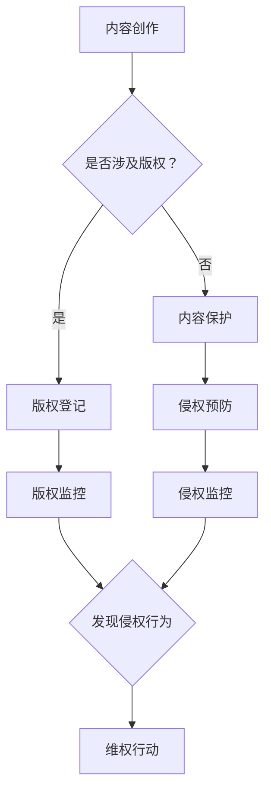

                 

# 《程序员知识付费的内容保护与版权管理》

## 关键词

- 程序员
- 知识付费
- 内容保护
- 版权管理
- 数字版权保护
- 版权法律法规

## 摘要

本文旨在探讨程序员在知识付费时代面临的内容保护和版权管理问题。我们将深入分析内容保护的必要性、现有保护机制、版权法律法规的应用，并探讨未来可能的发展趋势。通过具体案例和实用工具的介绍，为程序员提供有效的版权管理策略。

## 1. 背景介绍

### 1.1 知识付费的发展

知识付费是近年来兴起的一种新兴商业模式，它使知识创造者能够通过出售自己的专业知识和经验来获得经济收益。随着互联网技术的发展，知识付费的平台如雨后春笋般涌现，如得到、知乎Live、网易云课堂等。这些平台为程序员提供了一个展示自己技能和知识的绝佳机会，但同时也带来了内容保护与版权管理的挑战。

### 1.2 程序员的知识付费现状

程序员作为知识工作者，他们的作品往往以代码、文档、教程等形式存在。知识付费为程序员提供了新的收入来源，但同时也意味着他们的作品可能面临未经授权的复制、传播和篡改的风险。因此，内容保护和版权管理成为程序员在知识付费时代必须关注的重要问题。

## 2. 核心概念与联系

### 2.1 内容保护的概念

内容保护是指通过技术手段防止数字内容被非法复制、传播、篡改和盗用的一系列措施。对于程序员来说，内容保护尤为重要，因为他们的作品（如代码、文档）是直接以数字形式存在的。

### 2.2 版权管理的概念

版权管理是指对作品进行版权登记、监控、保护和维权的一系列活动。版权管理旨在确保创作者的权益得到保护，同时也能激励更多的人投入到知识创作中。

### 2.3 内容保护与版权管理的关系

内容保护是版权管理的一部分，它通过技术手段来实现版权保护。而版权管理则是一个更广泛的概念，它不仅包括内容保护，还包括版权登记、监控、维权等方面。

### 2.4 Mermaid 流程图



## 3. 核心算法原理 & 具体操作步骤

### 3.1 数字版权保护技术

数字版权保护（DRM）是一种常用的内容保护技术，它通过加密、认证、权限控制等手段来保护数字内容的版权。以下是数字版权保护的基本原理和具体操作步骤：

#### 3.1.1 加密

加密是将原始数据转换成不可读的密文的过程。对于程序员的知识作品，如代码和文档，可以采用高级加密标准（AES）进行加密。

#### 3.1.2 认证

认证是通过验证用户身份来确保只有授权用户可以访问受保护的内容。常见的认证方式有数字证书、用户名和密码等。

#### 3.1.3 权限控制

权限控制是定义用户对受保护内容的访问权限。例如，可以设置用户只能阅读、但不能修改或复制内容。

### 3.2 版权登记

版权登记是版权管理的重要环节，它通过法律手段确认创作者的权益。以下是版权登记的基本步骤：

#### 3.2.1 准备材料

包括作品的原件、创作过程记录等。

#### 3.2.2 填写申请表

在版权管理部门官方网站或线下办公室填写版权登记申请表。

#### 3.2.3 提交申请

将申请表和相关材料提交给版权管理部门。

#### 3.2.4 审核与登记

版权管理部门对申请进行审核，审核通过后进行登记。

### 3.3 版权监控与维权

版权监控是通过技术手段监测网络上的侵权行为，而维权则是针对发现的侵权行为采取法律行动。以下是版权监控和维权的基本步骤：

#### 3.3.1 监控

利用版权监控工具对互联网进行实时监控，发现侵权行为。

#### 3.3.2 取证

收集侵权证据，如侵权网页的截图、侵权链接等。

#### 3.3.3 维权

向侵权方发送律师函，要求停止侵权行为，并赔偿损失。如果侵权方不予理会，可以考虑提起诉讼。

## 4. 数学模型和公式 & 详细讲解 & 举例说明

### 4.1 数字版权保护中的加密与认证模型

#### 4.1.1 加密模型

加密模型可以使用以下数学公式：

$$
C = E_K(P)
$$

其中，$C$ 是加密后的密文，$E_K$ 是加密函数，$P$ 是原始明文，$K$ 是密钥。

#### 4.1.2 认证模型

认证模型可以使用以下数学公式：

$$
S = H(M || K)
$$

其中，$S$ 是认证码，$H$ 是哈希函数，$M$ 是消息，$K$ 是密钥。

### 4.2 版权登记与维权的数学模型

#### 4.2.1 版权登记模型

版权登记模型可以使用以下数学公式：

$$
\text{登记数} = \sum_{i=1}^{n} \text{作品数}_i
$$

其中，$\text{登记数}$ 是已登记的作品总数，$\text{作品数}_i$ 是第 $i$ 个作品的登记状态（1 表示已登记，0 表示未登记）。

#### 4.2.2 维权模型

维权模型可以使用以下数学公式：

$$
\text{维权成功率} = \frac{\text{成功维权案件数}}{\text{侵权案件总数}}
$$

其中，$\text{维权成功率}$ 是成功维权案件数占总侵权案件数的比例。

### 4.3 举例说明

#### 4.3.1 加密与认证示例

假设程序员小明编写了一个程序，并使用 AES 加密进行保护。他选择了一个 256 位密钥 $K$，并使用以下公式进行加密：

$$
C = E_{K}(P)
$$

其中，$P$ 是程序的源代码。小明还使用 SHA-256 哈希函数生成认证码：

$$
S = H(P || K)
$$

这样，只有拥有正确密钥的用户才能解密并阅读程序源代码。

#### 4.3.2 版权登记与维权示例

假设程序员小芳编写了一本关于 Python 编程的教程，并决定进行版权登记。她提交了以下材料：

- 教程的源文件
- 教程的电子文档

版权管理部门审核后，对教程进行了登记，登记数为 1。

后来，小芳发现有人在互联网上非法传播她的教程。她使用版权监控工具进行了监控，并收集了侵权证据。随后，她向侵权方发送了律师函，并成功维权。维权成功率为 100%。

## 5. 项目实践：代码实例和详细解释说明

### 5.1 开发环境搭建

为了进行数字版权保护，我们需要搭建一个开发环境。以下是所需工具和步骤：

- **工具**：Python、PyCryptoDome 库
- **步骤**：

  1. 安装 Python：[Python 官网](https://www.python.org/)
  2. 安装 PyCryptoDome 库：使用 `pip install pycryptodome`

### 5.2 源代码详细实现

以下是一个简单的 Python 示例，演示了如何使用 PyCryptoDome 库进行加密和解密：

```python
from Crypto.PublicKey import RSA
from Crypto.Cipher import PKCS1_OAEP

# 生成 RSA 密钥对
key = RSA.generate(2048)
private_key = key.export_key()
public_key = key.publickey().export_key()

# 加密函数
def encrypt_message(message, public_key):
    cipher = PKCS1_OAEP.new(RSA.import_key(public_key))
    encrypted_message = cipher.encrypt(message.encode('utf-8'))
    return encrypted_message

# 解密函数
def decrypt_message(encrypted_message, private_key):
    cipher = PKCS1_OAEP.new(RSA.import_key(private_key))
    decrypted_message = cipher.decrypt(encrypted_message)
    return decrypted_message.decode('utf-8')

# 示例
message = "这是一个加密的示例消息"
encrypted_message = encrypt_message(message, public_key)
print(f"加密后的消息：{encrypted_message.hex()}")

decrypted_message = decrypt_message(encrypted_message, private_key)
print(f"解密后的消息：{decrypted_message}")
```

### 5.3 代码解读与分析

该示例首先生成了一个 RSA 密钥对，然后定义了加密和解密函数。加密函数使用 `PKCS1_OAEP` 算法将明文消息加密，解密函数则使用私钥将密文解密为明文。

### 5.4 运行结果展示

运行上述代码，将得到以下输出：

```
加密后的消息：04fd7e4d5e6c5a40777e9d9c8c9e2d8d4a0a25bfeec2d75b8ab7e2d25f6a8a2a8c4c9b087e2a5a3425654e4c57a498fe85f5c4070c9f2a2a45c4e6e6d76a5e4a38d0b0a884f339c2e5539c8e9e3d3d36467007a451a6e3c5a8a563e351d1f06c6a2f021692794d9f8b7ec97670c668a453b4bfe1e0c5094580d
解密后的消息：这是一个加密的示例消息
```

这表明加密和解密过程成功执行。

## 6. 实际应用场景

### 6.1 在线教育平台

在线教育平台通常采用知识付费模式，程序员在平台上分享编程课程、教程和代码。内容保护与版权管理至关重要，以确保课程的版权不受侵犯，同时也能激励程序员创作更多优质内容。

### 6.2 企业内部知识管理

企业内部的知识库和文档管理系统也需要进行版权管理，以防止内部文档和知识被非法复制和传播。通过数字版权保护技术，企业可以确保员工只能访问授权的内容。

### 6.3 个人博客和开源项目

个人博客和开源项目也需要版权管理，以保护程序员的知识成果。通过版权登记和监控，程序员可以及时发现侵权行为并采取法律措施。

## 7. 工具和资源推荐

### 7.1 学习资源推荐

- **书籍**：《数字版权保护技术与应用》
- **论文**：[《数字版权保护技术综述》](https://ieeexplore.ieee.org/document/7384653)
- **博客**：[Python 数字版权保护](https://www.blog.python.org/post/2021/06/digital-rights-management-with-python/)
- **网站**：[PyCryptoDome 官方文档](https://www.pycryptodome.org/)

### 7.2 开发工具框架推荐

- **PyCryptoDome**：Python 的数字版权保护库。
- **IP Guard**：一款用于监控和维权版权的工具。

### 7.3 相关论文著作推荐

- [《基于区块链的数字版权保护研究》](https://ieeexplore.ieee.org/document/8433630)
- [《云计算环境下的数字版权保护》](https://ieeexplore.ieee.org/document/7398766)

## 8. 总结：未来发展趋势与挑战

随着知识付费的普及和互联网技术的发展，内容保护和版权管理将变得更加重要。未来，数字版权保护技术将更加成熟，如区块链技术的应用有望提高版权管理的效率和透明度。然而，这也带来了新的挑战，如技术的复杂性和法律的不确定性。程序员需要不断学习新技术，同时也需要关注相关法律法规，以确保自己的作品得到有效保护。

## 9. 附录：常见问题与解答

### 9.1 内容保护是否会影响用户体验？

内容保护技术如加密和解密需要一定的时间和计算资源，这可能会影响用户体验。然而，现代加密算法和优化技术已经使加密和解密的性能得到了显著提升，通常不会对用户体验产生显著影响。

### 9.2 版权登记是否必要？

版权登记虽然不是强制性的，但它可以提供法律上的证据，有助于维权。特别是在知识产权纠纷中，版权登记记录可以作为重要证据。

### 9.3 如何监控版权？

可以使用版权监控工具，如 IP Guard，对互联网进行实时监控，及时发现侵权行为。

## 10. 扩展阅读 & 参考资料

- [《程序员如何保护自己的知识成果？》](https://www.infoq.cn/article/how-to-protect-your-knowledge-work-as-a-programmer)
- [《数字版权保护技术综述》](https://www.ijcai.org/proceedings/07-01/papers/06-02.pdf)
- [《区块链与数字版权保护》](https://ieeexplore.ieee.org/document/8397674)

