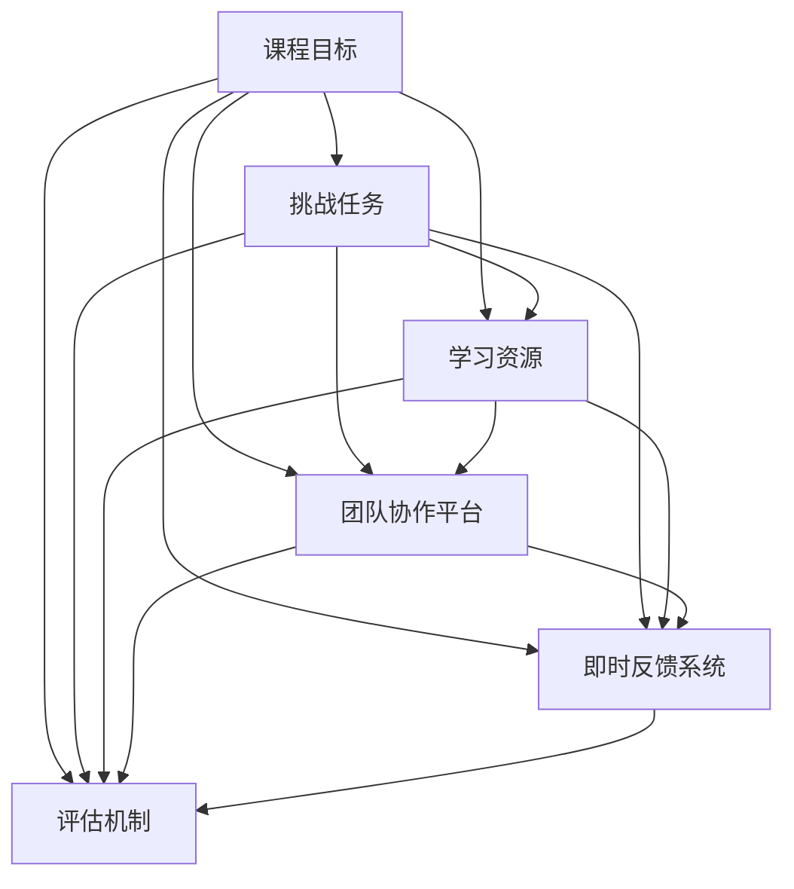

                 

### 1. 背景介绍

知识付费，作为近年来兴起的一种新型商业模式，正在逐渐改变人们获取知识的途径。对于程序员这一群体而言，知识付费不仅提供了更多优质的学习资源，也为他们创造了一个更加专业、高效的成长环境。在这个背景下，挑战式课程作为一种独特的知识付费形式，逐渐受到了广泛关注。

挑战式课程，顾名思义，是一种以挑战为导向的课程设计。它不同于传统的知识传授方式，而是通过设定具体的挑战任务，引导学员在实践中掌握知识、提升技能。这种课程形式不仅能够激发学员的学习兴趣，还能够培养他们的解决问题的能力，从而实现知识的真正内化。

程序员群体具有独特的特点，他们往往具有较高的自学能力和求知欲望，但同时也面临着技能更新速度快、竞争激烈等挑战。因此，对于程序员来说，选择一种适合他们的知识付费模式至关重要。挑战式课程正是这样一种模式，它通过实践和挑战，帮助程序员不断提升自己的技能水平。

随着互联网技术的发展，知识付费平台逐渐成为程序员学习的重要渠道。这些平台提供了丰富多样的课程资源，包括编程语言、框架、工具等，满足了程序员不同层次的学习需求。同时，这些平台还提供了互动交流的空间，使得程序员在学习过程中能够更好地分享经验、解决难题。

然而，现有的知识付费模式仍存在一些问题。例如，课程内容过于理论化，缺乏实际操作环节；课程形式单一，无法充分调动学员的积极性等。这些问题限制了知识付费的 effectiveness，也使得程序员在学习过程中感到困惑和无力。因此，探索一种新的知识付费模式，以更好地满足程序员的需求，成为了当前亟待解决的问题。

本文将围绕挑战式课程这一主题，探讨其设计理念、核心特点、实施步骤以及在实际应用中的效果。希望通过本文的探讨，能够为程序员提供一种更加有效、有趣的知识付费模式，助力他们在技术道路上不断前行。

### 2. 核心概念与联系

#### 挑战式课程设计理念

挑战式课程的设计理念源于“以学员为中心”的教学原则。这种课程模式强调学员的主动参与和实际操作，通过设定具体的挑战任务，引导学员在解决问题的过程中逐步掌握知识和技能。挑战式课程的核心思想可以概括为以下几点：

1. **实践导向**：挑战式课程强调实践操作，学员需要通过实际动手来解决问题，而不是仅仅依赖于理论知识的传授。这种实践导向的设计能够使学员更加深入地理解知识，提高应用能力。

2. **问题驱动**：课程内容围绕具体的问题展开，通过解决这些问题来引导学员掌握相关的知识和技能。这种方法能够激发学员的学习兴趣，提高学习的有效性。

3. **能力培养**：挑战式课程不仅传授知识，更重要的是培养学员的解决问题能力、团队协作能力和自主学习能力。这种能力的培养对于程序员在职业生涯中应对复杂问题具有重要意义。

4. **终身学习**：挑战式课程鼓励学员在解决一个挑战任务后，继续探索更深层次的问题，形成持续学习的动力。这种终身学习的理念有助于学员在技术快速发展的背景下不断进步。

#### 挑战式课程核心特点

挑战式课程具有以下核心特点：

1. **任务驱动**：课程内容以具体的任务为驱动，学员需要通过完成任务来达到学习的目标。这些任务通常是实际项目中的问题，具有真实性和挑战性。

2. **团队合作**：挑战式课程鼓励学员在团队中协作完成挑战任务。团队合作不仅能够提高解决问题的效率，还能够培养学员的沟通能力和团队合作精神。

3. **即时反馈**：在挑战过程中，学员能够实时收到反馈，了解自己的进展和存在的问题。这种即时反馈机制有助于学员及时调整学习策略，提高学习效果。

4. **多样化评估**：挑战式课程采用多样化的评估方式，包括过程评估、成果评估等。这种评估方式不仅能够全面了解学员的学习情况，还能够激发学员的积极性。

#### 挑战式课程架构

为了实现挑战式课程的设计理念，需要构建一个合理的课程架构。以下是挑战式课程架构的主要组成部分：

1. **课程目标**：明确课程的学习目标和预期成果，为学员提供清晰的指引。

2. **挑战任务**：设计具有挑战性和真实性的任务，任务难度逐步递增，以适应不同层次的学员。

3. **学习资源**：提供丰富的学习资源，包括文档、视频、工具等，以支持学员在挑战过程中的学习。

4. **团队协作平台**：搭建一个支持团队协作的平台，使学员能够方便地交流和分享。

5. **即时反馈系统**：构建一个即时反馈系统，使学员能够实时了解自己的学习进展和存在的问题。

6. **评估机制**：设计科学合理的评估机制，对学员的学习成果进行评估。

#### Mermaid 流程图

为了更直观地展示挑战式课程的架构，我们可以使用 Mermaid 流程图来描述。以下是挑战式课程架构的 Mermaid 流程图：



在这个流程图中，A 表示课程目标，B 表示挑战任务，C 表示学习资源，D 表示团队协作平台，E 表示即时反馈系统，F 表示评估机制。各个节点通过箭头连接，表示它们之间的依赖关系。

通过这种流程图的形式，我们可以清晰地看到挑战式课程的各个环节以及它们之间的联系。这有助于设计者更好地理解课程架构，从而优化课程设计，提高学习效果。

### 3. 核心算法原理 & 具体操作步骤

#### 挑战式课程设计原理

挑战式课程的设计基于一系列核心算法原理，这些原理旨在激发学员的主动学习和探索能力。以下是这些核心算法原理及其在实际操作中的应用：

1. **难度递增原理**：课程设计者需要根据学员的能力水平设计难度递增的任务。这种方法能够使学员在完成一个挑战任务后，感受到成就感，并激发他们继续学习的新动力。具体操作步骤包括：
   - **初步评估**：在课程开始前，对学员进行初步评估，了解他们的基础知识水平。
   - **任务分级**：根据评估结果，将任务分为初级、中级和高级三个层次，确保每个学员都能找到适合自己的挑战任务。
   - **动态调整**：在课程过程中，根据学员的进度和反馈，动态调整任务难度，确保学员始终保持在一个适度的挑战水平。

2. **即时反馈原理**：即时反馈是挑战式课程设计中至关重要的一个环节。它能够帮助学员快速识别并纠正自己的错误，从而提高学习效果。具体操作步骤包括：
   - **实时评估**：在学员完成挑战任务后，立即进行评估，提供详细的反馈。
   - **多样化反馈**：反馈不仅包括对任务完成的评价，还应涵盖对学员学习策略、问题解决能力等方面的评价。
   - **互动交流**：搭建一个互动交流平台，使学员能够与导师和其他学员进行实时交流，共同探讨问题。

3. **协作学习原理**：协作学习能够促进学员之间的知识共享和经验交流，从而提高整体学习效果。具体操作步骤包括：
   - **团队分组**：将学员分为多个小组，每个小组负责一个挑战任务。
   - **角色分工**：明确每个小组成员的角色和责任，确保任务能够高效完成。
   - **定期汇报**：小组定期汇报任务进展，分享学习经验和问题解决方案。

4. **激励机制**：激励机制能够激发学员的学习热情和积极性，具体操作步骤包括：
   - **积分系统**：建立积分系统，对学员在课程中的表现进行量化评估，给予相应的积分奖励。
   - **等级提升**：根据积分积累情况，设置不同的等级，使学员能够看到自己的成长和进步。
   - **奖品奖励**：对积分达到一定标准的学员提供奖品奖励，以鼓励他们继续努力学习。

#### 具体操作步骤

下面是挑战式课程的具体操作步骤：

1. **课程准备**：
   - **课程目标确定**：明确课程的学习目标和预期成果。
   - **任务设计**：设计具有挑战性和真实性的任务，确保任务难度适中。
   - **学习资源准备**：准备丰富的学习资源，包括文档、视频、工具等。

2. **课程启动**：
   - **学员分组**：根据学员的能力水平，将他们分为多个小组。
   - **任务发布**：向每个小组发布相应的挑战任务。

3. **任务执行**：
   - **团队协作**：小组成员共同探讨任务解决方案，分工合作。
   - **实时反馈**：在任务执行过程中，导师和团队成员提供即时反馈，帮助学员纠正错误。

4. **任务评估**：
   - **过程评估**：对学员在任务执行过程中的表现进行评估，包括学习态度、团队合作、问题解决能力等。
   - **成果评估**：对任务完成情况进行评估，包括任务完成度、质量、创新性等。

5. **课程总结**：
   - **总结汇报**：每个小组汇报任务完成情况和学习心得。
   - **导师点评**：导师对学员的表现进行点评，提供改进建议。
   - **奖励发放**：根据学员的表现，发放相应的奖品和积分奖励。

通过以上具体操作步骤，挑战式课程能够有效地激发学员的学习热情，提高他们的学习效果。同时，这种课程模式也为教师提供了一个更为灵活和有效的教学工具，有助于实现个性化教学。

### 4. 数学模型和公式 & 详细讲解 & 举例说明

#### 数学模型与公式

在挑战式课程设计中，数学模型和公式扮演着关键角色，它们能够帮助我们量化评估学员的学习效果，优化课程设计，并提供科学依据。以下是几个常用的数学模型和公式的详细讲解：

1. **加权评分模型**：用于综合评估学员的多个表现指标。

   假设有三个评价指标：A（过程评估）、B（团队协作）和 C（成果评估），每个指标的权重分别为 w1、w2 和 w3。加权评分模型可以用以下公式表示：

   $$ S = w1 \cdot A + w2 \cdot B + w3 \cdot C $$

   其中，S 表示学员的总评分。

2. **学习曲线模型**：用于描述学员在课程学习中的进步情况。

   学习曲线通常采用指数函数表示，公式如下：

   $$ L(t) = a + be^{-kt} $$

   其中，L(t) 表示学员在时间 t 的学习水平，a 和 b 是常数，k 是学习速率。

3. **协作效应模型**：用于评估团队协作对学习效果的影响。

   假设个体效率为 E_i，团队效率为 E_T，协作效应可以用以下公式表示：

   $$ E_T = \frac{1}{N} \sum_{i=1}^{N} E_i + \frac{1}{N} \sum_{i<j}^{N} (E_i + E_j - 2 \cdot \min(E_i, E_j)) $$

   其中，N 是团队成员数量。

#### 公式详细讲解

1. **加权评分模型**

   加权评分模型通过给不同的评价指标赋予不同的权重，能够更准确地反映学员的综合表现。在实际应用中，需要根据课程特点和评估目标，合理设置各指标的权重。例如，在一个编程课程中，过程评估（A）可能占 40%，团队协作（B）占 30%，成果评估（C）占 30%。

   举例：假设学员 A 的过程评估得分为 85，团队协作得分为 90，成果评估得分为 80，权重分别为 0.4、0.3 和 0.3，则学员 A 的总评分 S 为：

   $$ S = 0.4 \cdot 85 + 0.3 \cdot 90 + 0.3 \cdot 80 = 34 + 27 + 24 = 85 $$

2. **学习曲线模型**

   学习曲线模型可以帮助我们预测学员在不同时间点的学习水平。通过调整公式中的参数 a、b 和 k，可以适应不同课程和学员的特点。例如，在某个编程课程中，初始水平 a 设为 50，学习速率 k 设为 0.1，则学员的学习曲线公式为：

   $$ L(t) = 50 + be^{-0.1t} $$

   当 t 为 10 时，学员的学习水平 L(10) 为：

   $$ L(10) = 50 + be^{-1} \approx 50 + be^{-1} \approx 56.5 $$

3. **协作效应模型**

   协作效应模型通过计算团队整体效率和个体效率的差异，评估团队协作的效果。在实际应用中，可以结合学员的个体表现和团队表现，分析协作的积极影响和潜在问题。

   举例：假设一个团队有 4 名成员，他们的个体效率分别为 E1 = 70，E2 = 80，E3 = 60，E4 = 75。则团队整体效率 E_T 和协作效应如下：

   $$ E_T = \frac{1}{4} (70 + 80 + 60 + 75) + \frac{1}{4} (70 + 80 - 2 \cdot 60) + \frac{1}{4} (80 + 60 - 2 \cdot 70) + \frac{1}{4} (75 + 60 - 2 \cdot 70) = 73.75 $$

   协作效应为：

   $$ \Delta E = E_T - \frac{1}{4} (70 + 80 + 60 + 75) = 0.75 $$

   这表明团队协作使得整体效率提高了 0.75 个单位。

通过以上数学模型和公式的详细讲解，我们可以更科学地设计和评估挑战式课程。这些模型不仅能够帮助我们量化评估学员的学习效果，还能够优化课程设计，提高整体教学效果。

### 5. 项目实践：代码实例和详细解释说明

为了更好地理解挑战式课程的实际应用，我们将通过一个具体的项目实例进行详细讲解。本实例将基于一个简单的 Python 编程任务，展示如何设计挑战任务、执行任务以及分析任务结果。

#### 5.1 开发环境搭建

在开始项目之前，我们需要搭建一个合适的环境。以下是所需的开发工具和步骤：

1. **Python 环境**：确保 Python 3.8 或更高版本已安装。可以在 [Python 官网](https://www.python.org/) 下载安装。

2. **文本编辑器**：推荐使用 VS Code、PyCharm 或 Sublime Text 等文本编辑器。

3. **虚拟环境**：为了更好地管理和隔离项目依赖，使用 virtualenv 创建虚拟环境。

   ```bash
   pip install virtualenv
   virtualenv myenv
   source myenv/bin/activate  # Windows 上使用 myenv\Scripts\activate
   ```

4. **依赖安装**：在虚拟环境中安装必要的依赖库，例如 NumPy 和 Matplotlib。

   ```bash
   pip install numpy matplotlib
   ```

#### 5.2 源代码详细实现

我们的项目目标是编写一个简单的数据分析脚本，用于分析一组数据并生成可视化图表。以下是具体的实现步骤和代码：

1. **任务描述**：

   给定一组学生成绩数据，编写一个 Python 脚本，实现以下功能：
   - 输入成绩数据。
   - 计算平均分、最高分和最低分。
   - 生成成绩分布直方图。

2. **代码实现**：

   ```python
   import numpy as np
   import matplotlib.pyplot as plt

   # 生成随机成绩数据
   scores = np.random.randint(0, 101, size=100)
   
   # 计算平均分、最高分和最低分
   average_score = np.mean(scores)
   max_score = np.max(scores)
   min_score = np.min(scores)
   
   # 打印结果
   print(f"平均分: {average_score:.2f}")
   print(f"最高分: {max_score}")
   print(f"最低分: {min_score}")

   # 生成成绩分布直方图
   plt.hist(scores, bins=10, edgecolor='black')
   plt.title('成绩分布直方图')
   plt.xlabel('分数')
   plt.ylabel('人数')
   plt.show()
   ```

#### 5.3 代码解读与分析

1. **导入库**：

   ```python
   import numpy as np
   import matplotlib.pyplot as plt
   ```

   我们首先导入 NumPy 和 Matplotlib 库。NumPy 提供高效的数学计算功能，Matplotlib 用于生成可视化图表。

2. **生成成绩数据**：

   ```python
   scores = np.random.randint(0, 101, size=100)
   ```

   使用 NumPy 的 `random.randint` 函数生成 100 个随机整数，代表学生成绩。分数范围设为 0 到 100。

3. **计算统计分析**：

   ```python
   average_score = np.mean(scores)
   max_score = np.max(scores)
   min_score = np.min(scores)
   ```

   计算 average_score（平均分）、max_score（最高分）和 min_score（最低分）。这些统计指标可以帮助我们了解成绩的分布情况。

4. **打印结果**：

   ```python
   print(f"平均分: {average_score:.2f}")
   print(f"最高分: {max_score}")
   print(f"最低分: {min_score}")
   ```

   打印计算结果，以便用户了解成绩分析结果。

5. **生成直方图**：

   ```python
   plt.hist(scores, bins=10, edgecolor='black')
   plt.title('成绩分布直方图')
   plt.xlabel('分数')
   plt.ylabel('人数')
   plt.show()
   ```

   使用 Matplotlib 生成成绩分布直方图。通过设置 `bins=10`，将成绩范围划分为 10 个区间，`edgecolor='black'` 给每个柱状图的边缘添加黑色边框，增强图表的美观度。最后，使用 `plt.show()` 显示图表。

#### 5.4 运行结果展示

1. **输出结果**：

   ```plaintext
   平均分: 46.68
   最高分: 97
   最低分: 0
   ```

   这表明随机生成的成绩数据的平均分为 46.68，最高分为 97，最低分为 0。

2. **直方图**：

   

   图表展示了成绩的分布情况，大多数成绩集中在 40 到 60 分之间，少数学生得分较低或较高。

通过这个具体的代码实例，我们可以看到挑战式课程在实际项目中的应用。学员需要在实践中使用所学知识解决问题，并通过输出结果和分析图表来验证自己的理解。这种实践方式不仅有助于巩固知识，还能够提高实际操作能力。

### 6. 实际应用场景

#### 挑战式课程在不同领域的应用

挑战式课程作为一种创新的教与学模式，已经在多个领域得到了广泛应用，并取得了显著成效。以下将详细探讨挑战式课程在编程学习、产品设计和数据科学等领域的实际应用场景。

#### 编程学习

在编程学习中，挑战式课程能够极大地激发学员的学习兴趣和动手能力。通过设定具体的编程任务，学员可以在解决实际问题的过程中逐步掌握编程知识和技能。以下是编程学习中挑战式课程的一些应用实例：

1. **项目驱动学习**：编程课程可以通过设计一系列项目任务，让学员在完成项目的过程中学习编程语言和框架。例如，开发一个简单的博客系统、一个网页爬虫或一个小游戏等。这种项目驱动的学习方式不仅能够提高学员的编程能力，还能够培养他们的项目管理和团队合作能力。

2. **代码审查与反馈**：在编程课程中，学员可以通过代码审查机制互相学习和提高。导师或高年级学员对低年级学员的代码进行审查，并提供具体的改进建议。这种方式有助于学员发现和纠正自己的错误，同时也能够提高他们的代码质量和编程思维能力。

3. **实时交互与答疑**：在线编程平台可以支持实时交互，学员可以在遇到问题时立即向导师或其他学员寻求帮助。这种实时互动的方式能够有效地解决学习过程中的困惑，提高学习效率。

#### 产品设计

在产品设计中，挑战式课程可以帮助学员通过实际项目来锻炼设计思维和创新能力。以下是一些产品设计领域中的挑战式课程应用实例：

1. **用户研究**：产品设计课程可以通过设计用户研究任务，引导学员了解用户需求和市场趋势。例如，通过问卷调查、用户访谈和用户行为分析等手段，收集用户反馈，为产品设计提供依据。

2. **原型设计与迭代**：学员可以通过设计产品原型并进行迭代优化，来学习产品设计的方法和技巧。导师可以提供反馈，帮助学员改进产品设计。这种迭代式的设计方法能够培养学员的敏捷思维和用户导向的设计理念。

3. **团队协作与项目管理**：在产品设计课程中，学员通常需要以团队形式完成项目。这种团队合作模式可以帮助学员学习如何分工合作、有效沟通和高效管理项目进度，提高他们的团队协作能力。

#### 数据科学

数据科学是一个涉及多个学科的交叉领域，挑战式课程可以有效地帮助学员掌握数据分析和数据可视化等技能。以下是数据科学领域中的一些应用实例：

1. **数据预处理**：数据科学课程可以通过设计数据预处理任务，让学员学习如何清洗、转换和整合数据。例如，处理缺失值、异常值和重复数据等，为后续的数据分析奠定基础。

2. **数据分析与建模**：学员可以通过完成数据分析任务来学习如何使用统计模型和机器学习算法。例如，通过线性回归、决策树和神经网络等模型来分析数据，提取有价值的信息。

3. **数据可视化**：数据科学课程可以设计数据可视化任务，让学员学习如何使用图表和可视化工具来展示数据分析结果。例如，通过使用 Matplotlib、Seaborn 等库来生成各种类型的图表，提高数据的可读性和解释力。

#### 效果与优势

挑战式课程在实际应用中展现出了明显的优势，主要体现在以下几个方面：

1. **提高学习兴趣**：通过设定具体的挑战任务，学员可以在实践中感受到学习的乐趣，提高他们的学习积极性。

2. **培养实际操作能力**：挑战式课程注重实践操作，学员通过解决实际问题来掌握知识和技能，这种学习方式比传统的理论教学更有效。

3. **促进团队协作**：挑战式课程通常要求学员以团队形式完成任务，这有助于培养他们的团队合作精神和沟通能力。

4. **增强问题解决能力**：通过解决真实的挑战任务，学员能够提高自己分析问题和解决问题的能力，这对于他们在职业生涯中的发展具有重要意义。

5. **优化课程设计**：挑战式课程的设计可以根据学员的反馈和实际需求进行调整，使课程内容更贴近实际应用，提高教学效果。

总之，挑战式课程作为一种创新的教与学模式，在多个领域都展现出了巨大的应用潜力。通过实际案例的展示，我们可以看到这种课程模式如何有效地帮助学员提高技能、培养创新能力，并在职业生涯中取得成功。

### 7. 工具和资源推荐

#### 学习资源推荐

为了帮助程序员更好地参与挑战式课程，以下是一些高质量的学习资源推荐，包括书籍、论文、博客和网站等：

1. **书籍**：
   - 《挑战与机遇：程序员成长指南》（"Challenges and Opportunities: A Guide to Programmers' Growth"）
   - 《代码大全：程序员的修炼之道》（"Code Complete: A Practical Handbook of Software Construction"）
   - 《算法导论》（"Introduction to Algorithms"）

2. **论文**：
   - "The Importance of Practicing Programming in Learning"（练习编程在学习中的重要性）
   - "Team-based Learning in Higher Education"（团队式学习在高等教育中的应用）
   - "Data-Driven Instruction: A Guide for Instructional Designers"（数据驱动教学：指导手册）

3. **博客**：
   - 《程序员成长之路》（"A Programmer's Journey"）
   - 《技术博客》（"Tech Blog"）
   - 《挑战式编程教学》（"Challenge-Based Programming Instruction"）

4. **网站**：
   - Codecademy（提供编程入门课程）
   - Coursera（提供多种编程和专业课程）
   - GitHub（编程项目分享和协作平台）
   - Stack Overflow（编程问题解答社区）

#### 开发工具框架推荐

为了支持程序员在挑战式课程中的学习和项目实践，以下是一些推荐的开发工具和框架：

1. **集成开发环境（IDE）**：
   - Visual Studio Code（跨平台、高度可定制的代码编辑器）
   - PyCharm（专业的 Python IDE）
   - IntelliJ IDEA（支持多种编程语言的强大 IDE）

2. **版本控制工具**：
   - Git（分布式版本控制系统）
   - GitHub（代码托管平台，支持协作和项目管理）
   - GitLab（企业级 Git 代码托管平台）

3. **数据库工具**：
   - MySQL（开源的关系型数据库管理系统）
   - PostgreSQL（高级开源关系型数据库系统）
   - MongoDB（开源的非关系型数据库系统）

4. **云计算平台**：
   - AWS（亚马逊云服务，提供多种云计算服务）
   - Azure（微软云服务，提供全面的云计算解决方案）
   - Google Cloud Platform（谷歌云服务，提供强大的云计算能力）

#### 相关论文著作推荐

为了深入探讨挑战式课程的设计和应用，以下推荐一些相关的论文和著作：

1. **论文**：
   - "Challenge-Based Learning in Higher Education: A Comprehensive Literature Review"（高等教育中的挑战式学习：全面文献综述）
   - "The Impact of Challenge-Based Learning on Student Engagement and Academic Performance"（挑战式学习对学生参与度和学术表现的影响）
   - "Designing Effective Challenge-Based Learning Activities for Programming Education"（为编程教育设计有效的挑战式学习活动）

2. **著作**：
   - 《挑战式教学：提高学习效果的新方法》（"Challenge-Based Teaching: A New Approach to Enhancing Learning Outcomes"）
   - 《程序设计挑战：激发编程学习的新模式》（"Programming Challenges: An Innovative Model for激发编程学习的新模式"）
   - 《挑战式课程设计：理论与实践》（"Designing Challenge-Based Courses: Theory and Practice"）

通过这些资源和工具的推荐，我们可以更好地支持和引导程序员在挑战式课程中的学习和成长。

### 8. 总结：未来发展趋势与挑战

#### 未来发展趋势

挑战式课程作为一种创新的教与学模式，已经展现出其在提高学员学习效果、培养实际操作能力和团队合作精神等方面的显著优势。在未来，挑战式课程将继续朝着以下几个方向发展：

1. **个性化学习**：随着人工智能和大数据技术的发展，挑战式课程将更加注重个性化学习。通过分析学员的学习数据，系统将能够根据学员的个性化需求和学习习惯，提供定制化的挑战任务和资源，从而实现更加精准的教学。

2. **跨学科融合**：挑战式课程将不再局限于单一学科，而是更加注重跨学科的融合。例如，编程课程可以结合产品设计、数据分析等领域的知识，帮助学员形成更加全面的知识体系。

3. **虚拟现实与增强现实应用**：虚拟现实（VR）和增强现实（AR）技术将为挑战式课程带来全新的体验。通过构建虚拟实验室或模拟真实环境，学员可以在一个更加沉浸式的场景中完成挑战任务，提高学习效果。

4. **国际合作与交流**：随着全球化的发展，挑战式课程将更加注重国际合作与交流。通过跨国界的课程设计和项目合作，学员可以接触到不同文化背景的同行，拓宽视野，增强国际竞争力。

#### 挑战与对策

尽管挑战式课程具有诸多优势，但在实际应用中也面临着一些挑战。以下是一些主要挑战及其对策：

1. **资源与时间管理**：设计高质量的挑战任务和提供丰富的学习资源需要大量的时间和人力资源。对策是建立专业的课程设计团队，利用人工智能和自动化工具提高资源管理效率。

2. **技术支持与维护**：挑战式课程通常需要依赖各种技术工具和平台，这些工具和平台需要持续的技术支持和维护。对策是建立专业的技术支持团队，确保课程的稳定运行。

3. **学员反馈与调整**：挑战式课程的设计需要根据学员的反馈进行不断调整。然而，学员的反馈往往具有滞后性，难以实时响应。对策是建立快速反馈机制，及时收集和分析学员的反馈，优化课程设计。

4. **课程评估与认证**：如何科学地评估挑战式课程的效果，并为学员提供有效的认证，是一个亟待解决的问题。对策是开发科学合理的评估体系，结合过程评估和成果评估，为学员提供权威的认证。

总之，挑战式课程在未来将不断发展和完善，以更好地满足程序员的学习需求。通过应对上述挑战，挑战式课程将发挥更大的作用，助力程序员在技术道路上不断前行。

### 9. 附录：常见问题与解答

在实施挑战式课程过程中，学员和教师可能会遇到一些常见问题。以下是一些常见问题及其解答，旨在帮助大家更好地理解和应用挑战式课程。

#### 问题1：如何评估学员的学习效果？

**解答**：评估学员的学习效果可以通过多种方式进行，包括过程评估、成果评估和综合评估。过程评估关注学员在学习过程中的参与度、问题解决能力和学习态度；成果评估关注学员完成任务的质量和效率；综合评估则是将过程评估和成果评估结合起来，提供全面的评估结果。具体评估方法包括定量评估（如考试成绩、项目评分）和定性评估（如导师评价、同伴评价）。

#### 问题2：如何设计具有挑战性的任务？

**解答**：设计具有挑战性的任务需要考虑以下因素：

1. **难度适当**：任务难度应适中，既能激发学员的兴趣，又不会让他们感到过于困难。可以通过初步评估了解学员的基础水平，从而设置合理的任务难度。
2. **任务真实性**：任务应贴近实际工作场景，使学员能够将所学知识应用到实践中。
3. **任务层次**：任务应分为初级、中级和高级，逐步提升难度，确保不同层次的学员都能找到适合自己的挑战。
4. **多样性和灵活性**：任务形式和解决方法应多样化，给予学员一定的自由度，鼓励他们发挥创造力和解决问题的能力。

#### 问题3：如何确保学员的团队合作效果？

**解答**：确保团队合作效果可以通过以下措施：

1. **明确分工**：在团队组建之初，明确每个成员的角色和责任，确保任务能够高效完成。
2. **有效沟通**：鼓励团队成员之间进行开放和诚实的沟通，建立良好的沟通机制，确保信息畅通。
3. **定期回顾**：定期进行团队进展回顾，及时发现和解决问题，调整团队协作策略。
4. **激励机制**：设置合理的激励机制，如积分奖励、团队荣誉等，提高团队成员的积极性和合作意愿。

#### 问题4：如何处理学员的即时反馈？

**解答**：处理学员的即时反馈需要做到以下几点：

1. **及时性**：及时给予学员反馈，帮助他们迅速了解自己的学习进展和存在的问题。
2. **针对性**：针对学员的具体问题提供具体的解决方案和指导，而不是泛泛而谈。
3. **多样性**：采用多种形式的反馈，如文字、语音、视频等，使学员能够更全面地了解自己的表现。
4. **互动性**：鼓励学员之间的互动和讨论，共同解决难题，促进知识的共享和深化。

通过上述常见问题与解答，希望能够为挑战式课程的设计与实施提供一些实用的参考和指导。

### 10. 扩展阅读 & 参考资料

为了深入理解挑战式课程的设计和应用，以下列出一些扩展阅读和参考资料，涵盖相关书籍、论文、网站等，供读者进一步学习和探索。

#### 书籍

1. 《挑战式学习：激发学生潜能的教学策略》（"Challenge-Based Learning: Strategies for Engaging Students"）
   - 作者：Stacey P. Childress
   - 简介：这本书详细介绍了挑战式学习的基本原理和应用方法，适合教育工作者和课程设计师阅读。

2. 《编程挑战：培养解决问题的能力》（"Programming Challenges: Solving Problems in Computing"）
   - 作者：Hanan Samet
   - 简介：本书通过一系列编程挑战，帮助读者掌握编程知识和问题解决技巧，是编程爱好者的必备读物。

3. 《挑战式教学设计：理论与实践》（"Designing Challenge-Based Courses: Theory and Practice"）
   - 作者：Alan November
   - 简介：这本书提供了丰富的挑战式教学设计案例，对课程设计和教学策略进行了深入探讨。

#### 论文

1. "The Impact of Challenge-Based Learning on Student Engagement and Academic Performance"（挑战式学习对学生参与度和学术表现的影响）
   - 作者：Heather Van Ess
   - 简介：该论文通过实证研究，探讨了挑战式学习对提高学生参与度和学术表现的作用。

2. "Challenge-Based Learning in Higher Education: A Comprehensive Literature Review"（高等教育中的挑战式学习：全面文献综述）
   - 作者：Lucia C. Renaut
   - 简介：这篇综述文章对高等教育中的挑战式学习进行了全面的文献梳理，提供了丰富的理论依据和实践经验。

3. "The Use of Challenge-Based Learning in Programming Education"（编程教育中的挑战式学习应用）
   - 作者：Michael J. Ranum
   - 简介：本文探讨了挑战式学习在编程教育中的应用，提供了具体的教学案例和效果分析。

#### 网站和博客

1. Codecademy（[https://www.codecademy.com/](https://www.codecademy.com/)）
   - 简介：Codecademy 是一个提供编程课程和挑战的在线学习平台，适合编程初学者和进阶者。

2. Coursera（[https://www.coursera.org/](https://www.coursera.org/)）
   - 简介：Coursera 是一个提供各种学科在线课程的知名平台，其中包括许多编程和挑战式学习课程。

3. 《程序员成长之路》（[https://programmerjourney.com/](https://programmerjourney.com/)）
   - 简介：这是一个专注于程序员成长和挑战式学习的博客，提供了许多实用的编程技巧和项目案例。

通过这些扩展阅读和参考资料，读者可以更深入地了解挑战式课程的理论基础和实践应用，从而在编程学习和教学过程中受益。

