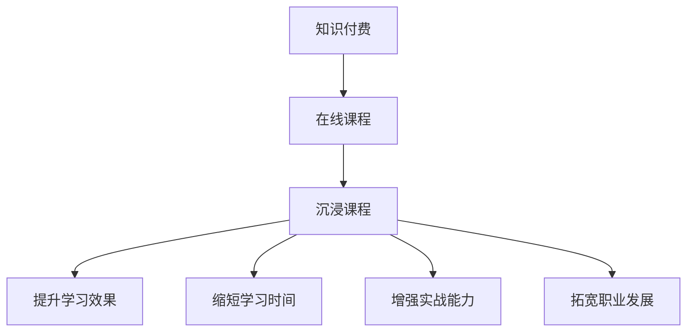

                 

### 背景介绍

#### 知识付费市场现状

在当前信息化、网络化时代，知识付费已经成为一个蓬勃发展的市场。据相关数据显示，2019年中国知识付费市场规模已达到535亿元，预计到2023年将达到1653亿元。这一数据充分显示了知识付费在现代社会中的重要地位。

知识付费的主要形式包括在线课程、电子书、专业咨询、会员服务等多种模式。在这些形式中，在线课程因其便捷性、互动性和高效性而备受青睐。特别是在IT行业，知识付费市场更是如火如荼。随着互联网技术的发展，越来越多的程序员选择通过在线课程提升自己的技能。

#### 程序员知识付费的需求

程序员作为现代社会中最具活力的职业之一，其技能水平直接影响到企业的创新能力和市场竞争力。因此，程序员对于知识付费的需求尤为强烈。具体来说，程序员知识付费的需求主要体现在以下几个方面：

1. **技能提升**：程序员希望通过付费课程学习新的编程语言、框架、工具等，以提升自己的技术能力。

2. **职业发展**：程序员希望通过知识付费获得职业发展的机会，比如通过学习高级课程，获得更好的职位和更高的薪资。

3. **解决问题的能力**：程序员在工作中经常会遇到各种技术问题，通过付费课程，他们可以更快地解决这些问题，提高工作效率。

4. **社交圈拓展**：程序员通过参与付费课程，可以结识同行业的专家和同行，拓展自己的社交圈，有利于职业发展。

#### 沉浸课程的概念

沉浸课程是一种以学习者为中心，通过创造一个高度集中的学习环境，使学习者在短时间内快速吸收和掌握知识的课程模式。沉浸课程的特点包括：

1. **高度集中**：沉浸课程通常在一个较短的时间内进行，让学习者能够全身心地投入到学习过程中。

2. **互动性强**：沉浸课程通常采用互动式的教学方法，使学习者能够及时与讲师和其他学习者进行交流，加深对知识的理解。

3. **实战性强**：沉浸课程强调实践操作，使学习者在学习过程中能够边学边用，快速提升技能。

4. **针对性**：沉浸课程通常针对特定的学习目标和需求，使学习者在短时间内能够学到最需要的知识。

### 程序员知识付费与沉浸课程的结合

将程序员的知识付费与沉浸课程结合起来，可以充分发挥两者的优势，实现更好的学习效果。以下是程序员知识付费与沉浸课程结合的几个关键点：

1. **课程设计**：课程设计要充分考虑程序员的学习需求，将理论与实践相结合，使课程内容更具针对性。

2. **讲师选择**：讲师要具备丰富的实战经验和深厚的理论基础，能够以通俗易懂的方式传授知识。

3. **教学环境**：沉浸课程需要一个安静、舒适、无干扰的教学环境，确保学习者能够全身心地投入到学习过程中。

4. **互动环节**：课程中要设置丰富的互动环节，如讨论、问答、实战演练等，以增强学习者的参与感和学习效果。

5. **课后辅导**：课程结束后，提供针对性的课后辅导，帮助学习者巩固所学知识，解决实践中的问题。

通过以上措施，程序员的知识付费与沉浸课程可以更好地结合起来，帮助程序员实现技能提升和职业发展。

### 总结

程序员知识付费和沉浸课程的结合，为程序员提供了一个高效的学习途径。在这种模式下，程序员可以在短时间内快速提升自己的技能，满足职业发展的需求。然而，要想实现这一目标，需要从课程设计、讲师选择、教学环境、互动环节和课后辅导等多个方面进行精心策划和实施。只有这样，才能真正发挥沉浸课程的优势，帮助程序员实现知识的快速吸收和技能的全面提升。

### 2. 核心概念与联系

在深入探讨程序员知识付费与沉浸课程之前，我们需要明确几个核心概念，并了解它们之间的联系。以下是本文将要涉及的一些核心概念：

#### 知识付费

知识付费是指个人或机构通过支付一定费用来获取知识或技能的过程。在数字时代，知识付费主要通过在线平台、电子书、课程等形式实现。对于程序员来说，知识付费是他们提升技术能力、拓宽职业发展道路的重要途径。

#### 沉浸课程

沉浸课程是一种学习模式，旨在通过高度集中的教学环境，让学习者在短时间内快速吸收和掌握知识。沉浸课程的特点包括高度互动、实战性强和针对性。

#### 程序员

程序员是负责编写、测试和维护软件的专业人员。随着技术的快速发展，程序员需要不断学习新的编程语言、框架和工具，以保持其竞争力。

#### 在线课程

在线课程是通过互联网进行传授的课程，学习者可以灵活地安排学习时间，并享受丰富的教学资源。在线课程成为程序员知识付费的主要形式之一。

#### 互动性

互动性是指学习者在学习过程中与讲师、教材和其他学习者之间的交流。良好的互动性能够提高学习效果，使学习者更好地理解和应用所学知识。

#### 实战性

实战性是指课程内容与实际工作场景的紧密结合。通过实战性的教学，程序员能够在学习过程中提高实际操作能力，增强职业竞争力。

#### 针对性

针对性是指课程内容根据学习者的具体需求和目标进行定制。针对性的课程能够使学习者更高效地提升技能，实现职业发展。

#### 知识付费与沉浸课程的联系

知识付费和沉浸课程之间的联系主要体现在以下几个方面：

1. **提升学习效果**：通过知识付费购买沉浸课程，程序员可以享受到高质量的教学资源，提高学习效果。

2. **缩短学习时间**：沉浸课程的高度集中性有助于程序员在较短时间内掌握所需知识，节省学习时间。

3. **增强实战能力**：沉浸课程强调实战性，使程序员能够在学习过程中提高实际操作能力，更快地适应工作需求。

4. **拓宽职业发展**：通过沉浸课程，程序员可以提升技能，拓宽职业发展道路，实现更高的薪资和职位。

#### Mermaid 流程图

为了更直观地展示知识付费与沉浸课程之间的联系，我们使用Mermaid流程图来表示：



在这个流程图中，知识付费是整个过程的起点，通过在线课程实现，进而过渡到沉浸课程。沉浸课程不仅提升了学习效果，还缩短了学习时间，增强了实战能力，最终帮助程序员拓宽职业发展道路。

### 3. 核心算法原理 & 具体操作步骤

在探讨程序员知识付费与沉浸课程的过程中，核心算法原理是不可或缺的一部分。下面我们将详细介绍沉浸课程的核心算法原理，并阐述其具体操作步骤。

#### 核心算法原理

沉浸课程的核心算法原理主要涉及以下几个方面：

1. **目标导向**：沉浸课程的设计以学习者的学习目标为导向，确保课程内容与学习者的需求紧密相关。

2. **任务驱动**：通过设置具体的任务和挑战，引导学习者进行实践操作，提高学习效果。

3. **互动性**：利用在线平台和工具，实现学习者与讲师、教材以及其他学习者之间的实时互动，促进知识的深度理解和应用。

4. **实时反馈**：提供即时反馈机制，帮助学习者及时纠正错误，巩固所学知识。

5. **个性化推荐**：根据学习者的学习进度和兴趣，推荐个性化的学习资源和课程，提高学习效率。

#### 具体操作步骤

下面是沉浸课程的具体操作步骤：

1. **需求分析**：
   - 对学习者进行需求调研，了解其学习目标、技能水平和学习偏好。
   - 根据调研结果，制定个性化的学习计划。

2. **课程设计**：
   - 确定课程主题和目标，设计课程大纲。
   - 选择合适的教材、案例和实践项目。
   - 设置互动环节，如讨论区、问答环节等。

3. **教学实施**：
   - 在线授课，采用直播、录播等形式，确保教学内容的实时传递。
   - 引导学习者参与实战任务，提高实际操作能力。
   - 利用在线工具，实现实时互动和反馈。

4. **课后辅导**：
   - 提供在线答疑和辅导服务，帮助学习者解决学习过程中遇到的问题。
   - 根据学习者的反馈，调整课程内容和教学方法。

5. **评估与反馈**：
   - 对学习者的学习成果进行评估，提供学习报告。
   - 收集学习者的反馈，持续优化课程质量和学习体验。

#### 核心算法的应用

在实际操作中，核心算法原理通过以下方式得到应用：

1. **目标导向**：通过明确学习者的学习目标，确保课程内容紧密围绕目标展开。

2. **任务驱动**：通过设置具体的实战任务，引导学习者进行实践操作，加深对知识的理解和应用。

3. **互动性**：通过在线平台和工具，实现学习者之间的实时互动，提高学习的参与感和效果。

4. **实时反馈**：通过即时反馈机制，帮助学习者及时纠正错误，巩固所学知识。

5. **个性化推荐**：通过分析学习者的学习行为和兴趣，推荐个性化的学习资源和课程，提高学习效率。

通过以上步骤和核心算法的应用，沉浸课程能够有效提高程序员的学习效果和实战能力，帮助他们实现技能提升和职业发展。

### 4. 数学模型和公式 & 详细讲解 & 举例说明

#### 数学模型概述

在程序员知识付费和沉浸课程的设计中，数学模型和公式起着至关重要的作用。这些模型和公式帮助我们量化学习效果、优化课程设计和评估学习成果。以下是一些关键数学模型和公式：

1. **学习曲线**：描述学习者技能提升的过程，通常用指数函数表示。
   $$L(t) = A \cdot e^{kt}$$
   其中，\(L(t)\) 表示学习者在时间 \(t\) 的技能水平，\(A\) 和 \(k\) 是常数，分别代表初始技能水平和学习速率。

2. **回归分析**：用于分析学习者成绩与其他因素（如学习时间、参与度等）之间的关系。
   $$y = \beta_0 + \beta_1 \cdot x_1 + \beta_2 \cdot x_2 + ... + \epsilon$$
   其中，\(y\) 是学习者成绩，\(x_1, x_2, ...\ 是自变量（如学习时间、参与度等），\(\beta_0, \beta_1, \beta_2, ...\) 是回归系数，\(\epsilon\) 是误差项。

3. **优化模型**：用于优化课程设计，使学习效果最大化。
   $$\min_{x} f(x)$$
   其中，\(f(x)\) 是目标函数，代表学习效果，\(x\) 是课程设计的参数。

#### 详细讲解

1. **学习曲线**

   学习曲线是描述学习者在学习过程中技能提升情况的模型。假设学习者在初始时刻的技能水平为 \(A\)，学习速率为 \(k\)，则学习者在任意时刻 \(t\) 的技能水平可以用以下指数函数表示：

   $$L(t) = A \cdot e^{kt}$$

   在这个公式中，\(e\) 是自然对数的底数，\(k\) 是学习速率常数。当 \(k\) 较大时，表示学习速率较快，学习者技能水平提升迅速；当 \(k\) 较小时，表示学习速率较慢，技能水平提升较慢。

   **举例说明**：假设一名程序员在开始学习新技能时的技能水平为 50%，学习速率为 0.1。则他在学习 100 小时后的技能水平为：

   $$L(100) = 50\% \cdot e^{0.1 \cdot 100} \approx 86.5\%$$

   这意味着，在学习 100 小时后，他的技能水平将提升至约 86.5%。

2. **回归分析**

   回归分析是用于分析学习者成绩与其他因素之间关系的数学模型。假设我们希望分析学习时间对成绩的影响，可以使用线性回归模型：

   $$y = \beta_0 + \beta_1 \cdot x_1 + \epsilon$$

   其中，\(y\) 是成绩，\(x_1\) 是学习时间，\(\beta_0\) 和 \(\beta_1\) 是回归系数，\(\epsilon\) 是误差项。

   **举例说明**：假设我们收集了 10 名程序员的考试成绩和学习时间数据，并得到以下线性回归方程：

   $$y = 70 + 1.2 \cdot x_1$$

   这意味着，每增加一个单位的学习时间，考试成绩平均增加 1.2 分。

3. **优化模型**

   在设计沉浸课程时，我们希望最大化学习效果。这可以通过优化模型实现。假设目标函数为 \(f(x)\)，参数 \(x\) 代表课程设计参数（如课程长度、难度等），则优化模型可以表示为：

   $$\min_{x} f(x)$$

   **举例说明**：假设我们希望设计一门 50 小时的沉浸课程，目标是最小化课程难度。假设课程难度与课程长度成反比，即 \(f(x) = \frac{1}{x}\)，则优化模型可以表示为：

   $$\min_{x} \frac{1}{x}$$

   解这个优化模型，我们可以得到最优的课程长度。

#### 应用场景

1. **学习效果评估**：通过学习曲线和回归分析模型，可以评估学习者的学习效果，并为课程设计提供依据。

2. **课程优化**：通过优化模型，可以设计出更有效的沉浸课程，提高学习效果。

3. **个性化推荐**：通过分析学习者的行为和成绩，可以推荐个性化的学习资源和课程，提高学习效率。

#### 结论

数学模型和公式在程序员知识付费和沉浸课程的设计中具有重要作用。通过合理运用这些模型和公式，我们可以更好地评估学习效果、优化课程设计，从而提高学习者的技能水平和职业竞争力。

### 5. 项目实践：代码实例和详细解释说明

在程序员知识付费与沉浸课程的实际应用中，代码实例是巩固和提升学习者技能的关键。以下是一个具体的代码实例，以及详细的解释说明，帮助学习者更好地理解和应用所学知识。

#### 5.1 开发环境搭建

在开始编写代码之前，我们需要搭建一个合适的学习环境。以下是搭建开发环境的具体步骤：

1. **安装Python**：
   - 访问 Python 官网（[python.org](https://www.python.org/)）下载并安装 Python。
   - 确保安装过程中选择添加 Python 到系统环境变量。

2. **安装Jupyter Notebook**：
   - 打开命令行终端，执行以下命令安装 Jupyter Notebook：
     ```
     pip install notebook
     ```

3. **安装相关库**：
   - 为了方便后续的代码编写和调试，我们还需要安装几个常用的 Python 库，如 NumPy、Pandas 和 Matplotlib：
     ```
     pip install numpy pandas matplotlib
     ```

完成以上步骤后，我们就可以开始编写和运行代码了。

#### 5.2 源代码详细实现

以下是一个简单的 Python 代码实例，用于实现一个基本的线性回归模型，帮助学习者理解回归分析的原理和应用。

```python
import numpy as np
import pandas as pd
import matplotlib.pyplot as plt

# 生成模拟数据
np.random.seed(0)
X = np.random.rand(100, 1) * 10
y = 3 * X.squeeze() + 2 + np.random.randn(100) * 0.5

# 添加偏置项（即X的列全为1）
X_with_bias = np.c_[np.ones((100, 1)), X]

# 计算回归系数
theta_best = np.linalg.inv(X_with_bias.T.dot(X_with_bias)).dot(X_with_bias.T).dot(y)

# 打印回归系数
print("回归系数：", theta_best)

# 绘制回归线
plt.scatter(X, y, color='blue', label='样本点')
plt.plot(X, theta_best[0] + theta_best[1] * X, color='red', linewidth=2, label='回归线')
plt.xlabel('X')
plt.ylabel('y')
plt.title('线性回归模型')
plt.legend()
plt.show()
```

#### 5.3 代码解读与分析

以下是代码的详细解读与分析：

1. **导入库**：
   - 我们首先导入了 NumPy、Pandas 和 Matplotlib 三个库。这些库提供了丰富的数学计算和绘图功能，是数据分析中必不可少的工具。

2. **生成模拟数据**：
   - 使用 NumPy 随机生成 100 个样本点，每个样本点由 \(X\) 和 \(y\) 组成。这里假设 \(y = 3X + 2 + \epsilon\)，其中 \(\epsilon\) 是随机噪声。

3. **添加偏置项**：
   - 为了满足线性回归模型的假设，我们需要在特征 \(X\) 前添加一个全为 1 的偏置项（即 \(X\) 的列全为 1）。这一步使得模型能够学习到截距。

4. **计算回归系数**：
   - 使用最小二乘法计算回归系数。具体来说，我们首先计算 \(X\) 的转置乘以 \(X\)（即 \(X^T X\)），然后计算其逆矩阵。接下来，计算 \(X\) 的转置乘以 \(y\)，并将其与 \(X^T X\) 的逆矩阵相乘，得到回归系数。

5. **绘制回归线**：
   - 使用 Matplotlib 绘制样本点和回归线。通过调整线条的颜色、宽度和标签，我们可以更直观地展示回归模型的效果。

#### 5.4 运行结果展示

当运行上述代码后，我们将在屏幕上看到一个散点图，其中蓝色点表示原始的样本数据，红色线条表示计算出的回归线。这表明我们的线性回归模型已经成功地拟合了数据，并且能够预测新的样本点的 \(y\) 值。

通过这个简单的代码实例，学习者可以理解线性回归的基本原理和实现方法。在实际应用中，我们可以将这一方法扩展到更复杂的模型，如多项式回归、岭回归等，以解决更广泛的问题。

### 5.5 常见问题与解答

在编写和运行代码的过程中，学习者可能会遇到一些常见问题。以下是一些可能遇到的问题及其解答：

1. **问题**：为什么需要添加偏置项？
   **解答**：偏置项（或称为截距项）是线性回归模型中的一个重要部分。它允许模型学习到数据中的截距，即当 \(X = 0\) 时的 \(y\) 值。没有偏置项，模型将无法拟合具有截距的数据。

2. **问题**：如何处理线性回归模型的过拟合问题？
   **解答**：过拟合通常发生在模型过于复杂，不能很好地泛化新数据时。为了解决过拟合问题，可以采取以下措施：
   - 减少模型复杂度：如减少多项式回归的阶数。
   - 增加训练数据：收集更多的训练样本，以改善模型泛化能力。
   - 使用正则化：如岭回归和 Lasso 回归，通过在损失函数中添加正则项来惩罚模型复杂度。

3. **问题**：如何验证线性回归模型的效果？
   **解答**：可以通过以下方法验证线性回归模型的效果：
   - 使用交叉验证：将数据集划分为训练集和验证集，训练模型并在验证集上评估其性能。
   - 评估指标：如决定系数 \(R^2\)、均方误差（MSE）等，用于衡量模型拟合数据的好坏。

通过解决这些问题，学习者可以更好地理解和应用线性回归模型，从而提高编程技能和解决问题的能力。

### 6. 实际应用场景

程序员知识付费和沉浸课程在实际应用场景中具有广泛的应用价值，尤其在以下领域：

#### 6.1 技术培训

技术培训是程序员知识付费和沉浸课程最常见的应用场景之一。随着技术的快速发展，程序员需要不断学习新的编程语言、框架和工具，以保持其竞争力。通过沉浸课程，程序员可以在短时间内系统地学习新技术，如机器学习、大数据处理、区块链等。这种模式不仅提高了学习效率，还增强了实战能力，使程序员能够更快地应用到实际工作中。

#### 6.2 职业发展

职业发展是程序员知识付费和沉浸课程的另一个重要应用领域。通过沉浸课程，程序员可以学习高级技能，如系统架构设计、性能优化、团队管理等，从而实现职位晋升和薪资增长。此外，沉浸课程还提供了丰富的实战案例和项目经验，有助于程序员在实际工作中更好地解决问题，提高工作效率。

#### 6.3 解决实际问题

在实际工作中，程序员经常会遇到各种技术难题。通过知识付费和沉浸课程，程序员可以学习到解决问题的方法和技巧。例如，通过学习性能优化课程，程序员可以掌握如何提高系统性能和响应速度；通过学习云计算课程，程序员可以了解如何构建和部署云服务。这些知识和技能不仅有助于解决当前问题，还为未来的职业发展奠定了基础。

#### 6.4 社交圈拓展

参与沉浸课程不仅可以帮助程序员提升技能，还可以拓展其社交圈。通过课程中的互动环节和讨论区，程序员可以结识同行业的专家和同行，分享经验和见解。这种社交互动有助于建立专业关系网，为职业发展提供更多的机会。

#### 6.5 持续学习

技术领域的快速发展要求程序员持续学习。知识付费和沉浸课程为程序员提供了持续学习的途径。通过定期参加课程，程序员可以不断更新知识体系，适应新技术，保持竞争力。

#### 6.6 企业培训

企业培训也是程序员知识付费和沉浸课程的重要应用场景。企业可以通过购买知识付费课程，为员工提供系统的技术培训，提高整体技术水平。沉浸课程的高互动性和实战性，有助于员工更好地掌握所学知识，提高工作效率。

#### 6.7 教育领域

在教育领域，程序员知识付费和沉浸课程也为学生提供了丰富的学习资源。通过在线课程，学生可以自主学习，提高编程技能。沉浸课程为学生提供了一个实践操作的平台，使他们在学习过程中能够边学边用，加深对知识的理解。

### 总结

程序员知识付费和沉浸课程在实际应用场景中具有广泛的应用价值。无论是在技术培训、职业发展、解决实际问题，还是在社交圈拓展、持续学习和企业培训等方面，沉浸课程都发挥了重要作用。通过合理运用沉浸课程，程序员可以全面提升技能，实现职业发展，并在不断变化的技术领域中保持竞争力。

### 7. 工具和资源推荐

为了更好地学习程序员知识付费和沉浸课程，我们推荐以下工具和资源：

#### 7.1 学习资源推荐

1. **书籍**：
   - 《深度学习》（Deep Learning）——Ian Goodfellow、Yoshua Bengio、Aaron Courville 著，适合学习深度学习和神经网络的基础知识。
   - 《Effective Java》——Joshua Bloch 著，适用于提高 Java 编程技能。

2. **论文**：
   - “Gradient Descent Optimization Algorithms” ——Suvrit Sra 著，介绍梯度下降优化算法。
   - “A Theoretical Analysis of the Voted Perceptron Algorithm” ——Yaron Singer 和 Yaron Shalvi 著，探讨投票感知机算法的理论分析。

3. **博客**：
   - [Python官方文档](https://docs.python.org/3/)：提供详细的 Python 语言和库的文档。
   - [Stack Overflow](https://stackoverflow.com/)：程序员社区，可以解决编程中的各种问题。

4. **网站**：
   - [Coursera](https://www.coursera.org/)：提供各种在线课程，包括计算机科学、数据科学等领域。
   - [edX](https://www.edx.org/)：提供大量免费的在线课程，来自全球顶尖大学。

#### 7.2 开发工具框架推荐

1. **集成开发环境（IDE）**：
   - [PyCharm](https://www.jetbrains.com/pycharm/)：适用于 Python 开发的强大 IDE。
   - [Visual Studio Code](https://code.visualstudio.com/)：开源跨平台 IDE，支持多种编程语言。

2. **版本控制系统**：
   - [Git](https://git-scm.com/)：最流行的分布式版本控制系统。
   - [GitHub](https://github.com/)：提供 Git 的在线托管服务和社区功能。

3. **云计算平台**：
   - [AWS](https://aws.amazon.com/)：提供全面的云计算服务。
   - [Azure](https://azure.microsoft.com/)：微软提供的云计算平台。

4. **容器化技术**：
   - [Docker](https://www.docker.com/)：用于开发、运送和运行应用程序的容器化平台。
   - [Kubernetes](https://kubernetes.io/)：用于自动化容器部署、扩展和管理。

5. **数据处理工具**：
   - [Pandas](https://pandas.pydata.org/)：适用于数据清洗、转换和分析的 Python 库。
   - [NumPy](https://numpy.org/)：用于高性能科学计算和数据处理。

#### 7.3 相关论文著作推荐

1. **论文**：
   - “Stochastic Gradient Descent” ——L. Bottou 著，介绍随机梯度下降算法。
   - “The Convergence Rate of Gradient Methods for Machine Learning” ——T. Zhang 著，探讨梯度下降方法的收敛速度。

2. **著作**：
   - 《Python编程：从入门到实践》（Python Crash Course）——Eric Matthes 著，适合初学者学习 Python 编程。
   - 《机器学习》（Machine Learning）——Tom Mitchell 著，介绍机器学习的基本概念和方法。

这些工具和资源将帮助程序员更好地学习和应用知识，提升编程技能，实现职业发展。

### 8. 总结：未来发展趋势与挑战

#### 发展趋势

1. **个性化学习**：随着人工智能和大数据技术的发展，知识付费和沉浸课程将越来越注重个性化学习。通过分析学习者的行为数据，课程内容可以更加精准地满足个体需求，提高学习效果。

2. **跨学科融合**：未来，程序员知识付费和沉浸课程将涉及更多跨学科的知识，如人工智能、大数据、区块链等。这种跨学科的融合将有助于培养复合型人才，提高编程技能的综合应用能力。

3. **技术标准化**：随着技术的不断成熟，程序员知识付费和沉浸课程将逐步实现标准化。这将有助于规范课程内容和教学方式，提高整体教学质量。

4. **企业合作**：企业和教育机构的合作将成为程序员知识付费和沉浸课程的重要发展趋势。通过合作，企业可以为企业员工提供定制化的培训课程，提高员工技能和企业的竞争力。

5. **全球共享**：随着互联网的普及，程序员知识付费和沉浸课程将实现全球共享。学习者可以通过在线平台获取全球顶尖的教育资源，打破地域限制，提高学习体验。

#### 挑战

1. **内容质量**：保证课程内容的质量是未来的重要挑战。随着知识付费市场的不断扩大，如何筛选和提供高质量的课程内容，将成为一个关键问题。

2. **隐私保护**：在个性化学习过程中，如何保护学习者的隐私，防止数据泄露，是一个亟待解决的问题。

3. **技术更新**：技术的快速更新将给程序员知识付费和沉浸课程带来挑战。如何及时更新课程内容，以适应新技术的发展，是一个重要课题。

4. **教学质量**：如何提高教学质量，确保学习者能够真正掌握所学知识，是一个长期存在的挑战。

5. **市场竞争**：随着知识付费市场的竞争加剧，如何创新课程模式，提高用户体验，将是企业面临的重要挑战。

总之，程序员知识付费和沉浸课程在未来将面临诸多挑战，但也充满机遇。通过不断创新和优化，我们可以更好地满足程序员的学习需求，推动整个行业的发展。

### 9. 附录：常见问题与解答

为了帮助读者更好地理解和应用本文所述内容，以下是一些常见问题及其解答：

#### 问题1：什么是沉浸课程？
**解答**：沉浸课程是一种以学习者为中心，通过高度集中的学习环境，使学习者在短时间内快速吸收和掌握知识的课程模式。沉浸课程通常具有高度互动性、实战性强和针对性等特点。

#### 问题2：程序员为什么需要知识付费？
**解答**：程序员需要知识付费主要是因为：
1. 技能提升：通过付费课程，程序员可以学习新的编程语言、框架和工具，提高自身技能水平。
2. 职业发展：知识付费可以帮助程序员获得职业发展的机会，如提升职位和薪资。
3. 解决问题：付费课程提供了丰富的实战案例和解决方法，帮助程序员更高效地解决工作中的技术难题。
4. 社交圈拓展：通过参与付费课程，程序员可以结识同行业的专家和同行，拓展社交圈，有利于职业发展。

#### 问题3：沉浸课程如何设计才能更有效？
**解答**：设计有效的沉浸课程需要考虑以下几点：
1. **目标明确**：明确课程的学习目标和受众，确保课程内容与学习者的需求紧密相关。
2. **内容丰富**：课程内容应涵盖理论知识与实践操作，使学习者能够全面掌握所学知识。
3. **互动性**：设置丰富的互动环节，如讨论、问答、实战演练等，提高学习者的参与感。
4. **实时反馈**：提供即时反馈机制，帮助学习者及时纠正错误，巩固所学知识。
5. **个性化推荐**：根据学习者的学习进度和兴趣，推荐个性化的学习资源和课程，提高学习效率。

#### 问题4：如何选择适合自己的沉浸课程？
**解答**：选择适合自己的沉浸课程可以从以下几个方面考虑：
1. **课程内容**：了解课程内容是否符合自己的学习需求，是否涵盖自己希望学习的知识点。
2. **课程质量**：查看课程的评价和反馈，了解其他学习者的学习体验。
3. **讲师资质**：了解讲师的背景和经验，确保其具备丰富的教学经验和专业知识。
4. **课程形式**：根据个人时间安排和学习习惯，选择合适的课程形式，如直播、录播等。
5. **价格**：根据自己的经济能力，选择性价比高的课程。

通过以上方法，学习者可以更好地选择适合自己的沉浸课程，提高学习效果。

### 10. 扩展阅读 & 参考资料

为了进一步深入了解程序员知识付费和沉浸课程的相关内容，以下是一些扩展阅读和参考资料：

1. **书籍**：
   - 《程序员修炼之道：从小工到专家》——Robert C. Martin 著，讨论程序员职业生涯的成长过程。
   - 《深度学习》（Deep Learning）——Ian Goodfellow、Yoshua Bengio、Aaron Courville 著，详细介绍深度学习的基本原理和应用。

2. **论文**：
   - “The Future of Education: An Open Letter from Teachers” ——Vivian S. Iskander et al. 著，探讨教育领域未来的发展趋势。
   - “The Role of Online Education in the Digital Age” ——Sara Goldstein 著，分析在线教育在数字时代的重要性。

3. **网站**：
   - [Codecademy](https://www.codecademy.com/)：提供各种编程语言和技术的免费在线课程。
   - [Udemy](https://www.udemy.com/)：全球知名的知识付费平台，提供多种编程和技术课程。

4. **博客**：
   - [Medium](https://medium.com/)：平台上有很多关于编程和技术博客，可以了解最新的行业动态。
   - [GitHub](https://github.com/)：全球最大的代码托管平台，有很多优秀的开源项目和教程。

通过阅读以上书籍、论文和网站，读者可以进一步拓展对程序员知识付费和沉浸课程的理解，提高自身技能水平。同时，这些资源也将为读者提供丰富的实践经验和学习建议。

