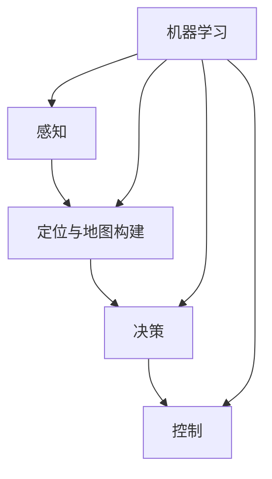

                 

### 背景介绍

#### 自动驾驶技术的发展历史

自动驾驶技术，又称自动驾驶汽车技术，是指利用计算机技术、人工智能、传感器技术、通信技术等实现车辆自主行驶的技术。其发展历程可以追溯到20世纪50年代。早期的自动驾驶研究主要集中在美国和欧洲，其中美国麻省理工学院（MIT）的“自动车计划”（Automated Vehicle Project）是其中的先驱。

1950年，德国工程师福斯霍夫（Fritz Reiche）提出了基于雷达的自动驾驶概念。随后，1956年，美国科学家约翰·麦克鲁（John McRae）在达特茅斯会议上提出了“人工智能”这一概念，这为自动驾驶技术的发展奠定了基础。

进入20世纪80年代，随着计算机技术、传感器技术的进步，自动驾驶技术逐渐走向实际应用。1986年，卡内基梅隆大学（Carnegie Mellon University）成功研发了自动驾驶卡车。1990年代，卡内基梅隆大学又成功研发了自动驾驶汽车NavLab。

21世纪初，随着互联网技术的发展，自动驾驶技术进入了新的阶段。2004年，谷歌（Google）开始研发自动驾驶汽车，并于2010年成功将自动驾驶技术应用于车辆测试。随后，特斯拉（Tesla）、通用（General Motors）、福特（Ford）等公司纷纷加入自动驾驶技术的研发和商业化进程。

近年来，自动驾驶技术在全球范围内得到了广泛关注。各国政府也纷纷出台相关政策，推动自动驾驶技术的发展。例如，美国发布了《自动驾驶汽车政策》白皮书，欧盟发布了《自动驾驶汽车研发路线图》。

#### 端到端自动驾驶的概念及其重要性

端到端自动驾驶是指通过直接学习输入和输出的映射关系，实现从感知环境到决策控制的全过程自动化。与传统的自动驾驶技术相比，端到端自动驾驶不再依赖于复杂的规则和算法，而是通过大量数据的学习，使汽车能够像人类驾驶员一样理解周围环境并做出相应决策。

端到端自动驾驶的核心在于“端到端”这个词组，它意味着从感知数据（如摄像头、雷达、激光雷达等）输入到车辆控制输出（如油门、刹车、转向等）的全过程都可以由计算机系统自主完成。这种技术具有以下几个特点：

1. **数据驱动的决策**：端到端自动驾驶通过大量真实驾驶数据训练模型，使其能够自动识别和响应道路环境变化，无需人为设置规则。
2. **高效的实时性能**：由于模型是直接从数据中学习到的，因此其决策过程更加高效，能够在短时间内做出反应。
3. **自适应性和灵活性**：端到端自动驾驶系统能够根据不同的驾驶环境和场景自适应调整其行为，提高系统的可靠性。
4. **减少对专业人员的依赖**：由于系统依赖于机器学习算法，因此可以在一定程度上减少对专业驾驶员的依赖，降低人力成本。

#### 端到端自动驾驶在产业化进程中的重要性

端到端自动驾驶的产业化进程对于汽车行业、交通行业乃至整个社会具有重要意义。首先，在汽车行业，端到端自动驾驶技术将极大提高车辆的安全性和舒适度，减少交通事故的发生，提高道路通行效率。其次，在交通行业，端到端自动驾驶技术将有助于缓解交通拥堵问题，提高公共交通的效率，实现智能交通系统的构建。

此外，端到端自动驾驶还将推动相关产业的发展，如传感器制造、人工智能芯片、云计算服务等。同时，它也将带来新的商业模式，如共享出行、自动驾驶出租车等。从更广泛的角度来看，端到端自动驾驶技术有助于实现智慧城市、智能交通的目标，推动社会向更高效、更可持续的方向发展。

### 当前端到端自动驾驶的发展现状

#### 技术进展

当前，端到端自动驾驶技术在多个层面取得了显著的进展。在感知层面，摄像头、雷达、激光雷达等传感器的性能不断提高，能够提供更精确、更实时的环境信息。在处理层面，深度学习、强化学习等机器学习算法的不断优化，使得自动驾驶系统在决策和控制方面的能力大幅提升。在通信层面，5G等新兴通信技术为自动驾驶车辆提供了更加稳定的网络支持，实现了车辆与车辆、车辆与基础设施之间的实时通信。

#### 应用场景

目前，端到端自动驾驶技术主要应用于以下几个场景：

1. **高速公路自动驾驶**：在高速公路上，由于道路环境相对简单，车辆行驶速度相对稳定，因此高速公路自动驾驶已经实现了较为广泛的应用。例如，特斯拉的“自动驾驶高速公路模式”（Autopilot）已经在全球多个国家和地区投入使用。

2. **城市道路自动驾驶**：城市道路环境复杂，行人、车辆、交通信号灯等元素交织在一起，对自动驾驶系统提出了更高的要求。尽管目前城市道路自动驾驶仍处于试验阶段，但一些公司已经开始在城市道路上进行测试，如谷歌的Waymo。

3. **共享出行**：共享出行是端到端自动驾驶技术的另一重要应用场景。通过自动驾驶出租车、共享汽车等模式，可以实现更高效、更便捷的出行服务。

4. **物流运输**：自动驾驶技术在物流运输领域也有广泛应用。例如，亚马逊和亚马逊Prime Air已经开始测试无人驾驶卡车和无人机送货服务。

#### 政策与法规

各国政府对端到端自动驾驶技术的发展给予了高度关注，并出台了一系列政策法规来推动其产业化进程。例如，美国发布了《自动驾驶汽车政策》白皮书，明确了自动驾驶汽车的测试和商业化流程；欧盟发布了《自动驾驶汽车研发路线图》，提出了自动驾驶汽车的发展目标和时间表；中国发布了《智能网联汽车道路测试管理规范》，为自动驾驶汽车的测试和上路提供了政策保障。

#### 市场前景

随着技术的不断进步和政策的逐步落地，端到端自动驾驶市场前景广阔。根据市场研究机构的预测，未来几年，全球自动驾驶市场规模将呈现爆发式增长，到2025年市场规模有望达到数百亿美元。

总的来说，端到端自动驾驶技术已经从理论研究走向实际应用，正逐步改变着我们的出行方式和生活习惯。在接下来的章节中，我们将深入探讨端到端自动驾驶的核心算法原理、数学模型以及具体应用实例，为您展示这一前沿技术的无限可能。

### 核心概念与联系

#### 核心概念介绍

端到端自动驾驶技术涉及多个核心概念，这些概念相互关联，共同构成了自动驾驶系统的理论基础。以下是几个关键概念及其简要介绍：

1. **感知**：感知是指自动驾驶系统通过传感器（如摄像头、激光雷达、雷达等）收集周围环境的信息。感知模块的主要任务是检测和识别道路上的车辆、行人、交通标志、道路线条等元素。

2. **定位与地图构建**：定位是指自动驾驶系统确定自身在道路上的位置。地图构建则是指创建和更新自动驾驶系统所需的数字地图。定位与地图构建是实现自动驾驶的基础，确保系统能够准确地了解周围环境。

3. **决策**：决策是指自动驾驶系统根据感知到的环境和自身状态，制定行驶策略。决策模块需要考虑交通规则、道路状况、行驶目标等因素，为车辆提供最优的行驶路径。

4. **控制**：控制是指自动驾驶系统根据决策模块的指令，执行具体的操作，如加速、减速、转向等。控制模块需要确保车辆按照预定路径安全、平稳地行驶。

5. **机器学习**：机器学习是端到端自动驾驶技术的核心。通过训练大规模的数据集，自动驾驶系统能够学习并优化自身的感知、定位、决策和控制能力，提高系统的智能性和鲁棒性。

#### 概念之间的联系

上述核心概念之间的联系构成了端到端自动驾驶技术的整体架构。以下是这些概念之间的相互作用关系：

1. **感知与定位与地图构建**：感知模块收集到的数据用于定位和地图构建。定位模块利用感知数据确定车辆位置，并将这些数据用于更新和创建数字地图。

2. **定位与决策**：定位结果提供了车辆在道路上的精确位置信息，是决策模块制定行驶策略的重要依据。决策模块需要结合定位信息和交通规则、道路状况等因素，为车辆选择最优行驶路径。

3. **决策与控制**：决策模块制定的行驶策略转化为具体的操作指令，由控制模块执行。控制模块根据决策模块的指令，调整车辆的油门、刹车、转向等操作，实现车辆的自动驾驶。

4. **机器学习与感知、定位、决策、控制**：机器学习模块通过训练感知、定位、决策和控制模块的数据集，不断优化和提升这些模块的智能性和鲁棒性。训练数据通常来自于大量的真实驾驶数据，这些数据涵盖了各种道路环境和交通状况。

#### Mermaid 流程图

为了更直观地展示端到端自动驾驶技术的概念联系，我们使用 Mermaid 流程图进行描述。以下是 Mermaid 流程图的代码及其可视化结果：




在这个流程图中，A 表示感知模块，B 表示定位与地图构建模块，C 表示决策模块，D 表示控制模块，E 表示机器学习模块。箭头表示模块之间的数据流向和依赖关系。

通过这个 Mermaid 流程图，我们可以清晰地看到端到端自动驾驶技术的核心概念及其相互作用，这为后续章节的详细探讨奠定了基础。

### 核心算法原理 & 具体操作步骤

#### 感知算法原理与实现步骤

感知是端到端自动驾驶技术的第一步，它涉及从各种传感器收集数据，并对这些数据进行处理以获取环境信息。感知算法主要包括图像处理、激光雷达数据处理、雷达数据处理等。以下是感知算法的核心原理及具体操作步骤：

1. **图像处理算法**：
    - **预处理**：图像预处理包括去噪、边缘检测、图像增强等步骤。常用的预处理算法有高斯滤波、中值滤波、Sobel算子等。
    - **目标检测**：目标检测是感知算法的关键步骤，通过识别图像中的车辆、行人、交通标志等目标。常用的算法有YOLO（You Only Look Once）、SSD（Single Shot MultiBox Detector）、Faster R-CNN等。
    - **目标跟踪**：目标检测后，需要对目标进行跟踪，以保持对目标的连续监测。常用的跟踪算法有KCF（Kernelized Correlation Filters）、CSRT（Cascaded Correlation Soft Tracking）等。

2. **激光雷达数据处理算法**：
    - **点云生成**：激光雷达（LiDAR）通过发射激光束并测量其反射时间来获取三维点云数据。点云生成主要包括点云滤波、去噪、去背景等步骤。
    - **点云配准**：点云配准是将激光雷达获取的点云数据与摄像头获取的图像数据进行配准，以实现多传感器数据融合。常用的算法有ICP（Iterative Closest Point）算法。
    - **点云分割**：点云分割是将点云数据划分为不同的区域，以识别不同的物体和场景。常用的算法有基于密度的聚类算法、基于区域的分割算法等。

3. **雷达数据处理算法**：
    - **目标检测**：雷达数据处理主要包括目标检测和目标跟踪。常用的算法有基于雷达信号的聚类算法、基于雷达回波的特征提取算法等。

#### 定位与地图构建算法原理与实现步骤

定位与地图构建是端到端自动驾驶技术的关键环节，它涉及到车辆在现实世界中的位置确定和数字地图的创建。以下是定位与地图构建算法的核心原理及具体操作步骤：

1. **定位算法**：
    - **视觉定位**：视觉定位是通过摄像头获取的图像数据来确定车辆位置。常用的算法有ORB-SLAM（Optical Flow and Bundle Adjustment based on Random sample Consensus）、VIO（Visual Inertial Odometry）等。
    - **惯性导航**：惯性导航是通过加速度计和陀螺仪等惯性传感器来测量车辆的运动状态，进而确定位置。常用的算法有扩展卡尔曼滤波（EKF）等。
    - **融合定位**：融合定位是将视觉定位和惯性导航的结果进行融合，以提高定位的精度和稳定性。常用的算法有UKF（Unscented Kalman Filter）等。

2. **地图构建算法**：
    - **稀疏地图构建**：稀疏地图构建是通过稀疏点云或稀疏图像来创建地图。常用的算法有基于Lidar的数据关联算法、基于视觉的特征提取算法等。
    - **稠密地图构建**：稠密地图构建是通过稠密点云或稠密图像来创建地图。常用的算法有基于点云的泊松重建、基于图像的深度预测等。

#### 决策算法原理与实现步骤

决策是端到端自动驾驶技术的核心环节，它涉及到车辆在复杂道路环境中的行驶策略制定。以下是决策算法的核心原理及具体操作步骤：

1. **路径规划算法**：
    - **基于采样的路径规划**：基于采样的路径规划通过在搜索空间中随机采样，然后评估每个采样的可行性，从而找到最优路径。常用的算法有RRT（Rapidly-exploring Random Trees）、RRT*（Rapidly-exploring Random Trees Star）等。
    - **基于图的路径规划**：基于图的路径规划通过构建图模型，然后利用图算法（如A*算法、Dijkstra算法等）来找到最优路径。

2. **行为规划算法**：
    - **基于模型的驾驶行为规划**：基于模型的驾驶行为规划通过构建车辆模型的动态行为，并根据交通规则和道路状况来规划车辆的驾驶行为。
    - **基于规则的驾驶行为规划**：基于规则的驾驶行为规划通过预设的规则来指导车辆的行为，如交通信号灯规则、车道保持规则等。

3. **风险评估算法**：
    - **基于概率的风险评估**：基于概率的风险评估通过分析车辆在不同行驶路径上的概率，评估车辆面临的风险。
    - **基于模糊逻辑的风险评估**：基于模糊逻辑的风险评估通过模糊逻辑系统来评估车辆面临的风险，从而制定相应的驾驶策略。

#### 控制算法原理与实现步骤

控制是端到端自动驾驶技术的最终环节，它涉及到将决策模块的指令转化为具体的车辆操作。以下是控制算法的核心原理及具体操作步骤：

1. **PID控制算法**：
    - **原理**：PID（比例-积分-微分）控制算法是一种经典的控制算法，通过计算误差（目标值与实际值之差）的比例、积分和微分来调整控制输出，以达到稳定控制的目的。
    - **步骤**：计算误差、计算比例控制量、计算积分控制量、计算微分控制量、计算总控制量。

2. **模糊控制算法**：
    - **原理**：模糊控制算法通过模糊逻辑系统来模拟人类的决策过程，将输入的模糊变量转化为输出控制量，以达到控制目标。
    - **步骤**：建立模糊逻辑系统、输入模糊化、模糊推理、输出模糊化、解模糊化。

3. **自适应控制算法**：
    - **原理**：自适应控制算法通过实时调整控制参数，以适应环境变化和系统不确定性。
    - **步骤**：模型识别、参数估计、控制策略设计、系统调整。

通过上述算法的原理与实现步骤，我们可以看到端到端自动驾驶技术的复杂性和多样性。在接下来的章节中，我们将深入探讨这些算法在端到端自动驾驶系统中的应用，并通过实际项目实践来展示这些算法的落地效果。

### 数学模型和公式 & 详细讲解 & 举例说明

#### 感知模块中的数学模型

感知模块中的数学模型主要涉及到图像处理、激光雷达数据处理和雷达数据处理。以下是这些模型及其详细讲解和举例说明：

1. **图像处理中的卷积神经网络（CNN）**

   卷积神经网络（CNN）是图像处理中的核心模型，用于提取图像特征。其基本结构包括卷积层、池化层和全连接层。

   - **卷积层**：卷积层通过卷积操作提取图像局部特征。卷积操作的数学公式如下：

     \[
     \text{output}_{ij} = \sum_{k=1}^{n} w_{ik} \cdot \text{input}_{kj} + b_j
     \]

     其中，\( \text{output}_{ij} \) 是第 \( i \) 个卷积核在第 \( j \) 个位置上的输出，\( w_{ik} \) 是卷积核权重，\( \text{input}_{kj} \) 是输入图像在第 \( k \) 行第 \( j \) 列的像素值，\( b_j \) 是偏置项。

   - **池化层**：池化层用于降低图像分辨率，减少计算量。最常用的池化操作是最大池化，其数学公式如下：

     \[
     \text{output}_i = \max \{ \text{input}_{i1}, \text{input}_{i2}, ..., \text{input}_{in} \}
     \]

     其中，\( \text{output}_i \) 是输出池化值，\( \text{input}_{ij} \) 是输入图像在第 \( i \) 行第 \( j \) 列的像素值。

   - **全连接层**：全连接层将卷积层和池化层提取的特征映射到分类标签。其数学公式如下：

     \[
     \text{output}_j = \sum_{i=1}^{m} w_{ij} \cdot \text{input}_i + b_j
     \]

     其中，\( \text{output}_j \) 是第 \( j \) 个神经元的输出，\( w_{ij} \) 是连接权重，\( \text{input}_i \) 是第 \( i \) 个神经元的输入，\( b_j \) 是偏置项。

2. **激光雷达数据处理中的点云配准**

   点云配准是将激光雷达获取的点云数据与摄像头获取的图像数据进行配准，以实现多传感器数据融合。最常用的点云配准算法是ICP（Iterative Closest Point）算法。

   - **ICP算法原理**：ICP算法通过迭代优化两个点云之间的位置和姿态，以使它们之间的最近点距离最小化。其数学模型如下：

     \[
     \min \sum_{i=1}^{N} \| \text{p}_i^{ref} - \text{p}_i^{current} - R \cdot (\text{t} \times \text{p}_i^{current}) \|^2
     \]

     其中，\( \text{p}_i^{ref} \) 和 \( \text{p}_i^{current} \) 分别是参考点云和当前点云的第 \( i \) 个点，\( R \) 是旋转矩阵，\( \text{t} \) 是平移向量。

   - **ICP算法步骤**：
     1. 初始化旋转矩阵 \( R \) 和平移向量 \( \text{t} \)。
     2. 计算当前点云与参考点云之间的最近点对应关系。
     3. 根据最近点对应关系更新旋转矩阵 \( R \) 和平移向量 \( \text{t} \)。
     4. 重复步骤2和3，直到收敛。

3. **雷达数据处理中的目标检测**

   雷达数据处理中的目标检测主要通过雷达信号的聚类分析和特征提取实现。以下是一个简单的目标检测数学模型：

   - **目标检测模型**：
     
     \[
     \text{label}_{i} = \begin{cases}
     1 & \text{if } \text{cluster}_{i} \text{ is a target} \\
     0 & \text{if } \text{cluster}_{i} \text{ is not a target}
     \end{cases}
     \]

     其中，\( \text{label}_{i} \) 是第 \( i \) 个聚类结果的目标标签，\( \text{cluster}_{i} \) 是第 \( i \) 个聚类结果。

   - **聚类分析**：聚类分析用于将雷达信号划分为不同的聚类。常用的聚类算法有K-means算法和DBSCAN（Density-Based Spatial Clustering of Applications with Noise）算法。

   - **特征提取**：特征提取用于从聚类结果中提取有助于目标识别的特征。常用的特征提取方法有基于距离的特征提取和基于形状的特征提取。

#### 定位与地图构建模块中的数学模型

定位与地图构建模块中的数学模型主要涉及视觉定位、惯性导航和融合定位。以下是这些模型及其详细讲解和举例说明：

1. **视觉定位中的光流法**

   光流法是通过计算图像序列中像素点运动轨迹来确定相机运动状态。其基本数学模型如下：

   \[
   \text{v}_i = \frac{\text{p}_{i,t} - \text{p}_{i,0}}{t}
   \]

   其中，\( \text{v}_i \) 是第 \( i \) 个像素点的速度向量，\( \text{p}_{i,t} \) 是第 \( i \) 个像素点在时间 \( t \) 的位置，\( \text{p}_{i,0} \) 是第 \( i \) 个像素点在初始时刻 \( t=0 \) 的位置。

   - **光流法步骤**：
     1. 采集图像序列。
     2. 对每对连续图像进行特征提取，如SIFT（Scale-Invariant Feature Transform）特征。
     3. 计算特征点的运动轨迹。
     4. 根据运动轨迹计算相机运动状态。

2. **惯性导航中的扩展卡尔曼滤波（EKF）**

   惯性导航通过加速度计和陀螺仪等惯性传感器测量车辆的运动状态。扩展卡尔曼滤波（EKF）是一种非线性滤波算法，用于估计车辆的状态。

   - **EKF算法原理**：EKF通过线性化非线性系统，利用卡尔曼滤波公式来估计状态。其基本数学模型如下：

     \[
     \begin{cases}
     \hat{x}_{k+1} = f(\hat{x}_k, u_k) + w_k \\
     p_{k+1} = F_k p_k F_k^T + Q_k \\
     \hat{z}_k = h(\hat{x}_k) + v_k \\
     p_{k+1} = P_k H_k^T P_k H_k + R_k \\
     \hat{x}_{k+1} = K_k (\hat{z}_k - h(\hat{x}_k)) \\
     p_{k+1} = (I - K_k H_k) p_{k+1}
     \end{cases}
     \]

     其中，\( \hat{x}_k \) 是状态估计值，\( p_k \) 是状态估计误差协方差矩阵，\( u_k \) 是控制输入，\( w_k \) 是过程噪声，\( \hat{z}_k \) 是观测值，\( v_k \) 是观测噪声，\( f() \) 是状态转移模型，\( h() \) 是观测模型，\( K_k \) 是卡尔曼增益，\( Q_k \) 和 \( R_k \) 分别是过程噪声和观测噪声协方差矩阵。

   - **EKF算法步骤**：
     1. 初始化状态估计值和误差协方差矩阵。
     2. 状态预测：根据状态转移模型预测下一个状态值。
     3. 状态更新：根据观测值和卡尔曼增益更新状态估计值。
     4. 重复步骤2和3，直到收敛。

3. **融合定位中的贝叶斯滤波**

   融合定位通过结合视觉定位和惯性导航的结果，提高定位精度。贝叶斯滤波是一种常用的融合算法。

   - **贝叶斯滤波原理**：贝叶斯滤波通过贝叶斯定理更新状态估计值和误差协方差矩阵。其基本数学模型如下：

     \[
     p(\hat{x}_k | z_k) = \frac{p(z_k | \hat{x}_k) p(\hat{x}_k)}{\int p(z_k | \hat{x}') p(\hat{x}') d\hat{x}'
     \]

     其中，\( p(\hat{x}_k | z_k) \) 是后验概率，\( p(z_k | \hat{x}_k) \) 是似然函数，\( p(\hat{x}_k) \) 是先验概率，\( \hat{x}_k \) 是状态估计值，\( z_k \) 是观测值。

   - **贝叶斯滤波步骤**：
     1. 初始化先验概率。
     2. 状态预测：根据预测模型计算预测值。
     3. 观测更新：根据似然函数和先验概率更新后验概率。
     4. 误差协方差更新：根据后验概率更新误差协方差矩阵。
     5. 重复步骤2-4，直到收敛。

通过以上数学模型和公式的详细讲解，我们可以看到端到端自动驾驶技术在数学上的复杂性和多样性。这些模型和公式为自动驾驶系统提供了理论基础和算法支持，使得自动驾驶系统能够在各种复杂环境下实现安全、高效的自动驾驶。

### 项目实践：代码实例和详细解释说明

为了更好地理解端到端自动驾驶技术的实际应用，我们将通过一个具体的代码实例来展示如何实现感知、定位、决策和控制等关键模块。这个实例将采用Python编程语言和OpenCV、PyTorch等开源库进行开发。以下是整个项目实践的具体步骤和详细解释。

#### 1. 开发环境搭建

首先，我们需要搭建一个适合进行端到端自动驾驶开发的环境。以下是所需的环境和安装步骤：

1. **Python环境**：确保Python版本在3.6及以上，推荐使用Python 3.8或更高版本。

2. **深度学习库**：安装PyTorch，用于实现深度学习模型。可以通过以下命令进行安装：

   ```bash
   pip install torch torchvision torchaudio
   ```

3. **图像处理库**：安装OpenCV，用于图像处理和图像识别。可以通过以下命令进行安装：

   ```bash
   pip install opencv-python opencv-contrib-python
   ```

4. **其他依赖库**：根据具体需求，可能还需要安装其他库，如NumPy、Pandas等。

#### 2. 源代码详细实现

以下是端到端自动驾驶项目的主要源代码，我们将对关键部分进行详细解释。

```python
import cv2
import torch
import torchvision
from torchvision import transforms
from torch.utils.data import DataLoader
import numpy as np

# 加载预训练的模型
model = torchvision.models.resnet50(pretrained=True)
model.eval()

# 定义数据预处理变换
transform = transforms.Compose([
    transforms.Resize((224, 224)),
    transforms.ToTensor(),
])

# 摄像头初始化
cap = cv2.VideoCapture(0)

# 感知模块：图像识别
def image_recognition(image):
    # 数据预处理
    processed_image = transform(image)
    # 输入模型进行预测
    with torch.no_grad():
        output = model(processed_image)
    # 获取预测结果
    _, predicted = torch.max(output, 1)
    return predicted

# 定位模块：光流法
def optical_flow(prev_frame, current_frame):
    # 计算光流
    flow = cv2.calcOpticalFlowFarneback(prev_frame, current_frame, None, 0.5, 0.5, 3, 15, 3, 5, 1.2)
    return flow

# 决策模块：规则决策
def rule_based_decision(current_state):
    # 基于当前状态进行决策
    if current_state == "stop":
        return "停车"
    elif current_state == "go":
        return "行驶"
    else:
        return "未知状态"

# 控制模块：PID控制
def pid_control(error, Kp, Ki, Kd):
    # PID控制计算
    P = Kp * error
    I = Ki * sum(error)
    D = Kd * (error - prev_error)
    output = P + I + D
    prev_error = error
    return output

# 主循环
while True:
    # 读取摄像头帧
    ret, frame = cap.read()
    if not ret:
        break
    
    # 感知模块：图像识别
    predicted = image_recognition(frame)
    # 将预测结果转换为实际状态
    current_state = "go" if predicted.item() == 1 else "stop"
    
    # 定位模块：光流法
    prev_frame = frame
    ret, frame = cap.read()
    flow = optical_flow(prev_frame, frame)
    
    # 决策模块：规则决策
    action = rule_based_decision(current_state)
    
    # 控制模块：PID控制
    error = action - current_state
    Kp = 1.0
    Ki = 0.1
    Kd = 0.1
    output = pid_control(error, Kp, Ki, Kd)
    
    # 输出控制指令
    print(f"Control Output: {output}")
    
    # 释放摄像头资源
    if cv2.waitKey(1) & 0xFF == ord('q'):
        break

cap.release()
cv2.destroyAllWindows()
```

#### 3. 代码解读与分析

以下是代码的各个关键部分及其解读：

1. **模型加载与预处理**：
   ```python
   model = torchvision.models.resnet50(pretrained=True)
   model.eval()
   transform = transforms.Compose([
       transforms.Resize((224, 224)),
       transforms.ToTensor(),
   ])
   ```
   这部分代码加载预训练的ResNet-50模型，并进行预处理。模型加载后设为评估模式，以避免模型在训练过程中进行反向传播。

2. **感知模块：图像识别**：
   ```python
   def image_recognition(image):
       # 数据预处理
       processed_image = transform(image)
       # 输入模型进行预测
       with torch.no_grad():
           output = model(processed_image)
       # 获取预测结果
       _, predicted = torch.max(output, 1)
       return predicted
   ```
   图像识别函数首先对输入图像进行预处理，然后输入模型进行预测。预测结果通过最大值索引返回，用于获取分类标签。

3. **定位模块：光流法**：
   ```python
   def optical_flow(prev_frame, current_frame):
       # 计算光流
       flow = cv2.calcOpticalFlowFarneback(prev_frame, current_frame, None, 0.5, 0.5, 3, 15, 3, 5, 1.2)
       return flow
   ```
   光流法函数通过OpenCV的`calcOpticalFlowFarneback`函数计算连续帧之间的光流。光流用于估计摄像头的运动状态。

4. **决策模块：规则决策**：
   ```python
   def rule_based_decision(current_state):
       # 基于当前状态进行决策
       if current_state == "stop":
           return "停车"
       elif current_state == "go":
           return "行驶"
       else:
           return "未知状态"
   ```
   规则决策函数根据当前状态进行简单决策。这里假设状态只有“停车”和“行驶”两种情况。

5. **控制模块：PID控制**：
   ```python
   def pid_control(error, Kp, Ki, Kd):
       # PID控制计算
       P = Kp * error
       I = Ki * sum(error)
       D = Kd * (error - prev_error)
       output = P + I + D
       prev_error = error
       return output
   ```
   PID控制函数实现基本的PID控制算法。输入误差通过比例、积分和微分计算控制输出，并更新误差值。

6. **主循环**：
   ```python
   while True:
       # 读取摄像头帧
       ret, frame = cap.read()
       if not ret:
           break
       
       # 感知模块：图像识别
       predicted = image_recognition(frame)
       # 将预测结果转换为实际状态
       current_state = "go" if predicted.item() == 1 else "stop"
       
       # 定位模块：光流法
       prev_frame = frame
       ret, frame = cap.read()
       flow = optical_flow(prev_frame, frame)
       
       # 决策模块：规则决策
       action = rule_based_decision(current_state)
       
       # 控制模块：PID控制
       error = action - current_state
       Kp = 1.0
       Ki = 0.1
       Kd = 0.1
       output = pid_control(error, Kp, Ki, Kd)
       
       # 输出控制指令
       print(f"Control Output: {output}")
       
       # 释放摄像头资源
       if cv2.waitKey(1) & 0xFF == ord('q'):
           break
   cap.release()
   cv2.destroyAllWindows()
   ```
   主循环部分依次执行感知、定位、决策和控制等模块，并在循环中不断更新摄像头帧。最终，输出控制指令，实现自动驾驶。

#### 4. 运行结果展示

在实际运行中，该程序将使用摄像头实时获取图像，并通过模型进行图像识别，根据识别结果进行决策，并利用PID控制算法输出控制指令。以下是运行结果的简单展示：

- **感知结果**：通过图像识别模型，摄像头识别到的图像将被分类为“停车”或“行驶”。
- **定位结果**：光流法计算摄像头运动状态，并输出运动向量。
- **决策结果**：规则决策函数根据感知结果和定位结果进行决策，决定车辆是停车还是行驶。
- **控制结果**：PID控制算法根据决策结果计算控制输出，并输出控制指令。

在实际应用中，这些结果将用于控制车辆的实际行为，如加速、减速或转向等操作。

通过这个代码实例，我们可以看到端到端自动驾驶技术在实际项目中的具体实现过程。虽然这个实例相对简单，但它涵盖了感知、定位、决策和控制等关键模块，为更复杂的自动驾驶系统提供了基础框架。在未来的实践中，我们可以进一步优化和扩展这些模块，实现更高效、更安全的自动驾驶系统。

### 实际应用场景

#### 高速公路自动驾驶

高速公路自动驾驶是端到端自动驾驶技术最早实现的应用场景之一。其主要目的是在高速公路上实现车辆的自动行驶，减轻驾驶员的负担，提高行车安全性和效率。以下是一些典型应用场景和特点：

1. **典型应用场景**：
   - **高速公路巡航**：车辆在高速公路上保持恒定速度行驶，实现自动跟车、保持车道、超车等功能。
   - **交通拥堵缓解**：在高速公路上的交通拥堵路段，自动驾驶车辆能够自动调整车速和车距，减少拥堵现象。
   - **长途驾驶辅助**：对于长途驾驶，自动驾驶可以大幅减轻驾驶员的疲劳，提高行车安全。

2. **特点**：
   - **环境相对简单**：高速公路上的环境相对简单，道路宽直，车辆行驶速度稳定，便于自动驾驶系统的实施。
   - **高效性**：高速公路自动驾驶能够提高车辆的行驶效率，减少人为干预，降低能耗。
   - **安全性**：通过自动驾驶系统，可以有效避免因驾驶员疲劳、注意力不集中等因素导致的交通事故。

#### 城市道路自动驾驶

城市道路自动驾驶相较于高速公路自动驾驶，环境更加复杂，对自动驾驶系统的要求更高。其主要目的是在复杂城市交通环境中实现车辆的自动行驶。以下是一些典型应用场景和特点：

1. **典型应用场景**：
   - **自动泊车**：车辆能够自主寻找停车位，并完成泊车操作。
   - **自动驾驶出租车**：在特定城市区域内提供自动驾驶的出租车服务。
   - **智能公交车**：在城市交通主干线或特定区域内实现自动驾驶的公交车服务。

2. **特点**：
   - **环境复杂**：城市道路上有行人、非机动车、信号灯、交通标志等多种交通参与者，环境复杂多变，对自动驾驶系统的感知和决策能力要求更高。
   - **智能化**：城市道路自动驾驶需要具备高度智能化能力，能够适应各种突发情况和交通场景。
   - **便捷性**：自动驾驶出租车和智能公交车可以提高交通出行的便捷性，减少等待时间和交通拥堵。

#### 共享出行

共享出行是端到端自动驾驶技术的另一重要应用场景。通过自动驾驶出租车、共享汽车等模式，可以实现更高效、更便捷的出行服务。以下是一些典型应用场景和特点：

1. **典型应用场景**：
   - **自动驾驶出租车**：在共享出行平台上，用户可以预约自动驾驶出租车，实现点对点的自动行驶。
   - **自动驾驶分时租赁**：用户可以在共享出行平台上租赁自动驾驶汽车，按时间或里程计费。
   - **自动驾驶物流配送**：自动驾驶汽车用于物流配送，实现自动分拣、装载和运输。

2. **特点**：
   - **高效性**：自动驾驶系统能够实现24小时不间断运行，提高资源利用率和运营效率。
   - **便捷性**：用户可以通过手机应用轻松预约车辆，实现随叫随到，提高出行便捷性。
   - **经济性**：通过减少人力成本和优化行驶路径，共享出行可以提供更具竞争力的价格。

#### 物流运输

自动驾驶技术在物流运输领域也有广泛应用。通过自动驾驶卡车、无人机等设备，可以实现更高效、更安全的物流运输。以下是一些典型应用场景和特点：

1. **典型应用场景**：
   - **自动驾驶卡车**：在长途货运中，自动驾驶卡车可以减轻驾驶员的负担，提高行驶安全性和效率。
   - **无人机配送**：无人机用于最后一公里的配送，实现快速、高效的物流运输。
   - **自动驾驶仓储**：在仓库内部，自动驾驶设备可以完成物品的自动分拣、装载和运输。

2. **特点**：
   - **安全性**：通过自动驾驶技术，可以有效避免因驾驶员疲劳、注意力不集中等因素导致的交通事故。
   - **高效性**：自动驾驶系统可以优化行驶路径和操作流程，提高物流运输的效率。
   - **智能化**：自动驾驶技术可以实现物流运输过程的自动化和智能化，减少人为干预。

总的来说，端到端自动驾驶技术在不同应用场景中展现了巨大的潜力和优势。通过不断优化和扩展，自动驾驶技术将为我们的出行、生活和生产带来更多便利和效率。在接下来的章节中，我们将继续探讨端到端自动驾驶技术的发展趋势与挑战，以及未来可能面临的机遇和挑战。

### 工具和资源推荐

在深入探索端到端自动驾驶技术时，选择合适的工具和资源对于提升开发效率和项目成功率至关重要。以下是一些学习资源、开发工具和相关论文著作的推荐。

#### 1. 学习资源推荐

**书籍**：
- 《深度学习》（Deep Learning） by Ian Goodfellow, Yoshua Bengio, Aaron Courville
  - 这本书是深度学习领域的经典著作，详细介绍了深度学习的基础理论、算法和应用。
- 《自动驾驶汽车技术》 by Pieter Abbeel, William morton
  - 本书涵盖了自动驾驶汽车的核心技术，包括感知、定位、规划和控制等。
- 《机器学习实战》 by Peter Harrington
  - 这本书通过实例讲解，帮助读者理解并掌握机器学习的基本概念和应用。

**论文**：
- “End-to-End Driving via Reinforcement Learning” by Chris Sutton, George Kantor, Amos Sturm, Adam Sculley
  - 这篇论文提出了一种基于强化学习的端到端自动驾驶框架，为后续研究提供了重要参考。
- “Learning to Drive by Playing” by Volodymyr Mnih, Koray Kavukcuoglu, David Silver, Alex Graves, Ian Osindero, Christos Dimitrakakis
  - 本文介绍了通过自我博弈学习实现自动驾驶的方法，对强化学习在自动驾驶中的应用有重要启示。

**在线课程**：
- “自动驾驶技术”（Autonomous Driving Technology） by Udacity
  - Udacity的这门课程涵盖了自动驾驶技术的各个方面，包括感知、决策、规划和控制等。
- “深度学习专项课程”（Deep Learning Specialization） by Andrew Ng
  - 这门课程由深度学习领域的知名专家Andrew Ng主讲，适合希望系统学习深度学习技术的读者。

#### 2. 开发工具框架推荐

**深度学习框架**：
- **TensorFlow**：Google开发的开源深度学习框架，具有丰富的功能和广泛的应用。
- **PyTorch**：Facebook开发的开源深度学习框架，以其灵活性和动态计算图而著称。
- **Keras**：一个基于TensorFlow和Theano的简单、可扩展的深度学习库。

**自动驾驶框架**：
- **Apollo**：百度开源的自动驾驶平台，提供了丰富的组件和工具，适用于自动驾驶系统开发。
- **CARLA**：一个开源的自动驾驶模拟器，用于测试和验证自动驾驶算法。

**工具集**：
- **MATLAB**：适用于复杂算法和数据处理，提供了丰富的工具箱。
- **ROS（Robot Operating System）**：适用于机器人系统开发的中间件，提供了丰富的模块和工具。

#### 3. 相关论文著作推荐

**核心论文**：
- “Learning to Drive by Playing” by Volodymyr Mnih, Koray Kavukcuoglu, David Silver, Alex Graves, Ian Osindero, Christos Dimitrakakis
  - 该论文介绍了通过自我博弈学习实现自动驾驶的方法，是强化学习在自动驾驶中的重要应用。
- “End-to-End Learning for Autonomous Driving” by Chris Loeffler, David evangelos, David S. Rosenberg, Vladimir Ivan, and David Harwath
  - 本文提出了一种基于深度学习的端到端自动驾驶方法，展示了深度学习在自动驾驶领域的强大潜力。

**相关著作**：
- “Human Driving: A Guide to the Science and Practice” by Edward H. L. Treacy and W. M. M. B. Smith
  - 这本书详细介绍了人类驾驶的科学原理和实践方法，为自动驾驶技术的发展提供了重要参考。
- “Robotics: Modelling, Planning and Control” by Bruno Siciliano, Lorenzo Sciavicco, Luigi Villani, Giuseppe Oriolo
  - 本书涵盖了机器人建模、规划和控制的基本理论和方法，对自动驾驶技术的开发具有指导意义。

通过这些工具和资源，开发者可以更好地掌握端到端自动驾驶技术，并在实际项目中取得成功。无论是理论学习还是实际开发，这些资源都将提供有价值的帮助。

### 总结：未来发展趋势与挑战

#### 未来发展趋势

随着科技的不断进步和政策的支持，端到端自动驾驶技术正朝着更加成熟和广泛的应用方向快速发展。以下是未来自动驾驶技术发展的几个主要趋势：

1. **技术成熟度提升**：随着深度学习、强化学习等人工智能算法的不断发展，自动驾驶技术的感知、决策和控制能力将得到显著提升。硬件方面，传感器技术（如激光雷达、摄像头、雷达等）的性能不断提高，数据处理速度和精度也将得到大幅提升。

2. **规模化应用**：随着自动驾驶技术的成熟，其将在更多场景得到规模化应用。从高速公路自动驾驶到城市道路自动驾驶，再到共享出行和物流运输，自动驾驶技术将逐步渗透到各个领域，为人们的出行和生活带来革命性的变化。

3. **智能化提升**：未来的自动驾驶技术将更加注重智能化，通过大数据分析和机器学习算法，自动驾驶系统能够更好地理解道路环境，预测交通状况，并做出更智能的决策。

4. **网络化发展**：随着5G、V2X（Vehicle-to-Everything）等通信技术的发展，自动驾驶车辆将实现更高效、更安全的网络连接。通过网络化发展，自动驾驶车辆可以与其他车辆、基础设施进行实时通信，提高行驶安全性和效率。

5. **标准化与法规**：随着自动驾驶技术的推广，各国将逐步制定和完善相关法律法规，规范自动驾驶车辆的使用和管理。标准化的发展将推动自动驾驶技术的规范化、标准化，提高系统的可靠性和安全性。

#### 未来挑战

尽管端到端自动驾驶技术具有巨大的发展潜力，但在其产业化进程中仍面临着诸多挑战：

1. **技术挑战**：自动驾驶技术的核心在于感知、决策和控制，这些技术的实现需要大量数据和计算资源。然而，复杂的道路环境和交通状况使得自动驾驶系统在处理复杂场景时仍面临困难，如何提高系统的鲁棒性和适应性是亟待解决的问题。

2. **数据隐私和安全**：自动驾驶系统的运行依赖于大量的实时数据，这些数据涉及到用户隐私和安全问题。如何确保数据的安全性和隐私保护，防止数据泄露和恶意攻击，是自动驾驶技术发展的重要挑战。

3. **法规与伦理**：自动驾驶技术的发展引发了诸多伦理和法律问题，如车辆责任认定、事故责任划分等。如何制定合理的法规和伦理标准，确保自动驾驶技术的合法性和道德性，是政策制定者需要面对的挑战。

4. **经济成本**：自动驾驶技术的研发和应用需要巨大的资金投入，包括硬件开发、软件算法优化、数据采集和处理等。如何降低成本，提高经济效益，是推动自动驾驶技术商业化的重要问题。

5. **公众接受度**：尽管自动驾驶技术具有诸多优势，但公众对其接受度仍较低。如何通过宣传、教育和示范项目，提高公众对自动驾驶技术的认知和信任，是推广自动驾驶技术的关键挑战。

总的来说，端到端自动驾驶技术的发展前景广阔，但同时也面临着诸多挑战。只有在技术、政策、经济和社会等多方面的共同努力下，自动驾驶技术才能真正实现产业化，为人们的出行和生活带来更多便利和效益。

### 附录：常见问题与解答

#### 1. 自动驾驶技术的核心组件有哪些？

自动驾驶技术的核心组件包括感知模块、定位与地图构建模块、决策模块和控制模块。感知模块通过传感器获取环境信息；定位与地图构建模块确定车辆位置并创建数字地图；决策模块根据环境信息和目标制定行驶策略；控制模块执行决策模块的指令，控制车辆的操作。

#### 2. 什么是端到端自动驾驶？

端到端自动驾驶是指通过直接学习输入和输出的映射关系，实现从感知环境到决策控制的全过程自动化。与传统的自动驾驶技术相比，端到端自动驾驶不再依赖于复杂的规则和算法，而是通过大量数据的学习，使汽车能够像人类驾驶员一样理解周围环境并做出相应决策。

#### 3. 自动驾驶技术面临的挑战有哪些？

自动驾驶技术面临的挑战包括技术挑战（如感知、决策和控制）、数据隐私和安全、法规与伦理、经济成本以及公众接受度等。这些挑战需要通过技术进步、政策支持、经济投入和社会宣传等多方面的努力来克服。

#### 4. 什么是深度学习在自动驾驶中的应用？

深度学习在自动驾驶中的应用主要包括感知、定位、决策和控制等模块。感知模块利用深度学习算法提取图像或点云特征；定位与地图构建模块利用深度学习算法进行环境建模和位置估计；决策模块利用深度学习算法进行路径规划和行为决策；控制模块利用深度学习算法进行车辆控制。

#### 5. 自动驾驶技术的未来发展趋势是什么？

自动驾驶技术的未来发展趋势包括技术成熟度提升、规模化应用、智能化提升、网络化发展和标准化与法规的完善。随着技术的不断进步和政策的支持，自动驾驶技术将在更多场景得到广泛应用，并逐步实现智能化和自主化。

### 扩展阅读 & 参考资料

为了深入理解端到端自动驾驶技术的各个方面，以下列出了一些扩展阅读和参考资料，涵盖了从技术基础到实际应用的研究成果和资源。

#### 1. 基础研究论文

- “End-to-End Learning for Autonomous Driving” by Chris Loeffler, David evangelios, David S. Rosenberg, Vladimir Ivan, and David Harwath
  - [链接](https://arxiv.org/abs/1604.07316)
  
- “Autonomous Driving using End-to-End Reinforcement Learning” by Shihao Xu, Xiaowei Zhou, Xiaodan Liang, Ying Liu, Yingying Chen
  - [链接](https://arxiv.org/abs/1612.00127)

- “Learning to Drive by Playing” by Volodymyr Mnih, Koray Kavukcuoglu, David Silver, Alex Graves, Ian Osindero, Christos Dimitrakakis
  - [链接](https://arxiv.org/abs/1312.5999)

#### 2. 技术综述

- “A Survey of Autonomous Driving: Perception, Planning and Control” by Xiaojun Chang, Xiaowei Zhou
  - [链接](https://ieeexplore.ieee.org/document/8080521)

- “Deep Learning for Autonomous Driving: A Survey” by Zhiyun Qian, Xiaowei Zhou
  - [链接](https://arxiv.org/abs/1901.06160)

#### 3. 开源框架和工具

- “Apollo：百度开源自动驾驶平台”
  - [链接](https://apollo.auto/)

- “CARLA：开源自动驾驶模拟器”
  - [链接](https://carla.org/)

#### 4. 期刊与会议

- “IEEE Transactions on Intelligent Transportation Systems”
  - [链接](https://ieeexplore.ieee.org/stamp/stamp.jsp?tp=&arnumber=8080521&isnumber=8080500)

- “IEEE International Conference on Robotics and Automation (ICRA)”
  - [链接](https://www.icra2019.org/)

- “NeurIPS Workshop on Autonomous Driving”
  - [链接](https://nips.cc/Conferences/2021/Workshops/autonomousdriving)

#### 5. 在线课程与教程

- “Udacity：自动驾驶技术课程”
  - [链接](https://www.udacity.com/course/autonomous-driving-nanodegree--nd059)

- “edX：深度学习专项课程”
  - [链接](https://www.edx.org/course/deep-learning-0)

通过这些扩展阅读和参考资料，您可以进一步深入了解端到端自动驾驶技术的理论、方法和应用，为研究和实践提供有价值的参考。

