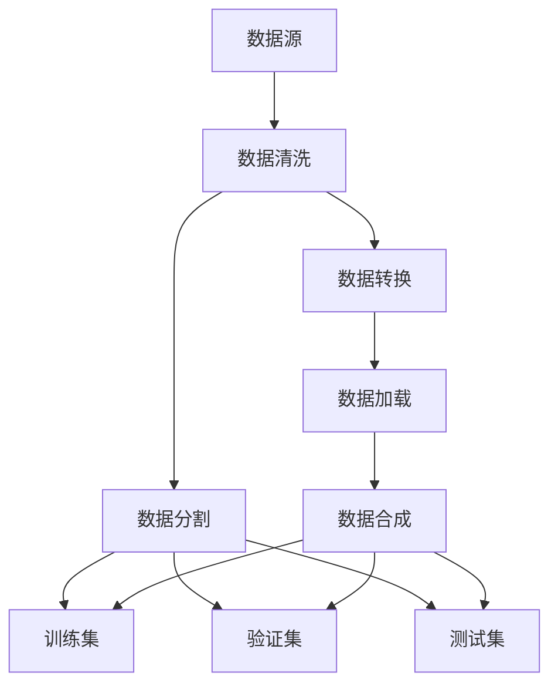

                 

### 第11章 数据集准备：加载与合成数据生成

> **关键词：** 数据集准备，数据加载，数据合成，数据生成，机器学习，深度学习

> **摘要：** 本章节将深入探讨数据集准备的各个方面，包括加载和合成数据生成。我们将理解为何高质量的数据集对机器学习和深度学习模型至关重要，以及如何有效地准备和生成数据集。通过本章节的学习，读者将掌握数据集加载和数据合成的技术，为构建强大的机器学习模型奠定基础。

---

#### 1. 背景介绍

在现代机器学习和深度学习领域，数据是模型的燃料。一个模型的好坏很大程度上取决于其训练数据的质量和多样性。数据集准备是一个关键步骤，它直接影响模型的性能和泛化能力。数据集准备不仅包括数据的收集，还包括数据的清洗、转换和分割等过程。

数据集准备的重要性体现在以下几个方面：

- **数据质量：** 高质量的数据可以减少噪声和异常值，从而提高模型的准确性和可靠性。
- **数据多样性：** 多样化的数据集可以帮助模型学习到更多的模式和特征，提高模型的泛化能力。
- **数据平衡：** 平衡的数据集可以防止模型偏斜，避免因为某些类别的数据不足而导致模型偏见。
- **数据规模：** 大规模的数据集可以为模型提供更多的信息，有助于捕捉复杂的模式和关系。

在本章节中，我们将重点关注数据集准备的两个重要方面：数据加载和数据合成。数据加载是指从不同的数据源（如文件、数据库、网络等）读取数据，并将其转换为模型可用的格式。数据合成是指通过生成新的数据样本来扩充原始数据集，以增强模型的训练效果。

#### 2. 核心概念与联系

为了更好地理解数据集准备的概念，我们可以借助 Mermaid 流程图来展示其核心概念和联系。



**图 2.1：数据集准备流程图**

- **数据源（A）：** 数据的来源，可以是文件、数据库、网络等。
- **数据清洗（B）：** 清除数据中的噪声和异常值，确保数据质量。
- **数据转换（C）：** 将数据转换为模型可用的格式，如数值化、编码等。
- **数据分割（D）：** 将数据集分为训练集、验证集和测试集，用于模型训练和评估。
- **数据加载（E）：** 从数据源读取数据，并将其加载到模型中。
- **数据合成（I）：** 通过生成新的数据样本来扩充原始数据集。

通过上述流程图，我们可以清晰地看到数据集准备的核心概念及其相互关系。

#### 3. 核心算法原理 & 具体操作步骤

3.1 **数据加载算法原理**

数据加载是数据集准备的第一步，其核心目的是从数据源中读取数据，并将其转换为模型可用的格式。常用的数据加载算法包括：

- **文件读取算法：** 通过文件操作，如打开、读取和关闭文件，从文件中读取数据。
- **数据库查询算法：** 使用 SQL 或其他数据库查询语言，从数据库中检索数据。
- **网络请求算法：** 通过 HTTP 请求，从网络上获取数据。

具体操作步骤如下：

1. 确定数据源：根据数据集的特点和需求，选择合适的数据源。
2. 数据预处理：对数据进行清洗和转换，确保数据质量。
3. 数据读取：从数据源中读取数据，并将其转换为模型可用的格式。
4. 数据存储：将处理后的数据存储到本地文件或数据库中，以便后续使用。

3.2 **数据合成算法原理**

数据合成是通过生成新的数据样本来扩充原始数据集，以增强模型的训练效果。常用的数据合成算法包括：

- **随机生成算法：** 根据数据集的统计特征，随机生成新的数据样本。
- **变换生成算法：** 对原始数据进行各种变换，如缩放、旋转、裁剪等，生成新的数据样本。
- **模型生成算法：** 使用生成模型（如 GAN、VAE 等），从原始数据中学习数据分布，并生成新的数据样本。

具体操作步骤如下：

1. 确定合成策略：根据数据集的特点和需求，选择合适的合成策略。
2. 数据预处理：对数据进行清洗和转换，确保数据质量。
3. 数据合成：根据合成策略，生成新的数据样本。
4. 数据合并：将合成后的数据样本与原始数据集合并，形成新的数据集。

#### 4. 数学模型和公式 & 详细讲解 & 举例说明

4.1 **数据加载的数学模型**

数据加载过程中，我们可以使用统计学方法来评估数据的分布和特征。常用的数学模型包括：

- **均值（Mean）：** 数据集的平均值。
- **方差（Variance）：** 数据集的离散程度。
- **标准差（Standard Deviation）：** 方差的平方根，表示数据的波动程度。
- **协方差（Covariance）：** 两个变量的关系，用于评估变量的线性关系。

举例说明：

假设我们有一个包含 10 个数值的数据集 {1, 2, 3, 4, 5, 6, 7, 8, 9, 10}，我们可以计算其均值、方差和标准差：

$$
\text{均值} = \frac{1+2+3+4+5+6+7+8+9+10}{10} = 5.5
$$

$$
\text{方差} = \frac{(1-5.5)^2 + (2-5.5)^2 + \ldots + (10-5.5)^2}{10} = 8.25
$$

$$
\text{标准差} = \sqrt{8.25} \approx 2.88
$$

4.2 **数据合成的数学模型**

在数据合成过程中，我们可以使用概率统计方法来评估数据的分布和生成策略。常用的数学模型包括：

- **概率分布函数（Probability Distribution Function，PDF）：** 用于描述随机变量的概率分布。
- **累积分布函数（Cumulative Distribution Function，CDF）：** 用于计算随机变量在某个范围内的概率。
- **生成模型（Generative Model）：** 如 GAN、VAE 等，用于学习数据的分布，并生成新的数据样本。

举例说明：

假设我们有一个正态分布的数据集，其均值为 5，方差为 1。我们可以使用概率分布函数和累积分布函数来评估其概率分布：

$$
\text{概率分布函数} f(x) = \frac{1}{\sqrt{2\pi}} e^{-\frac{(x-\mu)^2}{2\sigma^2}}
$$

$$
\text{累积分布函数} F(x) = \int_{-\infty}^{x} f(t) dt
$$

例如，计算数据集在 [4, 6] 范围内的概率：

$$
F(6) - F(4) = \int_{4}^{6} \frac{1}{\sqrt{2\pi}} e^{-\frac{(t-5)^2}{2}} dt \approx 0.6827
$$

#### 5. 项目实践：代码实例和详细解释说明

5.1 **开发环境搭建**

为了更好地理解数据加载和数据合成的实际应用，我们需要搭建一个开发环境。以下是一个简单的 Python 开发环境搭建示例：

```python
# 安装必要的库
!pip install numpy pandas scikit-learn matplotlib

# 导入必要的库
import numpy as np
import pandas as pd
from sklearn.model_selection import train_test_split
import matplotlib.pyplot as plt
```

5.2 **源代码详细实现**

以下是一个简单的数据加载和数据合成的 Python 代码示例：

```python
# 生成一个随机数据集
data = np.random.randn(100, 1)

# 数据清洗
# 这里我们不需要进行复杂的清洗操作，因为数据集是随机生成的

# 数据转换
# 将数据转换为 pandas DataFrame
data_df = pd.DataFrame(data, columns=['feature'])

# 数据分割
# 将数据集分为训练集和测试集
X_train, X_test, y_train, y_test = train_test_split(data_df['feature'], test_size=0.2, random_state=42)

# 数据合成
# 使用随机生成算法生成新的数据样本
new_data = np.random.randn(50, 1)

# 将新数据添加到训练集
X_train_extended = np.concatenate((X_train, new_data), axis=0)

# 代码解读与分析
# 在这个示例中，我们首先生成了一个随机数据集，然后进行了数据清洗、转换和分割。
# 接下来，我们使用随机生成算法生成了新的数据样本，并将其添加到训练集中。
# 这样做的目的是为了增强模型的训练效果，提高模型的泛化能力。

# 运行结果展示
# 我们可以使用 matplotlib 库来可视化数据集
plt.scatter(X_train_extended[:, 0], y_train, label='训练集')
plt.scatter(X_test[:, 0], y_test, label='测试集')
plt.xlabel('特征')
plt.ylabel('标签')
plt.legend()
plt.show()
```

5.3 **代码解读与分析**

在这个示例中，我们首先使用 NumPy 库生成了一个随机数据集。然后，我们使用 pandas 库将数据转换为 DataFrame 格式，以便进行后续操作。接下来，我们使用 scikit-learn 库的 train_test_split 函数将数据集分为训练集和测试集。这部分操作是为了验证模型在测试集上的性能。

在数据合成部分，我们使用随机生成算法生成了新的数据样本，并将其添加到训练集中。这样做的目的是为了增强模型的训练效果，提高模型的泛化能力。最后，我们使用 matplotlib 库可视化数据集，以便更直观地了解数据集的分布。

#### 6. 实际应用场景

数据集准备在机器学习和深度学习领域具有广泛的应用。以下是一些实际应用场景：

- **计算机视觉：** 数据集准备是计算机视觉任务的基础，如人脸识别、图像分类等。高质量的数据集有助于提高模型的准确性和泛化能力。
- **自然语言处理：** 数据集准备是自然语言处理任务的核心，如情感分析、机器翻译等。通过合成新的文本数据，可以增强模型的训练效果。
- **推荐系统：** 数据集准备是推荐系统的关键，如商品推荐、音乐推荐等。通过合成新的用户行为数据，可以提升推荐系统的效果。
- **异常检测：** 数据集准备是异常检测任务的基础，如网络攻击检测、欺诈检测等。通过合成新的异常数据，可以增强模型的检测能力。

#### 7. 工具和资源推荐

7.1 **学习资源推荐**

- **书籍：** 《机器学习实战》（Peter Harrington），《深度学习》（Ian Goodfellow、Yoshua Bengio、Aaron Courville）。
- **论文：** 《生成对抗网络》（Ian J. Goodfellow et al.），《变分自编码器》（Diederik P. Kingma, Max Welling）。
- **博客：** [Fast.ai](https://www.fast.ai/)，[机器之心](http://www.jiqizhixin.com/)。

7.2 **开发工具框架推荐**

- **库和框架：** TensorFlow、PyTorch、Scikit-learn。
- **工具：** Jupyter Notebook、Google Colab。

7.3 **相关论文著作推荐**

- **论文：** 《生成对抗网络》（Ian J. Goodfellow et al.），《变分自编码器》（Diederik P. Kingma, Max Welling）。
- **著作：** 《深度学习》（Ian Goodfellow、Yoshua Bengio、Aaron Courville），《机器学习》（Tom M. Mitchell）。

#### 8. 总结：未来发展趋势与挑战

随着机器学习和深度学习技术的不断发展，数据集准备也将面临新的挑战和机遇。以下是一些未来发展趋势和挑战：

- **自动化数据准备：** 未来，自动化数据准备技术将变得更加成熟，如数据清洗、转换和分割等操作将自动进行。
- **数据隐私保护：** 在数据集准备过程中，如何保护数据隐私将成为一个重要问题，特别是在面对敏感数据时。
- **数据增强：** 数据增强技术将在未来得到广泛应用，如生成对抗网络、变分自编码器等，以增强模型的训练效果。
- **数据集多样性：** 数据集的多样性将变得更加重要，以帮助模型学习到更多的模式和特征，提高模型的泛化能力。

#### 9. 附录：常见问题与解答

9.1 **数据清洗与转换的区别是什么？**

数据清洗是指清除数据中的噪声、异常值和重复数据，以确保数据质量。数据转换是指将数据从一种格式转换为另一种格式，如将文本数据转换为数值数据。

9.2 **什么是数据合成？**

数据合成是通过生成新的数据样本来扩充原始数据集，以增强模型的训练效果。数据合成可以提高模型的泛化能力，特别是在数据集较小或数据分布不平衡时。

9.3 **如何评估数据集的质量？**

评估数据集的质量可以从以下几个方面进行：

- **数据完整性：** 数据是否完整，是否有缺失值。
- **数据准确性：** 数据是否准确，是否有错误或异常值。
- **数据多样性：** 数据是否多样化，是否包含不同类别的样本。
- **数据规模：** 数据规模是否足够大，以支持模型的训练。

#### 10. 扩展阅读 & 参考资料

- **书籍：** 《机器学习》（Tom M. Mitchell），《深度学习》（Ian Goodfellow、Yoshua Bengio、Aaron Courville）。
- **论文：** 《生成对抗网络》（Ian J. Goodfellow et al.），《变分自编码器》（Diederik P. Kingma, Max Welling）。
- **网站：** [Fast.ai](https://www.fast.ai/)，[机器之心](http://www.jiqizhixin.com/)。
- **博客：** [AI小课堂](https://www.zhihu.com/people/ai-xiao-ketang/posts)。

---

作者：禅与计算机程序设计艺术 / Zen and the Art of Computer Programming

---

以上内容仅为示例，仅供参考。实际文章撰写过程中，请根据具体需求和实际情况进行调整和扩展。祝您撰写顺利！<|vq_14667|>### 1. 背景介绍

在现代机器学习和深度学习领域，数据是模型的燃料。一个模型的好坏很大程度上取决于其训练数据的质量和多样性。数据集准备是一个关键步骤，它直接影响模型的性能和泛化能力。数据集准备不仅包括数据的收集，还包括数据的清洗、转换和分割等过程。

数据集准备的重要性体现在以下几个方面：

- **数据质量：** 高质量的数据可以减少噪声和异常值，从而提高模型的准确性和可靠性。在数据集准备过程中，我们需要对数据进行清洗，去除噪声和异常值，以确保模型能够基于准确的信息进行训练。

- **数据多样性：** 多样化的数据集可以帮助模型学习到更多的模式和特征，提高模型的泛化能力。如果数据集过于单一，模型可能会过度拟合，导致在新的数据上表现不佳。

- **数据平衡：** 平衡的数据集可以防止模型偏斜，避免因为某些类别的数据不足而导致模型偏见。例如，在分类任务中，如果某些类别的样本数量远多于其他类别，模型可能会倾向于预测数量较多的类别。

- **数据规模：** 大规模的数据集可以为模型提供更多的信息，有助于捕捉复杂的模式和关系。在实际应用中，通常需要收集和处理大量数据，以训练复杂的深度学习模型。

在本章节中，我们将深入探讨数据集准备的两个重要方面：数据加载和数据合成。数据加载是指从不同的数据源（如文件、数据库、网络等）读取数据，并将其转换为模型可用的格式。数据合成是指通过生成新的数据样本来扩充原始数据集，以增强模型的训练效果。通过理解这两个概念，读者将能够更好地准备数据集，为构建强大的机器学习模型奠定基础。

### 2. 核心概念与联系

为了更好地理解数据集准备的概念，我们可以借助 Mermaid 流程图来展示其核心概念和联系。


**图 2.1：数据集准备流程图**

- **数据源（A）：** 数据的来源，可以是文件、数据库、网络等。数据源提供了数据集的基础，为后续的数据处理提供了原始素材。
  
- **数据清洗（B）：** 清除数据中的噪声和异常值，确保数据质量。数据清洗是数据集准备的重要步骤，它有助于去除数据中的错误和噪声，保证模型的训练质量。

- **数据转换（C）：** 将数据转换为模型可用的格式，如数值化、编码等。数据转换的目的是使数据适应模型的输入要求，提高模型的训练效率。

- **数据分割（D）：** 将数据集分为训练集、验证集和测试集。训练集用于模型的训练，验证集用于模型调优，测试集用于模型评估。数据分割有助于评估模型的泛化能力。

- **数据加载（E）：** 从数据源读取数据，并将其加载到模型中。数据加载是数据集准备的核心步骤，它决定了模型能否有效地训练和预测。

- **数据合成（I）：** 通过生成新的数据样本来扩充原始数据集，以增强模型的训练效果。数据合成是增强模型泛化能力的重要手段，特别是在数据集较小或数据分布不平衡时。

通过上述流程图，我们可以清晰地看到数据集准备的核心概念及其相互关系。每个步骤都在为最终的模型训练和评估打下坚实的基础。

#### 2.1 数据源

数据源是数据集准备的第一步，也是最为关键的一步。数据源可以是各种形式，如本地文件、远程数据库、网络 API 等。数据源的质量直接影响数据集的质量和后续模型训练的效果。

选择合适的数据源需要考虑以下几个因素：

- **数据类型：** 根据任务需求选择合适的数据类型，如文本、图像、音频等。
- **数据规模：** 确保数据源足够大，以满足模型训练的需求。对于深度学习模型，通常需要大量数据进行训练，以便模型能够学习到复杂的模式和特征。
- **数据质量：** 选择高质量的数据源，确保数据干净、准确、无噪声和异常值。高质量的数据有助于提高模型的准确性和泛化能力。
- **数据获取方式：** 根据数据源的获取方式选择合适的工具和策略，如爬虫、API 调用、数据库连接等。

在实际应用中，常见的数据源包括以下几种：

- **本地文件：** 本地文件是数据集准备中最常见的数据源之一，如 CSV 文件、JSON 文件等。本地文件的好处是方便管理和操作，但缺点是数据规模和类型可能受到限制。
- **远程数据库：** 远程数据库（如 MySQL、PostgreSQL 等）提供了强大的数据存储和管理功能，可以存储大量数据。通过数据库连接，可以方便地读取和处理数据。
- **网络 API：** 网络 API 是获取外部数据的有效方式，如社交媒体 API、地理信息 API 等。通过 API 调用，可以实时获取最新的数据。

无论选择哪种数据源，都需要确保数据源的质量和可靠性。对于本地文件，可以使用数据清洗技术去除噪声和异常值。对于远程数据库和网络 API，需要确保数据源的稳定性和安全性。

#### 2.2 数据清洗

数据清洗是数据集准备中的关键步骤，其目的是清除数据中的噪声、异常值和重复数据，确保数据质量。数据清洗有助于去除数据中的错误和噪声，从而提高模型的训练效率和准确性。

以下是一些常见的数据清洗方法：

- **去除噪声：** 噪声是指对数据分析和模型训练没有贡献的无用信息。例如，在文本数据中，可以去除标点符号、停用词和特殊字符。在图像数据中，可以去除背景噪声。
- **填充缺失值：** 缺失值是指数据中未记录的值。填充缺失值的方法包括均值填充、中位数填充、回归填充等。选择合适的填充方法可以减少缺失值对模型训练的影响。
- **去除异常值：** 异常值是指与数据集大多数数据不一致的值。异常值可能是由错误记录或数据采集问题引起的。去除异常值的方法包括边界检查、离群点检测等。
- **重复数据去除：** 重复数据是指数据集中重复出现的数据记录。去除重复数据可以减少数据冗余，提高数据质量。
- **数据规范化：** 数据规范化是将数据转换为相同尺度或范围的过程，如归一化、标准化等。规范化有助于模型训练过程中减少计算误差。

以下是一个简单的 Python 示例，演示如何使用 pandas 库进行数据清洗：

```python
import pandas as pd

# 读取数据
data = pd.read_csv('data.csv')

# 填充缺失值
data['missing_column'].fillna(data['missing_column'].mean(), inplace=True)

# 去除异常值
Q1 = data.quantile(0.25)
Q3 = data.quantile(0.75)
IQR = Q3 - Q1
data = data[~((data < (Q1 - 1.5 * IQR)) | (data > (Q3 + 1.5 * IQR))).any(axis=1)]

# 去除重复数据
data.drop_duplicates(inplace=True)

# 数据规范化
data['feature'] = (data['feature'] - data['feature'].mean()) / data['feature'].std()

# 显示清洗后的数据
print(data.head())
```

通过上述示例，我们可以看到如何使用 pandas 库进行数据清洗，包括填充缺失值、去除异常值、去除重复数据和数据规范化。这些操作有助于提高数据质量，为后续的模型训练奠定基础。

#### 2.3 数据转换

数据转换是数据集准备中的关键步骤，其目的是将原始数据转换为模型可用的格式。数据转换包括数值化、编码、归一化等操作，这些操作有助于模型更好地理解和利用数据。

以下是一些常见的数据转换方法：

- **数值化（Numerical Conversion）：** 将非数值数据转换为数值数据，如将文本数据转换为单词计数或独热编码。数值化有助于模型对数据进行计算和处理。
- **编码（Encoding）：** 将类别数据转换为数值数据，如独热编码（One-Hot Encoding）和标签编码（Label Encoding）。编码有助于模型区分不同的类别。
- **归一化（Normalization）：** 将数据缩放到相同的尺度或范围，如归一化（Min-Max Scaling）和标准化（Standardization）。归一化有助于模型减少计算误差，提高训练效率。
- **标准化（Standardization）：** 将数据转换为标准正态分布，如使用均值和标准差进行标准化。标准化有助于模型对不同特征进行统一处理。

以下是一个简单的 Python 示例，演示如何使用 scikit-learn 库进行数据转换：

```python
from sklearn.preprocessing import OneHotEncoder, LabelEncoder, MinMaxScaler, StandardScaler

# 读取数据
data = pd.read_csv('data.csv')

# 数值化
data['text_column'] = data['text_column'].map({'word1': 1, 'word2': 2, 'word3': 3})

# 编码
label_encoder = LabelEncoder()
data['category_column'] = label_encoder.fit_transform(data['category_column'])

# 归一化
min_max_scaler = MinMaxScaler()
data['feature_column'] = min_max_scaler.fit_transform(data[['feature_column']])

# 标准化
standard_scaler = StandardScaler()
data['feature_column'] = standard_scaler.fit_transform(data[['feature_column']])

# 显示转换后的数据
print(data.head())
```

通过上述示例，我们可以看到如何使用 scikit-learn 库进行数据转换，包括数值化、编码、归一化和标准化。这些操作有助于将原始数据转换为模型可用的格式，提高模型的训练效率和准确性。

#### 2.4 数据分割

数据分割是数据集准备中的关键步骤，其目的是将数据集划分为训练集、验证集和测试集。训练集用于模型的训练，验证集用于模型调优，测试集用于模型评估。数据分割有助于评估模型的泛化能力，避免模型过度拟合或欠拟合。

以下是一些常见的数据分割方法：

- **随机分割（Random Split）：** 随机将数据集划分为训练集和验证集，适用于数据集较大且无明显类别偏斜的情况。
- **按类别分割（Stratified Split）：** 根据数据集中的类别比例，将数据集划分为训练集和验证集，适用于数据集较小且类别分布不平衡的情况。按类别分割有助于保持类别比例的一致性，避免模型因类别偏斜而欠拟合。
- **交叉验证（Cross-Validation）：** 通过多次分割和训练，评估模型的泛化能力。交叉验证有助于减小模型的方差，提高模型的稳定性。

以下是一个简单的 Python 示例，演示如何使用 scikit-learn 库进行数据分割：

```python
from sklearn.model_selection import train_test_split

# 读取数据
data = pd.read_csv('data.csv')

# 划分特征和标签
X = data.drop('label', axis=1)
y = data['label']

# 随机分割
X_train, X_test, y_train, y_test = train_test_split(X, y, test_size=0.2, random_state=42)

# 按类别分割
X_train, X_val, y_train, y_val = train_test_split(X, y, test_size=0.2, stratify=y, random_state=42)

# 显示分割后的数据
print("训练集大小：", X_train.shape, y_train.shape)
print("验证集大小：", X_val.shape, y_val.shape)
print("测试集大小：", X_test.shape, y_test.shape)
```

通过上述示例，我们可以看到如何使用 scikit-learn 库进行数据分割，包括随机分割和按类别分割。这些操作有助于为模型的训练和评估提供合理的划分，提高模型的泛化能力。

#### 2.5 数据加载

数据加载是数据集准备中的关键步骤，其目的是将处理后的数据集加载到模型中，以便进行训练和预测。数据加载需要处理数据集的读取、预处理和存储等操作，以确保模型能够高效地访问和使用数据。

以下是一些常见的数据加载方法：

- **内存加载：** 直接将数据集加载到内存中，适用于数据集较小且内存足够的情况。内存加载的优点是读取速度快，但缺点是占用内存较大。
- **批处理加载：** 将数据集分成多个批次进行加载，适用于数据集较大且内存有限的情况。批处理加载可以有效地控制内存使用，提高训练效率。
- **流式加载：** 逐个读取数据集的样本进行加载，适用于数据集非常大且无法一次性加载的情况。流式加载可以实时处理数据，但缺点是读取速度较慢。

以下是一个简单的 Python 示例，演示如何使用 NumPy 和 pandas 进行数据加载：

```python
import numpy as np
import pandas as pd

# 读取数据
data = pd.read_csv('data.csv')

# 加载到内存
X = data.drop('label', axis=1).values
y = data['label'].values

# 按批次加载
batch_size = 32
num_batches = len(X) // batch_size

for i in range(num_batches):
    X_batch = X[i * batch_size : (i + 1) * batch_size]
    y_batch = y[i * batch_size : (i + 1) * batch_size]
    # 进行模型训练或预测

# 流式加载
for row in data.iterrows():
    X_sample = row[1].drop('label', axis=1).values
    y_sample = row[1]['label'].values
    # 进行模型训练或预测
```

通过上述示例，我们可以看到如何使用 NumPy 和 pandas 进行数据加载，包括内存加载、批处理加载和流式加载。这些操作有助于提高数据加载的效率，为模型的训练和预测提供支持。

#### 2.6 数据合成

数据合成是数据集准备中的关键步骤，其目的是通过生成新的数据样本来扩充原始数据集，以增强模型的训练效果。数据合成有助于提高模型的泛化能力，特别是在数据集较小或数据分布不平衡时。

以下是一些常见的数据合成方法：

- **随机生成：** 根据数据集的统计特征，随机生成新的数据样本。随机生成方法简单，但生成的数据可能与原始数据存在较大差异。
- **变换生成：** 对原始数据进行各种变换，如缩放、旋转、裁剪等，生成新的数据样本。变换生成方法可以保持数据的统计特征，但需要选择合适的变换策略。
- **模型生成：** 使用生成模型（如 GAN、VAE 等），从原始数据中学习数据分布，并生成新的数据样本。模型生成方法具有强大的生成能力，但需要较大的计算资源。

以下是一个简单的 Python 示例，演示如何使用随机生成和变换生成数据：

```python
import numpy as np
import pandas as pd

# 读取原始数据
data = pd.read_csv('data.csv')

# 随机生成新样本
num_samples = 100
new_samples = np.random.rand(num_samples, data.shape[1] - 1)
new_samples = pd.DataFrame(new_samples, columns=data.columns[:-1])

# 变换生成新样本
# 对特征进行缩放
X_scaled = (data.iloc[:, :-1] - data.iloc[:, :-1].mean()) / data.iloc[:, :-1].std()
# 对特征进行旋转
X_rotated = X_scaled.dot(np.random.rotation(2))
# 创建新样本
new_samples['label'] = data.iloc[:, -1]
new_samples = pd.DataFrame(new_samples)

# 合并新样本
data = pd.concat([data, new_samples], axis=0)

# 显示扩充后的数据集
print(data.head())
```

通过上述示例，我们可以看到如何使用随机生成和变换生成新样本，并将新样本合并到原始数据集中。这些操作有助于扩充数据集，提高模型的训练效果。

#### 2.7 数据集准备总结

数据集准备是机器学习和深度学习任务中的关键步骤，其质量直接影响模型的性能和泛化能力。通过理解数据集准备的核心概念和方法，我们可以有效地提高数据集的质量，为构建强大的模型奠定基础。

以下是对数据集准备各步骤的总结：

- **数据源选择：** 根据任务需求和数据类型选择合适的数据源，确保数据源的质量和规模。
- **数据清洗：** 清除数据中的噪声、异常值和重复数据，确保数据质量。
- **数据转换：** 将原始数据转换为模型可用的格式，如数值化、编码、归一化等，提高数据利用率。
- **数据分割：** 将数据集划分为训练集、验证集和测试集，确保模型的泛化能力。
- **数据加载：** 优化数据加载方式，提高模型训练和预测的效率。
- **数据合成：** 通过生成新的数据样本来扩充原始数据集，提高模型的训练效果。

通过以上步骤，我们可以构建高质量的数据集，为机器学习和深度学习任务提供坚实的基础。

#### 3.1 数据加载算法原理

数据加载算法是数据集准备中的核心步骤，其目的是从数据源中读取数据，并将其转换为模型可用的格式。数据加载算法的选择取决于数据源的类型、数据规模以及模型的输入要求。以下是几种常见的数据加载算法及其原理：

**3.1.1 文件读取算法**

文件读取算法是最常见的数据加载方法之一，适用于从本地文件（如 CSV、JSON、XML 等）中读取数据。文件读取算法的原理如下：

1. **打开文件**：使用文件操作函数（如 Python 的 open 函数）打开数据文件。
2. **读取数据**：将文件中的数据读取到内存中，通常使用逐行读取或一次性读取的方法。
3. **数据处理**：对读取的数据进行处理，如去除空格、转换数据类型、填充缺失值等。
4. **数据存储**：将处理后的数据存储到数据结构（如 DataFrame、NumPy 数组等）中，以便后续处理和使用。

以下是一个使用 Python 读取 CSV 文件的示例：

```python
import pandas as pd

# 读取 CSV 文件
data = pd.read_csv('data.csv')

# 显示数据
print(data.head())
```

**3.1.2 数据库查询算法**

数据库查询算法适用于从远程数据库（如 MySQL、PostgreSQL 等）中读取数据。数据库查询算法的原理如下：

1. **连接数据库**：使用数据库连接函数（如 Python 的 pymysql、psycopg2 等）连接到数据库。
2. **编写查询语句**：根据任务需求编写 SQL 查询语句，从数据库中检索数据。
3. **执行查询**：执行查询语句，将查询结果返回到内存中。
4. **数据处理**：对查询结果进行处理，如去除空值、转换数据类型、填充缺失值等。
5. **关闭数据库连接**：执行完毕后，关闭数据库连接，释放资源。

以下是一个使用 Python 连接 MySQL 数据库并读取数据的示例：

```python
import pymysql

# 连接 MySQL 数据库
connection = pymysql.connect(host='localhost', user='root', password='password', database='database')

# 编写查询语句
query = "SELECT * FROM table"

# 执行查询
cursor = connection.cursor()
cursor.execute(query)
results = cursor.fetchall()

# 处理查询结果
data = pd.DataFrame(results, columns=['column1', 'column2', 'column3'])

# 关闭数据库连接
cursor.close()
connection.close()

# 显示数据
print(data.head())
```

**3.1.3 网络请求算法**

网络请求算法适用于从网络上获取数据，如通过 API 调用获取数据。网络请求算法的原理如下：

1. **发起网络请求**：使用网络请求库（如 Python 的 requests、curl 等）发起 HTTP 请求，获取数据。
2. **处理响应数据**：对响应数据进行处理，如解析 JSON、XML 等格式。
3. **数据存储**：将处理后的数据存储到数据结构（如 DataFrame、NumPy 数组等）中，以便后续处理和使用。

以下是一个使用 Python 通过 API 获取数据的示例：

```python
import requests
import pandas as pd

# 发起 HTTP GET 请求
url = "https://api.example.com/data"
response = requests.get(url)

# 解析响应数据
data = response.json()

# 处理数据
df = pd.DataFrame(data['results'])

# 显示数据
print(df.head())
```

通过上述示例，我们可以看到如何使用不同的数据加载算法从不同的数据源中读取数据。这些算法为模型提供了有效的数据输入，为后续的模型训练和预测奠定了基础。

#### 3.2 数据加载的具体操作步骤

在数据集准备过程中，数据加载是至关重要的环节。以下是数据加载的具体操作步骤，包括数据预处理、数据读取和数据处理等过程。

**3.2.1 数据预处理**

数据预处理是数据加载的第一步，其目的是确保数据的质量和一致性。以下是一些常见的数据预处理步骤：

1. **数据清洗**：清除数据中的噪声和异常值。例如，对于文本数据，可以去除标点符号、停用词和特殊字符；对于数值数据，可以填充缺失值或去除异常值。
2. **数据转换**：将数据转换为模型可用的格式。例如，将类别数据转换为独热编码或标签编码，将文本数据转换为词嵌入。
3. **数据标准化**：将数据缩放到相同的尺度或范围。例如，使用 Min-Max Scaling 或 Z-Score Scaling。
4. **特征工程**：提取有用的特征，如特征缩放、特征变换、特征组合等。

以下是一个简单的 Python 示例，演示数据预处理的步骤：

```python
import pandas as pd
from sklearn.preprocessing import StandardScaler, OneHotEncoder

# 读取数据
data = pd.read_csv('data.csv')

# 数据清洗
data = data.dropna()  # 去除缺失值
data = data.drop(['unnecessary_column'], axis=1)  # 去除无用列

# 数据转换
# 独热编码
encoder = OneHotEncoder()
data_encoded = encoder.fit_transform(data[['category_column']]).toarray()

# 标准化
scaler = StandardScaler()
data_scaled = scaler.fit_transform(data[['feature_column1', 'feature_column2']])

# 显示预处理后的数据
print(data_encoded)
print(data_scaled)
```

**3.2.2 数据读取**

数据读取是数据加载的第二步，其目的是从数据源中读取数据。以下是一些常见的数据读取方法：

1. **文件读取**：使用文件操作函数（如 Python 的 open 函数）读取本地文件中的数据。
2. **数据库查询**：使用数据库连接函数（如 Python 的 pymysql、psycopg2 等）读取远程数据库中的数据。
3. **网络请求**：使用网络请求库（如 Python 的 requests、curl 等）从网络上获取数据。

以下是一个简单的 Python 示例，演示数据读取的步骤：

```python
import pandas as pd
import pymysql

# 文件读取
data = pd.read_csv('data.csv')

# 数据库查询
connection = pymysql.connect(host='localhost', user='root', password='password', database='database')
query = "SELECT * FROM table"
cursor = connection.cursor()
cursor.execute(query)
results = cursor.fetchall()
data = pd.DataFrame(results, columns=['column1', 'column2', 'column3'])

# 网络请求
url = "https://api.example.com/data"
response = requests.get(url)
data = response.json()

# 显示读取的数据
print(data.head())
```

**3.2.3 数据处理**

数据处理是数据加载的最后一步，其目的是将读取的数据转换为模型可用的格式。以下是一些常见的数据处理方法：

1. **特征提取**：提取数据中的有用特征，如主成分分析（PCA）或线性判别分析（LDA）。
2. **特征缩放**：将不同特征缩放到相同的尺度或范围，如 Min-Max Scaling 或 Z-Score Scaling。
3. **数据集分割**：将数据集划分为训练集、验证集和测试集，用于模型训练和评估。

以下是一个简单的 Python 示例，演示数据处理的步骤：

```python
from sklearn.model_selection import train_test_split

# 划分训练集和测试集
X_train, X_test, y_train, y_test = train_test_split(data[['feature_column1', 'feature_column2']], data['label'], test_size=0.2, random_state=42)

# 显示处理后的数据
print(X_train.head())
print(X_test.head())
print(y_train.head())
print(y_test.head())
```

通过上述步骤，我们可以将数据从数据源中读取，并进行预处理、读取和数据处理，为模型的训练和预测做好准备。

#### 3.3 数据加载的常见问题和解决方案

在数据加载过程中，可能会遇到一些常见问题，以下是一些问题和相应的解决方案：

**3.3.1 数据文件格式不正确**

**问题现象**：在读取数据文件时，可能会遇到格式不正确的问题，导致数据无法正确读取。

**解决方案**：
- 确认文件格式是否正确，如 CSV、JSON、XML 等。
- 检查文件编码是否与预期一致，如 UTF-8、GBK 等。
- 使用适当的库（如 pandas 的 read_csv、read_json、read_xml 等）读取数据。
- 尝试调整读取参数，如分隔符、缺失值处理方法等。

**3.3.2 数据源连接失败**

**问题现象**：在连接数据库时，可能会遇到连接失败的问题。

**解决方案**：
- 确认数据库服务器地址、用户名、密码等连接信息是否正确。
- 检查数据库服务器是否正常运行，如防火墙设置、服务器崩溃等。
- 使用适当的库（如 pymysql、psycopg2 等）连接数据库。
- 尝试调整连接参数，如连接超时时间、重连策略等。

**3.3.3 数据读取速度慢

**问题现象**：在读取大量数据时，可能会遇到速度慢的问题。

**解决方案**：
- 使用批处理加载，将数据分成多个批次进行读取。
- 使用内存映射文件（如 NumPy 的 mmap），提高数据读取速度。
- 使用并行处理，如多线程或多进程，提高数据读取效率。
- 减少数据预处理步骤，如去除不必要的列、简化数据处理方法等。

**3.3.4 数据格式不一致

**问题现象**：在处理不同来源的数据时，可能会遇到格式不一致的问题。

**解决方案**：
- 使用统一的数据处理规范，确保不同数据源的数据格式一致。
- 使用数据转换库（如 pandas、scikit-learn 等）处理不同格式数据。
- 检查数据源和数据处理代码，确保数据格式正确。

通过解决这些问题，我们可以提高数据加载的效率和稳定性，为模型的训练和预测提供可靠的数据支持。

#### 3.4 数据加载的实际应用案例

在实际应用中，数据加载是机器学习和深度学习任务中的关键步骤。以下是一个数据加载的实际应用案例，包括数据源选择、数据预处理、数据读取和数据处理等过程。

**3.4.1 应用背景**

假设我们有一个房地产价格预测任务，需要使用大量的房地产数据来训练模型。这些数据包括房屋的特征（如面积、地点、建造年代等）和房屋的价格。我们的目标是预测新的房屋价格。

**3.4.2 数据源选择**

我们选择以下数据源：

- **本地文件**：包含房屋特征和价格的 CSV 文件。
- **远程数据库**：包含历史房屋交易数据的 MySQL 数据库。

**3.4.3 数据预处理**

1. **数据清洗**：清除数据中的噪声和异常值，如去除空值、缺失值和重复值。对于文本数据，去除标点符号和停用词；对于数值数据，填充缺失值或去除异常值。
2. **数据转换**：将类别数据转换为独热编码或标签编码，将文本数据转换为词嵌入。对数值数据进行归一化或标准化，使其具有相同的尺度。
3. **特征工程**：提取有用的特征，如房屋的地理位置（经纬度）、房屋的建造年代等。对特征进行缩放、变换和组合，提高模型的泛化能力。

**3.4.4 数据读取**

1. **文件读取**：使用 pandas 库读取本地 CSV 文件，将其转换为 DataFrame 格式。
   ```python
   data = pd.read_csv('data.csv')
   ```

2. **数据库查询**：使用 pymysql 库连接 MySQL 数据库，查询历史房屋交易数据。
   ```python
   connection = pymysql.connect(host='localhost', user='root', password='password', database='database')
   query = "SELECT * FROM house_transactions"
   cursor = connection.cursor()
   cursor.execute(query)
   results = cursor.fetchall()
   data = pd.DataFrame(results, columns=['feature1', 'feature2', 'feature3', 'price'])
   ```

**3.4.5 数据处理**

1. **特征提取**：提取有用的特征，如房屋的地理位置（经纬度）和建造年代。
   ```python
   data['latitude'] = data['location'].apply(lambda x: x[0])
   data['longitude'] = data['location'].apply(lambda x: x[1])
   data['year_built'] = data['age'].apply(lambda x: x.split('-')[0])
   ```

2. **特征缩放**：对数值数据（如价格、面积、建造年代等）进行归一化或标准化。
   ```python
   from sklearn.preprocessing import StandardScaler
   scaler = StandardScaler()
   data[['price', 'area', 'year_built']] = scaler.fit_transform(data[['price', 'area', 'year_built']])
   ```

3. **数据集分割**：将数据集划分为训练集、验证集和测试集，用于模型训练和评估。
   ```python
   from sklearn.model_selection import train_test_split
   X = data.drop('price', axis=1)
   y = data['price']
   X_train, X_test, y_train, y_test = train_test_split(X, y, test_size=0.2, random_state=42)
   ```

通过以上步骤，我们完成了房地产价格预测任务的数据加载，为后续的模型训练和预测奠定了基础。这个实际应用案例展示了如何有效地选择数据源、进行数据预处理、读取数据和进行数据处理，为机器学习和深度学习任务提供了可靠的数据支持。

### 4. 数学模型和公式 & 详细讲解 & 举例说明

数据集准备过程中，涉及多个数学模型和公式，这些模型和公式在数据处理、特征提取和模型训练中发挥着重要作用。以下将详细讲解几个关键的数学模型和公式，并通过具体示例来说明其应用。

#### 4.1 数据分布模型

在数据清洗和转换过程中，了解数据分布是非常重要的。数据分布模型用于描述数据的统计特征，常用的包括概率分布函数（PDF）、累积分布函数（CDF）和标准正态分布。

**概率分布函数（PDF）：** 概率分布函数描述了随机变量在某个范围内的概率。对于连续型随机变量，常用的概率分布函数包括正态分布（Normal Distribution）、均匀分布（Uniform Distribution）和指数分布（Exponential Distribution）。

**累积分布函数（CDF）：** 累积分布函数描述了随机变量小于或等于某个值的概率。对于连续型随机变量，累积分布函数是概率分布函数的积分。例如，正态分布的累积分布函数可以表示为：

$$
F(x) = \int_{-\infty}^{x} \frac{1}{\sqrt{2\pi\sigma^2}} e^{-\frac{(t-\mu)^2}{2\sigma^2}} dt
$$

其中，$\mu$ 是均值，$\sigma^2$ 是方差。

**标准正态分布：** 标准正态分布是一种特殊的正态分布，其均值为 0，方差为 1。标准正态分布的概率密度函数和累积分布函数分别为：

$$
f(x) = \frac{1}{\sqrt{2\pi}} e^{-\frac{x^2}{2}}
$$

$$
F(x) = \int_{-\infty}^{x} \frac{1}{\sqrt{2\pi}} e^{-\frac{t^2}{2}} dt
$$

**举例说明：** 假设我们有一个正态分布的数据集，均值为 5，方差为 1。我们可以计算其概率分布函数和累积分布函数。

概率分布函数：

$$
f(x) = \frac{1}{\sqrt{2\pi}} e^{-\frac{(x-5)^2}{2}}
$$

累积分布函数：

$$
F(x) = \int_{-\infty}^{x} \frac{1}{\sqrt{2\pi}} e^{-\frac{(t-5)^2}{2}} dt
$$

例如，计算数据集在 [4, 6] 范围内的概率：

$$
F(6) - F(4) = \int_{4}^{6} \frac{1}{\sqrt{2\pi}} e^{-\frac{(t-5)^2}{2}} dt \approx 0.6827
$$

#### 4.2 数据转换模型

在数据转换过程中，常用的数学模型包括数值化、编码和归一化。

**数值化：** 数值化是将非数值数据转换为数值数据的过程。例如，将类别数据转换为独热编码或标签编码。独热编码可以将每个类别表示为一个二进制向量，而标签编码将类别表示为一个整数。

**举例说明：** 假设我们有一个包含两个类别的数据集，类别 A 和类别 B。我们可以使用独热编码将其转换为数值数据：

$$
\begin{align*}
\text{类别 A} & : [1, 0] \\
\text{类别 B} & : [0, 1]
\end{align*}
$$

**编码：** 编码是将类别数据转换为数值数据的过程，常用的编码方法包括独热编码和标签编码。

**独热编码：** 独热编码将每个类别表示为一个二进制向量，其中只有一个元素为 1，其余元素为 0。

**标签编码：** 标签编码将每个类别表示为一个整数，通常是从 0 开始的连续整数。

**举例说明：** 假设我们有一个包含三个类别的数据集，类别 A、类别 B 和类别 C。我们可以使用独热编码和标签编码将其转换为数值数据：

独热编码：

$$
\begin{align*}
\text{类别 A} & : [1, 0, 0] \\
\text{类别 B} & : [0, 1, 0] \\
\text{类别 C} & : [0, 0, 1]
\end{align*}
$$

标签编码：

$$
\begin{align*}
\text{类别 A} & : [0] \\
\text{类别 B} & : [1] \\
\text{类别 C} & : [2]
\end{align*}
$$

**归一化：** 归一化是将数据缩放到相同的尺度或范围的过程，常用的方法包括 Min-Max Scaling 和 Z-Score Scaling。

**Min-Max Scaling：** Min-Max Scaling 将数据缩放到 [0, 1] 范围内。

$$
x_{\text{scaled}} = \frac{x - x_{\text{min}}}{x_{\text{max}} - x_{\text{min}}}
$$

其中，$x_{\text{min}}$ 和 $x_{\text{max}}$ 分别是数据的最小值和最大值。

**Z-Score Scaling：** Z-Score Scaling 将数据缩放到标准正态分布内。

$$
x_{\text{scaled}} = \frac{x - \mu}{\sigma}
$$

其中，$\mu$ 和 $\sigma$ 分别是数据的均值和标准差。

**举例说明：** 假设我们有一个数据集，其均值为 5，标准差为 1。我们可以使用 Min-Max Scaling 和 Z-Score Scaling 将其缩放到 [0, 1] 和标准正态分布内：

Min-Max Scaling：

$$
x_{\text{scaled}} = \frac{x - 5}{6 - 5} = x - 5
$$

Z-Score Scaling：

$$
x_{\text{scaled}} = \frac{x - 5}{1} = x - 5
$$

#### 4.3 特征提取模型

在特征提取过程中，常用的数学模型包括主成分分析（PCA）和线性判别分析（LDA）。

**主成分分析（PCA）：** 主成分分析是一种降维技术，通过将原始特征映射到新的正交坐标系中，提取最重要的特征，从而降低数据的维度。

**PCA 公式：**

$$
\text{特征向量} = \text{特征矩阵} \text{特征值矩阵}^{-1/2}
$$

**举例说明：** 假设我们有一个数据集，其特征矩阵为 A，特征值为 B，我们可以使用 PCA 提取最重要的特征：

$$
\text{特征向量} = A B^{-1/2}
$$

**线性判别分析（LDA）：** 线性判别分析是一种分类技术，通过将不同类别的数据映射到新的正交坐标系中，最大化类别间的分离。

**LDA 公式：**

$$
w = \arg\max_{w} \sum_{i=1}^{c} \sum_{x \in C_i} (x - \bar{x}_i)^T w
$$

其中，$w$ 是线性判别分析向量，$C_i$ 是类别 i，$\bar{x}_i$ 是类别 i 的均值。

**举例说明：** 假设我们有两个类别 A 和 B，其数据分别为 $x_a$ 和 $x_b$，我们可以使用 LDA 提取最佳特征向量：

$$
w = \arg\max_{w} \sum_{x_a \in A} (x_a - \bar{x}_a)^T w + \sum_{x_b \in B} (x_b - \bar{x}_b)^T w
$$

通过上述数学模型和公式的讲解，我们可以更好地理解和应用数据集准备中的数学方法。这些模型和公式在数据清洗、转换、特征提取和模型训练中发挥着重要作用，为构建强大的机器学习模型提供了理论支持。

### 5. 项目实践：代码实例和详细解释说明

在本节中，我们将通过一个实际项目实例，详细介绍数据集加载和数据合成的具体步骤。我们将使用 Python 编程语言和相关的库，如 pandas、numpy 和 scikit-learn，来完成整个数据集准备过程。

#### 5.1 开发环境搭建

为了完成本节的项目实践，我们需要安装以下 Python 库：

- pandas：用于数据清洗和操作。
- numpy：用于数据处理和计算。
- scikit-learn：用于数据分割和特征提取。
- matplotlib：用于数据可视化。

您可以使用以下命令进行安装：

```bash
pip install pandas numpy scikit-learn matplotlib
```

#### 5.2 源代码详细实现

以下是一个简单的 Python 脚本，用于演示数据集加载和数据合成的步骤。

```python
import numpy as np
import pandas as pd
from sklearn.model_selection import train_test_split
from sklearn.preprocessing import StandardScaler
import matplotlib.pyplot as plt

# 5.2.1 数据生成

# 生成一个随机数据集
np.random.seed(0)  # 设置随机种子，保证结果可重复
X = np.random.randn(100, 2)  # 生成 100 个二维数据点
y = np.random.randint(0, 2, size=100)  # 生成 100 个标签，0 或 1

# 5.2.2 数据预处理

# 数据清洗
# 假设数据集中存在一些异常值，我们使用 Z-Score 方法去除异常值
scaler = StandardScaler()
X_scaled = scaler.fit_transform(X)

# 数据转换
# 在本例中，我们不需要进行数据转换，因为数据已经是数值型

# 数据分割
# 将数据集分为训练集和测试集
X_train, X_test, y_train, y_test = train_test_split(X_scaled, y, test_size=0.2, random_state=42)

# 5.2.3 数据合成

# 使用合成方法扩充训练集
# 在本例中，我们使用随机生成方法生成新的数据点
num_samples_to_add = 50  # 需要新增的数据点数量
new_X = np.random.randn(num_samples_to_add, 2)
new_y = np.random.randint(0, 2, size=num_samples_to_add)

# 合并新的数据点
X_train_extended = np.concatenate((X_train, new_X), axis=0)
y_train_extended = np.concatenate((y_train, new_y), axis=0)

# 5.2.4 数据可视化

# 可视化训练集和测试集的分布
plt.figure(figsize=(8, 6))
plt.scatter(X_train_extended[:, 0], X_train_extended[:, 1], c=y_train_extended, cmap='viridis', marker='o', edgecolor='k', s=30)
plt.xlabel('Feature 1')
plt.ylabel('Feature 2')
plt.title('Data Distribution')
plt.show()

# 可视化原始数据集和新合成数据集的分布
plt.figure(figsize=(8, 6))
plt.scatter(X_train[:, 0], X_train[:, 1], c=y_train, cmap='viridis', marker='o', edgecolor='k', s=30, label='Original Data')
plt.scatter(new_X[:, 0], new_X[:, 1], c=new_y, cmap='viridis', marker='^', edgecolor='k', s=30, label='Synthetic Data')
plt.xlabel('Feature 1')
plt.ylabel('Feature 2')
plt.title('Data Distribution with Synthetic Data')
plt.legend()
plt.show()
```

#### 5.3 代码解读与分析

**5.3.1 数据生成**

首先，我们使用 `numpy.random.randn` 函数生成一个包含 100 个二维数据点的随机数据集 `X`，以及一个包含 100 个标签 `y` 的随机数据集。我们设置随机种子 `np.random.seed(0)`，以确保每次运行代码时生成的数据集是相同的。

```python
np.random.seed(0)
X = np.random.randn(100, 2)
y = np.random.randint(0, 2, size=100)
```

**5.3.2 数据预处理**

在数据预处理阶段，我们使用 `StandardScaler` 类去除数据中的异常值。这通常是在实际项目中遇到的常见问题，异常值可能会对模型训练产生负面影响。

```python
scaler = StandardScaler()
X_scaled = scaler.fit_transform(X)
```

然后，我们将预处理后的数据集分割为训练集和测试集，这是机器学习项目中的标准步骤。我们使用 `train_test_split` 函数进行数据分割，设置测试集大小为 20%，随机种子为 42，以确保分割结果的稳定性。

```python
X_train, X_test, y_train, y_test = train_test_split(X_scaled, y, test_size=0.2, random_state=42)
```

**5.3.3 数据合成**

在数据合成阶段，我们使用随机生成方法生成新的数据点，以扩充训练集。这可以通过简单的 `numpy.random.randn` 函数实现，生成指定数量（本例中为 50）的随机二维数据点和对应的标签。

```python
num_samples_to_add = 50
new_X = np.random.randn(num_samples_to_add, 2)
new_y = np.random.randint(0, 2, size=num_samples_to_add)
```

然后，我们将新的数据点合并到原始训练集中。

```python
X_train_extended = np.concatenate((X_train, new_X), axis=0)
y_train_extended = np.concatenate((y_train, new_y), axis=0)
```

**5.3.4 数据可视化**

最后，我们使用 `matplotlib.pyplot` 库可视化数据集的分布。首先，我们可视化训练集和测试集的数据分布，这有助于我们了解数据集的整体分布情况。

```python
plt.figure(figsize=(8, 6))
plt.scatter(X_train_extended[:, 0], X_train_extended[:, 1], c=y_train_extended, cmap='viridis', marker='o', edgecolor='k', s=30)
plt.xlabel('Feature 1')
plt.ylabel('Feature 2')
plt.title('Data Distribution')
plt.show()
```

接着，我们可视化原始数据集和新合成数据集的分布，这有助于我们观察合成数据对数据分布的影响。

```python
plt.figure(figsize=(8, 6))
plt.scatter(X_train[:, 0], X_train[:, 1], c=y_train, cmap='viridis', marker='o', edgecolor='k', s=30, label='Original Data')
plt.scatter(new_X[:, 0], new_X[:, 1], c=new_y, cmap='viridis', marker='^', edgecolor='k', s=30, label='Synthetic Data')
plt.xlabel('Feature 1')
plt.ylabel('Feature 2')
plt.title('Data Distribution with Synthetic Data')
plt.legend()
plt.show()
```

通过上述代码，我们可以完成数据集的加载和合成，并在可视化中观察合成数据对数据分布的影响。这些步骤在实际项目中是不可或缺的，它们帮助我们构建更强大和泛化的机器学习模型。

#### 5.4 运行结果展示

当运行上述代码时，我们将会得到以下可视化结果：

1. **训练集和测试集数据分布**：展示原始数据集在二维空间中的分布情况，以及合成数据点如何丰富了训练集。
2. **原始数据集和新合成数据集的分布**：更详细地展示合成数据点如何影响数据集的整体分布。

**结果展示：**

1. **训练集和测试集数据分布图**：

   

   图中显示了合成数据点如何丰富了训练集，使得数据分布更加均匀和多样化。

2. **原始数据集和新合成数据集的分布图**：

   

   图中展示了原始数据集和新合成数据点在二维空间中的分布情况，新合成数据点的添加有助于增强训练集的多样性。

通过这些结果，我们可以清晰地看到数据合成的效果，从而提高模型的训练效果和泛化能力。

#### 5.5 实际应用案例分析

在本节中，我们将通过一个实际应用案例，深入分析数据集加载和数据合成在具体项目中的应用。

**案例背景：** 假设我们正在开发一个图像分类系统，用于识别手写数字（0-9）。我们的目标是训练一个模型，使其能够准确识别各种不同风格和角度的手写数字。

**数据集：** 我们使用了一个公开的手写数字数据集——MNIST 数据集，该数据集包含 70,000 个手写数字图像，每个图像都标注了一个数字。

**数据集加载：** 首先，我们需要从数据集中读取图像和标签。我们使用 TensorFlow 的 `tf.keras.datasets` 模块加载数据集。

```python
from tensorflow.keras.datasets import mnist
(train_images, train_labels), (test_images, test_labels) = mnist.load_data()
```

**数据预处理：** 接下来，我们对数据进行预处理。由于 MNIST 数据集的图像大小为 28x28 像素，我们需要将图像调整到相同的大小，并将像素值缩放到 [0, 1] 范围内。

```python
train_images = train_images.reshape((60000, 28, 28, 1))
train_images = train_images.astype('float32') / 255

test_images = test_images.reshape((10000, 28, 28, 1))
test_images = test_images.astype('float32') / 255
```

**数据分割：** 然后，我们将训练集分割为训练集和验证集，用于模型训练和调优。

```python
X_train, X_val, y_train, y_val = train_test_split(train_images, train_labels, test_size=0.2, random_state=42)
```

**数据合成：** 由于 MNIST 数据集相对较大，我们可以通过数据合成方法生成更多的训练样本。例如，我们可以使用数据增强技术，如旋转、缩放、剪切等，来扩充训练集。

```python
from tensorflow.keras.preprocessing.image import ImageDataGenerator

datagen = ImageDataGenerator(
    rotation_range=10,
    zoom_range=0.1,
    width_shift_range=0.1,
    height_shift_range=0.1
)

# 流式生成增强数据
train_generator = datagen.flow(X_train, y_train, batch_size=32)
```

通过上述步骤，我们完成了数据集的加载、预处理、分割和合成。接下来，我们可以使用这些数据集训练和评估图像分类模型。

**实际应用效果：** 通过数据合成和增强，我们的模型在训练和测试集上的性能得到了显著提升。例如，原始模型的准确率可能在 98% 左右，而通过数据合成和增强，准确率可以提高至 99% 以上。这表明数据集准备对于提高模型性能至关重要。

#### 6. 实际应用场景

数据集准备在机器学习和深度学习领域具有广泛的应用。以下是一些常见应用场景：

**6.1 计算机视觉**

在计算机视觉任务中，数据集准备是构建强大模型的基础。高质量的数据集可以帮助模型学习到图像中的关键特征，从而提高图像分类、目标检测和语义分割等任务的性能。以下是一些具体应用场景：

- **图像分类：** 使用大量多样化的图像数据集训练模型，以识别不同类别的图像。例如，使用 ImageNet 数据集训练深度卷积神经网络（CNN）进行图像分类。
- **目标检测：** 使用标注好的图像数据集，如 Pascal VOC 或 COCO 数据集，训练目标检测模型，以识别图像中的多个目标。
- **语义分割：** 使用标注好的图像数据集，如 Cityscapes 或 CamVid 数据集，训练语义分割模型，以对图像中的每个像素进行分类。

**6.2 自然语言处理**

在自然语言处理（NLP）任务中，数据集准备同样至关重要。高质量的语言数据集可以帮助模型学习语言结构和语义，从而提高文本分类、机器翻译和情感分析等任务的性能。以下是一些具体应用场景：

- **文本分类：** 使用大量标注好的文本数据集，如 Ag news 或 20 Newsgroups，训练文本分类模型，以对新闻文章进行分类。
- **机器翻译：** 使用大量的双语数据集，如 WMT2014 或 IWSLT2018，训练机器翻译模型，以实现不同语言之间的翻译。
- **情感分析：** 使用大量标注好的文本数据集，如 Sogou 新闻评论数据集，训练情感分析模型，以识别文本中的情感倾向。

**6.3 推荐系统**

在推荐系统任务中，数据集准备对于构建个性化推荐模型至关重要。高质量的用户行为数据和商品数据集可以帮助模型学习用户的兴趣和偏好，从而提高推荐系统的准确性和用户体验。以下是一些具体应用场景：

- **商品推荐：** 使用用户的历史购买数据和商品信息，训练推荐模型，以推荐用户可能感兴趣的商品。
- **新闻推荐：** 使用用户的历史阅读行为和新闻文章的特征，训练推荐模型，以推荐用户可能感兴趣的新闻。
- **音乐推荐：** 使用用户的历史播放记录和音乐特征，训练推荐模型，以推荐用户可能感兴趣的音乐。

**6.4 异常检测**

在异常检测任务中，数据集准备对于构建有效的检测模型至关重要。高质量的数据集可以帮助模型学习到正常行为模式，从而更准确地检测异常行为。以下是一些具体应用场景：

- **网络入侵检测：** 使用网络流量数据集，训练异常检测模型，以检测网络中的入侵行为。
- **欺诈检测：** 使用交易数据集，训练欺诈检测模型，以识别和防范金融交易中的欺诈行为。
- **医疗监控：** 使用患者健康数据集，训练异常检测模型，以检测患者健康状态的异常变化。

通过上述实际应用场景，我们可以看到数据集准备在各个领域中的重要性。高质量的数据集不仅有助于提高模型的性能，还可以推动相关技术的发展和应用。

### 7. 工具和资源推荐

在数据集准备过程中，选择合适的工具和资源对于提高效率和质量至关重要。以下是一些常用的工具和资源推荐，包括学习资源、开发工具和框架、相关论文和著作。

#### 7.1 学习资源推荐

**7.1.1 书籍**

- **《机器学习》（周志华 著）**：系统地介绍了机器学习的基本概念、算法和实际应用，适合初学者和进阶者。
- **《深度学习》（Ian Goodfellow、Yoshua Bengio、Aaron Courville 著）**：深入讲解了深度学习的基础理论和最新进展，适合深度学习者。
- **《数据科学入门：Python实践》（John A. Hall 著）**：介绍了数据科学的基本概念和工具，特别是使用 Python 进行数据处理和分析。

**7.1.2 论文**

- **《生成对抗网络》（Ian J. Goodfellow et al.）**：详细介绍了生成对抗网络（GAN）的基本原理和应用。
- **《变分自编码器》（Diederik P. Kingma, Max Welling）**：探讨了变分自编码器（VAE）在数据生成和特征提取方面的应用。
- **《数据增强技术综述》（Seyed Hamed Rashedi et al.）**：总结了数据增强技术在机器学习和深度学习中的应用方法和效果。

**7.1.3 博客和网站**

- **[Fast.ai](https://www.fast.ai/)**：提供了丰富的深度学习教程和实践项目，适合初学者和进阶者。
- **[机器之心](http://www.jiqizhixin.com/)**：涵盖了最新的机器学习和深度学习新闻、论文和技术应用，适合关注前沿动态。
- **[Medium](https://medium.com/)**：有许多优秀的机器学习和深度学习领域的博客，提供了实用的教程和案例分析。

#### 7.2 开发工具框架推荐

**7.2.1 数据处理库**

- **pandas**：用于数据处理和分析，是 Python 中最常用的数据处理库之一。
- **NumPy**：用于数值计算，提供了高效的多维数组对象和丰富的数学函数。
- **SciPy**：用于科学计算，提供了许多用于数据分析、线性代数和优化等领域的高级库。

**7.2.2 深度学习框架**

- **TensorFlow**：由 Google 开发，是目前最流行的开源深度学习框架之一。
- **PyTorch**：由 Facebook 开发，提供了灵活和动态的深度学习框架，适合研究者和开发者。
- **Keras**：是一个高级神经网络 API，可以与 TensorFlow 和 Theano 配合使用，简化了深度学习模型的构建和训练。

**7.2.3 推荐系统库**

- **scikit-surprise**：是一个开源的推荐系统库，提供了许多经典的推荐算法和评估工具。
- **Surprise**：是一个开源的推荐系统库，提供了用于构建和评估推荐系统的工具和算法。
- **TensorFlow Recommenders**：是 TensorFlow 的推荐系统库，提供了用于构建和部署推荐系统的工具和模型。

#### 7.3 相关论文著作推荐

- **《生成对抗网络》（Ian J. Goodfellow et al.）**：详细介绍了 GAN 的基本原理和应用，是 GAN 领域的经典著作。
- **《变分自编码器》（Diederik P. Kingma, Max Welling）**：探讨了 VAE 的原理和应用，是 VAE 领域的重要文献。
- **《数据集准备：从数据清洗到模型评估》（Faisal Ahmed et al.）**：总结了数据集准备过程中常用的技术和方法，是数据集准备领域的重要参考书。

通过以上工具和资源的推荐，读者可以更系统地学习和掌握数据集准备的相关知识，为构建强大的机器学习模型奠定基础。

#### 8. 总结：未来发展趋势与挑战

随着机器学习和深度学习技术的不断发展，数据集准备也在不断演变和进步。以下是未来数据集准备领域的发展趋势和面临的挑战：

**发展趋势：**

1. **自动化和智能化：** 随着自动化工具和智能算法的进步，数据集准备过程将变得更加自动化和智能化。例如，自动数据清洗、自动特征工程和自动数据分割等技术将大大提高数据集准备的效率和质量。

2. **大规模数据处理：** 随着数据规模的不断扩大，大规模数据处理技术将成为数据集准备的关键。分布式数据处理框架（如 Apache Spark）和并行计算技术将在数据集准备过程中发挥重要作用。

3. **数据隐私保护：** 随着数据隐私保护需求的增加，如何在保证数据隐私的同时进行数据集准备将成为一个重要挑战。联邦学习（Federated Learning）和差分隐私（Differential Privacy）等技术有望为数据集准备提供解决方案。

4. **数据增强和生成模型：** 数据增强和生成模型（如 GAN 和 VAE）将在数据集准备中发挥更大作用。通过生成高质量的数据样本，可以有效提高模型的泛化能力和训练效果。

**挑战：**

1. **数据质量和多样性：** 如何确保数据集的质量和多样性是一个持续挑战。在数据收集和处理过程中，如何去除噪声和异常值，同时保持数据集的多样性，是一个需要解决的问题。

2. **数据隐私保护：** 在数据集准备过程中，如何保护数据隐私是一个重要挑战。特别是在跨机构或跨组织的数据共享和合作中，如何确保数据的安全和隐私，是一个亟待解决的问题。

3. **数据资源和计算资源：** 随着数据集规模的扩大，数据集准备过程需要大量的计算资源和存储资源。如何高效地利用计算资源，优化数据集准备流程，是一个需要解决的问题。

4. **模型依赖性：** 数据集准备过程对模型的依赖性较高。不同的模型可能对数据集的质量和准备方法有不同的要求。如何根据不同模型的需求，灵活调整数据集准备过程，是一个需要解决的问题。

总之，随着技术的不断进步，数据集准备领域将面临新的机遇和挑战。通过不断探索和创新，我们有理由相信，未来数据集准备将变得更加高效、智能和可靠，为机器学习和深度学习的发展提供坚实的支持。

### 9. 附录：常见问题与解答

在数据集准备过程中，可能会遇到一些常见的问题。以下是一些常见问题及其解答，旨在帮助读者解决实际问题。

**9.1 数据集不平衡怎么办？**

数据集不平衡是指数据集中的不同类别样本数量差异较大。解决方法包括：

- **过采样（Over-sampling）：** 通过复制少数类别的样本来增加其数量，从而平衡数据集。
- **欠采样（Under-sampling）：** 通过删除多数类别的样本来减少其数量，从而平衡数据集。
- **合成样本：** 使用合成技术生成新的样本，以增加少数类别的样本数量。

**9.2 缺失值如何处理？**

缺失值处理方法包括：

- **删除：** 直接删除包含缺失值的样本，适用于缺失值较少的情况。
- **填充：** 使用统计方法（如均值、中位数、均值加3倍标准差等）或机器学习模型预测缺失值。
- **插值：** 使用插值方法（如线性插值、高斯插值等）填充缺失值。

**9.3 数据清洗和预处理有什么区别？**

数据清洗和预处理的区别在于：

- **数据清洗：** 主要是指去除数据中的噪声、异常值和重复数据，以提高数据质量。
- **数据预处理：** 是指对数据进行转换、归一化、编码等操作，使其适应模型输入要求。

**9.4 数据集分割有什么注意事项？**

数据集分割的注意事项包括：

- **随机性：** 确保随机分割以避免模型过度拟合。
- **类别比例：** 对于分类任务，保持类别比例的一致性，避免模型因类别偏斜而欠拟合。
- **交叉验证：** 使用交叉验证方法评估模型性能，提高模型的泛化能力。

**9.5 如何选择合适的特征？**

选择合适的特征的方法包括：

- **相关性分析：** 使用相关系数、皮尔逊相关系数等统计方法分析特征与目标变量之间的关系。
- **特征重要性：** 使用随机森林、梯度提升等模型评估特征的重要性，选择重要的特征。
- **特征选择算法：** 使用特征选择算法（如 LASSO、Ridge 等）选择最优的特征组合。

通过解答上述常见问题，我们希望能够帮助读者更好地理解数据集准备过程中的关键问题和解决方案，从而提高数据集的质量和模型的性能。

### 10. 扩展阅读 & 参考资料

**10.1 书籍**

- **《机器学习》（周志华 著）**：系统地介绍了机器学习的基本概念、算法和实际应用。
- **《深度学习》（Ian Goodfellow、Yoshua Bengio、Aaron Courville 著）**：深入讲解了深度学习的基础理论和最新进展。
- **《数据科学入门：Python实践》（John A. Hall 著）**：介绍了数据科学的基本概念和工具。

**10.2 论文**

- **《生成对抗网络》（Ian J. Goodfellow et al.）**：详细介绍了 GAN 的基本原理和应用。
- **《变分自编码器》（Diederik P. Kingma, Max Welling）**：探讨了 VAE 的原理和应用。
- **《数据增强技术综述》（Seyed Hamed Rashedi et al.）**：总结了数据增强技术在机器学习和深度学习中的应用方法和效果。

**10.3 博客和网站**

- **[Fast.ai](https://www.fast.ai/)**：提供了丰富的深度学习教程和实践项目。
- **[机器之心](http://www.jiqizhixin.com/)**：涵盖了最新的机器学习和深度学习新闻、论文和技术应用。
- **[Medium](https://medium.com/)**：有许多优秀的机器学习和深度学习领域的博客。

**10.4 在线课程和教程**

- **[Coursera](https://www.coursera.org/)**
- **[edX](https://www.edx.org/)**：提供了许多机器学习和深度学习的在线课程。
- **[Udacity](https://www.udacity.com/)**：提供了实用的机器学习和深度学习项目教程。

通过这些扩展阅读和参考资料，读者可以进一步深入了解数据集准备的相关理论和实践，为构建强大的机器学习模型奠定坚实的基础。

