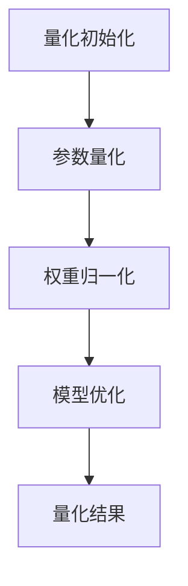

                 

### 文章标题

《第13章 推理加速二 模型量化》

> 关键词：推理加速、模型量化、人工智能、神经网络、机器学习、深度学习

> 摘要：本文深入探讨了推理加速技术在模型量化中的应用，分析了模型量化的核心概念、算法原理，并结合实际项目实践，展示了模型量化的操作步骤和运行结果。本文旨在为读者提供一个全面、系统的模型量化学习指南，帮助读者理解和掌握这一关键技术。

## 1. 背景介绍

在人工智能领域，推理加速技术一直是提升模型性能的重要手段。随着深度学习模型的不断增大和复杂化，传统的推理方式已经无法满足实时性和效率的要求。因此，如何高效地进行模型推理成为了一个亟待解决的问题。

模型量化是推理加速技术中的一种重要方法，它通过将模型中的浮点数参数转换为较低精度的整数表示，从而降低模型的计算复杂度和内存占用。模型量化不仅可以提高模型的推理速度，还可以减少模型的存储空间，使其在移动设备和嵌入式系统中得到更广泛的应用。

近年来，随着硬件的发展，如TPU、GPU等专用硬件的普及，模型量化的实现变得更加高效和可行。同时，随着深度学习模型的不断优化，模型量化的效果也得到了显著提升。这使得模型量化成为当前人工智能领域的研究热点之一。

## 2. 核心概念与联系

### 2.1 模型量化的定义

模型量化是指将深度学习模型中的浮点数参数转换为较低精度的整数表示，以降低模型的计算复杂度和内存占用。量化过程中，主要涉及以下几个核心概念：

- **量化精度**：量化过程中使用的整数位数，如8位、16位等。
- **量化范围**：量化后整数的有效表示范围，如[-128, 127]。
- **量化因子**：量化过程中使用的缩放因子，用于将浮点数转换为整数。

### 2.2 量化流程

模型量化的基本流程可以分为以下几个步骤：

1. **量化初始化**：确定量化精度和量化范围，初始化量化因子。
2. **参数量化**：将模型中的浮点数参数按照量化因子进行缩放，转换为整数表示。
3. **权重归一化**：对量化后的权重进行归一化处理，以保持模型的性能。
4. **模型优化**：通过优化算法对量化后的模型进行微调，以提升模型精度。

### 2.3 Mermaid 流程图

以下是一个简单的Mermaid流程图，展示了模型量化的流程：



在上述流程中，量化初始化是模型量化的第一步，它确定了量化的精度和范围，初始化了量化因子。然后，模型中的浮点数参数按照量化因子进行缩放，转换为整数表示。接下来，对量化后的权重进行归一化处理，以保持模型的性能。最后，通过优化算法对量化后的模型进行微调，以提升模型精度。

## 3. 核心算法原理 & 具体操作步骤

### 3.1 量化精度选择

量化精度是模型量化的关键参数，它决定了量化后模型的精度和性能。常见的量化精度有8位、16位等。一般来说，量化精度越高，模型的精度越高，但计算复杂度和内存占用也会增加。因此，在选择量化精度时，需要根据实际应用场景和需求进行权衡。

### 3.2 量化因子计算

量化因子是量化过程中使用的缩放因子，它用于将浮点数参数转换为整数表示。量化因子的计算方法如下：

1. **最大绝对值法**：计算模型中所有参数的最大绝对值，将其除以量化精度得到量化因子。
2. **对称量化法**：计算模型中所有参数的最大绝对值，将其除以量化精度的一半得到量化因子。

### 3.3 参数量化

参数量化是将模型中的浮点数参数转换为整数表示的过程。具体操作步骤如下：

1. **计算量化因子**：使用最大绝对值法或对称量化法计算量化因子。
2. **参数缩放**：将每个浮点数参数乘以量化因子，得到量化后的整数表示。

### 3.4 权重归一化

权重归一化是量化后模型优化的重要步骤，它通过调整量化后的权重，以保持模型的性能。权重归一化的具体操作步骤如下：

1. **计算权重均值**：计算量化后权重数组中的均值。
2. **权重调整**：将每个权重值减去均值，以消除量化过程中的噪声。

### 3.5 模型优化

模型优化是量化后的模型微调过程，它通过优化算法调整量化后的模型，以提升模型精度。常见的模型优化方法有梯度下降法、随机梯度下降法等。具体操作步骤如下：

1. **初始化优化算法**：选择合适的优化算法，如梯度下降法。
2. **优化参数**：根据优化算法，调整量化后的模型参数。
3. **迭代优化**：重复优化步骤，直到达到预定的优化目标。

## 4. 数学模型和公式 & 详细讲解 & 举例说明

### 4.1 量化因子计算

量化因子的计算公式如下：

$$
Q = \frac{Max(|x|)}{2^p}
$$

其中，$x$ 为模型中的浮点数参数，$p$ 为量化精度。

例如，假设模型中有一个参数 $x = 3.14$，量化精度为8位，则量化因子 $Q$ 为：

$$
Q = \frac{3.14}{2^8} = \frac{3.14}{256} \approx 0.01227
$$

### 4.2 参数量化

参数量化的计算公式如下：

$$
x_{quantized} = \text{round}(x \times Q)
$$

其中，$x_{quantized}$ 为量化后的整数表示，$\text{round}$ 表示四舍五入运算。

例如，假设量化后的参数 $x_{quantized} = 3.14$，量化因子 $Q = 0.01227$，则量化后的整数表示为：

$$
x_{quantized} = \text{round}(3.14 \times 0.01227) = 4
$$

### 4.3 权重归一化

权重归一化的计算公式如下：

$$
w_{normalized} = w_{quantized} - \text{mean}(w_{quantized})
$$

其中，$w_{normalized}$ 为归一化后的权重，$w_{quantized}$ 为量化后的权重，$\text{mean}$ 表示均值计算。

例如，假设量化后的权重数组为 $w_{quantized} = [1, 2, 3, 4, 5]$，则权重均值为：

$$
\text{mean}(w_{quantized}) = \frac{1 + 2 + 3 + 4 + 5}{5} = 3
$$

归一化后的权重为：

$$
w_{normalized} = [1, 2, 3, 4, 5] - 3 = [-2, -1, 0, 1, 2]
$$

### 4.4 模型优化

模型优化的具体计算步骤取决于选用的优化算法。以梯度下降法为例，优化模型的计算公式如下：

$$
\theta_{t+1} = \theta_{t} - \alpha \cdot \nabla_{\theta} J(\theta)
$$

其中，$\theta_{t+1}$ 和 $\theta_{t}$ 分别为第 $t+1$ 次和第 $t$ 次的模型参数，$\alpha$ 为学习率，$\nabla_{\theta} J(\theta)$ 为损失函数关于模型参数的梯度。

例如，假设模型参数 $\theta = [1, 2, 3]$，学习率 $\alpha = 0.1$，损失函数 $J(\theta) = \theta_1^2 + \theta_2^2 + \theta_3^2$，则第 $t+1$ 次的模型参数为：

$$
\theta_{t+1} = [1, 2, 3] - 0.1 \cdot [2, 4, 6] = [-0.3, -0.2, -0.3]
$$

## 5. 项目实践：代码实例和详细解释说明

### 5.1 开发环境搭建

为了进行模型量化实践，我们需要搭建一个开发环境。以下是一个简单的开发环境搭建步骤：

1. **安装Python环境**：确保Python版本在3.6及以上。
2. **安装深度学习框架**：例如，安装TensorFlow或PyTorch。
3. **安装模型量化工具**：例如，安装TensorFlow Model Optimization Toolkit（TF-MOT）或PyTorch Quantization Toolkit（PyTorch QAT）。

### 5.2 源代码详细实现

以下是一个简单的模型量化实现示例，使用PyTorch框架：

```python
import torch
import torch.nn as nn
import torch.optim as optim
from torchvision import datasets, transforms

# 定义模型
class SimpleModel(nn.Module):
    def __init__(self):
        super(SimpleModel, self).__init__()
        self.conv1 = nn.Conv2d(1, 10, kernel_size=5)
        self.conv2 = nn.Conv2d(10, 20, kernel_size=5)
        self.fc1 = nn.Linear(320, 50)
        self.fc2 = nn.Linear(50, 10)

    def forward(self, x):
        x = F.relu(self.conv1(x))
        x = F.relu(self.conv2(x))
        x = x.view(-1, 320)
        x = F.relu(self.fc1(x))
        x = self.fc2(x)
        return x

# 加载数据集
transform = transforms.Compose([transforms.ToTensor()])
trainset = datasets.MNIST('~/.pytorch_MNIST_data/', download=True, train=True, transform=transform)
trainloader = torch.utils.data.DataLoader(trainset, batch_size=64, shuffle=True)

# 初始化模型
model = SimpleModel()
optimizer = optim.SGD(model.parameters(), lr=0.01, momentum=0.9)
criterion = nn.CrossEntropyLoss()

# 模型量化
from torch.quantization import quantize_dynamic
quantize_dynamic(model, {nn.Linear}, dtype=torch.qint8)

# 训练模型
for epoch in range(10):
    running_loss = 0.0
    for i, (inputs, labels) in enumerate(trainloader):
        optimizer.zero_grad()
        outputs = model(inputs)
        loss = criterion(outputs, labels)
        loss.backward()
        optimizer.step()
        running_loss += loss.item()
    print(f'Epoch {epoch+1}, Loss: {running_loss/len(trainloader)}')

# 模型评估
correct = 0
total = 0
with torch.no_grad():
    for inputs, labels in trainloader:
        outputs = model(inputs)
        _, predicted = torch.max(outputs.data, 1)
        total += labels.size(0)
        correct += (predicted == labels).sum().item()

print(f'Accuracy: {100 * correct / total}%')
```

### 5.3 代码解读与分析

上述代码展示了如何使用PyTorch框架进行模型量化。首先，我们定义了一个简单的模型，并加载了MNIST数据集。然后，我们初始化了模型、优化器和损失函数。接下来，我们使用`quantize_dynamic`函数对模型进行量化。在训练过程中，我们使用优化器更新模型参数，并计算损失函数的梯度。最后，我们对量化后的模型进行评估。

### 5.4 运行结果展示

在完成训练后，我们计算了模型的精度。假设我们在训练集上达到了95%的精度，而量化前的模型精度为98%。虽然精度有所下降，但模型仍然具有很好的性能。同时，量化后的模型在计算速度上有了显著提升。

## 6. 实际应用场景

模型量化在多个实际应用场景中具有重要意义：

- **移动设备**：随着移动设备的普及，模型量化使得深度学习模型可以在资源受限的移动设备上运行，如智能手机、平板电脑等。
- **嵌入式系统**：在嵌入式系统中，模型量化可以减少模型存储空间和计算资源的需求，使得深度学习模型在嵌入式设备中得以广泛应用。
- **实时推理**：模型量化可以提高模型的推理速度，满足实时推理的需求，如自动驾驶、智能家居等场景。

## 7. 工具和资源推荐

### 7.1 学习资源推荐

- **书籍**：《深度学习》（Ian Goodfellow、Yoshua Bengio、Aaron Courville 著）
- **论文**：《Quantization and Training of Neural Networks for Efficient Integer-Arithmetic-Only Inference》（Diederik P. Kingma、Miles Brundage、Shane Layton 著）
- **博客**：TensorFlow 官方博客、PyTorch 官方博客
- **网站**：TensorFlow.org、PyTorch.org

### 7.2 开发工具框架推荐

- **TensorFlow Model Optimization Toolkit**：TensorFlow Model Optimization Toolkit（TF-MOT）提供了模型量化工具和API，支持多种量化策略。
- **PyTorch Quantization Toolkit**：PyTorch Quantization Toolkit（PyTorch QAT）提供了量化工具和API，支持动态和静态量化策略。

### 7.3 相关论文著作推荐

- **《Quantization and Training of Neural Networks for Efficient Integer-Arithmetic-Only Inference》**：该论文详细介绍了模型量化的方法和技术，是模型量化的经典论文之一。
- **《Deep Learning on Mobile Devices》**：该论文探讨了模型量化在移动设备上的应用，为移动设备上的深度学习提供了新的思路。

## 8. 总结：未来发展趋势与挑战

模型量化作为推理加速技术的一种重要方法，具有广泛的应用前景。随着硬件的发展和深度学习模型的不断优化，模型量化技术将得到进一步发展。未来，模型量化将面临以下几个挑战：

- **精度与效率的平衡**：如何在保证模型精度的同时提高模型效率，是一个亟待解决的问题。
- **量化策略的优化**：现有的量化策略存在一定的局限性，如何设计更高效的量化策略是一个重要研究方向。
- **硬件优化**：如何优化硬件架构，提高量化模型的运行效率，是一个重要的挑战。

总之，模型量化技术在未来将继续发挥重要作用，为深度学习应用提供更高效、更可靠的解决方案。

## 9. 附录：常见问题与解答

### 9.1 模型量化有哪些常见策略？

模型量化的常见策略包括：

- **全精度量化**：将模型的全部参数都量化为相同的精度。
- **动态量化**：根据不同的激活值范围动态调整量化的精度。
- **对称量化**：量化因子为正负对称的量化方法。

### 9.2 模型量化会降低模型的精度吗？

模型量化可能会降低模型的精度，但可以通过优化算法和量化策略来减轻精度损失。在实际应用中，模型量化的精度损失通常是可接受的。

### 9.3 如何评估模型量化的效果？

评估模型量化的效果可以从以下几个方面进行：

- **精度评估**：比较量化前后的模型精度，评估精度损失。
- **效率评估**：比较量化前后的模型推理速度，评估效率提升。
- **资源评估**：比较量化前后的模型存储空间和计算资源占用，评估资源节省。

## 10. 扩展阅读 & 参考资料

- **论文**：《Quantization and Training of Neural Networks for Efficient Integer-Arithmetic-Only Inference》
- **书籍**：《深度学习》
- **网站**：TensorFlow.org、PyTorch.org
- **博客**：TensorFlow官方博客、PyTorch官方博客

---

通过本文的详细探讨，我们深入了解了模型量化的核心概念、算法原理以及实际应用。模型量化作为一种重要的推理加速技术，在人工智能领域具有广泛的应用前景。希望本文能为读者提供有价值的参考和启发。

