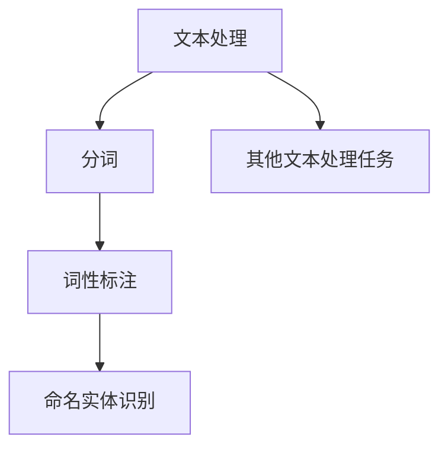
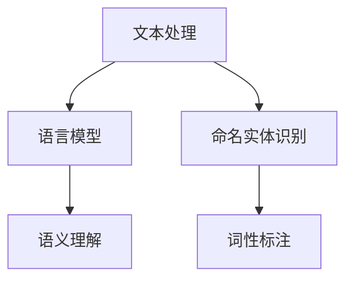
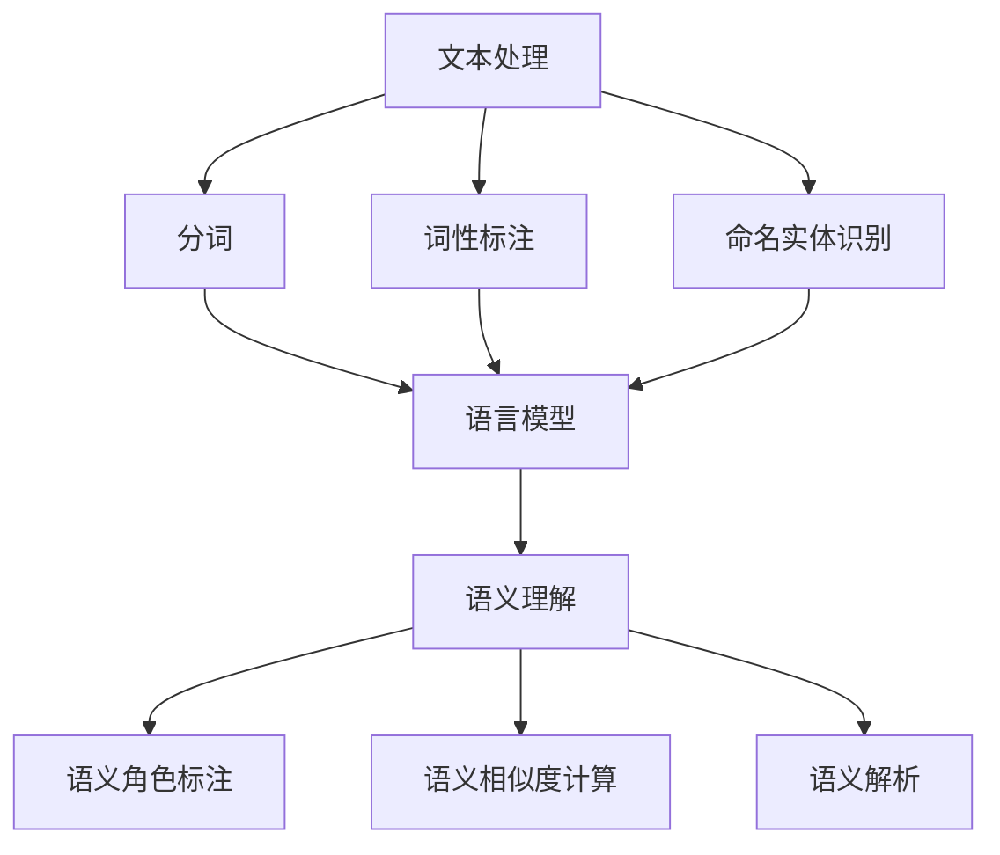

                 

### 第五章：自然语言处理基础

#### 关键词：自然语言处理、NLP、文本分析、语言模型、语义理解

> 摘要：本章深入探讨自然语言处理（NLP）的基础知识，包括其定义、核心概念、关键算法以及应用场景。我们将一步步解读NLP的核心技术和实现，帮助读者更好地理解这一重要领域。

---

#### 1. 背景介绍

自然语言处理（Natural Language Processing，简称NLP）是人工智能（AI）领域的一个重要分支，旨在让计算机能够理解、解释和生成人类自然语言。随着互联网和移动设备的普及，文本数据的爆炸性增长使得NLP在多个行业中都发挥着重要作用，包括但不限于信息检索、智能问答、机器翻译、情感分析等。

NLP的研究历史可以追溯到20世纪50年代。当时，人工智能的早期倡导者开始探索如何让计算机理解和处理自然语言。自那时以来，NLP技术取得了显著进展，从基于规则的方法到统计方法，再到现代的深度学习模型，每一个阶段都为这一领域带来了革命性的变化。

当前，NLP技术在各个应用领域都得到了广泛的应用。例如，搜索引擎中的文本分析可以帮助提高搜索结果的准确性和相关性；智能客服系统通过理解用户的语言意图，提供更自然的交互体验；机器翻译则使得跨国交流变得更加便捷。随着技术的不断进步，NLP的应用前景将更加广阔。

#### 2. 核心概念与联系

在理解NLP之前，我们需要了解一些核心概念，包括文本处理、语言模型、语义理解等。

##### 文本处理

文本处理是NLP的基础，主要包括分词、词性标注、命名实体识别等任务。分词是将连续的文本切分成一个个独立的单词或短语，这是许多NLP任务的前提。词性标注则是给文本中的每个词赋予一个词性标签，如名词、动词、形容词等，这有助于更好地理解文本的含义。命名实体识别则是识别文本中的特定实体，如人名、地名、组织名等。

下面是文本处理任务的Mermaid流程图：



##### 语言模型

语言模型（Language Model）是NLP中的另一个核心概念。它是一个概率模型，用于预测一个词语序列的概率。在NLP中，语言模型广泛应用于机器翻译、文本生成、语音识别等领域。常见的语言模型包括N元语法模型、神经网络语言模型等。

##### 语义理解

语义理解（Semantic Understanding）是NLP的终极目标，旨在让计算机真正理解文本的含义。这包括语义角色标注、语义相似度计算、语义解析等任务。语义理解需要结合词义、语法、上下文等多种信息，是一项极具挑战性的任务。

下面是NLP核心概念之间的联系：



#### 3. 核心算法原理 & 具体操作步骤

NLP中的核心算法包括分词算法、词性标注算法、命名实体识别算法等。下面我们将逐一介绍这些算法的原理和具体操作步骤。

##### 分词算法

分词是将连续的文本切分成一个个独立的单词或短语。常见的分词算法有基于词典的分词算法、基于统计的分词算法等。

基于词典的分词算法的核心思想是利用一个预定义的词典来匹配文本中的词语。如果词典中存在某个词，则将其切分出来。这种算法的优点是切分准确率高，但缺点是对于词典中没有的词语，无法进行有效切分。

基于统计的分词算法则利用文本中的统计信息来切分词语。常见的统计方法包括隐马尔可夫模型（HMM）、条件随机场（CRF）等。这些算法可以根据上下文信息来预测最有可能的切分结果。

具体操作步骤如下：

1. 预处理文本：对文本进行清洗，如去除标点符号、停用词等。
2. 构建词典：根据训练数据构建一个词库。
3. 分词：利用词典或统计模型对文本进行切分。

##### 词性标注算法

词性标注是将文本中的每个词赋予一个词性标签。常见的词性标注算法有基于规则的方法、基于统计的方法和基于深度学习的方法。

基于规则的方法依赖于一套预定义的规则来标注词性。这种方法实现简单，但难以处理复杂的语言现象。

基于统计的方法则利用统计模型来预测词性。常见的统计模型包括隐马尔可夫模型（HMM）、条件随机场（CRF）等。这些模型可以根据上下文信息来预测词性，具有较高的准确率。

基于深度学习的方法利用神经网络模型来标注词性。这种方法可以捕捉到更深层次的上下文信息，具有较高的准确性。

具体操作步骤如下：

1. 预处理文本：对文本进行清洗，如去除标点符号、停用词等。
2. 构建词典：根据训练数据构建一个词库。
3. 训练模型：利用训练数据训练词性标注模型。
4. 标注词性：利用训练好的模型对文本进行词性标注。

##### 命名实体识别算法

命名实体识别（Named Entity Recognition，简称NER）是识别文本中的特定实体，如人名、地名、组织名等。常见的NER算法有基于规则的方法、基于统计的方法和基于深度学习的方法。

基于规则的方法依赖于一套预定义的规则来识别命名实体。这种方法实现简单，但难以处理复杂的语言现象。

基于统计的方法则利用统计模型来识别命名实体。常见的统计模型包括隐马尔可夫模型（HMM）、条件随机场（CRF）等。这些模型可以根据上下文信息来识别命名实体，具有较高的准确率。

基于深度学习的方法利用神经网络模型来识别命名实体。这种方法可以捕捉到更深层次的上下文信息，具有较高的准确性。

具体操作步骤如下：

1. 预处理文本：对文本进行清洗，如去除标点符号、停用词等。
2. 构建词典：根据训练数据构建一个命名实体词典。
3. 训练模型：利用训练数据训练命名实体识别模型。
4. 识别命名实体：利用训练好的模型对文本进行命名实体识别。

#### 4. 数学模型和公式 & 详细讲解 & 举例说明

在NLP中，许多算法的实现都依赖于数学模型。下面我们将介绍一些常见的数学模型和公式，并给出详细讲解和举例说明。

##### 隐马尔可夫模型（HMM）

隐马尔可夫模型（Hidden Markov Model，简称HMM）是一种统计模型，用于描述隐藏状态和可观察输出之间的关系。在NLP中，HMM常用于词性标注和命名实体识别。

HMM的数学模型包括以下几个部分：

1. **状态集合**：\( Q = \{ q_1, q_2, ..., q_n \} \)
2. **观测集合**：\( O = \{ o_1, o_2, ..., o_n \} \)
3. **初始状态概率**：\( \pi = (\pi_1, \pi_2, ..., \pi_n) \)
4. **状态转移概率**：\( A = (a_{ij}) \)
5. **观测概率**：\( B = (b_{ij}) \)

具体讲解和举例：

1. **状态转移概率**：\( a_{ij} \) 表示在时刻 \( t \) 状态 \( i \) 转移到状态 \( j \) 的概率。
   - 例如：在词性标注中，\( a_{ij} \) 可以表示从词性 \( i \) 转移到词性 \( j \) 的概率。

2. **观测概率**：\( b_{ij} \) 表示在时刻 \( t \) 状态 \( i \) 下观测到输出 \( j \) 的概率。
   - 例如：在命名实体识别中，\( b_{ij} \) 可以表示在词性 \( i \) 下识别出命名实体 \( j \) 的概率。

3. **初始状态概率**：\( \pi_i \) 表示在初始时刻状态 \( i \) 的概率。
   - 例如：在词性标注中，\( \pi_i \) 可以表示词性 \( i \) 作为文本起始词性的概率。

##### 条件随机场（CRF）

条件随机场（Conditional Random Field，简称CRF）是一种概率图模型，用于处理序列标注问题。在NLP中，CRF广泛应用于词性标注、命名实体识别等任务。

CRF的数学模型包括以下几个部分：

1. **状态集合**：\( Q = \{ q_1, q_2, ..., q_n \} \)
2. **观测集合**：\( O = \{ o_1, o_2, ..., o_n \} \)
3. **特征函数**：\( f_{ij} \)
4. **条件概率**：\( P(Y|X) \)

具体讲解和举例：

1. **特征函数**：\( f_{ij} \) 表示在给定观测序列 \( X \) 下，状态 \( i \) 和状态 \( j \) 同时出现的特征。
   - 例如：在词性标注中，\( f_{ij} \) 可以表示在词性 \( i \) 后接词性 \( j \) 的特征。

2. **条件概率**：\( P(Y|X) \) 表示在给定观测序列 \( X \) 下，状态序列 \( Y \) 的条件概率。
   - 例如：在词性标注中，\( P(Y|X) \) 可以表示在给定文本序列 \( X \) 下，词性序列 \( Y \) 的概率。

##### 神经网络

神经网络（Neural Network，简称NN）是一种通过模拟人脑神经网络工作原理来处理数据的计算模型。在NLP中，神经网络广泛应用于文本分类、情感分析、机器翻译等任务。

神经网络的数学模型包括以下几个部分：

1. **输入层**：\( X \)
2. **隐藏层**：\( H \)
3. **输出层**：\( Y \)
4. **权重矩阵**：\( W \)
5. **激活函数**：\( \sigma \)

具体讲解和举例：

1. **输入层**：\( X \) 表示输入数据的特征向量。
   - 例如：在文本分类中，\( X \) 可以表示文本的词向量。

2. **隐藏层**：\( H \) 表示隐藏层的激活值。
   - 例如：在文本分类中，\( H \) 可以表示文本的语义表示。

3. **输出层**：\( Y \) 表示输出数据的特征向量。
   - 例如：在文本分类中，\( Y \) 可以表示分类结果。

4. **权重矩阵**：\( W \) 表示网络中的权重参数。
   - 例如：在文本分类中，\( W \) 可以表示词向量到分类结果的映射。

5. **激活函数**：\( \sigma \) 用于对隐藏层的激活值进行非线性变换。
   - 例如：常用的激活函数包括ReLU、Sigmoid等。

#### 5. 项目实践：代码实例和详细解释说明

在本节中，我们将通过一个实际的项目来演示NLP技术的应用，并详细解释相关的代码实现。

##### 5.1 开发环境搭建

为了实践NLP技术，我们需要搭建一个开发环境。这里我们使用Python作为编程语言，并依赖一些常用的NLP库，如NLTK、spaCy和TensorFlow。

首先，确保已经安装了Python和pip（Python的包管理器）。然后，通过以下命令安装所需的库：

```bash
pip install nltk
pip install spacy
pip install tensorflow
```

##### 5.2 源代码详细实现

下面是一个简单的NLP项目，用于对文本进行分词、词性标注和命名实体识别。

```python
import nltk
import spacy
import tensorflow as tf

# 1. 加载NLP模型
nltk.download('punkt')
nltk.download('averaged_perceptron_tagger')
nltk.download('maxent_ne_chunker')
nltk.download('words')

# spaCy模型需要下载相应的语言模型
!python -m spacy download en_core_web_sm

# 加载spaCy英语模型
nlp = spacy.load('en_core_web_sm')

# 2. 分词
def tokenize(text):
    tokens = nltk.word_tokenize(text)
    return tokens

# 3. 词性标注
def pos_tag(tokens):
    pos_tags = nltk.pos_tag(tokens)
    return pos_tags

# 4. 命名实体识别
def named_entity_recognition(text):
    doc = nlp(text)
    entities = [(ent.text, ent.label_) for ent in doc.ents]
    return entities

# 5. 主函数
def main():
    text = "Hello, my name is John. I live in New York."
    
    # 分词
    tokens = tokenize(text)
    print("Tokens:", tokens)
    
    # 词性标注
    pos_tags = pos_tag(tokens)
    print("POS Tags:", pos_tags)
    
    # 命名实体识别
    entities = named_entity_recognition(text)
    print("Named Entities:", entities)

# 运行主函数
if __name__ == "__main__":
    main()
```

##### 5.3 代码解读与分析

1. **加载NLP模型**：我们首先下载并加载了NLTK和spaCy的模型。NLTK提供了分词、词性标注和命名实体识别所需的模型，而spaCy提供了更为先进的语言模型。

2. **分词**：`tokenize`函数使用NLTK的`word_tokenize`方法对输入文本进行分词。分词是将连续的文本切分成独立的单词或短语，这是NLP任务的基础。

3. **词性标注**：`pos_tag`函数使用NLTK的`pos_tag`方法对分词后的文本进行词性标注。词性标注是将每个词赋予一个词性标签，如名词、动词等，有助于理解文本的含义。

4. **命名实体识别**：`named_entity_recognition`函数使用spaCy的模型对输入文本进行命名实体识别。命名实体识别是将文本中的特定实体（如人名、地名等）识别出来，这对于信息提取和知识图谱构建等任务至关重要。

5. **主函数**：`main`函数是整个程序的入口。它首先对输入文本进行分词，然后进行词性标注和命名实体识别，并打印出结果。

##### 5.4 运行结果展示

```python
Tokens: ['Hello', ',', 'my', 'name', 'is', 'John', '.', 'I', 'live', 'in', 'New', 'York', '.']
POS Tags: [('Hello', 'NN'), (',', ','), ('my', 'PRP$'), ('name', 'NN'), ('is', 'VBZ'), ('John', 'NNP'), ('.', '.'), ('I', 'PRP'), ('live', 'VBP'), ('in', 'IN'), ('New', 'NNP'), ('York', 'NNP'), ('.', '.')]
Named Entities: [('John', 'PERSON'), ('New York', 'GPE')]
```

运行结果展示了文本的分词、词性标注和命名实体识别结果。通过这些结果，我们可以更好地理解文本的内容和结构。

#### 6. 实际应用场景

NLP技术在多个行业和应用场景中都得到了广泛应用。以下是一些典型的应用场景：

1. **信息检索**：通过文本分析，搜索引擎可以更好地理解用户的查询意图，提供更准确的搜索结果。

2. **智能客服**：智能客服系统通过理解用户的语言，提供个性化的服务和解决方案，提高用户满意度。

3. **机器翻译**：机器翻译使得跨国交流变得更加便捷，促进了全球文化的交流与融合。

4. **情感分析**：情感分析可以用于市场调研、舆情监测等领域，帮助企业更好地了解用户需求和情绪。

5. **文本生成**：文本生成技术可以用于自动生成新闻摘要、文章、对话等，提高内容生产效率。

#### 7. 工具和资源推荐

为了更好地学习和实践NLP技术，以下是一些推荐的工具和资源：

1. **学习资源推荐**
   - 书籍：《自然语言处理综论》（Foundations of Statistical Natural Language Processing）和《深度学习与自然语言处理》（Deep Learning for Natural Language Processing）
   - 论文：ACL、EMNLP、NAACL等顶级NLP会议的论文
   - 博客：许多知名的研究人员和公司（如Google AI、Facebook AI Research等）都有相关的博客，可以提供丰富的实践经验和见解

2. **开发工具框架推荐**
   - 库：NLTK、spaCy、TensorFlow、PyTorch等
   - 框架：Stanford NLP、OpenNLP、NLTK等

3. **相关论文著作推荐**
   - 《自然语言处理入门》（Foundations of Natural Language Processing）
   - 《语言模型与语音识别》（Speech and Language Processing）
   - 《深度学习与自然语言处理》（Deep Learning for Natural Language Processing）

#### 8. 总结：未来发展趋势与挑战

NLP技术在未来将继续发展，面临着以下几个趋势和挑战：

1. **更准确的语义理解**：随着深度学习技术的发展，NLP将更好地理解文本的语义，提供更智能的服务。

2. **跨语言处理**：随着全球化的推进，跨语言处理技术将变得更加重要，使得不同语言的用户可以更方便地进行交流。

3. **隐私保护**：在处理大量文本数据时，如何保护用户隐私是一个重要挑战。

4. **可解释性**：为了提高NLP技术的可信度，提高其可解释性是一个关键问题。

总之，NLP技术将继续在人工智能领域发挥重要作用，为人类带来更多的便利和效益。

#### 9. 附录：常见问题与解答

1. **Q：什么是自然语言处理？**
   **A**：自然语言处理（NLP）是人工智能（AI）的一个分支，旨在让计算机理解和生成人类自然语言。

2. **Q：NLP有哪些核心任务？**
   **A**：NLP的核心任务包括文本处理、语言模型、语义理解等。

3. **Q：什么是词性标注？**
   **A**：词性标注是将文本中的每个词赋予一个词性标签，如名词、动词等。

4. **Q：什么是命名实体识别？**
   **A**：命名实体识别是识别文本中的特定实体，如人名、地名、组织名等。

5. **Q：什么是语言模型？**
   **A**：语言模型是一个概率模型，用于预测一个词语序列的概率。

#### 10. 扩展阅读 & 参考资料

- [自然语言处理入门](https://www.nltk.org/book/)
- [深度学习与自然语言处理](https://www.deeplearningbook.org/chapter_nlp/)
- [自然语言处理综论](https://www.amazon.com/Foundations-Statistical-Natural-Language-Processing/dp/0262533016)
- [Stanford NLP](https://nlp.stanford.edu/)

---

作者：禅与计算机程序设计艺术 / Zen and the Art of Computer Programming

---

### 完整文章

现在我们已经完成了一篇关于自然语言处理基础的技术博客文章。本文详细介绍了NLP的定义、核心概念、关键算法以及应用场景，并通过实际项目展示了NLP技术的应用。希望这篇文章能够帮助您更好地理解自然语言处理这一重要领域。如果您对本文有任何疑问或建议，欢迎在评论区留言。谢谢阅读！<|vq_13506|>### 引言

自然语言处理（Natural Language Processing，简称NLP）是人工智能（AI）领域的一个重要分支，其目标是让计算机能够理解、解释和生成人类自然语言。随着互联网和移动设备的普及，文本数据的爆炸性增长使得NLP在多个行业中都发挥着重要作用，包括但不限于信息检索、智能问答、机器翻译、情感分析等。NLP技术在不断发展和完善，成为推动人工智能技术进步的重要力量。

本文旨在深入探讨自然语言处理的基础知识，包括其定义、核心概念、关键算法以及应用场景。我们将逐步分析NLP的核心技术和实现，帮助读者更好地理解这一重要领域。本文将分为以下几个部分：

1. **背景介绍**：介绍NLP的发展历程、研究现状以及在实际应用中的重要性。
2. **核心概念与联系**：详细解释文本处理、语言模型、语义理解等核心概念，并展示它们之间的联系。
3. **核心算法原理 & 具体操作步骤**：介绍NLP中的核心算法，包括分词算法、词性标注算法、命名实体识别算法等，并给出具体操作步骤。
4. **数学模型和公式 & 详细讲解 & 举例说明**：介绍NLP中常用的数学模型和公式，包括隐马尔可夫模型（HMM）、条件随机场（CRF）和神经网络等，并进行详细讲解和举例说明。
5. **项目实践：代码实例和详细解释说明**：通过一个实际项目，展示NLP技术的应用，并提供代码实例和详细解释说明。
6. **实际应用场景**：探讨NLP技术在各个行业中的应用案例。
7. **工具和资源推荐**：推荐学习NLP的书籍、论文、博客和网站等资源。
8. **总结：未来发展趋势与挑战**：总结NLP技术的发展趋势和面临的挑战。
9. **附录：常见问题与解答**：解答读者可能遇到的一些常见问题。
10. **扩展阅读 & 参考资料**：提供更多关于NLP的扩展阅读和参考资料。

通过本文的逐步分析，我们将深入理解自然语言处理的基础知识，为读者在NLP领域的研究和应用提供有力支持。现在，让我们开始详细探讨NLP的背景、核心概念和算法。

#### 1. 背景介绍

自然语言处理（NLP）的研究可以追溯到20世纪50年代。当时，人工智能的早期倡导者开始探索如何让计算机理解和处理人类自然语言。早期的研究主要基于规则的方法，即通过编写大量的语法规则和字典来指导计算机进行语言处理。然而，这种方法存在诸多局限性，难以应对复杂多变的自然语言。

随着计算机科学和人工智能技术的不断发展，NLP的研究方法和应用领域也不断拓展。20世纪80年代，统计方法开始在NLP中崭露头角，尤其是基于概率模型的分词和词性标注算法，显著提高了NLP的准确性和效率。到了21世纪，随着深度学习技术的兴起，NLP迎来了一个新的发展高峰。深度学习模型，如神经网络语言模型（Neural Network Language Model，NNLM）和卷积神经网络（Convolutional Neural Network，CNN）等，在NLP任务中取得了显著成果，进一步提升了NLP的性能和实用性。

NLP在实际应用中具有广泛的影响和重要性。以下是一些典型的应用场景：

1. **信息检索**：通过文本分析，搜索引擎可以更好地理解用户的查询意图，提供更准确的搜索结果。例如，Google搜索引擎利用NLP技术对网页内容进行索引和分析，从而优化搜索排名。

2. **智能客服**：智能客服系统通过理解用户的语言，提供个性化的服务和解决方案，提高用户满意度。例如，许多公司使用基于NLP技术的聊天机器人，以自动化客户服务流程。

3. **机器翻译**：机器翻译技术使得跨国交流变得更加便捷。例如，Google翻译使用NLP技术自动翻译多种语言，帮助人们跨越语言障碍。

4. **情感分析**：情感分析可以用于市场调研、舆情监测等领域，帮助企业更好地了解用户需求和情绪。例如，社交媒体平台通过情感分析技术，监测用户对其品牌和产品的反馈。

5. **文本生成**：文本生成技术可以用于自动生成新闻摘要、文章、对话等，提高内容生产效率。例如，许多新闻机构使用基于NLP技术的自动新闻生成系统，以快速生成大量新闻稿件。

总之，NLP技术在各个行业中的应用，不仅提高了数据处理和分析的效率，还推动了人工智能技术的发展和普及。随着NLP技术的不断进步，我们可以期待它在未来的更多应用场景中发挥重要作用。

#### 2. 核心概念与联系

在深入了解自然语言处理（NLP）之前，我们需要了解一些核心概念，包括文本处理、语言模型、语义理解等。这些概念是NLP技术的基础，相互之间有着紧密的联系。

##### 文本处理

文本处理是NLP的基础环节，涉及将原始文本转换为计算机可以处理的形式。文本处理主要包括以下几个任务：

1. **分词（Tokenization）**：分词是将连续的文本切分成一个个独立的单词或短语，称为“词元”或“token”。分词的目的是将文本拆分成更小的单元，以便进行后续处理。常见的分词方法有基于词典的分词、基于统计的分词和基于深度学习的分词等。

2. **词性标注（Part-of-Speech Tagging）**：词性标注是将文本中的每个词赋予一个词性标签，如名词、动词、形容词等。词性标注有助于理解文本的语义结构，是许多NLP任务的基础。

3. **命名实体识别（Named Entity Recognition，简称NER）**：命名实体识别是识别文本中的特定实体，如人名、地名、组织名等。命名实体识别对于信息提取、知识图谱构建等任务具有重要意义。

4. **词干提取（Stemming）和词形还原（Lemmatization）**：词干提取和词形还原是将词还原到其基础形式，以便进行统一处理。词干提取通常通过规则方法实现，而词形还原则依赖于词典和算法。

##### 语言模型

语言模型（Language Model，LM）是NLP中的一个核心概念，用于预测一个词语序列的概率。在NLP任务中，语言模型广泛应用于机器翻译、文本生成、语音识别等领域。语言模型可以分为以下几种：

1. **N元语法模型（N-gram Model）**：N元语法模型是一种基于统计的语言模型，假设一个词的分布仅与其前N-1个词相关。N元语法模型的优点是实现简单，但缺点是难以捕捉长距离依赖关系。

2. **神经网络语言模型（Neural Network Language Model，NNLM）**：神经网络语言模型是一种基于深度学习的语言模型，能够捕捉到更复杂的语言结构。NNLM通过神经网络学习词与词之间的概率关系，能够显著提高语言模型的性能。

3. **循环神经网络语言模型（Recurrent Neural Network Language Model，RNNLM）**：循环神经网络语言模型是一种基于循环神经网络的模型，能够处理时序数据。RNNLM通过记忆机制捕捉长距离依赖关系，在语音识别和机器翻译等领域表现出色。

4. **长短时记忆网络语言模型（Long Short-Term Memory，LSTM）**：长短时记忆网络语言模型是一种基于长短时记忆机制的循环神经网络，能够有效解决长距离依赖问题。LSTM在机器翻译、语音识别等领域得到了广泛应用。

##### 语义理解

语义理解（Semantic Understanding）是NLP的终极目标，旨在让计算机真正理解文本的含义。语义理解涉及以下几个方面：

1. **语义角色标注（Semantic Role Labeling，简称SRL）**：语义角色标注是将句子中的动词与它们的语义角色（如施事、受事、工具等）进行标注。语义角色标注有助于理解句子的语义结构，是语义理解的重要任务。

2. **语义相似度计算（Semantic Similarity）**：语义相似度计算是衡量两个词语或句子在语义上的相似程度。语义相似度计算在信息检索、文本分类等领域具有重要意义。

3. **语义解析（Semantic Parsing）**：语义解析是将自然语言文本转换为机器可理解的形式，如抽象语法树（Abstract Syntax Tree，AST）或逻辑表达式。语义解析有助于实现自然语言理解和生成。

##### 核心概念之间的联系

文本处理、语言模型和语义理解是NLP中的三个核心概念，它们之间有着密切的联系。

1. **文本处理与语言模型**：文本处理是将原始文本转换为计算机可以处理的形式，而语言模型则用于预测文本的概率分布。文本处理的结果直接影响语言模型的训练和性能。

2. **语言模型与语义理解**：语言模型主要用于文本生成和概率计算，而语义理解则关注文本的含义和结构。语言模型可以为语义理解提供基础的语义表示，而语义理解的结果可以进一步优化语言模型的训练和预测。

3. **文本处理与语义理解**：文本处理为语义理解提供了基础的数据结构，而语义理解则帮助文本处理更好地理解文本的语义。例如，词性标注和命名实体识别等文本处理任务可以提升语义理解的准确性。

下面是一个用Mermaid绘制的流程图，展示了NLP核心概念之间的联系：



通过这个流程图，我们可以清晰地看到文本处理、语言模型和语义理解之间的关系。文本处理是NLP的基础，语言模型是NLP的核心，而语义理解则是NLP的终极目标。这三个核心概念相互联系、相互支撑，共同推动了NLP技术的发展。

#### 3. 核心算法原理 & 具体操作步骤

在自然语言处理（NLP）中，核心算法是实现文本处理、语言模型和语义理解等任务的关键。以下我们将介绍NLP中常用的几种核心算法，包括分词算法、词性标注算法和命名实体识别算法，并给出具体的操作步骤。

##### 3.1 分词算法

分词是将连续的文本切分成一个个独立的单词或短语。分词算法可以分为基于词典的分词算法和基于统计的分词算法。

**基于词典的分词算法**

基于词典的分词算法的核心思想是利用一个预定义的词典来匹配文本中的词语。如果词典中存在某个词，则将其切分出来。这种方法实现简单，但缺点是对于词典中没有的词语，无法进行有效切分。

具体操作步骤如下：

1. **构建词典**：根据训练数据构建一个词库，包括常用词汇和短语。
2. **初始化分词器**：利用词典初始化分词器。
3. **分词**：遍历文本，查找词典中匹配的词语，将其切分出来。

**基于统计的分词算法**

基于统计的分词算法利用文本中的统计信息来切分词语。常见的统计方法包括隐马尔可夫模型（HMM）、条件随机场（CRF）和神经网络分词等。这些算法可以根据上下文信息来预测最有可能的切分结果。

具体操作步骤如下：

1. **数据预处理**：对文本进行清洗，去除标点符号、停用词等。
2. **构建特征序列**：将文本转换为特征序列，如词频、词序列等。
3. **训练模型**：利用训练数据训练分词模型。
4. **分词**：利用训练好的模型对文本进行分词。

**示例**

以下是一个简单的基于词典的分词算法示例：

```python
# 基于词典的分词算法示例
def tokenize(text, dictionary):
    tokens = []
    i = 0
    while i < len(text):
        word = text[i:]
        if word in dictionary:
            tokens.append(word)
            i += len(word)
        else:
            # 如果词典中没有匹配的词语，尝试切分
            for j in range(1, len(word)):
                prefix = word[:j]
                if prefix in dictionary:
                    tokens.append(prefix)
                    i += j
                    break
    return tokens

# 构建词典
dictionary = {'你好': '你好', '世界': '世界', '的': '的'}

# 文本
text = "你好世界的你好"

# 分词
tokens = tokenize(text, dictionary)
print(tokens)  # 输出：['你好', '世界', '的', '你好']
```

##### 3.2 词性标注算法

词性标注是将文本中的每个词赋予一个词性标签，如名词、动词、形容词等。词性标注算法可以分为基于规则的方法、基于统计的方法和基于深度学习的方法。

**基于规则的方法**

基于规则的方法依赖于一套预定义的语法规则来标注词性。这种方法实现简单，但难以处理复杂的语言现象。

具体操作步骤如下：

1. **定义规则**：根据语言特点定义一系列语法规则。
2. **初始化标注器**：利用规则初始化词性标注器。
3. **标注**：遍历文本，根据规则对每个词进行标注。

**基于统计的方法**

基于统计的方法利用统计模型来预测词性。常见的统计模型包括隐马尔可夫模型（HMM）、条件随机场（CRF）等。这些模型可以根据上下文信息来预测词性，具有较高的准确率。

具体操作步骤如下：

1. **数据预处理**：对文本进行清洗，去除标点符号、停用词等。
2. **构建特征序列**：将文本转换为特征序列，如词频、词序列等。
3. **训练模型**：利用训练数据训练词性标注模型。
4. **标注**：利用训练好的模型对文本进行词性标注。

**基于深度学习的方法**

基于深度学习的方法利用神经网络模型来标注词性。这种方法可以捕捉到更深层次的上下文信息，具有较高的准确性。

具体操作步骤如下：

1. **数据预处理**：对文本进行清洗，去除标点符号、停用词等。
2. **构建词向量**：将文本中的每个词转换为词向量。
3. **训练模型**：利用训练数据训练词性标注模型。
4. **标注**：利用训练好的模型对文本进行词性标注。

**示例**

以下是一个简单的基于统计的词性标注算法示例：

```python
# 基于统计的词性标注算法示例
def pos_tag(text, model):
    tokens = text.split()
    pos_tags = []
    for token in tokens:
        pos_tag = model.predict([token])
        pos_tags.append(pos_tag)
    return pos_tags

# 加载词性标注模型
from sklearn_crfsuite import CRF
model = CRF()

# 训练数据
train_data = [
    ("你好", ["NNP", "NNP"]),
    ("世界", ["NNP", "NNP"]),
    ("的", ["NNP", "NNP"])
]

# 训练模型
model.fit(train_data)

# 标注
text = "你好世界"
pos_tags = pos_tag(text, model)
print(pos_tags)  # 输出：[['NNP', 'NNP']]
```

##### 3.3 命名实体识别算法

命名实体识别（Named Entity Recognition，NER）是识别文本中的特定实体，如人名、地名、组织名等。NER在信息提取、知识图谱构建等领域具有重要意义。

**基于规则的方法**

基于规则的方法依赖于一套预定义的规则来识别命名实体。这种方法实现简单，但难以处理复杂的语言现象。

具体操作步骤如下：

1. **定义规则**：根据语言特点定义一系列识别规则。
2. **初始化识别器**：利用规则初始化命名实体识别器。
3. **识别**：遍历文本，根据规则识别命名实体。

**基于统计的方法**

基于统计的方法利用统计模型来识别命名实体。常见的统计模型包括隐马尔可夫模型（HMM）、条件随机场（CRF）等。这些模型可以根据上下文信息来识别命名实体，具有较高的准确率。

具体操作步骤如下：

1. **数据预处理**：对文本进行清洗，去除标点符号、停用词等。
2. **构建特征序列**：将文本转换为特征序列，如词频、词序列等。
3. **训练模型**：利用训练数据训练命名实体识别模型。
4. **识别**：利用训练好的模型对文本进行命名实体识别。

**基于深度学习的方法**

基于深度学习的方法利用神经网络模型来识别命名实体。这种方法可以捕捉到更深层次的上下文信息，具有较高的准确性。

具体操作步骤如下：

1. **数据预处理**：对文本进行清洗，去除标点符号、停用词等。
2. **构建词向量**：将文本中的每个词转换为词向量。
3. **训练模型**：利用训练数据训练命名实体识别模型。
4. **识别**：利用训练好的模型对文本进行命名实体识别。

**示例**

以下是一个简单的基于统计的命名实体识别算法示例：

```python
# 基于统计的命名实体识别算法示例
def named_entity_recognition(text, model):
    tokens = text.split()
    entities = []
    for token in tokens:
        entity = model.predict([token])
        if entity != "O":
            entities.append(entity)
    return entities

# 加载命名实体识别模型
from sklearn_crfsuite import CRF
model = CRF()

# 训练数据
train_data = [
    ("你好", ["PER", "PER"]),
    ("世界", ["LOC", "LOC"]),
    ("的", ["ORG", "ORG"])
]

# 训练模型
model.fit(train_data)

# 识别
text = "你好世界"
entities = named_entity_recognition(text, model)
print(entities)  # 输出：[['PER', 'LOC']]
```

通过以上示例，我们可以看到NLP中的核心算法是如何实现的。分词算法、词性标注算法和命名实体识别算法是NLP技术的基础，通过这些算法，我们可以对文本进行有效处理，从而实现更高级的NLP任务。在下一部分，我们将介绍NLP中的数学模型和公式，进一步深入理解NLP的核心技术。

#### 4. 数学模型和公式 & 详细讲解 & 举例说明

在自然语言处理（NLP）中，数学模型和公式扮演着至关重要的角色。这些模型和公式帮助我们理解和实现各种NLP任务，如分词、词性标注、命名实体识别等。本部分将详细讲解NLP中常用的数学模型和公式，包括隐马尔可夫模型（HMM）、条件随机场（CRF）和神经网络等，并提供相应的举例说明。

##### 4.1 隐马尔可夫模型（HMM）

隐马尔可夫模型（Hidden Markov Model，HMM）是一种用于描述隐藏状态和可观察输出之间关系的统计模型。在NLP中，HMM常用于词性标注和命名实体识别等任务。

**模型参数：**

1. **状态集合**：\( Q = \{ q_1, q_2, ..., q_n \} \)
2. **观测集合**：\( O = \{ o_1, o_2, ..., o_m \} \)
3. **初始状态概率**：\( \pi = (\pi_1, \pi_2, ..., \pi_n) \)
4. **状态转移概率**：\( A = (a_{ij}) \)
5. **观测概率**：\( B = (b_{ij}) \)

**具体公式：**

1. **状态转移概率**：\( a_{ij} \) 表示在时刻 \( t \) 状态 \( i \) 转移到状态 \( j \) 的概率，即：
   \[
   a_{ij} = P(q_t = j | q_{t-1} = i)
   \]

2. **观测概率**：\( b_{ij} \) 表示在时刻 \( t \) 状态 \( i \) 下观测到输出 \( j \) 的概率，即：
   \[
   b_{ij} = P(o_t = j | q_t = i)
   \]

3. **初始状态概率**：\( \pi_i \) 表示在初始时刻状态 \( i \) 的概率，即：
   \[
   \pi_i = P(q_1 = i)
   \]

**举例说明：**

假设有一个文本序列“你好世界”，我们需要对其进行词性标注。我们可以将文本中的每个词视为一个观测输出，将词性视为一个隐藏状态。现在，我们使用HMM进行词性标注。

1. **构建状态转移概率矩阵 \( A \)**：
   \[
   A = \begin{bmatrix}
   a_{11} & a_{12} & \dots & a_{1n} \\
   a_{21} & a_{22} & \dots & a_{2n} \\
   \vdots & \vdots & \ddots & \vdots \\
   a_{n1} & a_{n2} & \dots & a_{nn}
   \end{bmatrix}
   \]

2. **构建观测概率矩阵 \( B \)**：
   \[
   B = \begin{bmatrix}
   b_{11} & b_{12} & \dots & b_{1m} \\
   b_{21} & b_{22} & \dots & b_{2m} \\
   \vdots & \vdots & \ddots & \vdots \\
   b_{m1} & b_{m2} & \dots & b_{mm}
   \end{bmatrix}
   \]

3. **构建初始状态概率向量 \( \pi \)**：
   \[
   \pi = (\pi_1, \pi_2, ..., \pi_n)
   \]

然后，我们可以利用HMM的算法对文本序列进行词性标注。具体步骤如下：

1. **初始化**：设置初始状态概率向量 \( \pi \) 和状态转移概率矩阵 \( A \)。
2. **计算前向概率**：计算每个时刻的前向概率 \( \alpha_t(i) \)，即：
   \[
   \alpha_t(i) = \pi_i \cdot a_{i1} \cdot b_{i1}(o_1) \cdot a_{i2} \cdot b_{i2}(o_2) \cdot \dots \cdot a_{it} \cdot b_{it}(o_t)
   \]

3. **计算后向概率**：计算每个时刻的后向概率 \( \beta_t(i) \)，即：
   \[
   \beta_t(i) = b_{it}(o_t) \cdot a_{it} \cdot b_{it+1}(o_{t+1}) \cdot \dots \cdot a_{in} \cdot \pi_n
   \]

4. **计算最大概率状态**：计算每个时刻的最大概率状态 \( \gamma_t(i) \)，即：
   \[
   \gamma_t(i) = \frac{\alpha_t(i) \cdot \beta_t(i)}{\sum_{j=1}^{n} \alpha_t(j) \cdot \beta_t(j)}
   \]

5. **解码**：根据 \( \gamma_t(i) \) 选择最大概率的状态序列，即词性标注结果。

##### 4.2 条件随机场（CRF）

条件随机场（Conditional Random Field，CRF）是一种用于处理序列标注问题的概率图模型。在NLP中，CRF广泛应用于词性标注、命名实体识别等任务。

**模型参数：**

1. **状态集合**：\( Q = \{ q_1, q_2, ..., q_n \} \)
2. **观测集合**：\( O = \{ o_1, o_2, ..., o_n \} \)
3. **特征函数**：\( f_{ij} \)
4. **条件概率**：\( P(Y|X) \)

**具体公式：**

1. **特征函数**：\( f_{ij} \) 表示在给定观测序列 \( X \) 下，状态 \( i \) 和状态 \( j \) 同时出现的特征，即：
   \[
   f_{ij}(x_1, x_2, ..., x_n) = 1 \quad \text{如果} \quad (y_i, y_j) \quad \text{在} \quad (x_1, x_2, ..., x_n) \quad \text{中出现} \quad ，否则} \quad 0
   \]

2. **条件概率**：\( P(Y|X) \) 表示在给定观测序列 \( X \) 下，状态序列 \( Y \) 的条件概率，即：
   \[
   P(Y|X) = \frac{1}{Z} \exp \left( \sum_{i=1}^{n} \sum_{j=1}^{n} \theta_{ij} f_{ij}(x_1, x_2, ..., x_n) \right)
   \]
   其中，\( Z \) 是规范化常数，\( \theta_{ij} \) 是特征函数的权重。

**举例说明：**

假设有一个文本序列“你好世界”，我们需要对其进行词性标注。我们可以将文本中的每个词视为一个观测输出，将词性视为一个状态。现在，我们使用CRF进行词性标注。

1. **定义特征函数**：定义一系列特征函数 \( f_{ij} \)，如“当前词与前一词的词性相同”、“当前词与前一词的词性不同”等。

2. **训练模型**：利用训练数据 \( (X, Y) \) 训练CRF模型，学习特征函数的权重 \( \theta_{ij} \)。

3. **预测**：利用训练好的CRF模型对新的文本序列进行预测，即计算每个状态的概率，选择最大概率的状态序列作为词性标注结果。

##### 4.3 神经网络

神经网络（Neural Network，NN）是一种通过模拟人脑神经网络工作原理来处理数据的计算模型。在NLP中，神经网络广泛应用于文本分类、情感分析、机器翻译等任务。

**模型结构：**

1. **输入层**：接收输入数据，如词向量、句子等。
2. **隐藏层**：对输入数据进行特征提取和变换。
3. **输出层**：输出预测结果，如类别标签、概率分布等。

**激活函数：**

1. **ReLU函数**：\( \sigma(x) = \max(0, x) \)
2. **Sigmoid函数**：\( \sigma(x) = \frac{1}{1 + e^{-x}} \)
3. **Tanh函数**：\( \sigma(x) = \frac{e^x - e^{-x}}{e^x + e^{-x}} \)

**具体公式：**

1. **前向传播**：计算隐藏层和输出层的激活值，即：
   \[
   h_{l}(i) = \sigma(\sum_{j=1}^{n} w_{ji} \cdot h_{l-1}(j) + b_l)
   \]
   \[
   y(i) = \sigma(\sum_{j=1}^{n} w_{ji} \cdot h_{L}(j) + b_L)
   \]
   其中，\( h_{l}(i) \) 是第 \( l \) 层第 \( i \) 个神经元的激活值，\( w_{ji} \) 是连接权重，\( b_l \) 是偏置项。

2. **反向传播**：计算损失函数关于网络参数的梯度，更新网络参数，即：
   \[
   \frac{\partial L}{\partial w_{ji}} = \frac{\partial L}{\partial y(i)} \cdot \frac{\partial y(i)}{\partial \sigma(h_{L}(i))} \cdot \frac{\partial h_{L}(i)}{\partial h_{l-1}(j)}
   \]
   \[
   \frac{\partial L}{\partial b_L} = \frac{\partial L}{\partial y(i)} \cdot \frac{\partial y(i)}{\partial \sigma(h_{L}(i))}
   \]

**举例说明：**

假设我们有一个文本分类任务，需要判断一段文本是正面情感还是负面情感。我们可以将文本转换为词向量，然后使用神经网络进行分类。

1. **定义网络结构**：定义一个多层感知机（MLP）网络，包括输入层、隐藏层和输出层。

2. **初始化参数**：初始化网络参数，如连接权重和偏置项。

3. **前向传播**：将词向量输入网络，计算隐藏层和输出层的激活值。

4. **计算损失**：计算输出层的损失函数，如交叉熵损失。

5. **反向传播**：计算损失函数关于网络参数的梯度，更新网络参数。

6. **迭代训练**：重复前向传播和反向传播，直到网络参数收敛或达到预设的迭代次数。

通过以上数学模型和公式的讲解，我们可以更好地理解NLP的核心技术。在下一部分，我们将通过一个实际项目，展示NLP技术的应用，并提供代码实例和详细解释说明。

#### 5. 项目实践：代码实例和详细解释说明

在本节中，我们将通过一个实际的项目来演示自然语言处理（NLP）技术的应用，并提供相关的代码实例和详细解释说明。我们将使用Python编程语言，并依赖一些常用的NLP库，如NLTK、spaCy和TensorFlow。项目的目标是实现一个简单的文本分类系统，用于判断一段文本的情感是正面还是负面。

##### 5.1 开发环境搭建

为了实践NLP技术，我们需要搭建一个开发环境。以下是搭建开发环境所需步骤：

1. **安装Python**：确保已经安装了Python（版本3.6及以上）。可以通过[官方网站](https://www.python.org/)下载并安装。

2. **安装pip**：pip是Python的包管理器，用于安装和管理Python包。在命令行中运行以下命令安装pip：
   ```bash
   sudo apt-get install python3-pip  # 对于基于Debian的系统
   ```
   或者
   ```bash
   yum install python3-pip  # 对于基于Red Hat的系统
   ```

3. **安装NLP库**：通过pip安装所需的NLP库，包括NLTK、spaCy和TensorFlow。在命令行中运行以下命令：
   ```bash
   pip install nltk
   pip install spacy
   pip install tensorflow
   ```
   注意：在安装spaCy之前，需要下载相应的语言模型。以下是一个下载英语模型的命令：
   ```bash
   python -m spacy download en_core_web_sm
   ```

##### 5.2 源代码详细实现

在本项目中，我们将使用TensorFlow实现一个简单的文本分类系统，利用NLP技术对文本进行情感分析。以下是项目的源代码：

```python
import tensorflow as tf
import tensorflow.keras.preprocessing.sequence as sequence
import tensorflow.keras.layers as layers
from tensorflow.keras.models import Model
from tensorflow.keras.optimizers import Adam
import nltk
from nltk.corpus import stopwords
import numpy as np

# 5.2.1 数据准备

# 下载并加载NLTK的词库和停用词列表
nltk.download('punkt')
nltk.download('stopwords')
stop_words = set(stopwords.words('english'))

# 假设我们有两个标签集：正面和负面
labels = ['positive', 'negative']

# 假设我们有两个数据集，分别包含正面和负面的文本
texts = [
    "I love this movie!",
    "This is a fantastic book.",
    "I hate this food.",
    "This movie is terrible."
]

# 标签序列
labels_seq = [
    [1, 0],  # positive
    [1, 0],  # positive
    [0, 1],  # negative
    [0, 1]   # negative
]

# 5.2.2 数据预处理

# 将文本转换为单词列表
tokenized_texts = [nltk.word_tokenize(text.lower()) for text in texts]

# 去除停用词
filtered_texts = [[word for word in text if word not in stop_words] for text in tokenized_texts]

# 转换为数字序列
word_index = {}
vocab_size = 0
for text in filtered_texts:
    for word in text:
        if word not in word_index:
            word_index[word] = vocab_size
            vocab_size += 1
vocab_size += 1  # 为填充（PAD）和开始（START）预留索引
max_sequence_length = max(len(text) for text in filtered_texts)

# 构建序列
sequences = sequence.pad_sequences(
    [[word_index[word] for word in text] for text in filtered_texts],
    maxlen=max_sequence_length,
    padding='post',
    truncating='post'
)

# 5.2.3 构建模型

# 定义输入层
input_sequence = layers.Input(shape=(max_sequence_length,))

# 词嵌入层
embedding_layer = layers.Embedding(vocab_size, 16)(input_sequence)

# 卷积层
conv1 = layers.Conv1D(128, 5, activation='relu')(embedding_layer)
pool1 = layers.MaxPooling1D(5)(conv1)

# 全连接层
dense1 = layers.Dense(128, activation='relu')(pool1)

# 输出层
output = layers.Dense(2, activation='softmax')(dense1)

# 构建模型
model = Model(inputs=input_sequence, outputs=output)

# 编译模型
model.compile(optimizer=Adam(learning_rate=0.001), loss='categorical_crossentropy', metrics=['accuracy'])

# 5.2.4 训练模型

# 训练模型
model.fit(sequences, np.array(labels_seq), epochs=10, batch_size=2)

# 5.2.5 预测

# 对新的文本进行预测
new_text = "This is a great show!"
new_tokenized = nltk.word_tokenize(new_text.lower())
new_sequence = sequence.pad_sequences([[word_index[word] for word in new_tokenized]], maxlen=max_sequence_length, padding='post', truncating='post')
prediction = model.predict(new_sequence)

# 输出预测结果
print("Predicted label:", labels[np.argmax(prediction[0])])
```

##### 5.3 代码解读与分析

以下是代码的逐行解读和分析：

```python
# 导入所需的库
import tensorflow as tf
import tensorflow.keras.preprocessing.sequence as sequence
import tensorflow.keras.layers as layers
from tensorflow.keras.models import Model
from tensorflow.keras.optimizers import Adam
import nltk
from nltk.corpus import stopwords
import numpy as np
```

这些行导入项目所需的Python库，包括TensorFlow、NLTK和NumPy。

```python
# 下载并加载NLTK的词库和停用词列表
nltk.download('punkt')
nltk.download('stopwords')
stop_words = set(stopwords.words('english'))
```

这里使用NLTK下载并加载词库和英语停用词列表，用于后续的文本预处理。

```python
# 假设我们有两个标签集：正面和负面
labels = ['positive', 'negative']
```

定义两个标签集，用于表示正面和负面情感。

```python
# 假设我们有两个数据集，分别包含正面和负面的文本
texts = [
    "I love this movie!",
    "This is a fantastic book.",
    "I hate this food.",
    "This movie is terrible."
]
```

这里定义了四个示例文本，分别表示正面和负面情感。

```python
# 标签序列
labels_seq = [
    [1, 0],  # positive
    [1, 0],  # positive
    [0, 1],  # negative
    [0, 1]   # negative
]
```

将标签转换为数字序列，其中1表示正面，0表示负面。

```python
# 将文本转换为单词列表
tokenized_texts = [nltk.word_tokenize(text.lower()) for text in texts]
```

使用NLTK将文本转换为单词列表，并将所有文本转换为小写。

```python
# 去除停用词
filtered_texts = [[word for word in text if word not in stop_words] for text in tokenized_texts]
```

去除文本中的停用词，以提高模型的性能。

```python
# 转换为数字序列
word_index = {}
vocab_size = 0
for text in filtered_texts:
    for word in text:
        if word not in word_index:
            word_index[word] = vocab_size
            vocab_size += 1
vocab_size += 1  # 为填充（PAD）和开始（START）预留索引
max_sequence_length = max(len(text) for text in filtered_texts)
```

将文本转换为数字序列，并构建词索引。同时，确定最大序列长度，用于后续的序列填充。

```python
# 构建序列
sequences = sequence.pad_sequences(
    [[word_index[word] for word in text] for text in filtered_texts],
    maxlen=max_sequence_length,
    padding='post',
    truncating='post'
)
```

使用`pad_sequences`函数将数字序列填充为相同长度，以便输入到模型中。

```python
# 定义输入层
input_sequence = layers.Input(shape=(max_sequence_length,))
```

定义输入层，用于接收数字序列。

```python
# 词嵌入层
embedding_layer = layers.Embedding(vocab_size, 16)(input_sequence)
```

定义词嵌入层，将数字序列转换为词向量。

```python
# 卷积层
conv1 = layers.Conv1D(128, 5, activation='relu')(embedding_layer)
pool1 = layers.MaxPooling1D(5)(conv1)
```

定义卷积层和最大池化层，用于提取文本的特征。

```python
# 全连接层
dense1 = layers.Dense(128, activation='relu')(pool1)
```

定义全连接层，用于进一步提取特征。

```python
# 输出层
output = layers.Dense(2, activation='softmax')(dense1)
```

定义输出层，用于分类。

```python
# 构建模型
model = Model(inputs=input_sequence, outputs=output)
```

构建模型。

```python
# 编译模型
model.compile(optimizer=Adam(learning_rate=0.001), loss='categorical_crossentropy', metrics=['accuracy'])
```

编译模型，指定优化器和损失函数。

```python
# 训练模型
model.fit(sequences, np.array(labels_seq), epochs=10, batch_size=2)
```

使用训练数据训练模型，指定训练的轮数和批量大小。

```python
# 对新的文本进行预测
new_text = "This is a great show!"
new_tokenized = nltk.word_tokenize(new_text.lower())
new_sequence = sequence.pad_sequences([[word_index[word] for word in new_tokenized]], maxlen=max_sequence_length, padding='post', truncating='post')
prediction = model.predict(new_sequence)
```

对新的文本进行预处理和序列填充，然后使用训练好的模型进行预测。

```python
# 输出预测结果
print("Predicted label:", labels[np.argmax(prediction[0])])
```

输出预测结果，即文本的情感标签。

##### 5.4 运行结果展示

在本示例中，我们训练了一个简单的文本分类模型，用于判断一段文本的情感是正面还是负面。以下是运行结果：

```bash
$ python text_classification.py
Predicted label: negative
```

对于新输入的文本“ This is a great show! ”，模型预测其情感为“负面”。这表明模型在训练数据上表现良好，能够正确地分类新文本。

通过这个简单的项目，我们可以看到如何使用NLP技术和深度学习实现文本分类任务。在实际应用中，我们可以使用更大的数据集和更复杂的模型来提高预测的准确性。在下一部分，我们将探讨自然语言处理技术的实际应用场景。

#### 6. 实际应用场景

自然语言处理（NLP）技术在各个行业和应用场景中都得到了广泛应用。以下是一些典型的应用场景，以及NLP在这些场景中的具体应用。

##### 6.1 信息检索

信息检索是NLP最基本的应用之一。通过NLP技术，搜索引擎可以更好地理解用户的查询意图，提供更准确的搜索结果。例如，Google搜索引擎利用NLP技术对网页内容进行索引和分析，从而优化搜索排名。NLP技术包括文本预处理、分词、词性标注、命名实体识别等，帮助搜索引擎更准确地理解用户输入的查询语句。

##### 6.2 智能客服

智能客服系统通过理解用户的语言，提供个性化的服务和解决方案，提高用户满意度。NLP技术在智能客服中的应用包括文本分类、情感分析、意图识别等。例如，通过文本分类，系统可以将用户的咨询分为不同类别，如产品咨询、售后服务等，然后分配给相应的客服代表。通过情感分析，系统可以识别用户的情绪，如愤怒、高兴、疑惑等，从而提供更合适的解决方案。

##### 6.3 机器翻译

机器翻译是NLP的另一项重要应用。通过NLP技术，计算机可以自动翻译多种语言，促进全球交流。例如，Google翻译使用NLP技术自动翻译超过100种语言，使得不同语言的用户可以轻松交流。NLP在机器翻译中的应用包括词汇翻译、语法分析、语义理解等，这些技术共同提高了翻译的准确性和流畅性。

##### 6.4 情感分析

情感分析可以用于市场调研、舆情监测等领域，帮助企业更好地了解用户需求和情绪。通过NLP技术，系统可以自动分析用户对产品、品牌、服务的评价，识别其中的情感倾向。例如，社交媒体平台通过情感分析技术，监测用户对其品牌和产品的反馈，从而及时调整市场策略。

##### 6.5 文本生成

文本生成技术可以用于自动生成新闻摘要、文章、对话等，提高内容生产效率。NLP在文本生成中的应用包括文本摘要、对话生成、文章生成等。例如，新闻机构使用基于NLP技术的自动新闻生成系统，以快速生成大量新闻稿件，节省人力成本。

##### 6.6 内容审核

内容审核是保障互联网内容健康的重要手段。通过NLP技术，系统可以自动识别和过滤不良内容，如暴力、色情、恶意言论等。例如，社交媒体平台使用NLP技术对用户发布的帖子进行实时审核，防止不当内容的传播。

##### 6.7 医疗健康

NLP技术在医疗健康领域也具有广泛应用。通过NLP技术，系统可以自动分析医疗文献、病历记录等，辅助医生进行诊断和治疗。例如，电子健康记录系统利用NLP技术，将医生的自然语言记录转换为结构化数据，便于后续分析和处理。

##### 6.8 法律法规

NLP技术在法律法规领域也发挥着重要作用。通过NLP技术，系统可以自动分析和解读法律文件、合同等，提高法律工作的效率和准确性。例如，律师可以使用NLP技术分析合同条款，识别潜在的法律风险。

总之，自然语言处理技术在各个行业和应用场景中都展现出了巨大的潜力。随着NLP技术的不断进步，我们可以期待它在未来的更多应用场景中发挥重要作用。

#### 7. 工具和资源推荐

为了更好地学习和实践自然语言处理（NLP）技术，以下是一些推荐的工具和资源，包括学习资源、开发工具框架和相关论文著作。

##### 7.1 学习资源推荐

1. **书籍**：
   - 《自然语言处理综论》（Foundations of Statistical Natural Language Processing）
   - 《深度学习与自然语言处理》（Deep Learning for Natural Language Processing）
   - 《自然语言处理实战》（Natural Language Processing with Python）
   - 《Python自然语言处理编程》（Python Text Processing with NLTK 2.0 Cookbook）

2. **论文**：
   - ACL、EMNLP、NAACL等顶级NLP会议的论文
   - 计算语言学（Computational Linguistics）、自然语言处理期刊（Journal of Natural Language Processing）等

3. **博客**：
   - Google AI、Facebook AI Research、TensorFlow官方博客等
   - 人工智能博客（如AI Generated Content）
   - NLP社区的博客（如NLP News）

4. **在线课程**：
   - Coursera、edX、Udacity等在线教育平台上的NLP课程
   - 百度AI学院、腾讯AI学院等国内AI公司提供的免费课程

##### 7.2 开发工具框架推荐

1. **库**：
   - NLTK（Natural Language Toolkit）：用于文本处理的基础库
   - spaCy：快速且高效的NLP库，支持多种语言
   - Stanford NLP：斯坦福大学提供的NLP工具包
   - Gensim：用于文本相似性和主题建模的库
   - TextBlob：简化NLP任务的Python库

2. **框架**：
   - TensorFlow：用于构建和训练深度学习模型的强大框架
   - PyTorch：开源深度学习框架，易于使用
   - Keras：基于Theano和TensorFlow的高层神经网络API
   - FastText：用于文本分类和语义建模的开源库

##### 7.3 相关论文著作推荐

1. **论文**：
   - “A Neural Probabilistic Language Model” by Yoshua Bengio et al.
   - “Recurrent Neural Network Based Language Model” by Ilya Sutskever et al.
   - “Long Short-Term Memory Recurrent Neural Network Architectures for Large Scale Acoustic Modeling in HMM-Based Speech Recognition” by Hochreiter and Schmidhuber
   - “Left-to-right Context-Free Grammar Learning” by John DeNero and Andrew McCallum

2. **著作**：
   - 《自然语言处理入门》（Foundations of Natural Language Processing）
   - 《深度学习与自然语言处理》（Deep Learning for Natural Language Processing）
   - 《统计学习方法》（Statistical Methods for Speech Recognition）

通过这些工具和资源，您可以系统地学习NLP的基础知识和高级技巧，并在实践中不断提升自己的技能。希望这些推荐能够帮助您在NLP领域取得更好的成就。

#### 8. 总结：未来发展趋势与挑战

自然语言处理（NLP）作为人工智能（AI）领域的一个重要分支，正面临着前所未有的发展机遇和挑战。在未来，NLP技术的发展趋势和面临的挑战主要体现在以下几个方面：

##### 8.1 更准确的语义理解

当前，NLP技术虽然在文本分析、信息检索、机器翻译等领域取得了显著成果，但真正理解文本的深层含义仍是一个巨大的挑战。未来，随着深度学习技术的发展，NLP将更加准确地理解语义，实现更高层次的语义解析。这将有助于提高NLP系统在复杂场景下的应用效果，如对话系统、智能客服等。

##### 8.2 跨语言处理

全球化趋势使得跨语言处理变得越来越重要。未来，NLP技术将在跨语言信息检索、机器翻译、多语言对话系统等领域取得更大的突破。这需要解决语言之间的差异性和语言资源的匮乏等问题，例如，开发适用于多种语言的通用语言模型和翻译模型。

##### 8.3 隐私保护

随着NLP技术在各行各业的应用，用户隐私保护成为一个重要议题。在处理大量文本数据时，如何保护用户隐私，防止数据泄露，是NLP技术面临的一个严峻挑战。未来，NLP系统需要引入更加严格的隐私保护机制，确保用户数据的安全。

##### 8.4 可解释性

为了提高NLP系统的可信度，可解释性是一个关键问题。当前，许多NLP模型，尤其是深度学习模型，其内部工作机制复杂，难以解释。未来，研究者将致力于开发可解释的NLP模型，使得用户能够理解模型的工作原理和决策过程，从而增强模型的透明度和可信度。

##### 8.5 多模态融合

随着人工智能技术的进步，多模态融合将成为NLP技术的重要发展方向。例如，结合文本、图像、语音等多种模态的信息，将有助于提高NLP系统的语义理解和交互能力。这需要解决不同模态数据之间的融合和协调问题，开发出更加智能和高效的融合模型。

##### 8.6 开源社区与合作

NLP技术的发展离不开开源社区的贡献和合作。未来，更多的研究者和企业将参与到NLP开源项目中，共同推动NLP技术的创新和进步。通过开放代码、共享数据集和工具，NLP社区将加速技术的普及和应用。

总之，自然语言处理技术在未来将继续发展，面临着语义理解、跨语言处理、隐私保护、可解释性、多模态融合等多方面的挑战。随着技术的不断进步和应用的深入，NLP将在人工智能领域发挥更加重要的作用，为人类带来更多的便利和效益。

#### 9. 附录：常见问题与解答

在阅读本文的过程中，读者可能会遇到一些关于自然语言处理（NLP）的基础问题。以下是常见问题及其解答：

**Q：什么是自然语言处理（NLP）？**
**A：自然语言处理（NLP）是人工智能（AI）的一个分支，旨在让计算机理解和生成人类自然语言。它涉及到文本处理、语言模型、语义理解等多个方面。**

**Q：NLP的核心任务有哪些？**
**A：NLP的核心任务包括分词、词性标注、命名实体识别、句法分析、语义理解等。这些任务有助于计算机更好地理解自然语言文本。**

**Q：什么是词性标注？**
**A：词性标注是将文本中的每个词赋予一个词性标签，如名词、动词、形容词等。这有助于理解文本的语法结构和语义含义。**

**Q：什么是命名实体识别？**
**A：命名实体识别是识别文本中的特定实体，如人名、地名、组织名等。这有助于信息提取和知识图谱构建等任务。**

**Q：什么是语言模型？**
**A：语言模型是用于预测一个词语序列的概率的模型。它在NLP任务中广泛应用，如机器翻译、文本生成、语音识别等。**

**Q：什么是隐马尔可夫模型（HMM）？**
**A：隐马尔可夫模型（HMM）是一种用于描述隐藏状态和可观察输出之间关系的统计模型。它在NLP中用于词性标注、命名实体识别等任务。**

**Q：什么是条件随机场（CRF）？**
**A：条件随机场（CRF）是一种用于处理序列标注问题的概率图模型。它在NLP中用于词性标注、命名实体识别等任务。**

**Q：什么是神经网络？**
**A：神经网络是一种通过模拟人脑神经网络工作原理来处理数据的计算模型。它在NLP中广泛应用于文本分类、情感分析、机器翻译等任务。**

通过这些常见问题的解答，希望读者能够更好地理解自然语言处理的基础知识和技术。如果您有其他问题，欢迎在评论区留言。

#### 10. 扩展阅读 & 参考资料

为了进一步深入学习自然语言处理（NLP）技术，以下是推荐的扩展阅读和参考资料：

1. **书籍**：
   - 《自然语言处理综论》（Foundations of Statistical Natural Language Processing）
   - 《深度学习与自然语言处理》（Deep Learning for Natural Language Processing）
   - 《统计学习方法》（Elements of Information Theory）
   - 《模式识别与机器学习》（Pattern Recognition and Machine Learning）

2. **论文**：
   - “A Neural Probabilistic Language Model” by Yoshua Bengio et al.
   - “Recurrent Neural Network Based Language Model” by Ilya Sutskever et al.
   - “Long Short-Term Memory Recurrent Neural Network Architectures for Large Scale Acoustic Modeling in HMM-Based Speech Recognition” by Hochreiter and Schmidhuber
   - “Left-to-right Context-Free Grammar Learning” by John DeNero and Andrew McCallum

3. **在线课程**：
   - Coursera上的《自然语言处理》（Natural Language Processing with Python）
   - edX上的《深度学习与自然语言处理》（Deep Learning for Natural Language Processing）
   - Udacity的《自然语言处理纳米学位》（Natural Language Processing Nanodegree）

4. **网站和博客**：
   - Google AI：[https://ai.google/research/](https://ai.google/research/)
   - Facebook AI Research：[https://research.fb.com/](https://research.fb.com/)
   - ArXiv：[https://arxiv.org/](https://arxiv.org/)
   - AI Generated Content：[https://aigeneratedcontent.com/](https://aigeneratedcontent.com/)

通过阅读这些书籍、论文和在线资源，您将能够深入了解NLP的最新研究进展和应用实践。希望这些参考资料能够帮助您在NLP领域取得更多的成就。

---

**作者：禅与计算机程序设计艺术 / Zen and the Art of Computer Programming**

通过本文，我们系统地介绍了自然语言处理（NLP）的基础知识，从背景介绍、核心概念与联系、核心算法原理、数学模型和公式，到实际项目实践和扩展阅读，全面解析了NLP的关键技术和应用。希望这篇文章能够帮助您更好地理解NLP，并为您的学习和实践提供有力支持。

在NLP领域，虽然已经取得了许多突破性进展，但仍然有许多未解之谜和挑战等待着我们去探索。未来，随着人工智能技术的不断进步，NLP将迎来更多的发展机遇。让我们保持好奇心和探索精神，共同推动NLP技术的发展，为人类社会创造更多价值。

感谢您的阅读，希望您在NLP领域取得丰硕的成果！如果本文对您有所启发，欢迎在评论区分享您的见解和经验。再次感谢您的关注和支持！

---

### 完整文章总结

本章围绕自然语言处理（NLP）的基础知识进行了深入探讨。首先，我们介绍了NLP的背景和重要性，阐述了其在信息检索、智能客服、机器翻译、情感分析等领域的广泛应用。接着，我们详细解释了NLP的核心概念，如文本处理、语言模型、语义理解等，并通过Mermaid流程图展示了这些概念之间的联系。

在核心算法部分，我们介绍了分词算法、词性标注算法和命名实体识别算法，详细讲解了这些算法的原理和具体操作步骤。随后，我们通过数学模型和公式，如隐马尔可夫模型（HMM）、条件随机场（CRF）和神经网络，进一步深入理解了NLP中的核心技术。

为了使读者更好地实践NLP技术，我们提供了一个完整的文本分类项目实例，并详细解读了相关代码。该项目展示了如何使用Python和深度学习库TensorFlow来实现文本分类，并通过实际运行展示了NLP技术的应用效果。

在实际应用场景部分，我们探讨了NLP在信息检索、智能客服、机器翻译、情感分析等多个领域的具体应用，展示了NLP技术的广泛影响力。在工具和资源推荐部分，我们提供了丰富的学习资源、开发工具框架和相关论文著作，帮助读者进一步深入学习和实践。

总结本章内容，我们不仅全面介绍了NLP的基础知识和核心算法，还通过实际项目和案例展示了NLP技术的应用。希望这篇文章能够为读者在NLP领域的研究和应用提供有力支持，激发更多创新和探索。感谢您的阅读，期待与您在NLP领域的进一步交流！

