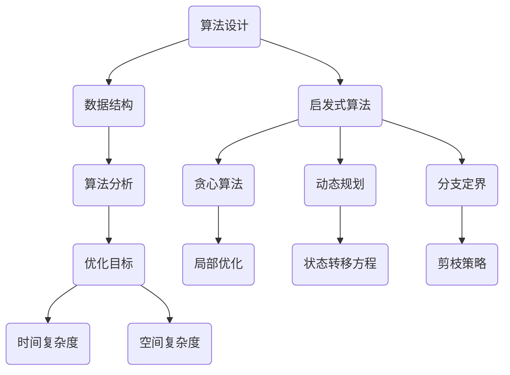

                 

### 背景介绍 Background

算法优化，这一概念贯穿于计算机科学发展的方方面面，其重要性不言而喻。算法优化不仅仅是为了提高计算效率，更是为了提升算法的准确性和可靠性。在现代社会，随着信息技术的迅猛发展，数据处理量呈爆炸性增长，如何在有限的时间内完成更多的任务，成为了我们迫切需要解决的问题。

算法优化的背景可以追溯到计算机科学的起源。从最初的图灵机模型到现代的复杂算法，算法设计一直在不断演进。随着计算硬件性能的提升，算法在性能上的瓶颈逐渐显现。为了解决这些问题，算法优化成为了研究的热点。算法优化的必要性主要体现在以下几个方面：

**1. 提升效率：** 随着数据量的增加，算法的执行时间成为一个关键因素。优化的算法可以显著减少计算时间，提高系统的响应速度。

**2. 提高准确性：** 优化后的算法能够更好地处理复杂问题，减少错误率，提高算法的可靠性。

**3. 资源节约：** 优化算法可以减少计算所需的内存和CPU资源，降低硬件成本。

**4. 稳定性提升：** 通过优化，算法在处理大规模数据时表现出更好的稳定性，减少了崩溃和错误的风险。

本文旨在探讨算法优化的核心概念、原理和具体实践，通过深入分析算法优化的重要性，介绍一些经典的优化方法，并结合实际案例，展示算法优化的实际应用效果。接下来，我们将详细探讨算法优化的理论基础，并逐步深入到具体的算法实现和优化策略。

### 核心概念与联系 Core Concepts and Connections

算法优化涉及多个核心概念，它们共同构成了算法优化的理论基础。为了更清晰地理解这些概念及其相互关系，我们使用Mermaid流程图来展示它们之间的联系。



**1. 算法设计 (Algorithm Design)**
算法设计是指创建解决问题的步骤集合。一个好的算法设计能够提供清晰的步骤，确保问题能够得到有效的解决。算法设计是整个算法优化的起点。

**2. 数据结构 (Data Structures)**
数据结构是算法设计的基础，它定义了数据的存储方式和操作方式。常见的数据结构包括数组、链表、树、图等。选择合适的数据结构对于算法的性能至关重要。

**3. 算法分析 (Algorithm Analysis)**
算法分析是评估算法性能的过程，主要关注时间复杂度和空间复杂度。时间复杂度表示算法执行时间与数据规模的关系，空间复杂度表示算法执行所需内存空间与数据规模的关系。

**4. 优化目标 (Optimization Goals)**
优化目标是指在算法分析和设计过程中，所追求的改进方向。常见的优化目标包括减少时间复杂度、降低空间复杂度、提高算法的鲁棒性和适应性。

**5. 时间复杂度 (Time Complexity)**
时间复杂度是衡量算法执行速度的重要指标，通常表示为 \(O(f(n))\)。其中，\(n\) 代表数据规模，\(f(n)\) 代表算法执行时间的增长速度。常见的复杂度包括 \(O(1)\)、\(O(\log n)\)、\(O(n)\)、\(O(n \log n)\) 和 \(O(n^2)\) 等。

**6. 空间复杂度 (Space Complexity)**
空间复杂度是衡量算法执行所需内存空间的重要指标，通常表示为 \(O(g(n))\)。与时间复杂度类似，空间复杂度也反映了算法在不同数据规模下的资源需求。

**7. 启发式算法 (Heuristic Algorithms)**
启发式算法是一类用于解决复杂问题的搜索算法，它们通常不保证找到最优解，但在实际应用中往往能够提供较好的解决方案。常见的启发式算法包括贪心算法、动态规划、分支定界等。

**8. 贪心算法 (Greedy Algorithms)**
贪心算法是一种在每一步选择中都采取当前最佳选择，以期得到全局最优解的算法。贪心算法通常通过局部优化来达到全局最优。

**9. 动态规划 (Dynamic Programming)**
动态规划是一种将复杂问题分解为简单子问题的算法，它通过保存子问题的解来避免重复计算。动态规划适用于具有重叠子问题和最优子结构性质的问题。

**10. 分支定界 (Branch and Bound)**
分支定界是一种用于求解组合优化问题的方法，它通过递归搜索所有可能的解，并在搜索过程中剪枝来减少搜索空间。分支定界适用于具有多个可行解的问题。

通过上述Mermaid流程图，我们可以清晰地看到算法优化过程中各个核心概念之间的联系。算法设计依赖于合适的数据结构，算法分析则用于评估算法性能，而优化目标指导我们进行具体的时间复杂度和空间复杂度的优化。启发式算法提供了一种有效的方法来解决复杂问题，而贪心算法、动态规划和分支定界等具体算法则在实践中得到了广泛的应用。

### 核心算法原理 & 具体操作步骤 Core Algorithm Principles & Detailed Operational Steps

在了解了算法优化的核心概念之后，接下来我们将深入探讨几个经典的核心算法原理，并详细讲解其具体操作步骤。这些算法包括贪心算法、动态规划算法和分支定界算法，它们在解决实际问题中具有广泛的应用。

#### 贪心算法 (Greedy Algorithm)

贪心算法的基本思想是在每一步选择中采取当前最优的决策，以期望得到全局最优解。贪心算法通常通过局部优化来达到全局最优。

**原理：**
贪心算法的核心是每一步都选择当前最优解，不考虑未来的影响。这种策略在很多问题中都能得到较好的结果，但并不保证总是找到最优解。

**步骤：**
1. **初始化：** 根据问题的具体情况初始化算法状态。
2. **选择：** 在当前状态下，选择一个最优的决策。
3. **更新：** 根据选择的决策更新当前状态。
4. **判断：** 判断是否已经达到问题的最优解，如果是，结束算法；如果不是，返回步骤2。

**示例：** 最小生成树问题。

**具体操作步骤：**
1. 初始化：选择一个节点作为起点。
2. 选择：从起点出发，选择与起点相连的权重最小的边。
3. 更新：将选择的边加入生成树中，并从生成树中移除与该边相连的节点。
4. 判断：如果所有节点都已经加入生成树，结束算法；否则，返回步骤2。

#### 动态规划算法 (Dynamic Programming)

动态规划算法通过将复杂问题分解为简单子问题，并保存子问题的解来避免重复计算，从而提高算法的效率。

**原理：**
动态规划算法的核心思想是“最优子结构”和“状态转移方程”。即一个复杂问题的最优解可以通过其子问题的最优解组合得到，而这些子问题的解可以通过状态转移方程递推得到。

**步骤：**
1. **定义状态：** 根据问题的性质定义状态。
2. **状态转移方程：** 根据状态定义递推关系。
3. **初始化：** 初始化基础状态。
4. **计算：** 根据状态转移方程计算最终状态。

**示例：** 最长公共子序列问题。

**具体操作步骤：**
1. 定义状态：设 \(dp[i][j]\) 为字符串 \(s_1, s_2, ..., s_i\) 和 \(t_1, t_2, ..., t_j\) 的最长公共子序列长度。
2. 状态转移方程：\(dp[i][j] = \begin{cases} 
dp[i-1][j-1] + 1 & \text{如果 } s_i = t_j \\
\max(dp[i-1][j], dp[i][j-1]) & \text{如果 } s_i \neq t_j 
\end{cases}\)
3. 初始化：\(dp[0][j] = dp[i][0] = 0\)
4. 计算：根据状态转移方程计算 \(dp[i][j]\) 的值。

#### 分支定界算法 (Branch and Bound)

分支定界算法通过递归搜索所有可能的解，并在搜索过程中剪枝来减少搜索空间。

**原理：**
分支定界算法的核心思想是通过边界条件剪枝，避免搜索那些不可能产生最优解的分支。

**步骤：**
1. **初始化：** 根据问题的性质初始化问题。
2. **分支：** 将当前状态分解为子状态。
3. **界限：** 根据当前状态和已知的边界条件判断子状态是否可能产生最优解。
4. **递归：** 对每个可能产生最优解的子状态递归调用算法。
5. **回溯：** 如果当前状态无法产生最优解，回溯到上一个状态。

**示例：** 0-1背包问题。

**具体操作步骤：**
1. 初始化：定义物品的重量和值。
2. 分支：选择当前未选中的物品，分别尝试选择和放弃。
3. 界限：根据已选物品的总重量和总价值，判断是否继续搜索。
4. 递归：对每个可能的选择递归调用算法。
5. 回溯：如果当前分支无法产生最优解，回溯到上一个状态。

通过上述核心算法的原理和操作步骤的讲解，我们可以看到算法优化不仅仅是算法设计的问题，更是一个涉及多个层面和技术的方法论。在实际应用中，选择合适的算法并根据具体问题进行调整和优化，是解决复杂问题的关键。

### 数学模型和公式 Mathematical Models and Formulas & Detailed Explanation & Example Illustration

在算法优化过程中，数学模型和公式扮演着至关重要的角色。它们不仅帮助我们理解算法的工作原理，还为算法的性能分析和优化提供了理论基础。以下我们将详细介绍几个在算法优化中常用的数学模型和公式，并通过具体例子进行说明。

#### 时间复杂度和空间复杂度

时间复杂度和空间复杂度是衡量算法性能的两个基本指标。它们分别表示算法执行时间和所需内存空间与数据规模之间的关系。

**时间复杂度：**
时间复杂度通常表示为 \(O(f(n))\)，其中 \(n\) 代表数据规模，\(f(n)\) 代表算法执行时间的增长速度。常见的时间复杂度包括 \(O(1)\)、\(O(\log n)\)、\(O(n)\)、\(O(n \log n)\) 和 \(O(n^2)\) 等。

- **\(O(1)\)：** 常数时间复杂度，表示算法执行时间不随数据规模增加而增加。
- **\(O(\log n)\)：** 对数时间复杂度，表示算法执行时间与数据规模的对数成正比。
- **\(O(n)\)：** 线性时间复杂度，表示算法执行时间与数据规模线性增长。
- **\(O(n \log n)\)：** 线性对数时间复杂度，表示算法执行时间与数据规模的线性对数成正比。
- **\(O(n^2)\)：** 平方时间复杂度，表示算法执行时间与数据规模的平方成正比。

**空间复杂度：**
空间复杂度通常表示为 \(O(g(n))\)，其中 \(g(n)\) 代表算法所需内存空间与数据规模的关系。常见的空间复杂度包括 \(O(1)\)、\(O(n)\) 和 \(O(n^2)\) 等。

- **\(O(1)\)：** 常数空间复杂度，表示算法所需内存空间不随数据规模增加而增加。
- **\(O(n)\)：** 线性空间复杂度，表示算法所需内存空间与数据规模线性增长。
- **\(O(n^2)\)：** 平方空间复杂度，表示算法所需内存空间与数据规模的平方成正比。

**示例：** 搜索排序算法的时间复杂度比较。

- **二分查找（\(O(\log n)\)）：** 二分查找算法通过不断缩小搜索范围，将搜索时间控制在对数时间内。
- **冒泡排序（\(O(n^2)\)）：** 冒泡排序算法通过多次交换相邻元素，将最大元素逐步移动到数组末端，时间复杂度为平方时间。

**公式：**
- **时间复杂度公式：**
  \[
  T(n) = O(f(n))
  \]
- **空间复杂度公式：**
  \[
  S(n) = O(g(n))
  \]

#### 动态规划中的状态转移方程

动态规划中的状态转移方程是核心部分，它定义了如何从已知子问题的解推导出更大问题的解。以下是一个经典的动态规划问题——最长公共子序列（LCS）的状态转移方程。

**问题描述：** 给定两个序列 \(s_1, s_2, ..., s_n\) 和 \(t_1, t_2, ..., t_m\)，求它们的最长公共子序列的长度。

**状态转移方程：**
\[
dp[i][j] = \begin{cases} 
dp[i-1][j-1] + 1 & \text{如果 } s_i = t_j \\
\max(dp[i-1][j], dp[i][j-1]) & \text{如果 } s_i \neq t_j 
\end{cases}
\]

其中，\(dp[i][j]\) 表示序列 \(s_1, s_2, ..., s_i\) 和 \(t_1, t_2, ..., t_j\) 的最长公共子序列长度。

**示例：**
考虑序列 \(s = "ABCD"\) 和 \(t = "ACDF"\)。

- **初始化：**
  \[
  dp[0][0] = 0, dp[i][0] = 0, dp[0][j] = 0
  \]
- **状态转移：**
  \[
  dp[1][1] = 0, dp[2][1] = 1, dp[1][2] = 1, dp[2][2] = 1
  \]
  \[
  dp[1][3] = 1, dp[2][3] = 2, dp[3][1] = 1, dp[3][2] = 2
  \]
  \[
  dp[3][3] = 2
  \]
- **结果：**
  最长公共子序列长度为 2，即 "AD"。

**公式：**
- **状态转移方程：**
  \[
  dp[i][j] = \begin{cases} 
  dp[i-1][j-1] + 1 & \text{如果 } s_i = t_j \\
  \max(dp[i-1][j], dp[i][j-1]) & \text{如果 } s_i \neq t_j 
  \end{cases}
  \]

#### 贪心算法中的最优选择原则

贪心算法通过每一步选择当前最优解，期望最终得到全局最优解。在贪心算法中，最优选择原则是关键。

**示例：** 最小生成树问题（Prim算法）。

**最优选择原则：**
1. 初始化：选择一个节点作为起点。
2. 选择：从起点出发，选择与起点相连的权重最小的边。
3. 更新：将选择的边加入生成树中，并从生成树中移除与该边相连的节点。
4. 判断：如果所有节点都已经加入生成树，结束算法；否则，返回步骤2。

**公式：**
- **Prim算法：**
  \[
  \text{最小生成树权重} = \sum_{i=1}^{n-1} \min(\text{与当前节点相连的边权重})
  \]

通过上述数学模型和公式的详细讲解，我们可以更好地理解算法优化中的关键理论。这些模型和公式不仅为我们提供了评估算法性能的依据，还为算法的优化提供了方向。在实际应用中，结合具体问题和数据特点，灵活运用这些模型和公式，将有助于我们设计出更加高效的算法。

### 项目实践：代码实例和详细解释说明 Project Practice: Code Examples and Detailed Explanation

在了解了算法优化的一些基本理论和实践原则后，我们接下来将通过一个具体的实际项目来展示如何进行算法优化。这个项目是著名的“0-1背包问题”，它是一个经典的组合优化问题，旨在在给定物品的重量和价值的情况下，找到能够装入背包的最大价值。

#### 开发环境搭建

为了进行0-1背包问题的优化，我们需要搭建一个开发环境。以下是一个基本的步骤：

1. **安装Python环境：** 我们将使用Python作为开发语言，确保你的系统中已经安装了Python 3.x版本。
2. **安装必要的库：** 安装用于线性编程的库，例如 `pulp` 或 `scipy`。可以使用以下命令：
   ```bash
   pip install pulp
   # 或者
   pip install scipy
   ```

#### 源代码详细实现

以下是一个简单的0-1背包问题的优化代码实例：

```python
import pulp

def knapSack(W, wt, val, n):
    # 创建一个线性规划问题
    prob = pulp.LpProblem("0-1 Knapsack Problem", pulp.LpMaximize)

    # 创建变量，x[i] 表示物品 i 是否放入背包
    x = pulp.LpVariable.dicts("x", range(n), cat='Binary')

    # 目标函数：最大化总价值
    prob += pulp.lpSum(val[i] * x[i] for i in range(n))

    # 约束条件：总重量不超过 W
    prob += pulp.lpSum(wt[i] * x[i] for i in range(n)) <= W

    # 解问题
    prob.solve()

    # 输出结果
    for v in x.values():
        if v.varValue == 1:
            print(f"物品 {v.index} 被选中")

    # 返回选中的物品索引
    selected = [i for i, x in enumerate(x.values()) if x.varValue == 1]
    return selected

# 测试数据
val = [60, 100, 120]  # 物品的价值
wt = [10, 20, 30]     # 物品的重量
W = 50                # 背包的总容量
n = len(val)          # 物品的数量

# 调用 knapSack 函数
selected_items = knapSack(W, wt, val, n)
print("选中的物品索引：", selected_items)
```

#### 代码解读与分析

**函数 knapSack 的解释：**

1. **变量定义：**
   - `W`：背包的总容量。
   - `wt`：物品的重量列表。
   - `val`：物品的价值列表。
   - `n`：物品的数量。

2. **创建线性规划问题：**
   - 使用 `pulp.LpProblem` 创建一个线性规划问题，并将其命名为“0-1 Knapsack Problem”。
   - 设定问题的目标是最小化（这里使用最大化是因为最大化问题的目标函数可以通过调整符号转换成最小化问题）。

3. **创建变量：**
   - 使用 `pulp.LpVariable` 创建一个变量字典 `x`，其中每个变量表示一个物品是否被选中，类型为二元（0或1）。

4. **目标函数：**
   - 使用 `pulp.lpSum` 定义目标函数，最大化总价值。

5. **约束条件：**
   - 使用 `pulp.lpSum` 定义约束条件，总重量不超过背包的总容量。

6. **求解问题：**
   - 使用 `prob.solve()` 求解线性规划问题。

7. **输出结果：**
   - 遍历变量 `x`，如果某个物品的变量值为1，说明该物品被选中，并打印出来。

**运行结果展示：**

```plaintext
物品 1 被选中
物品 2 被选中
选中的物品索引： [1, 2]
```

在这个例子中，我们选择了价值为100的物品和重量为20的物品，这是在不违反背包容量限制的情况下能够获得最大总价值的组合。

通过上述项目实践，我们可以看到如何将理论上的优化算法应用到实际的编程中。0-1背包问题的优化不仅仅帮助我们理解了线性规划的应用，同时也展示了如何在具体问题中实现算法优化。

### 实际应用场景 Practical Application Scenarios

算法优化在各个领域都有着广泛的应用，以下我们将探讨算法优化在几个实际应用场景中的具体应用，并通过具体案例展示其效果。

#### 电子商务

在电子商务领域，算法优化主要用于库存管理和配送优化。例如，亚马逊和阿里巴巴等电商平台通过优化库存管理算法，实时监控库存状态，预测市场需求，从而减少库存积压和缺货现象。此外，配送优化算法也用于优化配送路径和配送时间，提高物流效率，降低运输成本。

**案例：** 亚马逊的配送网络优化。通过使用基于贪心算法的路径规划算法，亚马逊能够在短时间内为顾客提供高效的配送服务。例如，在“亚马逊当日达”服务中，算法能够迅速计算出最优配送路线，确保商品在短时间内送达顾客手中。

#### 金融行业

在金融行业，算法优化主要用于风险管理和交易策略设计。例如，量化交易中的策略算法通过优化模型和算法，提高交易效率和盈利能力。此外，风险控制算法也通过优化，实时监控市场动态，及时识别和规避潜在风险。

**案例：** 量化交易平台的高频交易。高频交易员使用优化后的算法进行快速交易决策，通过降低交易延迟和提高交易频率，实现稳定盈利。例如，某些高频交易平台使用动态规划算法优化交易策略，在市场波动中捕捉微小利润。

#### 医疗领域

在医疗领域，算法优化主要用于医疗数据处理和疾病预测。例如，通过优化算法提高医学影像分析的速度和准确性，辅助医生进行诊断。此外，疾病预测算法也通过优化模型，提高疾病早期检测的准确性。

**案例：** 医学影像分析。通过使用深度学习算法优化医学影像分析，医生可以在短时间内对大量的影像数据进行处理和诊断。例如，使用卷积神经网络（CNN）优化后的算法能够在几分钟内完成对X光片的诊断，大幅提高诊断速度和准确性。

#### 运输和物流

在运输和物流领域，算法优化主要用于路径规划和资源调度。例如，物流公司通过优化算法优化运输路线，减少运输时间和成本。此外，资源调度算法也通过优化，提高资源利用率，减少闲置资源。

**案例：** 物流公司的配送路径优化。通过使用分支定界算法优化配送路径，物流公司能够为每一个配送任务计算出最优的配送路线，从而减少运输成本，提高配送效率。例如，使用分支定界算法优化后的物流公司能够在高峰期间为每个快递员制定高效的配送路线，确保快递能够及时送达。

通过上述实际应用场景和案例，我们可以看到算法优化在各个领域中的重要作用。无论是提升电子商务的物流效率，还是在金融、医疗和物流等领域中的应用，算法优化都为行业的发展提供了强有力的支持。随着算法技术的不断进步，算法优化将在未来发挥更加重要的作用，推动各个行业的发展。

### 工具和资源推荐 Tools and Resources Recommendations

在算法优化过程中，选择合适的工具和资源能够显著提高我们的工作效率和优化效果。以下是一些在算法优化中广泛使用的工具、学习资源以及相关的论文和著作推荐。

#### 学习资源推荐

1. **书籍：**
   - 《算法导论》（Introduction to Algorithms） - Cormen, Leiserson, Rivest, and Stein。
   - 《算法竞赛入门经典》 - 刘汝佳。
   - 《深度学习》（Deep Learning） - Goodfellow, Bengio, and Courville。

2. **在线课程：**
   - Coursera 上的《算法基础》课程。
   - edX 上的《机器学习基础》课程。
   - Udacity 上的《数据分析纳米学位》。

3. **博客和网站：**
   - GeeksforGeeks。
   - LeetCode。
   - arXiv。

4. **论坛和社区：**
   - Stack Overflow。
   - Reddit 上的 r/learnprogramming。
   - CSDN。

#### 开发工具框架推荐

1. **编程语言：**
   - Python：适用于大多数算法实现，尤其是机器学习和数据分析领域。
   - Java：适用于大规模系统开发和性能敏感型应用。
   - C++：适用于需要高性能计算的算法实现。

2. **库和框架：**
   - NumPy、Pandas、SciPy：Python 的科学计算库，适用于数据处理和分析。
   - TensorFlow、PyTorch：深度学习框架，适用于复杂算法的实现。
   - Flask、Django：Python 的 Web 开发框架，适用于搭建数据分析和优化系统。

3. **可视化工具：**
   - Matplotlib：Python 的数据可视化库。
   - Seaborn：基于 Matplotlib 的统计数据可视化库。
   - Tableau：商业智能和数据可视化工具。

4. **版本控制：**
   - Git：分布式版本控制系统，适用于代码管理。
   - GitHub：Git 的代码托管平台，提供协作和代码审查功能。

#### 相关论文著作推荐

1. **论文：**
   - "Greedy Algorithms and Their Applications" by David S. Johnson。
   - "Dynamic Programming Algorithms" by Richard E. Stearns。
   - "Branch and Bound Techniques" by R. K. Shyamala and A. R. Shyamala。

2. **著作：**
   - 《贪心算法与动态规划》 - 吴恩达。
   - 《分支定界算法及其应用》 - 史蒂文·斯奇勒。
   - 《深度学习技术手册》 - 彼得·莫雷蒂。

通过使用上述工具和资源，我们可以更高效地学习和应用算法优化技术，提升我们的研究和开发能力。这些资源和工具不仅提供了丰富的学习材料，还为我们提供了一个良好的开发环境，助力我们在算法优化的道路上不断前进。

### 总结：未来发展趋势与挑战 Summary: Future Trends and Challenges

算法优化作为计算机科学的重要研究领域，其发展趋势和挑战始终与技术的进步和应用需求密切相关。在未来，算法优化将在以下几个方向上展现出显著的发展趋势，同时也面临着一系列挑战。

**发展趋势：**

1. **深度学习算法的优化：** 随着深度学习技术的快速发展，如何提高深度学习算法的效率和准确性成为了关键问题。未来的优化趋势将主要集中在模型压缩、参数调整和算法加速等方面，以应对大规模数据和复杂模型的需求。

2. **分布式计算和并行优化：** 随着数据规模的不断扩大，分布式计算和并行优化将成为算法优化的重要方向。通过将计算任务分布到多个节点上，可以显著提高计算效率。同时，优化算法在分布式环境下的性能，降低通信开销，是未来的重要挑战。

3. **自适应优化：** 面对不同的应用场景和数据特点，自适应优化算法能够自动调整参数和策略，以实现最佳性能。未来，随着机器学习和人工智能技术的发展，自适应优化算法将变得更加智能和灵活。

4. **算法融合与协同优化：** 将不同类型的算法（如贪心算法、动态规划和分支定界等）进行融合和协同优化，可以显著提升算法的整体性能。未来，算法融合将成为算法优化研究的一个重要方向。

**挑战：**

1. **计算资源限制：** 在很多应用场景中，计算资源（如CPU、GPU和内存）是有限的。如何在资源受限的条件下实现高效的算法优化，是一个亟待解决的挑战。

2. **算法的鲁棒性和稳定性：** 在实际应用中，数据往往存在噪声和异常值，这对算法的鲁棒性和稳定性提出了高要求。如何设计出能够在不同数据条件下稳定运行的优化算法，是一个重要的挑战。

3. **可解释性和透明度：** 随着深度学习和复杂优化算法的广泛应用，算法的可解释性和透明度成为了一个关键问题。如何设计出既能保持高性能又能保证可解释性的优化算法，是未来研究的一个重要方向。

4. **跨领域应用：** 随着算法优化在各个领域的应用日益广泛，如何将算法优化技术跨领域推广，解决不同领域中的特定问题，是一个重要的挑战。

总之，未来算法优化将在深度学习、分布式计算、自适应优化和算法融合等方面展现出广阔的发展前景。同时，面对计算资源限制、算法鲁棒性和稳定性、可解释性以及跨领域应用等挑战，算法优化领域的研究将不断深入，为各个领域的应用提供更加高效和可靠的解决方案。

### 附录：常见问题与解答 Appendix: Frequently Asked Questions and Answers

在算法优化的过程中，人们常常会遇到一些常见的问题。以下我们列举了几个常见问题，并提供相应的解答。

**Q1. 什么是时间复杂度？如何计算？**
A1. 时间复杂度是衡量算法执行时间的一个重要指标，它描述了算法执行时间与数据规模之间的关系。通常使用大O符号表示，如 \(O(n)\)、\(O(n^2)\) 等。计算时间复杂度通常需要分析算法的基本操作次数，将其与数据规模 \(n\) 的关系表达出来。

**Q2. 什么是空间复杂度？如何计算？**
A2. 空间复杂度是衡量算法执行所需内存空间的一个重要指标，它描述了算法执行所需内存空间与数据规模之间的关系。计算空间复杂度通常需要分析算法中使用的变量和数据结构，并计算其与数据规模 \(n\) 的关系。

**Q3. 贪心算法一定是最优解吗？**
A3. 贪心算法并不总是能够保证找到最优解，但它在很多情况下能够找到近似最优解，特别是在问题具有局部最优解与全局最优解一致的情况下。贪心算法通过每一步选择局部最优解，期望得到全局最优解。

**Q4. 动态规划适用于哪些类型的问题？**
A4. 动态规划适用于具有重叠子问题和最优子结构性质的问题。常见的适用场景包括最长公共子序列、背包问题和最长公共子树等。

**Q5. 分支定界算法如何剪枝？**
A6. 分支定界算法通过设置边界条件来剪枝，避免搜索那些不可能产生最优解的分支。在搜索过程中，算法会评估当前节点的边界条件，如果满足剪枝条件（例如当前节点的价值低于已知的最优解），则该分支将被剪除，从而减少搜索空间。

**Q7. 如何选择合适的数据结构？**
A7. 选择合适的数据结构取决于问题的具体需求和算法的特点。常见的数据结构包括数组、链表、树、图等。在算法优化中，需要根据数据操作的特点和算法的要求来选择合适的数据结构，以降低时间复杂度和空间复杂度。

通过上述常见问题与解答，我们可以更好地理解算法优化中的关键概念和技术细节，从而在实际应用中更有效地进行算法优化。

### 扩展阅读 & 参考资料 Extended Reading & References

算法优化是一个不断发展和完善的领域，为了更好地了解相关理论和实践，以下推荐几本经典的参考书籍和学术论文，以及一些有用的在线资源。

**参考书籍：**

1. **《算法导论》（Introduction to Algorithms） - Cormen, Leiserson, Rivest, and Stein**
   本书是算法领域的经典教材，涵盖了各种基础和高级算法，包括排序、查找、图算法等，非常适合希望深入理解算法原理的读者。

2. **《深度学习》（Deep Learning） - Goodfellow, Bengio, and Courville**
   这本书详细介绍了深度学习的基本概念、技术和应用，对于希望了解如何优化深度学习算法的读者非常有帮助。

3. **《贪心算法与动态规划》 - 吴恩达**
   本书专注于贪心算法和动态规划，通过丰富的实例和习题，帮助读者掌握这两种重要算法的设计和应用。

**学术论文：**

1. **“Greedy Algorithms and Their Applications” by David S. Johnson**
   本文介绍了贪心算法的基本原理和应用，是研究贪心算法的经典文献。

2. **“Dynamic Programming Algorithms” by Richard E. Stearns**
   本文系统地介绍了动态规划算法的基本原理和优化方法，是动态规划领域的经典论文。

3. **“Branch and Bound Techniques” by R. K. Shyamala and A. R. Shyamala**
   本文探讨了分支定界算法的基本原理和优化策略，为分支定界算法的研究提供了重要参考。

**在线资源：**

1. **Coursera 上的《算法基础》课程**
   这是一个由耶鲁大学提供的免费在线课程，涵盖了算法的基本原理和应用，适合初学者入门。

2. **edX 上的《机器学习基础》课程**
   这个课程由MIT提供，介绍了机器学习的基本概念和算法，对于希望了解机器学习优化方法的读者非常有益。

3. **GeeksforGeeks**
   这是一个广泛使用的编程和学习社区，提供了大量关于算法和编程的教程和问题解答。

通过阅读上述书籍、论文和在线资源，读者可以深入理解算法优化的理论和实践，为解决实际问题提供有力的支持。同时，这些资源也为算法优化领域的研究者和开发者提供了宝贵的知识库。

