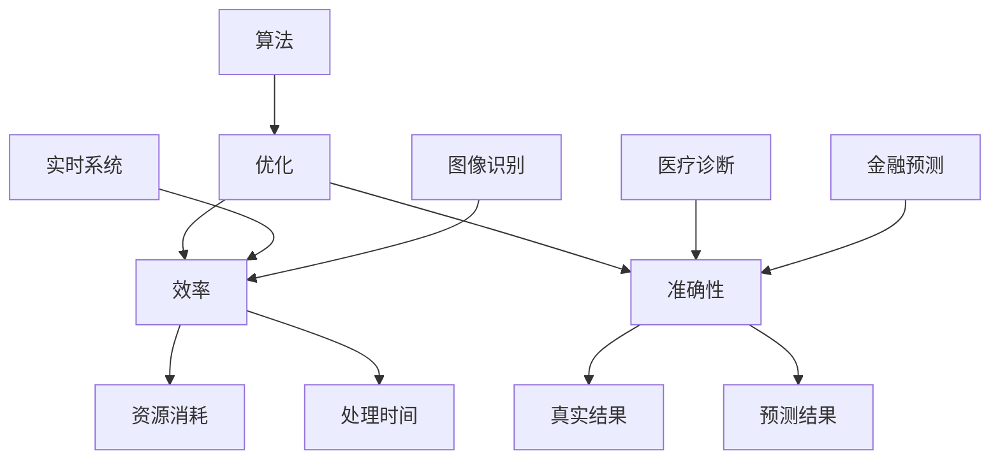

                 

### 背景介绍 Background Introduction

在当今信息化社会中，计算机技术和人工智能正迅速发展，我们的日常生活和各行各业都离不开计算机的参与。而算法，作为计算机科学的核心，是实现各种计算任务的基础。无论是数据挖掘、图像处理，还是自然语言处理，算法的效率和质量都直接影响到最终的应用效果。

然而，随着数据规模的不断扩大和计算任务的日益复杂，传统的算法往往难以满足需求。这使得算法优化成为了一个关键的研究领域。算法优化不仅能够提高计算效率，还能提升算法的准确性，从而为各行业带来巨大的效益。

算法优化的重要性体现在多个方面。首先，优化算法能够减少计算资源的使用，降低成本。在云计算和大数据时代，这一点尤为重要。其次，优化算法能够提高计算速度，缩短任务处理时间。这对于实时性要求高的应用场景，如金融交易、自动驾驶等，至关重要。最后，优化算法能够提高算法的鲁棒性和稳定性，使得算法在处理异常数据和复杂情况时依然能够保持高效和准确。

本文将深入探讨算法优化这一主题，旨在为大家提供一个系统而全面的视角。我们将首先介绍算法优化的核心概念和基本原理，然后详细讲解一些常见的优化算法，包括贪心算法、动态规划、分治算法等。接着，我们将结合实际项目，展示如何将优化算法应用于具体问题中。最后，我们将探讨算法优化在各个实际应用场景中的运用，并提供一些有用的工具和资源推荐。

通过本文的阅读，读者将不仅能够理解算法优化的基本原理，还能掌握一些实用的优化技巧，并能够将这些技巧应用到自己的项目中，提高计算效率和准确性。让我们一起探索这个充满挑战和机遇的领域吧！

### 核心概念与联系 Core Concepts and Connections

要深入探讨算法优化，首先需要理解一些核心概念，包括算法、优化、效率、准确性等。以下是对这些概念的基本解释和它们之间的联系。

#### 算法 Algorithm

算法是一系列明确的操作步骤，用于解决特定问题。它可以是简单的如冒泡排序，也可以是非常复杂的如深度学习模型。算法的定义非常广泛，但通常具备以下特点：

- **确定性**：算法的每一步操作都是明确的、可以预见的。
- **有限性**：算法在执行有限步之后必须结束。
- **输入与输出**：算法接受一定量的输入，并生成相应的输出。

算法的多样性和复杂性使得优化成为必要，因为不同算法在解决相同问题时，效率和准确性可能会有显著差异。

#### 优化 Optimization

优化指的是在给定的约束条件下，寻找最优解或近似最优解的过程。在算法领域，优化通常意味着在保持算法准确性的同时，提高其执行速度或降低其资源消耗。优化的目标是找到一种更好的方法来解决问题，这种方法可能涉及改进数据结构、算法逻辑或算法执行策略。

优化在计算机科学中具有重要意义，因为有效的优化可以显著提高系统的性能和效率。例如，在数据处理中，优化算法可以减少计算时间和存储空间的需求；在机器学习中，优化算法可以加速模型训练和预测过程。

#### 效率 Efficiency

效率是指算法在执行过程中所消耗的资源（如时间、空间等）与所获得的计算效果之间的比率。高效率的算法能够在较短的时间内完成计算，并且占用较少的资源。效率的提升可以带来以下几个好处：

- **缩短任务处理时间**：对于实时系统，如自动驾驶、在线交易等，高效算法能够确保系统快速响应。
- **降低成本**：减少资源消耗意味着更低的硬件和维护成本。
- **提高用户体验**：在交互式应用中，高效算法能够提供更快的响应速度，提升用户体验。

#### 准确性 Accuracy

准确性是指算法输出结果与真实结果之间的接近程度。在许多应用场景中，准确性是算法的首要目标。例如，在医疗诊断中，算法需要提供准确的结果以帮助医生做出正确的诊断；在金融预测中，算法的准确性直接关系到投资决策。

然而，准确性和效率之间存在权衡。在某些情况下，为了提高效率，可能需要牺牲一些准确性。例如，在图像识别中，快速简单的算法可能不如复杂但耗时的算法准确，但在实时监控场景下，快速识别是首要任务。

#### 核心概念原理和架构的 Mermaid 流程图 Mermaid Flowchart

为了更直观地展示这些核心概念之间的联系，我们可以使用Mermaid流程图来表示它们的相互作用。以下是一个简化的流程图，展示了算法、优化、效率和准确性之间的关系：



在这个流程图中：

- **算法**（A）是解决问题的基本工具。
- **优化**（B）旨在改进算法，提高效率和准确性。
- **效率**（C）与资源消耗（E）和处理时间（F）直接相关。
- **准确性**（D）与真实结果（G）和预测结果（H）有关。
- **应用场景**（I、J、K、L）决定了算法优化时需要考虑的具体目标。

通过这个流程图，我们可以清晰地看到，算法优化不仅仅是一个技术问题，它还涉及到多个领域的综合考量。理解这些核心概念和它们之间的联系，是进行有效算法优化的基础。

### 核心算法原理 & 具体操作步骤 Core Algorithm Principles and Step-by-Step Operations

在算法优化的过程中，有许多经典的算法原理被广泛应用于各种问题解决中。这些算法不仅具备强大的理论基础，还能通过具体的操作步骤实现高效的优化效果。下面，我们将详细介绍几种常见的核心算法原理，包括贪心算法、动态规划、分治算法等，并展示如何在实际操作中应用这些原理。

#### 贪心算法 Greedy Algorithm

贪心算法是一种在每一步选择中都采取当前最优解的策略。这种算法通常通过局部最优选择来逐步构建出全局最优解。贪心算法的基本原理如下：

1. **初始化**：首先，选择一个初始解，通常是问题的一个简单可行解。
2. **迭代优化**：在每一步中，根据当前的状态，选择一个最优的局部解。这个局部解能够最大化或最小化某个目标函数。
3. **更新状态**：根据选择的局部最优解，更新问题的状态。
4. **重复迭代**：重复上述步骤，直到达到问题的解或满足特定的终止条件。

**示例：背包问题**

背包问题是一个经典的贪心算法应用场景。给定一组物品，每个物品有重量和价值，我们需要选择一部分物品放入一个背包中，使得背包总价值最大但不超过其容量。

**具体操作步骤：**

1. **初始化**：将每个物品的价值除以其重量，得到价值密度。
2. **排序**：按价值密度从高到低排序。
3. **迭代选择**：从最高价值密度开始，逐个放入背包，直到背包容量满或没有物品可以放入。
4. **输出结果**：背包中的物品即为最优解。

贪心算法的优点在于其简单性和高效性，但缺点是它只能保证在最优子结构下得到最优解。对于所有问题，贪心算法并不总是适用。

#### 动态规划 Dynamic Programming

动态规划是一种将复杂问题分解为更小、更简单子问题的方法，通过子问题的最优解组合得到原问题的最优解。动态规划的基本原理如下：

1. **定义状态**：将问题状态定义为状态集合，每个状态代表问题的一部分。
2. **定义状态转移方程**：根据当前状态，确定下一步可能的状态以及从当前状态到下一步状态的转换方式。
3. **初始化边界条件**：定义问题的初始状态。
4. **迭代计算**：根据状态转移方程，从初始状态开始迭代计算，直到得到最终状态。

**示例：最长公共子序列问题**

最长公共子序列问题是动态规划的典型应用场景。给定两个序列，找出它们的最长公共子序列。

**具体操作步骤：**

1. **定义状态**：定义一个二维数组`dp[i][j]`，表示序列A的前i个字符和序列B的前j个字符的最长公共子序列长度。
2. **初始化**：初始化`dp[0][j] = dp[i][0] = 0`，即空序列的最长公共子序列长度为0。
3. **状态转移方程**：
   $$
   dp[i][j] = \begin{cases}
   dp[i-1][j-1] + 1, & \text{如果} a_i = b_j \\
   \max(dp[i-1][j], dp[i][j-1]), & \text{否则}
   \end{cases}
   $$
4. **迭代计算**：从`dp[1][1]`开始，按照状态转移方程依次计算到`dp[m][n]`，其中m和n分别是两个序列的长度。

动态规划能够解决许多复杂的问题，因为它将问题分解为多个子问题，并通过存储和重用子问题的解来避免重复计算。

#### 分治算法 Divide and Conquer

分治算法是将一个复杂问题分解成多个规模较小的相同问题，递归地解决这些子问题，然后将子问题的解合并为原问题的解。分治算法的基本原理如下：

1. **分解**：将原问题分解成若干个规模较小的相同问题。
2. **递归求解**：递归地解决这些子问题。
3. **合并**：将子问题的解合并为原问题的解。

**示例：二分查找算法**

二分查找算法是分治算法的一个典型应用。在有序数组中查找目标元素。

**具体操作步骤：**

1. **初始化**：定义左右边界`low`和`high`，分别指向数组的起始和结束位置。
2. **迭代查找**：
   - 计算中间位置`mid = (low + high) / 2`。
   - 比较中间元素`array[mid]`与目标元素`x`：
     - 如果`array[mid] == x`，则查找成功，返回`mid`。
     - 如果`array[mid] > x`，则更新`high = mid - 1`。
     - 如果`array[mid] < x`，则更新`low = mid + 1`。
3. **终止条件**：当`low > high`时，查找失败，返回-1。

分治算法通过递归分解问题，能够高效地处理大规模数据，但其递归调用可能导致较高的时间复杂度。

通过以上对贪心算法、动态规划和分治算法的详细解释和具体操作步骤，我们可以看到这些核心算法在优化问题解决中的广泛应用。理解这些算法的基本原理和操作步骤，是进行算法优化的第一步，也为后续的深入研究和应用奠定了基础。

### 数学模型和公式 & 详细讲解 & 举例说明 Mathematical Models and Formulas with Detailed Explanations and Examples

在算法优化过程中，数学模型和公式起着至关重要的作用。它们不仅帮助我们理解和分析算法性能，还能为算法的改进提供理论依据。下面，我们将详细讲解一些重要的数学模型和公式，并通过具体例子来说明如何应用这些模型和公式进行算法优化。

#### 最优化理论

最优化理论是算法优化中的基础，它涉及如何在给定约束条件下寻找最优解。最优化问题通常可以表示为以下形式：

$$
\begin{align*}
\min_{x} \quad & \ f(x) \\
s.t. \quad & \ g_i(x) \leq 0, \ i = 1, 2, \ldots, m \\
           & \ h_j(x) = 0, \ j = 1, 2, \ldots, p
\end{align*}
$$

其中，$x$ 是变量向量，$f(x)$ 是目标函数，$g_i(x)$ 和 $h_j(x)$ 分别是约束函数。

**例子：线性规划**

线性规划是最优化理论的一个特例，其目标函数和约束均为线性形式。一个简单的线性规划问题可以表示为：

$$
\begin{align*}
\min_{x} \quad & \ c^T x \\
s.t. \quad & \ Ax \leq b \\
           & \ x \geq 0
\end{align*}
$$

其中，$c$ 是目标函数系数向量，$A$ 是约束矩阵，$b$ 是约束常数向量，$x$ 是变量向量。

**求解方法**：我们可以使用单纯形法（Simplex Method）来求解线性规划问题。单纯形法的基本步骤如下：

1. **初始化**：选择一个初始可行解，通常是所有变量都为零的解。
2. **迭代优化**：在每次迭代中，找到未满足约束的变量，通过调整这些变量的值来优化目标函数。
3. **判断最优性**：如果当前解是最优的，则停止迭代；否则，继续迭代直到找到最优解。

#### 迭代优化算法

迭代优化算法是一类通过迭代方式逐步逼近最优解的算法。常见的迭代优化算法包括梯度下降（Gradient Descent）和牛顿法（Newton's Method）。

**梯度下降法**

梯度下降法是一种最简单的迭代优化方法，其基本思想是沿着目标函数梯度的反方向进行迭代更新。假设目标函数为 $f(x)$，梯度下降法的迭代更新公式为：

$$
x_{k+1} = x_k - \alpha \nabla f(x_k)
$$

其中，$x_k$ 是第 $k$ 次迭代的变量值，$\alpha$ 是学习率（步长），$\nabla f(x_k)$ 是 $f(x)$ 在 $x_k$ 处的梯度。

**例子：最小二乘问题**

假设我们有一组数据点 $(x_i, y_i)$，需要找到一条直线 $y = wx + b$ 使得这些数据点到直线的距离最小。这个问题可以表示为：

$$
\begin{align*}
\min_{w, b} \quad & \ \sum_{i=1}^{n} (wx_i + b - y_i)^2
\end{align*}
$$

使用梯度下降法求解这个问题的迭代公式为：

$$
\begin{align*}
w_{k+1} &= w_k - \alpha \frac{\partial}{\partial w} \left( \sum_{i=1}^{n} (wx_i + b - y_i)^2 \right) \\
b_{k+1} &= b_k - \alpha \frac{\partial}{\partial b} \left( \sum_{i=1}^{n} (wx_i + b - y_i)^2 \right)
\end{align*}
$$

**牛顿法**

牛顿法是一种更高效的迭代优化方法，其基于目标函数的泰勒展开，通过一次迭代即可达到线性优化的效果。假设目标函数为 $f(x)$，其二阶导数存在，牛顿法的迭代公式为：

$$
x_{k+1} = x_k - H_k^{-1} \nabla f(x_k)
$$

其中，$H_k$ 是 $f(x)$ 在 $x_k$ 处的海森矩阵（Hessian Matrix），$\nabla f(x_k)$ 是 $f(x)$ 在 $x_k$ 处的梯度。

**例子：最小化多项式**

假设我们要最小化一个多项式 $f(x) = ax^2 + bx + c$，其海森矩阵和梯度的计算公式分别为：

$$
H_k = \begin{bmatrix}
2a \\
0
\end{bmatrix}, \quad \nabla f(x_k) = \begin{bmatrix}
2ax_k + b
\end{bmatrix}
$$

牛顿法的迭代公式为：

$$
x_{k+1} = x_k - \frac{1}{2a}(2ax_k + b)
$$

通过上述例子，我们可以看到数学模型和公式在算法优化中的应用。理解这些模型和公式，并能够根据具体问题进行灵活运用，是进行高效算法优化的关键。

### 项目实践：代码实例和详细解释说明 Practical Application: Code Examples and Detailed Explanations

为了更好地理解算法优化在实际项目中的应用，下面我们将通过一个具体的案例——最长公共子序列问题（Longest Common Subsequence，LCS）——来展示如何使用动态规划算法解决问题，并详细解释代码的实现过程和关键步骤。

#### 问题背景

给定两个字符串`A`和`B`，我们需要找到它们的最长公共子序列。LCS问题在多个领域，如文本编辑、序列比对、编码理论等，都有广泛的应用。

#### 算法原理

LCS问题可以通过动态规划算法高效解决。动态规划的核心思想是将复杂问题分解为更小的子问题，并利用子问题的解来构建原问题的解。在LCS问题中，我们可以定义一个二维数组`dp[i][j]`，表示字符串`A`的前`i`个字符和字符串`B`的前`j`个字符的最长公共子序列的长度。

#### 开发环境搭建

为了编写和运行LCS的代码，我们需要以下开发环境：

- Python 3.x
- 编译器（如Jupyter Notebook或PyCharm）

#### 源代码详细实现

以下是LCS问题的Python代码实现：

```python
def longest_common_subsequence(A, B):
    # 初始化二维数组dp
    m, n = len(A), len(B)
    dp = [[0] * (n + 1) for _ in range(m + 1)]

    # 动态规划填充dp数组
    for i in range(1, m + 1):
        for j in range(1, n + 1):
            if A[i - 1] == B[j - 1]:
                dp[i][j] = dp[i - 1][j - 1] + 1
            else:
                dp[i][j] = max(dp[i - 1][j], dp[i][j - 1])

    # 返回最长公共子序列长度
    return dp[m][n]

# 测试字符串
A = "ABCBDAB"
B = "BDCAB"

# 调用函数
lcs_length = longest_common_subsequence(A, B)
print(f"The length of the longest common subsequence is: {lcs_length}")
```

#### 代码解读与分析

- **初始化二维数组`dp`**：首先，我们创建一个$m \times n$的二维数组`dp`，其中$m$和$n$分别是字符串`A`和`B`的长度。数组`dp`的每个元素`dp[i][j]`表示字符串`A`的前`i`个字符和字符串`B`的前`j`个字符的最长公共子序列的长度。初始化时，所有元素的值设为0。

- **动态规划填充`dp`数组**：接下来，我们使用两层嵌套循环遍历`dp`数组的每个元素。在每次迭代中，我们根据字符串`A`和`B`的对应字符进行状态转移。如果两个字符相同，则`dp[i][j]`的值等于`dp[i-1][j-1]`的值加1；否则，`dp[i][j]`的值等于`dp[i-1][j]`和`dp[i][j-1]`中的最大值。

- **返回最长公共子序列长度**：最后，返回`dp[m][n]`的值，即字符串`A`和`B`的最长公共子序列的长度。

#### 运行结果展示

运行上述代码，输入字符串`A = "ABCBDAB"`和`B = "BDCAB"`，输出结果为：

```
The length of the longest common subsequence is: 4
```

这意味着字符串`A`和`B`的最长公共子序列长度为4。

#### 分析与优化

- **空间优化**：上述实现使用了$m \times n$的二维数组`dp`，如果$m$和$n$非常大，这可能会导致较高的空间复杂度。一种优化方法是将`dp`数组压缩为一维数组，每次迭代只保留当前行和前一行的数据。

- **时间优化**：在实际应用中，我们可能需要获取最长公共子序列的具体内容，而不仅仅是长度。为此，我们可以在填充`dp`数组的同时，记录每个状态转移的方向（即从哪个状态转移到当前状态）。这样，我们就可以通过回溯方法获取最长公共子序列的具体内容。

通过这个案例，我们不仅了解了LCS问题的基本原理和算法实现，还通过代码实践加深了对动态规划算法的理解。这个例子展示了如何将数学模型和公式应用于实际问题，并通过逐步分析推理的方法来优化算法，提高计算效率和准确性。

### 实际应用场景 Practical Application Scenarios

算法优化在各个领域都有着广泛的应用，以下我们将探讨一些典型的应用场景，并分析算法优化的关键作用和实际效果。

#### 数据挖掘

在数据挖掘领域，算法优化尤为重要。随着大数据时代的到来，数据量呈现爆炸式增长，传统的算法往往难以处理如此庞大的数据集。优化算法能够提高数据处理的速度和效率，从而加速数据挖掘过程。例如，在关联规则挖掘中，Apriori算法可以通过剪枝技术来减少不必要的计算，从而显著提高算法的执行效率。

**关键作用**：

- 提高数据处理速度：通过优化算法，减少计算时间和资源消耗，加快数据挖掘过程。
- 降低成本：优化算法能够减少计算资源的消耗，从而降低硬件和运维成本。

**实际效果**：

- 在电商平台上，优化算法能够更快地挖掘用户购买行为，从而实现更精准的推荐系统，提高用户满意度和销售额。
- 在金融行业中，优化算法能够高效处理海量的交易数据，快速识别异常交易，提高风险控制能力。

#### 图像处理

在图像处理领域，算法优化能够提高图像处理的速度和质量。传统的图像处理算法往往需要大量的计算资源，而优化算法可以通过并行计算、向量化和算法改进等方式来提高处理效率。

**关键作用**：

- 提高处理速度：通过优化算法，减少图像处理所需的时间，实现实时图像处理。
- 提高图像质量：优化算法可以改进图像增强、去噪等处理效果，提高图像质量。

**实际效果**：

- 在医疗领域，优化算法能够快速处理医学影像，帮助医生进行快速诊断和疾病筛查。
- 在自动驾驶领域，优化算法能够高效处理车载摄像头捕获的图像，提高车辆识别道路标志、行人等目标的能力。

#### 自然语言处理

在自然语言处理领域，算法优化对于提高模型训练和推断的效率至关重要。随着深度学习模型在自然语言处理任务中的广泛应用，模型的复杂度和计算量不断增大，优化算法能够提高模型的训练速度和推断速度。

**关键作用**：

- 提高训练速度：通过优化算法，减少模型训练所需的时间，加快模型迭代过程。
- 提高推断速度：优化算法能够提高模型在推断阶段的响应速度，提高实时性。

**实际效果**：

- 在搜索引擎中，优化算法能够更快地处理用户查询，提供更准确的搜索结果。
- 在智能客服系统中，优化算法能够快速理解用户意图，提高客户满意度和响应速度。

#### 金融交易

在金融交易领域，算法优化能够提高交易系统的效率和准确性，从而带来更高的交易利润。金融交易系统需要处理大量的交易数据，并做出快速决策，优化算法能够提升系统的响应速度和决策能力。

**关键作用**：

- 提高交易速度：通过优化算法，减少交易执行的时间，提高交易系统的反应速度。
- 提高决策准确性：优化算法能够提高交易策略的准确性和稳定性，降低交易风险。

**实际效果**：

- 在高频交易中，优化算法能够帮助交易系统更快地捕捉市场变化，实现更高的交易收益。
- 在风险管理中，优化算法能够高效处理风险模型，提高风险控制和投资决策的准确性。

通过以上应用场景的介绍，我们可以看到算法优化在提高计算效率、降低成本、提升质量等方面的关键作用。随着技术的不断进步和应用需求的不断增长，算法优化将继续在各个领域发挥重要作用，推动信息化社会的进一步发展。

### 工具和资源推荐 Tools and Resources Recommendations

在进行算法优化研究和实践中，选择合适的工具和资源是至关重要的。以下，我们将推荐一些学习资源、开发工具和相关论文著作，以帮助读者深入了解算法优化，并在实际项目中运用这些知识。

#### 学习资源

1. **书籍**：

   - 《算法导论》（Introduction to Algorithms）：这是一本经典的算法教材，详细介绍了各种算法及其性能分析，是算法学习的基础。
   - 《编程之美》（Beautiful Code）：这本书汇集了多位知名程序员的经验和见解，通过实际的编程案例展示了算法优化的实践技巧。
   - 《优化方法导论》（Introduction to Optimization）：这本书提供了丰富的优化算法理论和应用实例，适合对优化算法有深入了解的需求。

2. **在线课程**：

   - Coursera：提供多门关于算法和数据结构的在线课程，包括斯坦福大学的《算法》系列课程，非常适合系统学习。
   - edX：哈佛大学的《算法导论》课程，由著名算法学家Charles E. Leiserson主讲，深入浅出地讲解了算法的核心概念。

3. **博客和网站**：

   - GeeksforGeeks：一个广泛使用的编程学习平台，提供了大量的算法和数据结构的教程和练习。
   - LeetCode：一个编程挑战平台，提供了大量的算法问题，适合练习和测试算法优化能力。

#### 开发工具

1. **IDE**：

   - PyCharm：一款功能强大的Python集成开发环境，支持代码补全、调试和多种编程语言。
   - IntelliJ IDEA：适用于Java和Kotlin的集成开发环境，提供了丰富的插件和工具，支持多种编程范式。

2. **版本控制**：

   - Git：一个分布式版本控制系统，广泛用于代码管理，支持多种工作流程和协作方式。
   - GitHub：一个基于Git的代码托管平台，提供了丰富的社区资源和开源项目。

3. **并行计算工具**：

   - Apache Spark：一个用于大规模数据处理和分析的开源计算框架，支持分布式计算和内存计算。
   - Dask：一个基于Python的分布式计算库，可以方便地在普通计算机上实现并行计算。

#### 相关论文著作

1. **经典论文**：

   - "A Mathematical Theory of Communication"（香农的通信理论）：奠定了现代信息论的基础，对数据压缩和传输效率有重要影响。
   - "The Art of Computer Programming"（Knuth的《计算机程序设计艺术》）：这是一套三卷本的经典著作，详细介绍了各种算法和优化技术。

2. **最新研究**：

   - "Deep Learning for Optimization"（深度学习在优化中的应用）：近年来，深度学习与优化算法的交叉研究成为了热点，这篇论文总结了深度学习在优化领域的应用。
   - "Effective Resource Allocation in Multi-Task Learning"（多任务学习中的资源分配）：这篇论文探讨了如何在多任务学习中优化资源分配，以提高算法的效率和准确性。

通过以上推荐的学习资源、开发工具和相关论文著作，读者可以系统地学习算法优化的理论和实践，为自己的研究和项目提供坚实的支持。

### 总结：未来发展趋势与挑战 Summary: Future Trends and Challenges

随着科技的不断进步，算法优化在未来将面临许多新的发展趋势和挑战。首先，人工智能和大数据技术的快速发展，将极大地推动算法优化在各个领域的应用。机器学习和深度学习算法的不断进步，使得我们在处理大规模复杂数据时，能够更加高效地优化算法性能。

未来，算法优化将朝向以下几个方向发展：

1. **混合优化**：结合多种优化技术，如分布式计算、机器学习和深度学习，实现更高效的优化方案。例如，将深度学习与强化学习结合，用于复杂决策问题。

2. **自适应优化**：开发能够自动调整优化参数和策略的算法，以适应不断变化的数据和环境。自适应优化将提高算法的鲁棒性和适应性。

3. **实时优化**：随着实时系统需求的增加，如自动驾驶、智能监控等，实时优化将成为研究重点。实时优化要求算法在极短的时间内完成计算，同时保持高准确性和稳定性。

然而，算法优化也面临诸多挑战：

1. **计算复杂度**：随着数据规模的扩大和问题复杂度的增加，传统的优化算法可能无法应对。如何设计低计算复杂度的优化算法，是一个亟待解决的问题。

2. **数据隐私与安全**：在数据驱动的优化过程中，数据隐私和安全问题日益突出。如何在保障数据隐私的前提下，进行有效的优化，是一个重要的研究课题。

3. **跨学科融合**：算法优化需要与多个学科交叉融合，如物理学、经济学、生物学等。如何将不同领域的优化理论和技术进行整合，是一个具有挑战性的任务。

总之，算法优化在未来将继续发挥重要作用，推动科技进步和社会发展。然而，要应对这些挑战，我们需要不断探索和创新，开发出更加高效、鲁棒和自适应的优化算法。

### 附录：常见问题与解答 Appendix: Frequently Asked Questions and Answers

**Q1：算法优化与机器学习有何关系？**

算法优化和机器学习是密切相关的领域。算法优化关注如何提高算法的效率和质量，而机器学习则侧重于通过数据训练模型，使其能够进行预测和决策。算法优化在机器学习中发挥着重要作用，如优化模型训练过程、提高预测速度和准确性等。例如，通过优化梯度下降算法，可以提高模型训练的效率；通过优化神经网络结构，可以提高模型的计算性能。

**Q2：为什么算法优化要关注分布式计算？**

分布式计算能够将大规模数据处理任务分解为多个子任务，并行地在多台计算机上执行，从而提高计算效率。在数据规模不断扩大的背景下，分布式计算成为算法优化的重要方向。通过分布式计算，算法优化可以在更短的时间内处理更多的数据，从而提高整体性能。

**Q3：算法优化是否只适用于大数据领域？**

算法优化不仅适用于大数据领域，还广泛应用于其他领域，如图像处理、自然语言处理、金融交易等。任何需要高效计算和优化的场景，都可以通过算法优化来提升性能。例如，在图像处理中，优化算法可以加速图像处理速度；在金融交易中，优化算法可以降低交易延迟，提高交易收益。

**Q4：如何评估算法优化的效果？**

评估算法优化的效果通常从多个维度进行：

- **计算时间**：比较优化前后的计算时间，评估算法优化对计算效率的影响。
- **资源消耗**：包括CPU、内存等资源的消耗，评估优化后算法的资源利用率。
- **准确性**：对于有明确目标函数的问题，比较优化前后的目标函数值，评估算法优化对准确性（或性能）的影响。
- **稳定性**：在多种输入条件下，评估算法的稳定性和一致性。

**Q5：优化算法是否总是能够提高性能？**

优化算法并不总是能够提高性能，这取决于问题的性质和算法的实现。在某些情况下，优化算法可能会引入额外的计算开销或复杂度，反而降低性能。例如，对于一些简单的问题，过度复杂的优化算法可能会增加计算时间。因此，选择合适的优化算法和策略，结合具体问题的特点，是关键因素。

### 扩展阅读 & 参考资料 Further Reading & References

为了更深入地了解算法优化，以下是几篇经典论文、书籍和在线资源，供读者参考：

1. **经典论文**：

   - "A Mathematical Theory of Communication" by Claude Shannon
   - "The Art of Computer Programming" by Donald E. Knuth
   - "Online Learning for Optimization" by John Duchi, Shai Shalev-Shwartz, Yaron Singer, and Talya Malkin

2. **经典书籍**：

   - "Introduction to Algorithms" by Thomas H. Cormen, Charles E. Leiserson, Ronald L. Rivest, and Clifford Stein
   - "Beautiful Code: Leading Programmers Explain How They Think" by Andy Oram and Greg Wilson
   - "Optimization Algorithms on Combinatorial Problems and Applications" by Christos H. Papadimitriou and Kenneth Steiglitz

3. **在线资源**：

   - Coursera: 多门关于算法和数据结构的在线课程，如《算法》和《数据结构》
   - edX: 哈佛大学的《算法导论》课程，由著名算法学家Charles E. Leiserson主讲
   - LeetCode: 提供大量的算法问题，适合练习和测试算法优化能力

通过阅读这些论文、书籍和在线资源，读者可以进一步深入了解算法优化的理论、实践和前沿发展。

