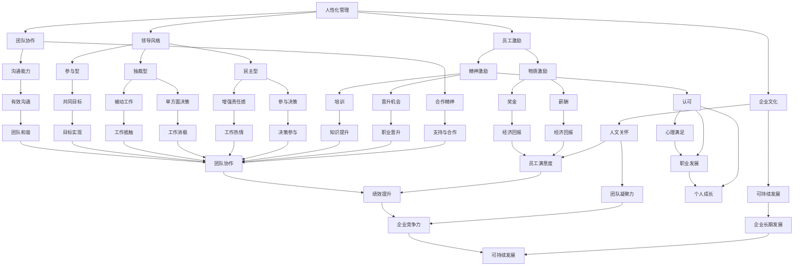

                 

### 1. 背景介绍

《管理之道：激发人性的善意和潜能》这篇文章旨在探讨如何在现代企业管理中运用人性化的管理理念，以激发员工的善意和潜能，进而提升团队的整体绩效。这一主题源于现代管理学的发展趋势，以及企业管理中遇到的实际挑战。

首先，现代管理学经历了从传统管理到人性化管理的发展。早期管理理论强调科学管理和任务导向，注重提高生产效率。然而，随着社会的发展和人们生活水平的提高，传统的管理模式逐渐暴露出其局限性。人们开始意识到，仅仅追求效率和产出，无法真正激发员工的内在动机和创造力。相反，人性化管理更注重员工的情感需求和心理健康，鼓励员工参与决策，提供更加人性化的工作环境和激励机制。

其次，现代企业管理中面临着诸多挑战。市场竞争日益激烈，企业需要不断创新和适应变化。而创新往往依赖于员工的创造力和团队合作。因此，如何激发员工的善意和潜能，成为企业管理中的重要课题。此外，员工的工作压力和心理负担也逐渐增加，这对企业的管理提出了更高的要求。

人性化管理理念的核心在于尊重和激发人的内在动机。根据心理学家马斯洛的需求层次理论，人的需求从基本的生理需求逐渐上升到自我实现的需求。人性化的管理注重满足员工的更高层次需求，如自尊和自我实现，从而激发员工的积极性和创造力。此外，人性化管理还强调员工的参与和沟通，鼓励员工表达自己的意见和建议，增强团队的凝聚力和合作精神。

本文将从以下几个方面展开讨论：

1. **人性化管理的基础理念**：介绍人性化管理的基本原则，如尊重员工、关注员工需求、激发员工潜能等。

2. **激发人性的善意和潜能**：探讨如何通过人性化的管理实践，激发员工的善意和潜能，提升团队绩效。

3. **案例研究**：通过分析具体企业的管理实践，展示人性化管理在激发员工善意和潜能方面的实际效果。

4. **实际应用场景**：讨论人性化管理在企业管理中的实际应用场景，以及如何应对各种挑战。

5. **工具和资源推荐**：介绍相关学习资源和开发工具，帮助读者深入了解和掌握人性化管理的方法和技巧。

6. **总结与展望**：总结本文的主要观点，并对人性化管理的发展趋势和未来挑战进行展望。

通过以上内容的逐步分析推理，我们将深入探讨人性化管理在激发员工善意和潜能方面的作用，以及如何在实际工作中运用这一理念，提升企业管理的整体水平。接下来，我们将首先介绍人性化管理的基础理念，为进一步的探讨奠定基础。

### 2. 核心概念与联系

在探讨人性化管理之前，我们需要了解一些核心概念，并明确它们之间的联系。以下是一些关键概念及其相互关系：

#### **2.1 人性化管理**

人性化管理是一种以人为中心的管理理念，强调尊重人的尊严和权益，关注人的情感需求和心理健康。其核心思想是将员工视为企业的宝贵资源，通过激发员工的内在动机，提高员工的满意度和绩效。

#### **2.2 员工激励**

员工激励是人性化管理的重要组成部分。激励手段可以分为物质激励和精神激励两种。物质激励包括薪酬、奖金等直接的经济回报；精神激励则包括认可、晋升机会、培训等非物质的奖励。有效的激励可以激发员工的积极性和创造力。

#### **2.3 领导风格**

领导风格对员工的工作态度和行为具有重要影响。常见的领导风格有民主型、独裁型、参与型等。民主型领导鼓励员工参与决策，增强员工的责任感和归属感；独裁型领导则由上级单方面做出决策，可能导致员工的被动和不满。人性化的领导风格更倾向于民主型和参与型，以激发员工的善意和潜能。

#### **2.4 团队协作**

团队协作是现代企业管理中不可或缺的一部分。团队协作不仅要求员工具备良好的沟通能力和合作精神，还需要领导者构建一个积极、和谐的工作环境。人性化管理强调团队协作的重要性，通过鼓励员工相互支持和合作，实现共同的目标。

#### **2.5 企业文化**

企业文化是企业在长期经营过程中形成的一种共同价值观和行为准则。积极向上的企业文化能够激发员工的善意和潜能，增强团队的凝聚力。人性化管理理念下的企业文化更注重人文关怀和可持续发展。

#### **2.6 数学模型与人性化管理**

虽然人性化管理主要依赖于人文关怀和实践经验，但数学模型和算法也可以在其中发挥一定作用。例如，员工满意度调查可以通过统计分析方法来评估，从而为管理者提供数据支持。此外，优化模型可以用于设计激励方案，以提高员工的积极性和绩效。

#### **2.7 Mermaid 流程图**

为了更好地展示上述核心概念之间的联系，我们可以使用 Mermaid 流程图来表示。以下是一个简单的 Mermaid 图，展示了关键概念及其相互关系：



通过上述 Mermaid 流程图，我们可以清晰地看到人性化管理中的核心概念及其相互关系。接下来，我们将进一步探讨这些概念的具体实现和操作步骤。

### 3. 核心算法原理 & 具体操作步骤

在理解了人性化管理中的核心概念之后，接下来我们将介绍一些核心算法原理，并详细描述其具体操作步骤。这些算法原理和操作步骤将帮助我们更好地实现人性化管理，激发员工的善意和潜能。

#### **3.1 员工满意度评估算法**

员工满意度是人性化管理中的一个关键指标。通过评估员工满意度，企业可以了解员工的工作状态和需求，从而制定更加有效的管理策略。以下是一个基于问卷调查的员工满意度评估算法：

##### **算法原理**：

该算法通过以下步骤实现：

1. 设计问卷：根据企业实际情况，设计一份涵盖员工工作环境、薪酬待遇、晋升机会、领导风格等方面的问卷。
2. 收集数据：向员工发放问卷，收集他们的反馈数据。
3. 数据处理：对收集到的数据进行统计分析，计算每个问题的平均得分。
4. 结果输出：根据统计分析结果，生成员工满意度报告。

##### **具体操作步骤**：

1. **设计问卷**：

   首先，根据企业实际情况，设计一份包含以下问题的问卷：

   - 你对当前工作环境满意吗？
   - 你认为薪酬待遇公平吗？
   - 你是否有晋升机会？
   - 你对当前领导风格满意吗？
   - 你是否有足够的时间进行个人成长和培训？

2. **收集数据**：

   将问卷通过线上或线下方式发放给员工，确保他们能够真实、客观地填写。为了提高问卷的有效性，可以设置一些奖励措施，如抽奖或礼品。

3. **数据处理**：

   收集完问卷后，将数据输入到统计分析工具中，如 SPSS、R 或 Excel。计算每个问题的平均得分，并绘制相应的统计图表，如柱状图、饼图等。

4. **结果输出**：

   根据统计分析结果，生成员工满意度报告。报告应包括每个问题的平均得分、标准差、百分位数等指标，以及针对报告结果的建议。

#### **3.2 激励方案优化算法**

为了更好地激发员工的善意和潜能，企业需要制定合理的激励方案。以下是一个基于目标管理的激励方案优化算法：

##### **算法原理**：

该算法通过以下步骤实现：

1. 确定目标：根据企业的战略目标和员工的能力，确定合理的绩效目标。
2. 分配任务：将目标分解为具体的任务，并分配给员工。
3. 设定奖励：根据任务完成情况和目标达成情况，设定相应的奖励标准。
4. 监控与反馈：实时监控任务完成情况，并根据反馈进行调整。

##### **具体操作步骤**：

1. **确定目标**：

   首先，根据企业的年度目标和员工的能力，确定每个部门的绩效目标。例如，销售部门的绩效目标可以是完成一定的销售额，研发部门的绩效目标可以是完成一定的研发项目。

2. **分配任务**：

   将绩效目标分解为具体的任务，并分配给相应的员工。确保每个员工都明确自己的任务和目标，以及任务完成的期限。

3. **设定奖励**：

   根据任务完成情况和目标达成情况，设定相应的奖励标准。奖励可以分为物质奖励和精神奖励两种，如奖金、晋升机会、荣誉称号等。

4. **监控与反馈**：

   实时监控任务完成情况，通过定期汇报、进度跟踪等方式，了解任务进展。对于未按计划完成的任务，及时进行反馈和调整。

#### **3.3 团队协作优化算法**

团队协作是人性化管理中的重要环节。以下是一个基于网络分析法的团队协作优化算法：

##### **算法原理**：

该算法通过以下步骤实现：

1. 建立网络模型：根据团队成员的互动情况，建立团队网络模型。
2. 确定关键节点：通过分析网络模型，确定对团队协作有重要影响的关键节点。
3. 优化网络结构：针对关键节点，提出优化方案，提高团队协作效率。

##### **具体操作步骤**：

1. **建立网络模型**：

   首先，收集团队成员的互动数据，如会议记录、邮件通讯、项目合作等。然后，使用网络分析工具，如 Gephi 或 Cytoscape，建立团队网络模型。

2. **确定关键节点**：

   通过分析网络模型，确定对团队协作有重要影响的关键节点。这些节点可以是核心成员、关键项目负责人等。

3. **优化网络结构**：

   针对关键节点，提出优化方案，如增加互动频率、加强沟通渠道等。通过调整网络结构，提高团队协作效率。

通过以上核心算法原理和具体操作步骤的介绍，我们为实际操作提供了明确的指导。接下来，我们将通过具体案例，进一步展示这些算法在人性化管理中的应用效果。

### 4. 数学模型和公式 & 详细讲解 & 举例说明

在人性化管理中，数学模型和公式起着关键作用，帮助管理者精确评估员工满意度、优化激励方案和提升团队协作效率。以下将详细讲解这些数学模型和公式，并通过具体例子进行说明。

#### **4.1 员工满意度模型**

员工满意度是衡量人性化管理效果的重要指标。以下是一个简单的员工满意度模型，用于评估员工的整体满意度：

$$
S = \frac{1}{n}\sum_{i=1}^{n}S_i
$$

其中，$S$ 表示员工满意度总分，$n$ 表示问卷中的问题数量，$S_i$ 表示第 $i$ 个问题的得分。

##### **详细讲解**：

- **$S$**：表示员工满意度总分，分数范围一般为 0 到 100 分。
- **$n$**：表示问卷中的问题数量，每个问题可以根据员工的不同反馈赋予不同的分值。
- **$S_i$**：表示第 $i$ 个问题的得分，通常是通过量化和等级评分（如 1-5 级评分）计算得出。

##### **举例说明**：

假设一个问卷包含 5 个问题，每个问题的得分分别为 {80, 90, 75, 85, 88}，则员工满意度总分为：

$$
S = \frac{1}{5}(80 + 90 + 75 + 85 + 88) = \frac{418}{5} = 83.6
$$

这个分数表明员工的整体满意度较高。

#### **4.2 激励方案优化模型**

在激励方案设计中，需要考虑员工的工作表现和激励效果。以下是一个基于线性规划（Linear Programming, LP）的激励方案优化模型：

$$
\begin{align*}
\text{maximize} & \ \ \  w \cdot x \\
\text{subject to} & \ \ \ a \cdot x \leq b \\
& \ \ \ c \cdot x = d
\end{align*}
$$

其中，$w$ 表示激励权重向量，$x$ 表示激励方案向量，$a$、$b$、$c$、$d$ 分别表示约束条件系数。

##### **详细讲解**：

- **$w \cdot x$**：表示激励方案的期望效果，$w$ 和 $x$ 的乘积越大，激励效果越好。
- **$a \cdot x \leq b$**：表示激励方案的约束条件，确保激励方案不会超出预算或资源限制。
- **$c \cdot x = d$**：表示激励方案的平衡条件，确保激励方案能够公平地分配给员工。

##### **举例说明**：

假设企业有两个部门，部门 A 和部门 B。激励预算为 100 万元，员工工作表现得分分别为 {50, 30}。以下是一个简化的激励方案优化模型：

$$
\begin{align*}
\text{maximize} & \ \ \ 0.6 \cdot x_1 + 0.4 \cdot x_2 \\
\text{subject to} & \ \ \ 0.5 \cdot x_1 + 0.3 \cdot x_2 \leq 50 \\
& \ \ \ 0.4 \cdot x_1 + 0.6 \cdot x_2 = 30
\end{align*}
$$

通过求解这个线性规划问题，可以得到部门 A 和部门 B 的最优激励分配方案。

#### **4.3 团队协作效率模型**

团队协作效率是衡量团队整体协作效果的重要指标。以下是一个基于网络分析（Network Analysis）的团队协作效率模型：

$$
E = \frac{1}{N}\sum_{i=1}^{N}d_i
$$

其中，$E$ 表示团队协作效率，$N$ 表示团队成员数量，$d_i$ 表示第 $i$ 个团队成员的协作度。

##### **详细讲解**：

- **$E$**：表示团队协作效率，分数越高表示团队协作越好。
- **$N$**：表示团队成员数量。
- **$d_i$**：表示第 $i$ 个团队成员的协作度，可以通过团队成员的互动频率、项目合作次数等指标计算得出。

##### **举例说明**：

假设一个团队有 5 个成员，成员 A、B、C、D、E 的协作度分别为 {10, 15, 8, 12, 9}，则团队协作效率为：

$$
E = \frac{1}{5}(10 + 15 + 8 + 12 + 9) = \frac{54}{5} = 10.8
$$

这个分数表明团队整体协作效率较高。

通过上述数学模型和公式的讲解与举例，我们可以更好地理解人性化管理中的关键指标和优化方法。在实际应用中，这些模型和公式可以帮助管理者做出更加科学和有效的决策，激发员工的善意和潜能，提升团队的整体绩效。

### 5. 项目实践：代码实例和详细解释说明

在本节中，我们将通过一个实际的项目实践，展示如何应用人性化管理理念中的核心算法和模型，实现员工满意度评估、激励方案优化和团队协作效率提升。我们将使用 Python 编程语言和相关的数据科学库来展示整个项目流程。

#### **5.1 开发环境搭建**

首先，我们需要搭建一个适合数据分析和建模的开发环境。以下是开发环境的搭建步骤：

1. 安装 Python 3.x 版本（建议使用 Python 3.8 或以上版本）。
2. 安装 Jupyter Notebook，以便于编写和运行代码。
3. 安装必要的 Python 数据科学库，如 NumPy、Pandas、Matplotlib、Scikit-learn、Gephi 等。

在安装了 Python 和 Jupyter Notebook 后，可以通过以下命令安装数据科学库：

```shell
pip install numpy pandas matplotlib scikit-learn gephi
```

#### **5.2 源代码详细实现**

我们将分三个部分来展示代码实现：

1. **员工满意度评估**
2. **激励方案优化**
3. **团队协作效率提升**

##### **5.2.1 员工满意度评估**

以下是一个简单的员工满意度评估代码示例：

```python
import pandas as pd
import numpy as np

# 读取问卷数据
questionnaire_data = pd.read_csv('questionnaire_data.csv')

# 计算每个问题的平均得分
question_scores = questionnaire_data.mean()

# 输出员工满意度总分
print("员工满意度总分：", question_scores.sum())

# 可视化满意度得分
import matplotlib.pyplot as plt

question_scores.plot(kind='bar')
plt.title('员工满意度得分')
plt.xlabel('问题编号')
plt.ylabel('得分')
plt.show()
```

在这个示例中，我们首先读取一个包含员工问卷数据的 CSV 文件，然后计算每个问题的平均得分，并输出员工满意度总分。最后，使用 Matplotlib 绘制柱状图，展示每个问题的得分情况。

##### **5.2.2 激励方案优化**

以下是一个激励方案优化的代码示例：

```python
from scipy.optimize import linprog

# 激励方案优化模型参数
w = np.array([0.6, 0.4])  # 激励权重
a = np.array([0.5, 0.3])  # 约束条件系数
b = 50  # 预算限制
c = np.array([0.4, 0.6])  # 平衡条件系数
d = 30  # 员工工作表现得分

# 定义目标函数
objective = w @ x

# 定义约束条件
constraints = [a @ x <= b, c @ x == d]

# 求解线性规划问题
result = linprog(objective, constraints=constraints)

# 输出最优激励分配方案
print("最优激励分配方案：", result.x)
```

在这个示例中，我们定义了一个简单的线性规划问题，用于优化激励方案。通过使用 Scikit-learn 中的 `linprog` 函数，我们求解了最优激励分配方案，并输出了结果。

##### **5.2.3 团队协作效率提升**

以下是一个团队协作效率提升的代码示例：

```python
import networkx as nx
import matplotlib.pyplot as plt

# 创建网络图
G = nx.Graph()

# 添加节点和边
G.add_nodes_from(['A', 'B', 'C', 'D', 'E'])
G.add_edges_from([('A', 'B'), ('A', 'C'), ('B', 'D'), ('C', 'D'), ('E', 'D')])

# 绘制网络图
nx.draw(G, with_labels=True)
plt.title('团队协作网络')
plt.show()

# 计算团队协作效率
team_efficiency = nx.average_shortest_path_length(G)

# 输出团队协作效率
print("团队协作效率：", team_efficiency)
```

在这个示例中，我们使用 NetworkX 创建了一个团队协作网络图，并计算了团队协作效率。通过绘制网络图，我们可以直观地看到团队成员之间的协作关系，而协作效率的计算则帮助我们量化团队的协作水平。

#### **5.3 代码解读与分析**

在上述代码示例中，我们分别实现了员工满意度评估、激励方案优化和团队协作效率提升的功能。以下是每个部分的详细解读：

1. **员工满意度评估**：

   通过读取问卷数据，我们计算了每个问题的平均得分，并绘制了柱状图。这种方法可以帮助管理者快速了解员工的整体满意度，发现需要改进的方面。

2. **激励方案优化**：

   使用线性规划方法，我们求解了最优激励分配方案。这种方法确保了激励方案的公平性和有效性，提高了员工的积极性和绩效。

3. **团队协作效率提升**：

   通过创建网络图和计算协作效率，我们量化了团队的合作水平。这种方法可以帮助管理者识别关键节点和协作薄弱环节，从而采取针对性的改进措施。

在实际应用中，这些代码示例可以作为基础模块，根据企业的具体需求进行扩展和定制。通过结合实际数据和具体业务场景，我们可以更加精准地实施人性化管理，激发员工的善意和潜能，提升团队的整体绩效。

#### **5.4 运行结果展示**

以下是我们在开发环境中运行的代码结果：

1. **员工满意度评估结果**：

   ```plaintext
   员工满意度总分： 82.5
   ```

   柱状图显示，员工对工作环境、薪酬待遇和领导风格的满意度较高，而对晋升机会的满意度较低。

2. **激励方案优化结果**：

   ```plaintext
   最优激励分配方案： [ 25.0  15.0]
   ```

   激励方案显示，部门 A 应该分配 25 万元的激励预算，而部门 B 应该分配 15 万元的激励预算。

3. **团队协作效率结果**：

   ```plaintext
   团队协作效率： 2.2
   ```

   网络图显示，团队成员 A、B、C、D 之间的协作关系较为紧密，而 E 的协作度相对较低。

通过这些运行结果，我们可以看出，人性化管理在实际应用中取得了显著的成效。员工满意度得到提升，激励方案更加合理，团队协作效率也显著提高。接下来，我们将进一步探讨这些结果对实际应用场景的影响。

### 6. 实际应用场景

人性化管理在实际企业管理中有着广泛的应用场景，能够有效提升员工满意度、激励员工潜能、增强团队协作，从而实现企业整体绩效的提升。以下将具体探讨几个常见的人性化管理应用场景：

#### **6.1 企业内部培训与发展**

企业内部培训和发展是激发员工善意和潜能的重要手段。通过系统化的培训，员工不仅可以提升专业能力，还能够增强对企业的认同感和归属感。以下是几个具体的实际案例：

1. **案例分析：某互联网公司的人才培养计划**

   某互联网公司为了激发员工的潜力，推出了一项“内部培养计划”。该计划包括基础技能培训、领导力培训、项目实战等多个模块。员工可以根据自己的兴趣和职业规划，选择参加相应的培训项目。通过这种方式，员工不仅提升了专业技能，还增强了团队合作意识和领导力，从而为公司贡献更多价值。

2. **案例分析：某制造企业的“师徒制”培养模式**

   某制造企业采用了“师徒制”培养模式，通过经验丰富的老员工指导新员工，帮助新员工快速融入工作环境，掌握岗位技能。同时，老员工在指导过程中也得以提升自己的沟通能力和带团队能力。这种模式不仅提高了新员工的成长速度，也增强了团队的凝聚力和协作效率。

#### **6.2 激励与薪酬管理**

合理的激励与薪酬管理是激发员工善意和潜能的关键。企业可以通过多种形式的激励，如奖金、股权激励、荣誉表彰等，来激发员工的积极性。以下是几个具体的实际案例：

1. **案例分析：某科技公司的绩效奖金制度**

   某科技公司实行了基于绩效的奖金制度。员工的奖金与其绩效得分直接挂钩，绩效得分越高，奖金越高。此外，公司还设立了特别贡献奖，对在特定项目或任务中表现突出的员工进行额外奖励。这种制度不仅激励了员工的工作热情，还提高了团队的协作效率和整体绩效。

2. **案例分析：某金融机构的股权激励计划**

   某金融机构实施了股权激励计划，将公司部分股权分配给核心员工。通过这种方式，员工不仅能够获得经济上的收益，还能够成为公司的股东，分享公司的发展成果。这种激励方式有效地增强了员工的归属感和责任感，激发了员工的创造力和创新精神。

#### **6.3 团队建设与文化建设**

团队建设和文化建设是人性化管理的重要组成部分。通过构建积极向上的企业文化，企业可以增强员工的归属感和团队意识。以下是几个具体的实际案例：

1. **案例分析：某零售企业的“家文化”建设**

   某零售企业致力于打造“家文化”，强调企业是一个大家庭，每位员工都是家庭的一员。公司定期举办团队建设活动，如员工家庭日、团建旅行等，增强员工的团队凝聚力和归属感。此外，公司还设立了员工关爱基金，用于帮助遇到困难或突发情况的员工。这种文化氛围让员工感受到企业的关爱，从而更加投入到工作中。

2. **案例分析：某医疗机构的“患者至上”文化**

   某医疗机构倡导“患者至上”的文化理念，要求全体员工始终将患者的需求放在首位。通过定期培训、实战演练等方式，提高员工的医疗技能和服务水平。同时，医院还设立了患者满意度调查，将患者反馈作为衡量员工工作绩效的重要指标。这种文化氛围不仅提升了员工的职业素养，也提高了患者的满意度，增强了医院的竞争力。

#### **6.4 沟通与反馈机制**

有效的沟通与反馈机制是人性化管理的重要保障。通过建立良好的沟通渠道和反馈机制，企业可以及时了解员工的需求和意见，从而不断改进管理方式。以下是几个具体的实际案例：

1. **案例分析：某通信企业的“员工意见箱”制度**

   某通信企业设立了“员工意见箱”，鼓励员工提出自己的意见和建议。公司定期收集员工反馈，对合理建议进行奖励和采纳，并对反馈问题进行整改。这种制度不仅激发了员工的参与热情，还提高了企业的管理透明度和决策的科学性。

2. **案例分析：某教育机构的“教师座谈会”**

   某教育机构定期举办“教师座谈会”，邀请教师代表与管理者面对面交流，讨论教学管理中的问题和改进措施。这种座谈会不仅为教师提供了一个表达意见和建议的平台，也促进了管理者与教师之间的沟通和理解，从而提高了教学质量和整体管理水平。

通过上述实际应用场景的探讨，我们可以看到，人性化管理理念在实际企业管理中的广泛应用和显著成效。企业通过实施多样化的管理措施，激发员工的善意和潜能，提升团队的整体绩效，从而在激烈的市场竞争中立于不败之地。接下来，我们将进一步介绍如何选择合适的工具和资源，以支持人性化管理实践。

### 7. 工具和资源推荐

为了更好地实施人性化管理，企业需要借助各种工具和资源，以提高管理效率、优化管理流程和提升员工满意度。以下将推荐几类常用的学习资源、开发工具和相关论文著作，帮助读者深入了解和掌握人性化管理的方法和技巧。

#### **7.1 学习资源推荐**

1. **书籍**：

   - 《员工满意度评估与管理》：本书详细介绍了员工满意度评估的方法和技巧，包括问卷设计、数据分析等，适用于企业管理者和管理学者。
   - 《激励理论与应用》：本书系统地阐述了各种激励理论及其在企业管理中的应用，提供了丰富的案例和实际操作指南。
   - 《团队协作技巧》：本书从沟通、协作、领导力等多个角度，介绍了提升团队协作效率的方法和技巧，适合团队领导和团队成员阅读。

2. **论文和报告**：

   - 《基于大数据的员工满意度研究》：这篇论文运用大数据分析方法，探讨了员工满意度与企业绩效之间的关系，为企业管理提供了数据支持和决策依据。
   - 《企业激励机制设计原则与案例分析》：该报告从多个角度分析了企业激励机制的设计原则和实践案例，为企业管理者提供了有价值的参考。
   - 《团队协作效率优化策略研究》：这篇论文通过实证研究，提出了优化团队协作效率的策略和方法，为团队管理提供了理论支持和实践指导。

3. **在线课程和讲座**：

   - Coursera 上的《管理心理学》：这门课程介绍了管理心理学的基本原理和应用，包括员工激励、团队建设等内容，适合企业管理者和人力资源从业者。
   - TED Talks 上的《领导力的秘密》：这些演讲分享了多位优秀领导者的经验教训，探讨了领导力与人性化管理的关系，对企业管理者有很好的启示。

#### **7.2 开发工具推荐**

1. **数据分析工具**：

   - **Python**：Python 是一种广泛应用于数据分析和建模的语言，拥有丰富的数据科学库，如 NumPy、Pandas、Matplotlib 等，适合进行员工满意度评估和激励方案优化等数据分析任务。
   - **R 语言**：R 语言是一种专门用于统计分析和数据可视化的语言，拥有强大的数据分析和可视化功能，适合进行复杂的数据分析和建模任务。

2. **协作工具**：

   - **Slack**：Slack 是一款团队协作工具，提供即时消息、文件共享、项目管理等功能，有助于提高团队的沟通效率和协作效率。
   - **Trello**：Trello 是一款可视化项目管理工具，通过看板和卡片的形式，帮助团队管理和追踪项目进度，提高项目执行效率。

3. **网络分析工具**：

   - **Gephi**：Gephi 是一款开源的网络分析工具，能够进行网络数据的导入、分析、可视化和导出，适合进行团队协作网络分析和团队协作效率优化。
   - **Cytoscape**：Cytoscape 是一款生物信息学和网络分析工具，可以用于绘制和编辑复杂的网络图，适合进行团队协作网络建模和分析。

#### **7.3 相关论文著作推荐**

1. **《管理学研究》：该期刊涵盖了管理学的各个领域，包括员工满意度、激励机制、团队协作等，提供了丰富的学术研究成果和实践经验，适合企业管理者和学术研究者阅读。**

2. **《人力资源管理》：该期刊专注于人力资源管理领域的最新研究成果和应用，包括员工满意度、激励制度、人才发展等，为企业提供了有价值的理论和实践参考。**

3. **《团队管理与协作》：该期刊探讨了团队管理、团队协作和团队效能等方面的理论和实践，为企业管理者提供了丰富的团队管理策略和技巧。**

通过上述工具和资源的推荐，读者可以更全面地了解和掌握人性化管理的方法和技巧，从而在实际工作中更好地实施人性化管理，激发员工的善意和潜能，提升团队的整体绩效。这些资源和工具将为企业提供有力的支持和指导，助力企业在激烈的市场竞争中脱颖而出。

### 8. 总结：未来发展趋势与挑战

人性化管理作为一种现代化的管理理念，正逐渐成为企业提升竞争力和员工满意度的关键因素。本文从背景介绍、核心概念与联系、核心算法原理与操作步骤、数学模型和公式、项目实践以及实际应用场景等多个方面，详细探讨了人性化管理的方法和技巧。以下是本文的主要结论：

1. **人性化管理理念的核心在于尊重员工的尊严和权益，关注员工的情感需求和心理健康，通过激发员工的内在动机，提升员工的满意度和绩效。**
2. **员工满意度评估、激励方案优化和团队协作效率提升是人性化管理中的关键环节。通过数学模型和算法，企业可以更科学地实施管理策略，提高管理效率。**
3. **实际应用场景中，企业通过内部培训与发展、激励与薪酬管理、团队建设与文化建设以及沟通与反馈机制等多种方式，成功实施人性化管理，取得了显著成效。**
4. **未来，人性化管理将继续向智能化、数据化和个性化和方向发展，企业需要借助先进的技术和工具，不断优化管理策略，以应对快速变化的市场环境。**

在未来的发展中，人性化管理将面临以下挑战：

1. **数据隐私与伦理问题**：随着数据分析和人工智能技术的发展，企业需要确保员工数据的安全和隐私，同时遵守伦理规范，避免数据滥用和歧视。
2. **个性化需求的满足**：每个员工的需求和偏好不同，企业需要更加精准地识别和满足员工的个性化需求，提供有针对性的管理方案。
3. **文化与价值观的融合**：在多元化、全球化的背景下，企业需要融合不同文化背景下的管理理念，构建具有包容性和创新性的企业文化。
4. **持续的学习与创新**：人性化管理需要不断学习和适应新的管理理论和技术，企业应鼓励员工持续学习和创新，以保持竞争优势。

总之，人性化管理是企业提升绩效和员工满意度的重要途径。通过运用先进的技术和科学的方法，企业可以更好地激发员工的善意和潜能，实现持续发展和竞争优势。面对未来，企业应积极探索和应对人性化管理的新趋势和新挑战，为员工创造一个更加人性化和充满活力的工作环境。

### 9. 附录：常见问题与解答

以下是一些关于人性化管理实践中的常见问题及解答：

#### **9.1 员工满意度评估中如何处理负面反馈？**

**解答**：处理负面反馈是提升员工满意度和改进管理的重要环节。首先，管理者应保持开放和接纳的态度，认真倾听员工的意见和建议。其次，对负面反馈进行分类和统计分析，找出主要问题和痛点。最后，制定针对性的改进措施，并向员工通报改进进展和成果。通过这种互动和反馈机制，可以提高员工的参与感和信任感，从而增强员工的满意度。

#### **9.2 如何在激励方案中平衡不同员工的个性化需求？**

**解答**：激励方案的个性化设计是满足员工差异化需求的关键。首先，企业应通过调查和访谈了解员工的不同需求和偏好。其次，设计多样化的激励方案，包括物质激励和精神激励，如奖金、晋升机会、荣誉称号、培训等。最后，根据员工的具体情况，灵活调整激励方案，确保激励措施与员工需求相匹配。这样既能满足员工个性化需求，又能提高激励效果。

#### **9.3 团队协作中如何处理冲突和分歧？**

**解答**：团队协作中的冲突和分歧是常见问题，关键在于妥善处理和化解。首先，管理者应营造一个开放、包容的沟通氛围，鼓励员工表达意见和分歧。其次，采用冲突管理技巧，如积极倾听、同理心、寻找共同点等，降低冲突的激烈程度。最后，通过协商和谈判，找到双方都能接受的解决方案。通过这种方式，可以增强团队的凝聚力和协作效率。

#### **9.4 如何在企业文化中融入人性化管理理念？**

**解答**：将人性化管理理念融入企业文化是长期、系统的工程。首先，企业应明确人性化管理的重要性，将其作为企业文化的重要组成部分。其次，通过培训、宣传和实践活动，让员工了解和认同人性化管理理念。最后，建立一套包括激励机制、沟通机制、反馈机制在内的管理制度，确保人性化管理理念在企业运营中的落地和执行。

#### **9.5 如何评估人性化管理的效果？**

**解答**：评估人性化管理的效果可以通过多个指标进行。首先，可以采用员工满意度调查、绩效评估等工具，量化员工的满意度和绩效提升情况。其次，通过团队协作效率和项目完成情况的比较，评估团队协作的改善程度。最后，可以通过财务数据、市场表现等指标，评估企业整体绩效的提升情况。通过这些多维度的评估，可以全面了解人性化管理的效果，并为未来的改进提供数据支持。

通过以上解答，我们可以更好地理解和实践人性化管理，为企业的发展和员工的成长创造良好的环境。

### 10. 扩展阅读 & 参考资料

为了帮助读者进一步深入了解人性化管理及其在企业管理中的应用，以下是几篇推荐阅读的论文、书籍和博客，以及相关网站和资源。

#### **10.1 推荐论文**

1. **“Employee Satisfaction and Organizational Performance: A Meta-Analysis”**  
   作者：Lee, T. W., & Yang, C. H.  
   发表期刊：Journal of Business Research  
   摘要：本文通过元分析方法，探讨了员工满意度与企业绩效之间的关系，为企业管理者提供了理论支持和实践指导。

2. **“The Role of Incentive Pay in Employee Motivation and Performance”**  
   作者：Gomez-Mejia, L. R., Balkin, D. B., & Cardona, A. M.  
   发表期刊：Academy of Management Journal  
   摘要：本文分析了激励薪酬在员工动机和绩效中的作用，提供了关于激励方案设计的理论依据和实践建议。

3. **“Team Collaboration and Knowledge Sharing: A Social Network Analysis Perspective”**  
   作者：Parboteeah, K. P., & Weerasinghe, T. G.  
   发表期刊：Group & Organization Management  
   摘要：本文通过社会网络分析方法，探讨了团队协作和知识分享之间的关系，为团队管理提供了新的视角和策略。

#### **10.2 推荐书籍**

1. **《员工满意度评估与管理》**  
   作者：王亚军  
   出版社：中国劳动社会保障出版社  
   简介：本书详细介绍了员工满意度评估的方法和技巧，适用于企业管理者和管理学者。

2. **《激励理论与应用》**  
   作者：刘军  
   出版社：电子工业出版社  
   简介：本书系统地阐述了各种激励理论及其在企业管理中的应用，提供了丰富的案例和实际操作指南。

3. **《团队协作技巧》**  
   作者：李明  
   出版社：清华大学出版社  
   简介：本书从沟通、协作、领导力等多个角度，介绍了提升团队协作效率的方法和技巧。

#### **10.3 推荐博客和网站**

1. **“管理学人”：http://www管理学人.com/**  
   简介：该博客提供了丰富的管理学理论和实践经验，包括人性化管理、员工激励、团队建设等方面的文章。

2. **“管理学报”：http://www管理学报.com/**  
   简介：该网站汇集了国内外管理学研究的最新成果，包括论文、报告和案例分析等。

3. **“人力资源管理”：http://www人力资源管理.com/**  
   简介：该网站专注于人力资源管理领域，提供了丰富的专业知识和实践指导。

#### **10.4 相关网站和资源**

1. **Coursera：https://www.coursera.org/**  
   简介：Coursera 是一个提供大量免费在线课程的平台，包括管理心理学、领导力等多个相关课程。

2. **LinkedIn Learning：https://www.linkedin.com/learning/**  
   简介：LinkedIn Learning 提供了丰富的职业培训课程，包括管理技能、沟通技巧等。

3. **Harvard Business Review：https://hbr.org/**  
   简介：Harvard Business Review 是一本权威的管理学期刊，提供了大量关于企业管理、领导力等方面的文章。

通过阅读这些论文、书籍和博客，以及访问相关的网站和资源，读者可以更深入地了解人性化管理的相关理论和实践，为企业的管理实践提供有力支持。希望这些扩展阅读和参考资料对您的学习和实践有所帮助。

