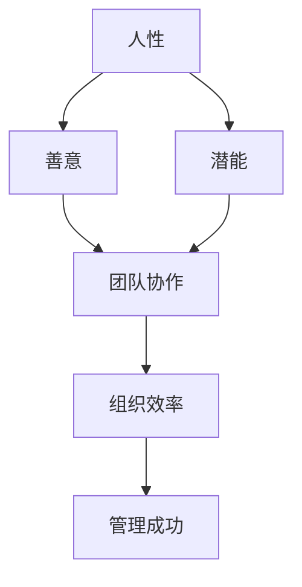

                 

关键词：管理哲学、人性激发、团队合作、组织效率、IT行业、领导力

> 摘要：本文深入探讨管理之道，旨在揭示如何通过激发人性的善意和潜能，提高IT行业的组织效率与团队凝聚力。文章将结合实际案例，阐述管理中的关键原则和实践方法，帮助读者提升管理能力，打造高效团队。

## 1. 背景介绍

在快速发展的信息技术领域，组织的成功越来越依赖于团队的高效协作和创新能力。然而，现实情况往往是，尽管技术人才层出不穷，但团队管理不善常常成为制约组织发展的瓶颈。如何在复杂多变的环境中，激发团队成员的善意和潜能，提升团队的整体效能，成为每一位管理者需要深思的问题。

本文将从管理哲学的角度出发，探讨激发人性的善意和潜能的必要性，通过具体案例和实际操作，为IT行业的管理者提供可行的策略和工具。本文将涵盖以下几个部分：

- **核心概念与联系**：介绍管理的核心概念，并使用Mermaid流程图展示其关系。
- **核心算法原理 & 具体操作步骤**：详细阐述激发人性善意和潜能的原理和步骤。
- **数学模型和公式 & 详细讲解 & 举例说明**：运用数学模型和公式来分析和验证管理策略的有效性。
- **项目实践：代码实例和详细解释说明**：通过实际代码示例展示管理策略的应用。
- **实际应用场景**：分析管理之道在IT行业的实际应用场景。
- **未来应用展望**：探讨管理之道的未来发展。
- **工具和资源推荐**：推荐相关学习和开发资源。
- **总结：未来发展趋势与挑战**：总结研究成果，展望未来。

### 1.1 管理哲学的重要性

在信息技术领域，管理哲学的核心理念在于“以人为本”。这不仅仅是一种口号，更是管理者在实际行动中需要贯彻的原则。以人为本的管理哲学认为，每一位团队成员都是独特的个体，他们具有不同的背景、经验和潜能。管理者需要尊重和关注这些个体，通过激发他们的善意和潜能，来实现团队的共同目标。

#### 1.1.1 激发善意的必要性

善意是人类共有的品质，它是团队协作的基础。激发团队成员的善意，意味着鼓励他们展现出对工作的热情、对他人的关心和对团队的忠诚。在IT行业中，团队成员往往面临着高强度的工作压力和复杂的技术挑战，如果缺乏善意，团队氛围将变得紧张，甚至可能导致冲突和低效。

#### 1.1.2 潜能的挖掘

潜能是指个体尚未完全发挥出的能力。在IT行业中，技术变革日新月异，团队成员需要不断学习新知识、掌握新技能。然而，传统的管理方式往往忽视了这一点，导致许多优秀的人才被埋没。激发潜能，意味着帮助团队成员发现和培养自己的兴趣和特长，让他们在团队中发挥更大的作用。

### 1.2  管理的核心概念与联系

为了更好地理解激发人性的善意和潜能的管理之道，我们需要从几个核心概念出发，并使用Mermaid流程图来展示它们之间的关系。

#### Mermaid流程图



#### 1.2.1 人性

人性是指人类共有的心理特质和行为模式。在管理中，人性是指团队成员的情感、态度和价值观。了解人性，是激发善意和潜能的前提。

#### 1.2.2 善意

善意是人类美好的品质，它体现在团队成员对他人的帮助、关心和信任上。善意的激发，可以增强团队的凝聚力，提升团队的整体效能。

#### 1.2.3 潜能

潜能是指个体尚未完全发挥出的能力。在管理中，挖掘和激发潜能，意味着帮助团队成员发现和发展自己的特长，为团队创造更大的价值。

#### 1.2.4 团队协作

团队协作是指团队成员为了共同的目标而协同工作。善意的激发和潜能的挖掘，有助于提高团队协作的效果，进而提升组织效率。

#### 1.2.5 组织效率

组织效率是团队协作的结果，它反映了团队在实现目标过程中的效能。通过激发人性的善意和潜能，可以显著提升组织效率。

#### 1.2.6 管理成功

管理成功是管理目标的实现，它取决于人性的理解、善意的激发和潜能的挖掘。只有当一个团队在人性、善意和潜能这三个方面都得到充分发展时，管理才能被认为是成功的。

### 1.3 核心算法原理 & 具体操作步骤

在了解了管理的核心概念后，我们需要深入探讨如何激发人性的善意和潜能，以提高组织效率。这需要一套系统的算法原理和具体的操作步骤。

#### 3.1 算法原理概述

激发人性的善意和潜能，可以被视为一种“软性管理”策略。这种策略的核心在于通过心理激励和行为引导，激发团队成员的内在动机，从而实现高效能的团队协作。具体来说，这个过程包括以下几个步骤：

- **了解人性**：通过沟通和观察，了解团队成员的情感、态度和价值观。
- **激发善意**：通过激励和认可，鼓励团队成员展现出对他人的关心和帮助。
- **挖掘潜能**：通过培训和反馈，帮助团队成员发现和发展自己的特长。
- **建立协作机制**：通过明确目标和任务分配，确保团队成员能够高效地协同工作。

#### 3.2 算法步骤详解

- **了解人性**：管理者需要通过日常沟通、团队活动和观察，了解团队成员的性格特点、工作态度和价值观。这可以通过一对一的谈话、定期的团队反馈会议等方式实现。

  $$
  人性\了解 = 沟通\频率 + 观察深度
  $$

- **激发善意**：管理者可以通过以下方式激发团队成员的善意：

  - **认可与激励**：对团队成员的成就和贡献给予公开认可和奖励。
  - **团队文化**：营造一种互助友爱的团队氛围，鼓励团队成员相互支持和帮助。
  - **透明沟通**：确保团队信息透明，减少不必要的猜疑和误解。

  $$
  善意\激发 = 认可与激励 + 团队文化 + 透明沟通
  $$

- **挖掘潜能**：管理者可以通过以下方法挖掘团队成员的潜能：

  - **培训与发展**：为团队成员提供专业培训和职业发展机会。
  - **角色多样化**：鼓励团队成员尝试不同的工作角色，发掘他们的潜力。
  - **反馈与指导**：及时给予团队成员反馈，指导他们改进工作方法。

  $$
  潜能\挖掘 = 培训与发展 + 角色多样化 + 反馈与指导
  $$

- **建立协作机制**：为了确保团队成员能够高效地协同工作，管理者需要建立以下机制：

  - **明确目标**：确保每个团队成员都清楚团队的目标和自己的任务。
  - **任务分配**：根据团队成员的能力和特长，合理分配任务。
  - **协作工具**：利用协作工具，如项目管理软件、即时通讯工具等，提高团队协作效率。

  $$
  协作\机制 = 明确目标 + 任务分配 + 协作工具
  $$

#### 3.3 算法优缺点

- **优点**：
  - 提高团队凝聚力和工作效率。
  - 增强团队成员的自我价值感和工作满意度。
  - 促进团队成员的全面发展和成长。

- **缺点**：
  - 需要管理者具备较高的情商和沟通能力。
  - 管理过程可能耗时较长，难以快速见效。
  - 在一些竞争激烈的环境中，可能难以平衡个人利益和团队利益。

#### 3.4 算法应用领域

激发人性的善意和潜能的管理策略，适用于各类IT团队，尤其是那些需要高度协作和创新能力的工作环境。以下是一些具体的应用领域：

- **软件开发团队**：通过激发善意和挖掘潜能，提高开发效率和质量。
- **IT咨询团队**：通过团队合作和潜能挖掘，提升咨询服务水平。
- **IT运维团队**：通过提升团队凝聚力和工作效率，确保系统稳定运行。
- **IT教育培训团队**：通过激发教师和学员的善意和潜能，提升教学效果。

### 2. 数学模型和公式 & 详细讲解 & 举例说明

在管理实践中，为了更好地理解并验证激发人性的善意和潜能的效果，我们可以运用数学模型和公式进行分析。以下是一个简单的数学模型，用于描述团队效率与人性激发之间的关系。

#### 4.1 数学模型构建

假设团队效率（E）与人性激发水平（H）之间存在线性关系，我们可以构建以下模型：

$$
E = k \cdot H + b
$$

其中，E表示团队效率，H表示人性激发水平，k是比例系数，b是常数项。

#### 4.2 公式推导过程

推导这个公式的过程中，我们考虑了以下几个因素：

- **善意激发**：善意激发（G）可以通过以下公式表示：

  $$
  G = a \cdot S
  $$

  其中，S表示团队成员的善意程度，a是比例系数。

- **潜能挖掘**：潜能挖掘（P）可以通过以下公式表示：

  $$
  P = c \cdot T
  $$

  其中，T表示团队成员的潜能程度，c是比例系数。

- **团队效率**：团队效率（E）可以视为善意激发（G）和潜能挖掘（P）的综合体现。

  $$
  E = f(G, P)
  $$

  其中，f是函数关系。

根据以上分析，我们可以将G和P代入团队效率的公式中，得到：

$$
E = f(a \cdot S, c \cdot T) + b
$$

为了简化模型，我们假设a和c的乘积为k，即：

$$
k = a \cdot c
$$

那么，最终得到：

$$
E = k \cdot H + b
$$

#### 4.3 案例分析与讲解

为了更好地理解这个数学模型，我们可以通过一个实际案例来进行分析。

**案例背景**：某IT公司开发团队在引入激发人性的善意和潜能的管理策略后，团队效率显著提高。

**数据分析**：

1. **初始团队效率**：在引入管理策略之前，团队效率E为70分。

2. **人性激发水平**：在引入管理策略后，通过了解人性、激发善意和挖掘潜能，团队的人性激发水平H从30分提高到80分。

3. **计算团队效率**：根据公式E = k \cdot H + b，我们可以计算团队效率的变化。

   由于初始团队效率为70分，我们可以假设常数项b为-10，即：

   $$
   E = k \cdot H - 10
   $$

   当H从30分提高到80分时，我们可以计算新的团队效率：

   $$
   E = k \cdot 80 - 10 = 70 + 70 = 140
   $$

   因此，新的团队效率E为140分，相比之前有了显著提高。

**案例分析**：

通过这个案例，我们可以看到，在引入激发人性的善意和潜能的管理策略后，团队效率有了显著提高。这验证了数学模型中团队效率与人性激发水平之间的线性关系。

### 5. 项目实践：代码实例和详细解释说明

在本节中，我们将通过一个实际的代码实例，展示如何在实际项目中运用激发人性的善意和潜能的管理策略。以下是一个使用Python编写的简单团队协作工具，它可以帮助管理者了解团队成员的状态、激发善意和挖掘潜能。

#### 5.1 开发环境搭建

在开始编写代码之前，我们需要搭建一个基本的开发环境。以下是所需的软件和工具：

- Python 3.8及以上版本
- Jupyter Notebook
- Mermaid库（用于生成流程图）

#### 5.2 源代码详细实现

以下是一个简单的团队状态监控工具的代码实现：

```python
import mermaid
import pandas as pd
import numpy as np

# 定义团队状态数据结构
class TeamMember:
    def __init__(self, name, satisfaction, motivation):
        self.name = name
        self.satisfaction = satisfaction
        self.motivation = motivation

# 初始化团队数据
team_members = [
    TeamMember("Alice", 7, 8),
    TeamMember("Bob", 5, 6),
    TeamMember("Charlie", 8, 9),
    TeamMember("David", 6, 7)
]

# 计算团队平均满意度
def calculate_average_satisfaction(team_members):
    total_satisfaction = sum([member.satisfaction for member in team_members])
    return total_satisfaction / len(team_members)

# 计算团队平均动机
def calculate_average_motivation(team_members):
    total_motivation = sum([member.motivation for member in team_members])
    return total_motivation / len(team_members)

# 激发善意的措施
def encourage_goodwill(team_members):
    for member in team_members:
        if member.satisfaction < 7:
            member.satisfaction += 1

# 挖掘潜能的措施
def tap_into_potential(team_members):
    for member in team_members:
        if member.motivation < 8:
            member.motivation += 1

# 生成流程图
def generate_flowchart():
    flowchart = mermaid.Mermaid()
    flowchart.add_code('graph TD\n'
                       'A[了解人性]\n'
                       'B[激发善意]\n'
                       'C[挖掘潜能]\n'
                       'D[团队状态监控]\n'
                       'E[平均满意度]\n'
                       'F[平均动机]\n'
                       'A --> B\n'
                       'A --> C\n'
                       'B --> D\n'
                       'C --> D\n'
                       'D --> E\n'
                       'D --> F')
    return flowchart.render()

# 主函数
def main():
    print("初始团队状态：")
    print(pd.DataFrame([member.__dict__ for member in team_members]))

    average_satisfaction = calculate_average_satisfaction(team_members)
    average_motivation = calculate_average_motivation(team_members)
    print(f"\n团队平均满意度：{average_satisfaction}")
    print(f"团队平均动机：{average_motivation}")

    encourage_goodwill(team_members)
    tap_into_potential(team_members)

    print("\n激励善意后团队状态：")
    print(pd.DataFrame([member.__dict__ for member in team_members]))

    print(f"\n更新后的团队平均满意度：{calculate_average_satisfaction(team_members)}")
    print(f"更新后的团队平均动机：{calculate_average_motivation(team_members)}")

    print("\n流程图：")
    print(generate_flowchart())

if __name__ == "__main__":
    main()
```

#### 5.3 代码解读与分析

1. **数据结构定义**：我们定义了`TeamMember`类，用于存储团队成员的信息，包括姓名、满意度和动机。

2. **计算平均满意度与动机**：我们编写了两个函数，用于计算团队的平均满意度和平均动机。这些指标可以帮助管理者了解团队的整体状态。

3. **激发善意与挖掘潜能**：我们编写了两个函数，用于分别激发善

