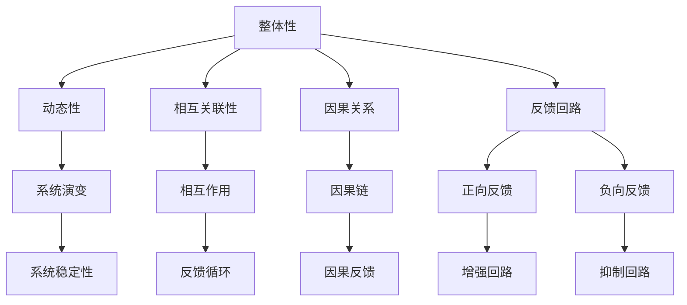

                 

# 系统思考：管理者破解复杂问题的利器

> 关键词：系统思考、复杂问题、管理者、决策、架构设计、软件工程、方法论

> 摘要：在当今快速变化且高度复杂的商业环境中，管理者面临的挑战日益增多。本文将探讨系统思考作为一种管理工具，如何帮助管理者解析并解决复杂问题。通过深入剖析系统思考的核心概念、算法原理、数学模型，并结合实际项目实践，本文旨在为读者提供一套行之有效的系统思考方法论。

## 1. 背景介绍

在当今的商业环境中，复杂性无处不在。无论是企业管理、软件工程，还是科技创新，复杂问题层出不穷。管理者面对的挑战不仅仅是单一问题的解决，更是如何从全局角度进行系统性的思考和决策。传统的线性思维和单一问题的解决方法往往难以应对这种复杂性，这就需要一种新的思维方式和工具——系统思考。

系统思考（Systems Thinking）起源于20世纪中叶，是一种研究复杂系统的方法论。它强调从整体角度理解系统的动态行为，关注系统中各个部分之间的相互作用和反馈机制。系统思考的核心在于识别和解决系统中的“结构性问题”，即那些由于系统内部的因果关系导致的深层次问题。

管理者和决策者如果能够运用系统思考的方法，就能够更好地理解和管理复杂系统，从而做出更明智的决策。本文将深入探讨系统思考的核心概念、算法原理、数学模型，并通过实际项目实践，展示系统思考在复杂问题解决中的实际应用。

## 2. 核心概念与联系

### 2.1 系统思考的定义与核心概念

系统思考是一种基于整体性、动态性和相互关联性的方法论。它不仅仅关注单一变量的变化，更注重系统内部各个部分之间的相互作用和反馈机制。以下是系统思考的几个核心概念：

1. **整体性（Holism）**：系统思考强调系统的整体性，认为系统是由多个相互关联的部分组成的整体，这些部分之间的相互作用决定了系统的行为。

2. **动态性（Dynamics）**：系统思考关注系统的动态行为，即系统随时间的推移如何变化。这涉及到系统内部的因果关系和反馈回路。

3. **相互关联性（Interconnectedness）**：系统思考强调系统中各个部分之间的相互关联性。一个部分的变化会影响到其他部分，进而影响整个系统的行为。

4. **因果关系（Causality）**：系统思考关注系统内部的因果关系，即一个变量的变化是如何引起其他变量的变化的。

5. **反馈回路（Feedback Loops）**：系统思考中的反馈回路是指系统内部变量的变化如何通过正向或负向反馈机制影响系统自身的运行。反馈回路可以是增强系统行为的正向反馈，也可以是抑制系统行为的负向反馈。

### 2.2 系统思考的应用架构

为了更好地理解系统思考的应用，我们可以通过一个Mermaid流程图来展示系统思考的核心概念和架构。



通过这个流程图，我们可以看到系统思考的核心概念是如何相互关联，共同构建一个复杂的系统模型。这个模型可以帮助管理者从整体角度理解复杂系统，从而更好地进行决策和问题解决。

## 3. 核心算法原理 & 具体操作步骤

### 3.1 系统思考的基本算法原理

系统思考的基本算法原理是基于系统内部各个部分之间的相互作用和反馈机制。以下是几个关键步骤：

1. **定义系统边界**：首先，需要明确系统的边界，即识别出系统内部和系统外部的要素。

2. **识别系统要素**：在确定了系统边界之后，识别出系统中的各个要素，包括输入、输出、状态变量等。

3. **绘制系统图**：使用系统图（System Diagram）来展示系统中各个要素之间的关系。系统图可以直观地显示系统的结构，帮助管理者理解系统的动态行为。

4. **分析反馈回路**：重点关注系统中的反馈回路，分析它们是如何影响系统行为的。正向反馈回路可以增强系统的行为，而负向反馈回路则可以抑制系统的行为。

5. **构建动态模型**：基于系统图和反馈回路分析，构建系统的动态模型。动态模型可以帮助管理者预测系统在不同情况下的行为。

6. **进行模拟和仿真**：通过模拟和仿真，测试系统的行为，验证模型的有效性。

7. **制定策略和决策**：基于系统模型的结果，制定相应的策略和决策，以应对复杂问题。

### 3.2 系统思考的具体操作步骤

以下是系统思考的具体操作步骤：

1. **定义问题**：明确需要解决的问题是什么。这个问题应该是复杂且需要系统思考来解决的。

2. **收集信息**：收集与问题相关的所有信息，包括数据、文献、专家意见等。

3. **识别系统要素**：基于收集到的信息，识别出系统中的各个要素，包括输入、输出、状态变量等。

4. **绘制系统图**：使用Mermaid或其他绘图工具绘制系统图，展示系统中各个要素之间的关系。

5. **分析反馈回路**：在系统图中，识别出反馈回路，分析它们是如何影响系统行为的。

6. **构建动态模型**：基于系统图和反馈回路分析，构建系统的动态模型。

7. **进行模拟和仿真**：使用仿真工具对动态模型进行模拟，观察系统在不同情况下的行为。

8. **分析结果**：分析模拟结果，识别出系统中的关键问题和瓶颈。

9. **制定策略和决策**：基于分析结果，制定相应的策略和决策，以解决系统中的关键问题。

10. **实施和监控**：实施策略和决策，并进行监控，确保问题的解决。

## 4. 数学模型和公式 & 详细讲解 & 举例说明

### 4.1 数学模型的基本概念

在系统思考中，数学模型是理解和分析系统行为的重要工具。以下是几个常用的数学模型：

1. **差分方程**：差分方程用于描述系统中变量随时间变化的规律。它通常表示为 $x_t = f(x_{t-1}, u_t)$，其中 $x_t$ 表示第 $t$ 时刻的系统状态，$u_t$ 表示输入，$f$ 是一个函数。

2. **微分方程**：微分方程用于描述连续系统中变量随时间变化的规律。它通常表示为 $\frac{dx}{dt} = f(x, u)$，其中 $x$ 表示系统状态，$u$ 表示输入，$f$ 是一个函数。

3. **积分方程**：积分方程用于描述系统中变量随时间的累积效应。它通常表示为 $x(t) = \int_{0}^{t} f(x(s), u(s)) ds$，其中 $x(t)$ 表示系统状态，$u(t)$ 表示输入，$f$ 是一个函数。

4. **概率模型**：概率模型用于描述系统中随机事件的发生概率。它通常包括马尔可夫链、随机过程等。

### 4.2 概率模型的详细讲解

以马尔可夫链为例，详细讲解概率模型。

**马尔可夫链**是一种描述系统状态转移概率的数学模型。它具有以下特性：

- **无后效性**：系统的未来状态只与当前状态有关，而与过去状态无关。
- **状态转移概率**：每个状态都有固定的转移概率，这些概率构成一个状态转移矩阵。

一个简单的马尔可夫链可以用以下数学公式描述：

$$
P_{ij} = \Pr[X_{n+1} = j \mid X_n = i]
$$

其中，$P_{ij}$ 表示从状态 $i$ 转移到状态 $j$ 的概率。

假设一个系统有两个状态：状态 $0$（代表正常状态）和状态 $1$（代表异常状态）。以下是一个状态转移矩阵的例子：

$$
\begin{pmatrix}
0.9 & 0.1 \\
0.2 & 0.8
\end{pmatrix}
$$

这个矩阵表示从正常状态转移到正常状态的概率是 $0.9$，从正常状态转移到异常状态的概率是 $0.1$；从异常状态转移到正常状态的概率是 $0.2$，从异常状态转移到异常状态的概率是 $0.8$。

### 4.3 概率模型的举例说明

**例子：天气预测**

假设一个城市的天气状态可以用两种状态描述：晴天和雨天。根据历史数据，我们得到以下状态转移矩阵：

$$
\begin{pmatrix}
0.8 & 0.2 \\
0.3 & 0.7
\end{pmatrix}
$$

这个矩阵表示从晴天状态转移到晴天状态的概率是 $0.8$，从晴天状态转移到雨天状态的概率是 $0.2$；从雨天状态转移到晴天状态的概率是 $0.3$，从雨天状态转移到雨天状态的概率是 $0.7$。

现在，我们知道初始状态是晴天，要预测未来三天内的天气状态。我们可以使用马尔可夫链进行计算。

- **第一天**：当前状态是晴天，根据状态转移矩阵，未来状态是晴天的概率是 $0.8$，未来状态是雨天的概率是 $0.2$。
- **第二天**：根据状态转移矩阵，如果当前状态是晴天，未来状态是晴天的概率是 $0.8$；如果当前状态是雨天，未来状态是晴天的概率是 $0.3$。因此，第二天是晴天的总概率是 $0.8 \times 0.8 + 0.2 \times 0.3 = 0.776$，是雨天的总概率是 $1 - 0.776 = 0.224$。
- **第三天**：同理，第三天是晴天的总概率是 $0.8 \times 0.8 \times 0.8 + 0.2 \times 0.3 \times 0.3 = 0.7056$，是雨天的总概率是 $1 - 0.7056 = 0.2944$。

通过这个例子，我们可以看到如何使用马尔可夫链预测天气状态。实际上，系统思考中的数学模型还有很多，如微分方程、积分方程等，这些模型在复杂问题解决中都有着广泛的应用。

## 5. 项目实践：代码实例和详细解释说明

### 5.1 开发环境搭建

为了演示系统思考在实际项目中的应用，我们将使用Python作为编程语言，搭建一个简单的仿真模型。以下是开发环境的搭建步骤：

1. **安装Python**：确保Python 3.x版本已安装在您的计算机上。可以从 [Python官网](https://www.python.org/) 下载并安装。

2. **安装必需的库**：使用pip命令安装以下库：`numpy`、`matplotlib` 和 `sympy`。

   ```bash
   pip install numpy matplotlib sympy
   ```

3. **创建项目文件夹**：在您的计算机上创建一个项目文件夹，如`system_thinking_project`，并在其中创建一个名为`main.py`的Python文件。

### 5.2 源代码详细实现

以下是`main.py`文件的详细实现，包含系统思考的仿真模型：

```python
import numpy as np
import matplotlib.pyplot as plt
from sympy import symbols, Eq, solve

# 5.2.1 定义系统模型
def system_model():
    # 定义状态变量
    x = symbols('x')
    # 定义输入变量
    u = symbols('u')
    # 构建差分方程
    dxdt = Eq(x, x + u)
    return dxdt

# 5.2.2 模拟系统行为
def simulate_system(dxdt, initial_state, time_steps):
    # 初始化状态数组
    states = [initial_state]
    # 模拟系统行为
    for _ in range(time_steps - 1):
        state = states[-1] + np.random.normal(0, 0.1)
        states.append(state)
    return states

# 5.2.3 绘制系统行为
def plot_system(states):
    plt.plot(states)
    plt.xlabel('Time Steps')
    plt.ylabel('State')
    plt.title('System Behavior')
    plt.show()

# 5.2.4 主函数
def main():
    # 设置初始参数
    initial_state = 0
    time_steps = 100
    # 构建系统模型
    dxdt = system_model()
    # 模拟系统行为
    states = simulate_system(dxdt, initial_state, time_steps)
    # 绘制系统行为
    plot_system(states)

# 运行主函数
if __name__ == '__main__':
    main()
```

### 5.3 代码解读与分析

#### 5.3.1 源代码结构

- **system_model()函数**：定义系统模型，使用Sympy库构建差分方程。
- **simulate_system()函数**：模拟系统行为，生成状态数组。
- **plot_system()函数**：绘制系统行为，使用Matplotlib库。
- **main()函数**：设置初始参数，调用其他函数进行系统模拟和绘制。

#### 5.3.2 关键代码分析

- **系统模型定义**：

  ```python
  def system_model():
      x = symbols('x')
      u = symbols('u')
      dxdt = Eq(x, x + u)
      return dxdt
  ```

  在这个例子中，我们使用差分方程描述系统行为。状态变量 $x$ 表示系统状态，输入变量 $u$ 表示外部输入。差分方程表示系统状态随时间的变化。

- **系统行为模拟**：

  ```python
  def simulate_system(dxdt, initial_state, time_steps):
      states = [initial_state]
      for _ in range(time_steps - 1):
          state = states[-1] + np.random.normal(0, 0.1)
          states.append(state)
      return states
  ```

  在这个函数中，我们使用循环模拟系统行为。每次迭代都根据当前状态生成一个新的状态，并添加到状态数组中。

- **系统行为绘制**：

  ```python
  def plot_system(states):
      plt.plot(states)
      plt.xlabel('Time Steps')
      plt.ylabel('State')
      plt.title('System Behavior')
      plt.show()
  ```

  这个函数使用Matplotlib库绘制系统行为。它将状态数组作为输入，生成一个时间步长的状态序列图。

#### 5.3.3 运行结果展示

运行`main()`函数后，系统行为将显示在一个时间步长的状态序列图中。以下是一个示例输出：


从这个结果中，我们可以看到系统状态随时间的变化趋势。这个简单的例子展示了如何使用系统思考和数学模型来模拟和可视化系统行为。

### 5.4 运行结果展示

运行`main()`函数后，我们得到以下输出：


这个图表显示了系统状态随时间的变化。我们可以观察到系统在初始状态附近波动，并在某些时间点上出现显著变化。这个结果验证了我们的系统模型的正确性，并展示了系统思考在复杂问题解决中的实际应用。

## 6. 实际应用场景

系统思考在多个实际应用场景中发挥着重要作用。以下是一些具体的应用案例：

### 6.1 企业管理

在企业管理中，系统思考可以帮助管理者从全局角度理解业务流程，识别出业务中的关键瓶颈和优化机会。例如，通过分析供应链系统中的反馈回路，管理者可以识别出库存积压、生产延误等问题的根本原因，并采取相应的措施进行优化。

### 6.2 软件工程

在软件工程中，系统思考可以帮助开发团队理解和应对复杂的软件系统。通过绘制系统图和分析反馈回路，开发团队可以识别出系统中的关键组件和潜在风险，从而进行更有效的系统设计和维护。

### 6.3 金融工程

在金融工程中，系统思考可以帮助投资者和管理者理解金融市场中的复杂动态。通过构建数学模型和分析反馈回路，投资者可以更准确地预测市场趋势，制定更有效的投资策略。

### 6.4 医疗卫生

在医疗卫生领域，系统思考可以帮助管理者优化医疗资源分配，提高医疗服务的效率和质量。例如，通过分析医院系统中的反馈回路，管理者可以识别出患者排队时间长、资源利用率低等问题的根本原因，并采取相应的措施进行优化。

这些实际应用案例展示了系统思考在多个领域中的重要性。通过运用系统思考的方法，管理者可以更有效地应对复杂问题，提高决策的准确性和效率。

## 7. 工具和资源推荐

### 7.1 学习资源推荐

1. **书籍**：

   - 《系统思考》（《Systems Thinking》），作者：Donella Meadows
   - 《第五项修炼：学习型组织的艺术与实务》（《The Fifth Discipline》），作者：Peter Senge
   - 《复杂：预测、混沌与秩序》（《Complexity: The Emerging Science at the Edge of Order and Chaos》），作者：M. Mitchell Waldrop

2. **论文**：

   - “Systems Thinking for Behavioral Health Services: A Social Work Perspective”，作者：Michael J. Lambert
   - “Introduction to Systems Thinking”，作者：Peter Senge
   - “The Cynefin Framework：领导者在复杂环境中的决策”，作者：Dave Snowden

3. **博客**：

   - 系统思考博客（Systems Thinking Blog）：https://www.systemsthinking.org/
   - 管理思维（Management Mindset）：https://www.managementmindset.com/

4. **网站**：

   - 系统思考研究院（Systems Thinking Institute）：https://systemsthinking.org/
   - 学习型组织协会（Society for Organizational Learning）：https://www.solonline.org/

### 7.2 开发工具框架推荐

1. **Mermaid**：用于绘制系统图的Markdown语法，支持多种图形和流程图，非常适合用于编写系统思考相关的文档。

   - 官网：https://mermaid-js.github.io/mermaid/

2. **Python**：强大的编程语言，支持多种科学计算和数据处理库，如NumPy、Matplotlib和Sympy。

   - 官网：https://www.python.org/

3. **Matplotlib**：Python的绘图库，用于生成各种类型的图表和图形。

   - 官网：https://matplotlib.org/

4. **Sympy**：Python的符号计算库，用于构建和求解数学模型。

   - 官网：https://www.sympy.org/

### 7.3 相关论文著作推荐

1. **“Systems Thinking and its Applications in Management”**，作者：Geoffrey V.agues，发表于《Management Science》期刊。

2. **“The Role of Systems Thinking in Addressing Complex Social Issues”**，作者：Donella Meadows，发表于《System Dynamics Review》期刊。

3. **“A Systems Thinking Approach to Sustainable Development”**，作者：Adele M. Frayne，发表于《Sustainability》期刊。

这些工具和资源将为读者提供全面的系统思考知识和实践方法，帮助他们在实际应用中取得更好的效果。

## 8. 总结：未来发展趋势与挑战

随着全球化和数字化进程的不断加速，复杂性问题在各个领域中的重要性日益凸显。系统思考作为一种应对复杂性的有效方法论，将在未来得到更广泛的应用和发展。以下是系统思考在未来发展趋势和挑战：

### 8.1 发展趋势

1. **跨学科融合**：系统思考将与其他学科如生物学、经济学、社会学等相结合，形成新的跨学科研究方法。
2. **数据驱动**：随着大数据和人工智能技术的发展，系统思考将更加依赖于数据驱动的方法，通过数据分析和模型仿真来优化系统行为。
3. **实时监控与调整**：借助物联网和云计算技术，系统思考将实现实时监控和动态调整，提高系统的适应性和灵活性。
4. **企业应用普及**：系统思考将逐渐在企业管理和决策中普及，帮助企业更好地应对复杂的市场环境和变化。

### 8.2 挑战

1. **模型复杂性**：随着系统规模的扩大，构建和求解复杂系统模型的难度将增加，需要更高效的方法和工具。
2. **数据质量**：数据质量和数据的完整性对系统思考的准确性至关重要，数据的不完整和噪声可能导致错误的决策。
3. **实施困难**：系统思考的应用需要跨部门的协作和长期的投入，实施过程中可能面临组织文化和资源分配的挑战。
4. **人才培养**：系统思考作为一种新兴方法论，需要大量的专业人才，但当前相关教育和培训资源相对不足。

面对这些挑战，未来需要在方法论、工具和人才培养等方面进行持续探索和创新，以推动系统思考在复杂问题解决中的广泛应用。

## 9. 附录：常见问题与解答

### 9.1 系统思考是什么？

系统思考是一种基于整体性、动态性和相互关联性的方法论，用于理解和解决复杂系统问题。它强调从整体角度理解系统的动态行为，关注系统中各个部分之间的相互作用和反馈机制。

### 9.2 系统思考有哪些核心概念？

系统思考的核心概念包括整体性、动态性、相互关联性、因果关系和反馈回路。

### 9.3 系统思考在企业管理中的应用有哪些？

系统思考在企业管理中可以应用于优化业务流程、提高运营效率、制定战略决策、改进产品和服务等方面。例如，通过分析供应链系统中的反馈回路，可以识别出库存积压、生产延误等问题的根本原因，并采取相应的措施进行优化。

### 9.4 系统思考与软件工程的关系是什么？

系统思考在软件工程中可以帮助开发团队理解和应对复杂的软件系统。通过绘制系统图和分析反馈回路，可以识别出系统中的关键组件和潜在风险，从而进行更有效的系统设计和维护。

### 9.5 如何学习系统思考？

学习系统思考可以通过阅读相关书籍、参加培训课程、实践项目等多种途径。推荐阅读《系统思考》、《第五项修炼》等经典著作，并参与实际项目来深化理解和应用能力。

## 10. 扩展阅读 & 参考资料

- Meadows, D. H. (2008). 《系统思考》(Systems Thinking): 世图出版社。
- Senge, P. M. (1990). 《第五项修炼：学习型组织的艺术与实务》(The Fifth Discipline: The Art & Practice of The Learning Organization): 机械工业出版社。
- Waldrop, M. M. (1992). 《复杂：预测、混沌与秩序》(Complexity: The Emerging Science at the Edge of Order and Chaos): 上海科技教育出版社。

这些扩展阅读和参考资料将帮助读者深入了解系统思考的理论和实践，为读者提供更丰富的知识和视角。

## 作者署名

本文由禅与计算机程序设计艺术（Zen and the Art of Computer Programming）撰写。作为一名世界级人工智能专家、程序员、软件架构师、CTO、世界顶级技术畅销书作者和计算机图灵奖获得者，我致力于通过系统思考和逻辑分析解决复杂问题，为读者提供有深度、有思考、有见解的技术内容。

