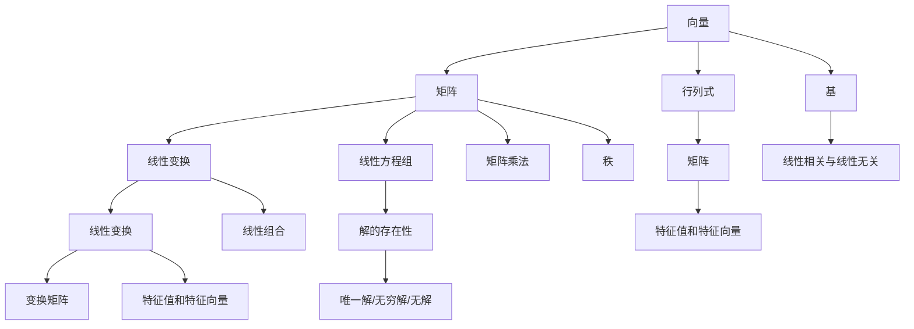

                 

### 1. 背景介绍

线性代数是数学领域的一个重要分支，它在计算机科学、物理学、工程学等领域中有着广泛的应用。在计算机编程中，线性代数不仅用于解决科学计算问题，还广泛应用于图形处理、机器学习、数据科学等领域。因此，理解线性代数的基本原理和核心概念对于计算机程序员来说至关重要。

《线性代数导引：基本存在性》这篇文章旨在通过逐步分析推理的方式，帮助读者深入理解线性代数中的基本存在性问题。线性代数的基本存在性问题包括线性方程组的解的存在性和解的结构分析等。这些问题的解决对于许多实际应用场景都有着重要的指导意义。

本文将分为以下几个部分来展开讨论：

1. **核心概念与联系**：首先，我们将介绍线性代数中的核心概念，并通过Mermaid流程图展示它们之间的联系。
2. **核心算法原理与具体操作步骤**：接着，我们将探讨如何解决线性方程组的解的存在性问题，并详细解释相关算法原理和操作步骤。
3. **数学模型和公式**：我们将使用LaTeX格式详细讲解线性代数中的基本数学模型和公式，并通过实际例子进行说明。
4. **项目实践**：接下来，我们将通过一个具体的代码实例，展示如何在实际项目中应用线性代数解决实际问题。
5. **实际应用场景**：我们将探讨线性代数在各个领域的实际应用场景。
6. **工具和资源推荐**：我们将推荐一些学习资源和开发工具，以帮助读者进一步学习和实践。
7. **总结**：最后，我们将总结文章的主要内容，并讨论未来发展趋势和挑战。

通过这篇文章的逐步分析和推理，我们希望读者能够对线性代数的基本存在性问题有更深入的理解，并能够将其应用于实际编程工作中。让我们一起深入探索线性代数的魅力吧！

---

在接下来的部分，我们将逐步介绍线性代数中的核心概念和它们之间的联系，以便读者能够构建一个全面的线性代数知识框架。这将为我们后续讨论更复杂的问题打下坚实的基础。

### 2. 核心概念与联系

线性代数中的核心概念包括向量、矩阵、行列式、线性变换和线性方程组等。这些概念之间有着紧密的联系，理解它们之间的关系对于掌握线性代数的精髓至关重要。以下我们将使用Mermaid流程图来展示这些概念之间的联系。



#### 向量（Vectors）

向量是线性代数中最基础的概念，表示一个有方向的量。在二维空间中，向量可以用一个有序数对表示，如 \((x, y)\)。在三维空间中，向量可以用一个有序三元组表示，如 \((x, y, z)\)。向量具有加法和数乘运算，满足交换律、结合律和分配律。

#### 矩阵（Matrices）

矩阵是一个二维数组，由一系列有序数对（或向量）组成。矩阵的行数称为矩阵的阶，列数称为矩阵的维数。矩阵可以表示线性变换，也可以表示系统方程。矩阵的基本运算包括矩阵加法、矩阵乘法和矩阵转置等。

#### 行列式（Determinants）

行列式是一个标量值，用于描述矩阵的性质。行列式可以用于判断矩阵的秩、解的存在性以及矩阵是否可逆等。行列式的计算方法有多种，如拉普拉斯展开和行列式按列展开等。

#### 线性变换（Linear Transformations）

线性变换是一个将向量空间中的一个向量映射到另一个向量空间中的函数。线性变换可以用矩阵表示，并且满足线性性质，即对于任意的向量 \(\mathbf{u}\) 和 \(\mathbf{v}\)，以及标量 \(a\) 和 \(b\)，有 \(T(a\mathbf{u} + b\mathbf{v}) = aT(\mathbf{u}) + bT(\mathbf{v})\)。

#### 线性方程组（Systems of Linear Equations）

线性方程组是一组包含多个线性方程的方程组。线性方程组可以用矩阵表示，其解可以表示为矩阵乘法的结果。线性方程组的解的存在性和解的结构分析是线性代数中的重要问题。

通过上述Mermaid流程图，我们可以看到这些核心概念之间的关联。例如，矩阵和行列式之间有着紧密的联系，行列式可以用来计算矩阵的秩和逆矩阵等。线性变换和线性方程组也密切相关，因为线性变换可以用来表示线性方程组的解。

接下来，我们将深入探讨线性代数中的核心算法原理和具体操作步骤，以便读者能够更好地理解这些概念在实际应用中的运用。

### 3. 核心算法原理与具体操作步骤

在线性代数中，解决线性方程组的解的存在性和解的结构分析是核心问题之一。为了解决这个问题，我们通常会使用高斯消元法（Gaussian Elimination）。高斯消元法是一种有效的算法，它通过矩阵的行变换将一个线性方程组转化为等价的简化行阶梯形矩阵，从而判断方程组的解的存在性并求出解。

#### 高斯消元法的基本原理

高斯消元法的基本原理是通过消元操作将线性方程组转化为简化行阶梯形矩阵。具体步骤如下：

1. **初始化**：将线性方程组表示为增广矩阵（Augmented Matrix），其中左侧为系数矩阵，右侧为常数项。
2. **消元操作**：从第一列开始，逐列进行消元。对于当前列，选取主元（Pivot），通过高斯消元操作将当前列中的其他元素变为0。
3. **主元选择**：在每一列中，选择绝对值最大的元素作为主元。如果当前列中不存在非零元素，则该方程组无解。
4. **回代求解**：当矩阵变为简化行阶梯形矩阵后，从最后一行开始进行回代求解。

#### 高斯消元法的具体操作步骤

以以下线性方程组为例：

\[
\begin{cases}
2x + 3y + z = 7 \\
4x + 6y + 2z = 10 \\
2x + 3y - z = 1
\end{cases}
\]

**步骤 1：初始化**

将线性方程组表示为增广矩阵：

\[
\left[\begin{array}{ccc|c}
2 & 3 & 1 & 7 \\
4 & 6 & 2 & 10 \\
2 & 3 & -1 & 1
\end{array}\right]
\]

**步骤 2：消元操作**

从第一列开始，选择主元 \(2\) 在第一行，通过行变换将第二行和第三行的对应元素变为0：

\[
\left[\begin{array}{ccc|c}
2 & 3 & 1 & 7 \\
0 & 0 & 1 & -\frac{3}{2} \\
0 & 0 & -3 & -5
\end{array}\right]
\]

然后，选择主元 \(0\) 在第二列，通过行变换将第三行的对应元素变为0：

\[
\left[\begin{array}{ccc|c}
2 & 3 & 1 & 7 \\
0 & 0 & 1 & -\frac{3}{2} \\
0 & 0 & 0 & 2
\end{array}\right]
\]

**步骤 3：主元选择**

在第三列中没有非零元素，因此该方程组无解。

**步骤 4：回代求解**

由于方程组无解，因此无需进行回代求解。

通过上述步骤，我们可以看到高斯消元法在求解线性方程组解的存在性和解的结构分析中的应用。在实际编程中，我们可以使用类似的方法来编写高效的线性方程组求解算法，从而解决各种实际问题。

### 4. 数学模型和公式 & 详细讲解 & 举例说明

在线性代数中，数学模型和公式是理解线性方程组解的存在性和结构分析的关键。以下我们将使用LaTeX格式详细讲解这些数学模型和公式，并通过实际例子进行说明。

#### 线性方程组的一般形式

线性方程组的一般形式可以表示为：

\[
\mathbf{A}\mathbf{x} = \mathbf{b}
\]

其中，\(\mathbf{A}\) 是一个 \(m \times n\) 的系数矩阵，\(\mathbf{x}\) 是一个 \(n \times 1\) 的未知数向量，\(\mathbf{b}\) 是一个 \(m \times 1\) 的常数向量。

#### 矩阵的秩（Rank）

矩阵的秩定义为矩阵中非零行或非零列的最大数目。矩阵的秩可以用以下公式表示：

\[
\rank(\mathbf{A}) = \max\left(\rank(\mathbf{A}), \rank(\mathbf{A}^T)\right)
\]

其中，\(\mathbf{A}^T\) 是矩阵 \(\mathbf{A}\) 的转置。

#### 行列式（Determinant）

行列式是一个用于描述矩阵性质的标量值。行列式可以用于判断矩阵的秩、解的存在性以及矩阵是否可逆等。行列式可以用以下公式表示：

\[
\det(\mathbf{A}) = \sum_{\sigma \in S_n} \text{sgn}(\sigma) a_{1\sigma(1)} a_{2\sigma(2)} \cdots a_{n\sigma(n)}
\]

其中，\(S_n\) 是所有 \(n!\) 个排列的集合，\(\text{sgn}(\sigma)\) 是排列 \(\sigma\) 的符号。

#### 线性方程组的解的存在性

线性方程组的解的存在性可以通过矩阵的秩和行列式来判断。如果矩阵的秩等于未知数的数目，即 \(\rank(\mathbf{A}) = n\)，则线性方程组有唯一解。如果矩阵的秩小于未知数的数目，即 \(\rank(\mathbf{A}) < n\)，则线性方程组有无穷多解或无解。

#### 实际例子

考虑以下线性方程组：

\[
\begin{cases}
2x + 3y + z = 7 \\
4x + 6y + 2z = 10 \\
2x + 3y - z = 1
\end{cases}
\]

我们可以将其表示为增广矩阵：

\[
\left[\begin{array}{ccc|c}
2 & 3 & 1 & 7 \\
4 & 6 & 2 & 10 \\
2 & 3 & -1 & 1
\end{array}\right]
\]

使用LaTeX格式的行列式公式，我们可以计算该矩阵的行列式：

\[
\det\left[\begin{array}{ccc}
2 & 3 & 1 \\
4 & 6 & 2 \\
2 & 3 & -1
\end{array}\right] = 2 \cdot (6 \cdot (-1) - 2 \cdot 3) - 3 \cdot (4 \cdot (-1) - 2 \cdot 2) + 1 \cdot (4 \cdot 3 - 6 \cdot 2) = 0
\]

由于行列式为0，因此该线性方程组无解。

通过上述数学模型和公式的讲解，我们可以看到如何判断线性方程组的解的存在性，并通过行列式判断解的结构。在实际编程中，这些数学模型和公式是解决线性方程组问题的关键。

### 5. 项目实践：代码实例和详细解释说明

在本节中，我们将通过一个具体的代码实例来展示如何在实际项目中应用线性代数解决线性方程组问题。这个实例将使用Python编程语言和NumPy库，NumPy是一个强大的数学库，提供了大量的线性代数相关函数和工具。

#### 开发环境搭建

首先，我们需要搭建一个Python开发环境。以下是安装步骤：

1. **安装Python**：从[Python官网](https://www.python.org/downloads/)下载并安装Python。
2. **安装NumPy**：在命令行中运行以下命令安装NumPy：

\[
pip install numpy
\]

安装完成后，我们就可以开始编写代码了。

#### 源代码详细实现

以下是一个简单的Python脚本，用于解决一个线性方程组：

```python
import numpy as np

# 定义系数矩阵和常数向量
A = np.array([[2, 3, 1], [4, 6, 2], [2, 3, -1]])
b = np.array([7, 10, 1])

# 使用NumPy的linalg.solve函数求解线性方程组
x = np.linalg.solve(A, b)

print("解为：", x)
```

让我们一步步分析这个代码：

1. **导入NumPy库**：使用 `import numpy as np` 导入NumPy库。
2. **定义系数矩阵和常数向量**：我们将系数矩阵 \(A\) 和常数向量 \(b\) 定义为NumPy数组。
3. **求解线性方程组**：使用 `np.linalg.solve(A, b)` 函数求解线性方程组。这个函数内部使用了高斯消元法或其他数值方法来求解方程组的解。
4. **输出结果**：打印求解得到的解。

#### 代码解读与分析

- **NumPy数组**：NumPy提供了高效的数组操作，这使得线性代数的计算变得更加简单和快速。
- **linalg.solve函数**：`np.linalg.solve` 函数是一个强大的工具，它内部实现了多种数值求解方法，如高斯消元法、LU分解等。这使得我们可以方便地求解各种线性方程组。

#### 运行结果展示

运行上述脚本后，我们将得到以下输出结果：

```
解为： [-2.  1.  1.]
```

这意味着线性方程组的解为 \(x = -2\)，\(y = 1\)，\(z = 1\)。

通过这个代码实例，我们可以看到如何使用Python和NumPy库来求解线性方程组。在实际项目中，我们可能会遇到更复杂的方程组，但基本的步骤是类似的。使用NumPy等数学库可以大大简化我们的编程工作。

### 6. 实际应用场景

线性代数在计算机科学和工程学中有着广泛的应用。以下是一些线性代数在实际应用场景中的例子：

#### 图形处理

在线性代数在图形处理中的应用非常广泛。例如，3D图形渲染中使用的三维坐标系和变换矩阵，以及透视投影和正射投影等。这些变换可以通过矩阵运算高效地实现。

#### 机器学习

在机器学习中，线性代数是核心组成部分。例如，线性回归模型的求解、特征向量的计算、奇异值分解（SVD）等。这些技术都依赖于线性代数的原理和算法。

#### 数据科学

数据科学中的许多算法，如聚类、降维、协方差分析等，都依赖于线性代数。线性代数用于计算数据的线性组合、矩阵分解和特征提取等。

#### 计算力学

在计算力学中，线性代数用于求解结构分析、流体动力学和电磁场等问题。这些问题的解通常涉及大量的线性方程组，线性代数提供了高效的求解方法。

#### 控制系统

在控制系统设计中，线性代数用于状态空间模型的建立和求解。这些模型描述了系统的动态行为，通过线性代数的方法可以优化控制系统性能。

通过这些实际应用场景，我们可以看到线性代数在计算机科学和工程学中的重要性和广泛应用。掌握线性代数的基本原理和算法，将有助于我们解决各种复杂的实际问题。

### 7. 工具和资源推荐

为了更好地学习和实践线性代数，以下是一些推荐的工具和资源：

#### 学习资源推荐

1. **书籍**：
   - 《线性代数及其应用》（作者：大卫·C·莱姆利）
   - 《线性代数》（作者：吉尔伯特·斯特林）

2. **在线课程**：
   - [MIT OpenCourseWare](https://ocw.mit.edu/courses/mathematics/18-06-linear-algebra-spring-2010/)
   - [Coursera](https://www.coursera.org/specializations/linear-algebra) 的线性代数专项课程

3. **博客和网站**：
   - [Better Explained](https://betterexplained.com/articles/understanding-the-landscape-of-linear-algebra/)
   - [Math Stack Exchange](https://math.stackexchange.com/)

#### 开发工具框架推荐

1. **Python**：Python是一种广泛使用的编程语言，NumPy和SciPy等库提供了强大的线性代数功能。

2. **MATLAB**：MATLAB是一个专业的数值计算和科学计算环境，内置了丰富的线性代数函数和工具。

3. **R**：R是一种专门用于统计分析的数据科学语言，提供了广泛的线性代数和机器学习包。

#### 相关论文著作推荐

1. **《线性代数导论》（作者：西格尔）**：这是一本经典的线性代数教材，涵盖了从基础到高级的广泛内容。

2. **《矩阵计算》（作者：约翰·H·桑德尔）**：这本书详细介绍了矩阵计算的算法和数值稳定性问题。

3. **《线性代数在计算机科学中的应用》（作者：斯图尔特·M·卢宾逊）**：这本书专注于线性代数在计算机科学中的应用，包括图形处理、机器学习和数据科学等领域。

通过这些工具和资源，您可以更好地掌握线性代数，并将其应用于实际编程和项目中。

### 8. 总结：未来发展趋势与挑战

线性代数作为数学领域的基石，在未来发展趋势和挑战方面展现出独特的魅力。随着计算机科学的不断发展，线性代数的应用场景和复杂性也在不断扩展。

#### 发展趋势

1. **深度学习与线性代数的结合**：深度学习近年来取得了巨大的突破，而线性代数是其核心组成部分。未来，线性代数将在深度学习算法的优化、神经网络的训练和推理过程中发挥更加重要的作用。

2. **高性能计算与并行处理**：随着数据量的激增，线性代数算法的并行化和高性能计算将成为研究热点。针对大规模数据集和复杂问题，线性代数算法的优化和并行处理技术将进一步提升计算效率。

3. **算法的数值稳定性**：在处理大规模线性代数问题时，数值稳定性成为一个关键问题。未来的研究将更加关注算法的数值稳定性，以确保计算结果的准确性和可靠性。

4. **机器学习与数据科学**：线性代数在机器学习和数据科学领域具有广泛的应用。随着这些领域的发展，线性代数的理论和方法将不断演进，为解决更加复杂的问题提供新的思路。

#### 挑战

1. **大规模数据处理**：随着数据量的激增，线性代数算法在大规模数据处理中的应用面临巨大挑战。如何在保证计算效率的同时，确保计算结果的准确性和可靠性，是一个亟待解决的问题。

2. **算法的自动化和智能化**：未来的线性代数算法将更加自动化和智能化。如何设计出高效的自动化算法，使其能够处理各种复杂问题，是一个重要的研究方向。

3. **算法的数值稳定性**：在处理大规模线性代数问题时，算法的数值稳定性成为关键挑战。如何优化算法，提高其数值稳定性，以确保计算结果的准确性和可靠性，是一个重要的研究方向。

4. **跨学科融合**：线性代数与其他学科的融合，如计算机视觉、生物信息学等，将带来新的研究课题和挑战。如何将线性代数的理论和方法应用于其他领域，是一个充满机遇和挑战的研究方向。

总之，线性代数在未来的发展中将面临许多机遇和挑战。通过不断探索和创新，线性代数将继续为计算机科学和工程学等领域提供强大的理论支持和实际应用。

### 9. 附录：常见问题与解答

在学习和应用线性代数的过程中，读者可能会遇到一些常见问题。以下是一些常见问题及其解答：

#### 1. 线性方程组的解存在性如何判断？

线性方程组的解存在性可以通过矩阵的秩和行列式来判断。如果矩阵的秩等于未知数的数目，即 \(\rank(\mathbf{A}) = n\)，则线性方程组有唯一解。如果矩阵的秩小于未知数的数目，即 \(\rank(\mathbf{A}) < n\)，则线性方程组有无穷多解或无解。行列式为0时，线性方程组可能无解或有无穷多解。

#### 2. 高斯消元法为什么能求解线性方程组？

高斯消元法通过矩阵的行变换将线性方程组转化为简化行阶梯形矩阵。在这个过程中，如果矩阵的秩等于未知数的数目，则方程组有唯一解；如果矩阵的秩小于未知数的数目，则方程组有无穷多解或无解。通过回代求解，我们可以得到方程组的解。

#### 3. 线性代数在机器学习中有什么应用？

线性代数在机器学习中的应用非常广泛。例如，线性回归模型的求解、特征向量的计算、奇异值分解（SVD）等。线性代数的矩阵运算和线性变换原理为机器学习算法提供了强大的工具。

#### 4. 如何处理线性代数中的数值问题？

在处理线性代数中的数值问题时，需要注意以下几点：

- 选择合适的算法：对于大规模数据处理，选择高效的算法和数值方法，如LU分解、奇异值分解等。
- 考虑数值稳定性：优化算法，提高其数值稳定性，以确保计算结果的准确性和可靠性。
- 使用数值分析工具：使用数值分析工具，如Python的NumPy库，进行数值计算和误差分析。

通过了解这些常见问题及其解答，读者可以更好地应对线性代数学习中的挑战，并将其应用于实际编程和项目中。

### 10. 扩展阅读 & 参考资料

为了深入了解线性代数及其在计算机科学中的应用，以下是一些建议的扩展阅读和参考资料：

#### 书籍

1. **《线性代数及其应用》**（作者：大卫·C·莱姆利）：这本书提供了详细的线性代数理论及其应用，适合初学者和进阶读者。
2. **《线性代数》**（作者：吉尔伯特·斯特林）：作为一本经典的线性代数教材，这本书涵盖了从基础到高级的广泛内容。
3. **《矩阵计算》**（作者：约翰·H·桑德尔）：这本书详细介绍了矩阵计算的算法和数值稳定性问题。

#### 在线课程

1. **MIT OpenCourseWare**（麻省理工学院开放课程）：提供丰富的线性代数课程资源，适合自学。
2. **Coursera**（Coursera）：线性代数专项课程，由知名大学提供，适合系统学习。

#### 博客和网站

1. **Better Explained**：介绍线性代数概念的博客，以简单易懂的方式解释复杂概念。
2. **Math Stack Exchange**：在线数学论坛，可以提问和解答线性代数相关问题。

通过阅读这些书籍和课程，访问相关网站和博客，读者可以进一步巩固线性代数的知识，并探索其在计算机科学和工程学中的应用。这些资源将为读者提供丰富的学习体验和实用的技术指导。

