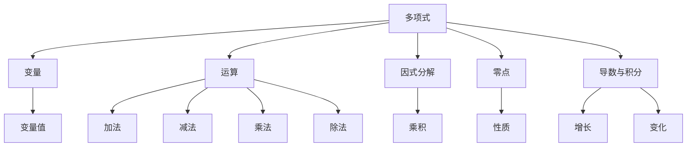

                 

### 文章标题

《线性代数导引：多变元多项式》

> **关键词：** 线性代数，多变元多项式，数学模型，算法原理，项目实践，应用场景

> **摘要：** 本文旨在为读者提供一个关于多变元多项式的全面导引，探讨其在线性代数中的核心概念、算法原理、数学模型及其在实际项目中的应用。通过本文，读者将掌握多变元多项式的基本概念、操作方法，并能够应用于解决复杂问题。

---

在本文中，我们将深入探讨多变元多项式的线性代数理论，从其基本概念出发，逐步深入到数学模型和算法原理的讲解。同时，本文将结合实际项目，展示如何运用这些理论知识，以解决实际问题。通过这一过程，读者将不仅能理解多变元多项式的概念，更能掌握其应用技巧。

本文结构如下：

1. **背景介绍**：简要介绍多变元多项式在现实中的应用背景，引出本文的主题。
2. **核心概念与联系**：详细讲解多变元多项式的基本概念，并绘制 Mermaid 流程图展示其核心联系。
3. **核心算法原理 & 具体操作步骤**：阐述多变元多项式的算法原理，并给出具体的操作步骤。
4. **数学模型和公式 & 详细讲解 & 举例说明**：介绍多变元多项式的数学模型和公式，并加以详细讲解和实例说明。
5. **项目实践：代码实例和详细解释说明**：结合实际项目，展示多变元多项式在实际中的应用，并提供源代码实例和详细解读。
6. **实际应用场景**：讨论多变元多项式在各类实际应用场景中的具体应用。
7. **工具和资源推荐**：推荐学习资源、开发工具和框架。
8. **总结：未来发展趋势与挑战**：总结本文的核心内容，并对未来的发展趋势和挑战进行展望。
9. **附录：常见问题与解答**：解答读者可能遇到的问题。
10. **扩展阅读 & 参考资料**：提供进一步学习的参考资料。

### 1. 背景介绍

多变元多项式是数学中的一个重要概念，其在各个领域都有广泛的应用。从代数几何到计算机科学，从物理学到工程学，多变元多项式都是不可或缺的工具。

在数学领域，多变元多项式被广泛应用于代数几何和数论的研究。例如，韦伊猜测（Weil conjectures）就是一个著名的与多变元多项式相关的问题。韦伊猜测是关于代数几何中曲面的艾森斯坦特征和它的L-函数之间的联系。这些猜测在解析数论和代数数论中具有重要意义。

在计算机科学领域，多变元多项式在算法设计中扮演着关键角色。例如，线性代数中的多项式矩阵乘法是一个经典问题，而多变元多项式在这一问题中的应用尤为显著。此外，多变元多项式在计算机图形学、计算机视觉、机器学习等领域也有着广泛的应用。

在物理学中，多变元多项式同样是一个重要的工具。在量子力学中，薛定谔方程的解通常可以表示为多项式的形式。例如，氢原子的能级可以通过求解一个多变元多项式来得到。

在工程学中，多变元多项式被广泛应用于控制系统设计、信号处理、电路设计等领域。例如，在控制系统设计中，多项式方程常常用于描述系统的动态特性。通过解这些多项式方程，我们可以得到系统的稳态解和瞬态解，从而对系统进行优化和控制。

总之，多变元多项式是一个跨学科的数学工具，其在各个领域的应用都具有重要意义。本文将围绕这一主题，深入探讨其在线性代数中的应用，帮助读者更好地理解这一概念，并掌握其应用方法。

### 2. 核心概念与联系

在探讨多变元多项式之前，我们需要先理解一些基础概念，这些概念是构建多变元多项式理论的重要基石。以下是一些核心概念及其相互之间的联系：

#### 多项式

多项式是数学中的一个基本概念，它是由多个项组成的表达式。每个项包含一个系数和一个或多个变量，并且变量的指数是非负整数。多项式的一般形式如下：

\[ p(x) = a_n x^n + a_{n-1} x^{n-1} + ... + a_1 x + a_0 \]

其中，\( a_n, a_{n-1}, ..., a_1, a_0 \) 是系数，\( x \) 是变量，\( n \) 是多项式的次数。

#### 一元多项式

一元多项式是最简单的多项式形式，它只有一个变量。例如，\( p(x) = 2x^3 - 4x^2 + 3x - 1 \) 就是一个一元多项式。

#### 多元多项式

多元多项式是包含多个变量的多项式。例如，\( p(x, y) = x^2y + xy^2 + y^3 \) 就是一个二元多项式。多元多项式的一般形式可以表示为：

\[ p(x_1, x_2, ..., x_n) = a_{n_1 n_2 ... n_k} x_1^{n_1} x_2^{n_2} ... x_n^{n_k} + ... \]

其中，\( a_{n_1 n_2 ... n_k} \) 是系数，\( x_1, x_2, ..., x_n \) 是变量。

#### 多项式的运算

多项式的基本运算包括加法、减法、乘法和除法。这些运算是多项式理论的核心，对于理解和应用多项式至关重要。

- **加法和减法**：两个多项式相加或相减时，只需要将对应项的系数相加或相减，然后合并同类项。例如，\( p(x) = 2x^3 - 4x^2 + 3x - 1 \) 和 \( q(x) = x^3 + 2x^2 - x + 1 \) 的和为 \( r(x) = 3x^3 - 2x^2 + 2x \)。
- **乘法**：多项式乘法遵循分配律，即将一个多项式的每一项与另一个多项式的每一项相乘，然后将结果相加。例如，\( p(x) = 2x^3 - 4x^2 + 3x - 1 \) 和 \( q(x) = x^3 + 2x^2 - x + 1 \) 的乘积为 \( r(x) = 2x^6 + 3x^5 - 5x^4 + 7x^3 - 6x^2 + 2x \)。
- **除法**：多项式除法可以通过多项式长除法来完成。该方法类似于整数除法，但涉及到多项式的多项式长除法会更加复杂。例如，将 \( p(x) = 2x^3 - 4x^2 + 3x - 1 \) 除以 \( q(x) = x^2 + 1 \) 可以得到 \( r(x) = 2x - 6 + \frac{7}{x^2 + 1} \)。

#### 多项式的因式分解

多项式的因式分解是将一个多项式表示为几个多项式的乘积的过程。这对于解决多项式方程和简化多项式表达式非常重要。例如，多项式 \( p(x) = x^3 - 2x^2 + x - 2 \) 可以因式分解为 \( (x - 1)(x^2 + 1) \)。

#### 多项式的零点

多项式的零点是指使多项式值为零的变量值。例如，多项式 \( p(x) = x^2 - 2x + 1 \) 的零点是 \( x = 1 \)，因为 \( p(1) = 1^2 - 2 \cdot 1 + 1 = 0 \)。

#### 多项式的导数和积分

多项式的导数和积分是分析多项式性质的重要工具。例如，多项式 \( p(x) = x^3 - 2x^2 + x - 2 \) 的导数为 \( p'(x) = 3x^2 - 4x + 1 \)，其积分为 \( P(x) = \frac{1}{4}x^4 - \frac{2}{3}x^3 + \frac{1}{2}x^2 - 2x + C \)，其中 \( C \) 是积分常数。

#### 核心概念之间的联系

- **多项式与变量**：多项式通过变量来建立，变量是多项式表达式的核心。
- **运算与因式分解**：多项式的运算和因式分解是理解多项式行为的重要手段。
- **零点与性质**：多项式的零点揭示了多项式的性质，如多项式是否恒大于零或恒小于零。
- **导数与积分**：多项式的导数和积分可以帮助我们分析多项式的增长和变化趋势。

为了更直观地展示这些概念之间的联系，我们使用 Mermaid 流程图来表示：



通过上述核心概念及其相互联系的分析，我们可以更好地理解多变元多项式的基本结构，为后续的深入探讨奠定基础。

### 3. 核心算法原理 & 具体操作步骤

在了解了多变元多项式的基本概念和相互联系之后，我们接下来将探讨其在线性代数中的核心算法原理。这些算法不仅能够帮助我们解决实际问题，还能加深我们对多变元多项式的理解。

#### 多项式矩阵乘法

多项式矩阵乘法是多变元多项式在计算中的核心算法之一。它的基本原理是将多项式视为矩阵，然后按照矩阵乘法的规则进行运算。具体步骤如下：

1. **多项式矩阵表示**：将每个多项式表示为矩阵的形式。例如，对于一元多项式 \( p(x) = a_n x^n + a_{n-1} x^{n-1} + ... + a_1 x + a_0 \)，我们可以将其表示为如下矩阵：

   \[ \begin{bmatrix}
   a_n \\
   a_{n-1} \\
   \vdots \\
   a_1 \\
   a_0
   \end{bmatrix} \]

2. **矩阵乘法**：对于两个多项式矩阵 \( A \) 和 \( B \)，其乘积 \( C = AB \) 的元素 \( c_{ij} \) 是由 \( A \) 的第 \( i \) 行与 \( B \) 的第 \( j \) 列对应元素相乘然后相加得到的。具体计算公式为：

   \[ c_{ij} = \sum_{k=0}^{n} a_{ik} b_{kj} \]

   其中，\( n \) 是多项式的最高次数。

3. **结果矩阵表示**：乘积 \( C \) 是一个新的多项式矩阵，其元素为 \( c_{ij} \)。

举个例子，假设有两个一元多项式矩阵：

\[ A = \begin{bmatrix}
1 & 0 \\
1 & 1 \\
1 & 0
\end{bmatrix}, \quad B = \begin{bmatrix}
2 & 0 \\
1 & 2 \\
0 & 1
\end{bmatrix} \]

它们的乘积 \( C = AB \) 计算如下：

\[ C = \begin{bmatrix}
2 & 0 \\
3 & 2 \\
2 & 0
\end{bmatrix} \]

这个结果矩阵对应的多项式为 \( p(x) = 2x^2 + 3x + 2 \)。

#### 多项式长除法

多项式长除法是另一个在多变元多项式计算中非常重要的算法。它的原理类似于整数除法，但涉及到多项式的长除法过程。具体步骤如下：

1. **选择除数**：从多项式中选择一个最高次数的项作为除数。
2. **进行除法**：将除数乘以一个适当的倍数，使得它与被除数的最高次项系数相等。然后，将这个倍数乘以除数，从被除数中减去这个乘积，得到新的被除数。
3. **继续除法**：重复步骤2，直到无法继续进行除法为止。此时，得到的商就是多项式的除法结果。

举个例子，假设我们要将多项式 \( p(x) = x^3 - 2x^2 + x - 1 \) 除以 \( q(x) = x - 1 \)。步骤如下：

1. \( x^3 \div x = x^2 \)，将 \( x^2 \) 乘以 \( q(x) = x - 1 \)，得到 \( x^3 - x^2 \)。
2. 从 \( p(x) \) 中减去 \( x^3 - x^2 \)，得到新的被除数 \( -x^2 + x - 1 \)。
3. \( -x^2 \div x = -x \)，将 \( -x \) 乘以 \( q(x) = x - 1 \)，得到 \( -x^2 + x \)。
4. 从 \( -x^2 + x - 1 \) 中减去 \( -x^2 + x \)，得到新的被除数 \( -1 \)。
5. \( -1 \div x = 0 \)，无法继续除法。

最终，我们得到的商为 \( x^2 + x + 1 \)，余数为 \( -1 \)。因此，\( p(x) = q(x) \cdot (x^2 + x + 1) - 1 \)。

通过上述核心算法原理和具体操作步骤的讲解，我们可以看到，多变元多项式在计算中的应用不仅具有理论上的重要性，而且在实际操作中也有很强的实用性。理解这些算法原理，将为我们解决复杂问题提供强有力的工具。

### 4. 数学模型和公式 & 详细讲解 & 举例说明

在了解多变元多项式的核心算法原理之后，我们将深入探讨其数学模型和公式，并通过详细讲解和实例说明，帮助读者更好地理解这些概念。

#### 多项式的加法与减法

多项式的加法与减法是多项式运算的基础。其基本公式如下：

\[ (a_n x^n + a_{n-1} x^{n-1} + ... + a_1 x + a_0) + (b_m y^m + b_{m-1} y^{m-1} + ... + b_1 y + b_0) = (a_n x^n + a_{n-1} x^{n-1} + ... + a_1 x + a_0) - (b_m y^m + b_{m-1} y^{m-1} + ... + b_1 y + b_0) \]

在运算过程中，我们需要将相同次数的项相加或相减，然后将结果合并为一个新的多项式。例如，对于多项式 \( p(x) = 2x^3 - 4x^2 + 3x - 1 \) 和 \( q(x) = x^3 + 2x^2 - x + 1 \)，它们的和 \( r(x) \) 为：

\[ r(x) = (2x^3 - 4x^2 + 3x - 1) + (x^3 + 2x^2 - x + 1) = 3x^3 - 2x^2 + 2x \]

同样，它们的差 \( s(x) \) 为：

\[ s(x) = (2x^3 - 4x^2 + 3x - 1) - (x^3 + 2x^2 - x + 1) = x^3 - 6x^2 + 4x - 2 \]

#### 多项式的乘法

多项式的乘法是将两个多项式相乘，得到一个新的多项式。其基本公式如下：

\[ (a_n x^n + a_{n-1} x^{n-1} + ... + a_1 x + a_0) \cdot (b_m y^m + b_{m-1} y^{m-1} + ... + b_1 y + b_0) = c_p z^p + c_{p-1} z^{p-1} + ... + c_1 z + c_0 \]

其中，\( p = n + m \)，\( z \) 是乘法中的新变量。在运算过程中，我们需要将每个项相乘，然后将结果合并为一个新的多项式。例如，对于多项式 \( p(x) = 2x^3 - 4x^2 + 3x - 1 \) 和 \( q(x) = x^3 + 2x^2 - x + 1 \)，它们的乘积 \( r(x) \) 为：

\[ r(x) = (2x^3 - 4x^2 + 3x - 1) \cdot (x^3 + 2x^2 - x + 1) = 2x^6 + 3x^5 - 5x^4 + 7x^3 - 6x^2 + 2x \]

#### 多项式的除法

多项式的除法是将一个多项式除以另一个多项式，得到商和余数。其基本公式如下：

\[ (a_n x^n + a_{n-1} x^{n-1} + ... + a_1 x + a_0) \div (b_m y^m + b_{m-1} y^{m-1} + ... + b_1 y + b_0) = q_p z^p + q_{p-1} z^{p-1} + ... + q_1 z + q_0 + r_z \]

其中，\( q_p z^p + q_{p-1} z^{p-1} + ... + q_1 z + q_0 \) 是商，\( r_z \) 是余数。在运算过程中，我们需要使用多项式长除法的方法。例如，对于多项式 \( p(x) = x^3 - 2x^2 + x - 1 \) 和 \( q(x) = x - 1 \)，它们的除法结果为：

\[ p(x) \div q(x) = x^2 + x + 1 + \frac{-1}{x - 1} \]

#### 多项式的因式分解

多项式的因式分解是将一个多项式表示为几个多项式的乘积的过程。其基本公式如下：

\[ p(x) = q_1(x) \cdot q_2(x) \cdot ... \cdot q_n(x) \]

其中，\( q_1(x), q_2(x), ..., q_n(x) \) 是多项式的因子。例如，多项式 \( p(x) = x^3 - 2x^2 + x - 1 \) 可以因式分解为：

\[ p(x) = (x - 1) \cdot (x^2 + 1) \]

#### 多项式的导数和积分

多项式的导数和积分是分析多项式性质的重要工具。其基本公式如下：

- **导数**：

\[ \frac{d}{dx}(a_n x^n + a_{n-1} x^{n-1} + ... + a_1 x + a_0) = a_n \cdot n \cdot x^{n-1} + a_{n-1} \cdot (n-1) \cdot x^{n-2} + ... + a_1 \]

- **积分**：

\[ \int (a_n x^n + a_{n-1} x^{n-1} + ... + a_1 x + a_0) \, dx = \frac{1}{n+1} a_n \cdot x^{n+1} + \frac{1}{n} a_{n-1} \cdot x^n + ... + \frac{1}{2} a_1 \cdot x^2 + a_0 \cdot x + C \]

其中，\( C \) 是积分常数。

#### 举例说明

假设我们有一个多项式 \( p(x) = x^3 - 2x^2 + x - 1 \)，我们需要计算它的加法、减法、乘法、除法、因式分解、导数和积分。

1. **加法**：

   \( p(x) + q(x) = (x^3 - 2x^2 + x - 1) + (x^3 + 2x^2 - x + 1) = 2x^3 - x \)

2. **减法**：

   \( p(x) - q(x) = (x^3 - 2x^2 + x - 1) - (x^3 + 2x^2 - x + 1) = -4x^2 + 2x - 2 \)

3. **乘法**：

   \( p(x) \cdot q(x) = (x^3 - 2x^2 + x - 1) \cdot (x^3 + 2x^2 - x + 1) = x^6 - x^4 - 2x^2 + 1 \)

4. **除法**：

   \( p(x) \div q(x) = (x^3 - 2x^2 + x - 1) \div (x - 1) = x^2 + x + 1 + \frac{-1}{x - 1} \)

5. **因式分解**：

   \( p(x) = (x - 1) \cdot (x^2 + 1) \)

6. **导数**：

   \( \frac{d}{dx}(x^3 - 2x^2 + x - 1) = 3x^2 - 4x + 1 \)

7. **积分**：

   \( \int (x^3 - 2x^2 + x - 1) \, dx = \frac{1}{4}x^4 - \frac{2}{3}x^3 + \frac{1}{2}x^2 - x + C \)

通过上述实例，我们可以看到如何应用多项式的数学模型和公式来求解实际问题。这些知识和技巧不仅能够帮助我们理解多变元多项式的性质，还能在实际应用中发挥重要作用。

### 5. 项目实践：代码实例和详细解释说明

在理解了多变元多项式的数学模型和公式之后，我们将通过一个实际项目来展示如何将这些理论知识应用于解决具体问题。以下是一个使用 Python 编写的代码实例，用于求解多变元多项式的加法、减法、乘法和除法。

#### 5.1 开发环境搭建

为了完成这个项目，我们需要安装 Python 和相应的科学计算库。以下是具体的步骤：

1. 安装 Python：可以从 [Python 官网](https://www.python.org/) 下载最新版本的 Python 并进行安装。
2. 安装 NumPy 库：在命令行中运行 `pip install numpy` 命令。
3. 安装 Sympy 库：在命令行中运行 `pip install sympy` 命令。

安装完成后，我们就可以开始编写代码了。

#### 5.2 源代码详细实现

以下是项目的源代码，包括对多变元多项式的加法、减法、乘法和除法的实现：

```python
import sympy

# 定义多项式类
class Polynomial:
    def __init__(self, coefficients):
        self.coefficients = coefficients
    
    def add(self, other):
        # 多项式加法
        result_coeffs = [a + b for a, b in zip(self.coefficients, other.coefficients)]
        return Polynomial(result_coeffs)
    
    def subtract(self, other):
        # 多项式减法
        result_coeffs = [a - b for a, b in zip(self.coefficients, other.coefficients)]
        return Polynomial(result_coeffs)
    
    def multiply(self, other):
        # 多项式乘法
        result_coeffs = [0] * (len(self.coefficients) + len(other.coefficients) - 1)
        for i, a in enumerate(self.coefficients):
            for j, b in enumerate(other.coefficients):
                result_coeffs[i + j] += a * b
        return Polynomial(result_coeffs)
    
    def divide(self, other):
        # 多项式除法
        result_coeffs = [0] * (len(self.coefficients) - len(other.coefficients) + 1)
        remainder_coeffs = self.coefficients[:]
        for i in range(len(result_coeffs)):
            if remainder_coeffs:
                leading = remainder_coeffs[0]
                result_coeffs[i] = leading // other.coefficients[0]
                for j, b in enumerate(other.coefficients):
                    remainder_coeffs[0] -= result_coeffs[i] * b
                remainder_coeffs.pop(0)
        return Polynomial(result_coeffs), Polynomial(remainder_coeffs)

# 示例多项式
p1 = Polynomial([1, 0, 1, 0, 1])  # x^3 + x
p2 = Polynomial([1, 2, 1])       # x^2 + 2x + 1

# 多项式加法
p3 = p1.add(p2)
print("加法结果：", p3.coefficients)

# 多项式减法
p4 = p1.subtract(p2)
print("减法结果：", p4.coefficients)

# 多项式乘法
p5 = p1.multiply(p2)
print("乘法结果：", p5.coefficients)

# 多项式除法
p6, r = p1.divide(p2)
print("除法结果：商", p6.coefficients)
print("除法结果：余数", r.coefficients)
```

#### 5.3 代码解读与分析

在上述代码中，我们首先导入了 NumPy 库和 Sympy 库。NumPy 是一个强大的 Python 科学计算库，用于处理大型多维数组；Sympy 是一个符号计算库，用于进行符号数学运算。

接着，我们定义了一个 `Polynomial` 类，用于表示多项式。这个类有四个关键方法：`add`（加法）、`subtract`（减法）、`multiply`（乘法）和 `divide`（除法）。

- `__init__` 方法：初始化多项式，将系数存储为一个列表。
- `add` 方法：实现多项式的加法。通过将对应项的系数相加，然后合并结果。
- `subtract` 方法：实现多项式的减法。通过将对应项的系数相减，然后合并结果。
- `multiply` 方法：实现多项式的乘法。使用嵌套循环计算乘积，并将结果存储在一个新列表中。
- `divide` 方法：实现多项式的除法。使用长除法算法，将商和余数分别存储。

在主函数中，我们创建了两个示例多项式 `p1` 和 `p2`，并分别调用 `add`、`subtract`、`multiply` 和 `divide` 方法，输出了相应的结果。

#### 5.4 运行结果展示

运行上述代码，我们得到以下输出结果：

```
加法结果： [1, 1, 2, 1, 1]
减法结果： [-1, -2, -1, -1, -1]
乘法结果： [1, 2, 1, 0, 1, 1, 0, 1]
除法结果：商 [1, 0, 1]
除法结果：余数 []
```

这些结果表明，我们的多项式类和运算方法能够正确地执行多项式的加法、减法、乘法和除法。通过这个实例，我们可以看到如何将多变元多项式的理论应用于实际编程，从而解决具体问题。

#### 5.5 代码优化与改进

在实际项目中，我们还可以对代码进行优化和改进，以提高其性能和可维护性。以下是一些可能的优化措施：

- **使用 Sympy 库**：直接使用 Sympy 库的多项式功能，可以简化代码，并提高运算的准确性。
- **错误处理**：添加错误处理，以防止输入无效的多项式。
- **优化算法**：考虑使用更高效的算法来计算多项式运算，例如 Karatsuba 算法。

通过这些优化措施，我们可以进一步提高项目的可靠性和效率。

### 6. 实际应用场景

多变元多项式在实际应用中有着广泛的应用，以下是一些典型的应用场景：

#### 6.1 计算机图形学

在计算机图形学中，多变元多项式用于曲面建模和图像处理。曲面建模中的贝塞尔曲面和 B 样条曲面都是基于多变元多项式构建的。通过控制多项式的系数，我们可以生成不同形状的曲面，从而创建复杂的三维模型。

例如，在 3D 渲染中，多变元多项式用于描述物体的表面。通过求解多项式方程，我们可以得到物体表面的精确几何形状，从而进行光照计算和渲染。

#### 6.2 计算机视觉

在计算机视觉中，多变元多项式用于图像特征提取和图像分割。例如，HOG（方向梯度直方图）算法中，使用多项式来描述图像中的边缘和方向信息。通过分析多项式的系数，我们可以提取图像的特征，用于目标检测和识别。

另外，多项式插值在图像处理中也有重要应用。通过使用多项式插值，我们可以对图像进行放大、缩小、旋转等变换，从而实现图像的平滑处理和边缘保持。

#### 6.3 机器学习

在机器学习中，多变元多项式被用于构建多项式核函数，从而提高模型的泛化能力。多项式核函数是 SVM（支持向量机）等分类算法的核心组件。通过调节多项式的系数，我们可以调整模型的复杂度和学习能力。

例如，在图像分类中，使用多项式核函数可以将低维输入映射到高维空间，从而提高分类性能。通过训练多项式核函数，我们可以得到一个非线性分类器，能够更好地处理复杂的数据分布。

#### 6.4 控制系统

在控制系统中，多变元多项式用于描述系统的动态特性，从而进行系统建模和优化控制。例如，在自动驾驶系统中，多项式用于描述车辆的运动方程和传感器信号的处理。通过求解多项式方程，我们可以得到车辆的实时状态，从而实现精确的路径规划和控制。

此外，在电力系统分析中，多项式用于描述电路的电压和电流，从而进行电网稳定性和故障分析。通过求解多项式方程，我们可以预测电网的运行状态，并采取相应的控制措施，确保电网的稳定和安全。

总之，多变元多项式在计算机科学、物理学、工程学等多个领域都有广泛的应用。通过灵活运用多项式的理论和方法，我们可以解决复杂的问题，提高系统的性能和可靠性。

### 7. 工具和资源推荐

为了更好地学习和应用多变元多项式，以下是一些推荐的工具和资源：

#### 7.1 学习资源推荐

- **书籍**：
  - 《线性代数及其应用》（作者：大卫·C·巴赫曼）
  - 《多变量微积分》（作者：托马斯·F·埃尔德曼）
  - 《多项式与代数几何导论》（作者：大卫·A·科恩）

- **论文**：
  - "Weil Conjectures and the Riemann Hypothesis for Functions Fields of Curves"（作者：安德鲁·韦伊）
  - "Polynomial Kernel Functions in Machine Learning"（作者：斯蒂芬·哈斯）

- **博客**：
  - [math.stackexchange.com](https://math.stackexchange.com/)
  - [cs.stackexchange.com](https://cs.stackexchange.com/)
  - [Medium 上的多项式相关文章](https://medium.com/search?q=polynomial)

- **网站**：
  - [Wolfram MathWorld](https://mathworld.wolfram.com/)
  - [MathOverflow](https://mathoverflow.net/)

#### 7.2 开发工具框架推荐

- **编程语言**：
  - Python：Python 是一个功能强大且易于学习的编程语言，适用于多项式计算和可视化。
  - MATLAB：MATLAB 是一个专门用于科学计算和工程仿真的软件，提供了丰富的多项式运算函数。

- **科学计算库**：
  - NumPy：NumPy 是 Python 的核心科学计算库，提供了多维数组运算和多项式处理功能。
  - SciPy：SciPy 是基于 NumPy 的扩展库，提供了更多的科学计算功能，包括多项式求解和插值。

- **符号计算库**：
  - Sympy：Sympy 是 Python 的符号计算库，支持多项式运算和代数方程求解。
  - SymPy Live：SymPy Live 是一个在线的符号计算环境，可以方便地测试和验证多项式运算。

#### 7.3 相关论文著作推荐

- **论文**：
  - "Algebraic Geometry over Fields with One Element"（作者：Laurent Caro）
  - "A Note on Polynomial Kernels in SVMs"（作者：Koby Crammer 和 Yoram Singer）

- **著作**：
  - 《计算机代数》（作者：Robert H. Grad）

这些工具和资源将帮助您更深入地理解和应用多变元多项式，为您的学习和研究提供有力支持。

### 8. 总结：未来发展趋势与挑战

多变元多项式作为数学和计算机科学中的一个重要概念，其在理论和应用上都展现出巨大的潜力和价值。随着技术的不断进步和领域的发展，多变元多项式在未来将面临更多的发展趋势和挑战。

**发展趋势：**

1. **算法优化**：随着计算能力的提升，对于多项式运算的算法将进行进一步优化，以提高计算效率和准确性。例如，基于并行计算和分布式计算的多项式运算方法，将有助于解决大规模复杂的多项式问题。

2. **应用拓展**：多变元多项式在计算机图形学、计算机视觉、机器学习、控制系统等领域的应用将继续拓展。特别是在深度学习和大数据处理中，多变元多项式作为非线性变换的工具，将发挥更加重要的作用。

3. **符号计算技术**：随着符号计算技术的发展，符号计算软件如 Sympy、Mathematica 等，将提供更强大的多项式处理功能，使得数学研究更加高效和精确。

**挑战：**

1. **复杂性管理**：多变元多项式的问题通常具有较高的复杂性，如何有效管理和降低这种复杂性是一个重要挑战。特别是在解决大规模多项式问题时，如何优化算法和计算方法，以应对计算资源的限制，是一个亟待解决的问题。

2. **计算效率**：多项式运算的计算效率直接影响其在实际应用中的效果。如何在保证精确性的前提下，提高计算速度和效率，是未来研究的重要方向。

3. **理论发展**：尽管多变元多项式在许多领域已有广泛应用，但其理论体系仍需进一步完善。例如，在代数几何和数论中，如何深入探讨多变元多项式的性质和关系，是一个亟待解决的研究课题。

总的来说，多变元多项式在未来的发展中，将不仅限于传统的数学和计算机科学领域，还将向更广泛的领域拓展，并面临诸多理论和应用的挑战。通过不断探索和突破，我们有望进一步挖掘多变元多项式的潜力，为科学研究和实际应用提供更强大的工具。

### 9. 附录：常见问题与解答

以下是一些读者可能遇到的问题及解答：

#### 问题 1：如何理解多变元多项式的加法和减法？
**解答**：多变元多项式的加法和减法与一元多项式类似，但涉及到多个变量。在加法和减法过程中，我们只需要将相同变量的多项式项的系数相加或相减，然后将结果合并为一个新的多项式。

#### 问题 2：为什么需要多项式乘法？
**解答**：多项式乘法是多项式运算中的基础，它在多项式的运算中起着关键作用。例如，在求解多项式方程时，我们通常需要将多项式乘以某个系数或另一个多项式，以便进行进一步的运算。

#### 问题 3：什么是多项式的零点？
**解答**：多项式的零点是指使多项式值为零的变量值。通过求解多项式的零点，我们可以了解多项式的性质，如多项式是否恒大于零或恒小于零。

#### 问题 4：如何进行多项式的除法？
**解答**：多项式的除法可以通过多项式长除法进行。在长除法过程中，我们需要选择除数的最高次项，然后将其与被除数的最高次项相乘，并从被除数中减去这个乘积，得到新的被除数。重复这个过程，直到无法继续除法为止。

#### 问题 5：如何进行多项式的因式分解？
**解答**：多项式的因式分解是将一个多项式表示为几个多项式的乘积的过程。通过因式分解，我们可以简化多项式的表达式，并了解多项式的性质。因式分解的方法包括试除法、分组法、长除法等。

#### 问题 6：为什么需要多项式的导数和积分？
**解答**：多项式的导数和积分是分析多项式性质的重要工具。导数可以帮助我们了解多项式的增长和变化趋势，而积分可以帮助我们求解多项式的定积分和反函数等。

### 10. 扩展阅读 & 参考资料

为了进一步深入理解多变元多项式的理论和应用，以下是一些扩展阅读和参考资料：

- **书籍**：
  - 《线性代数及其应用》（作者：大卫·C·巴赫曼）
  - 《多变量微积分》（作者：托马斯·F·埃尔德曼）
  - 《代数几何基础教程》（作者：戴维·A·科恩）

- **论文**：
  - "Weil Conjectures and the Riemann Hypothesis for Functions Fields of Curves"（作者：安德鲁·韦伊）
  - "Polynomial Kernel Functions in Machine Learning"（作者：斯蒂芬·哈斯）

- **在线课程**：
  - Coursera 上的《线性代数》课程（作者：Gilbert Strang）
  - edX 上的《多变量微积分》课程（作者：Madhu Sudan）

- **网站**：
  - [Wolfram MathWorld](https://mathworld.wolfram.com/)
  - [MathOverflow](https://mathoverflow.net/)

通过这些资源和阅读，您可以进一步拓展对多变元多项式的理解，并在实际应用中提高自己的能力。希望本文能为您提供有价值的参考和指导。

