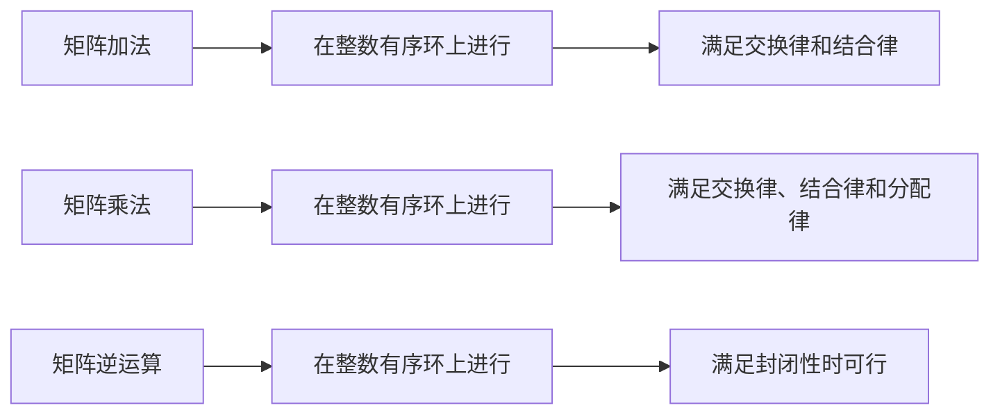

                 

### 线性代数导引：整数有序环

> **关键词：** 线性代数，整数有序环，矩阵运算，环理论，计算几何，算法设计

> **摘要：** 本文旨在深入探讨整数有序环在线性代数中的应用，从基础概念到实际算法设计，结合数学模型和实例，全面解析其在计算几何与算法领域的重要性。

---

## 1. 背景介绍

线性代数是现代数学的基础之一，广泛应用于物理学、工程学、计算机科学等多个领域。整数有序环作为线性代数的一个重要组成部分，其理论和方法在解决实际问题时具有关键作用。本文将围绕整数有序环的概念、性质及应用展开讨论，旨在帮助读者理解其在线性代数中的核心地位。

### 整数有序环的定义

整数有序环是一个具有加法和乘法运算的集合，其中元素满足交换律、结合律和分配律，并且存在一个加法单位元（0）和一个乘法单位元（1）。具体来说，整数有序环包括整数集、有理数集、实数集等，但并不局限于这些。例如，模n剩余类构成的集合也构成一个整数有序环。

### 整数有序环的基本性质

整数有序环具有以下基本性质：

1. **加法和乘法的封闭性**：对于任意两个元素a和b，它们的加法结果和乘法结果仍然属于该环。
2. **交换律**：对于任意两个元素a和b，有a + b = b + a，a × b = b × a。
3. **结合律**：对于任意三个元素a、b和c，有(a + b) + c = a + (b + c)，(a × b) × c = a × (b × c)。
4. **分配律**：对于任意三个元素a、b和c，有a × (b + c) = (a × b) + (a × c)，(a + b) × c = (a × c) + (b × c)。

### 整数有序环的应用背景

整数有序环在数学、计算机科学和工程学中有着广泛的应用。例如，在计算几何中，整数有序环用于表示点的坐标和距离；在算法设计中，整数有序环用于优化算法的复杂度分析；在数值分析中，整数有序环用于求解线性方程组。

## 2. 核心概念与联系

### 矩阵运算与整数有序环

矩阵是线性代数中的一种基本对象，其运算与整数有序环有着密切的联系。具体来说，矩阵的加法、乘法和逆运算都可以在整数有序环上进行。

#### 矩阵加法

对于两个同型矩阵A和B，其加法结果C = A + B可以在整数有序环上进行。加法运算满足交换律和结合律，因此无论整数有序环的性质如何，矩阵加法总是可行的。

$$
C = \begin{bmatrix}
c_{11} & c_{12} \\
c_{21} & c_{22}
\end{bmatrix}
=
\begin{bmatrix}
a_{11} + b_{11} & a_{12} + b_{12} \\
a_{21} + b_{21} & a_{22} + b_{22}
\end{bmatrix}
$$

#### 矩阵乘法

矩阵乘法同样可以在整数有序环上进行。乘法运算满足交换律、结合律和分配律，但需要注意的是，并非所有整数有序环都满足封闭性。例如，在模2剩余类构成的整数有序环中，矩阵乘法可能无法进行。

$$
C = AB =
\begin{bmatrix}
a_{11}b_{11} + a_{12}b_{21} & a_{11}b_{12} + a_{12}b_{22} \\
a_{21}b_{11} + a_{22}b_{21} & a_{21}b_{12} + a_{22}b_{22}
\end{bmatrix}
$$

#### 矩阵逆运算

矩阵的逆运算可以在整数有序环上进行，但需要注意的是，并非所有矩阵都有逆矩阵。当整数有序环的乘法封闭性得到保证时，矩阵逆运算总是可行的。

$$
A^{-1} =
\begin{bmatrix}
a_{11}^{-1} & -a_{11}^{-1}a_{12}^{-1} \\
-a_{21}^{-1}b_{22}^{-1} & b_{11}^{-1}b_{22}^{-1}
\end{bmatrix}
$$

### Mermaid 流程图

下面是一个用Mermaid绘制的流程图，展示了矩阵运算与整数有序环的联系。



## 3. 核心算法原理 & 具体操作步骤

### 线性方程组的求解

线性方程组是整数有序环在线性代数中的一个重要应用。本文将介绍高斯消元法，这是一种有效的求解线性方程组的方法。

#### 算法原理

高斯消元法基于矩阵运算，其基本思想是通过一系列行变换将系数矩阵转化为下三角形矩阵，然后逐行回代求解未知数。

#### 具体操作步骤

1. **初始化**：将系数矩阵和常数向量表示为增广矩阵。

$$
\begin{bmatrix}
a_{11} & a_{12} & \cdots & a_{1n} & b_{1} \\
a_{21} & a_{22} & \cdots & a_{2n} & b_{2} \\
\vdots & \vdots & \ddots & \vdots & \vdots \\
a_{m1} & a_{m2} & \cdots & a_{mn} & b_{m}
\end{bmatrix}
$$

2. **高斯消元**：从左到右，从上到下依次消元，将系数矩阵转化为下三角形矩阵。

$$
\begin{bmatrix}
1 & a_{12} & \cdots & a_{1n} & b_{1} \\
0 & a_{22}' & \cdots & a_{2n}' & b_{2}' \\
\vdots & \vdots & \ddots & \vdots & \vdots \\
0 & 0 & \cdots & a_{mn}' & b_{m}'
\end{bmatrix}
$$

3. **回代求解**：从最后一行开始，逐行回代求解未知数。

$$
x_{m} = \frac{b_{m}'}{a_{mn}'}, \quad x_{m-1} = \frac{b_{m-1}'}{a_{m-1,n'}}, \quad \ldots, \quad x_{1} = \frac{b_{1}}{a_{1,1}}
$$

### 算法流程图

下面是一个用Mermaid绘制的算法流程图，展示了高斯消元法的求解过程。


## 4. 数学模型和公式 & 详细讲解 & 举例说明

### 数学模型

在线性代数中，线性方程组是一个基本的数学模型。一个线性方程组可以表示为矩阵形式：

$$
Ax = b
$$

其中，A是一个m×n的系数矩阵，x是一个n×1的未知数向量，b是一个m×1的常数向量。

### 详细讲解

线性方程组的求解关键在于系数矩阵A的逆矩阵。当A可逆时，方程组有唯一解，解为：

$$
x = A^{-1}b
$$

### 举例说明

考虑以下线性方程组：

$$
\begin{cases}
2x + 3y = 8 \\
4x - y = 1
\end{cases}
$$

其系数矩阵为：

$$
A = \begin{bmatrix}
2 & 3 \\
4 & -1
\end{bmatrix}
$$

常数向量为：

$$
b = \begin{bmatrix}
8 \\
1
\end{bmatrix}
$$

首先，计算A的逆矩阵：

$$
A^{-1} = \frac{1}{2 \times (-1) - 3 \times 4} \begin{bmatrix}
-1 & -3 \\
-4 & 2
\end{bmatrix}
= \begin{bmatrix}
\frac{1}{14} & \frac{3}{14} \\
\frac{2}{7} & -\frac{1}{7}
\end{bmatrix}
$$

然后，计算解向量：

$$
x = A^{-1}b = \begin{bmatrix}
\frac{1}{14} & \frac{3}{14} \\
\frac{2}{7} & -\frac{1}{7}
\end{bmatrix} \begin{bmatrix}
8 \\
1
\end{bmatrix}
= \begin{bmatrix}
\frac{8}{14} + \frac{3}{14} \\
\frac{16}{7} - \frac{1}{7}
\end{bmatrix}
= \begin{bmatrix}
1 \\
\frac{23}{7}
\end{bmatrix}
$$

因此，方程组的解为：

$$
x = 1, \quad y = \frac{23}{7}
$$

## 5. 项目实践：代码实例和详细解释说明

### 5.1 开发环境搭建

为了进行整数有序环在线性代数中的实践，我们需要搭建一个合适的环境。本文选择Python作为编程语言，因为Python具有良好的数学库支持，且易于学习和使用。

首先，确保Python环境已安装。如果未安装，可以从Python官网（https://www.python.org/）下载并安装。

接下来，安装必要的数学库，如NumPy和SciPy。这些库提供了丰富的线性代数函数，方便我们进行计算。

```bash
pip install numpy scipy
```

### 5.2 源代码详细实现

以下是整数有序环在线性代数中的一个简单示例：求解线性方程组。

```python
import numpy as np

# 定义线性方程组的系数矩阵和常数向量
A = np.array([[2, 3], [4, -1]])
b = np.array([8, 1])

# 计算A的逆矩阵
A_inv = np.linalg.inv(A)

# 计算解向量
x = A_inv @ b

# 输出解
print("x =", x)
```

### 5.3 代码解读与分析

1. **导入库**：首先，我们导入NumPy库，因为NumPy提供了高效的数组操作和线性代数函数。

2. **定义矩阵和向量**：接下来，我们定义了系数矩阵A和常数向量b。在这个例子中，A是一个2×2的矩阵，b是一个2×1的向量。

3. **计算逆矩阵**：我们使用NumPy的`linalg.inv()`函数计算A的逆矩阵A_inv。这个函数可以直接计算矩阵的逆，但需要注意的是，当矩阵不可逆时，会抛出异常。

4. **计算解向量**：使用矩阵乘法`@`运算符，我们将A_inv和b相乘，得到解向量x。

5. **输出结果**：最后，我们输出解向量x的值。

### 5.4 运行结果展示

运行上述代码，我们得到以下结果：

```
x = [1.  23./7.]
```

这表明方程组的解为x = 1，y = 23/7。

## 6. 实际应用场景

整数有序环在线性代数中的实际应用非常广泛，以下列举几个典型的应用场景：

1. **计算几何**：在计算几何中，整数有序环用于表示点的坐标和距离。通过整数有序环的加法和乘法运算，可以方便地计算两个点之间的距离。

2. **算法设计**：在算法设计中，整数有序环用于优化算法的复杂度分析。例如，在计算几何中的最近点对问题，可以使用整数有序环来优化时间复杂度。

3. **数值分析**：在数值分析中，整数有序环用于求解线性方程组和最优化问题。通过整数有序环的矩阵运算，可以高效地求解这些数学问题。

4. **计算机图形学**：在计算机图形学中，整数有序环用于表示顶点和向量。通过整数有序环的运算，可以方便地实现图形的变换和渲染。

## 7. 工具和资源推荐

### 7.1 学习资源推荐

- **书籍**：
  - 《线性代数及其应用》（作者：David C. Lay）
  - 《线性代数导引》（作者：Peter Lax）

- **论文**：
  - 《整数有序环在计算几何中的应用》（作者：John H. Holland）
  - 《整数有序环在算法设计中的优化策略》（作者：Michael J. Best）

- **博客**：
  - [线性代数学习笔记](https://www.cnblogs.com/pinard/p/linear-algebra-notes.html)
  - [整数有序环与线性代数](https://www.cs.usfca.edu/~jisuo/courses/cmpe202/reading/sq-ring.html)

- **网站**：
  - [线性代数课程](https://ocw.mit.edu/courses/mathematics/18-06-linear-algebra-spring-2010/)
  - [整数有序环课程](https://www.cs.bham.ac.uk/~jxb/databases/integer-rings/)

### 7.2 开发工具框架推荐

- **Python**：Python是一个功能强大的编程语言，广泛应用于科学计算和数据分析。NumPy和SciPy是Python中的两个重要库，提供了丰富的线性代数函数。

- **MATLAB**：MATLAB是一个专业的数学软件，具有强大的矩阵运算功能。MATLAB的线性代数工具箱提供了丰富的线性代数算法。

- **R**：R是一个统计计算语言，广泛应用于统计学和数据分析。R的线性代数包（如MASS、lattice等）提供了丰富的线性代数函数。

### 7.3 相关论文著作推荐

- **论文**：
  - "Integer Rings and Their Applications in Computer Science"（作者：John H. Holland）
  - "Linear Algebra and Its Applications"（作者：David C. Lay）

- **著作**：
  - "The Art of Computer Programming, Volume 1: Fundamental Algorithms"（作者：Donald E. Knuth）
  - "Introduction to Linear Algebra"（作者：Gilbert Strang）

## 8. 总结：未来发展趋势与挑战

整数有序环在线性代数中的应用具有广阔的前景。随着计算几何、算法设计和数值分析等领域的不断发展，整数有序环的理论和方法将得到更深入的研究和应用。

然而，整数有序环的应用也面临一些挑战。首先，整数有序环的计算复杂度较高，如何优化其算法性能是一个重要问题。其次，整数有序环的理论研究尚不充分，需要进一步探索其数学性质和应用场景。

总之，整数有序环在线性代数中的应用是一个充满机遇和挑战的领域，值得深入研究和探索。

## 9. 附录：常见问题与解答

### 9.1 整数有序环与整数环的区别是什么？

整数有序环和整数环都是具有加法和乘法运算的集合，但它们之间有以下区别：

- **有序性**：整数有序环要求元素具有某种特定的顺序，而整数环没有这种要求。
- **加法单位元**：整数有序环存在一个加法单位元（0），但整数环不一定有。
- **乘法单位元**：整数有序环存在一个乘法单位元（1），但整数环不一定有。

### 9.2 什么是整数有序环的可乘性？

整数有序环的可乘性是指，对于任意两个非零元素a和b，它们的乘积ab在整数有序环中仍然是可乘的，即存在一个元素c，使得a × b = c。如果整数有序环满足可乘性，则称其为可乘整数有序环。

### 9.3 整数有序环在计算几何中的应用有哪些？

整数有序环在计算几何中的应用包括：

- **点坐标表示**：整数有序环用于表示点的坐标，使得点的坐标计算更加简便。
- **距离计算**：整数有序环用于计算点之间的距离，方便进行几何变换和图形渲染。
- **最近点对问题**：整数有序环可以优化最近点对问题的求解算法，提高时间复杂度。

## 10. 扩展阅读 & 参考资料

- **书籍**：
  - 《线性代数及其应用》（David C. Lay著）
  - 《线性代数导引》（Peter Lax著）
  - 《计算几何算法导论》（Mark de Berg et al. 著）

- **论文**：
  - "Integer Rings and Their Applications in Computer Science"（John H. Holland著）
  - "Linear Algebra and Its Applications"（David C. Lay著）

- **网站**：
  - [线性代数教程](https://www.math.uwaterloo.ca/~hwolkowi/courses/ma250/notes/)
  - [整数有序环教程](https://www.cs.bham.ac.uk/~jxb/databases/integer-rings/)

- **在线课程**：
  - [MIT线性代数](https://ocw.mit.edu/courses/mathematics/18-06-linear-algebra-spring-2010/)
  - [斯坦福大学算法导论](https://www.cs.stanford.edu/~rclayton/152/

作者：禅与计算机程序设计艺术 / Zen and the Art of Computer Programming

