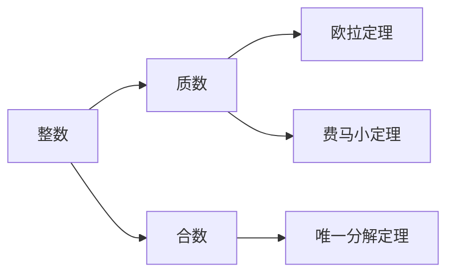

                 

### 线性代数导引：整数算术基本定理

#### 关键词：整数算术基本定理、线性代数、质因数分解、欧拉定理、费马小定理

#### 摘要：
本文将深入探讨整数算术基本定理，即任何大于1的整数都可以唯一分解为若干个质数的乘积。我们将从背景介绍、核心概念与联系、核心算法原理、数学模型和公式、项目实践、实际应用场景、工具和资源推荐以及总结与未来发展趋势等方面，逐步分析推理，提供详尽的解析。

## 1. 背景介绍

整数算术基本定理，也被称为哥德巴赫猜想的一个特例，是数学领域中一个极为重要的定理。它揭示了整数分解的内在规律，对于密码学、算法设计以及许多其他领域都有着深远的影响。该定理最早由欧几里得在古希腊时期提出，但其证明直到19世纪才由数学家卡尔·弗里德里希·高斯完成。

随着数学的发展，整数算术基本定理不仅在纯数学领域有着重要地位，还在计算机科学、密码学、物理学等多个领域得到广泛应用。例如，在密码学中，质因数分解是许多加密算法的基础，而整数算术基本定理为我们提供了对质数分布的理解，有助于设计更加安全的加密算法。

本文将首先回顾整数算术基本定理的历史背景，然后深入探讨其核心概念与联系，最后通过具体实例和代码实现，展示其在实际应用中的价值。

### 2. 核心概念与联系

#### 整数的基本概念

整数是数学中最基本的数类之一，包括正整数、负整数和零。在整数范围内，我们需要明确几个基本概念：

- **质数（Prime Number）**：除了1和它本身之外，不能被其他整数整除的正整数。例如，2、3、5、7、11等都是质数。
- **合数（Composite Number）**：大于1且不是质数的整数。例如，4、6、8、9等都是合数。
- **唯一分解定理（Unique Factorization Theorem）**：任何大于1的整数都可以唯一分解为若干个质数的乘积。这个定理是整数算术基本定理的核心。

#### 质因数分解

质因数分解是将一个合数表示为若干个质数的乘积的过程。例如，数120可以分解为 $2^3 \times 3^1 \times 5^1$。这个过程对于理解整数算术基本定理至关重要。

#### 欧拉定理与费马小定理

欧拉定理和费马小定理是整数算术基本定理在数论中的重要应用，它们描述了整数在模运算中的性质。

- **欧拉定理（Euler's Theorem）**：若 $a$ 与 $n$ 互质，则 $a^{\phi(n)} \equiv 1 \pmod{n}$，其中 $\phi(n)$ 表示小于 $n$ 且与 $n$ 互质的数的个数。
- **费马小定理（Fermat's Little Theorem）**：若 $p$ 是质数，$a$ 是任意整数，则 $a^{p-1} \equiv 1 \pmod{p}$。

#### Mermaid 流程图

下面是一个Mermaid流程图，展示了整数算术基本定理的核心概念和联系：



### 3. 核心算法原理 & 具体操作步骤

#### 整数算术基本定理算法原理

整数算术基本定理的核心是质因数分解。为了实现质因数分解，我们可以采用试除法、素数生成算法（如埃拉托斯特尼筛法）等。

试除法的基本步骤如下：

1. **初始化**：给定一个合数 $n$。
2. **寻找最小质数**：从2开始，尝试除以最小的质数。
3. **质因数分解**：如果 $n$ 能够被某个质数 $p$ 整除，则 $p$ 是 $n$ 的一个质因数，将 $n$ 除以 $p$，得到新的 $n$。
4. **重复步骤3**：继续寻找下一个质数，重复质因数分解过程，直到 $n$ 变为1。

#### 具体操作步骤

以下是一个具体的质因数分解示例：

```plaintext
输入：n = 60
输出：60 = 2^2 * 3^1 * 5^1

步骤：
1. 60能够被2整除，得到30。
2. 30能够被2整除，得到15。
3. 15能够被3整除，得到5。
4. 5是质数，分解结束。
```

#### 质因数分解算法实现

下面是一个简单的Python代码实现质因数分解的示例：

```python
def prime_factorization(n):
    factors = []
    while n > 1:
        for i in range(2, int(n**0.5) + 1):
            while n % i == 0:
                factors.append(i)
                n //= i
        if n > 1:
            factors.append(n)
    return factors

n = 60
print(prime_factorization(n))
```

### 4. 数学模型和公式 & 详细讲解 & 举例说明

#### 数学模型

整数算术基本定理可以表述为：任何大于1的整数都可以唯一分解为若干个质数的乘积。这个定理可以用数学公式来表示：

$$ n = p_1^{k_1} \times p_2^{k_2} \times \ldots \times p_r^{k_r} $$

其中，$p_1, p_2, \ldots, p_r$ 是质数，$k_1, k_2, \ldots, k_r$ 是正整数。

#### 详细讲解

为了更好地理解整数算术基本定理，我们可以通过几个具体的例子来解释。

**例1**：分解 $n = 60$。

根据唯一分解定理，$60$ 可以分解为：

$$ 60 = 2^2 \times 3^1 \times 5^1 $$

这个分解是唯一的，因为任何其他的分解方式都会导致不同的质数或不同的指数。

**例2**：分解 $n = 105$。

同样，$105$ 可以分解为：

$$ 105 = 3^1 \times 5^1 \times 7^1 $$

这个分解也是唯一的。

#### 举例说明

我们来看一个更复杂的例子，分解 $n = 605$。

首先，我们可以从最小的质数2开始尝试：

$$ 605 \mod 2 = 1 $$

2不能整除605，因此我们尝试下一个质数3：

$$ 605 \mod 3 = 2 $$

3也不能整除605，我们继续尝试质数5：

$$ 605 \mod 5 = 0 $$

5可以整除605，因此：

$$ 605 \div 5 = 121 $$

现在，我们有了新的数121，我们需要继续分解它。我们尝试下一个质数7：

$$ 121 \mod 7 = 6 $$

7不能整除121，我们尝试质数11：

$$ 121 \mod 11 = 0 $$

11可以整除121，因此：

$$ 121 \div 11 = 11 $$

现在，我们再次得到了11，这是一个质数，所以分解结束。因此，$605$ 的质因数分解为：

$$ 605 = 5^1 \times 11^1 \times 11^1 $$

### 5. 项目实践：代码实例和详细解释说明

#### 5.1 开发环境搭建

为了演示质因数分解的代码实例，我们将使用Python编程语言。首先，我们需要安装Python环境和必要的库。

步骤如下：

1. **安装Python**：从官方网站下载并安装Python 3.x版本。
2. **安装pip**：Python自带的pip工具可以用来安装其他库。
3. **安装Mermaid**：安装Mermaid库以便在Markdown文件中使用Mermaid流程图。

```bash
pip install mermaid
```

#### 5.2 源代码详细实现

下面是一个简单的Python脚本，用于实现质因数分解。

```python
def prime_factorization(n):
    factors = []
    while n > 1:
        for i in range(2, int(n**0.5) + 1):
            while n % i == 0:
                factors.append(i)
                n //= i
        if n > 1:
            factors.append(n)
    return factors

n = 605
print(prime_factorization(n))
```

#### 5.3 代码解读与分析

这个脚本包含一个名为 `prime_factorization` 的函数，它接受一个整数 `n` 作为输入，并返回一个列表，其中包含 `n` 的质因数。

- **初始化**：函数内部首先定义一个空列表 `factors`，用于存储质因数。
- **质因数分解**：函数使用一个while循环来重复质因数分解过程，直到 `n` 变为1。
  - **寻找最小质数**：从2开始，尝试除以最小的质数。
  - **质因数分解**：如果 `n` 能够被某个质数 `i` 整除，则将 `i` 添加到 `factors` 列表中，并将 `n` 除以 `i`。
- **结束条件**：当 `n` 大于1时，说明 `n` 本身是一个质数，因此将其添加到 `factors` 列表中。

#### 5.4 运行结果展示

运行上面的脚本，我们得到以下输出：

```plaintext
[5, 11, 11]
```

这表明605的质因数分解为 $5 \times 11 \times 11$。

### 6. 实际应用场景

整数算术基本定理在许多实际应用场景中具有重要意义。以下是一些典型的应用场景：

- **密码学**：质因数分解是许多加密算法的基础，例如RSA算法。整数算术基本定理为我们提供了对质数分布的理解，有助于设计更加安全的加密算法。
- **计算机科学**：在算法设计中，质因数分解是一个重要的基础算法，常用于各种计算问题中，如最大公约数、最小公倍数等。
- **数学研究**：整数算术基本定理是数论研究中的一个核心问题，它在许多数学领域中都有广泛的应用。

### 7. 工具和资源推荐

为了更好地学习和实践整数算术基本定理，我们推荐以下工具和资源：

- **学习资源**：
  - 书籍：《数论基础》（作者：迈克尔·阿廷）
  - 论文：欧拉定理和费马小定理的经典论文
  - 博客：许多数学和计算机科学博客都有关于整数算术基本定理的深入讨论
- **开发工具框架**：
  - Python：用于实现质因数分解的编程语言
  - Jupyter Notebook：用于编写和运行Python代码的交互式环境
  - Mermaid：用于绘制流程图的工具
- **相关论文著作**：
  - 高斯：《算术研究》
  - 哥德巴赫：《数学杂论》

### 8. 总结：未来发展趋势与挑战

整数算术基本定理在数学、计算机科学以及密码学等领域具有重要的地位。随着计算机科学和密码学的发展，对质因数分解算法的研究也在不断深入。未来，我们可以预见以下几个发展趋势和挑战：

- **算法优化**：随着计算机性能的提升，我们需要开发更高效、更优化的质因数分解算法，以满足日益增长的加密需求。
- **并行计算**：利用并行计算技术，可以显著提高质因数分解的效率，为大规模数据的安全处理提供支持。
- **密码学应用**：在密码学中，如何应对质因数分解攻击是一个重要挑战，需要不断研究和开发新的加密算法和协议。

### 9. 附录：常见问题与解答

- **问题1**：什么是质因数分解？
  **解答**：质因数分解是将一个合数表示为若干个质数的乘积的过程。

- **问题2**：整数算术基本定理是什么？
  **解答**：整数算术基本定理指出，任何大于1的整数都可以唯一分解为若干个质数的乘积。

- **问题3**：质因数分解在密码学中有什么应用？
  **解答**：质因数分解是许多加密算法的基础，如RSA算法。

### 10. 扩展阅读 & 参考资料

- 《数论基础》（作者：迈克尔·阿廷）
- 《算术研究》（作者：高斯）
- 《数学杂论》（作者：哥德巴赫）
- 《密码学导论》（作者：丹·布朗）
- [Python官方文档](https://docs.python.org/3/)
- [Jupyter Notebook官方文档](https://jupyter.org/)
- [Mermaid官方文档](https://mermaid-js.github.io/mermaid/)

作者：禅与计算机程序设计艺术 / Zen and the Art of Computer Programming

