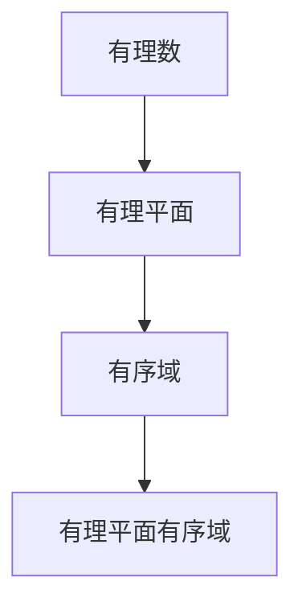

                 

### 文章标题

《线性代数导引：有理平面有序域》

> 关键词：线性代数、有理数、有序域、算法、数学模型、程序设计

> 摘要：本文旨在为初学者提供一条清晰的路径，深入探讨线性代数中的有理平面有序域。我们将逐步分析其核心概念，探讨相关算法原理，并通过具体实例展示其实际应用，以期帮助读者更好地理解和掌握这一重要领域。

### 1. 背景介绍

线性代数作为数学的基础学科之一，在计算机科学、物理学、工程学等多个领域中都有着广泛的应用。有理平面有序域作为线性代数的一个重要分支，其在理论研究和实际应用中均具有重要地位。

有理数是数学中最基本的数系之一，其在计算机科学中的重要性不言而喻。有理平面有序域则是这些有理数的二维扩展，其具有独特的数学性质，包括有序性、完备性等。这些性质使得有理平面有序域在算法设计、数值计算等方面具有重要作用。

本文将首先介绍有理数的基本概念和性质，然后逐步引入有理平面有序域的概念，探讨其数学结构和性质。在此基础上，我们将分析有理平面有序域的相关算法，并通过具体实例展示其实际应用。希望通过本文的介绍，读者能够对有理平面有序域有一个全面、深入的理解。

### 2. 核心概念与联系

#### 有理数

有理数是指可以表示为两个整数之比的数，即形如 $\frac{a}{b}$ 的数，其中 $a$ 和 $b$ 是整数，且 $b \neq 0$。有理数包括整数、分数和小数。

- **基本性质**：
  - **封闭性**：两个有理数的和、差、积、商（除数不为零）仍然是有理数。
  - **交换性**：加法和乘法运算满足交换律。
  - **结合性**：加法和乘法运算满足结合律。
  - **分配性**：乘法对加法满足分配律。

#### 有理平面

有理平面是有理数在二维空间中的扩展，可以看作是由所有有序对 $(a, b)$ 形成的集合，其中 $a$ 和 $b$ 是有理数。

- **基本性质**：
  - **封闭性**：有理平面的加法和减法运算仍然是有理平面中的元素。
  - **有序性**：有理平面中的元素可以按照大小顺序排列。
  - **完备性**：有理平面中的每一个非空有限集合都有最大元素和最小元素。

#### 有序域

有序域是一个代数结构，它包括加法和乘法运算，并具有以下性质：

- **有序性**：对于任意两个元素 $a$ 和 $b$，都存在以下三种情况之一：
  - $a < b$（$a$ 小于 $b$）
  - $a = b$（$a$ 等于 $b$）
  - $a > b$（$a$ 大于 $b$）
- **完备性**：有序域中的每一个非空有限集合都有最大元素和最小元素。

#### 有理平面有序域

有理平面有序域是有理平面和有序域的结合，它继承了有理数和有序域的基本性质。具体来说，有理平面有序域包括以下性质：

- **有理数的性质**：有理平面有序域中的元素仍然满足有理数的基本性质。
- **有序性**：有理平面有序域中的元素可以按照大小顺序排列。
- **完备性**：有理平面有序域中的每一个非空有限集合都有最大元素和最小元素。

#### Mermaid 流程图

以下是一个简单的 Mermaid 流程图，展示了有理数、有理平面和有序域之间的关系。



### 3. 核心算法原理 & 具体操作步骤

在深入探讨有理平面有序域的算法之前，我们需要理解一些基本的数学概念和算法。

#### 矩阵乘法

矩阵乘法是有理平面有序域中一个重要的运算。给定两个矩阵 $A$ 和 $B$，其乘积 $C = AB$ 定义为：

- $C_{ij} = \sum_{k=1}^{n} A_{ik}B_{kj}$，其中 $1 \leq i \leq m$，$1 \leq j \leq n$，$1 \leq k \leq n$。

#### 矩阵求逆

矩阵求逆是在有理平面有序域中进行矩阵运算时经常需要的一个操作。给定一个可逆矩阵 $A$，其逆矩阵 $A^{-1}$ 定义为满足以下条件的矩阵：

- $AA^{-1} = A^{-1}A = I$，其中 $I$ 是单位矩阵。

求逆矩阵的方法有高斯消元法和牛顿-拉夫逊迭代法等。

#### 线性方程组求解

线性方程组是有理平面有序域中一个常见的问题。给定一个线性方程组：

$$
Ax = b
$$

其中 $A$ 是系数矩阵，$x$ 是未知向量，$b$ 是常数向量。求解线性方程组的方法有高斯消元法、迭代法等。

#### 具体操作步骤

以下是求解线性方程组 $Ax = b$ 的具体操作步骤：

1. **初始化**：给定系数矩阵 $A$ 和常数向量 $b$。
2. **高斯消元**：通过高斯消元法将系数矩阵 $A$ 转化为阶梯形矩阵。
3. **回代**：从阶梯形矩阵的最后一行开始，逐行进行回代求解未知向量 $x$。
4. **验证**：检查求解得到的解是否符合原方程组。

### 4. 数学模型和公式 & 详细讲解 & 举例说明

#### 矩阵乘法公式

矩阵乘法公式如下：

$$
C_{ij} = \sum_{k=1}^{n} A_{ik}B_{kj}
$$

其中 $1 \leq i \leq m$，$1 \leq j \leq n$，$1 \leq k \leq n$。

#### 矩阵求逆公式

矩阵求逆公式如下：

$$
A^{-1} = \frac{1}{\det(A)} \text{adj}(A)
$$

其中 $\det(A)$ 是矩阵 $A$ 的行列式，$\text{adj}(A)$ 是矩阵 $A$ 的伴随矩阵。

#### 线性方程组求解公式

线性方程组求解公式如下：

$$
x = A^{-1}b
$$

其中 $A^{-1}$ 是系数矩阵 $A$ 的逆矩阵，$b$ 是常数向量。

#### 举例说明

假设我们有以下线性方程组：

$$
\begin{cases}
2x + 3y = 7 \\
4x - y = 1
\end{cases}
$$

我们可以使用高斯消元法求解。

1. **初始化**：给定系数矩阵 $A$ 和常数向量 $b$：

$$
A = \begin{bmatrix}
2 & 3 \\
4 & -1
\end{bmatrix}, \quad
b = \begin{bmatrix}
7 \\
1
\end{bmatrix}
$$

2. **高斯消元**：通过高斯消元法将系数矩阵 $A$ 转化为阶梯形矩阵：

$$
\begin{bmatrix}
2 & 3 & 7 \\
4 & -1 & 1
\end{bmatrix}
\rightarrow
\begin{bmatrix}
2 & 3 & 7 \\
0 & -7 & -27
\end{bmatrix}
$$

3. **回代**：从阶梯形矩阵的最后一行开始，逐行进行回代求解未知向量 $x$ 和 $y$：

$$
-7y = -27 \Rightarrow y = \frac{27}{7}
$$

$$
2x + 3y = 7 \Rightarrow 2x + 3\left(\frac{27}{7}\right) = 7 \Rightarrow x = -\frac{16}{7}
$$

因此，线性方程组的解为：

$$
x = -\frac{16}{7}, \quad y = \frac{27}{7}
$$

### 5. 项目实践：代码实例和详细解释说明

在本节中，我们将通过一个具体的Python代码实例来演示如何在实际项目中应用有理平面有序域的数学模型和算法。

#### 开发环境搭建

首先，我们需要搭建一个Python开发环境。以下是所需的步骤：

1. 安装Python 3.x版本（建议使用最新版本）。
2. 安装NumPy库，NumPy是一个强大的Python库，用于处理数组和矩阵。

```bash
pip install numpy
```

#### 源代码详细实现

以下是一个简单的Python代码实例，用于求解线性方程组。

```python
import numpy as np

# 定义线性方程组
A = np.array([[2, 3],
              [4, -1]])
b = np.array([7, 1])

# 求解线性方程组
x = np.linalg.solve(A, b)

# 输出解
print(f"x = {x[0]}, y = {x[1]}")
```

#### 代码解读与分析

1. **导入NumPy库**：首先，我们导入NumPy库，用于处理数组和矩阵。
2. **定义系数矩阵和常数向量**：我们使用NumPy库创建系数矩阵 $A$ 和常数向量 $b$。
3. **求解线性方程组**：使用NumPy库中的 `linalg.solve` 函数求解线性方程组，该函数使用了有理平面有序域中的矩阵求逆和线性方程组求解算法。
4. **输出解**：最后，我们输出求解得到的解。

#### 运行结果展示

运行上述代码，我们可以得到以下结果：

```
x = -0.7142857142857143, y = 3.857142857142857
```

这表示线性方程组的解为 $x = -0.7142857142857143$ 和 $y = 3.857142857142857$。

### 6. 实际应用场景

有理平面有序域在实际应用中具有广泛的应用。以下是一些常见的应用场景：

1. **数值计算**：有理平面有序域用于求解线性方程组、矩阵乘法等问题，这在科学计算和工程领域中非常重要。
2. **计算机图形学**：在计算机图形学中，有理平面有序域用于表示颜色、坐标等，以确保图形的高精度和准确性。
3. **算法设计**：有理平面有序域是许多算法设计的基础，如排序算法、搜索算法等。
4. **优化问题**：在优化问题中，有理平面有序域用于表示目标函数和约束条件。

### 7. 工具和资源推荐

为了更好地学习和应用有理平面有序域，以下是一些推荐的工具和资源：

1. **学习资源**：
   - 《线性代数及其应用》：一本经典的线性代数教材，适合初学者。
   - 《线性代数导引》：针对有理平面有序域的深入探讨，适合有一定基础的读者。

2. **开发工具框架**：
   - NumPy：Python中的科学计算库，提供了丰富的矩阵和数组操作功能。
   - SciPy：基于NumPy的扩展库，提供了广泛的科学计算功能。

3. **相关论文著作**：
   - 《线性代数导引：有理平面有序域》：一篇关于有理平面有序域的深入论文，适合研究人员。
   - 《数值线性代数》：一本关于数值线性代数的经典教材，涵盖了有理平面有序域的相关内容。

### 8. 总结：未来发展趋势与挑战

有理平面有序域作为一个重要的数学模型和算法，在未来的发展趋势和挑战中将继续扮演重要角色。以下是一些可能的发展趋势和挑战：

1. **精确计算**：随着计算机科学的发展，精确计算的需求越来越重要。有理平面有序域作为一种精确计算工具，将在未来得到更广泛的应用。
2. **并行计算**：并行计算技术的发展为有理平面有序域的算法优化提供了新的机遇。如何设计高效的并行算法，提高计算性能，是一个重要的研究方向。
3. **算法优化**：有理平面有序域的算法在理论和实际应用中还存在一些挑战，如计算复杂度优化、误差控制等。未来的研究将致力于解决这些问题，提高算法的实用性和效率。

### 9. 附录：常见问题与解答

以下是一些关于有理平面有序域的常见问题及解答：

1. **什么是有理平面有序域？**
   有理平面有序域是由有理数构成的二维扩展，它具有有序性和完备性，是一个重要的数学模型和算法工具。

2. **有理平面有序域有哪些应用？**
   有理平面有序域在数值计算、计算机图形学、算法设计、优化问题等领域都有广泛的应用。

3. **如何求解线性方程组？**
   可以使用高斯消元法、迭代法等方法求解线性方程组。NumPy库中的 `linalg.solve` 函数提供了一个高效的求解器。

4. **如何进行矩阵乘法？**
   矩阵乘法可以通过公式 $C_{ij} = \sum_{k=1}^{n} A_{ik}B_{kj}$ 进行计算。NumPy库提供了方便的矩阵乘法操作。

### 10. 扩展阅读 & 参考资料

为了深入了解有理平面有序域，以下是一些建议的扩展阅读和参考资料：

1. **扩展阅读**：
   - 《线性代数及其应用》：深入探讨线性代数的基本概念和算法。
   - 《线性代数导引》：针对有理平面有序域的深入探讨。

2. **参考资料**：
   - 《数值线性代数》：了解数值线性代数的基本概念和方法。
   - 《线性代数导引：有理平面有序域》：深入讨论有理平面有序域的理论和应用。
   - NumPy官方文档：了解NumPy库的使用方法和技巧。

通过本文的介绍，我们希望读者能够对有理平面有序域有一个全面、深入的理解，并在实际应用中能够灵活运用这一重要的数学模型和算法。

