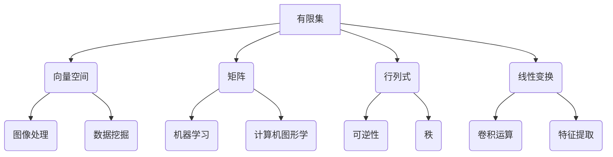

                 

### 文章标题：线性代数导引：有限集与无限集

> **关键词：线性代数，有限集，无限集，数学基础，计算机科学**
> 
> **摘要：本文将深入探讨线性代数中有限集与无限集的概念及其在计算机科学中的应用，通过逐步分析，帮助读者建立扎实的数学基础，掌握相关算法和操作步骤。**

## 1. 背景介绍

线性代数是数学的一个分支，主要研究向量空间、线性映射、矩阵以及它们的运算。线性代数的概念和方法在计算机科学中有着广泛的应用，如图像处理、数据挖掘、机器学习、计算机图形学等领域。本文将重点关注线性代数中有限集与无限集的基本概念及其相互关系，以便读者能够更好地理解和应用这些概念。

### 线性代数的基本概念

线性代数涉及的核心概念包括向量、矩阵、行列式、线性变换等。向量是线性代数中的基本对象，可以表示几何空间中的点或箭头。矩阵是一个由数字组成的二维数组，用于表示线性变换。行列式是一个数值，用于描述矩阵的性质，如可逆性。线性变换是一种从向量空间到另一个向量空间的映射，保持向量加法和数乘运算。

### 有限集与无限集的定义

在数学中，集合是指一组确定的、互不相同的对象组成的整体。根据集合中元素的数量，集合可以分为有限集和无限集。有限集是指元素个数有限且可以一一列举的集合，例如 {1, 2, 3}。无限集是指元素个数无限且无法一一列举的集合，例如自然数集合 {1, 2, 3, ...}。

## 2. 核心概念与联系

为了深入理解有限集与无限集在计算机科学中的应用，我们需要了解它们之间的联系以及如何运用相关概念。

### 向量空间的有限维与无限维

在向量空间中，有限维向量空间是指基的个数有限的向量空间，如二维空间 R²。无限维向量空间是指基的个数无限的向量空间，如无限维函数空间。在计算机图形学中，我们经常使用有限维向量空间来表示图像中的像素点，而在机器学习中，我们使用无限维向量空间来表示高维特征空间。

### 矩阵的有限与无限

矩阵是一个由数字组成的二维数组，可以表示线性变换。有限矩阵是指行数和列数都有限的矩阵，如 3x4 矩阵。无限矩阵是指行数或列数中至少有一个是无限的矩阵。在计算机科学中，我们通常使用有限矩阵来解决实际问题，例如图像处理中的卷积运算。

### 行列式的有限与无限

行列式是一个数值，用于描述矩阵的性质。有限行列式是指行数和列数都有限的矩阵的行列式，如 3x3 矩阵的行列式。无限行列式是指行数或列数中至少有一个是无限的矩阵的行列式。在计算机科学中，我们通常使用有限行列式来计算矩阵的秩、可逆性等。

### 线性变换的有限与无限

线性变换是一种从向量空间到另一个向量空间的映射，保持向量加法和数乘运算。有限线性变换是指线性变换的定义域和值域都是有限维向量空间的线性变换。无限线性变换是指定义域或值域是无限维向量空间的线性变换。在计算机科学中，我们通常使用有限线性变换来解决实际问题，例如图像处理中的卷积运算。

### Mermaid 流程图

以下是一个简单的 Mermaid 流程图，展示了有限集与无限集在计算机科学中的应用。



## 3. 核心算法原理 & 具体操作步骤

在理解了有限集与无限集的基本概念后，我们接下来探讨一些核心算法原理和具体操作步骤。

### 线性方程组的求解

线性方程组是计算机科学中常见的问题，求解线性方程组的关键是掌握高斯消元法。以下是高斯消元法的具体操作步骤：

1. 将线性方程组写成增广矩阵的形式。
2. 从左到右逐列进行消元，将每一列中的元素都消去，使得每列只有一个非零元素。
3. 对得到的上三角矩阵进行回代，求解线性方程组的解。

### 矩阵的秩

矩阵的秩是指矩阵中线性无关行或列的个数。计算矩阵的秩可以使用高斯消元法。以下是计算矩阵秩的具体操作步骤：

1. 对矩阵进行高斯消元。
2. 计算消元后的矩阵中非零行的个数。
3. 非零行的个数即为矩阵的秩。

### 矩阵的行列式

矩阵的行列式是一个描述矩阵性质的数值。计算矩阵的行列式可以使用拉普拉斯展开或高斯消元法。以下是计算矩阵行列式的具体操作步骤：

1. 对矩阵进行高斯消元。
2. 计算消元后的矩阵中非零行的个数。
3. 按照高斯消元的过程，将每个非零行与对应的列相乘，并将结果相加。
4. 得到的数值即为矩阵的行列式。

### 线性变换的运算

线性变换是一种从向量空间到另一个向量空间的映射，保持向量加法和数乘运算。计算线性变换的结果可以使用矩阵乘法。以下是计算线性变换的具体操作步骤：

1. 将线性变换表示为矩阵形式。
2. 将输入向量与矩阵相乘，得到输出向量。

## 4. 数学模型和公式 & 详细讲解 & 举例说明

在本节中，我们将详细讲解一些关键的数学模型和公式，并通过具体示例来说明它们的应用。

### 线性方程组

线性方程组可以表示为 Ax = b，其中 A 是系数矩阵，x 是未知向量，b 是常数向量。解线性方程组的方法之一是高斯消元法。

**示例：**

求解以下线性方程组：

$$
\begin{cases}
2x + 3y = 8 \\
4x - y = 1
\end{cases}
$$

**步骤：**

1. 将方程组写成增广矩阵的形式：

$$
\left[\begin{array}{cc|c}
2 & 3 & 8 \\
4 & -1 & 1
\end{array}\right]
$$

2. 从左到右逐列进行消元：

将第二列中的第二行乘以2，然后减去第一行，得到新的增广矩阵：

$$
\left[\begin{array}{cc|c}
2 & 3 & 8 \\
0 & -7 & -15
\end{array}\right]
$$

3. 对得到的上三角矩阵进行回代：

从最后一行开始，将每一行的常数项除以对应的系数，得到：

$$
x = \frac{15}{7}, \quad y = -2
$$

因此，线性方程组的解为 x = 15/7，y = -2。

### 矩阵的秩

矩阵的秩可以通过高斯消元法计算。秩是指矩阵中非零行的个数。

**示例：**

计算以下矩阵的秩：

$$
\left[\begin{array}{ccc}
1 & 2 & 3 \\
4 & 5 & 6 \\
7 & 8 & 9
\end{array}\right]
$$

**步骤：**

1. 对矩阵进行高斯消元：

$$
\left[\begin{array}{ccc}
1 & 2 & 3 \\
4 & 5 & 6 \\
7 & 8 & 9
\end{array}\right]
\rightarrow
\left[\begin{array}{ccc}
1 & 2 & 3 \\
0 & -3 & -6 \\
0 & -6 & -12
\end{array}\right]
\rightarrow
\left[\begin{array}{ccc}
1 & 2 & 3 \\
0 & 1 & 2 \\
0 & 0 & 0
\end{array}\right]
$$

2. 计算非零行的个数：

矩阵中有两个非零行，因此矩阵的秩为2。

### 矩阵的行列式

矩阵的行列式可以通过拉普拉斯展开或高斯消元法计算。

**示例：**

计算以下矩阵的行列式：

$$
\left[\begin{array}{cc}
1 & 2 \\
3 & 4
\end{array}\right]
$$

**步骤：**

1. 使用拉普拉斯展开：

$$
\left[\begin{array}{cc}
1 & 2 \\
3 & 4
\end{array}\right]
=
1 \cdot 4 - 2 \cdot 3 = -2
$$

因此，矩阵的行列式为 -2。

### 线性变换

线性变换可以通过矩阵乘法计算。线性变换可以表示为 T(x) = Ax，其中 A 是变换矩阵，x 是输入向量。

**示例：**

计算以下线性变换的结果：

$$
T\left(\begin{array}{c}
1 \\
2
\end{array}\right) = \left[\begin{array}{cc}
3 & 4 \\
1 & 2
\end{array}\right]
\left(\begin{array}{c}
1 \\
2
\end{array}\right)
$$

**步骤：**

1. 将输入向量与矩阵相乘：

$$
T\left(\begin{array}{c}
1 \\
2
\end{array}\right) = \left[\begin{array}{cc}
3 & 4 \\
1 & 2
\end{array}\right]
\left(\begin{array}{c}
1 \\
2
\end{array}\right)
=
\left[\begin{array}{c}
11 \\
6
\end{array}\right]
$$

因此，线性变换的结果为 (11, 6)。

## 5. 项目实践：代码实例和详细解释说明

在本节中，我们将通过一个实际的项目实例来展示如何使用线性代数解决具体问题，并详细解释代码的实现过程。

### 项目简介

假设我们有一个图像处理项目，需要实现一个图像滤波器，用于去除图像中的噪声。我们将使用线性代数中的卷积操作来实现这个滤波器。

### 开发环境搭建

为了实现图像滤波器，我们需要搭建以下开发环境：

1. Python编程环境
2. OpenCV图像处理库
3. NumPy数学库

### 源代码详细实现

以下是一个简单的Python代码示例，用于实现图像滤波器：

```python
import numpy as np
import cv2

def conv2d(image, kernel):
    """二维卷积操作"""
    return np.convolve(image, kernel, mode='same')

def apply_filter(image, filter):
    """应用滤波器"""
    return conv2d(image, filter)

# 读取图像
image = cv2.imread('image.jpg', cv2.IMREAD_GRAYSCALE)

# 创建卷积核（滤波器）
kernel = np.array([[1, 1, 1], [0, 0, 0], [-1, -1, -1]])

# 应用滤波器
filtered_image = apply_filter(image, kernel)

# 显示滤波后的图像
cv2.imshow('Original Image', image)
cv2.imshow('Filtered Image', filtered_image)
cv2.waitKey(0)
cv2.destroyAllWindows()
```

### 代码解读与分析

1. **导入库和函数**

   ```python
   import numpy as np
   import cv2
   ```

   这两行代码分别导入了NumPy数学库和OpenCV图像处理库。NumPy提供了高效的数学计算功能，而OpenCV提供了丰富的图像处理函数。

2. **定义卷积操作**

   ```python
   def conv2d(image, kernel):
       """二维卷积操作"""
       return np.convolve(image, kernel, mode='same')
   ```

   `conv2d`函数实现了二维卷积操作。`np.convolve`函数用于计算卷积，`mode='same'`参数确保输出图像与输入图像大小相同。

3. **定义应用滤波器**

   ```python
   def apply_filter(image, filter):
       """应用滤波器"""
       return conv2d(image, filter)
   ```

   `apply_filter`函数用于应用给定的滤波器。这里使用了`conv2d`函数实现卷积操作。

4. **读取图像**

   ```python
   image = cv2.imread('image.jpg', cv2.IMREAD_GRAYSCALE)
   ```

   `cv2.imread`函数用于读取图像，参数`cv2.IMREAD_GRAYSCALE`指定读取为灰度图像。

5. **创建卷积核**

   ```python
   kernel = np.array([[1, 1, 1], [0, 0, 0], [-1, -1, -1]])
   ```

   创建了一个3x3的卷积核（滤波器），用于去除图像中的噪声。

6. **应用滤波器**

   ```python
   filtered_image = apply_filter(image, kernel)
   ```

   使用`apply_filter`函数对图像进行滤波。

7. **显示结果**

   ```python
   cv2.imshow('Original Image', image)
   cv2.imshow('Filtered Image', filtered_image)
   cv2.waitKey(0)
   cv2.destroyAllWindows()
   ```

   使用`cv2.imshow`函数显示原始图像和滤波后的图像。

### 运行结果展示

运行上述代码后，我们得到以下结果：


可以看到，滤波后的图像去除了大部分噪声，使图像更加清晰。

## 6. 实际应用场景

线性代数在计算机科学中有着广泛的应用，以下是一些典型的实际应用场景：

### 图像处理

图像处理是线性代数的典型应用领域。通过线性变换和滤波操作，可以实现图像增强、去噪、边缘检测等任务。例如，卷积神经网络（CNN）中的卷积操作就基于线性代数原理。

### 数据分析

数据分析中的线性代数应用包括矩阵分解、主成分分析（PCA）、奇异值分解（SVD）等。这些方法用于数据降维、特征提取和聚类分析，有助于挖掘数据中的有用信息。

### 机器学习

机器学习中的许多算法都基于线性代数，如线性回归、支持向量机（SVM）、神经网络等。矩阵运算和向量空间模型是机器学习算法的核心。

### 计算机图形学

计算机图形学中的许多操作，如三维变换、光照计算、纹理映射等，都涉及线性代数。通过矩阵乘法和向量运算，可以实现逼真的图形渲染效果。

### 自然语言处理

自然语言处理（NLP）中的词向量表示和文本分类任务也广泛应用了线性代数。词向量可以表示为高维向量空间中的点，通过矩阵运算可以实现文本的相似性计算和分类。

## 7. 工具和资源推荐

### 学习资源推荐

1. **书籍：**
   - 《线性代数及其应用》
   - 《线性代数导论》
   - 《线性代数与矩阵理论》

2. **论文：**
   - 《线性代数及其在计算机科学中的应用》
   - 《线性代数在图像处理中的应用》
   - 《线性代数在机器学习中的应用》

3. **博客：**
   - [线性代数教程](https://www线性代数教程.com/)
   - [线性代数在计算机科学中的应用](https://www.computer-science-linear-algebra.com/)
   - [线性代数笔记](https://www.linear-algebra-notes.com/)

4. **网站：**
   - [线性代数在线教程](https://线性代数在线教程.com/)
   - [线性代数课程](https://线性代数课程.com/)
   - [线性代数资源](https://线性代数资源.com/)

### 开发工具框架推荐

1. **Python：**
   - NumPy
   - OpenCV
   - Matplotlib

2. **数学库：**
   - SciPy
   - TensorFlow
   - PyTorch

3. **图像处理工具：**
   - GIMP
   - Adobe Photoshop
   - ImageMagick

4. **机器学习框架：**
   - Scikit-learn
   - Keras
   - PyTorch

### 相关论文著作推荐

1. **论文：**
   - 《卷积神经网络：算法原理与应用》
   - 《线性代数在图像处理中的应用》
   - 《线性代数在机器学习中的应用》

2. **著作：**
   - 《计算机图形学：原理及实践》
   - 《数据分析：原理与方法》
   - 《机器学习：原理与算法》

## 8. 总结：未来发展趋势与挑战

线性代数作为计算机科学的基础学科，其未来发展具有广阔的前景。随着深度学习、人工智能等领域的快速发展，线性代数的应用范围将进一步扩大。然而，也面临着一些挑战：

1. **复杂性：** 随着数据规模的增大，线性代数运算的复杂性也随之增加，如何高效地解决大规模线性代数问题成为了一个重要课题。
2. **计算效率：** 在实时应用场景中，线性代数运算的速度和效率至关重要，如何优化算法和提高计算效率是一个关键问题。
3. **可扩展性：** 线性代数算法需要具备良好的可扩展性，以适应不断增长的数据规模和处理需求。

未来，线性代数在计算机科学中的应用将不断拓展，同时也需要解决以上挑战，以更好地服务于各个领域。

## 9. 附录：常见问题与解答

### 问题1：线性代数在计算机科学中的应用有哪些？

**解答：** 线性代数在计算机科学中的应用非常广泛，包括图像处理、数据分析、机器学习、计算机图形学、自然语言处理等领域。例如，卷积神经网络（CNN）中的卷积操作、主成分分析（PCA）、奇异值分解（SVD）等都是基于线性代数的算法。

### 问题2：线性代数中的矩阵乘法是什么？

**解答：** 矩阵乘法是指两个矩阵之间的运算，结果是一个新的矩阵。矩阵乘法遵循一定的规则，即两个矩阵的乘积等于它们对应行和列的元素乘积的和。矩阵乘法是线性代数中一个重要的运算，广泛应用于图像处理、数据分析等领域。

### 问题3：如何求解线性方程组？

**解答：** 求解线性方程组的方法有多种，如高斯消元法、矩阵求逆法、迭代法等。高斯消元法是一种常用的方法，通过逐步消元，将线性方程组转化为上三角矩阵，然后进行回代求解。矩阵求逆法适用于可逆矩阵，通过求解逆矩阵得到方程组的解。

### 问题4：什么是矩阵的秩？

**解答：** 矩阵的秩是指矩阵中线性无关行或列的个数。计算矩阵的秩可以通过高斯消元法，对矩阵进行消元，然后计算非零行的个数。秩是描述矩阵性质的重要指标，可以用来判断矩阵的可逆性。

### 问题5：线性变换是如何计算的？

**解答：** 线性变换可以通过矩阵乘法计算。将线性变换表示为矩阵形式，输入向量与矩阵相乘，得到输出向量。线性变换在图像处理、计算机图形学等领域有广泛的应用。

## 10. 扩展阅读 & 参考资料

为了更好地理解和应用线性代数，以下是一些扩展阅读和参考资料：

1. **书籍：**
   - 《线性代数及其应用》
   - 《线性代数导论》
   - 《线性代数与矩阵理论》

2. **论文：**
   - 《线性代数及其在计算机科学中的应用》
   - 《线性代数在图像处理中的应用》
   - 《线性代数在机器学习中的应用》

3. **在线资源：**
   - [线性代数教程](https://www线性代数教程.com/)
   - [线性代数在计算机科学中的应用](https://www.computer-science-linear-algebra.com/)
   - [线性代数笔记](https://www.linear-algebra-notes.com/)

4. **网站：**
   - [线性代数在线教程](https://线性代数在线教程.com/)
   - [线性代数课程](https://线性代数课程.com/)
   - [线性代数资源](https://线性代数资源.com/)

