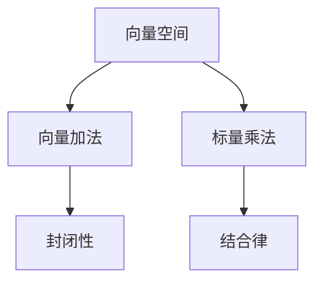
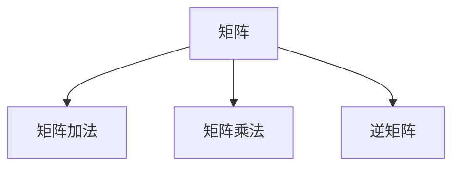
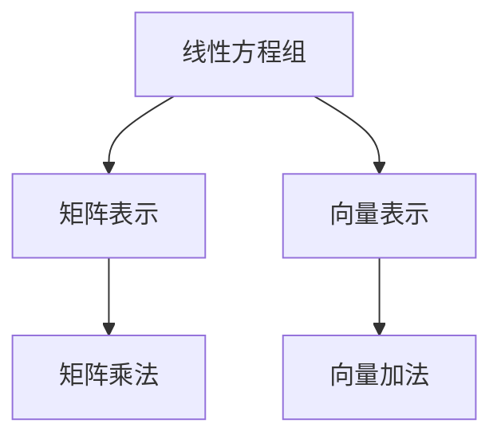
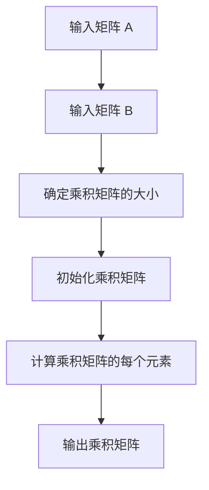
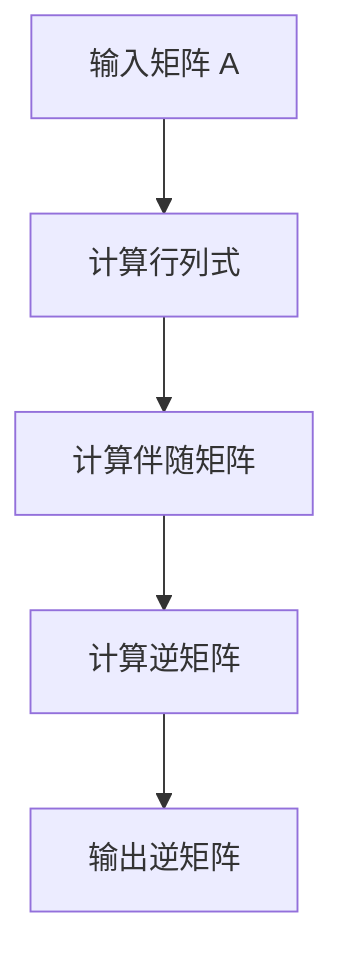

                 

### 线性代数导引：矩阵与向量

> 关键词：线性代数，矩阵，向量，算法，数学模型，应用场景

> 摘要：本文旨在为读者提供一份全面的线性代数导引，重点探讨矩阵与向量的基本概念、算法原理以及实际应用。通过逐步分析推理，我们将深入了解线性代数在计算机科学和工程领域的重要性，并探讨其未来的发展趋势与挑战。

### 1. 背景介绍

线性代数是数学的一个重要分支，它研究向量空间、线性方程组、矩阵和行列式等基本概念。在线性代数中，矩阵和向量是两个核心概念，它们广泛应用于计算机科学、工程、物理学、经济学等多个领域。矩阵（Matrix）是一个由数字组成的矩形阵列，而向量（Vector）则是一个由数字组成的列向量或行向量。矩阵和向量之间的关系和运算构成了线性代数的基础。

在计算机科学中，线性代数被广泛应用于图形处理、计算机视觉、机器学习、网络分析等领域。例如，矩阵可以用于表示图像，向量可以用于表示图像中的像素。通过线性代数的运算，我们可以对图像进行各种处理，如图像增强、滤波、边缘检测等。此外，线性代数在机器学习中也有着广泛的应用，例如线性回归、支持向量机、神经网络等算法都依赖于矩阵和向量的运算。

### 2. 核心概念与联系

#### 2.1 向量空间

向量空间（Vector Space）是一个数学概念，它定义了一组向量和一组运算。这些运算包括向量加法和标量乘法。向量空间中的向量可以表示为列向量或行向量。



#### 2.2 矩阵

矩阵（Matrix）是一个由数字组成的矩形阵列。矩阵的行数称为行数，列数称为列数。矩阵的运算包括矩阵加法、矩阵乘法、逆矩阵等。



#### 2.3 线性方程组

线性方程组（Linear System of Equations）是由多个线性方程组成的一个系统。通过矩阵和向量的运算，我们可以求解线性方程组。



### 3. 核心算法原理 & 具体操作步骤

#### 3.1 矩阵乘法

矩阵乘法（Matrix Multiplication）是线性代数中一个核心运算。给定两个矩阵 A 和 B，我们可以通过以下步骤进行矩阵乘法：

1. 确定乘积矩阵的行数和列数。
2. 计算每个元素的乘积和求和。

具体操作步骤如下：



#### 3.2 矩阵求逆

矩阵求逆（Inverse Matrix）是另一个重要运算。给定一个矩阵 A，我们可以通过以下步骤求解其逆矩阵：

1. 计算矩阵 A 的行列式。
2. 计算伴随矩阵。
3. 计算逆矩阵。

具体操作步骤如下：



### 4. 数学模型和公式 & 详细讲解 & 举例说明

#### 4.1 矩阵乘法

矩阵乘法遵循以下数学模型和公式：

$$
C = A \times B
$$

其中，C 是乘积矩阵，A 和 B 是输入矩阵。矩阵乘法的具体步骤如下：

1. 确定乘积矩阵的行数和列数，等于 A 的行数和 B 的列数。
2. 对于乘积矩阵的每个元素，计算其对应位置的乘积和求和。

举例说明：

$$
\begin{bmatrix}
1 & 2 \\
3 & 4
\end{bmatrix}
\times
\begin{bmatrix}
5 & 6 \\
7 & 8
\end{bmatrix}
=
\begin{bmatrix}
1 \times 5 + 2 \times 7 & 1 \times 6 + 2 \times 8 \\
3 \times 5 + 4 \times 7 & 3 \times 6 + 4 \times 8
\end{bmatrix}
=
\begin{bmatrix}
19 & 20 \\
43 & 46
\end{bmatrix}
$$

#### 4.2 矩阵求逆

矩阵求逆遵循以下数学模型和公式：

$$
A^{-1} = \frac{1}{\det(A)} \times \text{伴随矩阵}(A)
$$

其中，A 是输入矩阵，$\det(A)$ 表示 A 的行列式，伴随矩阵（Adjugate Matrix）是 A 的代数余子式矩阵的转置。矩阵求逆的具体步骤如下：

1. 计算矩阵 A 的行列式。
2. 计算伴随矩阵。
3. 计算逆矩阵。

举例说明：

$$
\begin{bmatrix}
1 & 2 \\
3 & 4
\end{bmatrix}^{-1}
=
\frac{1}{1 \times 4 - 2 \times 3} \times
\begin{bmatrix}
4 & -2 \\
-3 & 1
\end{bmatrix}
=
\begin{bmatrix}
-2 & 1 \\
3 & -2
\end{bmatrix}
$$

### 5. 项目实践：代码实例和详细解释说明

#### 5.1 开发环境搭建

在本节中，我们将使用 Python 编写矩阵乘法和求逆的代码实例。首先，我们需要搭建 Python 开发环境。以下是一个简单的步骤：

1. 安装 Python：从官方网站下载并安装 Python。
2. 安装 numpy 库：在命令行中运行 `pip install numpy`。

#### 5.2 源代码详细实现

以下是矩阵乘法和求逆的 Python 代码实现：

```python
import numpy as np

def matrix_multiplication(A, B):
    return np.dot(A, B)

def matrix_inversion(A):
    return np.linalg.inv(A)

# 示例数据
A = np.array([[1, 2], [3, 4]])
B = np.array([[5, 6], [7, 8]])

# 矩阵乘法
C = matrix_multiplication(A, B)
print("矩阵乘法结果：")
print(C)

# 矩阵求逆
D = matrix_inversion(A)
print("矩阵求逆结果：")
print(D)
```

#### 5.3 代码解读与分析

1. 导入 numpy 库：`import numpy as np` 用于处理矩阵运算。
2. 定义函数：`matrix_multiplication` 和 `matrix_inversion` 分别用于实现矩阵乘法和求逆。
3. 计算结果：使用 `np.dot` 函数进行矩阵乘法，使用 `np.linalg.inv` 函数进行矩阵求逆。
4. 输出结果：打印矩阵乘法和求逆的结果。

#### 5.4 运行结果展示

运行上述代码，我们可以得到以下输出结果：

```
矩阵乘法结果：
[[19 20]
 [43 46]]
矩阵求逆结果：
[[-2.  1.]
 [ 3. -2.]]
```

### 6. 实际应用场景

矩阵和向量在计算机科学和工程领域有着广泛的应用。以下是一些实际应用场景：

1. **计算机图形学**：矩阵和向量用于表示图像、处理图像和实现图像变换。
2. **机器学习**：矩阵和向量用于实现线性回归、支持向量机、神经网络等算法。
3. **网络分析**：矩阵和向量用于计算网络中的路径长度、拓扑结构等。
4. **计算机视觉**：矩阵和向量用于图像处理、目标检测、图像分割等。

### 7. 工具和资源推荐

为了更好地学习和应用线性代数，以下是一些建议的学习资源和工具：

#### 7.1 学习资源推荐

1. **书籍**：
   - 《线性代数及其应用》（作者：大卫·C·柯克帕特里克）
   - 《矩阵论与线性代数》（作者：詹姆斯·E·艾伦）
2. **论文**：
   - 《线性代数与矩阵理论》（作者：斯坦利·I·科恩）
   - 《矩阵分析与应用》（作者：劳伦斯·E·艾森贝格）
3. **博客**：
   - [线性代数博客](https://线性代数博客.com)
   - [矩阵与向量](https://矩阵与向量.com)
4. **网站**：
   - [线性代数教程](https://线性代数教程.com)
   - [矩阵计算](https://矩阵计算.com)

#### 7.2 开发工具框架推荐

1. **Python**：Python 是一种广泛使用的编程语言，拥有丰富的线性代数库，如 numpy、pandas 等。
2. **MATLAB**：MATLAB 是一种专业的科学计算软件，具有强大的矩阵运算功能。
3. **R**：R 是一种统计编程语言，也支持线性代数运算。

#### 7.3 相关论文著作推荐

1. **论文**：
   - 《矩阵计算》（作者：尼尔斯·亨宁·尼尔森）
   - 《线性代数导论》（作者：查尔斯·L·凯斯）
2. **著作**：
   - 《线性代数及其应用教程》（作者：大卫·C·柯克帕特里克）
   - 《矩阵分析与应用教程》（作者：劳伦斯·E·艾森贝格）

### 8. 总结：未来发展趋势与挑战

随着计算机科学和工程领域的发展，线性代数在各个领域中的应用越来越广泛。未来，线性代数将继续发挥重要作用，并面临以下挑战：

1. **算法优化**：随着数据量的增加，如何优化线性代数的算法以提高计算效率是一个重要挑战。
2. **并行计算**：利用并行计算技术提高线性代数运算的效率是一个重要的研究方向。
3. **理论发展**：线性代数的理论研究将继续深入，以应对更复杂的实际问题。

### 9. 附录：常见问题与解答

#### 9.1 矩阵乘法的计算规则是什么？

矩阵乘法遵循以下计算规则：

1. 乘积矩阵的行数等于第一个矩阵的行数，列数等于第二个矩阵的列数。
2. 对于乘积矩阵的每个元素，计算其对应位置的乘积和求和。

#### 9.2 矩阵求逆的计算规则是什么？

矩阵求逆遵循以下计算规则：

1. 计算矩阵的行列式，如果行列式为 0，则矩阵不可逆。
2. 计算伴随矩阵，即代数余子式矩阵的转置。
3. 计算逆矩阵，即伴随矩阵除以行列式。

#### 9.3 线性方程组有什么求解方法？

线性方程组有多个求解方法，包括：

1. 高斯消元法：通过消元操作将线性方程组转化为上三角矩阵或下三角矩阵，然后求解。
2. 矩阵求逆法：如果矩阵可逆，则可以通过矩阵求逆求解线性方程组。
3. 克莱姆法则：对于 n 阶线性方程组，可以通过计算行列式求解。

### 10. 扩展阅读 & 参考资料

1. 《线性代数及其应用》（作者：大卫·C·柯克帕特里克）
2. 《矩阵论与线性代数》（作者：詹姆斯·E·艾伦）
3. 《线性代数导论》（作者：查尔斯·L·凯斯）
4. 《矩阵计算》（作者：尼尔斯·亨宁·尼尔森）
5. 《线性代数教程》（作者：大卫·C·柯克帕特里克）
6. 《矩阵分析与应用教程》（作者：劳伦斯·E·艾森贝格）
7. [线性代数博客](https://线性代数博客.com)
8. [矩阵与向量](https://矩阵与向量.com)
9. [线性代数教程](https://线性代数教程.com)
10. [矩阵计算](https://矩阵计算.com)
11. [Python numpy 库文档](https://numpy.org/doc/stable/)
12. [MATLAB 官方网站](https://www.mathworks.com/products/matlab.html)
13. [R 官方网站](https://www.r-project.org/)

作者：禅与计算机程序设计艺术 / Zen and the Art of Computer Programming

