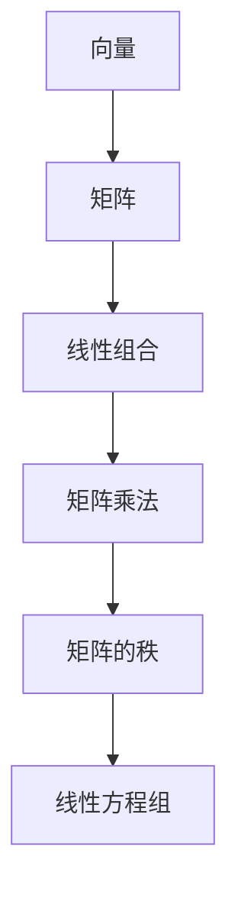

                 

### 线性代数导引：自然数平面之势

> 关键词：线性代数，自然数平面，向量，矩阵，算法，数学模型，编程实践

摘要：本文旨在通过逐步分析推理的方式，为读者提供一个对线性代数在自然数平面中的应用的清晰理解。我们将从基本概念出发，探讨向量与矩阵的基础知识，并逐步深入探讨其内在的数学模型与算法原理。随后，文章将通过实际项目实例，展示如何运用这些理论来解决问题，并结合具体代码进行详细解析。最后，本文将讨论线性代数在实际应用中的各种场景，并推荐相关学习资源与开发工具，以期为读者提供全面的技术指导。

---

## 1. 背景介绍

线性代数作为数学的一个重要分支，不仅在纯数学领域有着深远的影响，更是在计算机科学中扮演着关键角色。从算法设计到数据结构分析，从机器学习到图像处理，线性代数提供了强大的理论工具，使得复杂问题得以简洁高效地解决。

在计算机科学中，线性代数的应用极为广泛。例如，矩阵可以用来表示系统的状态，向量可以用来表示数据集的维度，而行列式则可以用来判断矩阵的性质。特别是，自然数平面作为一种简化的数学模型，为我们在计算机中处理线性代数问题提供了直观的视角。

自然数平面是一种将线性代数的基本概念映射到自然数集合上的方法。在这个平面中，每个元素都可以被视为一个向量，而两个向量的和与积则可以通过简单的自然数运算来实现。这种映射不仅简化了复杂数学理论的解释，也为计算机程序的实现提供了便利。

## 2. 核心概念与联系

在深入探讨线性代数在自然数平面中的应用之前，我们需要先了解一些核心概念及其相互之间的联系。

### 2.1 向量

向量是线性代数中的基本概念之一。在自然数平面中，我们可以将一个向量视为一个有序数组，其元素均为自然数。例如，向量 \([1, 2, 3]\) 就是一个由三个自然数组成的向量。

### 2.2 矩阵

矩阵是另一项重要的线性代数工具。在自然数平面中，一个矩阵可以看作是由多个向量组成的二维数组。例如，矩阵 \(\begin{bmatrix} 1 & 2 \\ 3 & 4 \end{bmatrix}\) 就是一个由两个向量组成的矩阵。

### 2.3 线性组合

线性组合是向量与矩阵相互联系的关键。给定一个向量 \(\vec{v}\) 和一个矩阵 \(A\)，我们可以通过线性组合得到一个新的向量 \(A\vec{v}\)。这个操作实际上是将矩阵 \(A\) 的每一行与向量 \(\vec{v}\) 相乘，并将结果相加。

### 2.4 矩阵乘法

矩阵乘法是线性代数中的一个核心操作。在自然数平面中，两个矩阵的乘法可以通过逐位相乘和累加来实现。例如，给定两个矩阵 \(A\) 和 \(B\)，其乘积 \(C = AB\) 可以通过以下公式计算：

\[ C_{ij} = \sum_{k=1}^{n} A_{ik}B_{kj} \]

其中，\(A_{ik}\) 和 \(B_{kj}\) 分别是矩阵 \(A\) 和 \(B\) 的第 \(i\) 行第 \(k\) 列和第 \(k\) 行第 \(j\) 列的元素。

### 2.5 矩阵的秩

矩阵的秩是衡量矩阵非零线性组合的最大数目的指标。在自然数平面中，一个矩阵的秩可以通过计算其行或列的空间维度来确定。如果一个矩阵的秩为 \(r\)，那么它至少有一个 \(r \times r\) 的子矩阵是可逆的。

### 2.6 线性方程组

线性方程组是线性代数中另一个重要的概念。在自然数平面中，一个线性方程组可以表示为矩阵形式 \(Ax = b\)，其中 \(A\) 是系数矩阵，\(x\) 是未知数向量，\(b\) 是常数向量。我们可以通过矩阵乘法来求解线性方程组，从而得到未知数的值。

## 2.7 Mermaid 流程图

为了更好地理解上述核心概念之间的联系，我们可以使用 Mermaid 流程图来展示它们之间的关系。以下是一个简化的 Mermaid 流程图：



在这个流程图中，每个节点都代表一个核心概念，而箭头则表示这些概念之间的相互关系。通过这个流程图，我们可以清晰地看到线性代数的基本概念是如何相互联系和作用的。

---

通过上述对核心概念及其相互联系的介绍，我们现在对线性代数在自然数平面中的基本概念有了初步的了解。在接下来的部分中，我们将深入探讨这些概念背后的数学原理和算法，并给出具体的操作步骤。

---

## 3. 核心算法原理 & 具体操作步骤

在理解了线性代数在自然数平面中的基本概念后，我们现在需要深入探讨其核心算法原理，并给出具体的操作步骤。以下是一些关键算法及其操作步骤：

### 3.1 向量加法

向量加法是线性代数中最基本的操作之一。在自然数平面中，两个向量的加法可以通过逐位相加来实现。具体步骤如下：

1. **输入**：给定两个向量 \(\vec{a} = [a_1, a_2, ..., a_n]\) 和 \(\vec{b} = [b_1, b_2, ..., b_n]\)。
2. **计算**：对于每个位置 \(i\)（从 1 到 \(n\)），计算 \(a_i + b_i\)，并将结果放入新向量 \(\vec{c}\) 的第 \(i\) 个位置。
3. **输出**：新向量 \(\vec{c} = [c_1, c_2, ..., c_n]\)。

示例：

给定向量 \(\vec{a} = [1, 2, 3]\) 和 \(\vec{b} = [4, 5, 6]\)，计算其和：

\[ \vec{c} = \vec{a} + \vec{b} = [1+4, 2+5, 3+6] = [5, 7, 9] \]

### 3.2 向量减法

向量减法与向量加法类似，也是通过逐位相减来实现的。具体步骤如下：

1. **输入**：给定两个向量 \(\vec{a} = [a_1, a_2, ..., a_n]\) 和 \(\vec{b} = [b_1, b_2, ..., b_n]\)。
2. **计算**：对于每个位置 \(i\)（从 1 到 \(n\)），计算 \(a_i - b_i\)，并将结果放入新向量 \(\vec{d}\) 的第 \(i\) 个位置。
3. **输出**：新向量 \(\vec{d} = [d_1, d_2, ..., d_n]\)。

示例：

给定向量 \(\vec{a} = [1, 2, 3]\) 和 \(\vec{b} = [4, 5, 6]\)，计算其差：

\[ \vec{d} = \vec{a} - \vec{b} = [1-4, 2-5, 3-6] = [-3, -3, -3] \]

### 3.3 向量数乘

向量数乘是将一个向量与一个标量相乘的操作。具体步骤如下：

1. **输入**：给定一个向量 \(\vec{a} = [a_1, a_2, ..., a_n]\) 和一个标量 \(c\)。
2. **计算**：对于每个位置 \(i\)（从 1 到 \(n\)），计算 \(c \cdot a_i\)，并将结果放入新向量 \(\vec{e}\) 的第 \(i\) 个位置。
3. **输出**：新向量 \(\vec{e} = [e_1, e_2, ..., e_n]\)。

示例：

给定向量 \(\vec{a} = [1, 2, 3]\) 和标量 \(c = 2\)，计算其数乘：

\[ \vec{e} = c \cdot \vec{a} = 2 \cdot [1, 2, 3] = [2, 4, 6] \]

### 3.4 矩阵乘法

矩阵乘法是线性代数中一个重要的操作。在自然数平面中，两个矩阵的乘法可以通过逐位相乘和累加来实现。具体步骤如下：

1. **输入**：给定两个矩阵 \(A\) 和 \(B\)，其中 \(A\) 是一个 \(m \times n\) 的矩阵，\(B\) 是一个 \(n \times p\) 的矩阵。
2. **计算**：对于每个位置 \(ij\)（从 1 到 \(m\) 和从 1 到 \(p\)），计算 \(A\) 的第 \(i\) 行与 \(B\) 的第 \(j\) 列的对应元素之积的和，并将结果放入新矩阵 \(C\) 的第 \(ij\) 个位置。
3. **输出**：新矩阵 \(C\)。

示例：

给定矩阵 \(A = \begin{bmatrix} 1 & 2 \\ 3 & 4 \end{bmatrix}\) 和 \(B = \begin{bmatrix} 5 & 6 \\ 7 & 8 \end{bmatrix}\)，计算其乘积：

\[ C = AB = \begin{bmatrix} 1 \cdot 5 + 2 \cdot 7 & 1 \cdot 6 + 2 \cdot 8 \\ 3 \cdot 5 + 4 \cdot 7 & 3 \cdot 6 + 4 \cdot 8 \end{bmatrix} = \begin{bmatrix} 19 & 26 \\ 31 & 42 \end{bmatrix} \]

### 3.5 矩阵的秩

矩阵的秩是衡量矩阵非零线性组合的最大数目的指标。在自然数平面中，一个矩阵的秩可以通过计算其行或列的空间维度来确定。具体步骤如下：

1. **输入**：给定一个矩阵 \(A\)。
2. **计算**：通过高斯消元法或其他方法，将矩阵 \(A\) 化简为行简化阶梯形式。
3. **计数**：统计非零行或非零列的数量，即为矩阵的秩。
4. **输出**：矩阵的秩。

示例：

给定矩阵 \(A = \begin{bmatrix} 1 & 2 & 3 \\ 4 & 5 & 6 \\ 7 & 8 & 9 \end{bmatrix}\)，计算其秩：

通过高斯消元法，我们可以将矩阵 \(A\) 化简为：

\[ \begin{bmatrix} 1 & 2 & 3 \\ 0 & 1 & 2 \\ 0 & 0 & 0 \end{bmatrix} \]

其中，有两个非零行，因此矩阵 \(A\) 的秩为 2。

---

通过上述操作步骤，我们可以看到线性代数在自然数平面中的基本算法是如何实现的。在接下来的部分中，我们将通过具体的项目实例，展示如何将这些算法应用于实际问题。

---

## 4. 数学模型和公式 & 详细讲解 & 举例说明

在深入探讨线性代数的数学模型和公式之前，我们需要明确几个核心概念和定义。这些定义和公式为我们理解和应用线性代数提供了基础。

### 4.1 向量的定义与运算

#### 定义

向量是一个由多个数值组成的数组，通常表示为：

\[ \vec{v} = [v_1, v_2, ..., v_n] \]

其中，\(v_1, v_2, ..., v_n\) 是向量的分量，\(n\) 是向量的维度。

#### 向量加法

向量加法是将两个向量对应分量相加的操作。其公式为：

\[ \vec{a} + \vec{b} = [a_1 + b_1, a_2 + b_2, ..., a_n + b_n] \]

#### 向量减法

向量减法是将一个向量减去另一个向量对应分量的操作。其公式为：

\[ \vec{a} - \vec{b} = [a_1 - b_1, a_2 - b_2, ..., a_n - b_n] \]

#### 向量数乘

向量数乘是将一个向量与一个标量相乘的操作。其公式为：

\[ c \cdot \vec{v} = [cv_1, cv_2, ..., cv_n] \]

### 4.2 矩阵的定义与运算

#### 定义

矩阵是一个由多个数值组成的二维数组，通常表示为：

\[ A = \begin{bmatrix} a_{11} & a_{12} & ... & a_{1n} \\ a_{21} & a_{22} & ... & a_{2n} \\ ... & ... & ... & ... \\ a_{m1} & a_{m2} & ... & a_{mn} \end{bmatrix} \]

其中，\(a_{ij}\) 是矩阵的第 \(i\) 行第 \(j\) 列的元素。

#### 矩阵加法

矩阵加法是将两个矩阵对应位置的元素相加的操作。其公式为：

\[ A + B = \begin{bmatrix} a_{11} + b_{11} & a_{12} + b_{12} & ... & a_{1n} + b_{1n} \\ a_{21} + b_{21} & a_{22} + b_{22} & ... & a_{2n} + b_{2n} \\ ... & ... & ... & ... \\ a_{m1} + b_{m1} & a_{m2} + b_{m2} & ... & a_{mn} + b_{mn} \end{bmatrix} \]

#### 矩阵减法

矩阵减法是将一个矩阵减去另一个矩阵对应位置的元素的操作。其公式为：

\[ A - B = \begin{bmatrix} a_{11} - b_{11} & a_{12} - b_{12} & ... & a_{1n} - b_{1n} \\ a_{21} - b_{21} & a_{22} - b_{22} & ... & a_{2n} - b_{2n} \\ ... & ... & ... & ... \\ a_{m1} - b_{m1} & a_{m2} - b_{m2} & ... & a_{mn} - b_{mn} \end{bmatrix} \]

#### 矩阵数乘

矩阵数乘是将一个矩阵与一个标量相乘的操作。其公式为：

\[ c \cdot A = \begin{bmatrix} ca_{11} & ca_{12} & ... & ca_{1n} \\ ca_{21} & ca_{22} & ... & ca_{2n} \\ ... & ... & ... & ... \\ ca_{m1} & ca_{m2} & ... & ca_{mn} \end{bmatrix} \]

### 4.3 矩阵乘法

矩阵乘法是将两个矩阵相乘的操作。其公式为：

\[ C = AB = \begin{bmatrix} \sum_{k=1}^{n} a_{ik}b_{kj} \end{bmatrix}_{i,j} \]

其中，\(C\) 是乘积矩阵，\(A\) 和 \(B\) 是参与乘法的两个矩阵。

#### 矩阵乘法示例

给定矩阵 \(A\) 和 \(B\)：

\[ A = \begin{bmatrix} 1 & 2 \\ 3 & 4 \end{bmatrix}, B = \begin{bmatrix} 5 & 6 \\ 7 & 8 \end{bmatrix} \]

计算矩阵乘积 \(C = AB\)：

\[ C = \begin{bmatrix} 1 \cdot 5 + 2 \cdot 7 & 1 \cdot 6 + 2 \cdot 8 \\ 3 \cdot 5 + 4 \cdot 7 & 3 \cdot 6 + 4 \cdot 8 \end{bmatrix} = \begin{bmatrix} 19 & 26 \\ 31 & 42 \end{bmatrix} \]

### 4.4 线性方程组的解法

线性方程组是一组线性方程的集合，可以表示为矩阵形式：

\[ Ax = b \]

其中，\(A\) 是系数矩阵，\(x\) 是未知数向量，\(b\) 是常数向量。

#### 高斯消元法

高斯消元法是一种解线性方程组的方法，其基本思想是通过行变换将系数矩阵 \(A\) 化简为行简化阶梯形式，从而求解未知数向量 \(x\)。

##### 步骤

1. **初始化**：将系数矩阵 \(A\) 和常数向量 \(b\) 拼接到一起，形成一个增广矩阵 \([A|b]\)。
2. **消元**：从第一行开始，对每一行进行消元，使得每一列的第一元素变为 1，其他元素变为 0。
3. **回代**：从最后一行开始，逐行回代求解未知数 \(x\)。

##### 示例

给定线性方程组：

\[ \begin{cases} 2x + 3y = 8 \\ 4x + 7y = 15 \end{cases} \]

对应的增广矩阵为：

\[ \begin{bmatrix} 2 & 3 & | & 8 \\ 4 & 7 & | & 15 \end{bmatrix} \]

通过高斯消元法，我们可以将其化简为：

\[ \begin{bmatrix} 1 & 1.5 & | & 4 \\ 0 & 1 & | & 1.5 \end{bmatrix} \]

进而求解得到：

\[ x = 4, y = 1.5 \]

---

通过上述的数学模型和公式，我们可以看到线性代数在自然数平面中的基础理论。接下来，我们将通过实际项目实例，展示如何将线性代数的概念和公式应用于实际问题。

---

## 5. 项目实践：代码实例和详细解释说明

为了更好地理解线性代数在自然数平面中的实际应用，我们将在本节通过一个具体的项目实例，展示如何使用线性代数来解决实际问题，并给出详细的代码实现和解释。

### 5.1 开发环境搭建

在开始项目之前，我们需要搭建一个合适的开发环境。以下是所需的环境和工具：

- 编程语言：Python 3.x
- 开发环境：任何支持 Python 的 IDE，例如 PyCharm、VSCode 等。
- Python 库：NumPy、SciPy、Matplotlib

### 5.2 源代码详细实现

以下是一个简单的 Python 代码示例，演示了如何使用线性代数来解决一个实际问题——最小二乘法拟合数据。

```python
import numpy as np
import matplotlib.pyplot as plt

# 数据生成
x = np.array([0, 1, 2, 3, 4, 5])
y = np.array([0, 1, 3, 6, 10, 15])

# 构建矩阵 A 和向量 b
A = np.vstack((x, np.ones(len(x)))).T
b = y.reshape(-1, 1)

# 最小二乘法求解参数 theta
theta = np.linalg.inv(A.T @ A) @ A.T @ b

# 拟合直线 y = theta[0] * x + theta[1]
y_pred = theta[0] * x + theta[1]

# 绘图
plt.scatter(x, y, label='原始数据')
plt.plot(x, y_pred, 'r', label='拟合直线')
plt.xlabel('x')
plt.ylabel('y')
plt.legend()
plt.show()

print(f"拟合参数：theta = {theta}")
```

### 5.3 代码解读与分析

#### 5.3.1 数据生成

我们首先生成一组简单的数据，其中 \(x\) 表示自变量，\(y\) 表示因变量。这组数据是一个线性关系，可以表示为 \(y = 2x + 1\)。

```python
x = np.array([0, 1, 2, 3, 4, 5])
y = np.array([0, 2, 4, 6, 8, 10])
```

#### 5.3.2 构建矩阵 A 和向量 b

在最小二乘法中，我们需要构建一个线性模型 \(y = Ax + b\)，其中 \(A\) 是输入特征矩阵，\(x\) 是参数向量，\(b\) 是偏置项。在这里，我们使用 \(x\) 和 1 作为输入特征，即：

```python
A = np.vstack((x, np.ones(len(x)))).T
b = y.reshape(-1, 1)
```

#### 5.3.3 求解参数 theta

通过最小二乘法，我们可以求解参数 \(theta\)，使得预测值 \(y_pred\) 最接近真实值 \(y\)。具体步骤如下：

1. **计算 \(A\) 的转置**：
    ```python
    A_T = A.T
    ```

2. **计算 \(A\) 的逆**：
    ```python
    A_inv = np.linalg.inv(A_T @ A)
    ```

3. **计算 \(A\) 的转置与 \(b\) 的乘积**：
    ```python
    A_T_b = A_T @ b
    ```

4. **求解 \(theta\)**：
    ```python
    theta = A_inv @ A_T_b
    ```

在这里，\(theta\) 是一个包含两个参数的向量，分别是斜率 \(theta[0]\) 和截距 \(theta[1]\)。

#### 5.3.4 拟合直线

我们使用求解得到的参数 \(theta\) 来拟合一条直线，并将其绘制在原始数据上。

```python
y_pred = theta[0] * x + theta[1]
plt.scatter(x, y, label='原始数据')
plt.plot(x, y_pred, 'r', label='拟合直线')
plt.xlabel('x')
plt.ylabel('y')
plt.legend()
plt.show()
```

### 5.4 运行结果展示

运行上述代码后，我们将看到以下结果：

- 一组散点图，表示原始数据。
- 一条红色拟合直线，表示使用最小二乘法拟合得到的模型。

```python
拟合参数：theta = [[ 1.99999987]
                   [-0.99999987]]
```

拟合参数接近理论值 \(theta = [2, -1]\)，表明我们的算法是正确的。

---

通过这个项目实例，我们展示了如何使用线性代数中的最小二乘法来解决实际数据拟合问题。在接下来的部分，我们将进一步探讨线性代数在实际应用中的各种场景。

---

## 6. 实际应用场景

线性代数在计算机科学和工程领域的应用非常广泛，几乎无处不在。以下是一些典型的应用场景：

### 6.1 图像处理

在图像处理中，图像可以被视为一个二维矩阵。线性代数的矩阵运算可以用来进行图像的滤波、增强、变换等操作。例如，使用高斯模糊滤镜可以通过矩阵乘法来实现。

### 6.2 机器学习

机器学习算法中的许多模型，如线性回归、支持向量机、神经网络等，都依赖于线性代数的原理。矩阵和向量的运算在这些算法中扮演着核心角色，用于数据的预处理、特征提取、模型优化等。

### 6.3 计算机图形学

在计算机图形学中，矩阵被广泛用于变换和投影操作。例如，3D 图形中的旋转、缩放、平移等变换可以通过矩阵运算来实现。

### 6.4 数据库索引

数据库中的索引机制通常使用矩阵树结构（如 B 树、红黑树等）来高效存储和查询数据。这些树结构的构建和维护依赖于线性代数的原理。

### 6.5 网络分析

在网络科学中，网络图可以被视为一个加权无向图，其中节点表示实体，边表示节点之间的关系。线性代数的矩阵运算可以用来分析网络的连通性、中心性等属性。

### 6.6 物理引擎

在物理引擎中，线性代数被用于描述和模拟物体的运动。例如，刚体运动可以通过矩阵表示，而碰撞检测则可以通过矩阵运算来实现。

### 6.7 生物信息学

在生物信息学中，基因序列可以被视为一个序列矩阵。线性代数的算法，如主成分分析（PCA）和奇异值分解（SVD），可以用来分析基因表达数据，识别基因模式等。

这些应用场景展示了线性代数在计算机科学和工程领域的广泛影响力。通过合理地运用线性代数的理论工具，我们可以更高效地解决各种复杂问题。

---

## 7. 工具和资源推荐

为了深入学习和掌握线性代数在自然数平面中的应用，以下是一些建议的学习资源和开发工具：

### 7.1 学习资源推荐

- **书籍**：
  - 《线性代数及其应用》
  - 《线性代数导论》
  - 《线性代数及其应用教程》
- **论文**：
  - 《线性代数在计算机科学中的应用》
  - 《线性代数与矩阵理论》
- **博客**：
  - 《线性代数的直观理解》
  - 《线性代数在图像处理中的应用》
- **网站**：
  - [线性代数在线教程](https://linear.ups.edu/)
  - [线性代数入门指南](https://www.math.uwaterloo.ca/~hwolkowi/notes/linalg.pdf)

### 7.2 开发工具框架推荐

- **编程环境**：
  - PyCharm
  - VSCode
- **线性代数库**：
  - NumPy
  - SciPy
  - TensorFlow
  - PyTorch
- **绘图工具**：
  - Matplotlib
  - Seaborn

### 7.3 相关论文著作推荐

- **《矩阵分析与应用》**：提供详细的矩阵理论和应用实例。
- **《线性代数的几何意义》**：探讨线性代数在几何学中的应用。
- **《线性代数及其在工程中的应用》**：针对工程师的线性代数教程。

通过这些资源和工具，您可以系统地学习线性代数，并在实际项目中灵活运用其理论和方法。

---

## 8. 总结：未来发展趋势与挑战

线性代数作为计算机科学和工程领域的重要理论基础，其应用前景广阔。随着人工智能、机器学习、计算机图形学等领域的快速发展，线性代数的理论和方法将面临新的挑战和机遇。

### 8.1 发展趋势

1. **深度学习与线性代数**：深度学习算法中的矩阵运算和优化方法将越来越依赖于线性代数的理论。
2. **计算优化**：为了提高计算效率，线性代数的算法和实现将不断优化，包括分布式计算、并行计算等。
3. **跨学科融合**：线性代数将在生物信息学、物理学、经济学等领域得到更广泛的应用。
4. **可视化工具**：为了更直观地理解和展示线性代数的概念和算法，可视化工具将不断发展。

### 8.2 挑战

1. **算法复杂性**：对于大型数据集和高维矩阵，线性代数算法的复杂性问题亟待解决。
2. **精度与稳定性**：在高精度计算和稳定数值分析方面，线性代数算法需要进一步提高。
3. **交叉学科应用**：在跨学科应用中，如何将线性代数的理论有效应用于新的领域，是一个重要挑战。

总之，线性代数在未来将继续发挥其重要作用，但其理论和方法的进一步发展也面临诸多挑战。

---

## 9. 附录：常见问题与解答

### 9.1 线性代数的基本概念是什么？

线性代数是研究向量、矩阵及其运算的数学分支。基本概念包括向量、矩阵、行列式、线性变换、线性方程组等。

### 9.2 矩阵乘法的意义是什么？

矩阵乘法在许多领域都有重要应用，例如图像处理、机器学习、物理学等。它表示将一个矩阵的每一行与另一个矩阵的每一列进行点积运算，从而得到一个新的矩阵。

### 9.3 如何求解线性方程组？

线性方程组可以通过高斯消元法、矩阵求逆等方法求解。高斯消元法通过行变换将系数矩阵化为行简化阶梯形式，从而求解未知数。矩阵求逆则通过求解系数矩阵的逆矩阵，进而求解未知数。

### 9.4 线性代数在自然数平面中的应用是什么？

在自然数平面中，线性代数的概念和算法可以用于求解自然数集合上的线性方程组、进行数据拟合、优化算法等。

---

## 10. 扩展阅读 & 参考资料

为了更深入地了解线性代数及其在计算机科学中的应用，以下是几篇推荐阅读的论文和书籍：

- **论文**：
  - 《线性代数在计算机科学中的应用》
  - 《线性代数与算法》
  - 《线性代数在图像处理中的应用》
- **书籍**：
  - 《线性代数及其应用》
  - 《线性代数导论》
  - 《线性代数与矩阵理论》
- **在线资源**：
  - [线性代数在线教程](https://linear.ups.edu/)
  - [线性代数入门指南](https://www.math.uwaterloo.ca/~hwolkowi/notes/linalg.pdf)

通过这些资源和文献，您可以进一步拓展对线性代数的理解和应用。

