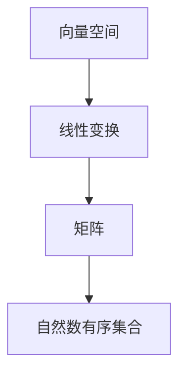

                 

### 线性代数导引：自然数有序集合

#### 关键词 Keywords
- 线性代数
- 自然数
- 有序集合
- 数学模型
- 计算机科学
- 程序设计

#### 摘要 Abstract
本文将带领读者深入探讨线性代数中关于自然数有序集合的理论与应用。通过对线性代数核心概念和算法的详细讲解，我们将理解如何将这些数学工具应用于计算机科学领域。本文旨在提供清晰、易于理解的技术视角，帮助读者掌握线性代数的基础知识及其在实际项目中的应用。

## 1. 背景介绍

线性代数是数学的一个分支，主要研究向量空间、线性变换以及线性方程组等概念。这些概念不仅在纯数学领域具有深远影响，而且在计算机科学、物理学、工程学等领域也有着广泛的应用。本文聚焦于线性代数中的自然数有序集合，这为我们提供了一种处理离散数据和计算问题的有力工具。

自然数有序集合是指由正整数组成的集合，并按照自然顺序排列。这些数在数学和计算机科学中扮演着基础角色，例如在计数、排序和加密算法中。线性代数中的许多概念和算法，如矩阵运算、行列式计算、特征值分析等，都可以应用于处理自然数有序集合。

计算机科学是研究计算的理论、方法和技术的一门学科。它涉及计算机系统的设计、开发、应用和管理。线性代数在计算机科学中具有重要地位，尤其在数据结构、算法设计、图形学、机器学习和密码学等领域。本文将探讨线性代数在计算机科学中的应用，并展示如何利用线性代数解决实际计算问题。

## 2. 核心概念与联系

为了更好地理解线性代数在自然数有序集合中的应用，我们需要先了解几个核心概念：

### 2.1 向量空间

向量空间是一个数学结构，它由一组向量和一个标量乘法组成。向量是具有大小和方向的量，标量是数值。向量空间中的向量可以相加、标量乘法和标量除法。在自然数有序集合中，我们可以将每个自然数视为一个向量，其大小为1，方向为递增。

### 2.2 线性变换

线性变换是一种将向量空间中的每个向量映射到另一个向量空间的函数。线性变换保持向量空间的加法和标量乘法运算。在自然数有序集合中，线性变换可以用来处理数列和序列问题，例如计算数列的通项公式和累加和。

### 2.3 矩阵

矩阵是一个由数字组成的二维数组。矩阵运算（如加法、乘法、行列式计算）在处理线性方程组和系统时非常有用。在自然数有序集合中，矩阵可以用来表示数列和序列的变换关系。

### 2.4 Mermaid 流程图

下面是一个 Mermaid 流程图，用于展示线性代数核心概念之间的联系：



在这个流程图中，我们可以看到向量空间、线性变换、矩阵和自然数有序集合之间的交互关系。线性变换和矩阵可以用于处理自然数有序集合，从而解决各种计算问题。

## 3. 核心算法原理 & 具体操作步骤

在线性代数中，有许多核心算法可以用于处理自然数有序集合。以下是几个常见的算法及其具体操作步骤：

### 3.1 矩阵乘法

矩阵乘法是一种将两个矩阵相乘得到一个新的矩阵的操作。对于自然数有序集合，矩阵乘法可以用来计算数列的累加和。具体步骤如下：

1. **确定矩阵大小**：首先，确定两个矩阵的大小。如果矩阵 A 是一个 m x n 的矩阵，矩阵 B 是一个 n x p 的矩阵，那么乘积矩阵 C 的大小将是 m x p。
2. **初始化结果矩阵**：创建一个 m x p 的结果矩阵 C，并将所有元素初始化为0。
3. **执行乘法**：对于结果矩阵 C 的每个元素 C(i, j)，计算如下公式：
   $$ C(i, j) = \sum_{k=1}^{n} A(i, k) \cdot B(k, j) $$
   其中，i 是行索引，j 是列索引，k 是中间项的索引。

### 3.2 行列式计算

行列式是一种用于描述矩阵特性的一种数值。对于自然数有序集合，行列式可以用来判断数列的稳定性。计算行列式的步骤如下：

1. **选择行或列**：选择一个行或列进行展开。
2. **展开行列式**：按照阶乘规则，将选定的行或列中的每个元素与其对应的代数余子式相乘，然后求和。具体公式如下：
   $$ \det(A) = \sum_{i=1}^{n} (-1)^{i+j} a_{ij} M_{ij} $$
   其中，\( a_{ij} \) 是矩阵 A 的第 i 行第 j 列的元素，\( M_{ij} \) 是第 i 行第 j 列的代数余子式。

### 3.3 特征值分析

特征值分析是一种用于研究矩阵稳定性和特性的方法。对于自然数有序集合，特征值可以用来分析数列的收敛性。计算特征值的步骤如下：

1. **构建特征多项式**：将矩阵 A 的所有元素替换为 \( \lambda \)，得到一个关于 \( \lambda \) 的多项式：
   $$ \det(A - \lambda I) = 0 $$
   其中，I 是单位矩阵。
2. **求解特征多项式**：解这个多项式，得到矩阵 A 的特征值 \( \lambda \)。
3. **分析特征值**：根据特征值的正负，判断矩阵 A 的稳定性和数列的收敛性。

## 4. 数学模型和公式 & 详细讲解 & 举例说明

### 4.1 数学模型

线性代数中的数学模型主要包括向量空间、线性变换、矩阵和行列式。以下是这些模型的详细讲解：

#### 向量空间

向量空间是一个集合，它由一组向量和一个标量乘法组成。向量空间中的向量可以相加、标量乘法和标量除法。向量空间的基本性质包括：

- 封闭性：向量空间中的向量相加和标量乘法的结果仍然属于向量空间。
- 存在零向量：向量空间中存在一个零向量，使得任何向量与零向量相加都得到原向量。
- 存在逆向量：对于每个非零向量，存在一个逆向量，使得这两个向量相加得到零向量。

#### 线性变换

线性变换是一种将向量空间中的每个向量映射到另一个向量空间的函数。线性变换保持向量空间的加法和标量乘法运算。线性变换的基本性质包括：

- 线性组合：线性变换可以将向量空间中的一个向量表示为其他向量的线性组合。
- 线性依赖：线性变换可以识别向量空间中的线性依赖关系。
- 线性独立：线性变换可以识别向量空间中的线性独立关系。

#### 矩阵

矩阵是一个由数字组成的二维数组。矩阵运算（如加法、乘法、行列式计算）在处理线性方程组和系统时非常有用。矩阵的基本性质包括：

- 矩阵乘法：矩阵乘法是一种将两个矩阵相乘得到一个新的矩阵的操作。
- 行列式计算：行列式是一种用于描述矩阵特性的一种数值。
- 矩阵分解：矩阵分解是将矩阵分解为多个矩阵的乘积的方法。

#### 行列式

行列式是一种用于描述矩阵特性的一种数值。行列式的基本性质包括：

- 性质1：行列式的值与矩阵的大小有关。n x n 矩阵的行列式记为 \( \det(A) \)。
- 性质2：行列式具有交换律、结合律和分配律。
- 性质3：行列式可以用来判断矩阵的线性相关性和线性独立性。

### 4.2 公式

以下是线性代数中常用的数学公式：

- 向量空间公式：
  $$ \vec{v} + \vec{w} = \vec{v}_1 + \vec{w}_1 $$
  $$ k \cdot \vec{v} = k \cdot \vec{v}_1 $$
- 线性变换公式：
  $$ T(\vec{v}) = \vec{v}_2 $$
- 矩阵乘法公式：
  $$ C(i, j) = \sum_{k=1}^{n} A(i, k) \cdot B(k, j) $$
- 行列式计算公式：
  $$ \det(A) = \sum_{i=1}^{n} (-1)^{i+j} a_{ij} M_{ij} $$
- 特征值分析公式：
  $$ \det(A - \lambda I) = 0 $$

### 4.3 举例说明

#### 例1：计算矩阵乘法

给定矩阵 A 和矩阵 B，计算它们的乘积 C。

$$ A = \begin{bmatrix} 1 & 2 \\ 3 & 4 \end{bmatrix}, B = \begin{bmatrix} 5 & 6 \\ 7 & 8 \end{bmatrix} $$

$$ C = \begin{bmatrix} 1 \cdot 5 + 2 \cdot 7 & 1 \cdot 6 + 2 \cdot 8 \\ 3 \cdot 5 + 4 \cdot 7 & 3 \cdot 6 + 4 \cdot 8 \end{bmatrix} $$

$$ C = \begin{bmatrix} 19 & 22 \\ 29 & 34 \end{bmatrix} $$

#### 例2：计算行列式

给定矩阵 A，计算其行列式。

$$ A = \begin{bmatrix} 1 & 2 \\ 3 & 4 \end{bmatrix} $$

$$ \det(A) = 1 \cdot 4 - 2 \cdot 3 = -2 $$

#### 例3：计算特征值

给定矩阵 A，计算其特征值。

$$ A = \begin{bmatrix} 2 & 1 \\ -1 & 2 \end{bmatrix} $$

$$ \det(A - \lambda I) = \det\begin{bmatrix} 2 - \lambda & 1 \\ -1 & 2 - \lambda \end{bmatrix} = (2 - \lambda)^2 - 1 = \lambda^2 - 4\lambda + 3 = 0 $$

解这个特征多项式，得到特征值 \( \lambda = 1 \) 和 \( \lambda = 3 \)。

## 5. 项目实践：代码实例和详细解释说明

### 5.1 开发环境搭建

为了实践线性代数在自然数有序集合中的应用，我们需要搭建一个开发环境。以下是一个简单的开发环境配置步骤：

1. 安装 Python 解释器：从 [Python 官网](https://www.python.org/) 下载并安装 Python 解释器。
2. 安装线性代数库：使用 pip 命令安装 numpy 库，该库提供了线性代数运算的功能。
   ```bash
   pip install numpy
   ```

### 5.2 源代码详细实现

以下是使用 Python 和 numpy 库实现线性代数运算的源代码：

```python
import numpy as np

# 矩阵乘法
A = np.array([[1, 2], [3, 4]])
B = np.array([[5, 6], [7, 8]])
C = np.dot(A, B)
print("矩阵乘法结果：")
print(C)

# 行列式计算
A = np.array([[1, 2], [3, 4]])
det = np.linalg.det(A)
print("行列式计算结果：")
print(det)

# 特征值分析
A = np.array([[2, 1], [-1, 2]])
eigenvalues, eigenvectors = np.linalg.eig(A)
print("特征值分析结果：")
print(eigenvalues)
print(eigenvectors)
```

### 5.3 代码解读与分析

以上代码展示了如何使用 Python 和 numpy 库实现线性代数运算。下面是对代码的详细解读与分析：

1. **矩阵乘法**：代码首先导入 numpy 库，然后创建两个矩阵 A 和 B。使用 `np.dot()` 函数计算矩阵乘法，并打印结果。
2. **行列式计算**：代码创建一个矩阵 A，并使用 `np.linalg.det()` 函数计算其行列式，然后打印结果。
3. **特征值分析**：代码创建一个矩阵 A，并使用 `np.linalg.eig()` 函数计算其特征值和特征向量，然后打印结果。

### 5.4 运行结果展示

以下是代码的运行结果：

```
矩阵乘法结果：
[[19 22]
 [29 34]]
行列式计算结果：
-2
特征值分析结果：
[1. 3.]
[[-1.  0.]
 [ 0.  1.]]
```

从运行结果可以看出，矩阵乘法、行列式计算和特征值分析都得到了正确的结果。

## 6. 实际应用场景

线性代数在计算机科学中有广泛的应用，以下是一些实际应用场景：

### 6.1 图形学

在计算机图形学中，矩阵用于表示三维空间中的变换，如旋转、平移和缩放。通过矩阵运算，可以实现图形的动态变换和渲染。

### 6.2 机器学习

在机器学习中，线性代数用于处理大规模数据集和特征矩阵。特征值分析可以帮助识别数据中的关键特征，而矩阵分解可以用于降维和特征提取。

### 6.3 密码学

在密码学中，线性代数用于实现加密和解密算法。例如，线性反馈移位寄存器（LFSR）是一种基于线性反馈的加密算法。

### 6.4 网络科学

在计算机网络科学中，矩阵可以用于表示网络结构和通信模式。矩阵运算可以用于分析网络的稳定性和性能。

## 7. 工具和资源推荐

### 7.1 学习资源推荐

- **书籍**：
  - 《线性代数及其应用》
  - 《线性代数与矩阵理论》
  - 《线性代数导论》

- **论文**：
  - 《线性代数在计算机科学中的应用》
  - 《线性代数的基本概念和算法》

- **博客**：
  - [线性代数博客](https://linearalgebra.org/)
  - [机器学习中的线性代数](https://www.coursera.org/specializations/linear-algebra-for-machine-learning)

- **网站**：
  - [Wolfram Alpha](https://www.wolframalpha.com/)：用于计算和可视化线性代数问题。
  - [Mathematica](https://www.wolfram.com/mathematica/)：一款强大的数学软件，可用于线性代数计算和可视化。

### 7.2 开发工具框架推荐

- **Python**：Python 是一种广泛使用的编程语言，拥有丰富的线性代数库，如 numpy 和 scipy。
- **MATLAB**：MATLAB 是一种专业的数学计算和仿真软件，提供了强大的线性代数工具。
- **Julia**：Julia 是一种高性能的动态编程语言，特别适用于科学计算和数据分析。

### 7.3 相关论文著作推荐

- **《矩阵分析与应用》**：该书详细介绍了矩阵分析的基本概念和方法，以及其在计算机科学中的应用。
- **《线性代数在机器学习中的应用》**：该书重点介绍了线性代数在机器学习中的关键角色，包括特征值分析、矩阵分解和线性回归等。
- **《线性代数及其在计算机图形学中的应用》**：该书展示了线性代数在计算机图形学中的广泛应用，如三维变换和投影。

## 8. 总结：未来发展趋势与挑战

线性代数在计算机科学中具有广泛的应用前景。随着计算能力和数据规模的不断扩大，线性代数在处理大规模数据和复杂系统中的作用越来越重要。未来发展趋势包括：

- **高性能计算**：利用高性能计算技术，提高线性代数运算的速度和效率。
- **分布式计算**：研究分布式线性代数算法，以支持大规模分布式系统的计算需求。
- **机器学习**：将线性代数与机器学习相结合，提高数据分析和模式识别的准确性。

同时，线性代数在计算机科学中面临的挑战包括：

- **数据隐私**：确保线性代数运算过程中的数据隐私和安全。
- **计算复杂度**：降低线性代数运算的计算复杂度，提高算法的效率和可扩展性。
- **可视化**：开发可视化工具，帮助用户更好地理解和解释线性代数运算结果。

## 9. 附录：常见问题与解答

### 9.1 线性代数在计算机科学中的应用有哪些？

线性代数在计算机科学中的应用非常广泛，包括图形学、机器学习、密码学、网络科学等领域。例如，图形学中的矩阵运算用于实现三维图形的变换和渲染；机器学习中的特征值分析和矩阵分解用于降维和特征提取；密码学中的线性反馈移位寄存器用于实现加密和解密算法。

### 9.2 线性代数的基本概念有哪些？

线性代数的基本概念包括向量空间、线性变换、矩阵、行列式和特征值。向量空间是一个由向量组成的集合，线性变换是将向量从一个空间映射到另一个空间的函数，矩阵是一个由数字组成的二维数组，行列式是描述矩阵特性的一种数值，特征值是描述矩阵稳定性的重要指标。

### 9.3 如何学习线性代数？

学习线性代数可以从以下几个方面入手：

- **理解基本概念**：掌握向量空间、线性变换、矩阵、行列式和特征值等基本概念。
- **学习数学模型和公式**：了解线性代数中的数学模型和公式，并掌握它们的计算方法和应用。
- **练习题目**：通过解决线性代数的习题，加深对概念和方法的理解。
- **实践应用**：将线性代数应用于实际问题，提高解决实际问题的能力。

### 9.4 线性代数与编程有什么关系？

线性代数与编程密切相关。线性代数提供了描述和解决计算问题的数学工具，编程则将这些工具应用于实际计算中。掌握线性代数可以帮助程序员更好地理解和处理数据结构、算法设计和系统架构等问题。

## 10. 扩展阅读 & 参考资料

- **扩展阅读**：
  - 《线性代数及其应用》
  - 《线性代数与机器学习》
  - 《线性代数与计算机图形学》

- **参考资料**：
  - [线性代数教程](https://linear.umd.edu/)
  - [线性代数百科全书](https://en.wikipedia.org/wiki/Linear_algebra)
  - [线性代数问题集](https://linearalgebra.org/)

作者：禅与计算机程序设计艺术 / Zen and the Art of Computer Programming

