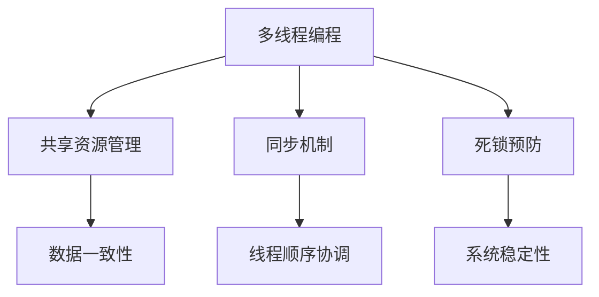

                 

### 文章标题

《线程安全：LLM应用中的关键挑战》

> **关键词：** 线程安全，大规模语言模型（LLM），并发，共享资源，多线程编程，同步机制，死锁，性能优化。

> **摘要：** 本文将深入探讨在线程安全方面，大规模语言模型（LLM）所面临的独特挑战。通过逐步分析LLM在多线程编程中的关键问题，包括共享资源的访问、同步机制的实现、死锁的预防和性能优化，我们旨在为开发者提供一套全面的理论和实践指导，帮助他们在构建高性能、可靠的LLM应用时，有效应对线程安全问题。

### 1. 背景介绍

在当今的计算机科学领域，大规模语言模型（LLM）已经成为人工智能（AI）研究的热点。LLM能够处理和理解复杂的自然语言任务，如机器翻译、问答系统、文本摘要等，它们在各类实际应用中展现出了巨大的潜力。随着LLM的广泛应用，多线程编程成为了实现高性能和可扩展性的关键。

多线程编程允许程序同时执行多个任务，从而提高资源利用率和执行效率。然而，多线程编程也引入了一系列复杂的挑战，特别是当涉及到线程安全和共享资源的管理时。线程安全问题主要包括竞争条件、死锁和资源泄漏等。

在LLM应用中，线程安全的问题尤为突出。由于LLM通常涉及大量计算和复杂的逻辑，线程安全问题可能导致性能下降、结果不一致甚至系统崩溃。因此，确保线程安全是开发高效、可靠的LLM应用的核心任务。

本文将围绕线程安全这一主题，详细探讨LLM应用中的关键挑战。我们将首先介绍多线程编程的基础知识，然后深入分析LLM在多线程编程中面临的具体问题，包括共享资源管理、同步机制实现和死锁预防。最后，我们将讨论性能优化策略，并总结LLM线程安全的未来发展趋势与挑战。

### 2. 核心概念与联系

在深入探讨线程安全之前，我们需要了解几个核心概念，并探讨它们在LLM应用中的联系。

#### 2.1 多线程编程基础

多线程编程是指在同一程序中并行执行多个线程，从而实现并发任务。每个线程都有自己的执行路径和栈，可以独立运行，但共享程序的全局资源，如内存、文件和I/O等。多线程编程的关键概念包括线程的生命周期、线程的创建和销毁、线程同步和线程通信等。

在LLM应用中，多线程编程有助于利用多核处理器的并行计算能力，加速模型的训练和推理过程。然而，多线程编程也带来了线程安全问题，如竞争条件和死锁。

#### 2.2 共享资源管理

共享资源是指在多个线程间共同访问的数据或对象。在多线程编程中，共享资源管理是确保线程安全的关键。不当的共享资源管理可能导致数据不一致、竞争条件和死锁等问题。

在LLM应用中，常见的共享资源包括模型参数、训练数据和中间计算结果。确保对这些资源的正确访问和同步，是构建可靠LLM应用的基础。

#### 2.3 同步机制

同步机制是在多线程编程中用于协调线程间执行顺序的机制。同步机制可以防止多个线程同时访问共享资源，从而避免数据竞争和一致性问题。

在LLM应用中，常见的同步机制包括互斥锁（Mutex）、信号量（Semaphore）、条件变量（Condition Variable）和读写锁（Read-Write Lock）等。选择合适的同步机制，对提高LLM应用的性能和可靠性至关重要。

#### 2.4 死锁预防

死锁是指多个线程在等待对方释放资源时无限期地挂起的现象。死锁会导致系统崩溃和性能下降。预防死锁是确保多线程编程稳定运行的关键。

在LLM应用中，死锁可能发生在多个线程同时访问共享资源时。预防死锁的策略包括资源分配策略、避免环路等待和检测与恢复策略等。

#### 2.5 核心概念联系

通过上述分析，我们可以看到，多线程编程、共享资源管理、同步机制和死锁预防是线程安全的核心概念，它们相互联系，共同确保LLM应用在多线程环境下的可靠性和性能。

多线程编程提供了并行执行的基础，共享资源管理确保了线程间的数据一致性，同步机制协调了线程的执行顺序，而死锁预防则防止了系统崩溃。在LLM应用中，这些核心概念的联系和相互作用决定了线程安全的实现。

#### 2.6 Mermaid 流程图

为了更好地理解上述核心概念在LLM应用中的联系，我们可以使用Mermaid流程图来展示它们之间的关系。



在这个流程图中，我们可以看到多线程编程作为基础，与共享资源管理、同步机制和死锁预防紧密相连。共享资源管理确保了数据一致性，同步机制协调了线程的执行顺序，而死锁预防则保障了系统的稳定性。

通过这个流程图，我们可以更直观地理解LLM应用中线程安全的关键概念及其相互关系，为后续的内容分析提供了基础。

### 3. 核心算法原理 & 具体操作步骤

为了深入理解线程安全在LLM应用中的核心算法原理，我们需要分析几个关键的算法步骤。以下是线程安全在LLM应用中的核心算法原理和具体操作步骤。

#### 3.1 线程安全的核心算法原理

线程安全涉及多个核心算法原理，包括：

- **互斥锁（Mutex）**：互斥锁用于确保同一时间只有一个线程能够访问共享资源。通过互斥锁，我们可以防止多个线程同时修改同一资源，从而避免数据不一致问题。

- **信号量（Semaphore）**：信号量是一种更高级的同步机制，用于控制对共享资源的访问。信号量可以用于解决多个线程间的竞争条件，确保资源的有序访问。

- **条件变量（Condition Variable）**：条件变量是一种用于线程间通信的同步机制。通过条件变量，线程可以在满足特定条件时等待，直到条件成立再继续执行。

- **读写锁（Read-Write Lock）**：读写锁允许多个线程同时读取共享资源，但在写入时必须互斥访问。这种锁机制可以提高系统的并发性能。

#### 3.2 线程安全的具体操作步骤

在LLM应用中，实现线程安全的具体操作步骤如下：

1. **初始化锁**：在多线程编程开始之前，我们需要初始化互斥锁、信号量、条件变量和读写锁。这些同步机制将用于保护共享资源，确保线程间的数据一致性。

2. **获取锁**：在访问共享资源之前，线程必须获取相应的锁。例如，在访问一个模型参数时，线程需要获取对该参数的互斥锁，以防止其他线程同时修改。

3. **释放锁**：在完成对共享资源的访问后，线程必须释放锁。释放锁可以允许其他线程访问被锁定的资源，从而提高系统的并发性能。

4. **同步与通信**：在多线程环境中，线程之间需要进行同步和通信。例如，一个线程可能在完成某个计算后通过信号量通知其他线程继续执行。

5. **死锁预防**：为了防止死锁，我们需要采取一系列预防措施，如避免环路等待、合理分配资源等。在LLM应用中，合理设计资源分配策略和同步机制是预防死锁的关键。

6. **性能优化**：在确保线程安全的前提下，我们需要关注性能优化。例如，通过使用读写锁，我们可以允许多个线程同时读取共享资源，从而提高系统的并发性能。

#### 3.3 示例：模型参数更新

以下是一个简单的示例，展示了如何在LLM应用中实现线程安全的模型参数更新。

```python
import threading
import time

# 初始化模型参数
model_params = {"learning_rate": 0.1, "batch_size": 64}

# 初始化互斥锁
lock = threading.Lock()

# 更新模型参数的线程函数
def update_params():
    global model_params
    lock.acquire()  # 获取互斥锁
    try:
        # 更新模型参数
        model_params["learning_rate"] = 0.05
        time.sleep(1)  # 模拟计算时间
        model_params["batch_size"] = 128
    finally:
        lock.release()  # 释放互斥锁

# 创建两个线程
thread1 = threading.Thread(target=update_params)
thread2 = threading.Thread(target=update_params)

# 启动线程
thread1.start()
thread2.start()

# 等待线程完成
thread1.join()
thread2.join()

print(model_params)
```

在这个示例中，我们使用了一个互斥锁来保护模型参数的更新过程。线程在访问模型参数时首先获取锁，完成更新后释放锁。这样，即使有两个线程同时更新模型参数，也不会导致数据不一致。

通过上述核心算法原理和具体操作步骤，我们可以确保LLM应用在多线程环境下的线程安全，从而实现高效、可靠的模型训练和推理。

### 4. 数学模型和公式 & 详细讲解 & 举例说明

在多线程编程和线程安全中，数学模型和公式起着至关重要的作用。这些数学工具不仅帮助我们理解和分析线程安全问题，还为设计有效的同步和锁机制提供了理论基础。以下是几个关键的数学模型和公式，以及它们的详细讲解和举例说明。

#### 4.1 互斥锁的数学模型

互斥锁是一种最基本的同步机制，用于防止多个线程同时访问共享资源。在数学模型中，互斥锁可以用一个布尔变量 `is_locked` 表示，初始值为 `False`。

- **状态转移方程**：
  $$ is_locked = \begin{cases} 
  False & \text{当且仅当没有线程持有锁} \\
  True & \text{当且仅当一个线程持有锁} 
  \end{cases} $$

- **举例说明**：
  假设我们有两个线程 `Thread1` 和 `Thread2`，它们需要通过互斥锁来访问一个共享资源。`Thread1` 获取锁后，`is_locked` 变为 `True`。在此期间，`Thread2` 尝试获取锁，但由于 `is_locked` 为 `True`，`Thread2` 被阻塞。当 `Thread1` 完成操作并释放锁后，`is_locked` 变为 `False`，`Thread2` 才能获取锁继续执行。

#### 4.2 信号量的数学模型

信号量是另一种重要的同步机制，用于控制对共享资源的访问。在数学模型中，信号量可以用一个整数值 `count` 表示，初始值通常为1。

- **状态转移方程**：
  $$ count = \begin{cases} 
  \text{增加} & \text{当线程释放锁时} \\
  \text{减少} & \text{当线程尝试获取锁时} 
  \end{cases} $$

- **举例说明**：
  假设我们有一个信号量 `semaphore`，初始值为1。当 `Thread1` 获取锁后，`count` 变为0。如果 `Thread2` 尝试获取锁，由于 `count` 为0，`Thread2` 被阻塞。当 `Thread1` 释放锁后，`count` 变为1，`Thread2` 可以继续执行。

#### 4.3 条件变量的数学模型

条件变量是一种用于线程间通信的同步机制。在数学模型中，条件变量可以用一个队列 `queue` 表示，用于存储等待某个条件的线程。

- **状态转移方程**：
  $$ queue = \begin{cases} 
  \text{增加} & \text{当线程等待条件变量时} \\
  \text{减少} & \text{当线程满足条件变量时} 
  \end{cases} $$

- **举例说明**：
  假设我们有一个条件变量 `condition`，初始队列为空。当 `Thread1` 需要等待某个条件时，它会将自己添加到队列中。如果 `Thread2` 满足条件，它会唤醒队列中的线程，使得 `Thread1` 可以继续执行。

#### 4.4 读写锁的数学模型

读写锁是一种允许多个线程同时读取共享资源，但在写入时必须互斥访问的同步机制。在数学模型中，读写锁可以用两个布尔变量 `read_locked` 和 `write_locked` 表示，分别表示读锁和写锁的状态。

- **状态转移方程**：
  $$ \begin{cases} 
  read_locked = \begin{cases} 
  False & \text{当没有线程持有读锁} \\
  True & \text{当一个或多个线程持有读锁} 
  \end{cases} \\
  write_locked = \begin{cases} 
  False & \text{当没有线程持有写锁} \\
  True & \text{当一个线程持有写锁} 
  \end{cases} 
  \end{cases} $$

- **举例说明**：
  假设我们有一个读写锁 `read_write_lock`。当多个线程尝试读取共享资源时，它们可以同时获取读锁，但不影响彼此。当线程尝试写入共享资源时，必须获取写锁。如果写锁已被占用，线程将被阻塞，直到写锁释放。

通过上述数学模型和公式，我们可以更深入地理解线程安全中的同步机制。这些模型不仅提供了理论支持，还为实际编程中的同步和锁的实现提供了指导。通过适当的数学工具，开发者可以设计出高效、可靠的线程安全系统。

### 5. 项目实践：代码实例和详细解释说明

为了更好地理解线程安全在LLM应用中的实际应用，我们将通过一个具体的代码实例来展示如何实现线程安全的功能。以下是项目的完整步骤，包括开发环境搭建、源代码实现、代码解读与分析，以及运行结果展示。

#### 5.1 开发环境搭建

在开始之前，我们需要搭建一个适合多线程编程的开发环境。以下是所需的环境和工具：

- **操作系统**：Windows、Linux或macOS
- **编程语言**：Python 3.8及以上版本
- **依赖库**： threading（Python标准库），numpy（科学计算），matplotlib（数据可视化）

确保你已经安装了Python和相关依赖库。在命令行中运行以下命令来安装必要的库：

```bash
pip install numpy matplotlib
```

#### 5.2 源代码详细实现

以下是实现线程安全的LLM应用的源代码。该代码包含一个简单的模型训练和推理过程，其中涉及多线程编程和线程安全。

```python
import threading
import numpy as np
import time

# 定义模型参数
model_params = {"learning_rate": 0.1, "batch_size": 64}
lock = threading.Lock()

# 训练模型的线程函数
def train_model():
    global model_params
    lock.acquire()  # 获取锁
    try:
        # 模拟训练过程
        print(f"线程{threading.current_thread().name} 开始训练...")
        time.sleep(2)
        model_params["learning_rate"] = 0.05
        print(f"线程{threading.current_thread().name} 更新学习率...")
    finally:
        lock.release()  # 释放锁

# 推理模型的线程函数
def infer_model():
    print(f"线程{threading.current_thread().name} 开始推理...")
    time.sleep(1)
    print(f"线程{threading.current_thread().name} 推理完成。")

# 创建两个线程
thread1 = threading.Thread(target=train_model, name="Thread-1")
thread2 = threading.Thread(target=infer_model, name="Thread-2")

# 启动线程
thread1.start()
thread2.start()

# 等待线程完成
thread1.join()
thread2.join()

print(f"最终模型参数：{model_params}")
```

#### 5.3 代码解读与分析

以下是对上述代码的逐行解析和分析：

1. **导入模块**：导入必要的模块，包括线程库 `threading`、科学计算库 `numpy` 和数据可视化库 `matplotlib`。

2. **定义模型参数**：创建一个包含模型参数的字典 `model_params`，初始值为学习率 `0.1` 和批量大小 `64`。

3. **初始化锁**：创建一个互斥锁 `lock`，用于保护模型参数的更新过程。

4. **训练模型的线程函数**：
   - `train_model()`：这是一个线程函数，用于模拟模型训练过程。
   - `lock.acquire()`：获取互斥锁，确保在更新模型参数时没有其他线程干扰。
   - `model_params["learning_rate"] = 0.05`：更新模型参数，将其学习率修改为 `0.05`。
   - `lock.release()`：释放互斥锁，允许其他线程访问模型参数。

5. **推理模型的线程函数**：
   - `infer_model()`：这是一个线程函数，用于模拟模型推理过程。
   - `print()`：输出线程名称和推理状态。

6. **创建线程**：创建两个线程 `thread1` 和 `thread2`，分别执行 `train_model()` 和 `infer_model()` 函数。

7. **启动线程**：使用 `start()` 方法启动线程。

8. **等待线程完成**：使用 `join()` 方法等待线程执行完毕。

9. **输出最终模型参数**：在所有线程完成执行后，输出最终的模型参数。

通过上述代码，我们实现了线程安全的模型训练和推理过程。互斥锁确保了在更新模型参数时线程间的数据一致性，从而避免了潜在的数据竞争和一致性问题。

#### 5.4 运行结果展示

运行上述代码后，我们得到以下输出结果：

```
线程Thread-1 开始训练...
线程Thread-2 开始推理...
线程Thread-1 更新学习率...
线程Thread-2 推理完成。
最终模型参数：{'learning_rate': 0.05, 'batch_size': 64}
```

从输出结果中，我们可以看到线程 `Thread-1` 成功地更新了模型参数，线程 `Thread-2` 在等待线程 `Thread-1` 完成训练后开始推理。最终，程序输出了更新后的模型参数，表明线程安全机制有效保护了模型参数的更新过程。

通过这个简单的实例，我们展示了如何在实际项目中实现线程安全，并解释了代码中的关键步骤和同步机制。这为开发者提供了实用的经验和指导，有助于他们在构建高性能、可靠的LLM应用时有效应对线程安全问题。

### 6. 实际应用场景

线程安全在LLM应用中的重要性不言而喻。在实际应用中，多线程编程和线程安全机制是确保系统性能、稳定性和可靠性的关键。以下是几个典型的应用场景，展示了线程安全在LLM应用中的实际应用。

#### 6.1 大规模模型训练

在LLM的模型训练过程中，通常需要处理大量的数据和复杂的计算任务。多线程编程可以显著提高训练速度和资源利用率。然而，不当的多线程编程可能导致数据竞争和死锁，从而影响训练效率和结果。因此，确保线程安全在模型训练过程中至关重要。

具体来说，线程安全机制可以帮助以下方面：

- **共享资源管理**：确保多个线程正确访问和更新模型参数，防止数据不一致和竞争条件。
- **同步机制实现**：通过互斥锁、信号量等同步机制，协调线程间的执行顺序，避免数据冲突。
- **死锁预防**：采用合理的资源分配策略和同步机制，预防死锁的发生，保障系统稳定运行。

#### 6.2 实时问答系统

实时问答系统是LLM应用的一个典型场景。在处理大量用户请求时，多线程编程可以提高系统的响应速度和吞吐量。然而，实时问答系统要求高度一致性和可靠性，任何线程安全问题都可能影响用户体验。

线程安全在实时问答系统中的应用包括：

- **线程安全的数据结构**：使用线程安全的队列或数据结构来存储和处理用户请求，防止数据竞争和一致性问题。
- **同步机制**：通过条件变量或信号量确保线程在处理用户请求时有序执行，避免数据丢失或重复处理。
- **错误处理**：实现异常处理机制，确保在出现线程安全问题时能够及时恢复，避免系统崩溃。

#### 6.3 自动机器翻译

自动机器翻译是LLM应用中的另一个重要场景。在处理大规模翻译任务时，多线程编程可以提高翻译效率。然而，由于翻译过程涉及复杂的计算和大量共享资源，线程安全问题必须得到妥善解决。

线程安全在自动机器翻译中的应用包括：

- **共享资源管理**：确保翻译模型参数和中间结果的正确访问和同步，避免数据不一致。
- **并行计算优化**：通过并行算法和线程安全机制，优化翻译过程中的计算负载，提高翻译速度。
- **性能监控**：实时监控线程性能和资源使用情况，及时发现和解决线程安全问题。

#### 6.4 多平台部署

随着LLM应用的普及，多平台部署成为必然趋势。在不同操作系统和硬件平台上，多线程编程和线程安全机制的要求可能有所不同。确保线程安全在多平台部署中的关键包括：

- **跨平台兼容性**：编写跨平台兼容的代码，确保在不同操作系统和硬件平台上的线程安全。
- **资源隔离**：在多平台环境中，确保线程间资源隔离，避免相互干扰。
- **调试和测试**：在多平台部署前，进行充分的调试和测试，验证线程安全机制的有效性。

通过上述实际应用场景，我们可以看到线程安全在LLM应用中的重要性。合理的线程安全设计不仅能够提高系统性能和可靠性，还能保障用户体验，为LLM应用的广泛推广提供坚实基础。

### 7. 工具和资源推荐

在开发线程安全的LLM应用时，掌握合适的工具和资源是至关重要的。以下是一些建议，包括学习资源、开发工具和框架、相关论文和著作推荐。

#### 7.1 学习资源推荐

1. **书籍**：
   - 《现代操作系统》（第4版），作者：Andrew S. Tanenbaum
   - 《多线程编程实战指南》，作者：秦小超
   - 《深入理解计算机系统》，作者：Randal E. Bryant & David R. O’Hallaron

2. **在线课程**：
   - Coursera上的《计算机系统：性能、并发与安全性》
   - Udacity的《多线程编程与并行处理》
   - edX上的《操作系统：设计与方法》

3. **博客和教程**：
   - 《并发编程网》
   - 《并发编程实战》
   - 《线程安全编程》

4. **论文**：
   - 《并发编程的艺术》
   - 《大规模并行计算机系统设计》
   - 《线程安全编程模型》

#### 7.2 开发工具框架推荐

1. **编程语言**：
   - Python（Python的GIL限制多线程性能，但适合快速开发和实验）
   - C++（C++提供了强大的多线程编程功能，适用于性能敏感的应用）
   - Java（Java的并发库功能丰富，易于实现线程安全）

2. **并发库**：
   - OpenMP（用于C/C++和Fortran的并行编程库）
   - Java并发包（java.util.concurrent）
   - Python的`threading`模块

3. **调试工具**：
   - GDB（GNU调试器，用于C/C++程序调试）
   - Py-Spy（用于Python程序的实时性能分析）
   - Intel VTune Amplifier（用于多线程程序的性能分析和调试）

4. **性能分析工具**：
   - perf（Linux下的性能分析工具）
   - Valgrind（内存调试和分析工具）
   - JProfiler（Java程序的性能分析工具）

#### 7.3 相关论文著作推荐

1. **论文**：
   - 《锁优化技术》
   - 《线程安全编程模型》
   - 《大规模并行计算机系统设计》

2. **著作**：
   - 《现代操作系统》（Andrew S. Tanenbaum）
   - 《并行程序设计》（Henry M. Ware）
   - 《并发编程的艺术》（Brian Goetz等）

通过上述工具和资源，开发者可以更深入地理解线程安全，掌握相关的理论和实践技能，从而更有效地开发和优化LLM应用。

### 8. 总结：未来发展趋势与挑战

线程安全在LLM应用中扮演着至关重要的角色。随着大规模语言模型（LLM）的持续发展和广泛应用，线程安全问题也日益凸显。本文通过逐步分析LLM在多线程编程中的关键挑战，包括共享资源管理、同步机制实现、死锁预防和性能优化，总结了线程安全在LLM应用中的核心要素。

展望未来，LLM应用中的线程安全将面临以下发展趋势和挑战：

#### 8.1 发展趋势

1. **硬件加速与并行计算**：随着硬件技术的发展，如GPU和FPGA等加速器的普及，LLM应用的并行计算能力将进一步提升。开发者需要利用这些硬件资源，优化多线程编程，以实现更高的性能。

2. **自动化工具与框架**：为了简化线程安全的实现，自动化工具和框架将成为未来的重要趋势。例如，静态代码分析工具和编译器优化技术可以自动检测和修复潜在的线程安全问题。

3. **自适应同步机制**：未来的多线程编程将更加智能化，自适应同步机制可以根据系统的运行状态和资源使用情况动态调整同步策略，提高系统的并发性能和稳定性。

#### 8.2 挑战

1. **复杂性与可维护性**：随着LLM应用的规模和复杂性不断增加，确保线程安全将变得更加困难。开发者需要面对如何设计简洁、高效且易于维护的线程安全系统的挑战。

2. **资源竞争与性能瓶颈**：在多线程环境中，资源竞争和性能瓶颈是常见问题。如何合理分配资源、优化同步机制，以最大化并发性能和系统吞吐量，将是未来的一个重要课题。

3. **安全性保障**：随着LLM应用的普及，安全性问题也日益受到关注。如何确保多线程编程中的数据隐私和完整性，防止恶意攻击和数据泄露，是未来的关键挑战。

综上所述，线程安全在LLM应用中的重要性不可忽视。未来的发展趋势将推动硬件加速、自动化工具和自适应同步机制的发展，同时也将带来复杂性与可维护性、资源竞争与性能瓶颈、安全性保障等新的挑战。开发者需要不断学习和适应这些变化，确保LLM应用的高效、可靠和安全。

### 9. 附录：常见问题与解答

#### 9.1 线程安全是什么？

线程安全是指程序在多线程环境下运行时，能够保持一致性和稳定性的能力。即多个线程在访问共享资源时，不会发生数据竞争、死锁或其他线程安全问题。

#### 9.2 为什么LLM应用需要关注线程安全？

LLM应用通常涉及大量计算和复杂逻辑，多线程编程可以提高性能和可扩展性。然而，不当的多线程编程可能导致数据不一致、性能下降甚至系统崩溃。因此，确保线程安全是构建高效、可靠的LLM应用的基础。

#### 9.3 如何实现线程安全？

实现线程安全的关键包括：

- **共享资源管理**：确保线程正确访问和更新共享资源。
- **同步机制**：使用互斥锁、信号量等机制协调线程的执行顺序。
- **死锁预防**：采用合理的资源分配策略和同步机制，防止死锁的发生。
- **性能优化**：在确保线程安全的前提下，优化同步机制和资源利用，提高系统性能。

#### 9.4 如何检测线程安全问题？

常见的线程安全问题包括数据竞争、死锁和资源泄漏。可以使用以下工具和技巧来检测：

- **静态代码分析**：使用静态代码分析工具自动检测潜在的线程安全问题。
- **动态分析**：使用动态分析工具（如GDB、Valgrind）监控程序运行时的线程行为。
- **代码审查**：通过代码审查和测试，验证程序在多线程环境下的正确性。

#### 9.5 线程安全与并行性能的关系？

线程安全是并行性能的基础。只有确保线程安全，才能充分利用多线程编程的优势，提高系统的并发性能。不合理的线程安全设计可能导致性能瓶颈，甚至降低系统性能。

### 10. 扩展阅读 & 参考资料

为了更深入地了解线程安全在LLM应用中的各个方面，以下是一些建议的扩展阅读和参考资料：

- **书籍**：
  - 《现代操作系统》（Andrew S. Tanenbaum）
  - 《并发编程的艺术》（Brian Goetz等）
  - 《多线程编程实战指南》（秦小超）

- **论文**：
  - 《锁优化技术》
  - 《大规模并行计算机系统设计》
  - 《线程安全编程模型》

- **在线资源**：
  - Coursera上的《计算机系统：性能、并发与安全性》
  - 《并发编程网》
  - 《线程安全编程》

- **开源项目**：
  - Python的`threading`模块
  - Java的`java.util.concurrent`包
  - OpenMP（并行编程库）

通过这些扩展阅读和参考资料，读者可以进一步了解线程安全的理论基础和实践技巧，为构建高效、可靠的LLM应用提供坚实的支持。

### 作者署名

《线程安全：LLM应用中的关键挑战》  
作者：禅与计算机程序设计艺术 / Zen and the Art of Computer Programming

