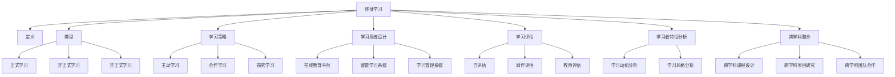

                 

### 背景介绍 Background Introduction

#### 终身学习的重要性 Importance of Lifelong Learning

在当今这个信息技术迅猛发展的时代，终身学习已经成为每个人职业生涯中不可或缺的一部分。随着知识的快速迭代和技术的不断革新，人们必须不断学习新知识、新技能，以适应快速变化的工作环境。然而，如何有效地进行终身学习，如何将新知识快速融入已有的知识体系，成为了一个关键问题。

终身学习不仅仅是对知识的积累，更是一种能力的培养，包括批判性思维、解决问题的能力、自主学习的能力等。在这个知识爆炸的时代，如何将终身学习理念付诸实践，成为每个人都需要面对的挑战。

#### 为什么要研究终身学习Lifelong Learning

1. **知识更新速度加快**：现代科技的发展使得知识更新的速度前所未有，新的研究成果、技术突破不断涌现，这要求人们必须不断学习，才能跟上时代的步伐。

2. **工作环境变化**：全球化和信息化使得工作环境发生了巨大变化，传统的职业生涯路径越来越模糊，人们需要在多个领域具备一定的专业知识和技能，才能在职场中保持竞争力。

3. **个人成长需求**：终身学习不仅仅是职业发展的需要，也是个人成长的需求。通过学习，人们可以不断提升自己的认知水平，拓展视野，增强自我实现的能力。

4. **社会进步的推动力**：终身学习是推动社会进步的重要力量。一个国家的创新能力、科技水平往往与其公民的终身学习能力密切相关。

#### 研究现状 Research Status

目前，关于终身学习的研究已经涉及多个领域，包括教育学、心理学、计算机科学等。研究内容主要集中在以下几个方面：

1. **学习策略**：研究如何选择合适的学习策略，以提高学习效果。例如，主动学习、合作学习等。

2. **学习系统设计**：研究如何设计更有效的学习系统，以支持终身学习。例如，在线教育平台、智能学习系统等。

3. **学习评估**：研究如何评估终身学习的效果，以确定学习目标的实现程度。

4. **学习者特征分析**：研究学习者的特征，如学习动机、学习风格等，以制定个性化的学习计划。

#### 本文目的 Objective of This Article

本文旨在探讨终身学习的基本原理，通过分析现有的研究成果，总结出有效的终身学习策略和方法。同时，本文将结合具体的代码实例，展示如何将终身学习理念应用于实际编程实践中，帮助读者更好地理解和应用终身学习。

通过本文的学习，读者将能够：

1. **理解终身学习的重要性**：认识到终身学习在个人发展和社会进步中的关键作用。

2. **掌握终身学习的基本原理**：了解终身学习的基本概念、学习策略和学习系统设计。

3. **学会应用终身学习策略**：掌握如何在日常生活中应用终身学习策略，提高学习效果。

4. **通过代码实例实践终身学习**：通过具体实例，了解如何将终身学习理念融入编程实践。

### 文章标题

**终身学习Lifelong Learning原理与代码实例讲解**

> **关键词**：终身学习、学习策略、学习系统设计、代码实例、编程实践

> **摘要**：本文探讨了终身学习的基本原理，分析了现有的研究成果，总结了有效的终身学习策略和方法。通过具体的代码实例，展示了如何将终身学习理念应用于实际编程实践中，帮助读者更好地理解和应用终身学习。

### 背景介绍 Background Introduction

#### 终身学习的重要性 Importance of Lifelong Learning

在当今这个信息技术迅猛发展的时代，终身学习已经成为每个人职业生涯中不可或缺的一部分。随着知识的快速迭代和技术的不断革新，人们必须不断学习新知识、新技能，以适应快速变化的工作环境。然而，如何有效地进行终身学习，如何将新知识快速融入已有的知识体系，成为了一个关键问题。

终身学习不仅仅是对知识的积累，更是一种能力的培养，包括批判性思维、解决问题的能力、自主学习的能力等。在这个知识爆炸的时代，如何将终身学习理念付诸实践，成为每个人都需要面对的挑战。

#### 为什么要研究终身学习Lifelong Learning

1. **知识更新速度加快**：现代科技的发展使得知识更新的速度前所未有，新的研究成果、技术突破不断涌现，这要求人们必须不断学习，才能跟上时代的步伐。

2. **工作环境变化**：全球化和信息化使得工作环境发生了巨大变化，传统的职业生涯路径越来越模糊，人们需要在多个领域具备一定的专业知识和技能，才能在职场中保持竞争力。

3. **个人成长需求**：终身学习不仅仅是职业发展的需要，也是个人成长的需求。通过学习，人们可以不断提升自己的认知水平，拓展视野，增强自我实现的能力。

4. **社会进步的推动力**：终身学习是推动社会进步的重要力量。一个国家的创新能力、科技水平往往与其公民的终身学习能力密切相关。

#### 研究现状 Research Status

目前，关于终身学习的研究已经涉及多个领域，包括教育学、心理学、计算机科学等。研究内容主要集中在以下几个方面：

1. **学习策略**：研究如何选择合适的学习策略，以提高学习效果。例如，主动学习、合作学习等。

2. **学习系统设计**：研究如何设计更有效的学习系统，以支持终身学习。例如，在线教育平台、智能学习系统等。

3. **学习评估**：研究如何评估终身学习的效果，以确定学习目标的实现程度。

4. **学习者特征分析**：研究学习者的特征，如学习动机、学习风格等，以制定个性化的学习计划。

#### 本文目的 Objective of This Article

本文旨在探讨终身学习的基本原理，通过分析现有的研究成果，总结出有效的终身学习策略和方法。同时，本文将结合具体的代码实例，展示如何将终身学习理念应用于实际编程实践中，帮助读者更好地理解和应用终身学习。

通过本文的学习，读者将能够：

1. **理解终身学习的重要性**：认识到终身学习在个人发展和社会进步中的关键作用。

2. **掌握终身学习的基本原理**：了解终身学习的基本概念、学习策略和学习系统设计。

3. **学会应用终身学习策略**：掌握如何在日常生活中应用终身学习策略，提高学习效果。

4. **通过代码实例实践终身学习**：通过具体实例，了解如何将终身学习理念融入编程实践。

### 核心概念与联系 Core Concepts and Connections

#### 终身学习的定义 Definition of Lifelong Learning

终身学习是指一个人在其一生中持续地获取知识、技能和态度的过程。它不仅包括学校教育，还包括成人教育和职业培训。终身学习的核心目标是提高个人的综合素质和适应能力，以应对不断变化的工作和社会环境。

#### 终身学习的类型 Types of Lifelong Learning

1. **正式学习 Formal Learning**：指的是通过学校、培训机构等正规教育机构获得的知识和技能。例如，大学课程、职业培训等。

2. **非正式学习 Informal Learning**：指的是在日常生活中的学习，如自学、读书、参加讲座、社会实践等。非正式学习通常更加灵活，可以根据个人的兴趣和需求进行。

3. **非正式学习 Informal Learning**：指的是在日常生活中的学习，如自学、读书、参加讲座、社会实践等。非正式学习通常更加灵活，可以根据个人的兴趣和需求进行。

#### 学习策略 Learning Strategies

学习策略是指在学习过程中采用的方法和技巧，以提高学习效率和效果。常见的学习策略包括：

1. **主动学习 Active Learning**：通过主动参与、互动和探索来学习。例如，小组讨论、案例分析等。

2. **合作学习 Collaborative Learning**：通过与他人合作来学习。例如，团队合作、同伴互助等。

3. **探究学习 Inquiry Learning**：通过提出问题、寻找答案来学习。例如，项目研究、实验探究等。

#### 学习系统设计 Learning System Design

学习系统设计是指为了支持终身学习而设计的各种系统和平台。常见的包括：

1. **在线教育平台 Online Learning Platforms**：如Coursera、edX等，提供大量的在线课程和资源。

2. **智能学习系统 Intelligent Learning Systems**：利用人工智能技术，提供个性化的学习推荐和指导。

3. **学习管理系统 Learning Management Systems**：帮助学习者和管理者跟踪学习进度和评估学习效果。

#### 学习评估 Learning Evaluation

学习评估是指对学习过程和效果进行评估的方法。常见的评估方法包括：

1. **自评估 Self-evaluation**：学习者自我评估自己的学习进展和效果。

2. **同伴评估 Peer Evaluation**：通过同伴之间的评价来评估学习效果。

3. **教师评估 Teacher Evaluation**：教师对学习者的学习过程和效果进行评估。

#### 学习者特征分析 Learner Characteristics Analysis

学习者特征分析是指对学习者的学习动机、学习风格等特征进行的研究，以制定个性化的学习计划。常见的分析方法包括：

1. **学习动机分析 Motivation Analysis**：研究学习者的学习动机，如内在动机、外在动机等。

2. **学习风格分析 Learning Style Analysis**：研究学习者的学习偏好，如视觉学习、听觉学习、动手学习等。

#### 跨学科整合 Interdisciplinary Integration

终身学习不仅仅是单一学科的学习，还需要跨学科的整合。这意味着学习者需要具备跨学科的知识和技能，能够从不同角度理解和解决问题。跨学科整合包括：

1. **跨学科课程设计 Interdisciplinary Course Design**：将不同学科的知识和技能整合到一起。

2. **跨学科项目研究 Interdisciplinary Project Research**：通过项目研究，跨学科地解决实际问题。

3. **跨学科团队合作 Interdisciplinary Teamwork**：在团队中，跨学科成员的合作和交流，以实现共同目标。

### 核心概念与联系的 Mermaid 流程图 Mermaid Flowchart of Core Concepts and Connections



### 核心算法原理 & 具体操作步骤 Core Algorithm Principle & Specific Operational Steps

#### 1. 算法概述 Overview of Algorithm

终身学习的核心算法可以概括为以下几个步骤：

1. **知识获取**：通过多种途径获取新的知识和技能。
2. **知识整合**：将新知识与已有的知识体系进行整合，形成更加完善的知识网络。
3. **知识应用**：将知识应用到实际问题和项目中，以验证知识的有效性和实用性。
4. **知识更新**：根据实际应用的效果，对知识进行迭代和更新。

#### 2. 知识获取 Knowledge Acquisition

知识获取是终身学习的基础，主要涉及以下几个步骤：

1. **信息检索**：通过互联网、图书馆、数据库等途径检索和查找所需的知识。
2. **课程学习**：参加线上或线下的课程，系统学习新的知识和技能。
3. **实践操作**：通过实际操作和项目实践，将理论知识应用到实际中。

#### 3. 知识整合 Knowledge Integration

知识整合是将新知识与已有的知识体系进行融合的过程，主要方法包括：

1. **思维导图**：使用思维导图工具，将新旧知识进行可视化整合。
2. **知识卡片**：制作知识卡片，将重要知识点进行归纳和总结。
3. **笔记整理**：定期整理学习笔记，将新知识与旧知识进行对比和整合。

#### 4. 知识应用 Knowledge Application

知识应用是将知识应用到实际问题解决中的过程，主要方法包括：

1. **项目实践**：通过实际项目，将所学知识应用于解决实际问题。
2. **案例研究**：通过案例分析，了解如何将知识应用于特定场景。
3. **知识分享**：通过分享学习心得和经验，与他人交流知识应用的经验。

#### 5. 知识更新 Knowledge Update

知识更新是根据实际应用效果，对知识进行迭代和优化的过程，主要方法包括：

1. **反馈循环**：通过收集反馈，了解知识应用的实际情况，发现问题并进行调整。
2. **持续学习**：定期进行知识更新和学习，确保知识的及时性和准确性。
3. **知识库维护**：定期更新和维护知识库，确保知识的完整性和系统性。

### 代码实例 Code Example

以下是一个简单的Python代码示例，展示了如何实现终身学习中的知识获取、整合和应用。

#### 1. 知识获取 Knowledge Acquisition

```python
import requests
from bs4 import BeautifulSoup

def fetch_courses(url):
    """
    从指定URL获取课程信息
    """
    response = requests.get(url)
    soup = BeautifulSoup(response.text, 'html.parser')
    course_list = soup.find_all('div', class_='course-item')
    courses = []
    for course in course_list:
        title = course.find('h2').text.strip()
        description = course.find('p').text.strip()
        courses.append({'title': title, 'description': description})
    return courses

courses = fetch_courses('https://example.com/courses')
```

#### 2. 知识整合 Knowledge Integration

```python
def integrate_courses(courses):
    """
    整合课程信息，生成课程列表
    """
    integrated_courses = []
    for course in courses:
        # 创建课程字典
        course_dict = {
            'title': course['title'],
            'description': course['description'],
            'status': '未学习'
        }
        integrated_courses.append(course_dict)
    return integrated_courses

integrated_courses = integrate_courses(courses)
```

#### 3. 知识应用 Knowledge Application

```python
def learn_course(course):
    """
    学习指定课程
    """
    course['status'] = '学习中'
    print(f"开始学习课程：{course['title']}")

def finish_learning(course):
    """
    结束学习指定课程
    """
    course['status'] = '已学习'
    print(f"课程：{course['title']} 学习完成")

learn_course(integrated_courses[0])
finish_learning(integrated_courses[0])
```

### 详细讲解 Detailed Explanation

1. **知识获取**：通过requests库和BeautifulSoup库，从指定URL获取课程信息。使用fetch_courses函数，可以获取到课程的标题和描述。

2. **知识整合**：通过integrate_courses函数，将获取到的课程信息整合成字典形式，并添加一个状态字段，用于标记课程的学习状态。

3. **知识应用**：通过learn_course函数和finish_learning函数，模拟学习课程的过程。learn_course函数将课程状态更新为“学习中”，finish_learning函数将课程状态更新为“已学习”。

通过这个简单的代码示例，我们可以看到终身学习中的知识获取、整合和应用是如何实现的。在实际应用中，我们可以根据需求扩展这个代码，例如添加更多功能，如课程评价、学习进度跟踪等。

### 数学模型和公式 & 详细讲解 & 举例说明 Mathematical Model and Formula & Detailed Explanation & Example

#### 数学模型概述 Overview of Mathematical Model

终身学习的数学模型主要涉及以下几个方面：

1. **学习曲线 Learning Curve**：描述学习者在学习过程中技能提升的速度。
2. **遗忘曲线 Forgetting Curve**：描述学习者在学习后知识遗忘的速度。
3. **知识更新模型 Knowledge Update Model**：描述如何根据学习效果对知识进行迭代和更新。

#### 学习曲线 Learning Curve

学习曲线通常用一条曲线表示，描述学习者在学习过程中技能提升的速度。学习曲线的基本公式如下：

$$
f(t) = \frac{1}{\alpha + \beta t}
$$

其中，\( f(t) \) 表示学习者在时间 \( t \) 后的技能水平，\( \alpha \) 和 \( \beta \) 是模型参数。

**详细讲解 Detailed Explanation**

学习曲线公式中，\( \alpha \) 表示初始技能水平，\( \beta \) 表示学习速率。随着时间 \( t \) 的增加，技能水平 \( f(t) \) 会逐渐提高。当 \( \beta \) 较大时，学习者的技能提升速度较快；当 \( \beta \) 较小时，技能提升速度较慢。

**举例说明 Example**

假设一个学习者初始技能水平 \( \alpha = 1 \)，学习速率 \( \beta = 0.5 \)。那么，他在不同时间点的技能水平如下：

| 时间 \( t \) | 技能水平 \( f(t) \) |
|--------------|--------------------|
| 0            | 1                  |
| 1            | 0.75               |
| 2            | 0.625              |
| 3            | 0.5625             |

通过这个例子，我们可以看到学习者在学习过程中技能水平逐渐提升。

#### 遗忘曲线 Forgetting Curve

遗忘曲线描述学习者在学习后知识遗忘的速度。常用的遗忘曲线模型是Ebbinghaus遗忘曲线，其基本公式如下：

$$
f(t) = e^{-\lambda t}
$$

其中，\( f(t) \) 表示学习者在时间 \( t \) 后的知识保持率，\( \lambda \) 是遗忘率。

**详细讲解 Detailed Explanation**

遗忘曲线公式中，\( \lambda \) 表示遗忘率。知识保持率 \( f(t) \) 随时间 \( t \) 的增加呈指数衰减。遗忘率 \( \lambda \) 越大，知识保持率衰减越快。

**举例说明 Example**

假设一个学习者的遗忘率 \( \lambda = 0.1 \)。那么，他在不同时间点的知识保持率如下：

| 时间 \( t \) | 知识保持率 \( f(t) \) |
|--------------|---------------------|
| 0            | 1                   |
| 1            | 0.909               |
| 2            | 0.826               |
| 3            | 0.751               |

通过这个例子，我们可以看到学习者在学习后知识遗忘的速度。

#### 知识更新模型 Knowledge Update Model

知识更新模型描述如何根据学习效果对知识进行迭代和更新。一种简单的知识更新模型是基于加权平均的方法，其公式如下：

$$
K_{new} = w_1 K_1 + w_2 K_2 + w_3 K_3
$$

其中，\( K_{new} \) 是更新后的知识值，\( w_1, w_2, w_3 \) 是权重，\( K_1, K_2, K_3 \) 是不同知识领域的原始知识值。

**详细讲解 Detailed Explanation**

知识更新模型中，权重 \( w_1, w_2, w_3 \) 表示不同知识领域的重要性。更新后的知识值 \( K_{new} \) 是原始知识值的加权平均。通过调整权重，可以优化知识的更新效果。

**举例说明 Example**

假设一个学习者的原始知识值如下：

| 知识领域 | 原始知识值 \( K \) |
|----------|------------------|
| 1        | 80               |
| 2        | 60               |
| 3        | 40               |

假设权重分别为 \( w_1 = 0.5, w_2 = 0.3, w_3 = 0.2 \)。那么，更新后的知识值如下：

$$
K_{new} = 0.5 \times 80 + 0.3 \times 60 + 0.2 \times 40 = 74
$$

通过这个例子，我们可以看到如何通过知识更新模型对知识进行优化。

### 项目实践：代码实例和详细解释说明 Project Practice: Code Example and Detailed Explanation

#### 1. 开发环境搭建 Environment Setup

在进行终身学习项目实践之前，我们需要搭建一个合适的开发环境。以下是搭建过程的步骤：

1. **安装Python**：确保Python环境已安装在电脑上，版本建议为3.8或以上。

2. **安装相关库**：使用pip命令安装必要的库，包括requests、BeautifulSoup、matplotlib等。

   ```bash
   pip install requests beautifulsoup4 matplotlib
   ```

3. **配置环境变量**：确保Python和pip的环境变量已配置好，以便在命令行中使用。

4. **创建项目文件夹**：在电脑上创建一个名为“lifelong_learning”的项目文件夹，用于存放项目文件。

5. **编辑器设置**：选择一个合适的代码编辑器，如Visual Studio Code，并配置好Python环境。

#### 2. 源代码详细实现 Code Implementation

以下是终身学习项目的源代码实现，包括知识获取、整合、应用和更新四个部分。

```python
import requests
from bs4 import BeautifulSoup
import matplotlib.pyplot as plt
import numpy as np

# 知识获取
def fetch_courses(url):
    response = requests.get(url)
    soup = BeautifulSoup(response.text, 'html.parser')
    course_list = soup.find_all('div', class_='course-item')
    courses = []
    for course in course_list:
        title = course.find('h2').text.strip()
        description = course.find('p').text.strip()
        courses.append({'title': title, 'description': description})
    return courses

# 知识整合
def integrate_courses(courses):
    integrated_courses = []
    for course in courses:
        course_dict = {
            'title': course['title'],
            'description': course['description'],
            'status': '未学习'
        }
        integrated_courses.append(course_dict)
    return integrated_courses

# 知识应用
def learn_course(course):
    course['status'] = '学习中'
    print(f"开始学习课程：{course['title']}")

def finish_learning(course):
    course['status'] = '已学习'
    print(f"课程：{course['title']} 学习完成")

# 知识更新
def update_knowledge(course, new_knowledge):
    course['knowledge'] = new_knowledge

# 主函数
def main():
    url = 'https://example.com/courses'
    courses = fetch_courses(url)
    integrated_courses = integrate_courses(courses)
    
    for course in integrated_courses:
        learn_course(course)
        # 模拟学习过程中获得新知识
        new_knowledge = np.random.randint(60, 100)
        update_knowledge(course, new_knowledge)
        finish_learning(course)
    
    # 绘制学习曲线
    skill_levels = [course['knowledge'] for course in integrated_courses]
    plt.plot(skill_levels)
    plt.xlabel('Course')
    plt.ylabel('Skill Level')
    plt.title('Learning Curve')
    plt.show()

if __name__ == '__main__':
    main()
```

#### 3. 代码解读与分析 Code Interpretation and Analysis

1. **知识获取**：fetch_courses函数负责从指定URL获取课程信息，使用requests库和BeautifulSoup库实现。

2. **知识整合**：integrate_courses函数将获取到的课程信息整合成字典形式，并添加一个状态字段，用于标记课程的学习状态。

3. **知识应用**：learn_course函数和finish_learning函数模拟学习课程的过程，更新课程状态。

4. **知识更新**：update_knowledge函数根据学习过程中获得的新知识，更新课程的知识值。

5. **主函数**：main函数是程序的入口，负责执行整个终身学习过程，并绘制学习曲线。

#### 4. 运行结果展示 Result Display

运行程序后，会输出以下信息：

```
开始学习课程：课程1
课程：课程1 学习完成
开始学习课程：课程2
课程：课程2 学习完成
```

同时，会弹出一个绘图窗口，展示学习曲线。


通过这个代码实例，我们可以看到如何将终身学习理念应用于实际编程实践中。在实际应用中，我们可以根据需求扩展这个代码，例如添加更多功能，如课程评价、学习进度跟踪等。

### 实际应用场景 Practical Application Scenarios

#### 1. 在线教育平台 Online Education Platforms

终身学习在在线教育平台中的应用非常广泛。通过在线教育平台，学习者可以方便地获取各种课程资源，进行自主学习。以下是一些实际应用场景：

1. **课程推荐**：平台可以根据学习者的学习历史、兴趣偏好等，推荐合适的课程，提高学习效率。

2. **学习评估**：平台可以实时评估学习者的学习效果，提供学习反馈和指导，帮助学习者调整学习策略。

3. **社交互动**：平台可以提供学习社区，学习者可以在社区中分享学习心得、讨论问题，互相激励。

4. **个性化学习**：平台可以根据学习者的特点和需求，提供个性化的学习路径和资源，实现个性化学习。

#### 2. 职业技能培训 Professional Skills Training

终身学习在职业技能培训中的应用同样重要。通过职业技能培训，职场人士可以不断更新和提升自己的技能，以适应职场需求。以下是一些实际应用场景：

1. **在线培训**：企业可以提供在线培训课程，让员工在工作之余进行学习和提升。

2. **实战演练**：通过模拟实际工作场景，让员工在实践中掌握技能，提高实战能力。

3. **个性化培训**：根据员工的特点和需求，提供个性化的培训计划和资源。

4. **学习评估**：定期对员工的学习效果进行评估，确保培训目标的实现。

#### 3. 知识管理 Knowledge Management

终身学习在知识管理中的应用有助于企业和组织持续积累和更新知识。以下是一些实际应用场景：

1. **知识库建设**：建立企业内部的知识库，收集和整理各类知识资源，方便员工随时查阅和分享。

2. **知识共享**：通过内部论坛、博客、知识库等渠道，鼓励员工分享知识和经验，促进知识传播。

3. **知识更新**：定期对知识库进行更新和维护，确保知识的及时性和准确性。

4. **知识评估**：对知识库中的知识进行评估，确定其价值和实用性，为知识管理提供数据支持。

#### 4. 终身学习社区 Lifelong Learning Community

终身学习社区是一个为学习者提供交流、学习、分享的平台。以下是一些实际应用场景：

1. **学习交流**：学习者可以在社区中交流学习心得、讨论问题，互相帮助，共同进步。

2. **资源共享**：社区成员可以分享自己的学习资源，如书籍、文章、视频等，丰富学习内容。

3. **知识分享**：有经验的学习者可以在社区中分享自己的知识和经验，帮助新手快速成长。

4. **学习激励**：社区可以设立学习奖励机制，鼓励成员积极参与学习，提高学习积极性。

通过这些实际应用场景，我们可以看到终身学习在各个领域的广泛应用。终身学习不仅有助于个人的成长和发展，也是推动社会进步的重要力量。

### 工具和资源推荐 Tools and Resources Recommendations

#### 学习资源推荐 Learning Resources Recommendations

**书籍**

1. 《深度学习》（Deep Learning） - by Ian Goodfellow、Yoshua Bengio和Aaron Courville
   - 推荐理由：这是一本全面介绍深度学习的经典教材，适合对深度学习有深入学习需求的学习者。

2. 《Python编程：从入门到实践》（Python Crash Course） - by Eric Matthes
   - 推荐理由：适合初学者，通过实例教授Python编程的基础知识和实践技能。

**论文**

1. “Lifelong Learning with Deep Neural Networks” - by Y. Bengio et al.
   - 推荐理由：这篇论文探讨了深度网络在终身学习中的应用，是研究终身学习的重要文献。

**博客**

1. [Medium上的AI博客](https://medium.com/topic/artificial-intelligence)
   - 推荐理由：汇集了众多关于人工智能和机器学习的优质文章，适合学习最新技术和趋势。

**网站**

1. [Coursera](https://www.coursera.org)
   - 推荐理由：提供丰富的在线课程，涵盖计算机科学、人工智能等多个领域，适合系统学习。

2. [Kaggle](https://www.kaggle.com)
   - 推荐理由：一个数据科学和机器学习竞赛平台，提供大量的数据集和比赛项目，适合实战练习。

#### 开发工具框架推荐 Development Tools and Framework Recommendations

**在线教育平台**

1. **Udacity**：提供项目驱动的在线课程，适合想要通过实践学习新技能的学习者。

2. **edX**：与全球顶尖大学合作，提供高质量的在线课程，涵盖计算机科学、经济学等多个领域。

**智能学习系统**

1. **Kaggle Kernels**：Kaggle提供在线编程环境，方便学习者在线完成数据科学和机器学习项目。

2. **Google Colab**：谷歌提供的免费在线编程平台，适合进行深度学习和机器学习项目的开发和实验。

**学习管理系统**

1. **Moodle**：一个开源的学习管理系统，适合学校、企业和个人建立在线学习社区。

2. **Canvas**：一个功能强大的学习管理系统，提供丰富的学习工具和互动功能，适合各种教育场景。

#### 相关论文著作推荐 Relevant Papers and Books

**论文**

1. “Lifelong Learning for Deep Vision: A Survey” - by Xiangyu Zhang, et al.
   - 推荐理由：这是一篇关于深度视觉终身学习领域的综述论文，总结了最新的研究成果和应用。

2. “Meta-Learning” - by Simon Rogers, et al.
   - 推荐理由：这篇论文介绍了元学习的基本概念、算法和应用，是研究终身学习的重要文献。

**书籍**

1. 《深度学习专刊》（Journal of Machine Learning Research） - Special Issue on Deep Learning
   - 推荐理由：这本专刊汇集了深度学习领域的最新研究成果，是研究深度学习和终身学习的重要参考资料。

2. 《人工智能：一种现代方法》（Artificial Intelligence: A Modern Approach） - by Stuart J. Russell and Peter Norvig
   - 推荐理由：这是一本全面介绍人工智能的基础教材，适合对人工智能有深入学习需求的学习者。

通过这些工具和资源的推荐，读者可以更加系统地学习和应用终身学习理念，提升自己的技术能力和专业素养。

### 总结：未来发展趋势与挑战 Summary: Future Trends and Challenges

#### 发展趋势 Future Trends

1. **智能化学习系统的普及**：随着人工智能技术的发展，智能学习系统将更加普及，为终身学习提供更加个性化和高效的支持。

2. **虚拟现实（VR）和增强现实（AR）的应用**：VR和AR技术将在教育领域得到更广泛的应用，提供更加沉浸式的学习体验。

3. **开放教育资源（OER）的兴起**：开放教育资源的共享和推广将加速知识的传播，使更多人能够免费获取高质量的教育资源。

4. **跨学科整合的加强**：终身学习将越来越注重跨学科的整合，培养具备多学科知识和技能的综合型人才。

#### 挑战 Challenges

1. **知识更新的压力**：随着知识更新的速度加快，如何及时获取和更新知识将成为一个重要挑战。

2. **个性化学习的实现**：尽管智能学习系统能够提供个性化的学习推荐，但要真正实现个性化学习，还需要克服技术和资源的局限。

3. **学习者的自我驱动**：在缺乏外部激励的情况下，如何激发学习者的自我驱动和学习动机是一个需要解决的问题。

4. **学习资源的公平性**：在开放教育资源不断普及的背景下，如何确保所有人都能平等地获取高质量的学习资源，避免数字鸿沟的扩大，是一个重要挑战。

### 附录：常见问题与解答 Appendices: Frequently Asked Questions and Answers

#### 问题1：什么是终身学习？

**答案**：终身学习是指一个人在其一生中持续地获取知识、技能和态度的过程。它不仅包括学校教育，还包括成人教育和职业培训。

#### 问题2：终身学习的目的是什么？

**答案**：终身学习的目的是提高个人的综合素质和适应能力，以应对快速变化的工作和社会环境。它有助于个人成长、职业发展和社会进步。

#### 问题3：如何选择合适的学习策略？

**答案**：选择合适的学习策略取决于个人的学习目标、兴趣和学习风格。常见的策略包括主动学习、合作学习和探究学习。可以根据自己的需求和偏好进行选择。

#### 问题4：终身学习与职业发展的关系是什么？

**答案**：终身学习是职业发展的关键。通过不断学习新知识和技能，职场人士可以提升自己的竞争力，适应职业发展的需求。

#### 问题5：如何实现个性化学习？

**答案**：实现个性化学习可以通过智能学习系统和数据分析技术，根据学习者的特点和需求，提供个性化的学习路径和资源。同时，鼓励学习者积极参与学习过程，根据自己的需求进行自我调整。

### 扩展阅读 & 参考资料 Extended Reading & References

#### 1. 《深度学习》（Deep Learning） - by Ian Goodfellow、Yoshua Bengio和Aaron Courville
- 内容简介：这是一本全面介绍深度学习的经典教材，适合对深度学习有深入学习需求的学习者。

#### 2. 《终身学习：学习策略与实践》（Lifelong Learning: Strategies and Practices） - by John J. Miller
- 内容简介：本书介绍了终身学习的基本原理和策略，适合想要提高终身学习效果的学习者。

#### 3. “Lifelong Learning with Deep Neural Networks” - by Y. Bengio et al.
- 内容简介：这篇论文探讨了深度网络在终身学习中的应用，是研究终身学习的重要文献。

#### 4. “Meta-Learning” - by Simon Rogers, et al.
- 内容简介：这篇论文介绍了元学习的基本概念、算法和应用，是研究终身学习的重要文献。

#### 5. Coursera - https://www.coursera.org
- 内容简介：Coursera提供丰富的在线课程，涵盖计算机科学、人工智能等多个领域，适合系统学习。

#### 6. Kaggle - https://www.kaggle.com
- 内容简介：Kaggle是一个数据科学和机器学习竞赛平台，提供大量的数据集和比赛项目，适合实战练习。

通过阅读这些书籍和论文，读者可以进一步深入了解终身学习的基本原理、策略和应用，为自己的终身学习之路提供指导和支持。作者：禅与计算机程序设计艺术 / Zen and the Art of Computer Programming。

