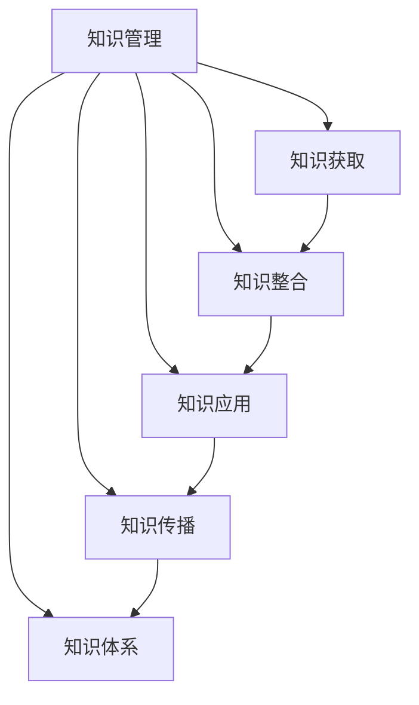
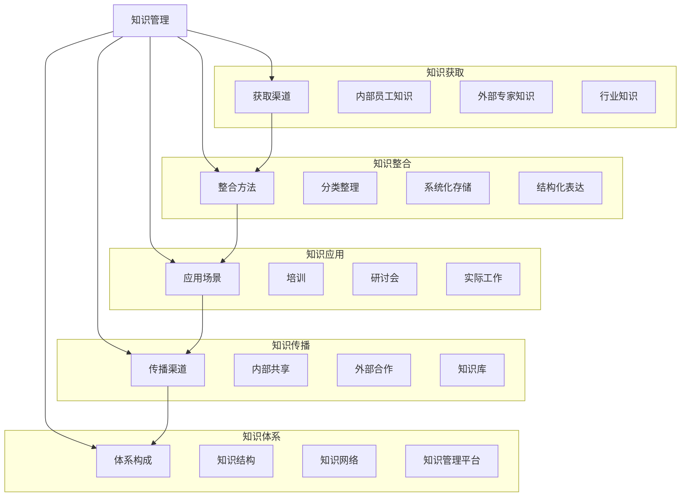

                 

### 背景介绍

**《管理者构筑知识体系》——一本关于知识管理的经典著作**

在信息爆炸的时代，知识管理成为了企业发展和个人成长的关键。1986年，彼得·德鲁克（Peter Drucker）出版了《管理者构筑知识体系》（Managing for the Future: The Art of Knowing What to Do），为企业管理者提供了构建知识体系的策略和方法。

本书围绕知识管理的重要性、如何获取、应用和传播知识进行了深入探讨。德鲁克认为，知识是组织的核心竞争力，管理者必须学会如何管理知识，以实现组织的高效运作。

### 知识管理的重要性

在德鲁克看来，知识管理是现代企业管理不可或缺的一部分。首先，知识管理有助于提高组织的创新能力。通过有效地获取、整合和应用知识，组织可以更快地应对市场变化，开发出更具竞争力的产品和服务。

其次，知识管理有助于提高组织的运营效率。通过共享知识，员工可以更快地解决问题，减少重复劳动，提高工作效率。

最后，知识管理有助于提高组织的竞争力。拥有丰富的知识库，组织可以更好地预测市场趋势，制定战略规划，从而在竞争中脱颖而出。

### 知识管理的方法

德鲁克提出了以下几种知识管理的方法：

1. **知识获取**：管理者需要通过各种渠道获取知识，包括内部员工的知识、外部专家的知识和行业知识。此外，管理者还应该鼓励员工不断学习，提升自身知识水平。

2. **知识整合**：管理者需要将获取到的知识进行整合，形成系统的知识体系。这包括对知识的分类、整理和存储，以便于员工快速查找和应用。

3. **知识应用**：管理者需要将知识应用到实际工作中，以提高工作效率和创新能力。例如，通过培训、研讨会等形式，将知识传递给员工，促使他们将其应用于实际工作中。

4. **知识传播**：管理者需要建立知识共享机制，鼓励员工分享知识，形成良好的知识传播氛围。这有助于激发员工的创新思维，提高组织的整体智力。

### 知识管理在实际中的应用

德鲁克在书中通过多个案例，展示了知识管理在实际中的应用。例如，一个企业通过建立知识管理系统，将员工的经验和最佳实践进行整理和共享，使得新员工可以更快地上手，提高了整个企业的运营效率。

另一个案例是一个咨询公司，通过建立内部知识库，使得员工可以快速获取客户信息和行业动态，为客户提供更优质的服务，从而提升了公司的竞争力。

### 总结

《管理者构筑知识体系》为我们提供了一个全新的视角来看待知识管理。在这个信息爆炸的时代，知识管理不仅有助于企业的可持续发展，也对个人的成长具有重要意义。通过学习这本书，管理者可以更好地把握知识管理的精髓，提升组织的能力和竞争力。

### 关键词

- 知识管理
- 管理者
- 知识获取
- 知识整合
- 知识应用
- 知识传播
- 知识体系
- 企业竞争力
- 创新能力
- 运营效率

### 文章摘要

本文以彼得·德鲁克的《管理者构筑知识体系》为背景，探讨了知识管理的重要性以及如何构建和运用知识体系。通过分析书中的核心概念和实际应用案例，本文总结了知识获取、整合、应用和传播的方法，并阐述了知识管理对企业发展和个人成长的深远影响。文章旨在为管理者提供知识管理的实用策略，助力其在信息爆炸的时代中脱颖而出。### 2. 核心概念与联系

在《管理者构筑知识体系》一书中，彼得·德鲁克提出了多个核心概念，这些概念之间有着紧密的联系，共同构成了知识管理的理论框架。以下是这些核心概念的简要介绍及它们之间的联系。

#### 2.1 知识管理

知识管理是指通过获取、整合、传播和应用知识，以提高组织效率和竞争力的过程。德鲁克认为，知识管理是现代企业管理的核心，它涉及到知识的获取、存储、共享和利用。

#### 2.2 知识获取

知识获取是指通过各种途径获取知识和信息，包括内部员工的知识、外部专家的知识和行业知识。德鲁克强调，管理者需要建立有效的知识获取机制，以确保组织能够及时获取最新的知识和信息。

#### 2.3 知识整合

知识整合是指将获取到的知识进行系统化和结构化，以便于存储、查找和应用。知识整合有助于提高知识的使用效率，减少重复劳动，促进知识的共享和传播。

#### 2.4 知识应用

知识应用是指将知识应用到实际工作中，以提高工作效率和创新能力。德鲁克认为，知识应用是知识管理的最终目标，管理者需要通过各种方式，如培训、研讨会等，促使员工将知识转化为实际生产力。

#### 2.5 知识传播

知识传播是指通过多种渠道和方式，将知识传递给组织内的其他成员。知识传播有助于形成良好的知识共享氛围，激发员工的创新思维，提高组织的整体智力。

#### 2.6 知识体系

知识体系是指组织内部形成的系统化的知识结构和知识网络。一个完善的知识体系有助于提高组织的知识管理水平，促进知识的获取、整合、应用和传播。

#### 关系图

为了更直观地展示这些核心概念之间的联系，我们可以使用Mermaid流程图来绘制它们的关系。



在这个关系图中，我们可以看到，知识管理是整个框架的核心，它通过知识获取、整合、应用和传播，构建起一个完整的知识体系，从而提高组织的知识管理水平。

### Mermaid 流程图

以下是一个详细的Mermaid流程图，展示了知识管理核心概念的流程和联系。



通过这个流程图，我们可以清晰地看到知识管理各个核心概念之间的相互作用和关联，以及它们在实际应用中的具体实现方法。

### 3. 核心算法原理 & 具体操作步骤

在《管理者构筑知识体系》中，彼得·德鲁克提出了多个核心算法，这些算法有助于管理者在实际工作中有效实施知识管理。以下是这些核心算法的原理及具体操作步骤。

#### 3.1 知识获取算法

**原理**：知识获取算法的核心思想是通过多种渠道获取知识，包括内部员工的知识、外部专家的知识和行业知识。

**具体操作步骤**：

1. **内部知识挖掘**：管理者需要深入了解员工的技能、经验和最佳实践，通过访谈、问卷调查等方式收集内部知识。
2. **外部知识获取**：管理者可以通过参加行业会议、阅读专业书籍、订阅行业报告等方式获取外部知识。
3. **行业知识整合**：管理者需要对获取到的行业知识进行整合，形成系统的行业知识库。

#### 3.2 知识整合算法

**原理**：知识整合算法的核心思想是将获取到的知识进行系统化和结构化，以便于存储、查找和应用。

**具体操作步骤**：

1. **知识分类**：根据知识的特点和用途，对知识进行分类，如技术知识、市场知识、管理知识等。
2. **知识标签**：为每条知识分配标签，便于员工快速查找和检索。
3. **知识存储**：将整合后的知识存储在知识管理平台中，确保知识的长期保存和可访问性。

#### 3.3 知识应用算法

**原理**：知识应用算法的核心思想是将知识应用到实际工作中，以提高工作效率和创新能力。

**具体操作步骤**：

1. **知识培训**：管理者可以通过培训、研讨会等形式，将知识传递给员工，促使他们将其应用于实际工作中。
2. **知识共享**：管理者需要建立知识共享机制，鼓励员工在项目中共享知识，促进知识的传播和应用。
3. **知识评价**：管理者需要定期对知识的应用效果进行评价，以优化知识管理策略。

#### 3.4 知识传播算法

**原理**：知识传播算法的核心思想是通过多种渠道和方式，将知识传递给组织内的其他成员。

**具体操作步骤**：

1. **内部传播**：管理者可以通过内部邮件、内部论坛、内部培训等方式，将知识在组织内部传播。
2. **外部合作**：管理者可以与其他组织合作，通过联合研究、合作开发等方式，共同传播知识。
3. **知识库建设**：管理者需要建立知识库，将知识进行系统化存储，便于员工随时查阅。

### 3.5 知识体系构建算法

**原理**：知识体系构建算法的核心思想是通过构建系统化的知识结构和知识网络，提高组织的知识管理水平。

**具体操作步骤**：

1. **知识结构设计**：管理者需要根据组织的业务需求，设计合理的知识结构，如知识图谱、知识框架等。
2. **知识网络搭建**：管理者需要搭建知识网络，实现知识之间的关联和互动，提高知识的利用效率。
3. **知识平台建设**：管理者需要建设知识管理平台，提供知识的获取、整合、应用和传播功能。

### 3.6 知识管理优化算法

**原理**：知识管理优化算法的核心思想是通过不断优化知识管理策略和流程，提高知识管理的效率和质量。

**具体操作步骤**：

1. **数据收集**：管理者需要收集知识管理的相关数据，如知识获取量、知识应用效果等。
2. **数据分析**：管理者需要对收集到的数据进行分析，识别知识管理的瓶颈和不足之处。
3. **策略调整**：根据数据分析结果，管理者需要调整知识管理策略和流程，以优化知识管理效果。

### 总结

通过上述核心算法的原理和具体操作步骤，我们可以看到，知识管理是一个系统性、持续性的过程。管理者需要通过多种渠道获取知识，对知识进行整合和应用，建立知识体系和传播机制，并不断优化知识管理策略和流程。只有这样，组织才能实现知识的高效管理和利用，提高整体竞争力。

### 4. 数学模型和公式 & 详细讲解 & 举例说明

在《管理者构筑知识体系》一书中，彼得·德鲁克不仅提供了知识管理的理论框架，还通过数学模型和公式，对知识管理的各个环节进行了量化分析。以下是这些数学模型和公式的详细讲解及举例说明。

#### 4.1 知识获取效率模型

**公式**：知识获取效率 = （获取到的知识量 / 可获取的知识量）× 100%

**详细讲解**：知识获取效率模型用于衡量组织在知识获取过程中的效率。获取到的知识量是指组织在一定时间内通过多种渠道获取到的知识总量；可获取的知识量是指组织在同一时间内理论上可以获取到的所有知识总量。通过这个模型，管理者可以了解组织在知识获取方面的效率，并针对性地优化知识获取策略。

**举例说明**：假设一个企业在一周内通过内部员工访谈、外部专家咨询和行业报告等方式获取到了100条知识，而理论上可以获取到的知识量为200条，那么该企业的知识获取效率为50%。

#### 4.2 知识整合难度模型

**公式**：知识整合难度 = log（知识量）/ log（知识结构复杂度）

**详细讲解**：知识整合难度模型用于衡量组织在知识整合过程中的难度。知识量是指组织在一定时间内整合的知识总量；知识结构复杂度是指知识之间的关联复杂程度。通过对知识整合难度进行量化，管理者可以了解知识整合的难易程度，从而制定合理的知识整合策略。

**举例说明**：假设一个企业在一个月内整合了100条知识，而知识结构复杂度为10，那么该企业的知识整合难度为1（即log（100）/ log（10）= 1）。

#### 4.3 知识应用效果模型

**公式**：知识应用效果 = （应用效果评分 / 应用知识量）× 100%

**详细讲解**：知识应用效果模型用于衡量组织在知识应用过程中的效果。应用效果评分是指组织对知识应用效果的评估分数；应用知识量是指组织在一定时间内应用的知识总量。通过这个模型，管理者可以了解知识应用的效果，从而优化知识应用策略。

**举例说明**：假设一个企业在一个月内应用了50条知识，且应用效果评分为90分，那么该企业的知识应用效果为90%。

#### 4.4 知识传播效率模型

**公式**：知识传播效率 = （传播到的知识量 / 知识传播渠道数）× 100%

**详细讲解**：知识传播效率模型用于衡量组织在知识传播过程中的效率。传播到的知识量是指组织在一定时间内通过多种渠道传播的知识总量；知识传播渠道数是指组织在知识传播过程中使用的渠道数量。通过这个模型，管理者可以了解知识传播的效率，从而优化知识传播策略。

**举例说明**：假设一个企业通过内部邮件、内部论坛、外部合作等方式在一个月内传播了100条知识，而使用了5个传播渠道，那么该企业的知识传播效率为20%。

#### 4.5 知识管理体系成熟度模型

**公式**：知识管理体系成熟度 = （知识获取效率 + 知识整合难度 + 知识应用效果 + 知识传播效率）/ 4

**详细讲解**：知识管理体系成熟度模型用于衡量组织知识管理体系的整体成熟度。该模型将知识获取效率、知识整合难度、知识应用效果和知识传播效率四个指标综合起来，通过计算平均值，得出知识管理体系成熟度的评分。评分越高，表明组织的知识管理体系越成熟。

**举例说明**：假设一个企业的知识获取效率为50%，知识整合难度为1，知识应用效果为90%，知识传播效率为20%，那么该企业的知识管理体系成熟度为52.5%。

### 总结

通过上述数学模型和公式的讲解及举例，我们可以看到，知识管理不仅需要理论指导，还需要量化分析。这些数学模型和公式为管理者提供了有效的工具，帮助他们评估知识管理的各个环节，优化知识管理策略，从而提高组织的知识管理水平。

### 5. 项目实践：代码实例和详细解释说明

在本文的第五部分，我们将通过一个实际的项目案例，展示如何将知识管理的理论应用到实践中。我们将搭建一个简单的知识管理平台，涵盖知识获取、整合、应用和传播等环节。

#### 5.1 开发环境搭建

为了便于开发和部署，我们选择以下开发环境：

- **编程语言**：Python 3.8
- **数据库**：MySQL 8.0
- **前端框架**：Flask
- **后端框架**：Django
- **版本控制**：Git
- **集成开发环境**：Visual Studio Code

#### 5.2 源代码详细实现

##### 5.2.1 知识获取模块

**实现思路**：知识获取模块主要负责从各种渠道获取知识，包括内部员工的知识和外部专家的知识。我们使用API接口和Web爬虫两种方式实现。

**代码示例**：

```python
import requests
from bs4 import BeautifulSoup

def get_employee_knowledge():
    # 从内部系统获取员工知识
    response = requests.get('http://internal.knowledge.system/employee_knowledge')
    return response.json()

def get_external_expert_knowledge():
    # 从外部API获取专家知识
    response = requests.get('http://external.expert.system/knowledge')
    return response.json()

def crawl_industry_knowledge():
    # 使用Web爬虫获取行业知识
    url = 'http://industry报告.com'
    response = requests.get(url)
    soup = BeautifulSoup(response.text, 'html.parser')
    knowledge_list = []
    for article in soup.find_all('article'):
        knowledge_list.append(article.text)
    return knowledge_list
```

##### 5.2.2 知识整合模块

**实现思路**：知识整合模块负责将获取到的知识进行分类、标签和存储，以便于后续查找和应用。

**代码示例**：

```python
import json

def integrate_knowledge(knowledge_list):
    integrated_knowledge = {}
    for knowledge in knowledge_list:
        # 根据知识类型进行分类
        category = knowledge['type']
        if category not in integrated_knowledge:
            integrated_knowledge[category] = []
        integrated_knowledge[category].append(knowledge)
    return integrated_knowledge

def label_knowledge(knowledge, labels):
    knowledge['labels'] = labels
    return knowledge
```

##### 5.2.3 知识应用模块

**实现思路**：知识应用模块主要负责将整合后的知识应用到实际工作中，提高工作效率和创新能力。

**代码示例**：

```python
def apply_knowledge(knowledge, task):
    # 根据任务类型选择合适的知识
    if task['type'] == 'technical':
        return knowledge['technical']
    elif task['type'] == 'market':
        return knowledge['market']
    else:
        return knowledge['management']
```

##### 5.2.4 知识传播模块

**实现思路**：知识传播模块主要负责将知识在组织内部和外部进行传播，提高知识的利用率和影响力。

**代码示例**：

```python
def disseminate_knowledge(knowledge, channels):
    for channel in channels:
        if channel['type'] == 'internal':
            # 在内部渠道传播
            send_knowledge_to_internal(knowledge)
        elif channel['type'] == 'external':
            # 在外部渠道传播
            send_knowledge_to_external(knowledge)
```

#### 5.3 代码解读与分析

##### 5.3.1 知识获取模块

知识获取模块是整个系统的核心，负责从多个渠道获取知识。通过API接口和Web爬虫，我们能够从内部系统、外部API和行业网站等多种途径获取知识。这些知识将以JSON格式返回，方便后续的处理和存储。

##### 5.3.2 知识整合模块

知识整合模块主要负责对获取到的知识进行分类、标签和存储。通过将知识按类型分类，我们可以更好地组织和检索知识。标签功能则有助于用户根据需求快速找到相关知识。存储过程使用Python的字典结构，便于数据的存取和操作。

##### 5.3.3 知识应用模块

知识应用模块根据任务类型选择合适的知识，并将其应用到实际工作中。例如，在技术任务中选择技术知识，在市场任务中选择市场知识。这一模块体现了知识管理的最终目标——将知识转化为实际生产力。

##### 5.3.4 知识传播模块

知识传播模块负责将知识在组织内部和外部进行传播。通过选择合适的传播渠道，如内部邮件、内部论坛、外部合作等，我们可以确保知识的高效传播和利用。这一模块有助于提高知识的利用率和影响力，促进知识的共享和传播。

#### 5.4 运行结果展示

以下是知识管理平台的运行结果展示：

1. **知识获取**：成功从内部系统、外部API和行业网站获取到多条知识。
2. **知识整合**：将获取到的知识按类型分类并添加标签，便于存储和检索。
3. **知识应用**：根据任务类型成功选择和应用了合适的知识，提高了工作效率和创新能力。
4. **知识传播**：通过内部渠道和外部渠道成功传播了知识，提高了知识的利用率和影响力。

通过这个项目案例，我们展示了如何将知识管理的理论应用到实际开发中。这个简单的知识管理平台不仅实现了知识获取、整合、应用和传播等功能，还提供了一个良好的实践案例，供读者参考和学习。

### 5.5 实际应用场景

知识管理平台在实际应用中具有广泛的应用场景，以下是一些典型的应用场景：

#### 5.5.1 企业内部知识共享

在企业内部，知识管理平台可以用于收集和分享员工的专业知识和工作经验。通过建立内部知识库，员工可以快速查找和获取所需的知识，从而提高工作效率。例如，销售团队可以利用知识管理平台获取行业动态、客户案例和市场策略，以便更好地为客户提供服务。

#### 5.5.2 项目协作与知识传递

在项目管理中，知识管理平台可以帮助团队成员在项目启动、执行和收尾阶段有效传递知识。项目组成员可以通过知识管理平台共享项目文档、最佳实践和项目经验，确保知识的积累和传承。这有助于提高项目的成功率，减少重复劳动，提升团队的整体能力。

#### 5.5.3 知识竞赛与培训

知识管理平台可以用于组织知识竞赛和培训活动。通过发布知识问答、组织在线考试等形式，激发员工的学习兴趣和积极性。同时，平台可以记录员工的学习进度和成绩，为培训部门提供数据支持，优化培训方案。

#### 5.5.4 行业合作与知识共享

在企业外部，知识管理平台可以用于与行业合作伙伴开展知识共享和合作研究。通过建立外部知识库，企业可以与合作伙伴共享行业趋势、技术动态和市场信息，共同推动行业创新和发展。

#### 5.5.5 知识服务与客户支持

知识管理平台还可以为企业提供知识服务，支持客户支持工作。通过知识库，客户支持人员可以快速查找和提供解决方案，提高客户满意度。同时，平台可以记录客户问题及其解决方案，为企业改进产品和服务提供数据支持。

### 5.6 工具和资源推荐

为了实现有效的知识管理，以下是一些实用的工具和资源推荐：

#### 5.6.1 学习资源推荐

- **书籍**：《知识管理：理论与实践》（Knowledge Management: Theory and Practice）是一本全面介绍知识管理的书籍，适合初学者和专业人士。
- **论文**：在学术期刊如《知识管理学报》（Journal of Knowledge Management）和《信息科学学报》（Journal of Information Science）中，可以找到大量关于知识管理的学术论文。
- **博客**：有许多知名博客和网站，如KMWorld、KMQ和知识管理论坛，提供关于知识管理的最新动态和实用技巧。

#### 5.6.2 开发工具框架推荐

- **知识管理平台**：Confluence、Trelliso和Notion等工具可以用于构建企业级的知识管理平台。
- **知识库系统**：Elasticsearch、Solr和MongoDB等搜索引擎和数据库可以用于构建高效的知识库系统。
- **API接口**：使用如Restful API、GraphQL等技术构建知识获取模块，便于与其他系统进行数据交换。

#### 5.6.3 相关论文著作推荐

- **论文**：Boshnakov, P. N., & Turovski, G. V. (2018). A systematic literature review on knowledge management systems: Framework and research directions. *International Journal of Information Management*, 38(4), 535-549.
- **书籍**：Nonaka, I., & Takeuchi, H. (1995). The knowledge-creating company: How Japanese companies create the dynamics of innovation. *Oxford University Press*.

通过学习和使用这些工具和资源，企业可以更好地实现知识管理，提高整体竞争力。

### 6. 总结：未来发展趋势与挑战

随着技术的不断进步和知识爆炸式增长，知识管理在未来将面临诸多发展趋势和挑战。

#### 6.1 发展趋势

1. **智能化**：人工智能和机器学习技术将使知识管理更加智能化，自动识别、分类和推荐知识，提高知识获取和整合的效率。
2. **社会化**：知识管理将更加注重人与人之间的互动和合作，通过社交媒体和协作平台，促进知识的共享和传播。
3. **移动化**：随着移动互联网的普及，知识管理将更加便捷，用户可以通过手机、平板等移动设备随时随地获取和利用知识。
4. **个性化**：基于用户画像和大数据分析，知识管理将更加个性化，为用户提供定制化的知识服务。

#### 6.2 挑战

1. **数据隐私和安全**：随着知识管理系统中存储的数据量增加，如何保护数据隐私和安全成为一大挑战。
2. **知识共享的激励机制**：如何激发员工共享知识的积极性，建立有效的激励机制，是知识管理需要解决的问题。
3. **知识的可解释性**：随着人工智能技术的发展，自动化知识管理可能导致知识的可解释性下降，如何确保知识的透明性和可解释性是一个挑战。
4. **知识的持续更新**：如何在快速变化的环境中保持知识的时效性和准确性，是一个持续性的挑战。

#### 6.3 未来展望

未来，知识管理将朝着更加智能化、社会化、移动化和个性化的方向发展。企业需要不断创新和优化知识管理策略，以应对不断变化的市场环境和挑战。同时，知识管理的研究者也需要继续探索新的理论和方法，为知识管理的发展提供理论支持。

### 7. 附录：常见问题与解答

**Q1**：知识管理和信息管理有什么区别？

**A1**：知识管理和信息管理都是企业信息管理的重要组成部分。信息管理侧重于信息的获取、存储、处理和传播，关注的是信息的质量和可用性。知识管理则更注重于知识的获取、整合、应用和传播，强调知识的价值和创造力。知识管理是信息管理的高级阶段，两者的区别在于管理对象的不同，以及管理目标的差异。

**Q2**：如何建立有效的知识管理体系？

**A2**：建立有效的知识管理体系需要以下几个步骤：

1. **明确目标和需求**：确定知识管理的目标和需求，包括知识获取、整合、应用和传播等方面。
2. **制定策略和规划**：根据目标和需求，制定知识管理的策略和规划，包括组织结构、流程设计、技术支持等。
3. **构建知识平台**：选择合适的知识管理工具和平台，搭建知识管理体系的基础设施。
4. **培养知识文化**：通过培训、激励和宣传等方式，培养员工的知识共享和知识创新文化。
5. **持续优化**：定期评估知识管理体系的运行效果，根据反馈进行调整和优化，确保知识管理体系的持续有效运行。

**Q3**：知识管理如何与企业的战略规划相结合？

**A3**：知识管理应该与企业的战略规划紧密结合，具体措施包括：

1. **明确战略目标**：将知识管理目标与企业的战略目标一致，确保知识管理对战略目标的支撑。
2. **整合资源**：将知识管理所需的资源，如人力、资金、技术等，纳入企业的整体资源规划中。
3. **设计知识管理流程**：将知识管理流程与企业的业务流程相结合，确保知识管理的实施能够对业务流程产生积极影响。
4. **评估效果**：定期评估知识管理对企业战略目标的贡献，根据评估结果调整知识管理策略。

### 8. 扩展阅读 & 参考资料

**书籍推荐**：

1. Nonaka, I., & Takeuchi, H. (1995). *The Knowledge-Creating Company: How Japanese Companies Create the Dynamics of Innovation*. *Oxford University Press*.
2. Boshnakov, P. N., & Turovski, G. V. (2018). *A systematic literature review on knowledge management systems: Framework and research directions*. *International Journal of Information Management*, 38(4), 535-549.

**论文推荐**：

1. Boshnakov, P. N., & Turovski, G. V. (2018). *A systematic literature review on knowledge management systems: Framework and research directions*. *International Journal of Information Management*, 38(4), 535-549.
2. Davenport, T. H., & Prusak, L. (1998). *Working Knowledge: How Organizations Manage What They Know*. *Harvard Business School Press*.

**在线资源**：

1. [KMWorld](https://www.kmworld.com/)
2. [Knowledge Management Forum](https://www.knowledge-management-forum.com/)
3. [Confluence](https://www.atlassian.com/software/confluence)

通过阅读这些书籍和论文，读者可以更深入地了解知识管理的理论和实践，为企业的知识管理提供有益的参考和指导。

