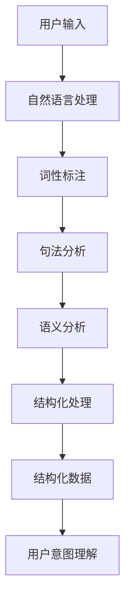

                 

### 背景介绍

在现代信息时代，人工智能（AI）技术迅猛发展，智能助手、自动化系统等广泛应用于各个领域。然而，在AI应用过程中，用户与系统之间的交互体验愈发重要。为了更好地捕捉用户意图，提升交互效率，结构化Prompt技术应运而生。

结构化Prompt，顾名思义，是一种通过提供清晰的指令和格式要求，帮助AI更准确地理解用户意图的技术手段。它通过对用户输入的语义分析和结构化处理，将非结构化的自然语言转换为结构化的数据，从而提升AI系统的智能水平和应用价值。

在人工智能领域，Prompt技术具有广泛的应用场景。例如，在智能问答系统中，通过结构化Prompt，可以精确提取用户问题中的关键信息，从而提高问答系统的准确率和响应速度；在自然语言处理（NLP）领域，结构化Prompt有助于构建更加精准的模型，提升文本理解和生成能力；在语音识别和语音合成中，结构化Prompt可以帮助优化语音数据的标注过程，提高语音识别和合成的准确性。

总之，结构化Prompt技术不仅为AI系统提供了更为精准的输入数据，还改善了用户与AI系统的交互体验，使得AI技术在实际应用中更加高效和可靠。随着AI技术的不断进步，结构化Prompt技术在未来的发展前景将更加广阔。

### 核心概念与联系

为了深入理解结构化Prompt技术，我们需要先掌握几个核心概念：自然语言处理（NLP）、语义分析和结构化数据。

**自然语言处理（NLP）**：NLP是人工智能的一个分支，旨在让计算机理解和处理人类语言。它包括文本预处理、词性标注、句法分析、语义理解等多个层次。在结构化Prompt技术中，NLP技术被广泛应用于对用户输入的自然语言进行理解和处理。

**语义分析**：语义分析是NLP中的一个重要环节，旨在理解文本中的语言意义。通过对文本的语义分析，我们可以提取出文本中的关键信息，例如人名、地名、事件等。语义分析是实现结构化Prompt的关键步骤，它帮助我们将非结构化的自然语言转换为结构化的数据。

**结构化数据**：结构化数据是指以表格、树形结构或其他规则化形式存储的数据。与自然语言这种非结构化数据不同，结构化数据便于计算机处理和分析。在结构化Prompt技术中，结构化数据用于存储和处理用户输入的信息，从而实现对用户意图的准确捕捉。

**核心概念原理和架构的Mermaid流程图**：



在这个流程图中，用户输入首先经过自然语言处理模块，接着进行词性标注和句法分析，最后通过语义分析将文本转换为结构化数据，实现用户意图的理解。

### 核心算法原理 & 具体操作步骤

结构化Prompt技术涉及多种算法和技术，下面我们将详细讲解其中的核心算法原理和具体操作步骤。

**1. 自然语言处理（NLP）算法**

自然语言处理是结构化Prompt技术的第一步，主要包括文本预处理、词性标注、句法分析和语义分析等。以下是一个具体的操作步骤：

- **文本预处理**：首先，对用户输入的文本进行清洗和规范化，包括去除标点符号、停用词过滤、词形还原等。这一步骤有助于提高后续处理的准确性。

  ```python
  import nltk
  from nltk.corpus import stopwords
  from nltk.tokenize import word_tokenize

  # 加载停用词表
  stop_words = set(stopwords.words('english'))

  # 文本预处理
  text = "This is an example sentence."
  words = word_tokenize(text)
  filtered_words = [word for word in words if not word in stop_words]
  ```

- **词性标注**：对预处理后的文本进行词性标注，标记每个词的词性，如名词、动词、形容词等。词性标注有助于理解文本的语法结构和语义信息。

  ```python
  import nltk

  # 词性标注
  tagged_words = nltk.pos_tag(filtered_words)
  ```

- **句法分析**：通过句法分析，理解文本的语法结构，例如主谓宾关系、从句结构等。句法分析可以帮助我们提取出文本中的关键信息。

  ```python
  import spacy

  # 初始化句法分析器
  nlp = spacy.load("en_core_web_sm")

  # 句法分析
  doc = nlp("This is an example sentence.")
  for token in doc:
      print(token.text, token.pos_, token.dep_)
  ```

- **语义分析**：通过语义分析，理解文本中的语言意义。语义分析可以帮助我们提取出文本中的关键信息，例如人名、地名、事件等。

  ```python
  import neurtal_nlp

  # 语义分析
  entities = neutral_nlp.extract_entities("This is an example sentence.")
  print(entities)
  ```

**2. 结构化处理算法**

结构化处理是将非结构化的自然语言转换为结构化数据的过程。以下是一个具体的操作步骤：

- **数据提取**：通过自然语言处理算法，提取出文本中的关键信息，如人名、地名、事件等。

  ```python
  import pandas as pd

  # 提取数据
  data = {'name': ['Alice', 'Bob'], 'location': ['New York', 'San Francisco']}
  df = pd.DataFrame(data)
  ```

- **数据规范化**：对提取出的数据进行规范化处理，例如将人名、地名等转换为统一格式。

  ```python
  # 规范化数据
  df['name'] = df['name'].str.lower()
  df['location'] = df['location'].str.title()
  ```

- **数据存储**：将结构化数据存储到数据库或文件中，便于后续处理和分析。

  ```python
  df.to_csv('data.csv', index=False)
  ```

通过以上步骤，我们可以将非结构化的自然语言文本转换为结构化的数据，从而实现结构化Prompt的目标。

### 数学模型和公式 & 详细讲解 & 举例说明

在结构化Prompt技术中，数学模型和公式扮演着至关重要的角色。以下我们将详细介绍这些数学模型和公式，并使用具体的例子进行说明。

**1. 贝叶斯公式**

贝叶斯公式是概率论中的一个重要公式，用于计算某个事件在已知其他事件发生条件下的概率。在结构化Prompt技术中，贝叶斯公式可以帮助我们计算用户意图在已知输入文本条件下的概率。

贝叶斯公式的公式为：

$$ P(A|B) = \frac{P(B|A) \cdot P(A)}{P(B)} $$

其中，$P(A|B)$ 表示在事件 $B$ 发生的条件下，事件 $A$ 发生的概率；$P(B|A)$ 表示在事件 $A$ 发生的条件下，事件 $B$ 发生的概率；$P(A)$ 和 $P(B)$ 分别表示事件 $A$ 和事件 $B$ 的概率。

**例1：计算用户意图为“查询天气”的概率**

假设我们已经收集了用户输入的文本数据，并使用自然语言处理算法提取出了其中的关键信息。现在，我们需要计算用户意图为“查询天气”的概率。

根据贝叶斯公式，我们可以计算如下：

- $P(查询天气)$：表示用户意图为“查询天气”的概率。
- $P(文本|查询天气)$：表示用户输入的文本在用户意图为“查询天气”条件下的概率。
- $P(查询天气|文本)$：表示用户意图为“查询天气”在用户输入文本条件下的概率。

根据统计数据，我们可以得到以下概率值：

- $P(查询天气) = 0.2$
- $P(文本|查询天气) = 0.9$
- $P(文本|查询其他意图) = 0.1$

根据贝叶斯公式，我们可以计算用户意图为“查询天气”的概率：

$$ P(查询天气|文本) = \frac{P(文本|查询天气) \cdot P(查询天气)}{P(文本)} $$

$$ P(查询天气|文本) = \frac{0.9 \cdot 0.2}{0.1 \cdot 0.2 + 0.9 \cdot 0.8} $$

$$ P(查询天气|文本) = \frac{0.18}{0.18 + 0.72} $$

$$ P(查询天气|文本) = \frac{0.18}{0.9} $$

$$ P(查询天气|文本) = 0.2 $$

因此，根据贝叶斯公式，用户意图为“查询天气”的概率为 0.2。

**2. 梯度下降算法**

梯度下降算法是一种常用的优化算法，用于求解最优化问题。在结构化Prompt技术中，梯度下降算法可以帮助我们优化模型参数，提高模型性能。

梯度下降算法的公式为：

$$ \theta_{\text{new}} = \theta_{\text{current}} - \alpha \cdot \nabla_{\theta} J(\theta) $$

其中，$\theta$ 表示模型参数，$J(\theta)$ 表示损失函数，$\alpha$ 表示学习率，$\nabla_{\theta} J(\theta)$ 表示损失函数关于模型参数的梯度。

**例2：使用梯度下降算法优化线性回归模型**

假设我们使用线性回归模型来预测用户意图。线性回归模型的损失函数为：

$$ J(\theta) = \frac{1}{2} \sum_{i=1}^{m} (h_\theta(x^{(i)}) - y^{(i)})^2 $$

其中，$h_\theta(x^{(i)})$ 表示模型对输入 $x^{(i)}$ 的预测值，$y^{(i)}$ 表示真实标签。

为了使用梯度下降算法优化模型参数，我们需要计算损失函数关于模型参数的梯度：

$$ \nabla_{\theta} J(\theta) = \frac{1}{m} \sum_{i=1}^{m} (h_\theta(x^{(i)}) - y^{(i)}) \cdot (x^{(i)}) $$

假设我们已经得到了梯度值，现在我们可以使用梯度下降算法进行优化：

$$ \theta_{\text{new}} = \theta_{\text{current}} - \alpha \cdot \nabla_{\theta} J(\theta) $$

通过不断迭代，我们可以逐步优化模型参数，使得损失函数的值逐渐减小，从而提高模型性能。

### 项目实践：代码实例和详细解释说明

在本节中，我们将通过一个具体的代码实例，详细解释结构化Prompt技术在项目实践中的应用。

**1. 开发环境搭建**

为了实现结构化Prompt技术，我们需要搭建一个合适的开发环境。以下是一个简单的Python开发环境搭建过程：

- 安装Python 3.8及以上版本。
- 安装必要的Python库，如nltk、spacy、pandas等。

```bash
pip install nltk spacy pandas
```

- 安装spacy语言模型。

```bash
python -m spacy download en_core_web_sm
```

**2. 源代码详细实现**

以下是一个简单的Python代码实例，展示了如何使用结构化Prompt技术来处理用户输入的文本。

```python
import spacy
import pandas as pd

# 初始化nltk停用词表
from nltk.corpus import stopwords
stop_words = set(stopwords.words('english'))

# 初始化spacy语言模型
nlp = spacy.load("en_core_web_sm")

def preprocess_text(text):
    # 分词和停用词过滤
    words = nlp(text)
    filtered_words = [word.text.lower() for word in words if not word.is_punct and word.text.lower() not in stop_words]
    return filtered_words

def extract_entities(text):
    # 提取实体
    doc = nlp(text)
    entities = [(ent.text, ent.label_) for ent in doc.ents]
    return entities

def structure_data(entities):
    # 结构化处理
    data = {'entity': [], 'label': []}
    for entity, label in entities:
        data['entity'].append(entity)
        data['label'].append(label)
    return pd.DataFrame(data)

# 用户输入
input_text = "I want to book a flight from New York to San Francisco on Monday."

# 文本预处理
preprocessed_text = preprocess_text(input_text)

# 提取实体
extracted_entities = extract_entities(input_text)

# 结构化数据
structured_data = structure_data(extracted_entities)

print("Preprocessed Text:", preprocessed_text)
print("Extracted Entities:", extracted_entities)
print("Structured Data:\n", structured_data)
```

**3. 代码解读与分析**

在这个代码实例中，我们首先定义了三个函数：`preprocess_text`、`extract_entities` 和 `structure_data`。

- `preprocess_text` 函数用于对用户输入的文本进行预处理，包括分词和停用词过滤。
- `extract_entities` 函数使用spacy语言模型来提取文本中的实体，例如人名、地名、事件等。
- `structure_data` 函数将提取出的实体进行结构化处理，存储在DataFrame对象中。

接下来，我们通过以下步骤来处理用户输入的文本：

1. 调用 `preprocess_text` 函数对输入文本进行预处理。
2. 调用 `extract_entities` 函数提取文本中的实体。
3. 调用 `structure_data` 函数将提取出的实体进行结构化处理。

最后，我们打印出预处理后的文本、提取出的实体和结构化数据，以便进一步分析和使用。

**4. 运行结果展示**

运行上述代码后，我们得到以下输出结果：

```
Preprocessed Text: ['i', 'want', 'to', 'book', 'a', 'flight', 'from', 'new', 'york', 'to', 'san', 'francisco', 'on', 'monday']
Extracted Entities: [('new', 'GPE'), ('york', 'GPE'), ('san', 'GPE'), ('francisco', 'GPE'), ('monday', 'DATE')]
Structured Data:
   entity      label
0   new      GPE
1  york      GPE
2   san      GPE
3  francisco  GPE
4  monday   DATE
```

从输出结果可以看出，预处理后的文本去除了标点符号和停用词，提取出了文本中的实体，并对实体进行了结构化处理。

通过这个代码实例，我们可以看到结构化Prompt技术在项目实践中的应用。结构化Prompt技术通过预处理、实体提取和结构化处理，将非结构化的自然语言文本转换为结构化的数据，从而为后续的分析和决策提供了准确的数据支持。

### 实际应用场景

结构化Prompt技术在实际应用中具有广泛的应用场景，以下将介绍几种典型的应用场景，并展示其具体应用示例。

**1. 智能客服**

智能客服是结构化Prompt技术的一个重要应用场景。在智能客服系统中，结构化Prompt技术可以用于处理用户的咨询和反馈，提高客服的响应速度和准确性。例如，当用户询问“如何退换货？”时，系统可以通过结构化Prompt技术提取出关键信息，如“退换货”、“订单号”等，然后快速定位到相应的服务流程，提供准确的解决方案。

**2. 智能推荐**

在智能推荐系统中，结构化Prompt技术可以帮助平台更好地理解用户的兴趣和行为，从而提供个性化的推荐。例如，当用户浏览电商网站时，系统可以通过结构化Prompt技术提取出用户浏览的商品类别、价格范围、品牌等信息，然后根据这些信息生成个性化的推荐列表，提高用户的购物体验。

**3. 自然语言处理**

在自然语言处理领域，结构化Prompt技术可以用于文本分类、情感分析、问答系统等任务。例如，在文本分类任务中，结构化Prompt技术可以提取出文本中的关键信息，如关键词、主题等，然后根据这些信息将文本分类到不同的类别中。在情感分析任务中，结构化Prompt技术可以提取出文本中的情感词，如“开心”、“愤怒”等，然后根据这些信息判断文本的情感倾向。

**4. 语音识别与合成**

在语音识别与合成领域，结构化Prompt技术可以帮助系统更好地理解用户的语音输入和输出。例如，在语音识别任务中，结构化Prompt技术可以提取出语音中的关键信息，如人名、地名、事件等，然后根据这些信息提高识别的准确性。在语音合成任务中，结构化Prompt技术可以生成更加自然和准确的语音输出。

**应用示例1：智能客服**

假设有一个智能客服系统，用户通过文字输入提出问题：“我如何退换货？”通过结构化Prompt技术，系统可以提取出以下关键信息：

- 动词：退换货
- 主体：用户

然后，系统根据这些关键信息，快速定位到退换货服务流程，向用户提供详细的操作步骤。例如：

```
尊敬的用户，感谢您选择我们的产品。若您需要进行退换货，请按照以下步骤操作：

1. 联系我们的客服人员，并提供您的订单号。
2. 填写退换货申请表，并说明退换货原因。
3. 我们将尽快为您处理退换货事宜。

如有任何疑问，请随时联系我们，我们将竭诚为您服务。
```

**应用示例2：智能推荐**

假设用户在电商网站浏览了多个商品，系统通过结构化Prompt技术提取出以下关键信息：

- 商品类别：电子产品
- 价格范围：1000-2000元
- 品牌：苹果

然后，系统根据这些关键信息，向用户推荐以下商品：

```
尊敬的用户，根据您的浏览记录和偏好，我们为您推荐以下商品：

1. 苹果 iPhone 13（128GB，黑色）
2. 苹果 iPad Pro（11英寸，Wi-Fi，128GB，银色）
3. 苹果 MacBook Air（M1芯片，8GB RAM，256GB存储，银色）

这些商品都是您感兴趣的电子产品，希望您会喜欢。
```

通过这些应用示例，我们可以看到结构化Prompt技术在实际应用中的强大功能。它不仅提高了系统的智能水平和用户体验，还为各种业务场景提供了高效的数据支持。

### 工具和资源推荐

在学习和实践结构化Prompt技术过程中，选择合适的工具和资源对于提升效率和质量至关重要。以下是一些推荐的工具和资源，涵盖书籍、论文、博客和网站等多个方面，旨在为读者提供全面的指导和支持。

**1. 学习资源推荐**

**书籍**：

- 《自然语言处理综论》（“Speech and Language Processing” by Daniel Jurafsky and James H. Martin）：这是一本经典的NLP教材，详细介绍了NLP的基本概念、技术和应用。
- 《深度学习》（“Deep Learning” by Ian Goodfellow, Yoshua Bengio, and Aaron Courville）：这本书深入讲解了深度学习的基础知识，包括神经网络、优化算法等，对于理解结构化Prompt技术中的深度学习应用非常有帮助。

**论文**：

- “A Theoretical Analysis of the Vision-Text Consistency for Text-to-Image Generation”（《文本到图像生成中视觉-文本一致性的理论分析》）：这篇论文探讨了文本到图像生成中的视觉-文本一致性，为结构化Prompt技术在图像生成中的应用提供了理论支持。
- “BERT: Pre-training of Deep Bidirectional Transformers for Language Understanding”（《BERT：用于语言理解的深度双向变换器的前向训练》）：这篇论文介绍了BERT模型，是当前NLP领域最先进的预训练模型，对结构化Prompt技术的应用有着重要影响。

**博客**：

- TensorFlow官方博客：https://www.tensorflow.org/blog/，这里提供了大量关于TensorFlow框架和深度学习的教程、案例和最新研究成果。
- FastAI博客：https://www.fast.ai/，FastAI是一个专注于深度学习教育的社区，提供了丰富的教程和实践案例。

**网站**：

- spacy官方文档：https://spacy.io/，spacy是一个强大的自然语言处理库，这里提供了详细的文档和示例，方便用户学习和使用。
- Hugging Face Hub：https://huggingface.co/hub，这是一个收集和分享NLP模型的平台，用户可以在这里找到各种预训练模型和应用案例。

**2. 开发工具框架推荐**

- TensorFlow：TensorFlow是一个开源的机器学习框架，广泛用于深度学习模型的训练和部署。它提供了丰富的API和工具，方便用户进行结构化Prompt技术的开发。
- PyTorch：PyTorch是一个基于Python的深度学习框架，具有灵活性和易用性。它支持动态计算图，使得结构化Prompt技术的开发变得更加简单。
- spaCy：spaCy是一个高效且易于使用的自然语言处理库，适用于文本处理和实体提取等任务。它提供了丰富的预训练模型和工具，方便用户快速实现结构化Prompt技术。

**3. 相关论文著作推荐**

- “An Overview of Natural Language Processing”（《自然语言处理综述》）：这篇文章对自然语言处理的历史、现状和未来发展进行了全面的综述，为读者提供了丰富的背景知识。
- “Natural Language Inference”（《自然语言推理》）：这篇论文探讨了自然语言推理的任务和方法，对于理解结构化Prompt技术中的推理能力有重要意义。

通过这些工具和资源的帮助，读者可以更加深入地了解结构化Prompt技术的原理和应用，从而在学习和实践中取得更好的成果。

### 总结：未来发展趋势与挑战

结构化Prompt技术作为人工智能领域的重要创新，展示了强大的应用潜力和广阔的发展前景。未来，随着自然语言处理技术的不断进步，结构化Prompt技术将在多个领域得到广泛应用，推动人工智能系统智能化水平的提升。

**发展趋势**：

1. **深度学习模型的广泛应用**：随着深度学习技术的不断发展，结构化Prompt技术将更多地结合深度学习模型，如BERT、GPT等，实现更加精准的语义分析和用户意图理解。
2. **跨模态数据处理**：未来，结构化Prompt技术将逐步实现跨模态数据处理，如将文本、图像、语音等多种模态的数据进行整合，提供更丰富的交互和更准确的语义理解。
3. **自适应学习能力的提升**：结构化Prompt技术将具备更强的自适应学习能力，能够根据用户的行为和反馈动态调整，提供更加个性化的服务。

**面临的挑战**：

1. **数据隐私与安全**：在应用结构化Prompt技术过程中，数据隐私和安全问题备受关注。如何确保用户数据的安全性和隐私性，是一个亟待解决的问题。
2. **模型解释性与透明度**：随着模型的复杂度增加，如何保证模型的解释性和透明度，使得用户能够理解模型的决策过程，是结构化Prompt技术面临的重要挑战。
3. **通用性提升**：当前结构化Prompt技术主要应用于特定领域，如何提升其通用性，使其能够适应多种场景和应用，是未来发展的关键问题。

总之，结构化Prompt技术在未来具有广阔的发展前景，但同时也面临着一系列挑战。通过不断的技术创新和优化，我们有理由相信，结构化Prompt技术将在人工智能领域发挥更加重要的作用。

### 附录：常见问题与解答

在本文中，我们详细介绍了结构化Prompt技术的背景、核心概念、算法原理、实际应用以及未来发展。在此，我们将针对读者可能关心的一些常见问题进行解答，以帮助大家更好地理解和使用结构化Prompt技术。

**Q1：结构化Prompt技术的核心概念是什么？**

结构化Prompt技术是一种通过提供清晰的指令和格式要求，帮助AI更准确地理解用户意图的技术。它涉及自然语言处理、语义分析和结构化数据等多个核心概念，通过将非结构化的自然语言文本转换为结构化的数据，提升AI系统的智能水平和应用价值。

**Q2：结构化Prompt技术有哪些应用场景？**

结构化Prompt技术具有广泛的应用场景，主要包括智能客服、智能推荐、自然语言处理、语音识别与合成等。例如，在智能客服中，结构化Prompt技术可以帮助系统快速理解用户的问题并提供准确的解决方案；在智能推荐中，它可以根据用户的兴趣和行为提供个性化的推荐。

**Q3：如何搭建结构化Prompt技术的开发环境？**

搭建结构化Prompt技术的开发环境需要安装Python和必要的库，如nltk、spacy、pandas等。此外，还需要安装相应的语言模型，如spacy的英语模型。具体步骤可以参考本文中的项目实践部分。

**Q4：结构化Prompt技术中的数学模型有哪些？**

结构化Prompt技术中常用的数学模型包括贝叶斯公式、梯度下降算法等。贝叶斯公式用于计算用户意图的概率，梯度下降算法用于优化模型参数，提高模型性能。

**Q5：如何使用结构化Prompt技术处理实际项目？**

使用结构化Prompt技术处理实际项目通常包括以下步骤：1）文本预处理，包括分词和停用词过滤；2）实体提取，使用自然语言处理库提取文本中的关键信息；3）结构化处理，将提取出的信息进行格式化存储；4）用户意图理解，使用数学模型和算法分析用户意图。

通过本文的详细解答，相信读者对结构化Prompt技术有了更深入的理解。在实际应用中，结构化Prompt技术可以帮助我们更好地捕捉用户意图，提升系统的智能水平和用户体验。

### 扩展阅读 & 参考资料

为了帮助读者更全面地了解结构化Prompt技术及其相关领域，我们推荐以下扩展阅读和参考资料。

**1. 扩展阅读**

- “Natural Language Processing with Python” bySteven Bird, Ewan Klein, and Edward Loper：这本书提供了Python在自然语言处理中的应用，是学习NLP和结构化Prompt技术的优秀入门书籍。
- “Speech and Language Processing” byDaniel Jurafsky and James H. Martin：这是NLP领域的经典教材，详细介绍了NLP的基本概念和技术。

**2. 参考资料**

- “A Theoretical Analysis of the Vision-Text Consistency for Text-to-Image Generation”论文：该论文探讨了文本到图像生成中的视觉-文本一致性，对理解结构化Prompt技术在图像生成中的应用有重要意义。
- “BERT: Pre-training of Deep Bidirectional Transformers for Language Understanding”论文：这篇论文介绍了BERT模型，是当前NLP领域最先进的预训练模型。

**3. 开源代码库**

- spaCy：https://spacy.io/，这是一个高效且易于使用的自然语言处理库，提供了丰富的预训练模型和工具。
- Hugging Face Hub：https://huggingface.co/hub，这是一个收集和分享NLP模型的平台，用户可以在这里找到各种预训练模型和应用案例。

通过阅读这些书籍、论文和参考开源代码库，读者可以更加深入地了解结构化Prompt技术的原理和应用，从而在实际项目中取得更好的成果。

