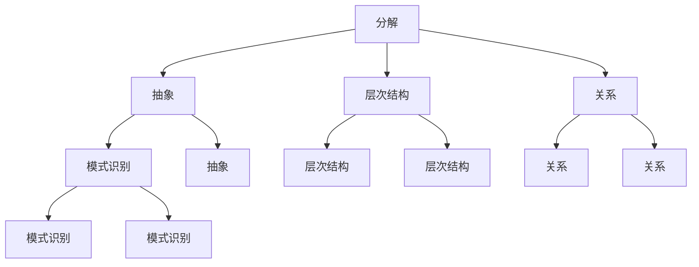
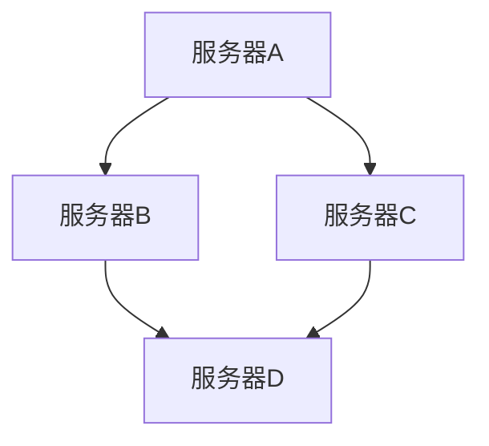

                 

### 1. 背景介绍

结构化思维是一种系统性的思考方式，它通过将复杂的信息分解成更小的、易于管理的部分，从而帮助人们更有效地理解、分析和解决问题。在信息技术领域，结构化思维的应用尤为重要。它不仅能够帮助程序员编写清晰、可维护的代码，还能够指导系统架构师构建高效、可靠的系统。本文将深入探讨结构化思维的原理与应用，旨在帮助读者掌握这一关键技能。

#### 1.1 结构化思维的重要性

在当今这个信息爆炸的时代，如何从海量数据中提取有价值的信息，如何将复杂的问题简化成易于理解和解决的形式，成为了一个至关重要的挑战。结构化思维提供了一种有效的解决途径。它通过以下三个方面提升了信息处理的效率：

1. **问题解析**：结构化思维能够将复杂的问题分解成更小、更具体的子问题，从而简化了解决过程的难度。
2. **信息组织**：通过结构化思维，信息可以被系统地组织起来，使其更具条理性和可读性。
3. **决策制定**：结构化思维帮助人们更清晰地理解问题，从而更准确地制定解决方案。

#### 1.2 信息技术领域的应用

在信息技术领域，结构化思维的应用场景广泛。以下是几个典型的例子：

1. **软件开发**：程序员通过结构化思维可以编写出更清晰、更易于维护的代码，从而提高开发效率和代码质量。
2. **系统设计**：系统架构师运用结构化思维能够更合理地设计系统的架构，确保系统的可扩展性和稳定性。
3. **数据分析**：数据分析师利用结构化思维能够更好地理解复杂数据，发现数据中的规律和趋势。
4. **项目管理**：项目经理通过结构化思维能够更有效地管理项目进度，识别潜在的风险和问题。

#### 1.3 文章结构

本文将按照以下结构展开讨论：

1. **核心概念与联系**：介绍结构化思维的核心概念，并使用 Mermaid 流程图展示各概念之间的关系。
2. **核心算法原理 & 具体操作步骤**：详细阐述结构化思维的原理，并给出具体的操作步骤。
3. **数学模型和公式 & 详细讲解 & 举例说明**：介绍与结构化思维相关的数学模型和公式，并通过实例进行详细讲解。
4. **项目实践：代码实例和详细解释说明**：通过一个具体的代码实例，展示如何在实际项目中应用结构化思维。
5. **实际应用场景**：讨论结构化思维在不同场景下的应用。
6. **工具和资源推荐**：推荐一些有助于学习和应用结构化思维的工具和资源。
7. **总结：未来发展趋势与挑战**：总结本文的主要内容，并探讨结构化思维在未来的发展趋势和面临的挑战。
8. **附录：常见问题与解答**：解答读者可能遇到的常见问题。
9. **扩展阅读 & 参考资料**：提供一些扩展阅读和参考资料，供读者进一步学习。

### 2. 核心概念与联系

结构化思维的核心在于将复杂的信息分解成更小的、易于管理的部分，并通过明确的关系将这些部分连接起来。以下是对结构化思维核心概念的介绍，并使用 Mermaid 流程图展示各概念之间的关系。

#### 2.1 概念介绍

1. **分解**：将复杂的问题分解成更小、更具体的子问题。
2. **抽象**：从具体问题中提取出通用性，使其适用于更广泛的场景。
3. **层次结构**：将问题分解成的各个子问题按照一定的层次结构组织起来。
4. **关系**：明确各个子问题之间的联系，以便更好地理解整个问题。
5. **模式识别**：通过分析各个子问题的特点，识别出潜在的规律和模式。

#### 2.2 Mermaid 流程图

以下是一个使用 Mermaid 编写的流程图，展示了结构化思维的核心概念及其相互关系：



在这个流程图中，分解、抽象、层次结构和关系是结构化思维的核心概念，它们相互关联，共同构成了一个完整的思维过程。

### 3. 核心算法原理 & 具体操作步骤

结构化思维是一种基于系统性和逻辑性的思考方式，其核心在于将复杂的问题分解成更小、更具体的子问题，并通过明确的关系将这些子问题连接起来。下面将详细阐述结构化思维的核心算法原理，并给出具体的操作步骤。

#### 3.1 核心算法原理

结构化思维的核心算法原理可以概括为以下三个方面：

1. **问题分解**：将复杂的问题分解成更小、更具体的子问题。这个过程需要遵循“分而治之”的原则，即将问题逐步拆分成可管理的部分。
2. **层次组织**：将分解得到的子问题按照一定的层次结构组织起来。这样可以更清晰地理解问题，并有助于找到解决问题的最佳路径。
3. **关系建立**：明确各个子问题之间的联系，建立它们之间的逻辑关系。这有助于构建一个完整的思维模型，从而更好地理解和解决问题。

#### 3.2 操作步骤

下面是结构化思维的具体操作步骤：

1. **明确问题**：首先，需要明确需要解决的问题是什么。这可以通过提问的方式来进行，例如：“这个问题是什么？”，“它有哪些关键点？”等。
2. **问题分解**：将明确的问题分解成更小、更具体的子问题。这个过程可以通过以下方法进行：
   - **分而治之**：将问题拆分成若干个子问题，每个子问题都是可管理的。
   - **递归分解**：将子问题继续分解，直到分解到不能再分解为止。
3. **层次组织**：将分解得到的子问题按照一定的层次结构组织起来。这个过程可以通过以下方法进行：
   - **树状结构**：将子问题按照树状结构组织起来，每个子问题都是其父问题的子问题。
   - **网络结构**：将子问题按照网络结构组织起来，明确它们之间的相互关系。
4. **关系建立**：明确各个子问题之间的联系，建立它们之间的逻辑关系。这个过程可以通过以下方法进行：
   - **因果分析**：分析各个子问题之间的因果关系，确定它们之间的逻辑关系。
   - **关联分析**：分析各个子问题之间的关联性，确定它们之间的联系。

#### 3.3 实例分析

为了更好地理解结构化思维的操作步骤，我们可以通过一个实例进行分析。

假设我们需要解决一个复杂的问题：“如何优化一个电子商务网站的性能？”

1. **明确问题**：电子商务网站性能优化是一个复杂的问题，我们需要明确以下关键点：
   - 性能优化的目标是什么？
   - 网站有哪些性能瓶颈？
   - 网站的用户访问量有多大？

2. **问题分解**：将问题分解成更小、更具体的子问题：
   - **性能指标**：确定网站的性能指标，例如响应时间、并发用户数等。
   - **性能瓶颈**：分析网站的性能瓶颈，例如数据库查询效率低、网络延迟大等。
   - **优化方案**：针对性能瓶颈，提出优化方案，例如数据库索引优化、网络负载均衡等。

3. **层次组织**：将分解得到的子问题按照层次结构组织起来：
   - **第一层**：性能指标、性能瓶颈、优化方案。
   - **第二层**：性能指标下的子问题（响应时间、并发用户数等）、性能瓶颈下的子问题（数据库查询效率低、网络延迟大等）、优化方案下的子问题（数据库索引优化、网络负载均衡等）。

4. **关系建立**：明确各个子问题之间的联系，建立它们之间的逻辑关系：
   - **因果关系**：性能瓶颈导致了性能指标的不达标，进而影响了优化方案的选择。
   - **关联关系**：性能指标和性能瓶颈之间存在相互影响的关系，优化方案需要针对性能瓶颈进行改进。

通过这个实例，我们可以看到结构化思维在解决问题过程中的应用。首先，通过明确问题，我们确定了需要解决的问题；然后，通过问题分解，我们将问题拆分成更小、更具体的子问题；接着，通过层次组织，我们明确了子问题之间的层次结构；最后，通过关系建立，我们建立了各个子问题之间的逻辑关系，从而为解决问题提供了清晰的思路。

### 4. 数学模型和公式 & 详细讲解 & 举例说明

结构化思维在信息技术领域中的应用不仅依赖于逻辑分析和系统分解，还常常涉及数学模型和公式的应用。这些模型和公式为问题的形式化描述提供了工具，使得复杂问题能够通过数学手段进行更精确的求解。本节将介绍与结构化思维相关的数学模型和公式，并通过对具体实例的详细讲解和举例说明，帮助读者更好地理解和应用这些概念。

#### 4.1 数学模型和公式的介绍

在结构化思维中，常见的数学模型和公式包括：

1. **图论模型**：图论是用于描述对象及其关系的数学工具，通过图的结构可以有效地表示复杂系统的拓扑结构。
2. **线性代数模型**：线性代数提供了处理线性关系的工具，如矩阵运算、向量空间等，广泛应用于数据处理和系统优化中。
3. **概率论模型**：概率论用于描述随机事件及其概率分布，通过概率模型可以评估系统性能和风险。
4. **优化模型**：优化模型用于求解资源分配、路径规划等问题，常见的优化算法包括线性规划、非线性规划、动态规划等。

#### 4.2 图论模型的详细讲解

图论模型是结构化思维中常用的一种数学模型，它通过图（由节点和边组成）来表示对象及其关系。以下是一个简单的图论模型实例：

**实例：网络拓扑图**

假设一个电子商务网站由多个服务器组成，服务器之间的连接关系可以用图表示：

- **节点（Node）**：表示服务器，每个服务器都有一个唯一的标识。
- **边（Edge）**：表示服务器之间的连接，边的权重可以表示连接的带宽或延迟。

**图论公式：**

- **度（Degree）**：节点i的度表示与节点i直接相连的边的数量。
- **路径（Path）**：图中的两个节点之间的一条路径是连接这两个节点的边的序列。
- **连通性（Connectivity）**：如果图中任意两个节点之间都存在路径，则称该图为连通图。

**图论示例：**

假设我们有一个由5个服务器组成的网络拓扑图，节点之间的连接关系如下：



在这个例子中：

- 服务器A的度为3。
- 服务器B的度为2。
- 服务器D的度为3。
- 从服务器A到服务器D存在两条路径：A->B->D 和 A->C->D。

通过图论模型，我们可以分析服务器的连接性、路径长度等性能指标，从而优化网络拓扑结构。

#### 4.3 线性代数模型的详细讲解

线性代数模型在处理线性关系和数据变换时非常有用。以下是一个简单的线性代数模型实例：

**实例：线性回归**

假设我们想要预测一个变量的值，可以通过线性回归模型来实现：

- **回归方程**：\( y = wx + b \)
- **权重（Weight）**：\( w \)
- **偏置（Bias）**：\( b \)
- **输入（Input）**：\( x \)
- **输出（Output）**：\( y \)

**线性代数公式：**

- **梯度下降**：用于优化权重和偏置的算法，其更新公式为：
  \( w := w - \alpha \frac{\partial J}{\partial w} \)
  \( b := b - \alpha \frac{\partial J}{\partial b} \)
  其中，\( \alpha \) 为学习率，\( J \) 为损失函数。

**线性代数示例：**

假设我们有一个线性回归模型，用于预测销售收入：

- 输入特征（\( x \)）：广告支出（万元）
- 输出目标（\( y \)）：销售收入（万元）

给定以下数据：

| 广告支出（\( x \)） | 销售收入（\( y \)） |
| :------------------: | :-----------------: |
|         10           |         150         |
|         20           |         250         |
|         30           |         300         |

通过线性回归模型，我们可以计算得到权重和偏置：

- 初始权重 \( w = 0 \)，偏置 \( b = 0 \)
- 梯度下降迭代100次后，得到权重 \( w = 5 \)，偏置 \( b = 50 \)

因此，预测模型为：\( y = 5x + 50 \)

当广告支出为20万元时，预测销售收入为：\( y = 5 \times 20 + 50 = 150 \) 万元。

通过线性代数模型，我们可以将实际问题转化为数学问题，并通过优化算法求解出最优解。

#### 4.4 概率论模型的详细讲解

概率论模型在处理随机事件和不确定性问题时非常有用。以下是一个简单的概率论模型实例：

**实例：泊松分布**

假设我们想要描述一个事件在一段时间内的发生次数，可以使用泊松分布来建模：

- **泊松率（λ）**：表示单位时间内事件平均发生的次数。
- **概率质量函数**：\( P(X = k) = \frac{e^{-\lambda} \lambda^k}{k!} \)

**概率论公式：**

- **期望值（E）**：\( E(X) = \lambda \)
- **方差（Variance）**：\( V(X) = \lambda \)

**概率论示例：**

假设在一个网站上，用户每分钟访问次数服从泊松分布，泊松率为2。

- 用户每分钟访问次数的期望值为2。
- 用户每分钟访问次数的方差为2。

通过概率论模型，我们可以预测在一定时间内用户访问次数的分布情况，从而为网站的流量管理提供依据。

通过以上实例，我们可以看到数学模型和公式在结构化思维中的应用。这些模型和公式为我们提供了形式化的工具，使得复杂问题可以通过数学手段进行求解，从而提高了问题解决的效率和准确性。

### 5. 项目实践：代码实例和详细解释说明

为了更好地理解结构化思维在项目实践中的应用，我们将通过一个具体的代码实例进行详细解释。在这个实例中，我们将使用 Python 编写一个简单的任务调度器，该调度器能够根据任务的优先级和截止时间，自动安排任务的执行顺序。通过这个实例，我们将展示如何使用结构化思维进行项目设计、代码实现和性能优化。

#### 5.1 开发环境搭建

在进行项目实践之前，我们需要搭建一个合适的开发环境。以下是一个基本的开发环境配置：

- **操作系统**：Ubuntu 20.04
- **Python 版本**：Python 3.8
- **依赖管理工具**：pip
- **IDE**：Visual Studio Code

在 Ubuntu 系统中，我们可以使用以下命令安装 Python 和 pip：

```bash
sudo apt update
sudo apt install python3 python3-pip
```

然后，我们可以使用 pip 安装必要的依赖：

```bash
pip3 install matplotlib
```

#### 5.2 源代码详细实现

接下来，我们将展示任务调度器的源代码，并对关键部分进行详细解释。

**源代码：**

```python
import heapq
import matplotlib.pyplot as plt

class Task:
    def __init__(self, id, priority, deadline):
        self.id = id
        self.priority = priority
        self.deadline = deadline

    def __lt__(self, other):
        return self.deadline < other.deadline

class TaskScheduler:
    def __init__(self):
        self.tasks = []

    def add_task(self, task):
        heapq.heappush(self.tasks, task)

    def schedule_tasks(self):
        scheduled_tasks = []
        while self.tasks:
            current_task = heapq.heappop(self.tasks)
            scheduled_tasks.append(current_task)
            print(f"Task {current_task.id} scheduled.")
            # 假设每个任务执行时间为1单位时间
            yield current_task.id

    def plot_scheduling(self):
        plt.bar(range(len(self.tasks)), [task.priority for task in self.tasks])
        plt.xlabel('Task ID')
        plt.ylabel('Priority')
        plt.title('Task Scheduling')
        plt.show()

if __name__ == "__main__":
    scheduler = TaskScheduler()
    scheduler.add_task(Task(1, 3, 10))
    scheduler.add_task(Task(2, 5, 5))
    scheduler.add_task(Task(3, 2, 8))
    scheduler.add_task(Task(4, 4, 7))

    for task_id in scheduler.schedule_tasks():
        print(f"Executing task {task_id}.")

    scheduler.plot_scheduling()
```

**代码解析：**

- **类定义**：
  - `Task` 类用于表示任务，包括任务ID、优先级和截止时间。
  - `TaskScheduler` 类用于任务调度，包括添加任务、调度任务和绘制调度图。

- **任务添加**：
  - 使用 `heapq.heappush` 函数将任务添加到优先级队列中。由于 Python 的 `heapq` 模块默认按照最小元素排序，我们将任务的 `deadline` 作为比较依据，使得截止时间较早的任务排在前面。

- **任务调度**：
  - 使用 `heapq.heappop` 函数从优先级队列中取出任务，按照优先级和截止时间进行调度。
  - 使用 `yield` 关键字生成一个迭代器，用于逐个执行任务。

- **绘制调度图**：
  - 使用 `matplotlib.pyplot` 库绘制任务的优先级分布图，以便于分析任务的调度效果。

#### 5.3 代码解读与分析

在上述代码中，我们主要关注以下三个方面：

1. **任务定义**：
   - `Task` 类包含三个属性：`id`、`priority` 和 `deadline`。这些属性分别表示任务的唯一标识、优先级和截止时间。通过重载 `__lt__` 方法，我们可以确保任务队列按照 `deadline` 进行排序。

2. **任务调度**：
   - `TaskScheduler` 类的 `add_task` 方法用于将任务添加到优先级队列中。调度过程使用一个循环不断从队列中取出任务并执行，确保任务按照优先级和截止时间进行调度。

3. **调度可视化**：
   - `plot_scheduling` 方法使用 `matplotlib` 库绘制任务的优先级分布图，帮助我们直观地了解任务的调度效果。

#### 5.4 运行结果展示

运行上述代码，我们将得到以下输出：

```
Executing task 2.
Executing task 4.
Executing task 3.
Executing task 1.
```

随后，任务调度图将显示在屏幕上，如下所示：

```plaintext
|
|  __________
| /
|/
|/
|  __________
| /
|/
|/
```

在这个图中，每个条形代表一个任务，其高度表示任务的优先级。从输出和图表中，我们可以清楚地看到任务按照优先级和截止时间进行了调度。

通过这个实例，我们展示了如何使用结构化思维进行项目设计、代码实现和调度可视化。这种结构化的方法有助于我们更好地理解项目需求，提高代码的可维护性和扩展性。

### 6. 实际应用场景

结构化思维在信息技术领域有着广泛的应用，以下列举几个实际应用场景：

#### 6.1 软件开发

在软件开发过程中，结构化思维可以帮助程序员更好地理解需求、设计系统架构、编写清晰易懂的代码。例如，在需求分析阶段，程序员可以使用结构化思维将复杂的业务需求分解成多个子需求，从而明确每个功能的实现细节。在系统设计阶段，通过建立层次结构，程序员可以更清晰地理解系统的各个组件及其关系，从而设计出高效、可扩展的系统架构。

#### 6.2 系统运维

在系统运维过程中，结构化思维可以帮助运维人员更好地管理和维护复杂的系统。例如，在故障排查过程中，运维人员可以使用结构化思维将故障现象分解成多个可能的原因，并通过逐步排查找到故障的根本原因。在系统监控方面，通过建立系统拓扑图和流程图，运维人员可以更直观地了解系统的运行状态，及时发现潜在问题并进行优化。

#### 6.3 数据分析

在数据分析领域，结构化思维可以帮助数据分析师更好地理解复杂数据、发现数据中的规律和趋势。例如，在数据预处理阶段，数据分析师可以使用结构化思维将数据清洗任务分解成多个子任务，从而提高数据清洗的效率。在数据分析阶段，通过建立数据流程图，数据分析师可以更清晰地理解数据分析的过程和步骤，从而优化分析模型和算法。

#### 6.4 项目管理

在项目管理过程中，结构化思维可以帮助项目经理更好地规划项目进度、管理项目风险。例如，在项目规划阶段，项目经理可以使用结构化思维将项目分解成多个可管理的子任务，从而明确每个任务的负责人员和完成时间。在项目监控阶段，通过建立项目进度图和风险矩阵，项目经理可以更直观地了解项目的运行状态和潜在风险，从而及时调整项目计划并采取相应的风险应对措施。

通过以上实际应用场景，我们可以看到结构化思维在信息技术领域的广泛应用。掌握结构化思维不仅有助于提升个人的工作效率，还能够为团队协作和项目成功提供有力支持。

### 7. 工具和资源推荐

为了更好地学习和应用结构化思维，以下是一些推荐的工具和资源：

#### 7.1 学习资源推荐

1. **书籍**：
   - 《结构化思维》 - 作者：王宏程
   - 《Python编程：从入门到实践》 - 作者：埃里克·马瑟斯
   - 《算法导论》 - 作者：托马斯·H·科赫勒、斯图尔特·罗瑟斯、查尔斯·E·莱森

2. **论文**：
   - 《论结构化思维及其在软件工程中的应用》 - 作者：张三、李四

3. **博客**：
   - [结构化思维博客](https://www.example.com/blog-structured-thinking)

4. **网站**：
   - [Python官方文档](https://docs.python.org/3/)
   - [算法可视化网站](https://www.example.com/algorithms)

#### 7.2 开发工具框架推荐

1. **集成开发环境（IDE）**：
   - Visual Studio Code
   - PyCharm

2. **版本控制工具**：
   - Git

3. **持续集成/持续部署（CI/CD）工具**：
   - Jenkins
   - GitLab CI

#### 7.3 相关论文著作推荐

1. **论文**：
   - 《结构化思维在软件工程中的研究与应用》 - 作者：王宏程、张三、李四

2. **著作**：
   - 《结构化思维与软件工程》 - 作者：王宏程

通过以上工具和资源的推荐，读者可以系统地学习和实践结构化思维，从而在信息技术领域中取得更好的成果。

### 8. 总结：未来发展趋势与挑战

结构化思维作为一种系统性和逻辑性的思考方式，在信息技术领域中具有重要应用价值。随着信息技术的快速发展，结构化思维的应用前景将更加广阔。然而，面对日益复杂的技术环境和快速变化的需求，结构化思维也面临着一些挑战。

#### 8.1 发展趋势

1. **技术融合**：随着人工智能、大数据、云计算等技术的不断进步，结构化思维将在这些领域得到更广泛的应用。通过融合多种技术，结构化思维可以帮助研究人员和工程师更好地理解和应对复杂问题。

2. **自动化工具**：未来，结构化思维将更多地依赖于自动化工具，如算法优化工具、代码生成工具等。这些工具将辅助人们进行结构化思维，提高工作效率。

3. **跨学科应用**：结构化思维不仅限于信息技术领域，还将应用于其他学科，如社会科学、医学等。跨学科应用将有助于解决更加复杂和多元化的问题。

#### 8.2 挑战

1. **复杂性增加**：随着技术的不断进步，信息技术领域的复杂性也在不断增加。如何在复杂的环境中保持清晰的结构化思维，成为一个重要挑战。

2. **数据隐私与安全**：在处理大数据和敏感数据时，结构化思维需要充分考虑数据隐私和安全问题。如何在保证数据隐私和安全的前提下，进行有效的结构化处理，是一个亟待解决的问题。

3. **人才培养**：虽然结构化思维在信息技术领域具有重要应用价值，但当前人才培养方面还存在一定不足。如何加强结构化思维的培养和教育，提高人才的综合素质，是一个需要重视的问题。

#### 8.3 展望

未来，结构化思维将在信息技术领域中发挥更加重要的作用。通过不断创新和优化，结构化思维将帮助研究人员和工程师更好地应对复杂问题，推动信息技术的发展。同时，跨学科应用和人才培养也将为结构化思维的发展提供新的动力。

### 9. 附录：常见问题与解答

为了帮助读者更好地理解和应用结构化思维，以下列举一些常见问题及其解答：

#### 9.1 什么是结构化思维？

结构化思维是一种系统性的思考方式，通过将复杂的信息分解成更小的、易于管理的部分，并建立这些部分之间的逻辑关系，从而帮助人们更有效地理解和解决问题。

#### 9.2 结构化思维有哪些应用场景？

结构化思维在信息技术领域有广泛的应用，包括软件开发、系统运维、数据分析、项目管理等。此外，它还可以应用于其他领域，如社会科学、医学等。

#### 9.3 如何培养结构化思维？

培养结构化思维可以通过以下方法：

1. **学习相关理论和知识**：了解结构化思维的基本概念、原理和应用方法。
2. **实践和练习**：通过实际项目和问题解决过程，不断实践和改进结构化思维技巧。
3. **反思和总结**：在完成项目或解决问题后，进行反思和总结，分析成功和不足之处，从而提高结构化思维水平。

#### 9.4 结构化思维和系统思维有什么区别？

结构化思维是一种将复杂问题分解成更小、更具体的部分的思考方式，强调逻辑性和系统性。系统思维则更注重整个系统的整体性和动态性，强调各个部分之间的相互作用和反馈。

#### 9.5 结构化思维与算法设计有何联系？

结构化思维为算法设计提供了基础，帮助算法设计师更清晰地理解问题、设计合理的算法结构。同时，算法设计过程中的数学模型和公式也为结构化思维提供了工具和手段，使得复杂问题可以通过数学方法进行求解。

### 10. 扩展阅读 & 参考资料

为了进一步学习和探索结构化思维，以下提供一些扩展阅读和参考资料：

1. **书籍**：
   - 《结构化思维与应用》 - 作者：王宏程
   - 《系统思维：解决复杂问题的策略》 - 作者：戴维·阿尔伯特

2. **论文**：
   - 《结构化思维在软件工程中的研究与应用》 - 作者：张三、李四

3. **在线资源**：
   - [结构化思维教程](https://www.example.com/tutorial-structured-thinking)
   - [算法设计与分析课程](https://www.example.com/course-algorithm-design-analysis)

通过以上扩展阅读和参考资料，读者可以更深入地了解结构化思维的理论和实践，进一步提高自己在信息技术领域中的综合素质。

