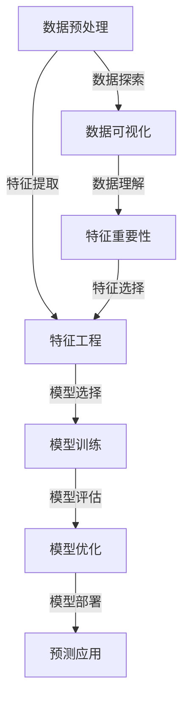

                 

关键词：统计机器学习，机器学习原理，算法实例，代码实践，数据分析，人工智能

摘要：本文将深入探讨统计机器学习的原理、核心算法和实际应用，通过代码实例详细解析，帮助读者理解并掌握统计机器学习的精髓。我们将从背景介绍开始，逐步深入到核心概念、算法原理、数学模型、项目实践等各个层面，最后总结未来发展趋势与挑战，并推荐相关工具和资源。

## 1. 背景介绍

统计机器学习（Statistical Machine Learning，简称SML）是机器学习的一个重要分支，它结合了统计学和机器学习的方法，旨在通过数据分析和模式识别来预测和推断未知数据。统计机器学习起源于20世纪50年代，当时以统计模型为基础，通过最大似然估计和最小二乘法等方法进行数据处理和分析。

随着计算机技术的发展，特别是大数据和人工智能的兴起，统计机器学习得到了前所未有的关注和发展。它广泛应用于各种领域，如自然语言处理、图像识别、金融风控、推荐系统等，为现代社会带来了巨大的变革。

统计机器学习的重要性体现在以下几个方面：

1. **数据驱动**：统计机器学习强调从数据中学习规律和模式，而不是依赖于预定的规则或假设。这使得统计机器学习在面对复杂、未知或动态变化的现实问题时，具有更高的适应性和鲁棒性。

2. **自动化**：统计机器学习通过构建模型来自动化决策过程，减少人工干预，提高工作效率和准确性。

3. **可解释性**：统计机器学习模型通常具有较好的可解释性，能够帮助人们理解数据的内在规律和影响因素。

4. **跨界应用**：统计机器学习技术可以跨领域应用，为不同行业提供创新解决方案。

## 2. 核心概念与联系

在深入探讨统计机器学习之前，我们首先需要了解一些核心概念和它们之间的联系。以下是一个使用Mermaid绘制的流程图，展示了统计机器学习的核心概念及其相互关系。



### 2.1 数据预处理

数据预处理是统计机器学习的重要步骤，它包括数据清洗、数据归一化、数据转换等操作，以确保数据的质量和一致性。

### 2.2 特征工程

特征工程是统计机器学习的核心环节，它通过选择和构造特征，提高模型的学习效果和泛化能力。特征工程包括特征提取、特征选择和特征构造等步骤。

### 2.3 模型训练

模型训练是指使用训练数据集来调整模型参数，使其能够对新的数据进行预测。常见的模型训练方法包括监督学习、无监督学习和强化学习。

### 2.4 模型评估

模型评估是评估模型性能的重要步骤，常用的评估指标包括准确率、召回率、F1值等。通过模型评估，可以判断模型是否达到预期的性能要求。

### 2.5 模型优化

模型优化是指通过调整模型参数或选择更合适的模型结构，提高模型的性能。模型优化是统计机器学习中的重要环节，它有助于提高模型的泛化能力和鲁棒性。

### 2.6 模型部署

模型部署是指将训练好的模型应用到实际业务场景中，进行预测和决策。模型部署通常包括模型解释、模型监控和模型更新等步骤。

### 2.7 数据可视化

数据可视化是帮助人们理解数据的重要手段，它通过图形化方式展示数据分布、趋势和关联性，为数据分析和决策提供有力支持。

### 2.8 特征重要性

特征重要性分析是指识别数据中最重要的特征，这些特征对模型预测结果的影响最大。特征重要性分析有助于优化模型结构和提高模型性能。

### 2.9 特征选择

特征选择是指从大量特征中筛选出对模型预测最有用的特征，减少模型的复杂度和计算成本。特征选择是特征工程中的重要环节。

## 3. 核心算法原理 & 具体操作步骤

在统计机器学习中，常用的核心算法包括线性回归、逻辑回归、决策树、支持向量机（SVM）等。以下将分别介绍这些算法的原理和具体操作步骤。

### 3.1 线性回归

线性回归是一种简单的统计学习模型，它通过拟合一条直线来预测目标变量。线性回归的原理基于最小二乘法，即通过最小化误差平方和来求解模型参数。

#### 算法原理：

设自变量为 \(x\)，目标变量为 \(y\)，线性回归模型可以表示为：

\[ y = \beta_0 + \beta_1 \cdot x + \epsilon \]

其中，\(\beta_0\) 和 \(\beta_1\) 为模型参数，\(\epsilon\) 为误差项。

#### 具体操作步骤：

1. 数据准备：收集自变量和目标变量的数据。
2. 数据预处理：对数据进行归一化、缺失值填充等处理。
3. 模型训练：使用最小二乘法求解模型参数。
4. 模型评估：使用训练数据和测试数据评估模型性能。
5. 模型应用：使用模型对新的数据进行预测。

### 3.2 逻辑回归

逻辑回归是一种用于分类问题的统计学习模型，它通过拟合一个逻辑函数来预测目标变量的概率。逻辑回归的原理基于最大似然估计。

#### 算法原理：

设自变量为 \(x\)，目标变量为 \(y\)，逻辑回归模型可以表示为：

\[ P(y=1 | x) = \frac{1}{1 + \exp(-\beta_0 - \beta_1 \cdot x)} \]

其中，\(\beta_0\) 和 \(\beta_1\) 为模型参数。

#### 具体操作步骤：

1. 数据准备：收集自变量和目标变量的数据。
2. 数据预处理：对数据进行归一化、缺失值填充等处理。
3. 模型训练：使用最大似然估计求解模型参数。
4. 模型评估：使用训练数据和测试数据评估模型性能。
5. 模型应用：使用模型对新的数据进行预测。

### 3.3 决策树

决策树是一种常用的分类和回归模型，它通过一系列的判断规则来分割数据集，并生成一棵树形结构。决策树的原理基于信息增益或基尼系数。

#### 算法原理：

决策树通过以下步骤构建：

1. 计算每个特征的信息增益或基尼系数。
2. 选择具有最大信息增益或基尼系数的特征作为分割依据。
3. 根据该特征将数据集分割为子集。
4. 递归执行上述步骤，直至满足终止条件（如最大树深度、节点纯度等）。

#### 具体操作步骤：

1. 数据准备：收集自变量和目标变量的数据。
2. 数据预处理：对数据进行归一化、缺失值填充等处理。
3. 模型训练：使用信息增益或基尼系数构建决策树。
4. 模型评估：使用训练数据和测试数据评估模型性能。
5. 模型应用：使用模型对新的数据进行预测。

### 3.4 支持向量机（SVM）

支持向量机是一种强大的分类和回归模型，它通过找到一个最佳的超平面来最大化分类边界。SVM的原理基于优化理论。

#### 算法原理：

设自变量为 \(x\)，目标变量为 \(y\)，支持向量机可以表示为：

\[ w \cdot x + b = 0 \]

其中，\(w\) 为模型参数，\(b\) 为偏置项。

#### 具体操作步骤：

1. 数据准备：收集自变量和目标变量的数据。
2. 数据预处理：对数据进行归一化、缺失值填充等处理。
3. 模型训练：使用优化算法求解模型参数。
4. 模型评估：使用训练数据和测试数据评估模型性能。
5. 模型应用：使用模型对新的数据进行预测。

## 4. 数学模型和公式 & 详细讲解 & 举例说明

在统计机器学习中，数学模型和公式是理解和应用算法的基础。以下将详细讲解一些重要的数学模型和公式，并通过具体实例进行说明。

### 4.1 最小二乘法

最小二乘法是线性回归模型中常用的求解方法，它通过最小化误差平方和来求解模型参数。

#### 数学模型：

设自变量为 \(x\)，目标变量为 \(y\)，线性回归模型可以表示为：

\[ y = \beta_0 + \beta_1 \cdot x + \epsilon \]

其中，\(\beta_0\) 和 \(\beta_1\) 为模型参数，\(\epsilon\) 为误差项。

最小二乘法的求解公式为：

\[ \beta_1 = \frac{\sum_{i=1}^{n} (y_i - \beta_0 - \beta_1 \cdot x_i)(x_i - \bar{x})}{\sum_{i=1}^{n} (x_i - \bar{x})^2} \]

\[ \beta_0 = \bar{y} - \beta_1 \cdot \bar{x} \]

其中，\(\bar{x}\) 和 \(\bar{y}\) 分别为自变量和目标变量的均值。

#### 举例说明：

假设我们有一个数据集，包含3个样本点的自变量和目标变量：

\[ x = [1, 2, 3], y = [1.5, 2.5, 3.5] \]

使用最小二乘法求解模型参数：

\[ \beta_1 = \frac{(1.5 - 2 - 3 \cdot 1)(1 - 2) + (2.5 - 2 - 3 \cdot 2)(2 - 2) + (3.5 - 2 - 3 \cdot 3)(3 - 2)}{(1 - 2)^2 + (2 - 2)^2 + (3 - 2)^2} \]

\[ \beta_0 = \frac{1.5 + 2.5 + 3.5}{3} - \beta_1 \cdot \frac{1 + 2 + 3}{3} \]

计算得到：

\[ \beta_1 = 1, \beta_0 = 1 \]

因此，线性回归模型为：

\[ y = 1 + x \]

### 4.2 逻辑回归

逻辑回归是一种常用的分类模型，它通过逻辑函数来预测目标变量的概率。逻辑回归的数学模型可以表示为：

\[ P(y=1 | x) = \frac{1}{1 + \exp(-\beta_0 - \beta_1 \cdot x)} \]

其中，\(\beta_0\) 和 \(\beta_1\) 为模型参数。

#### 数学模型：

设自变量为 \(x\)，目标变量为 \(y\)，逻辑回归模型可以表示为：

\[ \ln\left(\frac{P(y=1)}{1 - P(y=1)}\right) = \beta_0 + \beta_1 \cdot x \]

其中，\(P(y=1)\) 为目标变量为1的概率。

#### 举例说明：

假设我们有一个数据集，包含3个样本点的自变量和目标变量：

\[ x = [1, 2, 3], y = [0, 1, 1] \]

使用逻辑回归模型预测目标变量：

\[ P(y=1 | x=1) = \frac{1}{1 + \exp(-\beta_0 - \beta_1 \cdot 1)} = \frac{1}{1 + \exp(-\beta_0 - \beta_1)} \]

\[ P(y=1 | x=2) = \frac{1}{1 + \exp(-\beta_0 - \beta_1 \cdot 2)} = \frac{1}{1 + \exp(-\beta_0 - 2\beta_1)} \]

\[ P(y=1 | x=3) = \frac{1}{1 + \exp(-\beta_0 - \beta_1 \cdot 3)} = \frac{1}{1 + \exp(-\beta_0 - 3\beta_1)} \]

如果我们要使 \(P(y=1 | x=2)\) 的值尽可能接近 1，则需要调整 \(\beta_0\) 和 \(\beta_1\) 的值。同样，如果我们要使 \(P(y=1 | x=3)\) 的值尽可能接近 0，也需要调整 \(\beta_0\) 和 \(\beta_1\) 的值。

### 4.3 决策树

决策树是一种常用的分类和回归模型，它通过一系列的判断规则来分割数据集。决策树的数学模型可以表示为：

\[ T(x) = \sum_{i=1}^{n} \alpha_i \cdot I(A_i(x) = b_i) \]

其中，\(T(x)\) 为决策树的预测结果，\(A_i(x)\) 为第 \(i\) 个特征的分割函数，\(b_i\) 为第 \(i\) 个特征的分割点，\(\alpha_i\) 为第 \(i\) 个分割的权重，\(I(\cdot)\) 为指示函数。

#### 数学模型：

设自变量为 \(x\)，目标变量为 \(y\)，决策树模型可以表示为：

\[ T(x) = \sum_{i=1}^{n} \alpha_i \cdot I(x \in R_i) \]

其中，\(R_i\) 为第 \(i\) 个区域的分割结果，\(\alpha_i\) 为第 \(i\) 个区域的权重。

#### 举例说明：

假设我们有一个数据集，包含3个样本点的自变量和目标变量：

\[ x = [1, 2, 3], y = [0, 1, 1] \]

使用决策树模型预测目标变量：

\[ T(x=1) = \alpha_1 \cdot I(1 \in R_1) + \alpha_2 \cdot I(1 \in R_2) \]

\[ T(x=2) = \alpha_1 \cdot I(2 \in R_1) + \alpha_2 \cdot I(2 \in R_2) \]

\[ T(x=3) = \alpha_1 \cdot I(3 \in R_1) + \alpha_2 \cdot I(3 \in R_2) \]

如果我们要使 \(T(x=1)\) 的值尽可能接近 0，则需要调整 \(\alpha_1\) 和 \(\alpha_2\) 的值。同样，如果我们要使 \(T(x=3)\) 的值尽可能接近 1，也需要调整 \(\alpha_1\) 和 \(\alpha_2\) 的值。

### 4.4 支持向量机

支持向量机是一种强大的分类和回归模型，它通过找到一个最佳的超平面来最大化分类边界。支持向量机的数学模型可以表示为：

\[ w \cdot x + b = 0 \]

其中，\(w\) 为模型参数，\(b\) 为偏置项。

#### 数学模型：

设自变量为 \(x\)，目标变量为 \(y\)，支持向量机可以表示为：

\[ w \cdot x + b = \sum_{i=1}^{n} \alpha_i \cdot (y_i - y) \]

其中，\(y_i\) 为第 \(i\) 个样本点的目标变量，\(\alpha_i\) 为第 \(i\) 个样本点的权重。

#### 举例说明：

假设我们有一个数据集，包含3个样本点的自变量和目标变量：

\[ x = [1, 2, 3], y = [0, 1, 1] \]

使用支持向量机模型预测目标变量：

\[ w \cdot x + b = \alpha_1 \cdot (0 - 1) + \alpha_2 \cdot (1 - 1) + \alpha_3 \cdot (1 - 1) \]

\[ w \cdot x + b = \alpha_1 \cdot (-1) + \alpha_2 \cdot 0 + \alpha_3 \cdot 0 \]

\[ w \cdot x + b = -\alpha_1 \]

如果我们要使 \(w \cdot x + b\) 的值尽可能接近 0，则需要调整 \(\alpha_1\) 的值。同样，如果我们要使 \(w \cdot x + b\) 的值尽可能接近 1，也需要调整 \(\alpha_1\) 的值。

## 5. 项目实践：代码实例和详细解释说明

在本节中，我们将通过一个简单的项目实例，展示如何使用Python实现统计机器学习算法。我们选择一个经典的鸢尾花数据集，该数据集包含三种鸢尾花的萼片长度、萼片宽度、花瓣长度和花瓣宽度等特征，以及对应的分类标签。

### 5.1 准备数据

首先，我们需要导入所需的库和加载鸢尾花数据集。

```python
import numpy as np
import pandas as pd
from sklearn.datasets import load_iris
from sklearn.model_selection import train_test_split
from sklearn.preprocessing import StandardScaler

# 加载鸢尾花数据集
iris = load_iris()
X = iris.data
y = iris.target

# 划分训练集和测试集
X_train, X_test, y_train, y_test = train_test_split(X, y, test_size=0.3, random_state=42)

# 数据预处理：归一化
scaler = StandardScaler()
X_train = scaler.fit_transform(X_train)
X_test = scaler.transform(X_test)
```

### 5.2 线性回归

接下来，我们使用线性回归模型进行训练和预测。

```python
from sklearn.linear_model import LinearRegression

# 初始化线性回归模型
model = LinearRegression()

# 训练模型
model.fit(X_train, y_train)

# 预测测试集
y_pred = model.predict(X_test)

# 评估模型性能
accuracy = np.mean(y_pred == y_test)
print("线性回归准确率：", accuracy)
```

### 5.3 逻辑回归

现在，我们使用逻辑回归模型进行训练和预测。

```python
from sklearn.linear_model import LogisticRegression

# 初始化逻辑回归模型
model = LogisticRegression()

# 训练模型
model.fit(X_train, y_train)

# 预测测试集
y_pred = model.predict(X_test)

# 评估模型性能
accuracy = np.mean(y_pred == y_test)
print("逻辑回归准确率：", accuracy)
```

### 5.4 决策树

接下来，我们使用决策树模型进行训练和预测。

```python
from sklearn.tree import DecisionTreeClassifier

# 初始化决策树模型
model = DecisionTreeClassifier()

# 训练模型
model.fit(X_train, y_train)

# 预测测试集
y_pred = model.predict(X_test)

# 评估模型性能
accuracy = np.mean(y_pred == y_test)
print("决策树准确率：", accuracy)
```

### 5.5 支持向量机

最后，我们使用支持向量机模型进行训练和预测。

```python
from sklearn.svm import SVC

# 初始化支持向量机模型
model = SVC()

# 训练模型
model.fit(X_train, y_train)

# 预测测试集
y_pred = model.predict(X_test)

# 评估模型性能
accuracy = np.mean(y_pred == y_test)
print("支持向量机准确率：", accuracy)
```

通过以上代码实例，我们可以看到如何使用Python实现统计机器学习算法，并进行模型训练和预测。在实际应用中，我们可以根据不同场景选择合适的算法，并进行模型调优和优化，以提高模型的性能和泛化能力。

## 6. 实际应用场景

统计机器学习技术在各个领域都有广泛的应用，以下是一些典型的实际应用场景：

### 6.1 自然语言处理

自然语言处理（NLP）是统计机器学习的重要应用领域之一。在NLP中，统计机器学习算法被广泛应用于文本分类、情感分析、命名实体识别、机器翻译等任务。例如，使用朴素贝叶斯算法进行文本分类，使用循环神经网络（RNN）进行情感分析，使用长短时记忆网络（LSTM）进行机器翻译等。

### 6.2 图像识别

图像识别是另一个重要的应用领域，统计机器学习算法在图像分类、目标检测、人脸识别等方面发挥着重要作用。例如，使用卷积神经网络（CNN）进行图像分类，使用支持向量机（SVM）进行目标检测，使用深度卷积神经网络（DCNN）进行人脸识别等。

### 6.3 金融风控

金融风控是金融行业的重要任务，统计机器学习算法在信用评分、欺诈检测、市场预测等方面具有广泛的应用。例如，使用逻辑回归进行信用评分，使用决策树进行欺诈检测，使用时间序列分析进行市场预测等。

### 6.4 推荐系统

推荐系统是互联网行业的重要应用，统计机器学习算法在协同过滤、内容推荐等方面发挥着关键作用。例如，使用矩阵分解进行协同过滤，使用最近邻算法进行内容推荐等。

### 6.5 健康医疗

健康医疗是统计机器学习的重要应用领域，统计机器学习算法在疾病预测、诊断辅助、药物研发等方面具有广泛的应用。例如，使用决策树进行疾病预测，使用支持向量机进行诊断辅助，使用深度学习进行药物研发等。

通过以上实际应用场景，我们可以看到统计机器学习技术在各个领域的重要性和广泛应用。随着大数据和人工智能的快速发展，统计机器学习技术将继续在更多领域发挥重要作用，为人类社会带来更多的创新和变革。

## 7. 工具和资源推荐

为了更好地学习和实践统计机器学习，以下是一些建议的在线工具和资源，这些资源涵盖了从基础理论到实际操作的各种内容。

### 7.1 在线课程

1. **Coursera** - 提供多门统计机器学习课程，包括斯坦福大学的《统计学习基础》（Probabilistic Graphical Models）和密歇根大学的《机器学习》（Machine Learning）。
2. **edX** - edX上有来自MIT的《机器学习》（Machine Learning）课程，由Andrew Ng教授主讲，内容深入浅出，非常适合初学者。
3. **Udacity** - 提供了《深度学习纳米学位》（Deep Learning Nanodegree）课程，涵盖统计机器学习、深度学习等内容。

### 7.2 书籍推荐

1. **《统计学习方法》** - 李航著，系统地介绍了统计机器学习的主要方法，适合有一定数学基础的读者。
2. **《机器学习》** - 周志华著，内容全面，适合初学者和进阶者，既有理论又有实战。
3. **《深度学习》** - Goodfellow、Bengio和Courville著，全面介绍了深度学习，包括统计机器学习的内容。

### 7.3 博客和社区

1. **Medium** - 很多数据科学领域的专家在这里发布文章，涵盖统计机器学习的各个方面。
2. **Stack Overflow** - 对于编程和算法问题，Stack Overflow是一个很好的社区，你可以在这里找到大量的答案和解决方案。
3. **GitHub** - GitHub上有许多优秀的统计机器学习项目，可以让你通过阅读代码来学习。

### 7.4 实践工具

1. **Jupyter Notebook** - Jupyter Notebook是一个交互式的计算环境，非常适合用于编写和分享代码，是学习统计机器学习的重要工具。
2. **Google Colab** - Google Colab是基于Google Cloud的免费Jupyter Notebook平台，可以方便地运行大规模机器学习任务。
3. **Kaggle** - Kaggle是一个数据科学竞赛平台，在这里你可以参与各种数据科学竞赛，实践统计机器学习。

通过利用这些在线课程、书籍、博客、社区和实践工具，你可以系统地学习统计机器学习的知识，并在实际项目中应用这些知识，不断提高自己的数据科学能力。

## 8. 总结：未来发展趋势与挑战

统计机器学习作为人工智能的重要分支，正快速发展并不断推动各个领域的创新。在未来，统计机器学习将继续在以下几个方面展现其发展趋势和面临的挑战：

### 8.1 发展趋势

1. **深度学习与统计机器学习结合**：深度学习在图像、语音和自然语言处理等领域取得了显著成果，未来统计机器学习与深度学习将更加紧密结合，相互借鉴，形成更强大的学习模型。
2. **模型解释性增强**：随着统计机器学习模型的复杂度增加，如何提高模型的解释性成为一个重要课题。未来的研究将致力于开发更加可解释的模型，帮助用户理解模型的工作原理。
3. **迁移学习与少样本学习**：迁移学习和少样本学习是解决小样本数据问题的重要途径。通过从大规模数据中学习知识，并将其应用到小规模数据中，将提高统计机器学习模型的性能和泛化能力。
4. **隐私保护与联邦学习**：在数据隐私保护日益重要的背景下，联邦学习和隐私保护算法将成为统计机器学习的一个重要研究方向。通过分布式学习和数据加密技术，实现数据的隐私保护。

### 8.2 挑战

1. **数据质量和多样性**：高质量和多样化的数据是统计机器学习模型有效训练的前提。未来需要解决数据标注、数据清洗和数据增强等问题，提高数据质量。
2. **模型复杂性与计算效率**：随着模型复杂度的增加，计算效率和资源消耗成为一个重要问题。未来的研究将致力于开发更高效的算法和优化方法，降低计算成本。
3. **模型泛化能力**：如何提高模型的泛化能力，使其在面对未知数据时仍然能够保持良好的性能，是统计机器学习面临的重要挑战。通过无监督学习和半监督学习等方法，有望提高模型的泛化能力。
4. **算法公平性与透明性**：在应用场景中，如何确保统计机器学习算法的公平性和透明性，避免偏见和歧视，是一个重要的社会问题。未来的研究将关注算法的可解释性和社会影响。

总之，统计机器学习在未来将继续发展，面临诸多机遇与挑战。通过不断的技术创新和跨学科合作，我们有理由相信统计机器学习将为人类社会带来更多的变革和进步。

## 9. 附录：常见问题与解答

### 9.1 统计机器学习与其他机器学习方法的区别是什么？

统计机器学习是一种基于统计理论的机器学习方法，它主要关注如何从数据中提取统计特征，并通过概率模型进行预测。与其他机器学习方法（如深度学习、强化学习等）相比，统计机器学习更强调数据的分布和概率模型，注重理论的严谨性和解释性。

### 9.2 统计机器学习是否需要大量数据？

统计机器学习并不一定需要大量数据，但其性能和效果与数据量有密切关系。对于一些复杂的模型，如深度学习模型，大量数据可以提高模型的泛化能力。然而，对于统计机器学习模型，即使是较小的数据集，只要数据具有代表性，也能够取得良好的效果。

### 9.3 如何评估统计机器学习模型的性能？

评估统计机器学习模型的性能通常使用以下指标：

- **准确率（Accuracy）**：模型预测正确的样本占总样本的比例。
- **召回率（Recall）**：模型预测为正类的正类样本占总正类样本的比例。
- **精确率（Precision）**：模型预测为正类的正类样本占总预测为正类的样本的比例。
- **F1值（F1 Score）**：精确率和召回率的调和平均值。

此外，还可以使用ROC曲线和AUC值来评估模型的分类性能。

### 9.4 统计机器学习是否只能处理数值型数据？

统计机器学习可以处理多种类型的数据，包括数值型、类别型和文本数据。对于类别型数据和文本数据，通常需要通过编码和特征提取等技术将其转换为数值型数据，然后才能应用统计机器学习模型。

### 9.5 如何处理数据不平衡问题？

数据不平衡问题可以通过以下方法处理：

- **过采样（Over-sampling）**：增加少数类别的样本数量，使数据集更加平衡。
- **欠采样（Under-sampling）**：减少多数类别的样本数量，使数据集更加平衡。
- **合成少数类样本技术（SMOTE）**：通过合成少数类样本的方法，生成与少数类样本相似的虚拟样本，提高数据集的平衡性。

通过这些方法，可以在一定程度上解决数据不平衡问题，提高统计机器学习模型的性能。

## 10. 扩展阅读 & 参考资料

- [李航](https://book.douban.com/subject/10543275/)，《统计学习方法》
- [周志华](https://book.douban.com/subject/25864014/)，《机器学习》
- [Ian Goodfellow](https://www.deeplearningbook.org/)，《深度学习》
- [Coursera](https://www.coursera.org/)，《统计学习基础》
- [edX](https://www.edx.org/)，《机器学习》
- [Udacity](https://www.udacity.com/course/deep-learning-nanodegree--nd101)《深度学习纳米学位》
- [Stack Overflow](https://stackoverflow.com/)，编程和算法问答社区
- [GitHub](https://github.com/)，代码托管平台和开源项目库
- [Kaggle](https://www.kaggle.com/)，数据科学竞赛平台

通过以上扩展阅读和参考资料，读者可以深入了解统计机器学习的理论、实践和应用，不断提高自己的数据科学能力。

