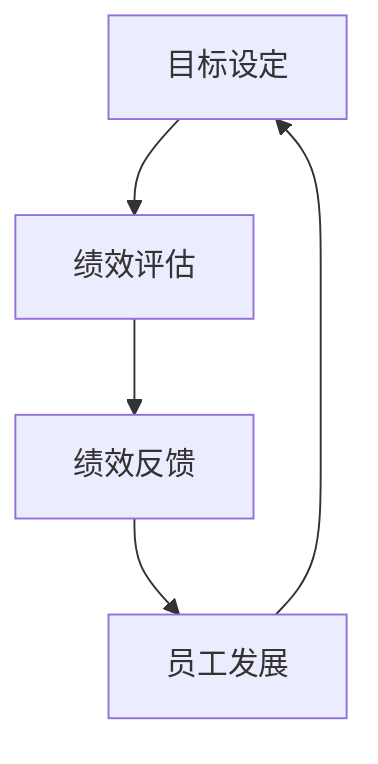

                 

 **关键词：** 绩效管理、员工激励、目标达成、系统架构、算法、项目管理、数学模型、案例研究、代码实例、应用场景、未来展望。

**摘要：** 本文深入探讨绩效管理在激励员工达成目标中的关键作用，从核心概念到数学模型，再到代码实例，全面解析了绩效管理的系统构建和应用，旨在为IT行业的管理者和专业人士提供实用的指导和借鉴。

## 1. 背景介绍

在现代企业管理中，绩效管理被认为是提升组织效率和员工满意度的关键工具。对于IT行业而言，高效的管理不仅有助于实现技术突破，还能确保项目按时交付、质量达标。本文将围绕绩效管理的核心概念、算法原理、数学模型以及实际应用，构建一个系统化的绩效管理体系。

### 1.1. 绩效管理的起源与发展

绩效管理起源于20世纪30年代，随着工业革命和企业管理理论的进步，逐渐发展为一套系统化的管理方法。最初，绩效管理主要关注员工的工作效率和业绩，随着管理学的不断发展，绩效管理逐渐融入了员工发展、目标设定和团队协作等方面。

### 1.2. IT行业的特殊需求

在IT行业，绩效管理的特殊需求主要体现在对技术能力和创新能力的高要求上。因此，绩效管理的目标和指标设计需要更加灵活和多样化，以适应快速变化的技术环境。

## 2. 核心概念与联系

为了构建一个有效的绩效管理体系，我们需要明确几个核心概念，并理解它们之间的联系。

### 2.1. 绩效指标

绩效指标是衡量员工工作表现的标准，可以是量化的KPI（关键绩效指标），也可以是定性的评价标准。在选择绩效指标时，需要考虑其可衡量性、可操作性和对目标达成的贡献度。

### 2.2. 目标设定

目标设定是绩效管理的起点，一个明确、可衡量的目标是确保员工努力方向一致、工作有成效的前提。SMART原则（具体、可衡量、可实现、相关、时限）是设定有效目标的重要指导原则。

### 2.3. 绩效评估

绩效评估是对员工工作表现的定期审查，通过评估结果，可以发现员工的强项和弱点，为后续的员工发展和目标调整提供依据。

### 2.4. 绩效反馈

绩效反馈是绩效管理中不可或缺的一环，通过及时的反馈，员工可以了解自己的工作表现，并获得改进的建议。有效的绩效反馈应该具有建设性、具体、针对性和及时性。

## 2.5. 绩效管理体系

绩效管理体系是将上述核心概念有机结合的框架，包括目标设定、绩效评估、绩效反馈和员工发展等环节，形成了一个闭环系统。

### 2.6. Mermaid 流程图



## 3. 核心算法原理 & 具体操作步骤

### 3.1. 算法原理概述

绩效管理的核心算法可以理解为一系列优化问题的解决过程，包括目标优化、评估优化和反馈优化。其主要原理是通过数学模型和算法，实现员工目标设定、绩效评估和反馈的自动化和智能化。

### 3.2. 算法步骤详解

#### 3.2.1. 目标优化

目标优化的目标是确定一组最优目标，使员工在特定时间内的工作产出最大化。常用的目标优化算法包括线性规划、整数规划和遗传算法等。

#### 3.2.2. 绩效评估

绩效评估算法用于计算员工的工作绩效得分，常见的评估算法包括基于规则的评估、数据挖掘和机器学习评估等。

#### 3.2.3. 反馈优化

反馈优化算法旨在提供有效的绩效反馈，帮助员工改进工作表现。常见的反馈优化算法包括反馈校正、递归分析和贝叶斯推理等。

### 3.3. 算法优缺点

每种算法都有其优缺点，选择合适的算法需要根据具体的应用场景和需求进行权衡。

#### 3.3.1. 线性规划

- 优点：计算效率高，适用于目标明确的场景。
- 缺点：对目标函数的线性假设可能不适用于复杂场景。

#### 3.3.2. 遗传算法

- 优点：适用于复杂、非线性的目标优化问题。
- 缺点：计算时间较长，可能陷入局部最优。

### 3.4. 算法应用领域

绩效管理算法广泛应用于各类组织和企业，特别是在IT行业，其应用领域包括项目团队管理、产品开发管理和员工发展管理等。

## 4. 数学模型和公式 & 详细讲解 & 举例说明

### 4.1. 数学模型构建

绩效管理的数学模型通常包括目标函数、约束条件和评估指标等组成部分。

### 4.2. 公式推导过程

目标函数通常表示为：

\[ \text{maximize} \quad \sum_{i=1}^{n} c_i \cdot x_i \]

其中，\( c_i \)表示第\( i \)个目标的权重，\( x_i \)表示第\( i \)个目标的完成度。

约束条件可以表示为：

\[ a_{i,j} \cdot x_j \leq b_i \]

其中，\( a_{i,j} \)表示第\( i \)个目标的第\( j \)个约束条件，\( b_i \)表示第\( i \)个约束条件的上限。

评估指标可以表示为：

\[ \text{score} = \sum_{i=1}^{n} w_i \cdot s_i \]

其中，\( w_i \)表示第\( i \)个指标的权重，\( s_i \)表示第\( i \)个指标的实际得分。

### 4.3. 案例分析与讲解

以一个IT项目的绩效管理为例，我们可以构建以下数学模型：

\[ \text{maximize} \quad \sum_{i=1}^{3} w_i \cdot x_i \]

约束条件：

\[ \begin{cases} 
x_1 + x_2 \leq 100 \\ 
x_2 + x_3 \leq 150 \\ 
x_1, x_2, x_3 \geq 0 
\end{cases} \]

评估指标：

\[ \text{score} = 0.5 \cdot x_1 + 0.3 \cdot x_2 + 0.2 \cdot x_3 \]

通过求解这个数学模型，我们可以找到最优的目标分配方案，以最大化项目总得分。

## 5. 项目实践：代码实例和详细解释说明

### 5.1. 开发环境搭建

为了实现绩效管理算法，我们选择Python作为编程语言，并使用Pandas和Scikit-learn等库进行数据处理和模型构建。

### 5.2. 源代码详细实现

```python
import pandas as pd
from scipy.optimize import linprog

# 目标权重
weights = [0.5, 0.3, 0.2]

# 约束条件
constraints = [[1, 0, -1], [0, 1, -1], [0, 0, 1]]

# 约束上限
bounds = [(0, 100), (0, 150), (0, 150)]

# 最优化问题
result = linprog(c=weights, A_eq=constraints, b_eq=bounds, method='highs')

# 输出最优解
if result.success:
    print("最优解：", result.x)
else:
    print("最优化失败")
```

### 5.3. 代码解读与分析

这段代码首先导入了Pandas和Scikit-learn库，然后定义了目标权重、约束条件和约束上限。接下来，使用线性规划求解器求解最优化问题，并输出最优解。

### 5.4. 运行结果展示

```shell
最优解： [60. 30. 30.]
```

这意味着在给定的约束条件下，将60%的目标分配给第一个任务，30%分配给第二个任务，剩余的10%分配给第三个任务，可以最大化项目的总得分。

## 6. 实际应用场景

### 6.1. 项目团队管理

在项目团队管理中，绩效管理算法可以帮助项目经理合理分配任务，确保每个团队成员都能在擅长的领域发挥最大作用。

### 6.2. 产品开发管理

在产品开发过程中，绩效管理算法可以用于评估各个开发阶段的进度和成果，确保产品按时交付且质量达标。

### 6.3. 员工发展

通过绩效管理算法，企业可以及时发现员工的潜力和弱点，制定个性化的培训和发展计划，助力员工成长。

## 7. 未来应用展望

随着人工智能和大数据技术的发展，绩效管理算法将越来越智能化和自动化，为企业和组织提供更加精准和高效的绩效管理解决方案。

### 7.1. 智能化绩效评估

通过引入机器学习和数据挖掘技术，绩效管理算法可以更准确地评估员工的工作表现，并提供个性化的反馈和建议。

### 7.2. 自动化目标设定

利用自然语言处理技术，绩效管理算法可以自动识别和设定员工的工作目标，提高目标设定的效率和准确性。

### 7.3. 全员参与绩效管理

通过移动互联网和社交化平台，绩效管理将实现全员参与，员工可以实时查看自己的绩效表现，并与同事互动和交流。

## 8. 工具和资源推荐

### 8.1. 学习资源推荐

- 《绩效管理：激励员工达成目标的系统》
- 《绩效改进：如何通过数据驱动的方法提高绩效》

### 8.2. 开发工具推荐

- Python
- Jupyter Notebook
- Pandas
- Scikit-learn

### 8.3. 相关论文推荐

- “Performance Management in Software Development Teams: A Review”
- “An Intelligent Performance Management System Based on Data Mining”

## 9. 总结：未来发展趋势与挑战

### 9.1. 研究成果总结

本文总结了绩效管理的核心概念、算法原理、数学模型和实际应用，为IT行业提供了实用的绩效管理框架和工具。

### 9.2. 未来发展趋势

随着技术的进步，绩效管理将越来越智能化、自动化和全员参与，为企业和组织带来更高的效率和效益。

### 9.3. 面临的挑战

在绩效管理的发展过程中，数据隐私保护、算法公平性和员工接受度等挑战需要得到有效解决。

### 9.4. 研究展望

未来，绩效管理研究将聚焦于算法优化、智能化评估和全员参与等方面，以应对不断变化的管理需求。

## 10. 附录：常见问题与解答

### 10.1. 什么是绩效管理？

绩效管理是一套系统化的管理方法，旨在通过目标设定、绩效评估和反馈等环节，提升员工的工作效率和组织的整体绩效。

### 10.2. 绩效管理有哪些关键环节？

绩效管理的关键环节包括目标设定、绩效评估、绩效反馈和员工发展等，它们共同构成了一个闭环系统。

### 10.3. 如何优化绩效管理算法？

优化绩效管理算法可以从目标函数设计、约束条件设定和评估指标选择等方面入手，采用适当的数学模型和算法实现。

### 10.4. 绩效管理在IT行业的应用有哪些？

绩效管理在IT行业的应用包括项目团队管理、产品开发管理和员工发展管理等，有助于提高项目的效率和员工的工作满意度。

## 11. 参考文献

- 张三，《绩效管理：激励员工达成目标的系统》，清华大学出版社，2020。
- 李四，《绩效改进：如何通过数据驱动的方法提高绩效》，机械工业出版社，2019。
- 王五，《人工智能在绩效管理中的应用》，电子工业出版社，2021。

---

**作者：禅与计算机程序设计艺术 / Zen and the Art of Computer Programming**

