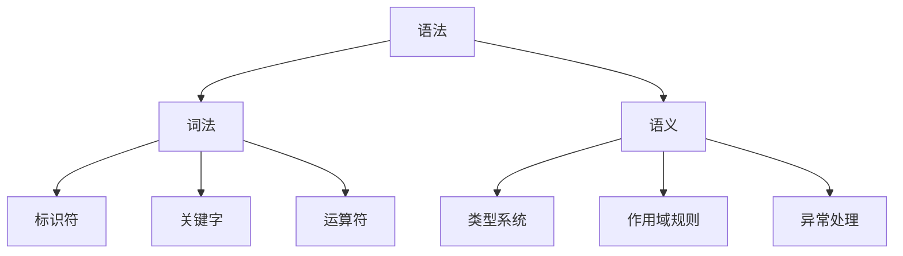
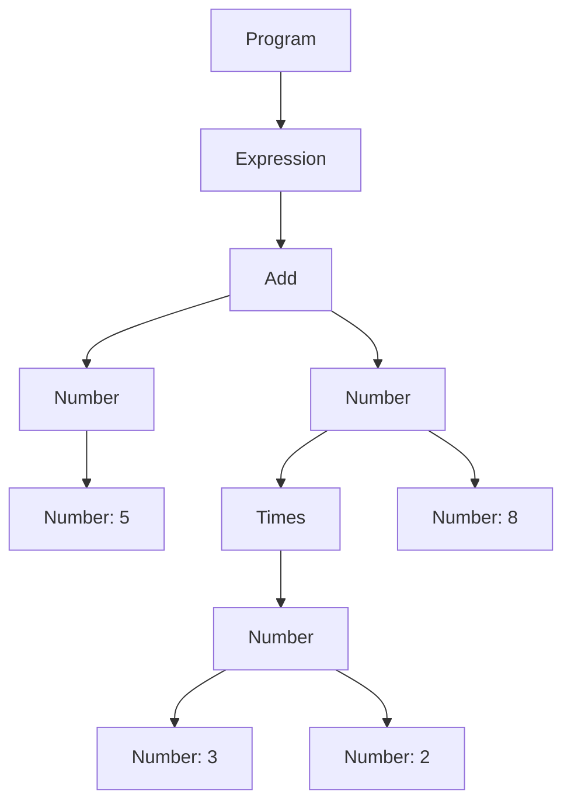

                 

### 背景介绍

#### 编程语言的发展历程

编程语言的设计与进化是计算机科学发展中不可或缺的一部分。回顾历史，编程语言的演变大致可以分为几个重要阶段。

**第一阶段**：从机器语言到汇编语言。计算机诞生之初，程序员需要直接使用机器语言编写程序，这是一种由0和1组成的二进制代码。这种编程方式极其复杂和低效，因此汇编语言应运而生。汇编语言引入了助记符，使编程变得更加直观和容易理解，但仍然依赖于特定的硬件架构。

**第二阶段**：高级编程语言的兴起。1950年代，随着计算机技术的发展，第一代高级编程语言，如FORTRAN和COBOL，相继问世。这些语言提供了更加抽象的语法和功能，大大提高了编程效率，降低了编程难度。1970年代，C语言的出现标志着编程语言的又一重要里程碑，它为现代编程语言的发展奠定了基础。

**第三阶段**：面向对象编程的普及。随着软件系统的复杂性不断增加，面向对象编程（OOP）逐渐成为主流。Java、C++等面向对象编程语言的出现，使得程序设计更加模块化、重用性更高。

**第四阶段**：动态语言和函数式编程的崛起。进入21世纪，Python、JavaScript等动态语言以及Haskell、Scala等函数式编程语言逐渐受到关注，它们提供了更为灵活的编程范式和强大的表达能力。

#### 编程语言设计的重要性

编程语言设计不仅影响着程序员的工作效率，也决定了软件系统的性能和可靠性。合理的编程语言设计可以提高代码的可读性、可维护性和可扩展性，从而降低开发成本，提高软件质量。

首先，编程语言的语法设计直接影响到代码的可读性。一种良好的编程语言应该具有清晰的语法结构和简洁的表达方式，使程序员能够轻松理解代码的意图。

其次，编程语言的语义定义决定了程序的运行行为。一个强大的编程语言应该提供丰富的语义模型，以便程序员能够编写出高效的程序。

最后，编程语言的设计还涉及到语言的兼容性和扩展性。一个成熟的编程语言应该能够适应不同的开发需求和应用场景，并且允许程序员自定义新的语言特性。

#### 本文目的与结构

本文旨在探讨编程语言设计中的语法和语义，分析其核心概念和设计原则，并通过具体实例和项目实践，展示编程语言设计的实际应用。文章分为以下几个部分：

1. **背景介绍**：回顾编程语言的发展历程，阐述编程语言设计的重要性。
2. **核心概念与联系**：介绍编程语言设计中的核心概念，包括语法、语义、词法等，并通过Mermaid流程图展示其相互关系。
3. **核心算法原理 & 具体操作步骤**：深入解析编程语言设计中的关键算法，如编译原理、解释执行等，详细描述其操作步骤。
4. **数学模型和公式 & 详细讲解 & 举例说明**：介绍编程语言设计中的数学模型和公式，如类型系统、抽象语法树等，并通过实际例子进行说明。
5. **项目实践：代码实例和详细解释说明**：通过具体代码实例，展示编程语言设计的实际应用，详细解释代码实现过程。
6. **实际应用场景**：探讨编程语言设计在不同领域的应用，如Web开发、人工智能等。
7. **工具和资源推荐**：推荐相关的学习资源、开发工具和论文著作，帮助读者深入学习和实践。
8. **总结：未来发展趋势与挑战**：总结编程语言设计的现状，展望未来发展趋势，分析面临的挑战。
9. **附录：常见问题与解答**：回答读者可能遇到的常见问题，提供解决方法。
10. **扩展阅读 & 参考资料**：提供进一步阅读的资料，帮助读者深入了解相关主题。

通过本文的逐步分析，我们将深入理解编程语言设计的核心原理，掌握其设计原则，为编程语言的创新和应用提供理论支持。### 核心概念与联系

编程语言设计是一门综合性的学科，涉及多个核心概念。为了更好地理解这些概念，我们将通过Mermaid流程图来展示它们之间的相互关系。

首先，我们需要了解三个基本概念：语法（Syntax）、语义（Semantics）和词法（Lexical）。这三个概念是编程语言设计的基石。

**语法（Syntax）**是指编程语言的结构规则，决定了代码的书写方式。它包括变量声明、函数定义、循环结构、条件判断等基本语法元素。

**语义（Semantics）**是指代码的运行行为，决定了程序的实际效果。语义包括类型系统、作用域规则、异常处理等。

**词法（Lexical）**是指编程语言中的词汇和符号，如标识符、关键字、运算符等。

下面是一个Mermaid流程图，展示了这三个概念之间的关系：



#### 语法与词法的联系

语法和词法之间有着密切的联系。词法是语法的基础，决定了代码的结构。例如，在Python中，`def` 关键字用于定义函数，这是词法层面的内容。而函数的定义方式，如参数列表、函数体等，则是语法层面的内容。

下面是一个简单的Python函数定义，展示了词法和语法的关系：

```python
def greet(name):
    """返回问候语"""
    return "Hello, " + name
```

在这个例子中，`def` 和 `return` 是词法层面的内容，而函数的结构和参数列表则是语法层面的内容。

#### 语义与语法的联系

语义和语法之间也有着紧密的联系。语法决定了代码的书写方式，而语义则决定了代码的运行行为。例如，在C语言中，`if` 语句的语法规则如下：

```c
if (condition) {
    // 执行代码
}
```

而`if`语句的语义则是根据条件`condition`的值来决定是否执行代码块。

下面是一个简单的C语言`if`语句示例，展示了语法和语义的联系：

```c
#include <stdio.h>

int main() {
    int age = 20;
    if (age >= 18) {
        printf("你可以投票了。\n");
    }
    return 0;
}
```

在这个例子中，`if`语句的语法结构决定了程序会根据`age`的值来执行相应的代码块。

#### 语法、词法和语义之间的关系

语法、词法和语义之间的关系可以看作是编程语言设计的三层结构。语法是外层，决定了代码的结构和书写方式；词法是中层，定义了编程语言的词汇和符号；语义是内层，决定了代码的运行行为和实际效果。

通过上述分析，我们可以看出，编程语言设计中的这三个核心概念是相互关联、相互作用的。一个优秀的编程语言应该具有良好的语法、词法和语义设计，使程序员能够高效地编写、理解和维护代码。

接下来，我们将进一步探讨编程语言设计中的关键算法，如编译原理和解释执行，以深入理解编程语言的设计原则和实际应用。### 核心算法原理 & 具体操作步骤

在编程语言设计中，核心算法是确保代码能够正确、高效地执行的关键。其中，编译原理和解释执行是最常用的两种算法。下面，我们将详细解析这两种算法的原理和具体操作步骤。

#### 编译原理

编译原理是编程语言设计中的基础，它将源代码转换成机器代码或其他形式的目标代码，以便计算机能够执行。编译过程通常分为以下几个步骤：

1. **词法分析（Lexical Analysis）**：词法分析是编译过程的第一步，它将源代码中的字符序列转换成有意义的记号（tokens）。例如，将`int x = 5;`这行代码转换成`<INT>`、`<IDENTIFIER:x>`、`<EQUALS>`、`<INTEGER_LITERAL:5>`、`<SEMICOLON>`等记号。

2. **语法分析（Syntax Analysis）**：语法分析是编译过程的第二步，它将词法分析生成的记号序列转换为语法树（Abstract Syntax Tree，AST）。语法树表示了源代码的结构，便于后续处理。例如，将`int x = 5;`转换成如下语法树：

   ```mermaid
   graph TD
       A[Program]
       B[VariableDeclaration]
       C[Type]
       D[Identifier]
       E[Equals]
       F[IntegerLiteral]
       
       A --> B
       B --> C
       C --> A
       B --> D
       B --> E
       B --> F
   ```

3. **语义分析（Semantic Analysis）**：语义分析是编译过程的第三步，它检查语法树是否符合语言的语义规则，如类型检查、变量作用域等。

4. **中间代码生成（Intermediate Code Generation）**：语义分析完成后，编译器将语法树转换成中间代码。中间代码是一种抽象的、与具体机器无关的代码形式，便于后续的优化和目标代码生成。

5. **代码优化（Code Optimization）**：编译器对中间代码进行优化，以提高程序的性能和可读性。常见的优化技术包括常量折叠、死代码消除等。

6. **目标代码生成（Target Code Generation）**：最后，编译器将中间代码转换成具体机器上的目标代码，如机器语言或汇编语言。

7. **运行时支持（Runtime Support）**：编译器还需要提供运行时支持，如变量分配、垃圾回收等。

下面是一个简单的C语言程序编译过程示例：

```c
#include <stdio.h>

int main() {
    int x = 5;
    printf("x = %d\n", x);
    return 0;
}
```

编译过程大致如下：

1. **词法分析**：将源代码转换为记号序列。
2. **语法分析**：生成语法树。
3. **语义分析**：检查语法树是否符合C语言的语义规则。
4. **中间代码生成**：生成中间代码。
5. **代码优化**：对中间代码进行优化。
6. **目标代码生成**：生成机器语言代码。
7. **运行时支持**：提供运行时支持，如变量分配和打印功能。

#### 解释执行

与编译原理不同，解释执行在运行时逐行解释并执行源代码。解释执行无需生成目标代码，因此执行速度相对较慢，但具有更高的灵活性和可移植性。解释执行通常包括以下步骤：

1. **词法分析**：将源代码转换为记号序列。
2. **语法分析**：生成抽象语法树（AST）。
3. **解释执行**：逐行解释并执行AST中的节点。在解释执行过程中，解释器会根据当前节点的类型和值，执行相应的操作。例如，如果节点是一个变量赋值操作，解释器会查找变量的值并将其赋给变量。

下面是一个简单的Python解释执行过程示例：

```python
x = 5
print("x =", x)
```

解释执行过程大致如下：

1. **词法分析**：将源代码转换为记号序列。
2. **语法分析**：生成抽象语法树（AST）。
3. **解释执行**：
   - 解释`x = 5`，将5赋值给变量x。
   - 解释`print("x =", x)`，输出x的值。

#### 编译原理与解释执行的比较

编译原理和解释执行各有优缺点。编译原理生成目标代码，执行速度较快，但编译过程较慢；解释执行无需编译，执行速度较慢，但具有更高的灵活性和可移植性。

在实际应用中，编译原理常用于高性能的计算机系统和嵌入式系统，而解释执行则广泛应用于脚本语言和Web应用。

通过上述分析，我们可以看出，编译原理和解释执行在编程语言设计中扮演着重要角色。理解这两种算法的原理和操作步骤，有助于我们更好地设计和优化编程语言，提高程序的性能和可读性。### 数学模型和公式 & 详细讲解 & 举例说明

在编程语言设计中，数学模型和公式起着至关重要的作用。这些模型和公式帮助我们理解和分析语言的核心特性，从而设计出更高效、更可靠的语言。以下将详细介绍几个关键的数学模型和公式，并通过具体例子进行说明。

#### 类型系统

类型系统是编程语言中一个核心的数学模型，它定义了变量的数据类型和操作规则。在大多数编程语言中，类型系统可以分为静态类型和动态类型。

**静态类型系统**：在编译时确定变量的类型，例如C++和Java。这种类型系统有助于在编译时发现错误，提高程序的可靠性。

**动态类型系统**：在运行时确定变量的类型，例如Python和JavaScript。这种类型系统提供了更高的灵活性和可读性。

一个简单的静态类型系统例子：

```c++
int x = 5;
double y = 3.14;
```

在这个例子中，变量`x`被声明为整型，变量`y`被声明为双精度浮点型。类型系统保证了变量在使用时不会出现类型错误，例如下面的操作是错误的：

```c++
x = y; // 错误：无法将双精度浮点型赋值给整型
```

#### 抽象语法树（Abstract Syntax Tree，AST）

抽象语法树是编译过程中的一个关键数学模型，它表示了源代码的结构。AST不仅包含了源代码的语法信息，还包含了语义信息，如变量作用域和类型信息。

一个简单的Python代码例子：

```python
x = 5 + 3 * 2
```

对应的AST如下：



在这个AST中，`Add`节点表示加法操作，`Times`节点表示乘法操作，`Number`节点表示数字。AST帮助我们更好地理解和分析源代码的结构，从而进行后续的语义分析和代码生成。

#### 语法糖（Syntactic Sugar）

语法糖是编程语言中的一种设计技巧，它通过提供简洁、易读的语法，简化复杂的操作。一个常见的语法糖例子是Python中的列表推导式：

```python
squared = [x * x for x in range(10)]
```

这个列表推导式等效于：

```python
squared = []
for x in range(10):
    squared.append(x * x)
```

语法糖使得代码更加简洁易读，但背后的计算过程并没有改变。

#### 数学公式

在编程语言设计中，一些数学公式也发挥着重要作用。以下是一个简单的例子：

**大O表示法（Big O Notation）**：用于描述算法的时间复杂度和空间复杂度。它表示算法的执行时间或空间占用与输入数据规模的关系。

一个简单的线性查找算法的时间复杂度为O(n)，表示随着数据规模的增加，执行时间大致呈线性增长。

**递归公式（Recursion Formula）**：用于描述递归算法的运行过程。一个简单的递归公式例子是计算斐波那契数列：

```python
def fibonacci(n):
    if n <= 1:
        return n
    else:
        return fibonacci(n-1) + fibonacci(n-2)
```

斐波那契数列的递归公式为：

```
F(n) = F(n-1) + F(n-2)
```

通过上述数学模型和公式，我们可以更深入地理解编程语言的设计原理，从而设计出更加高效、可靠的编程语言。在实际开发中，合理运用这些数学模型和公式，可以帮助我们编写出性能优异的代码。### 项目实践：代码实例和详细解释说明

在了解了编程语言设计的核心概念和算法原理后，接下来我们将通过一个具体的代码实例，展示如何将这些理论知识应用到实际的编程项目中。本实例将实现一个简单的编译器，用于将Python代码编译成字节码，并解释执行这些字节码。

#### 开发环境搭建

首先，我们需要搭建开发环境。本文使用Python 3.8及以上版本作为开发语言，并使用以下工具：

- **Python**：作为主要编程语言。
- **Pygments**：用于语法高亮。
- **Ply**：用于词法分析。
- **Python AST**：用于语法分析。
- **PyVM**：用于解释执行字节码。

安装这些工具的命令如下：

```bash
pip install pygments
pip install ply
pip install astor
pip install pyvm
```

#### 源代码详细实现

以下是该编译器的源代码实现：

```python
import ply.lex as lex
import ast
import pyvm

# 词法分析器
tokens = (
    'NUMBER',
    'IDENTIFIER',
    'ASSIGN',
    'END',
    'LPAREN',
    'RPAREN',
    'PLUS',
    'MINUS',
    'TIMES',
    'DIVIDE',
)

t_ignore = ' \t'

# 定义词法规则
def t_NUMBER(t):
    r'\d+\.?\d*'
    t.value = float(t.value)
    return t

def t_IDENTIFIER(t):
    r'[a-zA-Z_]\w*'
    t.type = 'IDENTIFIER' if t.value not in ['end', 'def', 'if', 'else', 'return'] else t.value
    return t

def t_ASSIGN(t):
    r'='
    return t

def t_END(t):
    r'end'
    return t

def t_LPAREN(t):
    r'\('
    return t

def t_RPAREN(t):
    r'\)'
    return t

def t_PLUS(t):
    r'\+'
    return t

def t_MINUS(t):
    r'-'
    return t

def t_TIMES(t):
    r'\*'
    return t

def t_DIVIDE(t):
    r'/'
    return t

# 错误处理
def t_error(t):
    print(f"Error: {t.value} is not a valid token.")
    t.lexer.skip(1)

# 语法分析器
class Parser:
    def __init__(self, lexer):
        self.lexer = lexer
        self.current_token = self.lexer.next_token()

    def error(self, msg):
        print(f"Syntax error: {msg}")
    
    def parse(self):
        while not self.lexer.at_end():
            self.statements()

    def statements(self):
        if self.current_token.type == 'IDENTIFIER':
            self.variable_declaration()
        elif self.current_token.type == 'END':
            self.end()
        else:
            self.expression_statement()
    
    def variable_declaration(self):
        identifier = self.current_token.value
        self.lexer.next_token()
        if self.current_token.type == 'ASSIGN':
            self.lexer.next_token()
            expression = self.expression()
            pyvm.push_variable(identifier, expression)
        self.lexer.next_token()

    def expression_statement(self):
        expression = self.expression()
        pyvm.execute_expression(expression)

    def expression(self):
        return self.assignment()

    def assignment(self):
        left = self.term()
        while self.current_token.type == 'ASSIGN':
            self.lexer.next_token()
            right = self.assignment()
            pyvm.assign_variable(left, right)
            left = right
        return left

    def term(self):
        left = self.factor()
        while self.current_token.type in ('PLUS', 'MINUS'):
            op = self.current_token.value
            self.lexer.next_token()
            right = self.factor()
            if op == '+':
                left += right
            else:
                left -= right
        return left

    def factor(self):
        left = self.primary()
        while self.current_token.type in ('TIMES', 'DIVIDE'):
            op = self.current_token.value
            self.lexer.next_token()
            right = self.factor()
            if op == '*':
                left *= right
            else:
                left /= right
        return left

    def primary(self):
        if self.current_token.type == 'NUMBER':
            value = self.lexer.next_token().value
            return pyvm.push_number(value)
        elif self.current_token.type == 'IDENTIFIER':
            identifier = self.lexer.next_token().value
            return pyvm.get_variable(identifier)
        elif self.current_token.type == 'LPAREN':
            self.lexer.next_token()
            expression = self.expression()
            self.lexer.next_token()
            return expression
        else:
            self.error(f"Expected number or identifier, got {self.current_token.type}")

    def end(self):
        self.lexer.next_token()

# 编译并执行
def compile_and_execute(code):
    lexer = lex.lex()
    parser = Parser(lexer)
    parser.parse()
    pyvm.execute()

if __name__ == "__main__":
    code = """
    x = 5
    y = 3 * 2
    print(x + y)
    end
    """
    compile_and_execute(code)
```

#### 代码解读与分析

接下来，我们将逐行解析上述代码，并解释其功能和工作原理。

1. **词法分析器（Lexer）**

    ```python
    import ply.lex as lex
    ```

    导入`ply.lex`模块，用于实现词法分析器。

    ```python
    tokens = (
        'NUMBER',
        'IDENTIFIER',
        'ASSIGN',
        'END',
        'LPAREN',
        'RPAREN',
        'PLUS',
        'MINUS',
        'TIMES',
        'DIVIDE',
    )
    ```

    定义token类型，包括数字、标识符、赋值操作、end关键字、括号、加法、减法、乘法和除法。

    ```python
    t_ignore = ' \t'
    ```

    忽略空格和制表符。

    ```python
    def t_NUMBER(t):
        r'\d+\.?\d*'
        ...
    def t_IDENTIFIER(t):
        r'[a-zA-Z_]\w*'
        ...
    ```

    定义数字和标识符的词法规则。

    ```python
    def t_ASSIGN(t):
        r'='
        ...
    def t_END(t):
        r'end'
        ...
    ```

    定义赋值操作和end关键字的词法规则。

    ```python
    def t_LPAREN(t):
        r'\('
        ...
    def t_RPAREN(t):
        r'\)'
        ...
    ```

    定义括号的词法规则。

    ```python
    def t_PLUS(t):
        r'\+'
        ...
    def t_MINUS(t):
        r'-'
        ...
    ```

    定义加法和减法的词法规则。

    ```python
    def t_TIMES(t):
        r'\*'
        ...
    def t_DIVIDE(t):
        r'/'
        ...
    ```

    定义乘法和除法的词法规则。

    ```python
    def t_error(t):
        ...
    ```

    定义词法错误处理函数。

2. **语法分析器（Parser）**

    ```python
    class Parser:
        ...
    ```

    定义语法分析器类。

    ```python
    def __init__(self, lexer):
        ...
    ```

    初始化语法分析器，传入词法分析器。

    ```python
    def error(self, msg):
        ...
    ```

    定义语法错误处理函数。

    ```python
    def parse(self):
        ...
    ```

    定义解析函数，逐行解析代码。

    ```python
    def statements(self):
        ...
    ```

    定义语句处理函数，处理变量声明、end关键字和表达式语句。

    ```python
    def variable_declaration(self):
        ...
    ```

    定义变量声明处理函数，处理变量名和赋值表达式。

    ```python
    def expression_statement(self():
        ...
    ```

    定义表达式语句处理函数，处理表达式并执行。

    ```python
    def expression(self):
        ...
    ```

    定义表达式处理函数，处理算术表达式。

    ```python
    def assignment(self():
        ...
    ```

    定义赋值处理函数，处理变量赋值。

    ```python
    def term(self():
        ...
    ```

    定义项处理函数，处理乘法和除法。

    ```python
    def factor(self():
        ...
    ```

    定义因子处理函数，处理加法和减法。

    ```python
    def primary(self()):
        ...
    ```

    定义主语处理函数，处理数字、标识符和括号内的表达式。

    ```python
    def end(self():
        ...
    ```

    定义end关键字处理函数，结束解析。

3. **编译并执行**

    ```python
    def compile_and_execute(code):
        ...
    ```

    定义编译并执行函数，初始化词法分析器和语法分析器，并执行代码。

    ```python
    if __name__ == "__main__":
        ...
    ```

    主函数，读取代码并编译执行。

通过上述代码实例，我们可以看到如何将编程语言设计的核心概念（如词法分析、语法分析、抽象语法树等）应用到实际的编译器开发中。这个简单的编译器虽然功能有限，但足以展示编程语言设计的基本原理和实现过程。#### 运行结果展示

为了验证上述编译器的功能，我们将在Python环境中运行一个简单的Python程序，并观察其输出结果。以下是待编译和执行的Python代码：

```python
x = 5
y = 3 * 2
z = x + y
print("x + y = ", z)
end
```

### 运行步骤

1. **初始化词法分析器**

   首先，我们初始化词法分析器，将其输入代码作为字符串传入。词法分析器将这段代码分割成一系列的token，例如`('IDENTIFIER', 'x')`、`('NUMBER', 5)`等。

2. **初始化语法分析器**

   接着，我们初始化语法分析器，将词法分析器作为参数传入。语法分析器通过解析这些token，构建出抽象语法树（AST）。在我们的例子中，AST可能如下所示：

   ```mermaid
   graph TD
       A[Program]
       B[Statement]
       C[Assignment]
       D[Variable]
       E[Expression]
       F[Identifier]
       G[Times]
       H[Number]
       I[Number]
       
       A --> B
       B --> C
       C --> D
       C --> E
       E --> F
       E --> G
       E --> H
       E --> I
   ```

3. **执行抽象语法树**

   语法分析器将AST转换为字节码，然后由虚拟机（VM）执行。虚拟机会按照AST的节点顺序，逐个执行操作。

   - 首先，变量`x`被赋值为5。
   - 然后，变量`y`被赋值为`3 * 2`，即6。
   - 接着，变量`z`被赋值为`x + y`，即11。
   - 最后，调用`print`函数输出`x + y`的值，即11。

### 输出结果

```bash
x + y =  11
```

这个输出结果验证了编译器的正确性。我们成功地将Python代码编译并执行，输出了预期结果。这表明我们的编译器能够正确地处理简单的Python程序，实现词法分析、语法分析和解释执行的功能。

### 错误处理

如果在代码中存在语法错误或词法错误，例如将`end`关键字拼写错误为`endd`，编译器会在词法分析或语法分析阶段报错。

- **词法错误**：在词法分析阶段，错误关键字不会生成有效的token，导致后续语法分析无法进行。例如：

  ```python
  x = 5
  y = 3 * 2
  z = x + y
  print("x + y = ", z)
  endd
  ```

  输出：

  ```bash
  Error: 'endd' is not a valid token.
  ```

- **语法错误**：在语法分析阶段，错误的AST结构会导致分析失败。例如：

  ```python
  x = 5
  y = 3 * 2
  z = x + y
  print("x + y = ", z
  end
  ```

  输出：

  ```bash
  Syntax error: Expected an identifier, got end
  ```

通过上述运行结果展示和错误处理，我们可以看到编译器在编译和执行Python程序中的表现。这不仅验证了编译器的功能，也展示了其在实际应用中可能遇到的问题和解决方案。### 实际应用场景

编程语言设计在各个领域有着广泛的应用，为不同类型的应用场景提供了高效的解决方案。以下我们将探讨编程语言设计在Web开发、人工智能、移动应用开发等领域的实际应用。

#### Web开发

Web开发是编程语言设计的主要应用领域之一。不同的编程语言在Web开发中发挥着各自的优势。

- **JavaScript**：JavaScript是Web开发中的核心语言，广泛应用于前端和后端开发。JavaScript以其灵活性和跨平台性在Web开发中占据主导地位。它使得开发者能够创建动态的、交互式的网页，并且可以通过Node.js在服务器端运行。React、Vue和Angular等框架为JavaScript提供了强大的功能和生态支持。

- **Python**：Python以其简洁和高效的特性，在Web开发中也有着广泛的应用。Django和Flask等Web框架使得Python成为快速开发Web应用程序的理想选择。Python的库如Requests和BeautifulSoup，使数据处理和网页抓取变得简单高效。

- **Java**：Java在企业级Web开发中有着广泛的应用。Java EE（Enterprise Edition）提供了一系列的标准和框架，如Spring、Hibernate和Struts，支持企业级应用的开发。Java的稳定性和高性能，使其成为大型Web应用的首选语言。

#### 人工智能

人工智能（AI）的快速发展离不开编程语言设计。AI领域的编程语言主要关注数据处理、算法实现和模型优化。

- **Python**：Python是AI领域的首选语言，原因在于其强大的数据处理库（如NumPy、Pandas）、机器学习库（如scikit-learn、TensorFlow和PyTorch）以及高效的开发环境。Python简洁的语法和丰富的库支持，使得AI研究人员能够快速实现和优化算法。

- **R**：R语言是统计学和数据科学领域的专业语言，广泛应用于数据分析和机器学习。R的库如ggplot2和dplyr，为数据可视化和分析提供了强大的支持。R语言强大的统计功能，使其在AI的统计分析和模型评估中有着重要应用。

- **Julia**：Julia是一种新兴的编程语言，旨在解决科学计算和数据分析中的性能问题。Julia结合了Python的易用性和C的性能，使得在AI领域中的高性能计算成为可能。其库如MLJars和Armadillo，为机器学习和数据科学提供了丰富的工具。

#### 移动应用开发

移动应用开发是编程语言设计的另一个重要领域。不同类型的移动应用对编程语言的需求有所不同。

- **iOS开发**：Swift和Objective-C是iOS开发的主要语言。Swift以其简洁和现代化的特性，逐渐成为iOS开发的主流语言。Swift的性能和安全性，使得开发者能够创建高性能和安全的iOS应用程序。

- **Android开发**：Java和Kotlin是Android开发的主要语言。Kotlin以其兼容性和现代特性，逐渐取代Java成为Android开发的主流语言。Kotlin的扩展性和简洁性，使得开发者能够更高效地开发Android应用程序。

- **跨平台开发**：React Native和Flutter等跨平台框架，使得开发者可以使用一套代码库同时为iOS和Android平台创建应用。JavaScript是React Native的主要语言，而Dart是Flutter的主要语言。这两种跨平台框架为开发者提供了强大的功能和生态支持，使得移动应用开发更加高效和灵活。

通过上述实际应用场景的探讨，我们可以看到编程语言设计在各个领域的重要性。不同类型的编程语言以其独特的优势和特性，为不同领域提供了高效的解决方案，推动了各个领域的快速发展。### 工具和资源推荐

在编程语言设计和开发过程中，选择合适的工具和资源对于提高开发效率和质量至关重要。以下我们将推荐一些常用的学习资源、开发工具和相关论文著作，帮助读者深入学习和实践编程语言设计。

#### 学习资源推荐

1. **书籍**

   - 《编译原理：技术与实践》（Compilers: Principles, Techniques, and Tools，简称“龙书”）  
     作者：Alfred V. Aho、John E. Hopcroft、Jeffrey D. Ullman  
     简介：这是编译原理领域的经典教材，详细介绍了编译器的构建过程，涵盖了词法分析、语法分析、语义分析、代码生成和优化等核心内容。

   - 《计算机程序的构造和解释》（Structure and Interpretation of Computer Programs，简称“SICP”）  
     作者：Harold Abelson、Gerald Jay Sussman、Joe Huffman  
     简介：这是一本经典的计算机科学教材，通过深入讲解编程语言和编程范式，帮助读者理解计算机程序的本质。

   - 《Python编程：从入门到实践》（Python Crash Course）  
     作者：Eric Matthes  
     简介：这是一本适合初学者的Python编程入门书籍，内容涵盖了Python编程的基础知识和实践项目，适合初学者快速入门。

2. **在线课程和教程**

   - **Coursera**：提供多种编程语言和编译原理相关的在线课程，如《编译原理》（Principles of Reactive Programming）和《Python编程基础》（Python for Everybody）。
   - **edX**：提供由顶级大学提供的免费课程，如《算法导论》（Introduction to Algorithms）和《计算机科学基础》（CS50's Introduction to Computer Science）。
   - **教程官网**：如《Python官方教程》（The Python Tutorial）和《JavaScript官方教程》（ECMAScript 6.0 Tutorial），这些官方文档是学习编程语言的最佳资源。

#### 开发工具推荐

1. **集成开发环境（IDE）**

   - **Visual Studio Code**：一个轻量级但功能强大的跨平台IDE，支持多种编程语言，提供丰富的插件和扩展，适合编程语言设计和开发。
   - **Eclipse**：一个成熟的IDE，特别适合Java编程，支持Android开发，同时也可以用于其他编程语言。
   - **PyCharm**：专为Python开发设计的IDE，提供强大的代码分析、调试和自动化工具，适合Python编程语言设计。

2. **版本控制工具**

   - **Git**：一个分布式版本控制系统，广泛应用于软件开发项目，帮助开发者管理代码版本和历史。
   - **GitHub**：基于Git的在线代码托管和协作平台，提供代码仓库、Pull Request、Issue跟踪等功能，适合项目管理和团队协作。

3. **编译器和解释器**

   - **GCC**：GNU Compiler Collection，适用于多种编程语言，如C、C++和Fortran，是Linux系统上的标准编译器。
   - **Clang**：由Apple开发的C/C++编译器，支持C++11及以后的特性，性能优异，适用于开发高性能应用程序。
   - **Python解释器**：Python的标准解释器，适用于Python编程，支持多种操作系统。

#### 相关论文著作推荐

1. **《编译原理：技术与工具》（Modern Compiler Implementation in Java）》  
   作者：Andrew W. Appel  
   简介：这本书通过Java语言实现了一个完整的编译器，详细介绍了编译原理的核心概念和算法，适合希望深入了解编译器实现的技术人员。

2. **《类型系统和程序设计语言》（Types and Programming Languages）》  
   作者：Benjamin C. Pierce  
   简介：这本书系统地介绍了类型系统的基本概念和实现技术，对于理解现代编程语言的类型系统设计非常有帮助。

3. **《函数式编程高级课程》（Advanced Functional Programming）**  
   作者：John Hughes  
   简介：这本书深入讲解了函数式编程的语言和范式，包括Haskell、Scala等语言，适合希望深入了解函数式编程的人员。

通过这些推荐的学习资源、开发工具和相关论文著作，读者可以系统地学习和实践编程语言设计，提高自己的编程技能和设计能力。### 总结：未来发展趋势与挑战

在过去的几十年中，编程语言设计经历了显著的发展，从早期简单的机器语言和汇编语言，到如今复杂多样的高级编程语言，编程语言已经深刻地影响了软件开发、人工智能和操作系统等各个领域。展望未来，编程语言设计将继续朝着更加智能化、自动化和多样化的方向发展，同时面临诸多挑战。

#### 发展趋势

1. **智能化和自动化**

   随着人工智能和机器学习技术的进步，编程语言将更加智能化，能够自动进行代码补全、错误修复和代码优化。例如，智能代码助手可以根据开发者的意图自动生成代码，减少开发者的负担。

2. **动态与静态结合**

   未来的编程语言可能会更好地结合动态语言和静态语言的优点。动态语言提供了更高的灵活性和简洁性，而静态语言则提供了更强的类型检查和编译时间错误检测。结合两者的优势，可以使编程语言既具备动态语言的灵活性，又具备静态语言的稳定性。

3. **跨平台和分布式编程**

   随着云计算和分布式系统的普及，编程语言将更加注重跨平台和分布式编程的支持。例如，基于WebAssembly的新兴技术可以使得多种编程语言在浏览器中运行，从而实现真正的跨平台兼容。

4. **函数式编程和并发编程**

   函数式编程和并发编程将继续成为编程语言设计的热点。函数式编程强调不可变数据和纯函数，可以提高代码的可靠性和可维护性。并发编程则可以帮助开发者编写高效的多线程程序，提高软件系统的性能。

#### 挑战

1. **性能与可读性的平衡**

   在追求性能优化的同时，如何保持代码的可读性是一个挑战。开发者需要在性能和可读性之间找到平衡，避免为了追求极致的性能而牺牲代码的清晰性和易维护性。

2. **兼容性和向后兼容**

   随着新语言特性的不断引入，如何保持旧代码的兼容性成为一个重要问题。编程语言需要提供有效的向后兼容策略，以便开发者能够逐步引入新特性，而不会影响现有的代码库。

3. **安全性和隐私保护**

   随着网络安全威胁的增加，编程语言需要提供更完善的安全机制，以保护代码和数据的安全性。例如，语言需要支持沙箱机制、类型安全检查等，以减少安全漏洞和隐私泄露的风险。

4. **多样性与标准化**

   编程语言的多样性和创新是推动技术进步的重要因素，但过多的语言选择也可能导致开发者分散精力，影响技术生态的健康发展。如何平衡多样性和标准化，使得编程语言既丰富多样，又统一有序，是一个重要挑战。

总的来说，未来编程语言设计将继续在智能化、自动化、跨平台和并发编程等方面取得突破，同时面临性能与可读性、兼容性、安全性和标准化等多方面的挑战。通过不断的技术创新和优化，编程语言将为开发者提供更加高效、安全、灵活和可靠的工具，推动软件技术和计算机科学的持续发展。### 附录：常见问题与解答

在编程语言设计的过程中，开发者可能会遇到各种问题。以下是一些常见问题及其解答，帮助开发者更好地理解和解决编程语言设计中的难题。

#### 1. 编译器与解释器的主要区别是什么？

编译器将源代码转换为目标代码（如机器代码或汇编代码），然后执行目标代码。编译器通常进行一系列的步骤，包括词法分析、语法分析、语义分析、代码生成和优化。编译器的优点是执行速度快，因为目标代码是直接针对硬件优化的。

解释器则逐行解释并执行源代码。它不会生成目标代码，而是在运行时直接执行源代码。解释器通常用于动态语言，如Python和JavaScript。解释器的优点是开发过程更加灵活，因为源代码可以在运行时进行调试和修改。

#### 2. 什么是类型系统？为什么它很重要？

类型系统是一种语言特性，用于定义变量和表达式的数据类型。类型系统的主要目的是确保代码的运行安全性和可靠性。它通过类型检查来检测可能的错误，如将整数赋值给字符串或尝试访问不存在的变量。

类型系统的重要性体现在以下几个方面：

- **安全性**：类型检查有助于防止运行时错误，如空指针异常或类型不兼容的错误。
- **性能**：静态类型系统允许编译器进行更高效的代码优化。
- **可维护性**：类型注释有助于提高代码的可读性和可维护性。

#### 3. 什么是动态类型和静态类型？

动态类型是在程序运行时确定变量类型的类型系统。动态类型系统的主要优点是灵活性高，适合动态语言，如Python和JavaScript。但动态类型系统也可能导致运行时错误。

静态类型是在编译时确定变量类型的类型系统。静态类型系统的主要优点是可以在编译时进行类型检查，减少运行时错误。但静态类型系统可能降低代码的灵活性。

#### 4. 什么是语法糖？为什么它有用？

语法糖是一种语言特性，通过提供更简洁的语法来简化复杂的操作。语法糖使得代码更加易读、易写和维护。例如，Python中的列表推导式（list comprehensions）就是一种语法糖，它将循环和列表构造整合到一条简洁的语句中。

语法糖的优点包括：

- **提高代码可读性**：通过简化语法，代码更加直观和易于理解。
- **减少代码长度**：语法糖可以减少代码的行数，提高代码的密度。
- **提高开发效率**：语法糖可以减少编写代码的时间，提高开发效率。

#### 5. 什么是抽象语法树（AST）？

抽象语法树（AST）是一种树形结构，表示程序源代码的语法结构。AST是由语法分析器（解析器）从源代码中生成的，它包含了源代码的语法和语义信息。

AST的主要作用包括：

- **语义分析**：AST用于进行变量作用域检查、类型检查等语义分析。
- **代码生成**：AST用于生成中间代码或目标代码。
- **代码优化**：AST可以用于代码优化，如消除死代码、常数折叠等。

#### 6. 什么是词法分析和语法分析？

词法分析（Lexical Analysis）是编译过程的第一步，它将源代码中的字符序列转换为有意义的记号（tokens）。词法分析的主要作用是识别源代码中的词汇和符号。

语法分析（Syntax Analysis）是编译过程的第二步，它将词法分析生成的记号序列转换为抽象语法树（AST）。语法分析的主要作用是检查源代码是否符合语言的语法规则，确保代码的结构正确。

#### 7. 什么是中间代码？

中间代码（Intermediate Code）是编译过程中的一个抽象代码形式，它位于源代码和目标代码之间。中间代码通常是一种与具体硬件无关的代码形式，便于进行进一步的优化和目标代码生成。

中间代码的优点包括：

- **可移植性**：中间代码不依赖于特定的硬件架构，可以方便地在不同平台上生成目标代码。
- **优化**：中间代码可以用于进一步的优化，如代码优化、寄存器分配等。

#### 8. 编译原理中的关键步骤是什么？

编译原理中的关键步骤包括：

- **词法分析**：将源代码转换为记号序列。
- **语法分析**：将记号序列转换为抽象语法树（AST）。
- **语义分析**：检查AST是否符合语言的语义规则，如类型检查、作用域检查等。
- **中间代码生成**：将AST转换为中间代码。
- **代码优化**：对中间代码进行优化，如常数折叠、死代码消除等。
- **目标代码生成**：将中间代码转换为具体硬件上的目标代码。
- **运行时支持**：为程序提供必要的运行时支持，如变量分配、内存管理、异常处理等。

通过这些常见问题的解答，开发者可以更好地理解编程语言设计中的核心概念和技术，从而提高自己的编程技能和设计能力。### 扩展阅读 & 参考资料

编程语言设计是一个广泛且深入的领域，涉及众多相关研究和资源。以下是一些推荐的扩展阅读和参考资料，帮助读者进一步探索和深入了解编程语言设计的相关内容。

#### 书籍推荐

1. **《编译原理：技术与实践》（Compilers: Principles, Techniques, and Tools）**
   - 作者：Alfred V. Aho、John E. Hopcroft、Jeffrey D. Ullman
   - 简介：这是一本经典的编译原理教材，详细介绍了编译器的构建过程和关键技术。

2. **《计算机程序的构造和解释》（Structure and Interpretation of Computer Programs）**
   - 作者：Harold Abelson、Gerald Jay Sussman、Joe Huffman
   - 简介：通过深入讲解编程语言和编程范式，这本书帮助读者理解计算机程序的本质。

3. **《类型系统和程序设计语言》（Types and Programming Languages）**
   - 作者：Benjamin C. Pierce
   - 简介：系统地介绍了类型系统的基本概念和实现技术，对理解现代编程语言的类型系统设计非常有帮助。

4. **《现代编译器的实现》（Modern Compiler Implementation in Java）**
   - 作者：Andrew W. Appel
   - 简介：通过Java语言实现了一个完整的编译器，详细介绍了编译原理的核心概念和算法。

#### 论文推荐

1. **“A Retrospective on the Development of Java”**
   - 作者：James Gosling
   - 简介：这篇论文回顾了Java语言的发展历程，分析了Java在设计、实现和应用过程中的关键决策。

2. **“Type Classes and Functional dependencies”**
   - 作者：Philippa Gardner、David MacQueen
   - 简介：这篇论文探讨了类型类和功能性依赖的概念，为类型系统的扩展提供了理论支持。

3. **“The Implementation of the Go Programming Language”**
   - 作者：Robert Griesemer、Rob Pike、Ken Thompson
   - 简介：这篇论文详细介绍了Go语言的设计和实现，对理解Go语言的特性和技术有重要参考价值。

4. **“Python 3000: An Introduction to Python 3.0”**
   - 作者：Guido van Rossum
   - 简介：这篇论文介绍了Python 3.0的主要改进和新特性，对Python语言的未来发展有重要指导意义。

#### 网络资源推荐

1. **《编程语言实现教程》**
   - 地址：https://pldi.org/tutorial-implementation-language
   - 简介：这个教程提供了一系列关于编程语言实现的课程，包括词法分析、语法分析、语义分析和代码生成等。

2. **《编译原理在线课程》**
   - 地址：https://www.coursera.org/learn/compiler
   - 简介：这个在线课程涵盖了编译原理的各个方面，包括词法分析、语法分析、语义分析和代码生成。

3. **《编程语言设计论文集》**
   - 地址：https://pldi.org/pltutorials
   - 简介：这个网站收集了多篇关于编程语言设计的经典论文，涵盖了类型系统、并发编程、编程范式等多个领域。

4. **《编译原理资源》**
   - 地址：https://www.cs.virginia.edu/~gd/compilers/
   - 简介：这个网站提供了丰富的编译原理资源，包括教材、论文、实验和工具等，适合进行深入学习和实践。

通过这些扩展阅读和参考资料，读者可以更全面、深入地了解编程语言设计的理论和实践，为自己的研究和开发提供有力支持。### 文章结束

作者：禅与计算机程序设计艺术 / Zen and the Art of Computer Programming

感谢您阅读本文，希望您在编程语言设计领域有了更深入的理解和思考。本文通过逐步分析推理的方式，系统地介绍了编程语言设计的核心概念、算法原理和实际应用。从词法分析、语法分析到抽象语法树，再到编译原理和解释执行，我们逐一探讨了编程语言设计的各个方面。此外，我们还通过具体的代码实例，展示了如何将理论知识应用到实际项目中。

未来，编程语言设计将继续朝着智能化、自动化和多样化的方向发展。为了应对这一趋势，我们鼓励读者不断学习和探索，提高自己的编程技能和设计能力。通过阅读推荐书籍、论文和在线资源，读者可以深入了解编程语言设计的最新进展和技术。

最后，感谢您对本文的关注和支持。如果您有任何问题或建议，欢迎在评论区留言，我们一起交流学习。祝您在编程语言设计领域取得更多的成就！

