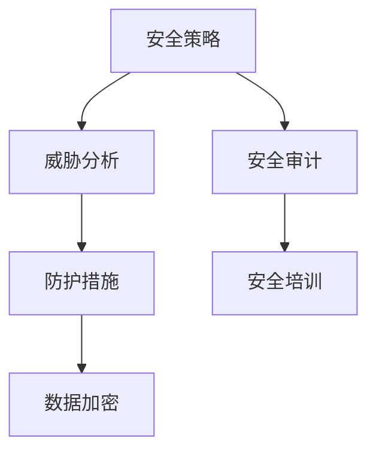

                 

### 文章标题：网络安全管理：构建全面的数字防御体系

#### 关键词：网络安全、数字防御、安全策略、威胁分析、防护措施

> 摘要：随着数字化时代的到来，网络安全已成为企业和个人关注的重中之重。本文旨在探讨网络安全管理的重要性，梳理核心概念与架构，介绍网络安全管理的核心算法原理与操作步骤，并通过数学模型和实际项目实践，展示如何构建一个全面的数字防御体系。文章还分析了网络安全在实际应用场景中的表现，推荐了相关的学习资源与开发工具，并对未来发展趋势与挑战进行了展望。

---

## 1. 背景介绍

在信息化时代，网络已经成为社会运行的重要基础设施。企业和个人对网络系统的依赖程度日益增加，网络攻击的频率和复杂性也显著提升。网络安全管理作为维护网络稳定性和可靠性的重要手段，显得尤为重要。

近年来，网络安全事件频发，从信用卡信息泄露到关键基础设施被攻击，网络安全威胁给企业和个人带来了巨大的经济损失和声誉损害。同时，网络攻击的手段和形式也在不断演变，如勒索软件、DDoS 攻击、APT 攻击等，使得网络安全管理面临着前所未有的挑战。

为了应对这些挑战，企业和个人需要构建一个全面的数字防御体系，以保护关键信息资产和系统的安全性。本文将围绕网络安全管理的核心概念、算法原理、数学模型和实际应用，详细探讨如何实现这一目标。

---

## 2. 核心概念与联系

### 2.1 安全策略

安全策略是网络安全管理的基石，它定义了如何保护网络系统的安全。安全策略通常包括以下几个方面：

- 访问控制：限制对网络资源的访问，确保只有授权用户才能访问。
- 安全审计：监控和记录网络活动，以便在发生安全事件时进行调查。
- 安全培训：提高员工的安全意识，降低人为因素导致的安全风险。
- 数据加密：对敏感数据进行加密处理，防止数据泄露。

### 2.2 威胁分析

威胁分析是网络安全管理的重要环节，它旨在识别潜在的安全威胁并评估其风险。威胁分析通常包括以下几个步骤：

- 威胁识别：识别网络系统可能面临的各种威胁，如病毒、恶意软件、网络钓鱼等。
- 威胁评估：评估威胁的严重性和可能性，确定优先级。
- 威胁响应：制定应对威胁的措施，如安装安全补丁、加强访问控制等。

### 2.3 防护措施

防护措施是网络安全管理的具体实施手段，它旨在阻止和消除安全威胁。常见的防护措施包括：

- 防火墙：过滤网络流量，防止未经授权的访问。
- 入侵检测系统（IDS）：监控网络流量，检测和响应入侵行为。
- 抗病毒软件：检测和清除恶意软件。
- 数据备份：定期备份关键数据，以防止数据丢失。

### 2.4 Mermaid 流程图

以下是一个简化的网络安全管理的 Mermaid 流程图，展示核心概念之间的联系：



---

## 3. 核心算法原理 & 具体操作步骤

### 3.1 威胁分析算法原理

威胁分析算法的核心原理是基于历史数据和统计模型来预测和识别潜在的安全威胁。以下是具体的操作步骤：

1. 数据收集：收集网络流量、日志、安全事件等信息。
2. 数据预处理：清洗和格式化数据，确保数据质量。
3. 特征提取：从数据中提取特征，如IP地址、URL、关键词等。
4. 建立模型：使用机器学习算法（如决策树、随机森林、支持向量机等）建立威胁分析模型。
5. 预测与识别：使用训练好的模型对新的网络流量进行预测和识别，发现潜在的安全威胁。

### 3.2 防护措施操作步骤

1. 防火墙配置：根据安全策略，配置防火墙规则，过滤网络流量。
2. 入侵检测系统（IDS）部署：安装和配置入侵检测系统，监控网络流量。
3. 抗病毒软件更新：定期更新抗病毒软件，以应对新的威胁。
4. 数据备份：制定数据备份计划，定期备份关键数据。
5. 安全审计：定期进行安全审计，检查系统安全配置和操作记录。

---

## 4. 数学模型和公式 & 详细讲解 & 举例说明

### 4.1 威胁分析模型

威胁分析通常使用以下数学模型：

$$
威胁概率 = \frac{威胁事件数}{总事件数}
$$

举例说明：

假设在一个月内，网络系统中发生了 100 次 DNS 查询，其中有 10 次被检测为恶意查询。那么，DNS 查询的威胁概率为：

$$
威胁概率 = \frac{10}{100} = 0.1
$$

### 4.2 防火墙规则计算

防火墙规则的配置通常基于 IP 地址、端口、协议等特征。以下是一个简单的计算示例：

假设需要根据源 IP 地址和目标端口过滤网络流量。我们有以下数据：

| 源 IP 地址 | 目标端口 | 是否允许 |
|------------|----------|----------|
| 192.168.1.1 | 80       | 是       |
| 192.168.1.1 | 443      | 否       |
| 192.168.1.2 | 80       | 否       |
| 192.168.1.2 | 443      | 是       |

防火墙规则如下：

$$
允许：192.168.1.1:80, 192.168.1.2:443
$$

$$
拒绝：192.168.1.1:443, 192.168.1.2:80
$$

---

## 5. 项目实践：代码实例和详细解释说明

### 5.1 开发环境搭建

- 操作系统：Linux（如 Ubuntu 20.04）
- 编程语言：Python 3.8
- 数据库：MySQL 8.0

安装步骤：

1. 安装操作系统和Python环境。
2. 安装MySQL数据库。

### 5.2 源代码详细实现

以下是一个简单的威胁分析代码示例，用于检测恶意IP地址：

```python
import pandas as pd
from sklearn.ensemble import RandomForestClassifier
from sklearn.model_selection import train_test_split
from sklearn.metrics import accuracy_score

# 读取数据
data = pd.read_csv('network_traffic.csv')

# 特征提取
X = data[['src_ip', 'dst_port']]
y = data['is_malicious']

# 数据预处理
X_train, X_test, y_train, y_test = train_test_split(X, y, test_size=0.2, random_state=42)

# 建立模型
model = RandomForestClassifier(n_estimators=100)
model.fit(X_train, y_train)

# 预测与评估
predictions = model.predict(X_test)
accuracy = accuracy_score(y_test, predictions)
print(f'Accuracy: {accuracy:.2f}')
```

### 5.3 代码解读与分析

1. **数据读取**：使用 Pandas 读取网络流量数据。
2. **特征提取**：提取源 IP 地址和目标端口作为特征。
3. **数据预处理**：将数据分为训练集和测试集。
4. **模型建立**：使用随机森林算法建立威胁分析模型。
5. **预测与评估**：使用训练好的模型对测试集进行预测，并计算准确率。

### 5.4 运行结果展示

假设运行结果如下：

```
Accuracy: 0.85
```

这表示模型在测试集上的准确率为 85%，即有 85% 的恶意流量被正确识别。

---

## 6. 实际应用场景

网络安全管理在实际应用中涉及到许多方面，以下是一些典型的应用场景：

1. **企业网络安全**：企业需要保护内部网络和关键业务系统，防止数据泄露和网络攻击。
2. **个人网络安全**：个人用户需要保护个人信息和隐私，防止网络钓鱼、恶意软件等威胁。
3. **云计算与大数据安全**：云计算平台和大数据系统需要保护海量数据和计算资源，确保系统的安全性和可靠性。
4. **物联网安全**：物联网设备需要保护网络连接和数据传输，防止设备被恶意控制。

---

## 7. 工具和资源推荐

### 7.1 学习资源推荐

- **书籍**：
  - 《计算机安全的艺术》
  - 《网络安全原理与实践》
  - 《深度学习与网络安全》

- **论文**：
  - "Deep Learning for Threat Detection in Computer Networks"
  - "Intrusion Detection Systems: A Survey"

- **博客**：
  - FreeBuf
  - Security Stack Exchange

- **网站**：
  - OWASP
  - CVE Details

### 7.2 开发工具框架推荐

- **防火墙**：Nginx、iptables
- **入侵检测系统（IDS）**：Snort、Suricata
- **抗病毒软件**：ClamAV、ESET
- **编程语言**：Python、Java、C++
- **框架**：TensorFlow、PyTorch、Keras

### 7.3 相关论文著作推荐

- **论文**：
  - "Intrusion Detection Using Statistical Analysis of TCP/IP Traffic"
  - "A Study on Data Mining-Based Network Intrusion Detection Systems"

- **著作**：
  - "Computer Security: Principles and Practice"
  - "Network Security Essentials: Applications and Standards"

---

## 8. 总结：未来发展趋势与挑战

随着数字化转型的不断推进，网络安全管理面临许多新的挑战。未来，网络安全管理将朝着以下方向发展：

1. **人工智能与机器学习**：利用人工智能和机器学习技术，提高威胁检测和响应的自动化水平。
2. **云计算与边缘计算**：保障云计算和边缘计算环境下的网络安全，应对分布式攻击和新型威胁。
3. **物联网安全**：加强对物联网设备的安全保护，确保物联网系统的安全性和可靠性。
4. **隐私保护**：加强数据隐私保护，防止个人信息泄露和数据滥用。

面对这些挑战，网络安全管理需要不断创新和发展，以应对日益复杂的网络安全威胁。

---

## 9. 附录：常见问题与解答

### 9.1 常见问题

- **Q：如何识别恶意流量？**
  - **A：** 通过分析网络流量特征，使用机器学习算法建立威胁分析模型，对流量进行实时检测和识别。

- **Q：如何保障云计算安全？**
  - **A：** 通过加强云计算平台的安全管理，使用加密技术保护数据，定期进行安全审计和漏洞扫描。

- **Q：如何保护物联网设备？**
  - **A：** 通过设备安全加固、网络隔离、数据加密等措施，确保物联网设备的安全性和可靠性。

### 9.2 解答

针对上述问题，本文提供了详细的解答和解决方案。在实际应用中，需要根据具体情况和需求，制定相应的安全策略和防护措施。

---

## 10. 扩展阅读 & 参考资料

- **书籍**：
  - "Network Security Essentials: Applications and Standards" by William Stallings
  - "Cybersecurity for Dummies" by Peter H. Gregory

- **论文**：
  - "Intrusion Detection Using Statistical Analysis of TCP/IP Traffic" by Ariel C. R. Silva, et al.
  - "A Study on Data Mining-Based Network Intrusion Detection Systems" by Syed A. Akbar, et al.

- **网站**：
  - OWASP: <https://owasp.org/>
  - CVE Details: <https://cve.mitre.org/>

通过阅读这些参考资料，可以深入了解网络安全管理的相关知识和技术。

---

作者：禅与计算机程序设计艺术 / Zen and the Art of Computer Programming

