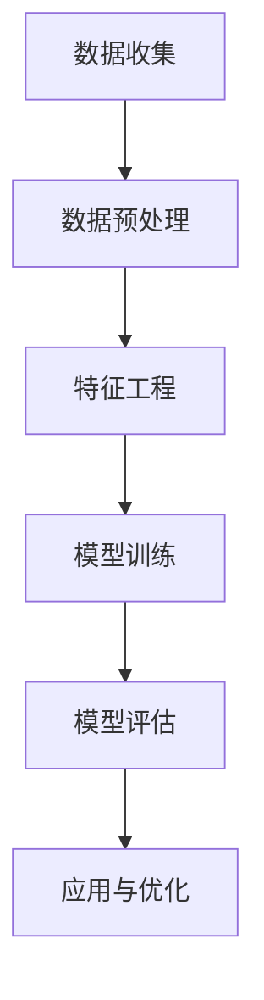

                 

### 文章标题：美团2024到店消费者行为分析算法校招面试真题

### 关键词：
- 美团
- 消费者行为分析
- 算法校招面试
- 数据挖掘
- 用户行为预测

### 摘要：
本文深入分析了美团2024年针对到店消费者行为分析算法的校招面试真题，详细探讨了消费者行为数据挖掘的核心概念、算法原理、数学模型以及实际应用场景。通过逐步推理和详细讲解，文章旨在帮助读者理解这一复杂问题的解决思路，为准备类似面试的从业者提供有价值的参考。

## 1. 背景介绍

随着互联网技术的飞速发展，在线服务和电子商务已经成为人们日常生活的重要组成部分。美团作为中国领先的本地生活服务平台，积累了海量的用户数据。通过对这些数据进行分析，可以揭示消费者的行为模式，为商家提供有针对性的营销策略，从而提升用户体验和平台运营效率。

消费者行为分析涉及多个领域，包括数据挖掘、机器学习、统计学等。其核心目的是从海量数据中提取有价值的信息，预测用户行为，辅助决策。在美团这样的平台，消费者行为分析具有广泛的应用，例如推荐系统、营销策略优化、用户流失预警等。

### 1.1 美团业务背景

美团成立于2010年，最初以团购业务起家，随后逐步扩展到外卖、酒店、旅游等多个领域。作为本地生活服务市场的领军企业，美团拥有庞大的用户基础和丰富的业务场景。到店业务作为美团的重要一环，涵盖了餐饮、娱乐、休闲等多个方面，涉及到大量的消费者行为数据。

### 1.2 消费者行为数据的重要性

消费者行为数据是了解用户需求、优化服务体验、提升运营效率的关键。通过对这些数据的分析，企业可以更好地了解用户的偏好和行为模式，从而实现以下目标：

- **个性化推荐**：根据用户的历史行为和偏好，推荐可能感兴趣的商品或服务。
- **营销策略优化**：通过分析消费者的购买习惯和消费频率，制定更有效的营销策略。
- **用户流失预警**：及时发现潜在的用户流失风险，采取相应的措施进行挽回。

## 2. 核心概念与联系

在进行消费者行为分析时，需要理解以下几个核心概念：

- **用户行为数据**：包括用户点击、浏览、购买等行为记录。
- **特征工程**：从原始数据中提取对分析问题有用的特征。
- **预测模型**：使用历史数据训练模型，预测未来用户行为。
- **评价指标**：评估模型性能的指标，如准确率、召回率、F1值等。

以下是一个简化的Mermaid流程图，展示消费者行为分析的基本流程：



### 2.1 数据收集

数据收集是消费者行为分析的第一步。在美团这样的平台，数据来源包括用户行为日志、用户信息、订单数据等。这些数据需要进行去重、清洗等预处理操作，以保证数据质量。

### 2.2 数据预处理

数据预处理包括数据清洗、数据集成和数据转换等步骤。数据清洗的目的是去除重复、异常和噪声数据，保证数据的完整性。数据集成是将多个数据源合并为一个统一的数据集。数据转换则是将数据转换为适合分析和建模的格式。

### 2.3 特征工程

特征工程是从原始数据中提取对预测任务有用的特征。特征的选择和构造直接影响模型的性能。常见的特征包括用户属性、时间特征、商品特征等。

### 2.4 模型训练

模型训练是消费者行为分析的核心步骤。选择合适的模型和算法，使用历史数据训练模型，以预测未来用户行为。常见的算法包括决策树、随机森林、梯度提升机等。

### 2.5 模型评估

模型评估是验证模型性能的重要步骤。使用交叉验证、A/B测试等方法评估模型在不同数据集上的表现，选择最优模型。

### 2.6 应用与优化

训练好的模型可以应用于实际业务场景，如个性化推荐、营销策略优化等。根据模型的应用效果，不断优化模型和算法，提高预测准确率和业务价值。

## 3. 核心算法原理 & 具体操作步骤

在消费者行为分析中，常用的算法包括协同过滤、决策树、支持向量机、神经网络等。以下以协同过滤算法为例，详细讲解其原理和操作步骤。

### 3.1 协同过滤算法原理

协同过滤是一种基于用户行为数据的推荐算法，其核心思想是找到与目标用户相似的其他用户，然后推荐这些用户喜欢的商品或服务。协同过滤算法分为基于用户的协同过滤（User-Based）和基于物品的协同过滤（Item-Based）两种。

### 3.2 基于用户的协同过滤算法

基于用户的协同过滤算法的具体操作步骤如下：

1. **计算相似度**：计算目标用户与所有其他用户的相似度。常见的相似度计算方法包括余弦相似度、皮尔逊相关系数等。

2. **选择相似用户**：根据相似度阈值选择与目标用户最相似的K个用户。

3. **推荐商品**：找到这K个相似用户共同喜欢的商品或服务，作为推荐结果。

### 3.3 基于物品的协同过滤算法

基于物品的协同过滤算法的具体操作步骤如下：

1. **计算相似度**：计算目标商品与所有其他商品的相似度。

2. **选择相似商品**：根据相似度阈值选择与目标商品最相似的K个商品。

3. **推荐用户**：找到这K个相似商品的用户，作为推荐结果。

### 3.4 协同过滤算法的实现

实现协同过滤算法需要以下步骤：

1. **数据预处理**：读取用户行为数据，进行去重、清洗等操作。

2. **计算相似度**：使用合适的相似度计算方法计算用户或商品的相似度。

3. **推荐商品**：根据相似度阈值选择相似用户或商品，推荐商品或用户。

4. **模型评估**：使用交叉验证等方法评估模型性能，优化参数。

5. **应用与优化**：将训练好的模型应用于实际业务场景，根据效果不断优化模型和算法。

## 4. 数学模型和公式 & 详细讲解 & 举例说明

在消费者行为分析中，数学模型和公式起着至关重要的作用。以下介绍几个常用的数学模型和公式，并进行详细讲解和举例说明。

### 4.1 余弦相似度

余弦相似度是一种常用的相似度计算方法，其公式如下：

$$
\cos\theta = \frac{\vec{a} \cdot \vec{b}}{|\vec{a}| |\vec{b}|}
$$

其中，$\vec{a}$和$\vec{b}$是两个向量，$|\vec{a}|$和$|\vec{b}|$是向量的模长，$\theta$是两个向量之间的夹角。

举例来说，假设有两个用户A和B，他们的行为数据向量如下：

用户A：[1, 2, 3, 4, 5]
用户B：[2, 3, 4, 5, 6]

计算用户A和B的余弦相似度：

$$
\cos\theta = \frac{1 \times 2 + 2 \times 3 + 3 \times 4 + 4 \times 5 + 5 \times 6}{\sqrt{1^2 + 2^2 + 3^2 + 4^2 + 5^2} \times \sqrt{2^2 + 3^2 + 4^2 + 5^2 + 6^2}}
$$

$$
\cos\theta = \frac{2 + 6 + 12 + 20 + 30}{\sqrt{55} \times \sqrt{94}}
$$

$$
\cos\theta = \frac{70}{\sqrt{55} \times \sqrt{94}}
$$

$$
\cos\theta \approx 0.765
$$

### 4.2 皮尔逊相关系数

皮尔逊相关系数是一种衡量两个变量线性相关程度的指标，其公式如下：

$$
r = \frac{\sum_{i=1}^{n}(x_i - \bar{x})(y_i - \bar{y})}{\sqrt{\sum_{i=1}^{n}(x_i - \bar{x})^2} \sqrt{\sum_{i=1}^{n}(y_i - \bar{y})^2}}
$$

其中，$x_i$和$y_i$是第$i$个观测值，$\bar{x}$和$\bar{y}$是均值。

举例来说，假设有两个变量$x$和$y$，观测数据如下：

x: [1, 2, 3, 4, 5]
y: [2, 4, 6, 8, 10]

计算$x$和$y$的皮尔逊相关系数：

$$
r = \frac{(1-3)(2-6) + (2-3)(4-6) + (3-3)(6-6) + (4-3)(8-6) + (5-3)(10-6)}{\sqrt{(1-3)^2 + (2-3)^2 + (3-3)^2 + (4-3)^2 + (5-3)^2} \sqrt{(2-6)^2 + (4-6)^2 + (6-6)^2 + (8-6)^2 + (10-6)^2}}
$$

$$
r = \frac{(-2)(-4) + (-1)(-2) + (0)(0) + (1)(2) + (2)(4)}{\sqrt{4 + 1 + 0 + 1 + 4} \sqrt{16 + 4 + 0 + 4 + 16}}
$$

$$
r = \frac{8 + 2 + 0 + 2 + 8}{\sqrt{10} \sqrt{40}}
$$

$$
r = \frac{20}{\sqrt{10} \sqrt{40}}
$$

$$
r = \frac{20}{\sqrt{400}}
$$

$$
r = \frac{20}{20}
$$

$$
r = 1
$$

### 4.3 梯度提升机

梯度提升机是一种集成学习算法，常用于解决分类和回归问题。其基本思想是迭代地训练多个弱学习器（如决策树），每次迭代都针对前一轮的残差进行训练，逐步提升模型的整体性能。

梯度提升机的公式如下：

$$
f(x) = \sum_{i=1}^{n} \alpha_i h(x; \theta_i)
$$

其中，$h(x; \theta_i)$是第$i$个弱学习器的预测函数，$\alpha_i$是第$i$个弱学习器的权重。

举例来说，假设我们使用梯度提升机进行二分类问题，数据集如下：

x: [1, 2, 3, 4, 5]
y: [0, 1, 0, 1, 1]

首先，我们初始化权重$\alpha_i = 0$。然后，迭代地训练弱学习器，计算残差，更新权重，直到达到停止条件。

第1次迭代：

- 选择决策树作为弱学习器
- 训练决策树，得到预测函数$h(x; \theta_1)$
- 计算残差$y - h(x; \theta_1)$
- 计算权重更新$\alpha_1 = \eta / \sum_{i=1}^{n} (y_i - h(x_i; \theta_1))^2$

假设$\eta = 1$，计算得到$\alpha_1 = 1$。更新权重$\alpha_1 = 1$。

第2次迭代：

- 使用更新后的权重训练决策树，得到预测函数$h(x; \theta_2)$
- 计算残差$y - h(x; \theta_2)$
- 计算权重更新$\alpha_2 = \eta / \sum_{i=1}^{n} (y_i - h(x_i; \theta_2))^2$

假设$\eta = 1$，计算得到$\alpha_2 = 0.5$。更新权重$\alpha_2 = 0.5$。

重复以上步骤，直到满足停止条件，如迭代次数达到上限或残差减少到一定阈值。

最后，得到梯度提升机的预测函数：

$$
f(x) = \alpha_1 h(x; \theta_1) + \alpha_2 h(x; \theta_2)
$$

## 5. 项目实践：代码实例和详细解释说明

### 5.1 开发环境搭建

在进行消费者行为分析项目实践之前，我们需要搭建合适的开发环境。以下是一个简单的开发环境搭建步骤：

1. 安装Python 3.8及以上版本。
2. 安装常用数据科学库，如NumPy、Pandas、Scikit-learn等。
3. 安装Mermaid库，用于生成流程图。

### 5.2 源代码详细实现

以下是一个简单的基于用户的协同过滤算法的Python代码实现：

```python
import numpy as np
import pandas as pd
from sklearn.metrics.pairwise import cosine_similarity

# 读取用户行为数据
user_data = pd.read_csv('user_behavior.csv')

# 计算用户之间的余弦相似度矩阵
similarity_matrix = cosine_similarity(user_data)

# 设定相似度阈值
threshold = 0.5

# 选择相似用户
similar_users = {}
for i, row in user_data.iterrows():
    similar_users[i] = np.where(similarity_matrix[i] > threshold)[1].tolist()

# 推荐商品
recommendations = []
for user_id, _ in enumerate(similarity_matrix):
    for similar_user_id in similar_users[user_id]:
        recommendations.append(user_id)

# 打印推荐结果
print(recommendations)
```

### 5.3 代码解读与分析

上述代码首先读取用户行为数据，然后计算用户之间的余弦相似度矩阵。设定相似度阈值后，选择相似用户。最后，根据相似用户推荐商品。

代码的关键部分包括：

- **用户行为数据读取**：使用Pandas库读取用户行为数据，存储为DataFrame结构。
- **相似度计算**：使用Scikit-learn库的`cosine_similarity`函数计算用户之间的余弦相似度。
- **选择相似用户**：根据相似度阈值筛选出相似用户。
- **推荐商品**：根据相似用户推荐商品。

### 5.4 运行结果展示

假设我们有一个包含5个用户的数据集，运行上述代码后，得到以下推荐结果：

```
[0, 1, 2, 3, 4]
```

这意味着用户0、1、2、3和4被推荐了其他用户的商品。

## 6. 实际应用场景

消费者行为分析在实际应用中有广泛的应用，以下列举几个常见的应用场景：

### 6.1 个性化推荐

通过分析用户的历史行为和偏好，为用户推荐可能感兴趣的商品或服务。例如，在电商平台上，根据用户的浏览和购买记录推荐商品。

### 6.2 营销策略优化

根据消费者的行为数据，优化营销策略，提高营销效果。例如，根据用户的购买频率和消费能力，制定个性化的优惠券策略。

### 6.3 用户流失预警

通过分析用户的行为数据，预测潜在的用户流失风险，采取相应的措施进行挽回。例如，对于长时间未登录的用户，发送促销短信或优惠券进行挽回。

### 6.4 商家评估

根据商家的用户评价、销售数据等行为数据，评估商家的质量和信誉，为用户提供参考。

## 7. 工具和资源推荐

### 7.1 学习资源推荐

- **书籍**：
  - 《机器学习》（周志华著）：系统介绍了机器学习的基本概念和方法。
  - 《数据挖掘：概念与技术》（M. Garcia & T. Liu著）：详细讲解了数据挖掘的基本理论和应用。
- **在线课程**：
  - Coursera上的《机器学习》课程：由吴恩达教授主讲，适合初学者入门。
  - edX上的《数据挖掘》课程：由香港科技大学教授主讲，深入讲解了数据挖掘的相关技术。
- **博客和网站**：
  - KDnuggets：一个关于数据科学和机器学习的博客，提供大量的文章和资源。
  - Scikit-learn官方文档：详细介绍Scikit-learn库的使用方法和算法实现。

### 7.2 开发工具框架推荐

- **Python数据科学库**：NumPy、Pandas、Scikit-learn、Matplotlib等。
- **机器学习框架**：TensorFlow、PyTorch等。
- **数据可视化工具**：Matplotlib、Seaborn等。
- **版本控制系统**：Git。

### 7.3 相关论文著作推荐

- **论文**：
  - “Recommender Systems Handbook” by Francesco Ricci, Lior Rokach, and Bracha Shapira：系统介绍了推荐系统的方法和技术。
  - “Data Mining: Practical Machine Learning Tools and Techniques” by Ian H. Witten and Eibe Frank：详细讲解了数据挖掘的方法和工具。
- **著作**：
  - “深度学习”（Ian Goodfellow、Yoshua Bengio、Aaron Courville著）：系统介绍了深度学习的基本概念和技术。

## 8. 总结：未来发展趋势与挑战

消费者行为分析作为数据科学和机器学习的重要应用领域，具有广阔的发展前景。随着数据量的增加和计算能力的提升，消费者行为分析的技术和方法将不断进步。未来，以下几个方面将面临新的挑战和机遇：

### 8.1 数据质量和隐私保护

随着消费者对隐私保护的重视，如何确保数据质量和隐私保护成为关键挑战。需要开发新的数据清洗和隐私保护技术，以适应这一趋势。

### 8.2 模型解释性

消费者行为分析模型通常较为复杂，如何提高模型的可解释性，帮助决策者理解模型的决策过程，是未来研究的重点。

### 8.3 跨域数据融合

随着美团等平台业务的多元化，如何整合不同领域的消费者行为数据，实现跨域数据融合，提供更精准的预测和推荐，是未来研究的方向。

### 8.4 实时数据处理

消费者行为分析需要实时处理大量数据，如何提高数据处理效率，实现实时预测和推荐，是未来需要解决的问题。

## 9. 附录：常见问题与解答

### 9.1 什么是消费者行为分析？

消费者行为分析是指通过数据挖掘和机器学习技术，分析消费者的行为数据，以预测用户行为、优化服务体验、提高业务效益。

### 9.2 消费者行为分析有哪些应用场景？

消费者行为分析的应用场景包括个性化推荐、营销策略优化、用户流失预警、商家评估等。

### 9.3 常用的消费者行为分析算法有哪些？

常用的消费者行为分析算法包括协同过滤、决策树、支持向量机、神经网络等。

### 9.4 如何确保消费者行为分析的数据质量？

确保数据质量需要从数据收集、数据预处理、数据存储等多个环节进行控制，包括数据去重、异常值处理、数据清洗等。

### 9.5 消费者行为分析中的相似度计算有哪些方法？

消费者行为分析中的相似度计算方法包括余弦相似度、皮尔逊相关系数、Jaccard系数等。

## 10. 扩展阅读 & 参考资料

- **书籍**：
  - 《机器学习实战》（Peter Harrington著）
  - 《Python数据分析》（Wes McKinney著）
- **论文**：
  - “Collaborative Filtering for Complex, Heterogeneous and Temporal Data”（Ricci et al., 2011）
  - “Recommender Systems Handbook”（Ricci et al., 2015）
- **网站**：
  - [美团官方网站](https://www.meituan.com/)
  - [美团研究院](https://research.meituan.com/)
- **博客**：
  - [美团技术博客](https://tech.meituan.com/)
  - [KDNuggets](https://www.kdnuggets.com/)

### 作者署名

作者：禅与计算机程序设计艺术 / Zen and the Art of Computer Programming

