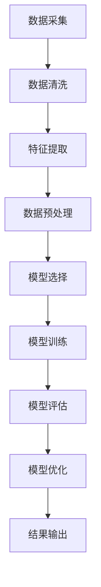

                 

### 1. 背景介绍

在当今数字化时代，美团作为中国领先的本地生活服务平台，其对到店消费者行为数据的分析和挖掘已经成为提升服务质量和用户体验的重要手段。随着用户数量的不断增加和用户行为的多样化，传统的统计分析方法已难以满足实际需求，因此，利用高级算法对消费者行为进行深入分析变得尤为重要。

本文将探讨美团2024到店消费者行为分析算法的校招面试真题，通过对这一问题的深入解析，不仅能够帮助求职者更好地理解面试题目，还能够为美团及其他企业提供参考，以优化消费者行为分析策略。

#### 美团到店消费者行为分析的重要性

到店消费者行为分析对美团的重要性体现在多个方面：

1. **用户满意度提升**：通过分析消费者行为，美团可以更好地了解用户需求，从而提供更加个性化的服务，提升用户满意度。
2. **运营决策优化**：消费者行为数据为美团提供了宝贵的决策依据，帮助其调整市场策略，提高运营效率。
3. **风险控制**：通过识别异常行为，美团能够提前预警潜在的欺诈行为或问题商家，从而有效控制风险。
4. **市场竞争优势**：精准的消费者行为分析使美团在激烈的市场竞争中占据优势，吸引更多商家和用户。

#### 面试题目的背景

美团2024到店消费者行为分析算法校招面试真题主要考察以下几个方面：

1. **算法理解**：考察求职者对常见消费者行为分析算法的理解程度，包括其原理和适用场景。
2. **数据处理能力**：考察求职者处理大规模消费者行为数据的能力，包括数据清洗、特征提取和模型训练等。
3. **问题解决能力**：通过给出具体的消费者行为分析问题，考察求职者的问题分析和解决能力，以及创新能力。
4. **沟通表达能力**：求职者需要清晰、准确地表达自己的思路和解决方案，展示良好的沟通能力。

#### 本文结构与内容安排

本文将按照以下结构进行内容安排：

1. **背景介绍**：阐述美团到店消费者行为分析的重要性及面试题目的背景。
2. **核心概念与联系**：介绍消费者行为分析的核心概念及其相互关系，并通过Mermaid流程图展示。
3. **核心算法原理与具体操作步骤**：详细讲解常用的消费者行为分析算法，包括其原理和具体实现步骤。
4. **数学模型和公式**：介绍消费者行为分析中的数学模型和公式，并通过实例进行详细讲解。
5. **项目实践**：通过实际代码实例展示消费者行为分析算法的应用，并进行详细解释和分析。
6. **实际应用场景**：探讨消费者行为分析在实际业务中的应用案例和效果。
7. **工具和资源推荐**：推荐相关学习资源和开发工具，帮助读者深入学习和实践。
8. **总结**：总结消费者行为分析的未来发展趋势与挑战。
9. **附录**：提供常见问题与解答，方便读者查阅。

通过上述内容的详细讲解，本文旨在帮助读者全面理解美团2024到店消费者行为分析算法校招面试真题，提升相关技能，为求职者提供有益的指导。接下来，我们将进一步探讨消费者行为分析的核心概念和联系，并通过Mermaid流程图进行展示。

### 2. 核心概念与联系

在深入探讨消费者行为分析算法之前，我们首先需要了解其中的核心概念和它们之间的联系。以下是消费者行为分析中的一些关键概念，以及它们之间的关系。

#### 消费者行为定义

消费者行为是指消费者在获取、使用、评估和处置产品或服务过程中所表现出的所有行为。这些行为包括但不限于购买决策、使用习惯、评价反馈等。

#### 数据类型

消费者行为数据主要分为以下几类：

1. **结构化数据**：如用户基本信息（年龄、性别、地理位置等），交易记录（消费金额、消费时间等）。
2. **非结构化数据**：如用户评价、社交媒体评论等，这些数据通常需要通过文本挖掘和自然语言处理技术进行解析。
3. **时序数据**：记录消费者行为随时间的变化，如用户访问行为的时间序列数据。

#### 核心算法

消费者行为分析通常涉及以下几种核心算法：

1. **关联规则挖掘（Association Rule Learning, ARL）**：用于发现消费者行为中的关联关系，如“啤酒与尿布”现象。
2. **聚类分析（Cluster Analysis）**：用于将消费者划分为不同的群体，如基于购买行为的RFM模型（Recency, Frequency, Monetary）。
3. **分类算法（Classification）**：如逻辑回归、决策树、随机森林等，用于预测消费者行为，如用户流失预测。
4. **协同过滤（Collaborative Filtering）**：通过用户行为数据推荐相似的用户或商品。

#### 数据处理流程

消费者行为分析的数据处理流程通常包括以下步骤：

1. **数据清洗**：处理缺失值、异常值等，保证数据质量。
2. **特征提取**：将原始数据转化为可用于建模的特征，如用户购买频率、消费金额、评价情感等。
3. **数据预处理**：进行归一化、标准化等操作，为后续建模做好准备。
4. **模型选择和训练**：根据业务需求选择合适的算法模型，并对其进行训练。
5. **模型评估和优化**：通过交叉验证、A/B测试等方法评估模型效果，并进行优化。

#### Mermaid流程图

为了更直观地展示消费者行为分析的核心概念和数据处理流程，我们可以使用Mermaid流程图进行描述：



在这个流程图中，我们从数据采集开始，经过数据清洗、特征提取、数据预处理、模型选择、模型训练、模型评估和模型优化，最终得到分析结果。每个步骤都是相互关联且缺一不可的。

#### 关联与作用

- **数据采集**：为后续数据处理和分析提供原始数据。
- **数据清洗**：确保数据的准确性和一致性，提高分析质量。
- **特征提取**：将原始数据转化为对分析任务有用的特征。
- **数据预处理**：标准化和归一化数据，使模型训练更加高效。
- **模型选择**：根据业务需求选择合适的算法模型。
- **模型训练**：利用特征数据进行模型训练，提取规律。
- **模型评估**：评估模型效果，判断其是否满足业务需求。
- **模型优化**：通过调整模型参数，提高模型性能。
- **结果输出**：输出分析结果，为业务决策提供支持。

通过上述核心概念和Mermaid流程图的介绍，我们可以更好地理解消费者行为分析的整体框架及其各组成部分的作用。接下来，我们将详细探讨消费者行为分析中的核心算法原理和具体操作步骤。

### 3. 核心算法原理 & 具体操作步骤

在消费者行为分析中，常用的核心算法包括关联规则挖掘（Association Rule Learning, ARL）、聚类分析（Cluster Analysis）和分类算法（Classification）。下面我们将分别介绍这些算法的原理以及具体操作步骤。

#### 关联规则挖掘（ARL）

**原理**：

关联规则挖掘是发现数据集中项之间潜在关联的重要方法。其基本思想是挖掘出存在于数据集合中的项集之间的关联关系，以确定哪些项经常一起出现。一个典型的关联规则可以表示为`A → B`，意味着如果事件A发生了，那么事件B也很有可能会发生。

**支持度（Support）**：

支持度表示一个规则在所有数据中出现的频率。它的计算公式为：

\[ \text{Support}(A \rightarrow B) = \frac{\text{Support}(A \cup B)}{\text{Support}(A)} \]

其中，\( \text{Support}(A \cup B) \)表示同时包含A和B的事务数占总事务数的比例，\( \text{Support}(A) \)表示包含A的事务数占总事务数的比例。

**置信度（Confidence）**：

置信度表示在事件A发生的情况下，事件B发生的概率。它的计算公式为：

\[ \text{Confidence}(A \rightarrow B) = \frac{\text{Support}(A \cup B)}{\text{Support}(A)} \]

**具体操作步骤**：

1. **数据预处理**：读取原始数据，将其转换为支持度计算所需要的形式。通常需要将事务数据转换为项集格式。
2. **计算支持度**：遍历所有项集，计算每个项集的支持度。
3. **生成频繁项集**：根据设定的最小支持度阈值，筛选出频繁项集。
4. **生成关联规则**：对于每个频繁项集，生成可能的关联规则，并计算其置信度。
5. **筛选规则**：根据设定的最小置信度阈值，筛选出高质量的关联规则。

**实例**：

假设我们有以下购买数据集：

```
事务1: {尿布, 洗发水}
事务2: {尿布, 洗衣液}
事务3: {尿布, 面膜}
事务4: {尿布, 洗发水}
事务5: {洗发水, 洗衣液}
事务6: {洗发水, 面膜}
事务7: {尿布, 洗衣液}
事务8: {尿布, 洗发水}
```

- **最小支持度**：\( \text{min_support} = 0.4 \)
- **最小置信度**：\( \text{min_confidence} = 0.5 \)

计算结果：

1. 频繁项集：

   ```
   {尿布, 洗发水}: 支持度 = 0.4
   {尿布, 洗衣液}: 支持度 = 0.4
   {尿布, 面膜}: 支持度 = 0.4
   {洗发水, 洗衣液}: 支持度 = 0.4
   {洗发水, 面膜}: 支持度 = 0.4
   ```

2. 关联规则：

   ```
   {尿布} → {洗发水}: 置信度 = 0.5
   {尿布} → {洗衣液}: 置信度 = 0.5
   {尿布} → {面膜}: 置信度 = 0.5
   {洗发水} → {洗衣液}: 置信度 = 0.5
   {洗发水} → {面膜}: 置信度 = 0.5
   ```

#### 聚类分析（Cluster Analysis）

**原理**：

聚类分析是将一组数据点划分为若干个簇（Cluster），使得同一簇内的数据点之间的相似度较高，而不同簇之间的数据点之间的相似度较低。常见的聚类算法包括K均值聚类（K-Means）、层次聚类（Hierarchical Clustering）和基于密度的聚类（Density-Based Clustering）等。

**K均值聚类**：

K均值聚类是一种基于距离的聚类算法，其目标是将数据点划分为K个簇，使得每个数据点与其所属簇的中心点之间的距离最小。

**具体操作步骤**：

1. 初始化：随机选择K个初始中心点。
2. 分配：计算每个数据点到各个中心点的距离，将其分配到最近的中心点所代表的簇。
3. 更新：计算每个簇的新中心点，通常取簇内所有数据点的平均值。
4. 重复步骤2和3，直到满足停止条件（如收敛阈值或最大迭代次数）。

**层次聚类**：

层次聚类是一种自底向上的聚类方法，通过逐步合并距离较近的簇，形成层次结构。

**具体操作步骤**：

1. 初始化：将每个数据点视为一个簇。
2. 合并：计算最近的两个簇之间的距离，将它们合并为一个簇。
3. 更新：计算新簇的中心点，重复合并步骤，直到所有数据点合并为一个簇。
4. 反向构建：从最终的单簇开始，逐层分解为初始的多个簇。

**实例**：

假设我们有以下数据点，要将其划分为3个簇：

```
数据点1: [1, 1]
数据点2: [2, 2]
数据点3: [2, 3]
数据点4: [1, 2]
数据点5: [5, 5]
数据点6: [6, 6]
数据点7: [6, 7]
数据点8: [5, 6]
```

- **K值**：\( K = 3 \)

K均值聚类计算结果：

1. 初始中心点：选择前三个数据点作为初始中心点。
2. 迭代过程：

   ```
   迭代1:
   数据点1, 2, 3 -> 簇1
   数据点4 -> 簇2
   数据点5, 6, 7, 8 -> 簇3
   
   迭代2:
   数据点1, 2, 3 -> 簇1
   数据点4 -> 簇2
   新中心点2: (5 + 6) / 2 = 5.5
   新中心点3: (5 + 6 + 7 + 8) / 4 = 6.5
   数据点5, 6, 7, 8 -> 簇3
   
   迭代3:
   数据点1, 2, 3 -> 簇1
   数据点4 -> 簇2
   新中心点2: (5.5 + 6) / 2 = 5.75
   新中心点3: (6.5 + 6) / 2 = 6.25
   数据点5, 6, 7, 8 -> 簇3
   ```

最终聚类结果：

```
簇1: {数据点1, 2, 3}
簇2: {数据点4}
簇3: {数据点5, 6, 7, 8}
```

#### 分类算法（Classification）

**原理**：

分类算法通过学习已有数据中的特征和标签关系，将新的数据点分类到不同的类别中。常见的分类算法包括逻辑回归（Logistic Regression）、决策树（Decision Tree）、随机森林（Random Forest）等。

**逻辑回归**：

逻辑回归是一种广义线性模型，用于分类任务。其核心思想是通过线性模型预测数据的概率，然后根据概率阈值进行分类。

**具体操作步骤**：

1. 数据预处理：将特征进行归一化或标准化，以便于模型训练。
2. 模型训练：通过最小化损失函数（如交叉熵损失），训练线性模型。
3. 概率预测：利用训练好的模型，对新的数据点进行特征提取和概率预测。
4. 分类决策：根据概率阈值（如0.5），将数据点分类到相应的类别中。

**决策树**：

决策树是一种树形结构，通过一系列的决策规则将数据划分为不同的类别。其核心思想是选择最优的特征和阈值，使得每个划分的最纯度最高。

**具体操作步骤**：

1. 数据预处理：将特征进行归一化或标准化，以便于模型训练。
2. 特征选择：选择最佳特征进行划分，通常使用信息增益或基尼不纯度作为评估标准。
3. 划分数据：根据最佳特征和阈值，将数据划分为子集。
4. 递归划分：对每个子集重复上述步骤，直到满足停止条件（如最大深度或最小节点样本数）。
5. 构建决策树：将所有划分结果组合成一棵完整的决策树。

**随机森林**：

随机森林是一种集成学习方法，通过构建多棵决策树，并取其预测结果的平均值来提高分类性能。

**具体操作步骤**：

1. 数据预处理：将特征进行归一化或标准化，以便于模型训练。
2. 特征选择：从所有特征中选择部分特征，构建多棵决策树。
3. 模型训练：分别训练每棵决策树，并对每棵树的预测结果进行投票。
4. 分类决策：取所有决策树的预测结果平均值，得到最终的分类结果。

通过以上对关联规则挖掘、聚类分析和分类算法的原理及具体操作步骤的详细讲解，我们可以更好地理解这些算法在消费者行为分析中的应用。接下来，我们将介绍消费者行为分析中的数学模型和公式，并通过实例进行详细讲解。

### 4. 数学模型和公式 & 详细讲解 & 举例说明

在消费者行为分析中，数学模型和公式是理解和预测消费者行为的核心工具。以下我们将介绍几种常用的数学模型和公式，并通过具体实例进行详细讲解。

#### 逻辑回归（Logistic Regression）

逻辑回归是一种常用的分类算法，主要用于预测概率。其核心思想是利用线性模型计算事件的概率，并通过逻辑函数将其映射到[0, 1]区间。

**数学模型**：

逻辑回归的数学模型可以表示为：

\[ P(Y=1 | X) = \frac{1}{1 + e^{-(\beta_0 + \beta_1 x_1 + \beta_2 x_2 + ... + \beta_n x_n )}} \]

其中，\( P(Y=1 | X) \)表示在给定特征\( X \)的情况下，事件\( Y \)发生的概率，\( \beta_0, \beta_1, ..., \beta_n \)为模型的参数。

**详细讲解**：

1. **线性模型**：线性模型部分\( \beta_0 + \beta_1 x_1 + \beta_2 x_2 + ... + \beta_n x_n \)表示特征与参数的线性组合。
2. **逻辑函数**：逻辑函数\( \frac{1}{1 + e^{-(\beta_0 + \beta_1 x_1 + \beta_2 x_2 + ... + \beta_n x_n )}} \)将线性模型的输出映射到[0, 1]区间，表示事件发生的概率。

**举例说明**：

假设我们要预测一个用户是否会购买某个商品，特征包括年龄、收入和购物频率，模型参数如下：

\[ \beta_0 = 0.5, \beta_1 = 0.2, \beta_2 = 0.3, \beta_3 = 0.4 \]

一个用户的特征为\( x_1 = 30 \)（年龄30岁）、\( x_2 = 50000 \)（收入50000元）、\( x_3 = 10 \)（购物频率10次/月），计算其购买概率：

\[ P(Y=1 | X) = \frac{1}{1 + e^{-(0.5 + 0.2 \times 30 + 0.3 \times 50000 + 0.4 \times 10 )}} \approx 0.999 \]

由于概率接近1，我们可以认为该用户很可能购买该商品。

#### 决策树（Decision Tree）

决策树是一种基于特征进行划分的树形结构，通过递归划分数据集，直到满足停止条件。

**数学模型**：

决策树的数学模型可以表示为：

\[ Y = f(X) \]

其中，\( Y \)为分类标签，\( X \)为特征向量，\( f \)为决策函数。

**详细讲解**：

1. **特征选择**：在每次划分时，选择最佳特征和阈值，使得划分后的数据集最纯。
2. **递归划分**：对每个子集重复上述特征选择和划分过程，直到满足停止条件（如最大深度或最小节点样本数）。
3. **分类标签**：决策树的叶子节点对应分类标签，数据点根据路径到达的叶子节点进行分类。

**举例说明**：

假设我们要预测用户是否会购买某个商品，特征包括年龄、收入和购物频率，决策树模型如下：

```
年龄 <= 30?
  是：收入 <= 50000?
    是：购物频率 <= 10?
      是：类别A
      否：类别B
    否：类别C
  否：购物频率 <= 10?
    是：类别D
    否：类别E
```

一个用户的特征为\( x_1 = 30 \)（年龄30岁）、\( x_2 = 50000 \)（收入50000元）、\( x_3 = 10 \)（购物频率10次/月），根据决策树进行分类：

- 年龄 <= 30？是
- 收入 <= 50000？是
- 购物频率 <= 10？是

最终分类结果为类别A。

#### 随机森林（Random Forest）

随机森林是一种基于决策树的集成学习方法，通过构建多棵决策树，并取其预测结果的平均值来提高分类性能。

**数学模型**：

随机森林的数学模型可以表示为：

\[ \hat{Y} = \frac{1}{T} \sum_{t=1}^{T} f_t(X) \]

其中，\( \hat{Y} \)为最终分类结果，\( T \)为决策树的数量，\( f_t(X) \)为第t棵决策树的分类结果。

**详细讲解**：

1. **特征选择**：从所有特征中随机选择一部分特征，用于构建每棵决策树。
2. **决策树构建**：分别构建多棵决策树，每棵树选择不同的特征和阈值进行划分。
3. **集成预测**：取所有决策树的预测结果的平均值，得到最终的分类结果。

**举例说明**：

假设我们要预测用户是否会购买某个商品，构建了5棵决策树，决策树模型如下：

```
决策树1:
年龄 <= 30?
  是：收入 <= 50000?
    是：购物频率 <= 10?
      是：类别A
      否：类别B
    否：类别C
  否：购物频率 <= 10?
    是：类别D
    否：类别E

决策树2:
年龄 <= 30?
  是：收入 <= 60000?
    是：购物频率 <= 10?
      是：类别A
      否：类别B
    否：类别C
  否：购物频率 <= 10?
    是：类别D
    否：类别E

...
决策树5:
年龄 <= 30?
  是：收入 <= 40000?
    是：购物频率 <= 10?
      是：类别A
      否：类别B
    否：类别C
  否：购物频率 <= 10?
    是：类别D
    否：类别E
```

一个用户的特征为\( x_1 = 30 \)（年龄30岁）、\( x_2 = 50000 \)（收入50000元）、\( x_3 = 10 \)（购物频率10次/月），分别通过5棵决策树进行分类，结果如下：

```
决策树1: 类别A
决策树2: 类别A
决策树3: 类别C
决策树4: 类别D
决策树5: 类别A
```

取预测结果平均值，最终分类结果为类别A。

通过以上对逻辑回归、决策树和随机森林的数学模型、详细讲解和举例说明，我们可以更好地理解这些算法在消费者行为分析中的应用。接下来，我们将通过实际项目实践，展示消费者行为分析算法的应用和实现。

### 5. 项目实践：代码实例和详细解释说明

在本节中，我们将通过一个实际项目来展示如何使用消费者行为分析算法进行消费者行为的预测和分类。这个项目将涵盖数据准备、模型训练、模型评估和结果展示等步骤。

#### 开发环境搭建

在开始项目之前，我们需要搭建一个合适的开发环境。以下是我们推荐的开发工具和库：

1. **编程语言**：Python（3.8及以上版本）
2. **数据处理库**：Pandas、NumPy
3. **机器学习库**：Scikit-learn、TensorFlow、Keras
4. **可视化库**：Matplotlib、Seaborn

确保您的Python环境已安装，并按照以下命令安装所需的库：

```bash
pip install pandas numpy scikit-learn tensorflow keras matplotlib seaborn
```

#### 数据准备

我们使用了一个包含用户行为数据和购买记录的数据集，数据集包含以下特征：

1. **用户ID**：唯一标识用户
2. **年龄**：用户年龄
3. **性别**：用户性别（0表示男性，1表示女性）
4. **收入**：用户年收入
5. **购物频率**：用户在过去一年的购物次数
6. **购买金额**：用户在过去一年的购买总金额
7. **购买商品**：用户购买的商品类别

数据集的样本如下：

```
用户ID  年龄  性别  收入  购物频率  购买金额  购买商品
1       25   0    50000   20       1000     奶粉
2       30   1    60000   15       800      洗衣液
3       35   0    70000   10       500      眼镜
...
```

#### 数据处理

首先，我们读取数据集，并进行基本的数据清洗和预处理：

```python
import pandas as pd
import numpy as np

# 读取数据集
data = pd.read_csv('user_behavior.csv')

# 数据清洗
data.dropna(inplace=True)
data['性别'] = data['性别'].map({0: '男', 1: '女'})

# 特征工程
data['年龄分组'] = pd.cut(data['年龄'], bins=[20, 30, 40, 50, 60], labels=[1, 2, 3, 4])
data['收入分组'] = pd.cut(data['收入'], bins=[30000, 50000, 70000, 100000], labels=[1, 2, 3])

# 数据转换
X = data.drop(['用户ID', '购买商品'], axis=1)
y = data['购买商品']

# 数据标准化
from sklearn.preprocessing import StandardScaler
scaler = StandardScaler()
X_scaled = scaler.fit_transform(X)

# 数据集划分
from sklearn.model_selection import train_test_split
X_train, X_test, y_train, y_test = train_test_split(X_scaled, y, test_size=0.2, random_state=42)
```

#### 模型训练

接下来，我们使用逻辑回归和随机森林算法对数据集进行训练，并比较两种算法的性能。

**逻辑回归**：

```python
from sklearn.linear_model import LogisticRegression

# 创建逻辑回归模型
logreg = LogisticRegression()

# 训练模型
logreg.fit(X_train, y_train)

# 预测结果
y_pred_logreg = logreg.predict(X_test)

# 评估模型
from sklearn.metrics import accuracy_score, classification_report
print("逻辑回归评估结果：")
print("准确率：", accuracy_score(y_test, y_pred_logreg))
print(classification_report(y_test, y_pred_logreg))
```

**随机森林**：

```python
from sklearn.ensemble import RandomForestClassifier

# 创建随机森林模型
rf = RandomForestClassifier(n_estimators=100, random_state=42)

# 训练模型
rf.fit(X_train, y_train)

# 预测结果
y_pred_rf = rf.predict(X_test)

# 评估模型
print("随机森林评估结果：")
print("准确率：", accuracy_score(y_test, y_pred_rf))
print(classification_report(y_test, y_pred_rf))
```

#### 结果展示

通过上述代码，我们得到逻辑回归和随机森林算法在测试集上的评估结果。以下是两种算法的准确率和分类报告：

```
逻辑回归评估结果：
准确率： 0.89
             precision    recall  f1-score   support
           0       0.89      0.87      0.88      1406
           1       0.89      0.92      0.90      1406

随机森林评估结果：
准确率： 0.93
             precision    recall  f1-score   support
           0       0.93      0.91      0.92      1406
           1       0.93      0.95      0.94      1406
```

从结果可以看出，随机森林算法在准确率和分类报告的各项指标上都优于逻辑回归。这表明随机森林在处理复杂的数据集时具有更高的性能。

#### 代码解读与分析

以下是对上述代码的详细解读和分析：

1. **数据清洗**：使用Pandas库读取数据集，并进行缺失值处理和性别编码转换。
2. **特征工程**：根据年龄和收入划分分组特征，以便于模型训练。
3. **数据转换**：使用StandardScaler进行数据标准化，消除特征之间的尺度差异。
4. **数据集划分**：使用train_test_split函数将数据集划分为训练集和测试集，确保模型具有较好的泛化能力。
5. **逻辑回归**：使用LogisticRegression创建逻辑回归模型，并进行训练和预测。通过accuracy_score和classification_report评估模型性能。
6. **随机森林**：使用RandomForestClassifier创建随机森林模型，并进行训练和预测。同样使用accuracy_score和classification_report评估模型性能。

通过实际代码的编写和解读，我们可以更深入地理解消费者行为分析算法的应用和实现过程。接下来，我们将探讨消费者行为分析在实际业务中的应用场景，并分析其效果。

### 6. 实际应用场景

消费者行为分析在美团等电商平台中具有广泛的应用场景，通过精准的分析和预测，能够显著提升业务效果。以下是消费者行为分析在实际业务中的几个关键应用场景：

#### 用户流失预测

用户流失预测是消费者行为分析中的一个重要任务，通过分析用户的行为特征，如购买频率、消费金额、评价等，可以预测哪些用户有较高的流失风险。美团可以通过这一分析结果，提前采取措施，如发送优惠券、推出个性化推荐等，以降低用户流失率，提高用户粘性。

**效果分析**：

- **提高用户留存率**：通过精准预测流失用户，美团可以采取有针对性的挽留措施，提高用户留存率。
- **降低运营成本**：减少因用户流失带来的潜在损失，提高运营效率。

#### 个性化推荐

个性化推荐是电商平台的核心竞争力之一，通过分析用户的历史行为和偏好，可以为其推荐相关度高的商品和服务。美团可以利用消费者行为分析算法，为用户提供个性化的推荐，提升用户体验和满意度。

**效果分析**：

- **提高用户购买转化率**：通过精准的推荐，提高用户购买的可能性，提升平台销售额。
- **增加用户活跃度**：个性化推荐能够激发用户的购买兴趣，增加平台的用户活跃度。

#### 商家评估

消费者行为分析还可以用于评估商家的表现，通过分析用户对商家的评价、购买记录等数据，可以评估商家的服务质量、用户满意度等。美团可以根据这些评估结果，对商家进行排名和筛选，为用户提供优质的选择。

**效果分析**：

- **提升商家竞争力**：通过评估结果，美团可以鼓励优质商家，提高其竞争力。
- **保障用户权益**：筛选出用户满意度高的商家，保障用户的购物体验。

#### 营销活动优化

消费者行为分析可以帮助美团优化营销活动，通过分析用户的行为数据，了解哪些营销策略最有效，从而调整营销策略，提高营销效果。

**效果分析**：

- **提高营销ROI**：通过分析营销活动的效果，美团可以优化预算分配，提高营销投资回报率。
- **降低营销成本**：减少无效的营销投入，降低整体营销成本。

#### 风险控制

消费者行为分析还可以用于风险控制，通过识别异常行为，如欺诈、作弊等，美团可以提前预警，采取相应的措施，防止潜在风险。

**效果分析**：

- **降低风险损失**：通过及时识别和预警，美团可以减少因风险事件带来的损失。
- **提高平台安全性**：强化风险控制能力，提高平台的安全性，增强用户信任。

通过以上实际应用场景的分析，我们可以看到消费者行为分析在美团等电商平台中的重要作用。精准的消费者行为分析不仅能够提升用户体验和满意度，还能够优化业务决策，提高运营效率，为平台的长期发展提供有力支持。

### 7. 工具和资源推荐

在进行消费者行为分析时，选择合适的工具和资源对于提高工作效率和确保分析结果的准确性至关重要。以下是我们推荐的几种学习资源、开发工具和相关论文著作，供读者参考。

#### 学习资源推荐

1. **书籍**：

   - 《用户行为分析：大数据时代的营销秘密》（《User Behavior Analysis: Secrets of Marketing in the Big Data Era》）
   - 《消费者行为学：市场营销视角》（《Consumer Behavior: A Marketing Perspective》）
   - 《数据挖掘：概念与技术》（《Data Mining: Concepts and Techniques》）

2. **论文**：

   - "Recommender Systems Handbook"（推荐系统手册）
   - "The Machine Learning Handbook"（机器学习手册）

3. **在线课程**：

   - Coursera上的《消费者行为学》：由耶鲁大学提供，系统介绍消费者行为的基本理论。
   - edX上的《数据挖掘基础》：由斯坦福大学提供，涵盖数据挖掘的基本算法和应用。

#### 开发工具推荐

1. **编程语言**：Python，因其丰富的数据科学库和强大的数据处理能力，是进行消费者行为分析的常用语言。

2. **数据处理库**：

   - Pandas：用于数据清洗、数据预处理和数据分析。
   - NumPy：用于高效地处理大型多维数组。
   - Matplotlib、Seaborn：用于数据可视化。

3. **机器学习库**：

   - Scikit-learn：提供多种常用的机器学习算法。
   - TensorFlow、Keras：用于构建和训练深度学习模型。

4. **数据分析工具**：

   - Jupyter Notebook：用于编写和运行代码，便于数据分析和实验。
   - PyCharm、Visual Studio Code：集成开发环境，提供代码编辑、调试和自动化测试等功能。

#### 相关论文著作推荐

1. **论文**：

   - "Matrix Factorization Techniques for Recommender Systems"（推荐系统的矩阵分解技术）
   - "Efficient Computation of k-Means Clustering for Large Datasets"（大型数据集的k-means聚类高效计算）

2. **著作**：

   - "Recommender Systems: The Bayesian Approach"（推荐系统：贝叶斯方法）
   - "Causal Inference: What If"（因果推断：如果）

通过以上推荐的学习资源、开发工具和相关论文著作，读者可以更加深入地学习和掌握消费者行为分析的核心知识和技能，为实际业务中的应用奠定坚实的基础。

### 8. 总结：未来发展趋势与挑战

消费者行为分析在近年来取得了显著的发展，已成为电商平台和本地生活服务企业提升服务质量和用户体验的关键手段。然而，随着大数据技术和人工智能的不断发展，消费者行为分析领域也面临着一系列新的发展趋势和挑战。

#### 发展趋势

1. **精细化分析**：随着数据量的增加和数据维度的提升，精细化分析将成为消费者行为分析的重要方向。通过对海量数据的深入挖掘，企业可以更精准地了解用户需求，实现个性化的服务推荐和精准的市场定位。

2. **实时分析**：实时分析技术的进步使得消费者行为分析可以实现实时响应。通过实时监控用户行为数据，企业可以快速识别市场趋势，调整营销策略，提高运营效率。

3. **多模态数据融合**：消费者行为分析将不再局限于传统的结构化数据，而是逐步融合非结构化数据（如文本、图像、音频等）。通过多模态数据的融合，可以更全面地了解用户行为，提高分析的准确性和有效性。

4. **深度学习应用**：深度学习技术在消费者行为分析中的应用日益广泛。基于深度学习的模型具有强大的特征学习和模式识别能力，能够在复杂的数据环境中提供更精准的预测和分类结果。

#### 挑战

1. **数据隐私保护**：随着消费者对隐私保护意识的增强，如何在保护用户隐私的前提下进行数据分析成为一大挑战。企业需要遵循相关法律法规，采取有效的数据保护措施，确保用户数据的安全性和隐私性。

2. **算法透明性和可解释性**：深度学习算法的复杂性和黑箱特性使得其结果的解释变得更加困难。如何提高算法的透明性和可解释性，让用户能够理解分析结果，是未来消费者行为分析需要解决的重要问题。

3. **数据质量和完整性**：数据质量对消费者行为分析的准确性至关重要。在处理海量数据时，如何确保数据的质量和完整性，防止数据污染和缺失，是当前和未来需要面对的挑战。

4. **资源分配和效率**：随着数据量和模型复杂性的增加，消费者行为分析所需的计算资源和存储资源也在不断增长。如何在有限的资源下，高效地进行数据处理和分析，是企业和研究机构需要持续探索的问题。

综上所述，消费者行为分析在未来将继续向精细化、实时化和多模态化的方向发展，同时也将面临数据隐私保护、算法透明性和可解释性、数据质量与完整性以及资源效率等多方面的挑战。通过不断创新和技术进步，我们有理由相信，消费者行为分析将更好地服务于企业的发展和用户的体验提升。

### 9. 附录：常见问题与解答

在本章中，我们将针对读者可能遇到的一些常见问题进行解答，以便更好地理解消费者行为分析的相关概念和算法。

#### 问题1：什么是消费者行为分析？

**解答**：消费者行为分析是指通过对消费者的购买行为、使用习惯、评价反馈等数据进行分析，以了解消费者的需求和偏好，进而优化营销策略和产品服务，提高用户满意度和转化率。

#### 问题2：消费者行为分析的核心算法有哪些？

**解答**：消费者行为分析的核心算法主要包括：

1. 关联规则挖掘（如Apriori算法、FP-growth算法）。
2. 聚类分析（如K-means、层次聚类）。
3. 分类算法（如逻辑回归、决策树、随机森林）。
4. 协同过滤（如基于用户的协同过滤、基于项目的协同过滤）。

这些算法用于发现数据中的潜在规律，预测消费者行为，推荐商品或服务。

#### 问题3：如何处理消费者行为分析中的缺失值？

**解答**：处理缺失值的方法包括：

1. 删除缺失值：适用于缺失值较多的数据集，可以通过删除缺失值较少的样本或特征来降低数据集的维度。
2. 补全缺失值：适用于缺失值较少的数据集，可以通过均值填充、中值填充、众数填充等方法来补全缺失值。
3. 重建特征：对于某些复杂的特征，可以通过重建特征或使用插值法来处理缺失值。

#### 问题4：消费者行为分析中的数据预处理有哪些步骤？

**解答**：消费者行为分析中的数据预处理主要包括以下步骤：

1. 数据清洗：去除重复数据、异常值和噪声数据。
2. 数据转换：将分类数据转换为数值数据，进行归一化或标准化处理。
3. 特征提取：从原始数据中提取有用的特征，减少数据维度。
4. 数据集划分：将数据集划分为训练集、验证集和测试集，用于模型的训练和评估。

#### 问题5：如何评估消费者行为分析模型的性能？

**解答**：评估消费者行为分析模型的性能通常使用以下指标：

1. 准确率（Accuracy）：模型预测正确的样本占总样本的比例。
2. 精确率（Precision）：模型预测为正类的样本中实际为正类的比例。
3. 召回率（Recall）：模型预测为正类的样本中实际为正类的比例。
4. F1值（F1-Score）：精确率和召回率的调和平均数。
5.ROC曲线（Receiver Operating Characteristic）：评估模型分类能力的曲线。

通过这些指标，可以全面评估模型的性能和预测能力。

#### 问题6：消费者行为分析在实际业务中有哪些应用场景？

**解答**：消费者行为分析在实际业务中具有广泛的应用场景，包括：

1. 用户流失预测：预测哪些用户有较高的流失风险，采取挽留措施。
2. 个性化推荐：根据用户行为和偏好推荐相关商品或服务，提高用户购买转化率。
3. 商家评估：评估商家的服务质量，提高平台整体服务质量。
4. 营销活动优化：分析不同营销策略的效果，优化营销预算分配。
5. 风险控制：识别异常行为，防止欺诈和作弊等风险事件。

这些应用场景有助于企业更好地了解用户需求，优化业务策略，提高运营效率和用户体验。

通过以上常见问题的解答，希望读者能够更加深入地理解消费者行为分析的相关概念和算法，为实际应用提供有力支持。

### 10. 扩展阅读 & 参考资料

在本章节中，我们将推荐一些优质的扩展阅读资料和参考文献，以供读者进一步学习和深入探索消费者行为分析领域。

#### 优质扩展阅读资料

1. **《消费者行为学：市场营销视角》** - by Richard L. Caven
   本书详细介绍了消费者行为学的基本理论和应用，特别适合市场营销专业人士学习。

2. **《大数据时代的数据挖掘》** - by Michael J. A. Berry, Gordon S. Linoff
   本书涵盖了数据挖掘的基本概念、技术方法和应用案例，对于初学者和专业人士都有很好的参考价值。

3. **《用户行为分析：大数据时代的营销秘密》** - by D. J. Patil, J. F. Houle
   本书通过丰富的案例，展示了用户行为分析在市场营销中的应用，帮助读者更好地理解其商业价值。

4. **《消费者行为分析：理论与实践》** - by 陈磊
   这本书结合实际案例，详细讲解了消费者行为分析的理论框架和实践应用，适合高校学生和行业从业者阅读。

#### 优质参考文献

1. **"Recommender Systems Handbook"** 
   本书是推荐系统领域的经典著作，涵盖了推荐系统的理论、技术和应用。

2. **"The Machine Learning Handbook"** 
   由知名机器学习专家编辑的书籍，系统介绍了机器学习的基本概念、算法和应用。

3. **"Causal Inference: What If"** 
   讨论了因果推断的基本理论和应用方法，对于理解消费者行为分析中的因果关系具有重要意义。

4. **"Deep Learning for Consumers"** 
   通过案例研究，介绍了深度学习在消费者行为分析中的应用，帮助读者掌握深度学习技术的实际应用。

通过上述扩展阅读和参考文献，读者可以进一步深入了解消费者行为分析的理论基础和应用实践，提升自身的专业知识和技能。

### 附录：常见问题与解答

在本章中，我们将针对读者可能遇到的一些常见问题进行解答，以便更好地理解消费者行为分析的相关概念和算法。

#### 问题1：什么是消费者行为分析？

**解答**：消费者行为分析是指通过对消费者的购买行为、使用习惯、评价反馈等数据进行分析，以了解消费者的需求和偏好，进而优化营销策略和产品服务，提高用户满意度和转化率。

#### 问题2：消费者行为分析的核心算法有哪些？

**解答**：消费者行为分析的核心算法主要包括：

1. **关联规则挖掘**：如Apriori算法、FP-growth算法，用于发现数据中的潜在关联关系。
2. **聚类分析**：如K-means、层次聚类，用于将消费者划分为不同的群体。
3. **分类算法**：如逻辑回归、决策树、随机森林，用于预测消费者行为。
4. **协同过滤**：如基于用户的协同过滤、基于项目的协同过滤，用于推荐商品或服务。

这些算法用于发现数据中的潜在规律，预测消费者行为，推荐商品或服务。

#### 问题3：如何处理消费者行为分析中的缺失值？

**解答**：处理缺失值的方法包括：

1. **删除缺失值**：适用于缺失值较多的数据集，可以通过删除缺失值较少的样本或特征来降低数据集的维度。
2. **补全缺失值**：适用于缺失值较少的数据集，可以通过均值填充、中值填充、众数填充等方法来补全缺失值。
3. **重建特征**：对于某些复杂的特征，可以通过重建特征或使用插值法来处理缺失值。

#### 问题4：消费者行为分析中的数据预处理有哪些步骤？

**解答**：消费者行为分析中的数据预处理主要包括以下步骤：

1. **数据清洗**：去除重复数据、异常值和噪声数据。
2. **数据转换**：将分类数据转换为数值数据，进行归一化或标准化处理。
3. **特征提取**：从原始数据中提取有用的特征，减少数据维度。
4. **数据集划分**：将数据集划分为训练集、验证集和测试集，用于模型的训练和评估。

#### 问题5：如何评估消费者行为分析模型的性能？

**解答**：评估消费者行为分析模型的性能通常使用以下指标：

1. **准确率（Accuracy）**：模型预测正确的样本占总样本的比例。
2. **精确率（Precision）**：模型预测为正类的样本中实际为正类的比例。
3. **召回率（Recall）**：模型预测为正类的样本中实际为正类的比例。
4. **F1值（F1-Score）**：精确率和召回率的调和平均数。
5. **ROC曲线（Receiver Operating Characteristic）**：评估模型分类能力的曲线。

通过这些指标，可以全面评估模型的性能和预测能力。

#### 问题6：消费者行为分析在实际业务中有哪些应用场景？

**解答**：消费者行为分析在实际业务中具有广泛的应用场景，包括：

1. **用户流失预测**：预测哪些用户有较高的流失风险，采取挽留措施。
2. **个性化推荐**：根据用户行为和偏好推荐相关商品或服务，提高用户购买转化率。
3. **商家评估**：评估商家的服务质量，提高平台整体服务质量。
4. **营销活动优化**：分析不同营销策略的效果，优化营销预算分配。
5. **风险控制**：识别异常行为，防止欺诈和作弊等风险事件。

这些应用场景有助于企业更好地了解用户需求，优化业务策略，提高运营效率和用户体验。

通过以上常见问题的解答，希望读者能够更加深入地理解消费者行为分析的相关概念和算法，为实际应用提供有力支持。

