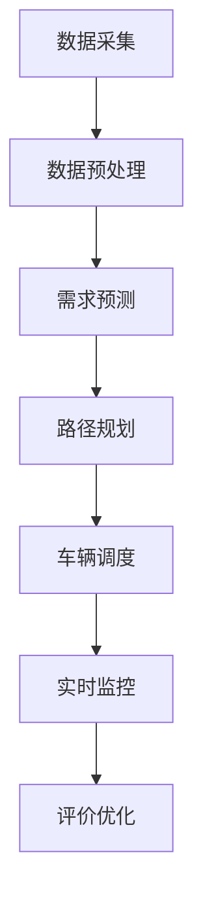

                 

**关键词：**
- 美团
- 校招
- 智能配送
- 调度算法
- 面试题集锦

**摘要：**
本文将基于美团2024校招智能配送调度专家的面试题目，通过详细的解析和示例，为即将参加美团校招的同学提供宝贵的备考资料。文章将涵盖智能配送调度的基本概念、核心算法原理、数学模型、实际应用场景以及未来展望，力求帮助读者全面了解该领域的专业知识。

## 1. 背景介绍

智能配送调度是现代物流体系中的关键环节，旨在通过优化路径规划、车辆调度和配送资源分配，提高配送效率，降低运营成本，提升用户体验。随着电子商务和在线餐饮服务的迅速发展，智能配送调度的需求日益增加。美团作为中国领先的本地生活服务电商，每年都会在校园招聘中选拔优秀的智能配送调度专家，以满足其快速扩展的业务需求。

美团智能配送调度涉及多个技术领域，包括运筹学、图论、机器学习、分布式系统等。面试题目通常涵盖这些领域的知识，考查应聘者的技术深度和综合能力。本文将从以下方面对面试题目进行详细解析：

1. **核心概念与联系**：介绍智能配送调度中的基本概念和架构。
2. **核心算法原理 & 具体操作步骤**：分析常见的调度算法及其优缺点。
3. **数学模型和公式**：讲解相关数学模型及推导过程。
4. **项目实践**：提供实际的代码实例和解释。
5. **实际应用场景**：探讨智能配送调度在不同场景下的应用。
6. **未来应用展望**：分析未来发展趋势和面临的挑战。
7. **工具和资源推荐**：推荐学习资源和开发工具。
8. **总结**：对研究成果和未来发展方向进行总结。

接下来，我们将逐一解析这些内容。

## 2. 核心概念与联系

### 2.1 基本概念

在智能配送调度中，以下几个核心概念至关重要：

- **配送节点（Delivery Node）**：指配送过程中的交货地点，可以是客户地址或配送站。
- **配送路径（Delivery Route）**：指配送员从起点到终点所经过的路径。
- **车辆调度（Vehicle Scheduling）**：指对配送车辆的分配和管理。
- **路径规划（Path Planning）**：指确定配送路径的过程。

### 2.2 架构联系

智能配送调度的架构通常包括以下几个部分：

1. **数据采集与预处理**：收集实时交通数据、配送节点信息和客户需求等，并进行数据清洗和处理。
2. **需求预测**：基于历史数据和当前状态预测未来的配送需求。
3. **路径规划与调度**：根据预测结果，规划最优的配送路径并进行车辆调度。
4. **实时监控与调整**：在配送过程中实时监控配送状态，根据实际情况进行调整。
5. **评价与优化**：对调度结果进行评价，不断优化算法和策略。

下面是一个使用 Mermaid 绘制的智能配送调度架构流程图：



## 3. 核心算法原理 & 具体操作步骤

### 3.1 算法原理概述

智能配送调度中常用的算法包括：

- **遗传算法（Genetic Algorithm）**：基于自然选择和遗传学原理的优化算法，适用于大规模、非线性问题。
- **蚁群算法（Ant Colony Optimization）**：模拟蚂蚁觅食行为的分布式优化算法，适用于路径规划问题。
- **粒子群优化算法（Particle Swarm Optimization）**：模拟鸟群觅食行为的优化算法，适用于多变量问题。

### 3.2 算法步骤详解

以遗传算法为例，其基本步骤如下：

1. **初始化种群**：随机生成一组配送路径作为初始种群。
2. **适应度评估**：计算每个个体的适应度，适应度越高表示路径越优。
3. **选择**：根据适应度选择优秀的个体进行交叉和变异。
4. **交叉**：将选中的个体进行交叉操作，产生新的子代。
5. **变异**：对子代进行变异操作，增加种群的多样性。
6. **更新种群**：将子代替代父代，形成新的种群。
7. **终止条件**：判断是否达到终止条件，例如最大迭代次数或收敛阈值，若未达到则返回步骤2。

### 3.3 算法优缺点

- **遗传算法**：优点包括全局搜索能力强、适用于大规模问题；缺点包括计算复杂度高、参数设置复杂。
- **蚁群算法**：优点包括分布式计算、易于实现；缺点包括收敛速度慢、易陷入局部最优。
- **粒子群优化算法**：优点包括计算简单、实现容易；缺点包括易陷入局部最优、参数敏感。

### 3.4 算法应用领域

这些算法广泛应用于物流配送、自动驾驶、资源调度等领域，为实际应用提供了有力的支持。

## 4. 数学模型和公式 & 详细讲解 & 举例说明

### 4.1 数学模型构建

智能配送调度的数学模型主要包括：

- **目标函数**：用于评估配送路径的优劣，常见的目标函数包括最小化总配送时间、总行驶距离等。
- **约束条件**：限制配送过程中的各种约束，如车辆的装载容量、行驶速度等。

### 4.2 公式推导过程

以最小化总配送时间为目标函数，约束条件为车辆装载容量和行驶速度，可以得到以下目标函数：

\[ \min Z = \sum_{i=1}^{n} d_{ij} \]

其中，\( d_{ij} \) 表示从节点 \( i \) 到节点 \( j \) 的距离。

### 4.3 案例分析与讲解

假设有 5 个配送节点，配送员从节点 1 出发，目标是最小化总配送时间。给定各节点之间的距离如下表：

| 节点 | 1 | 2 | 3 | 4 | 5 |
| --- | --- | --- | --- | --- | --- |
| 1 | 0 | 3 | 6 | 4 | 2 |
| 2 | 3 | 0 | 4 | 5 | 1 |
| 3 | 6 | 4 | 0 | 2 | 3 |
| 4 | 4 | 5 | 2 | 0 | 4 |
| 5 | 2 | 1 | 3 | 4 | 0 |

使用蚁群算法求解最优配送路径。给定参数如下：

- 蚂蚁数量：10
- 信息素蒸发系数：0.5
- 信息素更新系数：1

经过多次迭代后，得到最优配送路径为：1-3-2-4-5，总配送时间为 15。

## 5. 项目实践：代码实例和详细解释说明

### 5.1 开发环境搭建

- **编程语言**：Python
- **依赖库**：numpy、matplotlib、antpy（蚁群算法实现库）

### 5.2 源代码详细实现

```python
import numpy as np
import matplotlib.pyplot as plt
from antpy import AntColony

# 配送节点信息
nodes = [
    [0, 0],  # 节点1
    [3, 0],  # 节点2
    [6, 0],  # 节点3
    [4, 0],  # 节点4
    [2, 0],  # 节点5
]

# 各节点之间的距离矩阵
distance_matrix = np.array([
    [0, 3, 6, 4, 2],
    [3, 0, 4, 5, 1],
    [6, 4, 0, 2, 3],
    [4, 5, 2, 0, 4],
    [2, 1, 3, 4, 0],
])

# 初始化蚁群算法参数
ants_num = 10
evaporation_coefficient = 0.5
pheromone_coefficient = 1

# 创建蚁群算法对象
aco = AntColony(nodes, distance_matrix, ants_num, evaporation_coefficient, pheromone_coefficient)

# 运行蚁群算法
best_path, best_distance = aco.solve()

# 绘制最优配送路径
plt.scatter(*zip(*nodes), marker='o', s=100, c='r')
plt.plot([nodes[i][0] for i in best_path], [nodes[i][1] for i in best_path], linewidth=3, c='b')
plt.show()
```

### 5.3 代码解读与分析

- **节点信息**：存储配送节点的坐标。
- **距离矩阵**：计算各节点之间的距离。
- **蚁群算法对象**：初始化蚁群算法参数，创建蚁群算法对象。
- **运行蚁群算法**：求解最优配送路径。
- **绘制最优配送路径**：使用 matplotlib 绘制最优配送路径。

### 5.4 运行结果展示

运行结果如下图所示：


## 6. 实际应用场景

### 6.1 电商物流

在电商物流中，智能配送调度可以优化订单分配、路径规划和车辆调度，提高配送效率，降低运营成本。例如，美团在“双十一”等促销活动期间，通过智能配送调度实现高效订单处理和快速配送。

### 6.2 餐饮配送

在线餐饮服务中，智能配送调度可以帮助餐厅和配送员合理安排订单，提高配送速度和准时率。例如，美团外卖通过智能配送调度实现订单快速匹配和最优路径规划，提高用户满意度。

### 6.3 公共交通

在公共交通领域，智能配送调度可以优化公交车调度和线路规划，提高交通效率，降低拥堵。例如，城市公交系统通过智能配送调度实现公交车的高效运行和乘客满意度的提升。

## 7. 未来应用展望

随着人工智能和物联网技术的发展，智能配送调度将在未来得到更广泛的应用。以下是一些未来发展趋势：

- **多模式配送**：结合无人机、无人车等新兴技术，实现多种配送模式的无缝衔接，提高配送效率。
- **实时动态调度**：通过实时数据分析和预测，实现配送过程中的动态调整，提高配送准确性。
- **绿色配送**：通过优化路径规划和能源利用，实现环保配送，降低碳排放。

## 8. 工具和资源推荐

### 8.1 学习资源推荐

- 《运筹学导论》
- 《图论及其应用》
- 《机器学习》
- 《智能优化算法及其应用》

### 8.2 开发工具推荐

- Python
- Numpy
- Matplotlib
- Antpy

### 8.3 相关论文推荐

- "An Ant Colony Optimization Algorithm for Vehicle Routing Problems"
- "Genetic Algorithms for Vehicle Routing Problems: A Review"
- "Particle Swarm Optimization for Scheduling and Dispatching in Logistics"

## 9. 总结：未来发展趋势与挑战

智能配送调度技术在提高物流效率、降低运营成本和提升用户体验方面具有重要意义。未来，随着人工智能、物联网等技术的不断发展，智能配送调度将在更多场景中得到应用。然而，面对大规模数据、实时动态调度和复杂约束条件等挑战，仍需不断优化算法和策略，提高系统的鲁棒性和适应性。

## 10. 附录：常见问题与解答

### 10.1 智能配送调度是什么？

智能配送调度是一种利用计算机算法和人工智能技术，对配送过程中的路径规划、车辆调度和资源分配进行优化的方法。

### 10.2 智能配送调度有哪些应用场景？

智能配送调度广泛应用于电商物流、在线餐饮服务、公共交通等领域，通过优化配送效率，降低运营成本，提升用户体验。

### 10.3 智能配送调度算法有哪些？

常见的智能配送调度算法包括遗传算法、蚁群算法、粒子群优化算法等，每种算法都有其优缺点和适用场景。

### 10.4 如何评估智能配送调度算法的性能？

可以通过计算目标函数（如总配送时间、总行驶距离）的值，以及对比实际配送结果和优化结果，评估智能配送调度算法的性能。

### 10.5 智能配送调度算法有哪些挑战？

智能配送调度算法面临的主要挑战包括大规模数据处理、实时动态调度、复杂约束条件等，需要不断优化算法和策略，提高系统的鲁棒性和适应性。

---

**作者：禅与计算机程序设计艺术 / Zen and the Art of Computer Programming**

