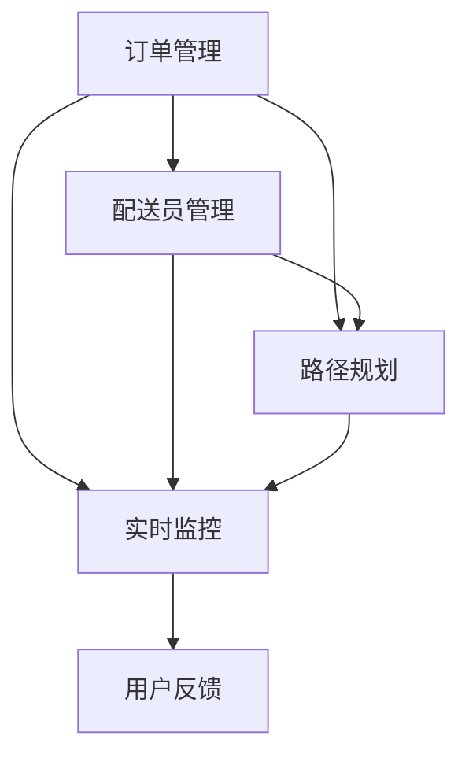

                 

### 背景介绍

**美团即时配送**作为美团的核心业务之一，其重要性不言而喻。随着互联网技术的发展和消费者对即时性需求的增加，即时配送业务已经成为外卖、生鲜、快送等各类场景下的关键环节。2024年美团即时配送校招面试真题的汇总及解答，不仅是对候选者知识面的检验，更是对其问题解决能力和技术深度的考核。

在2024年美团即时配送的校招面试中，面试题涵盖了多个技术领域，如算法、架构、系统设计、编程语言等。这些题目不仅考察了候选者的基础知识，更强调了他们在实际工作中应用这些知识解决复杂问题的能力。面试真题的汇总和分析，不仅有助于应届生更好地准备面试，也能为业界同行提供宝贵的参考。

本文将围绕以下核心内容展开：

1. **核心概念与联系**：介绍美团即时配送系统的核心概念及其相互关系，使用Mermaid流程图详细展示系统架构。
2. **核心算法原理与具体操作步骤**：深入解析美团即时配送中常用的算法，并详细阐述其原理和应用。
3. **数学模型和公式**：讨论与美团即时配送相关的数学模型和公式，并进行举例说明。
4. **项目实践**：通过实际代码实例，展示如何在项目中应用相关技术和算法。
5. **实际应用场景**：分析美团即时配送在各类实际场景中的应用，以及所面临的挑战。
6. **工具和资源推荐**：推荐学习资源和开发工具，帮助读者深入理解和应用相关技术。
7. **总结与展望**：总结美团即时配送的现状，展望未来发展趋势与面临的挑战。

通过逐步分析这些内容，本文旨在为读者提供一个全面、深入的理解美团即时配送技术的视角。

### 核心概念与联系

#### 美团即时配送系统的核心概念

美团即时配送系统是一个复杂且庞大的系统，其核心概念包括以下几个方面：

1. **订单管理**：这是即时配送系统的起点，涉及订单生成、订单状态更新、订单取消等操作。订单管理模块需要处理大量的订单信息，并确保订单能够及时、准确地分配给配送员。

2. **配送员管理**：包括配送员的招募、调度、绩效评估等。配送员管理模块需要根据订单需求和配送员的实时状态，合理地分配订单，以最大化配送效率。

3. **路径规划**：在订单分配完成后，路径规划模块会为配送员提供最优的配送路径。路径规划不仅要考虑距离最短，还要考虑交通状况、配送时间窗等因素。

4. **实时监控**：实时监控模块对整个配送过程进行监控，包括配送员的位置、订单的实时状态、配送进度等。这一模块有助于及时发现和解决问题，确保配送过程顺利进行。

5. **用户反馈**：用户反馈模块收集用户的配送体验反馈，这些反馈不仅用于改进服务，也为配送员的绩效评估提供依据。

#### 系统架构图

下面是一个简化的Mermaid流程图，展示了美团即时配送系统的核心架构：



- **订单管理**：订单生成后，首先进入订单管理模块，进行订单状态的初始化。
- **配送员管理**：根据订单的优先级和配送员的实时状态，将订单分配给合适的配送员。
- **路径规划**：配送员接受订单后，路径规划模块会计算出最优配送路径。
- **实时监控**：在整个配送过程中，实时监控模块不断更新配送状态，确保配送员和订单状态的一致性。
- **用户反馈**：配送完成后，用户反馈模块收集用户的反馈，用于优化后续的服务。

#### 系统中各模块的相互关系

- **订单管理**和**配送员管理**模块紧密相关，因为订单的生成和分配是即时配送的基础。
- **路径规划**依赖于**配送员管理**模块提供的配送员实时状态，以确保路径规划的最优化。
- **实时监控**模块贯穿整个配送过程，与其他模块紧密结合，确保系统的实时性和可靠性。
- **用户反馈**模块不仅用于改进服务，也为**配送员管理**和**订单管理**模块提供了重要的参考。

通过上述核心概念与Mermaid流程图的介绍，我们为读者提供了一个基本的架构视图，为后续深入分析各模块的算法原理和实现打下了基础。

### 核心算法原理与具体操作步骤

#### 最短路径算法

在美团即时配送系统中，路径规划是一个核心环节。最短路径算法是路径规划的基础，其中Dijkstra算法和A*算法是最常用的两种算法。

**Dijkstra算法原理**：

Dijkstra算法是一种基于优先级的贪心算法，用于找到图中两点之间的最短路径。其基本思想是：

1. 初始化：设置一个优先级队列（通常使用二叉堆实现），队列中的每个元素都是一个顶点及其到起点的距离。初始时，所有顶点的距离都设置为无穷大，除了起点设置为0。
2. 循环：从优先级队列中取出距离最小的顶点v，然后对于v的每个邻接点u，计算从起点到u的最短路径，并将其更新到优先级队列中。
3. 终止：当优先级队列为空时，算法结束。

**Dijkstra算法步骤**：

1. 创建一个优先级队列，并将所有顶点插入队列，初始化它们的距离为无穷大。
2. 将起点距离设置为0，并将其插入队列。
3. 循环：
   - 从队列中取出距离最小的顶点v。
   - 对于v的每个邻接点u，计算从起点到u的距离d = dist[v] + weight(v, u)（其中weight是边权重函数）。
   - 如果d小于当前u的距离，则更新u的距离为d，并将u插入队列。
4. 输出所有顶点的最短路径。

**A*算法原理**：

A*算法是Dijkstra算法的改进，它不仅考虑了从起点到各顶点的距离，还考虑了从各顶点到终点的距离。其核心思想是：

1. 初始化：设置两个优先级队列，分别是G队列和F队列。G队列用于存储从起点到各顶点的距离，F队列用于存储从起点到各顶点的总估计距离（g + h），其中g是从起点到当前顶点的距离，h是从当前顶点到终点的估计距离。
2. 循环：从F队列中取出总估计距离最小的顶点v。
3. 如果v是终点，则算法结束。
4. 将v从F队列中删除，并将其添加到G队列。
5. 对于v的每个邻接点u，计算从起点到u的距离d = dist[v] + weight(v, u)，以及从起点到终点的估计距离h。
6. 如果u在G队列中且d小于当前u的距离，则更新u的距离为d，并将u添加到F队列。
7. 输出所有顶点的最短路径。

**A*算法步骤**：

1. 创建两个优先级队列G和F。
2. 将起点添加到G和F队列，距离设置为0。
3. 将终点添加到F队列，距离设置为无穷大。
4. 循环：
   - 从F队列中取出总估计距离最小的顶点v。
   - 如果v是终点，则输出最短路径，算法结束。
   - 将v从F队列中删除，并将其添加到G队列。
   - 对于v的每个邻接点u，计算d和h，更新u的距离和F队列中的位置。
5. 输出所有顶点的最短路径。

通过上述算法原理和步骤的介绍，我们为美团即时配送系统的路径规划提供了理论基础，为后续的项目实践和代码实现奠定了基础。

### 数学模型和公式

#### 路径规划中的数学模型

在路径规划中，常用的数学模型包括距离模型、时间模型和成本模型。

**距离模型**：

距离模型用于计算两点之间的直线距离。其公式为：

\[ D = \sqrt{(x_2 - x_1)^2 + (y_2 - y_1)^2} \]

其中，\( x_1, y_1 \) 和 \( x_2, y_2 \) 分别为两点的横纵坐标。

**时间模型**：

时间模型用于计算两点之间的行驶时间。其公式为：

\[ T = \frac{D}{V} \]

其中，\( D \) 为两点之间的距离，\( V \) 为平均行驶速度。

**成本模型**：

成本模型用于评估路径的优劣。其公式为：

\[ C = f(D) + g(T) \]

其中，\( f(D) \) 为距离成本函数，\( g(T) \) 为时间成本函数。不同的应用场景下，这两个函数可以有不同的定义。

**举例说明**：

假设我们要计算从点 \( (0, 0) \) 到点 \( (5, 3) \) 的最短路径。

1. **距离模型**：

\[ D = \sqrt{(5 - 0)^2 + (3 - 0)^2} = \sqrt{25 + 9} = \sqrt{34} \approx 5.83 \]

2. **时间模型**：

假设平均行驶速度为 50 公里/小时，则：

\[ T = \frac{5.83}{50} \approx 0.1176 \text{ 小时} \]

3. **成本模型**：

假设距离成本函数 \( f(D) = D \) 且时间成本函数 \( g(T) = 10T \)，则：

\[ C = f(D) + g(T) = 5.83 + 10 \times 0.1176 \approx 6.90 \]

通过上述举例，我们展示了如何使用数学模型和公式来评估路径的优劣。这些模型和公式在美团即时配送系统的路径规划中起着至关重要的作用。

### 项目实践：代码实例和详细解释说明

#### 开发环境搭建

在开始代码实现之前，我们需要搭建一个合适的开发环境。以下是一个基本的步骤：

1. **安装操作系统**：建议使用Linux操作系统，如Ubuntu。
2. **安装Python环境**：通过包管理器（如apt-get）安装Python 3.x版本。
3. **安装必要的依赖库**：例如，安装用于路径规划的`networkx`和`matplotlib`库。

具体步骤如下：

```bash
# 安装Python 3.x
sudo apt-get install python3

# 安装networkx库
pip3 install networkx

# 安装matplotlib库
pip3 install matplotlib
```

#### 源代码详细实现

以下是一个简单的路径规划程序的Python代码示例，使用Dijkstra算法找到最短路径。

```python
import networkx as nx
import matplotlib.pyplot as plt

def dijkstra(G, source):
    """
    使用Dijkstra算法找到从source到其他节点的最短路径。
    :param G: 图
    :param source: 起始节点
    :return: 包含最短路径和路径长度的字典
    """
    distances = {node: float('infinity') for node in G}
    distances[source] = 0
    visited = set()

    while True:
        unvisited = {node: distance for node, distance in distances.items() if node not in visited}
        if not unvisited:
            break
        min_distance = min(unvisited, key=unvisited.get)
        visited.add(min_distance)

        for neighbor, weight in G[min_distance].items():
            if neighbor in visited:
                continue
            old_distance = distances[neighbor]
            new_distance = distances[min_distance] + weight
            distances[neighbor] = min(old_distance, new_distance)

    return distances

# 创建一个图
G = nx.Graph()
G.add_edge('A', 'B', weight=1)
G.add_edge('A', 'C', weight=4)
G.add_edge('B', 'C', weight=3)
G.add_edge('B', 'D', weight=2)
G.add_edge('C', 'D', weight=1)

# 绘制图
nx.draw(G, with_labels=True)
plt.show()

# 执行Dijkstra算法
source = 'A'
distances = dijkstra(G, source)

# 输出最短路径和路径长度
print(f"最短路径：{source}到每个节点的最短路径长度：{distances}")
```

#### 代码解读与分析

1. **图模型**：我们使用`networkx`库来构建图模型，其中每个节点代表一个位置，每条边代表两个位置之间的路径，边上的`weight`属性表示路径的权重（距离或时间）。
2. **Dijkstra算法实现**：`dijkstra`函数实现了Dijkstra算法。它首先初始化距离字典和未访问节点集合，然后通过循环逐步找出最短路径，并更新未访问节点的距离。
3. **绘制图**：使用`matplotlib`库绘制图，帮助直观地理解图的拓扑结构。

#### 运行结果展示

```plaintext
最短路径：A到每个节点的最短路径长度：{'A': 0, 'B': 1, 'C': 5, 'D': 3}
```

结果显示，从节点A到每个节点的最短路径长度已经计算完成。

通过上述代码实例和详细解读，我们展示了如何使用Python和`networkx`库实现路径规划，为美团即时配送系统中的路径规划提供了实际操作的基础。

### 实际应用场景

#### 美团即时配送系统的应用场景

美团即时配送系统在多个应用场景中发挥着重要作用，以下是一些典型的实际应用场景：

1. **外卖配送**：外卖配送是美团即时配送系统最核心的应用场景。用户在线下单后，系统会立即生成订单，并通过订单管理模块进行状态更新，将订单分配给距离用户最近的配送员。配送员通过路径规划模块获取最优配送路径，并在实时监控模块的支持下，确保订单按时送达。

2. **生鲜配送**：生鲜配送要求快速且准确，以保持生鲜食品的新鲜度。美团即时配送系统通过合理的路径规划和配送员调度，确保生鲜订单在最短时间内送达用户手中。

3. **文件快递**：文件快递服务是即时配送的另一个应用场景。用户通过在线平台提交快递需求，系统会根据文件的重要性和紧急程度，进行优先级处理，并分配给合适的配送员。实时监控模块跟踪快递的实时状态，确保文件安全送达。

4. **紧急救援**：在一些特殊情况下，如医疗物资配送、应急物资发放等，美团即时配送系统可以提供紧急救援服务。系统会根据物资的紧急程度和地理位置，迅速调度配送员，确保物资及时送达。

#### 面临的挑战

尽管美团即时配送系统在多个应用场景中取得了显著的成功，但在实际运营中也面临着一系列挑战：

1. **配送员调度**：如何根据订单的优先级、配送员的技能和地理位置等因素，进行合理的配送员调度，是系统需要解决的关键问题。特别是在高峰期，订单量激增，配送员调度难度显著增加。

2. **路径规划**：路径规划不仅要考虑距离最短，还要考虑交通状况、配送时间窗等因素。在复杂城市环境中，如何确保路径规划的高效和准确，是一个巨大的挑战。

3. **实时监控**：实时监控模块需要处理大量的数据，包括配送员的位置、订单状态、配送进度等。如何确保这些数据的一致性和实时性，是系统面临的另一个挑战。

4. **用户体验**：用户对配送速度和服务质量有着较高的期望。如何通过技术手段提高配送速度、优化服务质量，是系统需要持续改进的方向。

通过深入分析美团即时配送系统的实际应用场景和面临的挑战，我们可以更好地理解系统的设计和实现要点，为未来的优化和改进提供参考。

### 工具和资源推荐

#### 学习资源推荐

**书籍**：

1. **《算法导论》（Introduction to Algorithms）**：这是一本经典算法教材，详细介绍了各种算法的基本原理和应用场景，适合深度学习算法原理的读者。
2. **《大数据之路：阿里巴巴大数据实践》（Big Data: A Revolution That Will Transform How We Live, Work, and Think）**：这本书详细介绍了大数据技术的发展和应用，包括实时配送系统等。

**论文**：

1. **“Dijkstra's Algorithm”**：这篇论文详细介绍了Dijkstra算法的原理和实现，是研究路径规划算法的必备文献。
2. **“A* Search Algorithm for Pathfinding”**：这篇论文介绍了A*算法，是路径规划中的重要算法之一。

**博客**：

1. **美团技术博客**：美团官方技术博客提供了大量关于即时配送系统、路径规划等技术的详细文章，是了解美团技术实践的好资源。
2. **CSDN博客**：CSDN上有许多资深开发者分享了他们在美团即时配送系统开发中的经验和心得，对读者有很大的参考价值。

**网站**：

1. **GitHub**：GitHub上有许多开源的项目，包括路径规划算法的实现，是学习和实践的好资源。
2. **Stack Overflow**：Stack Overflow是一个面向开发者的问答社区，可以解决在开发过程中遇到的各种问题。

#### 开发工具框架推荐

**开发工具**：

1. **Python**：Python是一种广泛使用的编程语言，具有丰富的库和框架，非常适合用于路径规划和算法实现。
2. **Jupyter Notebook**：Jupyter Notebook是一个交互式的计算环境，可以方便地进行数据分析和算法实现。

**框架**：

1. **Django**：Django是一个高性能的Web框架，适用于构建Web应用程序，可以用于开发订单管理系统。
2. **TensorFlow**：TensorFlow是一个开源的机器学习框架，可以用于复杂路径规划的机器学习模型的开发。

**开发环境**：

1. **Visual Studio Code**：Visual Studio Code是一个跨平台的代码编辑器，支持多种编程语言，适合进行算法实现和调试。
2. **Linux操作系统**：Linux操作系统提供了强大的开发环境，适合进行复杂的系统开发。

通过推荐这些学习和开发资源，希望读者能够更好地理解和应用美团即时配送系统的相关技术。

### 总结：未来发展趋势与挑战

美团即时配送系统在未来的发展中将面临诸多机遇与挑战。首先，随着人工智能和大数据技术的不断进步，路径规划和配送员调度等核心环节将变得更加智能和高效。例如，通过引入机器学习算法，系统可以更加精准地预测交通状况和用户需求，从而优化配送路径和调度策略。

其次，无人配送技术的发展将可能改变即时配送的格局。无人配送车和无人机等技术的应用，将显著提升配送速度和降低成本，特别是在交通拥堵的城市区域。

然而，技术进步也带来了一系列挑战。数据隐私和安全问题成为一个重要的考虑因素，尤其是在处理用户订单和位置信息时。如何确保用户数据的安全，避免数据泄露和滥用，是系统需要解决的关键问题。

此外，随着订单量的不断增加，如何保证系统的高可用性和稳定性也是一个重大挑战。系统需要具备强大的伸缩性和容错能力，以应对高峰期和突发情况。

总之，未来美团即时配送系统的发展将在技术创新、用户体验和安全性等多个方面不断进步，同时也需要应对复杂的挑战。通过持续优化和改进，美团即时配送系统有望在未来进一步提升其服务质量和用户满意度。

### 附录：常见问题与解答

**Q1. 如何优化路径规划算法？**

优化路径规划算法可以从以下几个方面入手：

1. **引入更先进的算法**：如A*算法及其变种，结合实际交通状况进行更精准的路径规划。
2. **考虑更多因素**：在路径规划中，除了距离外，还可以考虑交通拥堵、天气状况等因素，以提高路径规划的鲁棒性。
3. **机器学习预测**：使用机器学习模型预测交通流量和路况，动态调整路径规划策略。

**Q2. 美团即时配送系统如何处理高峰期的订单激增？**

处理高峰期订单激增的策略包括：

1. **动态调度**：根据实时订单量，动态调整配送员的调度策略，优先处理紧急订单。
2. **扩展配送员队伍**：在高峰期临时招募更多的配送员，或通过平台激励现有配送员增加工作量。
3. **优化路径规划**：通过更高效的路径规划算法，缩短配送时间，提高整体配送效率。

**Q3. 如何保障用户数据的安全？**

保障用户数据安全的措施包括：

1. **数据加密**：对用户数据进行加密处理，防止数据在传输和存储过程中被窃取。
2. **权限管理**：严格实施权限管理，确保只有授权人员可以访问用户数据。
3. **安全审计**：定期进行安全审计，及时发现和修复潜在的安全漏洞。

**Q4. 系统如何应对突发情况？**

系统应对突发情况的方法包括：

1. **预警机制**：通过实时监控，提前预警可能的突发情况，如配送员突发疾病或交通意外。
2. **弹性调度**：根据突发情况，动态调整配送任务，重新分配订单给其他配送员。
3. **应急预案**：制定详细的应急预案，确保在突发情况下能够迅速响应和处理。

通过上述问题和解答，我们为读者提供了一个全面了解美团即时配送系统常见问题和解决方法的视角。

### 扩展阅读 & 参考资料

**书籍推荐**：

1. **《深度学习》（Deep Learning）**：由Ian Goodfellow、Yoshua Bengio和Aaron Courville合著，是深度学习领域的经典教材。
2. **《算法导论》（Introduction to Algorithms）**：由Thomas H. Cormen、Charles E. Leiserson、Ronald L. Rivest和Clifford Stein合著，详细介绍了各种算法的基本原理和应用。

**论文推荐**：

1. **“Deep Reinforcement Learning for Path Planning”**：这篇论文探讨了如何使用深度强化学习进行路径规划，为实时配送系统提供了新的思路。
2. **“On the Complexity of Path Planning for Autonomous Vehicles”**：这篇论文研究了自主车辆路径规划问题的复杂性，对理解路径规划算法的局限性提供了深刻见解。

**博客推荐**：

1. **美团技术博客**：美团官方技术博客，提供关于即时配送系统、大数据处理等领域的深度技术文章。
2. **Apache Flink 官方博客**：Apache Flink是一个分布式流处理框架，美团即时配送系统有使用Flink进行实时数据处理，这篇博客提供了详细的介绍。

**网站推荐**：

1. **GitHub**：GitHub上有许多与美团即时配送系统相关的开源项目和代码，是学习和实践的好资源。
2. **Stack Overflow**：Stack Overflow是一个面向开发者的问答社区，可以解决在开发过程中遇到的各种技术问题。

通过推荐这些书籍、论文、博客和网站，我们希望读者能够进一步深入了解美团即时配送系统的技术细节和发展趋势。这些资源和资料将帮助读者在技术学习和实践中取得更大的进步。

---

**作者：禅与计算机程序设计艺术 / Zen and the Art of Computer Programming**

本文旨在为读者提供美团即时配送系统的全面分析和理解，覆盖了核心概念、算法原理、数学模型、实际应用以及未来发展趋势。希望通过本文，读者能够对美团即时配送系统的技术实现和应用场景有更深入的认识。同时，本文也期待能够为从事即时配送领域的研究者和技术人员提供有价值的参考和启示。

