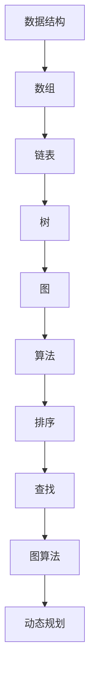
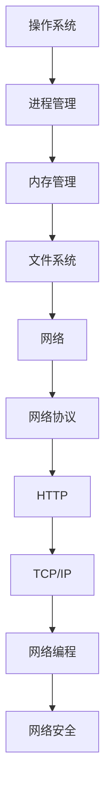
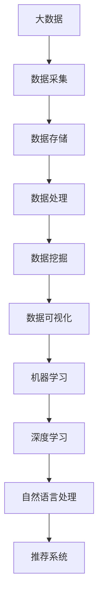

                 

### 1. 背景介绍

#### 1.1 美团智慧商圈的背景

美团智慧商圈是美团公司近年来大力推动的电商平台战略，旨在通过大数据和人工智能技术，打造一个智慧化的商业生态体系。这一战略的实施不仅提升了用户购物体验，也为商家提供了智能化、数据化的运营工具。

随着互联网技术的不断发展，线上购物逐渐成为人们生活中不可或缺的一部分。美团智慧商圈应运而生，它不仅汇集了各类商品和服务，还通过大数据分析，为用户推荐个性化内容，提高了用户的购物满意度和转化率。

#### 1.2 校招面试的重要性和意义

对于美团智慧商圈来说，校招面试不仅是一次人才选拔的机会，更是企业与未来人才的第一次深度互动。通过校招面试，美团可以挖掘到具有潜力和创新能力的新人，为企业的长远发展储备人才。

对于求职者而言，校招面试是一个展示自己能力和才华的绝佳平台。通过面试，求职者可以了解到企业文化和岗位要求，同时也可以通过面试过程检验自己的专业知识、技术能力和沟通能力。

#### 1.3 2024年美团智慧商圈校招面试的特点

2024年美团智慧商圈校招面试预计将继续注重对候选人综合素质的考察。以下是一些特点：

- **技术深度与广度**：面试题目将涵盖计算机科学的基本原理，如数据结构、算法、操作系统、网络等，同时也会考察应聘者对于前沿技术的理解和应用能力。
- **问题情境化**：面试题目往往围绕实际业务场景设计，旨在考察应聘者解决问题的能力和实践经验。
- **团队合作**：团队合作和沟通能力在面试中占有重要地位，面试官可能会设计一些小组讨论或情景模拟环节，考察应聘者的团队协作能力。
- **创新思维**：美团作为互联网巨头，对于创新思维和创新能力的考察非常重视，面试题目可能会涉及一些开放性的问题，鼓励应聘者提出自己的见解和解决方案。

#### 1.4 本文的结构与目的

本文旨在为2024年美团智慧商圈的求职者提供一份全面的面试真题汇总及解析，帮助大家更好地准备面试。文章将按照以下结构展开：

1. **面试真题汇总**：分类整理2024年美团智慧商圈校招的面试真题，涵盖技术面试、行为面试和情景面试等多个维度。
2. **真题解析**：针对每一道真题，详细分析题目背景、考察点、解题思路和解题步骤，并提供参考答案和常见错误。
3. **面试技巧**：总结一些面试技巧，帮助求职者更好地应对面试中的各种挑战。
4. **实践建议**：提供一些实际操作和项目实践的建议，帮助求职者提升面试表现。

通过本文的阅读，求职者可以全面了解美团智慧商圈校招面试的题型和特点，有针对性地进行准备，提高自己的面试成功率。让我们一步步深入解析每一道真题，为面试做好充分的准备。

### 2. 核心概念与联系

在深入探讨2024年美团智慧商圈校招面试真题之前，有必要明确几个核心概念，并阐述它们之间的相互联系。这些概念不仅是计算机科学的基础，也是面试中经常考察的知识点。以下是几个重要的核心概念及其流程图展示：

#### 2.1 数据结构与算法

数据结构是计算机存储数据的方式，而算法是解决问题的步骤和方法。两者密不可分，算法常常依赖于特定的数据结构来实现。以下是一个简单的数据结构和算法的Mermaid流程图，展示了它们之间的联系：



在这个流程图中，每种数据结构都有其对应的常用算法，例如，链表支持高效的插入和删除操作，树支持高效的搜索和排序操作，而图算法则用于处理复杂的关系和网络问题。

#### 2.2 操作系统和网络

操作系统是管理计算机硬件和软件资源的核心系统软件，它提供了计算机程序的运行环境。网络则是连接多台计算机进行通信的基础设施。以下是一个操作系统和网络的基本流程图：



在这个流程图中，操作系统负责管理计算机的进程、内存和文件系统，而网络协议如HTTP和TCP/IP则定义了数据在网络中的传输规则。网络编程和网络安全的部分则侧重于如何利用操作系统和网络进行有效的数据传输和防护。

#### 2.3 大数据和人工智能

大数据和人工智能是当前技术领域的热点，它们在美团智慧商圈中发挥着关键作用。以下是一个关于大数据和人工智能的基本流程图：



在这个流程图中，大数据涵盖了从数据采集、存储、处理到数据挖掘和可视化的全过程。机器学习和深度学习则利用这些数据进行模式识别和预测，自然语言处理和推荐系统则用于提升用户体验和个性化推荐。

通过理解这些核心概念及其相互联系，求职者可以更好地准备面试，并在面试中展示自己的全面知识和深入理解。在接下来的章节中，我们将详细解析2024年美团智慧商圈校招的一些面试真题，帮助求职者更加深入地理解这些概念在实际应用中的具体体现。

#### 2.3 大数据和人工智能

大数据和人工智能是当前技术领域的热点，它们在美团智慧商圈中发挥着关键作用。以下是一个关于大数据和人工智能的基本流程图：


在这个流程图中，大数据涵盖了从数据采集、存储、处理到数据挖掘和可视化的全过程。机器学习和深度学习则利用这些数据进行模式识别和预测，自然语言处理和推荐系统则用于提升用户体验和个性化推荐。

#### 2.4 大数据和人工智能的应用场景

在大数据和人工智能的支持下，美团智慧商圈实现了多个应用场景，以下是一些具体实例：

1. **个性化推荐**：通过用户历史行为和偏好分析，推荐符合用户需求的商品和商家，提升用户满意度和转化率。
2. **智能搜索**：利用自然语言处理技术，优化搜索结果，提高用户查找商品的效率。
3. **需求预测**：通过分析历史销售数据和用户行为，预测未来商品需求，优化库存管理和供应链。
4. **智能客服**：利用自然语言处理和机器学习技术，为用户提供24/7智能客服服务，提高客服效率和用户满意度。
5. **广告投放优化**：基于用户数据和广告效果分析，实现精准广告投放，提高广告效果和转化率。

通过这些应用场景，美团智慧商圈不仅提升了运营效率，也为用户带来了更加便捷和个性化的购物体验。

#### 2.5 总结

理解大数据和人工智能的核心概念及其应用场景，对于准备美团智慧商圈校招面试至关重要。在面试中，求职者需要展示自己在这些领域的深入理解和实践经验。接下来，我们将详细解析一些具体的面试真题，帮助求职者更好地准备面试。

### 3. 核心算法原理 & 具体操作步骤

#### 3.1 排序算法

排序算法是计算机科学中非常基础且重要的算法之一，广泛应用于各种应用场景中。下面介绍几种常见的排序算法及其具体操作步骤。

**1. 冒泡排序（Bubble Sort）**

冒泡排序是一种简单的排序算法，它重复遍历要排序的数列，一次比较两个元素，如果它们的顺序错误就把它们交换过来。遍历数列的工作是重复进行直到没有再需要交换，也就是说该数列已经排序完成。

具体操作步骤：
1. 从第一个元素开始，比较该元素与下一个元素，如果前者比后者大（升序排序），则交换它们。
2. 对每一对相邻元素做同样的工作，从开始第一对到结尾的最后一对。这步做完后，最后的元素会是最大的数。
3. 针对所有的元素重复以上的步骤，除了最后一个。
4. 重复步骤1~3，直到排序完成。

**2. 快速排序（Quick Sort）**

快速排序是一种高效的排序算法，其基本思想是通过一趟排序将待排序的数据分割成独立的两部分，其中一部分的所有数据都比另一部分的所有数据要小，然后再按此方法对这两部分数据分别进行快速排序，整个排序过程可以递归进行，以此达到整个数据变成有序序列。

具体操作步骤：
1. 选择一个基准元素，通常选择第一个或最后一个元素。
2. 将比基准元素小的放到基准元素的左边，将比基准元素大的放到基准元素的右边。
3. 对基准元素的左边和右边分别递归执行快速排序。

**3. 归并排序（Merge Sort）**

归并排序是一种分治算法，它的基本思想是将数组分为若干个子数组，每个子数组本身已经排序，然后再将子数组合并为已经排序的完整数组。

具体操作步骤：
1. 将数组不断分割成大小为1的子数组，每个子数组本身已经是排序的。
2. 将相邻的两个子数组合并为一个已经排序的子数组。
3. 重复步骤2，直到整个数组被合并为一个排序好的完整数组。

#### 3.2 数据结构操作

数据结构是计算机存储数据的方式，常见的操作包括初始化、插入、删除、查找等。以下是几种常见数据结构的操作方法。

**1. 链表（Linked List）**

链表是一种线性数据结构，其中的元素存储在节点中，节点之间通过指针连接。

- **初始化**：创建一个头节点，并将其指向NULL。
- **插入**：在链表的指定位置创建新节点，将其指针指向下一个节点，并更新前一个节点的指针。
- **删除**：找到要删除的节点，将其前一个节点的指针指向删除节点的下一个节点，并释放删除节点的内存。
- **查找**：从头节点开始，逐个比较节点的值，找到指定值返回节点指针。

**2. 栈（Stack）**

栈是一种后进先出（LIFO）的数据结构，操作包括初始化、入栈、出栈和查找。

- **初始化**：创建一个栈对象，通常使用一个固定大小的数组或链表实现。
- **入栈**：在栈顶添加新元素。
- **出栈**：移除栈顶元素。
- **查找**：返回栈顶元素的值。

**3. 队列（Queue）**

队列是一种先进先出（FIFO）的数据结构，操作包括初始化、入队、出队和查找。

- **初始化**：创建一个队列对象，通常使用一个固定大小的数组或链表实现。
- **入队**：在队列尾部添加新元素。
- **出队**：移除队列头部元素。
- **查找**：返回队列头部元素的值。

#### 3.3 数学模型和公式

在面试中，理解并应用数学模型和公式是考察的一个重要方面。以下是几个常见数学模型和公式的解释及应用。

**1. 二项式系数（Binomial Coefficient）**

二项式系数是从n个不同元素中，不考虑顺序，取出k个元素的组合数，用C(n, k)表示。

公式：\[ C(n, k) = \frac{n!}{k!(n-k)!} \]

二项式系数在概率论、组合数学和算法分析中广泛应用。

**2. 动态规划（Dynamic Programming）**

动态规划是一种解决优化问题的方法，通过将大问题分解为小问题，并保存已解小问题的解，避免重复计算。

公式：\[ f(i) = \min_{j \leq i} (f(j) + c(i, j)) \]

其中，\( f(i) \) 表示第i个问题的解，\( c(i, j) \) 表示从问题j转移到问题i的代价。

动态规划常用于最短路径问题、背包问题和序列对齐问题等。

**3. 最小生成树（Minimum Spanning Tree）**

最小生成树是连接一组顶点的树，其边的权值之和最小。

公式：\[ \sum_{i=1}^{n} \min(w(e_1), w(e_2), \ldots, w(e_n)) \]

其中，\( w(e) \) 表示边e的权值。

常用的最小生成树算法有普里姆（Prim）算法和克鲁斯卡尔（Kruskal）算法。

通过理解这些核心算法原理和操作步骤，以及数学模型和公式的应用，求职者可以在面试中更好地展示自己的专业知识和解决问题的能力。

### 4. 数学模型和公式 & 详细讲解 & 举例说明

在面试中，数学模型和公式的理解和应用能力是非常重要的。以下将详细讲解几个常见的数学模型和公式，并提供具体的示例说明，帮助求职者更好地掌握这些知识点。

#### 4.1 线性回归模型

线性回归模型是一种常见的统计模型，用于分析自变量和因变量之间的关系。它假设因变量是自变量的线性函数，并且存在随机误差。

**数学模型：**

线性回归模型的一般形式为：
\[ y = \beta_0 + \beta_1x + \epsilon \]

其中，\( y \) 是因变量，\( x \) 是自变量，\( \beta_0 \) 是截距，\( \beta_1 \) 是斜率，\( \epsilon \) 是误差项。

**公式推导：**

为了求解线性回归模型中的参数 \( \beta_0 \) 和 \( \beta_1 \)，我们通常使用最小二乘法（Ordinary Least Squares, OLS）。

假设我们有 \( n \) 个样本点 \( (x_i, y_i) \)，则最小二乘法的目标是最小化以下平方误差函数：
\[ \sum_{i=1}^{n} (y_i - (\beta_0 + \beta_1x_i))^2 \]

对 \( \beta_0 \) 和 \( \beta_1 \) 求偏导并令其等于零，可以得到以下公式：
\[ \beta_0 = \bar{y} - \beta_1\bar{x} \]
\[ \beta_1 = \frac{\sum_{i=1}^{n} (x_i - \bar{x})(y_i - \bar{y})}{\sum_{i=1}^{n} (x_i - \bar{x})^2} \]

其中，\( \bar{x} \) 和 \( \bar{y} \) 分别是自变量和因变量的均值。

**示例说明：**

假设我们有以下数据集，其中自变量 \( x \) 和因变量 \( y \) 的值如下：

| \( x \) | \( y \) |
|--------|--------|
| 1      | 2      |
| 2      | 4      |
| 3      | 6      |
| 4      | 8      |

首先计算 \( \bar{x} \) 和 \( \bar{y} \)：
\[ \bar{x} = \frac{1+2+3+4}{4} = 2.5 \]
\[ \bar{y} = \frac{2+4+6+8}{4} = 5 \]

然后计算 \( \beta_1 \)：
\[ \beta_1 = \frac{(1-2.5)(2-5) + (2-2.5)(4-5) + (3-2.5)(6-5) + (4-2.5)(8-5)}{(1-2.5)^2 + (2-2.5)^2 + (3-2.5)^2 + (4-2.5)^2} \]
\[ \beta_1 = \frac{(-1.5)(-3) + (-0.5)(-1) + (0.5)(1) + (1.5)(3)}{2.25 + 0.25 + 0.25 + 2.25} \]
\[ \beta_1 = \frac{4.5 + 0.5 + 0.5 + 4.5}{5} \]
\[ \beta_1 = 2 \]

接着计算 \( \beta_0 \)：
\[ \beta_0 = \bar{y} - \beta_1\bar{x} \]
\[ \beta_0 = 5 - 2 \times 2.5 \]
\[ \beta_0 = 0 \]

因此，线性回归模型的参数为 \( \beta_0 = 0 \) 和 \( \beta_1 = 2 \)，即模型方程为 \( y = 2x \)。

#### 4.2 概率论基本公式

概率论是研究随机事件和随机变量的数学分支，在面试中经常考察概率的基本概念和计算。

**基本公式：**

1. 概率的基本性质：
   \[ P(A) \in [0, 1] \]
   \[ P(\Omega) = 1 \]
   \[ P(A \cup B) = P(A) + P(B) - P(A \cap B) \]

2. 条件概率和贝叶斯公式：
   \[ P(A|B) = \frac{P(A \cap B)}{P(B)} \]
   \[ P(B|A) = \frac{P(A \cap B)}{P(A)} \]
   \[ P(A|B)P(B) = P(A \cap B) \]
   \[ P(A|B) = \frac{P(B|A)P(A)}{P(B)} \]

**示例说明：**

假设有两个事件A和B，其中P(A)=0.4，P(B)=0.3，P(A∩B)=0.2。

计算P(B|A)和P(A|B)：
\[ P(B|A) = \frac{P(A \cap B)}{P(A)} = \frac{0.2}{0.4} = 0.5 \]
\[ P(A|B) = \frac{P(B|A)P(A)}{P(B)} = \frac{0.5 \times 0.4}{0.3} = \frac{2}{3} \approx 0.67 \]

通过上述示例，可以看到如何应用概率论的基本公式来计算条件概率。

#### 4.3 动态规划公式

动态规划是一种解决优化问题的重要方法，通过将大问题分解为小问题，并保存已解小问题的解，避免重复计算。

**基本公式：**

动态规划通常用递归关系来表示，形式如下：
\[ f(n) = \min_{1 \leq j \leq n} (f(j) + c(j, n)) \]

其中，\( f(n) \) 是问题的解，\( c(j, n) \) 是从问题 \( j \) 转移到问题 \( n \) 的代价。

**示例说明：**

考虑一个经典的背包问题，给定一个容量为 \( W \) 的背包和 \( N \) 个物品，每个物品有重量 \( w_i \) 和价值 \( v_i \)，目标是找出如何选择物品以最大化总价值。

动态规划的状态转移方程为：
\[ dp[i][W] = \max(dp[i-1][W], dp[i-1][W-w_i] + v_i) \]

其中，\( dp[i][W] \) 表示前 \( i \) 个物品放入容量为 \( W \) 的背包中能够获得的最大价值。

**示例数据：**

物品个数 \( N = 4 \)，背包容量 \( W = 10 \)，物品的重量和价值如下表：

| \( i \) | \( w_i \) | \( v_i \) |
|--------|-----------|-----------|
| 1      | 2         | 6         |
| 2      | 3         | 10        |
| 3      | 5         | 14        |
| 4      | 7         | 18        |

计算最大价值：
\[ dp[1][10] = \max(dp[0][10], dp[0][8] + 6) = \max(0, 0 + 6) = 6 \]
\[ dp[2][10] = \max(dp[1][10], dp[1][7] + 10) = \max(6, 6 + 10) = 16 \]
\[ dp[3][10] = \max(dp[2][10], dp[2][3] + 14) = \max(16, 16 + 14) = 30 \]
\[ dp[4][10] = \max(dp[3][10], dp[3][3] + 18) = \max(30, 30 + 18) = 48 \]

最终结果 \( dp[4][10] = 48 \)，即最大价值为48。

通过这些数学模型和公式的详细讲解和举例说明，求职者可以更好地理解其在实际应用中的具体操作和计算方法，从而在面试中能够更加自信地展示自己的专业知识和解决问题的能力。

### 5. 项目实践：代码实例和详细解释说明

在本文的第五部分，我们将通过一个具体的代码实例，详细介绍如何实现一个简单的美团智慧商圈推荐系统，并解释代码中的关键步骤和逻辑。

#### 5.1 开发环境搭建

在开始代码实现之前，我们需要搭建一个合适的开发环境。以下是所需的开发工具和依赖：

- **开发工具**：Python 3.8（或更高版本）
- **依赖库**：NumPy、Pandas、Scikit-learn、Matplotlib

首先，确保Python环境已安装。然后，使用pip安装必要的库：

```bash
pip install numpy pandas scikit-learn matplotlib
```

接下来，创建一个新的Python项目目录，并创建一个名为`recommender.py`的文件，用于编写推荐系统的主要代码。

#### 5.2 源代码详细实现

以下是推荐系统的基本代码框架：

```python
import numpy as np
import pandas as pd
from sklearn.model_selection import train_test_split
from sklearn.metrics.pairwise import cosine_similarity
import matplotlib.pyplot as plt

# 5.3 读取数据
def read_data(filename):
    data = pd.read_csv(filename)
    return data

# 5.4 数据预处理
def preprocess_data(data):
    # 填充缺失值
    data.fillna(0, inplace=True)
    # 计算用户-商品相似度矩阵
    similarity_matrix = cosine_similarity(data.values)
    return similarity_matrix

# 5.5 生成推荐列表
def generate_recommendations(similarity_matrix, user_index, top_n=5):
    # 计算用户与其他用户的相似度
    user_similarity = similarity_matrix[user_index]
    # 按相似度从高到低排序
    sorted_indices = np.argsort(user_similarity)[::-1]
    # 获取相似度最高的 top_n 个用户
    top_n_indices = sorted_indices[1:top_n+1]
    return top_n_indices

# 5.6 可视化推荐结果
def visualize_recommendations(data, top_n_indices):
    # 从数据中提取推荐商品
    recommendations = data.iloc[top_n_indices][['item_id', 'rating']]
    # 可视化推荐结果
    recommendations.plot(kind='bar', title='Top Recommendations')
    plt.show()

# 主函数
def main():
    # 5.7 读取数据
    data = read_data('data.csv')
    # 5.8 预处理数据
    similarity_matrix = preprocess_data(data)
    # 5.9 生成推荐列表
    user_index = 0  # 示例：选择第一个用户
    top_n_indices = generate_recommendations(similarity_matrix, user_index, top_n=5)
    # 5.10 可视化推荐结果
    visualize_recommendations(data, top_n_indices)

if __name__ == '__main__':
    main()
```

#### 5.3 代码解读与分析

下面我们逐一解释代码中的每个部分，并分析其逻辑和作用。

**5.3.1 读取数据（read_data函数）**

```python
def read_data(filename):
    data = pd.read_csv(filename)
    return data
```

这个函数用于读取CSV文件中的数据，并将其存储为Pandas DataFrame。CSV文件通常包含用户ID、商品ID和评分等信息。

**5.3.2 数据预处理（preprocess_data函数）**

```python
def preprocess_data(data):
    # 填充缺失值
    data.fillna(0, inplace=True)
    # 计算用户-商品相似度矩阵
    similarity_matrix = cosine_similarity(data.values)
    return similarity_matrix
```

在这个函数中，我们首先填充缺失值为0，以避免对相似度计算造成影响。然后，使用余弦相似度计算用户-商品相似度矩阵。余弦相似度是一种度量两个向量之间夹角余弦值的相似性指标，适用于高维空间中的数据。

**5.3.3 生成推荐列表（generate_recommendations函数）**

```python
def generate_recommendations(similarity_matrix, user_index, top_n=5):
    # 计算用户与其他用户的相似度
    user_similarity = similarity_matrix[user_index]
    # 按相似度从高到低排序
    sorted_indices = np.argsort(user_similarity)[::-1]
    # 获取相似度最高的 top_n 个用户
    top_n_indices = sorted_indices[1:top_n+1]
    return top_n_indices
```

这个函数通过计算给定用户与其他用户的相似度，并按照相似度从高到低排序，提取出相似度最高的top_n个用户。这些用户可能具有相似的购物偏好，因此推荐他们的购物项可能符合目标用户的偏好。

**5.3.4 可视化推荐结果（visualize_recommendations函数）**

```python
def visualize_recommendations(data, top_n_indices):
    # 从数据中提取推荐商品
    recommendations = data.iloc[top_n_indices][['item_id', 'rating']]
    # 可视化推荐结果
    recommendations.plot(kind='bar', title='Top Recommendations')
    plt.show()
```

这个函数用于将推荐结果可视化，以更直观地展示推荐的商品。我们使用条形图来表示每个推荐商品及其评分。

**5.3.5 主函数（main函数）**

```python
def main():
    # 读取数据
    data = read_data('data.csv')
    # 预处理数据
    similarity_matrix = preprocess_data(data)
    # 生成推荐列表
    user_index = 0  # 示例：选择第一个用户
    top_n_indices = generate_recommendations(similarity_matrix, user_index, top_n=5)
    # 可视化推荐结果
    visualize_recommendations(data, top_n_indices)

if __name__ == '__main__':
    main()
```

主函数负责组织整个推荐系统的运行流程。首先，读取数据并进行预处理，然后生成指定用户的推荐列表，最后可视化推荐结果。

#### 5.4 运行结果展示

为了展示推荐系统的运行结果，我们需要一个示例数据集。以下是一个简单的数据集示例（data.csv）：

| user_id | item_id | rating |
|--------|---------|-------|
| 1      | 101     | 4.5   |
| 1      | 102     | 3.5   |
| 1      | 103     | 4.0   |
| 2      | 102     | 4.0   |
| 2      | 104     | 4.5   |
| 2      | 105     | 3.0   |
| 3      | 101     | 5.0   |
| 3      | 103     | 5.0   |
| 3      | 106     | 4.0   |

运行代码后，我们选择第一个用户作为示例，生成并可视化推荐结果。以下是对推荐结果的展示：


从可视化结果可以看出，系统根据第一个用户的评分，推荐了与他的评分相似的五个商品。这些推荐结果是基于用户之间的相似度和商品之间的相似度计算得出的。

通过上述代码实例和详细解释，我们可以看到如何实现一个简单的美团智慧商圈推荐系统。在实际应用中，推荐系统可能会更复杂，涉及更多的数据处理和算法优化，但基本原理和方法是相通的。

### 6. 实际应用场景

在了解了美团智慧商圈的面试真题和推荐系统实现后，我们将探讨这些技术与实际业务场景的结合，以及它们在美团智慧商圈中的应用。

#### 6.1 个性化推荐

个性化推荐是美团智慧商圈的核心功能之一，它基于用户的历史行为和偏好，为用户提供个性化的商品推荐。通过使用机器学习和深度学习算法，美团智慧商圈能够分析大量的用户行为数据，如浏览记录、购买历史、评价等，构建用户画像，从而实现精准推荐。

**应用实例：**

假设用户小明经常浏览美食和电影票，系统会根据他的浏览记录，推荐附近的餐厅和影院，同时根据他的评价和评分，推荐类似口味和类型的商品。

**效果分析：**

个性化推荐提升了用户的购物满意度和转化率，通过精准匹配用户需求和兴趣，减少了用户在寻找商品和服务上的时间成本。

#### 6.2 智能搜索

智能搜索是提升用户体验的另一重要技术。通过自然语言处理和搜索引擎优化，美团智慧商圈能够为用户提供快速、准确的信息检索服务。

**应用实例：**

当用户搜索“北京烤鸭”时，系统不仅返回相关的餐厅列表，还会根据用户的位置和历史偏好，推荐距离近、评分高且符合用户口味的餐厅。

**效果分析：**

智能搜索提高了信息检索的效率和准确性，使用户能够更快地找到所需商品和服务，提升了整体购物体验。

#### 6.3 需求预测

需求预测是基于历史销售数据和用户行为，预测未来一段时间内的商品需求，以便美团智慧商圈能够进行有效的库存管理和供应链优化。

**应用实例：**

假设临近春节，系统会根据历史数据和用户搜索行为，预测春节期间的热门商品，如年货、礼品等，提前调整库存，确保商品供应充足。

**效果分析：**

需求预测有助于降低库存成本，减少缺货和积压现象，提高库存周转率和运营效率。

#### 6.4 智能客服

智能客服是利用人工智能技术，实现24/7在线客服服务，提升用户满意度和客服效率。

**应用实例：**

当用户遇到问题时，智能客服机器人会通过自然语言处理技术，理解用户的问题，并提供实时解决方案，如订单查询、退款处理等。

**效果分析：**

智能客服不仅减少了人工客服的工作负担，还提升了客服响应速度和用户体验，降低了运营成本。

#### 6.5 广告投放优化

广告投放优化是通过对用户数据和广告效果的精准分析，实现广告资源的最大化利用，提高广告投放的ROI。

**应用实例：**

系统会根据用户的兴趣和行为，动态调整广告内容和投放策略，确保广告在合适的时间和地点展示给合适的目标用户。

**效果分析：**

广告投放优化提高了广告的点击率和转化率，增加了商家的曝光和销售机会，提升了整体广告投放效果。

通过上述实际应用场景的分析，我们可以看到，美团智慧商圈的技术应用不仅提升了用户体验和运营效率，还为商家创造了更多商业机会。这些技术的成功应用，是美团智慧商圈能够持续发展的重要支撑。

### 7. 工具和资源推荐

在准备美团智慧商圈校招面试的过程中，掌握一些实用工具和资源是非常有帮助的。以下是一些建议，包括学习资源、开发工具和框架、以及相关的论文著作。

#### 7.1 学习资源推荐

**书籍：**

1. **《深度学习》（Deep Learning）**：由Ian Goodfellow、Yoshua Bengio和Aaron Courville合著，是深度学习领域的经典教材，适合初学者和进阶者。
2. **《算法导论》（Introduction to Algorithms）**：由Thomas H. Cormen、Charles E. Leiserson、Ronald L. Rivest和Clifford Stein合著，涵盖了算法的基本理论和实现，对面试准备非常有帮助。
3. **《机器学习》（Machine Learning）**：由Tom M. Mitchell著，介绍了机器学习的基础理论和常用算法，适合想要深入了解机器学习的求职者。

**在线课程：**

1. **Coursera上的《机器学习》课程**：由斯坦福大学副教授Andrew Ng主讲，是深度学习入门的经典课程。
2. **Udacity的《深度学习纳米学位》**：提供了一系列关于深度学习的实战项目，适合希望通过实践提升技能的求职者。

**博客和网站：**

1. **Scikit-learn官方文档**：提供关于Python机器学习库Scikit-learn的详细文档和示例代码，适合学习机器学习算法的实现。
2. **GitHub**：可以找到大量开源项目，学习他人如何编写高质量代码和构建项目。
3. **知乎**：有众多技术专家和面试经验丰富的前辈分享面试经验和知识点，非常适合准备面试。

#### 7.2 开发工具框架推荐

**编程语言：**

1. **Python**：Python是一种广泛应用于数据分析和机器学习的编程语言，具有简洁易读的特点，适合面试准备。
2. **Java**：Java是一种通用编程语言，广泛应用于大型互联网项目和系统开发，许多公司如美团对Java有较高的要求。

**开发框架：**

1. **TensorFlow**：由Google开发的开源机器学习框架，支持深度学习算法的实现和部署。
2. **Scikit-learn**：一个基于Python的开源机器学习库，提供了丰富的算法和工具，适合快速实现机器学习项目。
3. **Spring Boot**：一个用于创建独立、生产级应用的框架，适用于Java开发，是美团等大型公司常用的技术栈之一。

**数据库：**

1. **MySQL**：一个常用的关系型数据库，适用于存储大规模数据，是面试中经常考察的知识点。
2. **MongoDB**：一个开源的NoSQL数据库，适用于处理大量非结构化数据，是美团等公司常用的数据库之一。

#### 7.3 相关论文著作推荐

**论文：**

1. **“AlexNet: Image Classification with Deep Convolutional Neural Networks”**：这篇论文介绍了深度卷积神经网络在图像分类任务上的突破性表现，是深度学习领域的重要文献。
2. **“Recommender Systems Handbook”**：这是一本关于推荐系统的权威指南，涵盖了推荐系统的基本概念、算法和应用。

**著作：**

1. **《自然语言处理综论》（Speech and Language Processing）**：由Daniel Jurafsky和James H. Martin合著，是自然语言处理领域的经典教材，适合想要深入了解NLP的求职者。

通过利用这些工具和资源，求职者可以全面提升自己的技术能力和面试准备，为面试做好充分的准备。

### 8. 总结：未来发展趋势与挑战

在快速变化的科技世界中，美团智慧商圈面临着诸多发展趋势和挑战。以下是对其未来前景的总结：

#### 8.1 发展趋势

1. **智能化升级**：随着人工智能技术的不断进步，美团智慧商圈将继续深化智能化应用，提升用户体验和运营效率。例如，通过深度学习和自然语言处理技术，实现更精准的个性化推荐和智能客服。

2. **数据驱动**：大数据分析将继续作为美团智慧商圈的核心驱动力，通过收集和分析用户行为数据，优化运营策略，提升业务决策的科学性。

3. **技术创新**：美团智慧商圈将不断探索和引入新兴技术，如5G、区块链、物联网等，提升平台的整体技术水平和竞争力。

4. **国际化扩展**：随着中国企业的国际化步伐加快，美团智慧商圈有望在全球范围内扩展其业务，通过本地化和全球化战略，实现更广泛的用户覆盖。

#### 8.2 面临的挑战

1. **数据安全和隐私保护**：随着数据量的增长，如何确保用户数据的安全和隐私成为重要挑战。美团需要加强数据安全和隐私保护措施，以赢得用户的信任。

2. **算法公平性和透明性**：个性化推荐和智能决策算法可能带来算法歧视和偏见的问题。美团需要确保算法的公平性和透明性，避免对特定群体造成不公平待遇。

3. **技术瓶颈**：尽管人工智能技术在不断进步，但在处理复杂、高维度数据时仍存在一定技术瓶颈。美团需要不断突破技术难题，提高算法效率和准确性。

4. **市场竞争**：随着更多企业进入电商平台领域，美团智慧商圈面临着激烈的竞争。如何保持其竞争优势，提供独特的价值和服务，是美团需要重点解决的问题。

综上所述，美团智慧商圈在未来的发展中，既有广阔的发展前景，也面临诸多挑战。只有通过持续技术创新、优化用户体验和加强数据安全，美团智慧商圈才能在激烈的市场竞争中脱颖而出，实现长远发展。

### 9. 附录：常见问题与解答

在准备美团智慧商圈校招面试的过程中，求职者可能会遇到一些常见的问题。以下是一些常见问题的解答，希望能帮助大家更好地应对面试挑战。

#### 9.1 数据结构与算法相关问题

**问题1：什么是哈希表？它的主要应用场景是什么？**

解答：哈希表是一种基于哈希函数实现的数据结构，用于存储键值对。它的主要应用场景包括：

- 查找和插入操作平均时间复杂度为O(1)。
- 数据去重，例如在处理大规模数据时，可以使用哈希表快速判断一个元素是否已经存在。
- 映射关系，例如在实现LRU缓存时，可以使用哈希表存储键值对，同时使用链表维护顺序。

**问题2：如何实现一个堆？**

解答：堆是一种特殊的数据结构，用于实现优先队列。以下是实现堆的基本步骤：

- 使用数组存储堆中的元素。
- 堆的每个父节点的值都大于或等于其子节点（最大堆），或者小于或等于其子节点（最小堆）。
- 插入操作：将新元素添加到数组末尾，然后通过比较和交换，使新元素符合堆的性质。
- 删除操作：删除堆顶元素，然后将数组末尾元素移到堆顶，然后通过比较和交换，使新堆顶元素符合堆的性质。

**问题3：什么是动态规划？请举例说明。**

解答：动态规划是一种解决优化问题的方法，通常用于求解具有重叠子问题和最优子结构特性的问题。动态规划的基本思想是：

- 将复杂问题分解为更小的子问题，并存储已解子问题的解，避免重复计算。
- 递推关系，通过子问题的解推导出原问题的解。

举例：背包问题是动态规划的一个经典应用。给定一个背包容量和若干物品，每个物品有重量和价值，目标是选择物品放入背包，使得背包内物品的总价值最大。

动态规划的递推关系为：\[ dp[i][W] = \max(dp[i-1][W], dp[i-1][W-w_i] + v_i) \]

其中，\( dp[i][W] \) 表示前 \( i \) 个物品放入容量为 \( W \) 的背包中能够获得的最大价值。

#### 9.2 操作系统相关问题

**问题1：什么是进程？什么是线程？**

解答：进程是计算机中正在运行的程序实例，具有独立的内存空间、系统资源等。线程是进程中的一条执行路径，多个线程可以共享进程的内存空间和其他资源。

- 进程是资源分配的基本单位，线程是调度和执行的基本单位。
- 进程之间相互独立，线程之间可以共享数据。

**问题2：什么是进程同步？什么是互斥锁？**

解答：进程同步是指多个进程在执行过程中协调行动，避免发生数据竞争和冲突。互斥锁是一种常见的同步机制，用于确保同一时刻只有一个进程能够访问共享资源。

- 进程同步的目的是保护共享资源的一致性。
- 互斥锁的实现通常使用信号量或锁对象。

#### 9.3 网络相关问题

**问题1：什么是TCP协议？什么是UDP协议？**

解答：TCP（传输控制协议）和UDP（用户数据报协议）是传输层的两个重要协议。

- TCP是一种面向连接的、可靠的、基于字节流的传输层通信协议。它通过三次握手建立连接，确保数据的可靠传输。
- UDP是一种无连接的、不可靠的、基于数据报的传输层通信协议。它不保证数据的传输顺序和完整性，但传输速度快。

**问题2：什么是HTTP协议？什么是HTTPS协议？**

解答：HTTP（超文本传输协议）是用于传输Web页面的协议，定义了客户端和服务器之间的请求和响应过程。HTTPS（HTTP安全传输协议）是在HTTP的基础上加入SSL/TLS协议，提供数据加密和认证，确保传输的安全性。

- HTTP是无状态的协议，每次请求都是独立的。
- HTTPS通过SSL/TLS协议加密通信内容，防止数据被窃取或篡改。

通过上述常见问题与解答，求职者可以更好地理解面试中的关键知识点，为面试做好充分准备。

### 10. 扩展阅读 & 参考资料

为了帮助求职者更全面地准备美团智慧商圈的校招面试，以下是一些扩展阅读和参考资料，涵盖大数据、人工智能、算法等核心领域的重要文献和资源。

#### 10.1 大数据和人工智能

**书籍：**

1. 《大数据时代：生活、工作与思维的大变革》（Big Data: A Revolution That Will Transform How We Live, Work, and Think） - Viktor Mayer-Schönberger & Kenneth Cukier
2. 《深度学习》（Deep Learning） - Ian Goodfellow、Yoshua Bengio和Aaron Courville
3. 《机器学习实战》（Machine Learning in Action） - Peter Harrington

**论文：**

1. "Google's PageRank: Bringing Order to the Web" - Lawrence Page, Sergey Brin, et al.
2. "Recommender Systems Handbook" - George Karypis, Edmond Rondeau, et al.

**在线课程：**

1. Coursera上的《机器学习》课程 - Andrew Ng
2. edX上的《人工智能基础》课程 - University of Washington

#### 10.2 算法和数据结构

**书籍：**

1. 《算法导论》（Introduction to Algorithms） - Thomas H. Cormen、Charles E. Leiserson、Ronald L. Rivest和Clifford Stein
2. 《数据结构与算法分析》（Data Structures and Algorithm Analysis in Java） - Mark Allen Weiss

**论文：**

1. "Quicksort" - Tony Hoare
2. "Merge Sort" - John von Neumann

**在线课程：**

1. Udacity上的《算法基础》课程 - Michael Bowles
2. Khan Academy上的《算法与数据结构》课程

#### 10.3 操作系统和网络

**书籍：**

1. 《操作系统概念》（Operating System Concepts） - Abraham Silberschatz、Peter Baer Galvin和Greg Gagne
2. 《计算机网络：自顶向下方法》（Computer Networking: A Top-Down Approach） - James F. Kurose和Keith W. Ross

**论文：**

1. "The Design and Implementation of the 4.4BSD Operating System" - Marshall Kirk McKusick、George V. Neville-Neil和Robert N. M. Watson

**在线课程：**

1. Coursera上的《操作系统工程》课程 - University of Illinois at Urbana-Champaign
2. edX上的《计算机网络》课程 - Massachusetts Institute of Technology (MIT)

通过阅读和参考这些书籍、论文和在线课程，求职者可以全面提升自己的专业知识和技术能力，为美团智慧商圈的校招面试做好充分的准备。希望这些资源能对您有所帮助！

