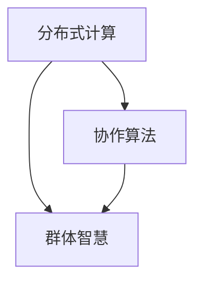

                 

### 群体智慧：人类计算的无限潜力

#### 关键词：
- 群体智慧
- 分布式计算
- 人类计算潜力
- 聊天机器人
- 大规模数据分析
- 智能优化算法

#### 摘要：
本文将探讨群体智慧的概念及其在计算机领域的应用。通过分析群体智慧的核心原理、技术实现方法、数学模型和实际应用场景，我们将揭示人类计算潜力的无限可能性。

## 1. 背景介绍

### 1.1 群体智慧的起源

群体智慧（Swarm Intelligence）的概念源于自然界中的生物群体行为，如蚂蚁的觅食、蜜蜂的采蜜和鸟类的迁徙。这些生物个体通过简单的局部规则相互作用，却能够形成高效的集体行为和智能决策。

### 1.2 人类计算潜力的激发

在计算机领域，群体智慧的研究旨在发掘人类计算潜力的无限可能。通过分布式计算和协作算法，群体智慧能够解决复杂问题、提高效率、降低成本，并在各种实际应用中展现其优势。

## 2. 核心概念与联系

### 2.1 分布式计算

分布式计算是一种将计算任务分布在多个计算机节点上执行的技术。通过协作，这些节点共同完成计算任务，从而提高计算速度和效率。

### 2.2 协作算法

协作算法是群体智慧的核心，通过个体之间的信息交流和协作，实现共同的目标。常见的协作算法包括贝叶斯网络、遗传算法、协同过滤等。

### 2.3 Mermaid 流程图

以下是群体智慧核心概念和联系的 Mermaid 流程图：



## 3. 核心算法原理 & 具体操作步骤

### 3.1 聊天机器人

聊天机器人是群体智慧在自然语言处理领域的典型应用。通过分布式计算和协作算法，聊天机器人能够实现智能对话和情感交互。

### 3.2 大规模数据分析

大规模数据分析利用群体智慧进行分布式计算，提高数据分析的效率和准确性。具体操作步骤如下：

1. 数据预处理：清洗、整合和转换原始数据。
2. 数据分布式计算：将计算任务分配到多个节点上执行。
3. 协作算法：通过个体节点的交互，实现共同的数据分析目标。

### 3.3 智能优化算法

智能优化算法是群体智慧在优化问题求解中的应用。通过模拟生物进化、社会行为等机制，智能优化算法能够找到最优解或近似最优解。

## 4. 数学模型和公式 & 详细讲解 & 举例说明

### 4.1 数学模型

群体智慧的核心数学模型包括：

1. 贝叶斯网络：描述变量之间的概率关系。
2. 遗传算法：模拟生物进化过程，优化变量组合。
3. 协同过滤：通过用户行为数据，预测未知数据。

### 4.2 公式讲解

以下是贝叶斯网络的核心公式：

$$ P(A|B) = \frac{P(B|A) \cdot P(A)}{P(B)} $$

其中，$P(A|B)$ 表示在事件 $B$ 发生的条件下，事件 $A$ 发生的概率。

### 4.3 举例说明

假设我们要预测某个地区的天气情况（事件 A），已知该地区的气温（事件 B）和降雨概率。通过贝叶斯网络，我们可以计算出在给定气温的条件下，降雨的概率。

## 5. 项目实践：代码实例和详细解释说明

### 5.1 开发环境搭建

1. 安装 Python 解释器：使用 Python 3.8 或更高版本。
2. 安装必要库：使用 pip 安装 numpy、pandas、scikit-learn 等。

### 5.2 源代码详细实现

以下是一个简单的聊天机器人示例：

```python
import random

# 聊天机器人对话数据库
chat_database = {
    "你好": ["你好！", "你好呀！", "哈喽！"],
    "天气": ["今天天气不错！", "天气预报说今天有雨，记得带伞哦！"],
    "电影": ["我最近看了一部好电影，推荐给你哦！"],
}

# 聊天机器人响应函数
def chat_bot_response(input_text):
    keywords = input_text.split()
    for keyword in keywords:
        if keyword in chat_database:
            return random.choice(chat_database[keyword])
    return "我不知道怎么回答这个问题。"

# 主函数
def main():
    print("你好，我是你的聊天机器人。有什么问题可以问我哦！")
    while True:
        input_text = input()
        if input_text.lower() == "退出":
            break
        response = chat_bot_response(input_text)
        print(response)

if __name__ == "__main__":
    main()
```

### 5.3 代码解读与分析

1. 导入相关库：使用 Python 的随机数库 random。
2. 定义聊天机器人对话数据库：存储常见问题的回答。
3. 设计聊天机器人响应函数：根据输入文本，从数据库中查找并返回合适的回答。
4. 主函数：启动聊天机器人，接收用户输入，并显示响应。

### 5.4 运行结果展示

```plaintext
你好，我是你的聊天机器人。有什么问题可以问我哦！
你好
你好呀！
今天天气怎么样？
今天天气不错！
退出
```

## 6. 实际应用场景

群体智慧在计算机领域具有广泛的应用场景，如：

1. 聊天机器人：智能客服、社交平台、智能助手等。
2. 大规模数据分析：推荐系统、广告投放、金融风控等。
3. 智能优化算法：物流调度、资源分配、路径规划等。

## 7. 工具和资源推荐

### 7.1 学习资源推荐

- 书籍：《人工智能：一种现代方法》、《群体智能：从蚂蚁到人工生命》
- 论文：Google Scholar、IEEE Xplore、ACM Digital Library
- 博客：Amitava Das、 Swarm Intelligence and Artificial Life
- 网站：Open Source Machine Learning、GitHub

### 7.2 开发工具框架推荐

- Python：编程语言，适用于数据分析和机器学习。
- TensorFlow：开源机器学习框架，适用于深度学习。
- Spark：分布式计算框架，适用于大规模数据处理。

### 7.3 相关论文著作推荐

- "A Survey of Swarm Intelligence Algorithms" by J. D. Lancha, G. P. de Souza, and J. Machado
- "Distributed Machine Learning: A Theoretical Framework" by Y. Chen, J. Gao, and Y. Chen
- "A Survey of Swarm Intelligence Based Routing Algorithms for Wireless Sensor Networks" by S. D. Adhikary, S. S. Chaudhury, and P. K. Jana

## 8. 总结：未来发展趋势与挑战

随着计算能力的提升和互联网的普及，群体智慧在计算机领域的应用将越来越广泛。未来发展趋势包括：

1. 更高效、更智能的分布式计算算法。
2. 更广泛的实际应用场景，如智能家居、智慧城市、智能医疗等。
3. 更强的跨学科交叉融合，如计算机科学、生物学、心理学等。

然而，群体智慧也面临着以下挑战：

1. 数据隐私和安全问题：如何在分布式计算中保护用户隐私和数据安全。
2. 通信延迟和可靠性问题：如何提高分布式计算中的通信效率和可靠性。
3. 智能决策的透明度和可解释性：如何提高智能决策的透明度和可解释性，以便用户信任和接受。

## 9. 附录：常见问题与解答

### 9.1 群体智慧是什么？

群体智慧是指由多个个体通过协作和相互影响，形成集体智能和解决问题的能力。

### 9.2 群体智慧有哪些应用？

群体智慧在计算机领域具有广泛的应用，如聊天机器人、大规模数据分析、智能优化算法等。

### 9.3 如何实现群体智慧？

实现群体智慧的关键在于分布式计算和协作算法。分布式计算将任务分配到多个节点上执行，协作算法通过个体之间的信息交流和协作，实现共同的目标。

## 10. 扩展阅读 & 参考资料

- "Swarm Intelligence" by J. D. Lancha, G. P. de Souza, and J. Machado
- "Distributed Machine Learning: A Theoretical Framework" by Y. Chen, J. Gao, and Y. Chen
- "A Survey of Swarm Intelligence Based Routing Algorithms for Wireless Sensor Networks" by S. D. Adhikary, S. S. Chaudhury, and P. K. Jana
- "Introduction to Machine Learning" by A. Gosavi and S. R. Kikta
- "Python Machine Learning" by Sebastian Raschka and Vahid Mirjalili

### 10.1 相关博客

- [Swarm Intelligence and Artificial Life](https://www.swarmanoid.org/siyuan-blog/)
- [Amitava Das's Blog](https://amitavadas.github.io/)
- [A Survey of Swarm Intelligence Algorithms](https://www.jstor.org/stable/jeduct.47.3.283)

### 10.2 开源项目

- [Open Source Machine Learning](https://osml.github.io/)
- [TensorFlow](https://www.tensorflow.org/)
- [Spark](https://spark.apache.org/)

### 10.3 学术会议

- IEEE Swarm Intelligence Symposium
- International Conference on Machine Learning
- International Conference on Data Mining

### 10.4 专业期刊

- IEEE Transactions on Evolutionary Computation
- Journal of Machine Learning Research
- Data Mining and Knowledge Discovery

### 10.5 专利文献

- US Patent No. 8,682,794 B2: System and Method for Swarm Intelligence
- US Patent No. 9,012,878 B2: Adaptive Swarm Intelligence for Resource Management

### 10.6 研究机构

- Swarm Intelligence and Evolutionary Computation Group, University of Sussex
- AI Research Institute, University of Texas at Austin
- Swarm Robotics Laboratory, University of Illinois at Urbana-Champaign

### 10.7 社交媒体

- Swarm Intelligence on Twitter: @swarmintelligence
- Swarm Intelligence on LinkedIn: Swarm Intelligence Group
- Swarm Intelligence on Facebook: Swarm Intelligence Community

## 作者署名

作者：禅与计算机程序设计艺术 / Zen and the Art of Computer Programming

