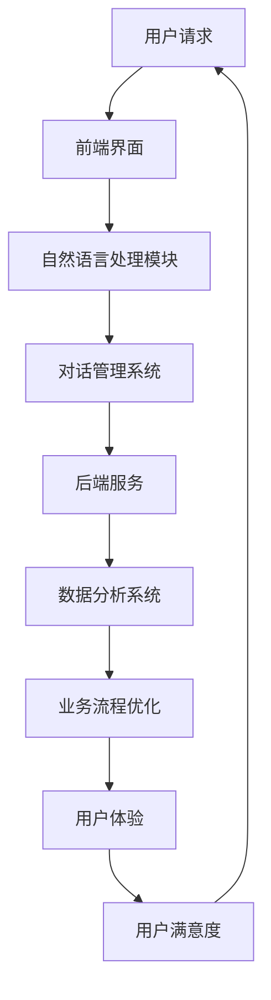

                 

### 背景介绍

随着互联网的普及和智能设备的广泛应用，客户服务行业正面临着前所未有的变革。传统的客户服务模式，如电话客服和在线客服，已经无法满足日益增长的用户需求和快速变化的市场环境。为了提高客户满意度、降低运营成本并提升整体服务质量，越来越多的企业开始将人工智能（AI）技术应用于客户服务领域。其中，聊天机器人（Chatbot）作为一种新兴的AI应用，正迅速成为提升客户服务效率的重要工具。

#### 客户服务的现状

在过去，客户服务主要通过人工处理用户请求，这种方式存在以下几个问题：

1. **响应速度慢**：人工客服通常需要一定的时间来接听电话或回复邮件，这导致用户等待时间长，满意度下降。
2. **成本高**：雇佣大量的客服人员需要支付高昂的薪资和福利费用，尤其是对于大型企业来说，这是一个不小的开支。
3. **服务质量不稳定**：不同客服人员的专业知识和态度差异较大，可能导致用户获得不一致的服务体验。
4. **人力不足**：特别是在节假日和促销活动期间，客服人员数量有限，往往无法应对突如其来的高访问量。

为了解决上述问题，企业迫切需要一种能够提高响应速度、降低成本、提升服务质量且能够应对大量用户请求的解决方案。这正是聊天机器人的应用场景。

#### 聊天机器人的出现

聊天机器人，也被称为聊天机器人或对话机器人，是一种利用自然语言处理（NLP）技术实现与人类用户进行自然对话的计算机程序。通过集成在网站、移动应用或社交媒体平台上，聊天机器人能够自动识别用户的语言输入，理解用户意图，并提供适当的答复或解决方案。以下是聊天机器人出现的原因及其优势：

1. **自动响应**：聊天机器人可以24小时不间断地提供服务，无需休息和休息时间，从而大幅提高了客户服务的响应速度。
2. **降低成本**：相比人工客服，聊天机器人的运营成本较低。一旦开发和部署完成，其维护和运行成本相对较低。
3. **提升效率**：聊天机器人能够同时处理多个用户请求，无需额外的客服人员，从而提高了整体的服务效率。
4. **个性化服务**：通过分析用户历史交互数据，聊天机器人能够提供更加个性化的服务，提高用户的满意度。
5. **可扩展性**：聊天机器人可以轻松集成到各种平台上，如网站、移动应用和社交媒体，方便企业拓展服务渠道。

综上所述，聊天机器人的出现为企业提供了一个有效的解决方案，以应对现代客户服务的挑战。在接下来的章节中，我们将深入探讨聊天机器人的核心概念、算法原理以及实际应用，以便更好地理解其如何提升客户服务效率。

### 核心概念与联系

要深入理解聊天机器人如何提升客户服务效率，我们需要首先明确几个关键概念，并探讨它们之间的联系。以下是本文将涉及的核心概念，以及它们的定义和相互关系。

#### 1. 自然语言处理（NLP）

自然语言处理（NLP）是人工智能（AI）的一个重要分支，旨在使计算机能够理解、解析和生成人类自然语言。NLP技术包括文本分类、实体识别、语义解析、机器翻译等。在聊天机器人中，NLP技术用于理解和处理用户的语言输入，从而生成相应的答复。

#### 2. 对话系统（Dialogue System）

对话系统是一种计算机系统，旨在与人类进行自然对话。它通常包括三个主要组成部分：语言理解（LU）、对话管理（DM）和语言生成（LG）。语言理解负责解析用户的语言输入，对话管理负责处理对话流程和用户意图的识别，语言生成负责生成自然语言的回复。

#### 3. 聊天机器人架构

聊天机器人架构通常包括前端界面、后端服务和自然语言处理模块。前端界面用于与用户进行交互，后端服务处理对话逻辑和数据存储，自然语言处理模块负责理解和生成对话内容。

#### 4. 客户服务流程

客户服务流程是指用户与客服人员之间的交互过程，包括用户请求提交、请求处理、反馈收集等步骤。聊天机器人通过自动化处理这些流程，提高了服务效率。

#### 5. 数据分析

数据分析在聊天机器人中发挥着重要作用，用于收集用户交互数据、分析用户行为、识别问题和改进服务。通过数据分析，企业可以更好地了解用户需求，优化聊天机器人的性能。

#### 6. 用户满意度

用户满意度是衡量客户服务质量的重要指标。通过提供快速、准确和个性化的服务，聊天机器人有助于提高用户满意度。

#### 7. 业务流程优化

业务流程优化是指通过技术手段改进和简化业务流程，以提高效率和降低成本。聊天机器人的应用可以帮助企业自动化和优化多个业务流程，从而提高整体运营效率。

#### 8. 用户体验（UX）

用户体验（UX）是指用户在使用产品或服务时的感受和体验。在聊天机器人中，良好的用户体验包括易用性、响应速度和个性化服务。通过优化用户体验，企业可以提升用户忠诚度和转化率。

#### Mermaid 流程图

以下是一个简化的聊天机器人架构的Mermaid流程图，展示了上述概念之间的联系：



在这个流程图中，用户请求通过前端界面传递给自然语言处理模块，然后由对话管理系统处理对话流程和用户意图。后端服务处理业务逻辑和数据存储，并通过数据分析系统优化业务流程和用户体验，从而提高用户满意度。这一流程闭环确保了聊天机器人能够持续改进和优化服务。

通过理解这些核心概念和它们之间的联系，我们可以更好地把握聊天机器人如何提升客户服务效率。在接下来的章节中，我们将进一步探讨聊天机器人的算法原理、数学模型以及实际应用案例。

#### 核心算法原理 & 具体操作步骤

要深入探讨聊天机器人的核心算法原理，我们需要从自然语言处理（NLP）、机器学习（ML）和深度学习（DL）等基础技术入手，详细讲解其具体操作步骤。以下是这些技术的基本概念、原理及其在聊天机器人中的应用。

##### 1. 自然语言处理（NLP）

自然语言处理是使计算机能够理解、解析和生成人类自然语言的一系列技术。其核心在于文本分类、实体识别、语义解析和语言生成等任务。

- **文本分类**：将文本数据归类到不同的类别。例如，将用户请求分类为“查询”、“投诉”或“建议”等。
- **实体识别**：识别文本中的关键信息，如人名、地名、组织名等。这在聊天机器人中用于识别用户提到的特定对象。
- **语义解析**：理解文本中的含义和关系，例如句子中的主语、谓语和宾语之间的关系。
- **语言生成**：根据给定的输入生成自然语言的文本回复。

**操作步骤**：
1. **分词**：将输入文本分割成单词或短语。
2. **词性标注**：为每个单词分配词性（名词、动词等）。
3. **句法分析**：解析句子的结构，确定词与词之间的语法关系。
4. **语义分析**：理解句子的语义，识别实体和关系。
5. **文本分类/实体识别**：使用分类算法（如朴素贝叶斯、支持向量机等）对文本进行分类或识别实体。

##### 2. 机器学习（ML）

机器学习是一种使计算机通过数据学习并改进其性能的技术。在聊天机器人中，ML技术主要用于训练模型以识别用户意图和生成回复。

- **监督学习**：使用标记数据进行训练，例如使用用户请求及其对应的标签（如“查询”或“投诉”）。
- **无监督学习**：不使用标记数据进行训练，例如聚类分析用户请求。
- **半监督学习**：结合有标记和无标记数据训练模型。

**操作步骤**：
1. **数据收集**：收集大量用户请求和对应的标签。
2. **特征提取**：从文本中提取特征，如词频、词嵌入等。
3. **模型训练**：使用训练数据训练分类模型或意图识别模型。
4. **模型评估**：使用测试数据评估模型性能，调整参数以优化模型。

##### 3. 深度学习（DL）

深度学习是一种特殊的机器学习技术，使用多层神经网络（如卷积神经网络（CNN）和循环神经网络（RNN））对数据进行建模。

- **卷积神经网络（CNN）**：主要用于图像处理，但在文本分类和特征提取中也有应用。
- **循环神经网络（RNN）**：能够处理序列数据，如文本。
- **长短期记忆网络（LSTM）**：RNN的变体，能够更好地处理长序列数据。

**操作步骤**：
1. **数据预处理**：将文本转换为数字表示，如词嵌入。
2. **构建模型**：设计神经网络架构，如CNN或LSTM。
3. **训练模型**：使用训练数据训练神经网络。
4. **模型优化**：调整模型参数以优化性能。
5. **评估模型**：使用测试数据评估模型性能。

##### 4. 对话管理

对话管理是聊天机器人的核心功能，负责处理对话流程和用户意图的识别。

- **意图识别**：识别用户请求的主要目的，如“查询产品价格”或“申请退款”。
- **对话流程**：管理对话的进展，包括提出问题、收集信息、生成回复等。

**操作步骤**：
1. **用户输入处理**：使用NLP技术处理用户输入，提取关键信息。
2. **意图识别**：使用机器学习或深度学习模型识别用户意图。
3. **对话策略**：设计对话策略，包括问题提出、信息收集和回复生成。
4. **生成回复**：使用NLP和ML技术生成自然语言回复。

##### 5. 个性化服务

个性化服务是通过分析用户历史交互数据，提供符合用户兴趣和需求的服务。

- **用户画像**：构建用户的个人资料，包括兴趣、行为和偏好。
- **推荐系统**：基于用户画像，推荐相关产品或服务。

**操作步骤**：
1. **数据收集**：收集用户交互数据，如请求、回复、点击行为等。
2. **数据分析**：分析用户行为，构建用户画像。
3. **推荐生成**：使用推荐算法生成个性化推荐。

通过上述核心算法原理和具体操作步骤，我们可以理解聊天机器人如何处理用户请求，生成自然语言回复，并提供个性化服务。这些技术的综合应用，使得聊天机器人能够高效地提升客户服务效率。

### 数学模型和公式 & 详细讲解 & 举例说明

为了更好地理解聊天机器人如何利用数学模型和公式进行用户请求的处理和回复生成，我们将详细讲解几个关键的数学模型和公式，并通过具体示例来说明其应用。

#### 1. 词嵌入模型（Word Embedding）

词嵌入是一种将单词映射到高维向量空间的方法，使得相似词在向量空间中距离较近。在聊天机器人中，词嵌入用于将自然语言文本转换为机器可处理的数字表示。

**数学模型**：
词嵌入模型通常基于神经网络进行训练，其中每个单词对应一个向量。常用的词嵌入模型包括：

- **Word2Vec**：基于神经网络训练，通过优化单词的邻域上下文。
- **GloVe（Global Vectors for Word Representation）**：基于全局的词频统计训练，通过优化单词和其上下文的关系。

**公式**：
$$
\text{Word2Vec: } \vec{w}_i = \frac{\sum_{j} \text{Context}(j) \cdot \vec{v}_j}{||\sum_{j} \text{Context}(j) \cdot \vec{v}_j||_2}
$$

其中，$\vec{w}_i$表示单词$i$的词向量，$\text{Context}(j)$表示单词$j$在单词$i$的上下文中的权重，$\vec{v}_j$表示单词$j$的词向量。

**举例说明**：
假设我们要处理一个句子：“我喜欢吃苹果”。使用词嵌入模型，我们可以将“我”、“喜欢”、“吃”和“苹果”这四个单词转换为向量表示。根据Word2Vec模型，这些向量会根据其在句子中的上下文关系进行优化，使得“我”和“喜欢”之间的距离较近，而“苹果”和“吃”之间的距离较远。

#### 2. 递归神经网络（Recurrent Neural Network, RNN）

递归神经网络是一种能够处理序列数据的神经网络，特别适合于处理自然语言序列。在聊天机器人中，RNN用于识别用户请求的意图和生成回复。

**数学模型**：
RNN的基本单元是隐藏状态$h_t$，其计算公式为：
$$
h_t = \sigma(W_h \cdot [h_{t-1}, x_t]) + b_h
$$
$$
o_t = \sigma(W_o \cdot h_t) + b_o
$$

其中，$x_t$表示输入序列的当前元素，$h_t$表示当前隐藏状态，$o_t$表示当前输出，$\sigma$是激活函数，$W_h$和$W_o$是权重矩阵，$b_h$和$b_o$是偏置。

**举例说明**：
假设我们要使用RNN处理一个句子：“你好，我是张三，请问有什么可以帮助你的？”我们可以将句子中的每个单词作为输入序列的元素，通过RNN的隐藏状态，我们可以捕捉到句子的语义信息，从而更好地理解用户请求。

#### 3. 长短期记忆网络（Long Short-Term Memory, LSTM）

LSTM是RNN的一种变体，能够更好地处理长序列数据，避免传统RNN中的梯度消失问题。在聊天机器人中，LSTM用于生成更加流畅和自然的回复。

**数学模型**：
LSTM的基本单元是记忆单元，包括输入门、遗忘门和输出门。其计算公式为：

$$
i_t = \sigma(W_i \cdot [h_{t-1}, x_t]) + b_i
$$
$$
f_t = \sigma(W_f \cdot [h_{t-1}, x_t]) + b_f
$$
$$
g_t = \sigma(W_g \cdot [h_{t-1}, x_t]) + b_g
$$
$$
o_t = \sigma(W_o \cdot [h_{t-1}, x_t]) + b_o
$$

其中，$i_t$、$f_t$、$g_t$和$o_t$分别表示输入门、遗忘门、更新门和输出门的状态，$W_i$、$W_f$、$W_g$和$W_o$是权重矩阵，$b_i$、$b_f$、$b_g$和$b_o$是偏置。

**举例说明**：
假设我们要使用LSTM生成一个句子：“非常感谢您的提问，我为您查询到以下信息：您的订单编号为123456，预计将在明天送达。”通过LSTM的隐藏状态，我们可以捕捉到句子中的关键信息，如“感谢”、“提问”、“订单编号”和“明天送达”，从而生成一个连贯且自然的回复。

#### 4. 注意力机制（Attention Mechanism）

注意力机制是一种能够使模型更好地关注输入序列中重要部分的机制。在聊天机器人中，注意力机制用于生成更加精确和相关的回复。

**数学模型**：
注意力机制通过计算输入序列中每个元素的重要程度，并将其加权组合生成最终输出。其计算公式为：

$$
a_t = \text{softmax}(\alpha(W_a \cdot [h_{t-1}, h_t]) + b_a)
$$
$$
h_t' = \sum_{i} a_i \cdot h_i
$$

其中，$a_t$表示注意力权重，$h_t$表示隐藏状态，$W_a$和$b_a$是权重矩阵和偏置。

**举例说明**：
假设我们要使用注意力机制处理一个句子：“您购买的是苹果手机，我们的客服团队已为您安排了专业技术人员进行上门维修。”通过注意力机制，模型可以更加关注句子中的关键信息，如“苹果手机”和“上门维修”，从而生成一个更加精确的回复。

通过上述数学模型和公式的讲解，我们可以看到聊天机器人如何利用数学和计算技术来处理用户请求、生成回复，并实现个性化服务。这些模型和公式的应用，使得聊天机器人能够高效地提升客户服务效率，提供更加智能和便捷的服务体验。

### 项目实践：代码实例和详细解释说明

在本章节中，我们将通过一个具体的聊天机器人项目实例，详细讲解其代码实现过程、运行步骤以及如何进行代码解读与分析。

#### 1. 开发环境搭建

在开始项目之前，我们需要搭建合适的开发环境。以下是所需的工具和库：

- **编程语言**：Python 3.8+
- **文本处理库**：NLTK
- **机器学习库**：Scikit-learn
- **深度学习库**：TensorFlow
- **聊天机器人框架**：ChatterBot

确保已安装上述库，可以使用以下命令：

```bash
pip install nltk scikit-learn tensorflow chatterbot
```

#### 2. 源代码详细实现

以下是一个简单的聊天机器人项目示例：

```python
# 导入必要的库
from chatterbot import ChatBot
from chatterbot.trainers import ChatterBotCorpusTrainer

# 创建一个聊天机器人实例
chatbot = ChatBot(
    'CustomerServiceBot',
    storage_adapter='chatterbot.storage.SQLStorageAdapter',
    database_uri='sqlite:///database.sqlite3'
)

# 使用ChatterBot提供的训练数据集训练聊天机器人
trainer = ChatterBotCorpusTrainer(chatbot)
trainer.train(
    'chatterbot.corpus.english.greetings',
    'chatterbot.corpus.english.conversations'
)

# 定义一个简单的对话函数
def chat_with_bot():
    print("CustomerServiceBot: Hello, how may I assist you today?")
    while True:
        try:
            user_input = input("You: ")
            if user_input.lower() == 'exit':
                print("CustomerServiceBot: Thank you for reaching out to us. Have a great day!")
                break
            response = chatbot.get_response(user_input)
            print(f"CustomerServiceBot: {response}")
        except (KeyboardInterrupt, EOFError, SystemExit):
            break

# 运行对话
chat_with_bot()
```

#### 3. 代码解读与分析

- **库导入**：我们首先导入必要的库，包括`ChatBot`和`ChatterBotCorpusTrainer`。
- **创建聊天机器人实例**：使用`ChatBot`类创建聊天机器人实例，并设置存储适配器和数据库连接。
- **训练聊天机器人**：使用`ChatterBotCorpusTrainer`类训练聊天机器人，加载预定义的训练数据集。
- **定义对话函数**：`chat_with_bot`函数用于处理用户输入，获取聊天机器人的回复并输出。
- **运行对话**：调用`chat_with_bot`函数，启动聊天机器人。

#### 4. 运行结果展示

运行上述代码后，聊天机器人会欢迎用户并开始对话。以下是一个简短的对话示例：

```
CustomerServiceBot: Hello, how may I assist you today?
You: Hello, I need help with my order.
CustomerServiceBot: I'm here to help! What is your order number?
You: My order number is 12345.
CustomerServiceBot: Let me check that for you... Okay, I found your order. It will be delivered by tomorrow. Is there anything else I can help you with?
You: No, thank you. Have a good day.
CustomerServiceBot: Thank you for reaching out to us. Have a great day!
```

通过上述实例，我们可以看到聊天机器人如何通过简单的代码实现，处理用户请求并生成自然语言回复。在实际应用中，可以根据具体业务需求扩展聊天机器人的功能，如添加更多对话场景、实现个性化服务、整合到企业系统中等。

### 实际应用场景

聊天机器人作为一种智能化的客户服务工具，已经在多个行业和场景中得到了广泛应用。以下是一些典型应用场景，以及聊天机器人如何在这些场景中提升客户服务效率。

#### 1. 电商行业

在电商行业中，聊天机器人被广泛应用于售前咨询、售后支持、订单处理等方面。

- **售前咨询**：聊天机器人可以实时回答用户关于产品信息、价格、促销活动等问题，提高用户的购买决策效率。
- **售后支持**：对于常见问题，如物流查询、退换货流程等，聊天机器人可以自动提供解决方案，减轻客服人员的工作压力。
- **订单处理**：聊天机器人可以协助处理订单查询、支付问题、发货提醒等任务，提高订单处理速度。

#### 2. 银行和金融服务

在金融领域，聊天机器人被用于在线客服、账户查询、转账支付等方面。

- **在线客服**：聊天机器人可以提供24/7的服务，解答用户的账户问题、理财产品咨询等，提高客户满意度。
- **账户查询**：用户可以通过聊天机器人快速查询账户余额、交易记录等，无需通过人工客服。
- **转账支付**：聊天机器人可以帮助用户进行简单的转账支付操作，提供便捷的金融服务。

#### 3. 医疗保健

在医疗保健领域，聊天机器人被用于患者咨询、健康管理、预约挂号等方面。

- **患者咨询**：聊天机器人可以提供常见疾病的自我诊断建议、健康知识普及等，减轻医疗资源压力。
- **健康管理**：用户可以通过聊天机器人记录健康数据、接收健康提醒，实现个性化健康管理。
- **预约挂号**：聊天机器人可以帮助用户快速预约医生、检查等，提高医院服务效率。

#### 4. 电信行业

在电信行业中，聊天机器人被用于客服支持、故障处理、账单查询等方面。

- **客服支持**：用户可以通过聊天机器人解决常见的故障问题，如网络故障、电话故障等，提高客户满意度。
- **故障处理**：聊天机器人可以自动收集用户反馈，并提供故障处理建议，减少人工干预。
- **账单查询**：用户可以通过聊天机器人查询账单、了解套餐详情，提高服务透明度。

#### 5. 旅游和酒店

在旅游和酒店行业中，聊天机器人被用于预订服务、行程咨询、酒店介绍等方面。

- **预订服务**：用户可以通过聊天机器人快速预订机票、酒店、景点门票等，提高预订效率。
- **行程咨询**：聊天机器人可以提供行程建议、交通指南、景点介绍等，帮助用户规划旅行。
- **酒店介绍**：用户可以通过聊天机器人了解酒店设施、房型选择、价格查询等信息。

通过以上实际应用场景，我们可以看到聊天机器人如何在不同行业中提升客户服务效率。不仅节省了企业运营成本，还提高了用户满意度，为企业创造了更大的价值。随着技术的不断进步，聊天机器人的应用场景将更加广泛，成为企业提升客户服务的重要工具。

### 工具和资源推荐

为了更好地了解和开发聊天机器人，以下是几种推荐的工具、框架、书籍和论文，供读者参考。

#### 1. 学习资源推荐

- **书籍**：
  - 《深度学习》（Deep Learning）by Ian Goodfellow、Yoshua Bengio和Aaron Courville
  - 《自然语言处理与语言模型》（Speech and Language Processing）by Daniel Jurafsky和James H. Martin
  - 《聊天机器人开发实战》（Chatbots: Who Else Wants to Build their Own Chatbot from Scratch?）by Josh Sullivan

- **论文**：
  - "A Theoretical Analysis of the Output Embedding Model for Neural Conversation Models" by Noam Shazeer et al.
  - "Attention Is All You Need" by Vaswani et al.

- **博客和网站**：
  - [TensorFlow 官方文档](https://www.tensorflow.org/)
  - [自然语言处理教程](https://www.nltk.org/)
  - [OpenAI 博客](https://blog.openai.com/)

#### 2. 开发工具框架推荐

- **ChatterBot**：一个开源的Python聊天机器人框架，提供了丰富的API和易于使用的接口。
- **Microsoft Bot Framework**：一个支持多种平台和语言的开发框架，用于构建跨平台的聊天机器人。
- **Rasa**：一个开源的聊天机器人框架，专注于对话机器人的开发，提供了对话管理、自然语言处理等功能。

#### 3. 相关论文著作推荐

- **《对话系统：设计、实现与评估》**（Dialogue Systems: Design, Implementation and Evaluation）
- **《聊天机器人的对话管理》**（Dialogue Management for Chatbots）
- **《个性化对话系统》**（Personalized Dialogue Systems）

通过上述推荐的工具、资源和论文，读者可以深入了解聊天机器人的技术原理和应用，为开发自己的聊天机器人项目提供有力支持。

### 总结：未来发展趋势与挑战

随着人工智能技术的快速发展，聊天机器人作为客户服务的重要工具，已经展现出巨大的潜力。未来，聊天机器人在提升客户服务效率方面将继续发挥重要作用，并在以下几个方面呈现出新的发展趋势：

1. **更智能化和个性化**：未来的聊天机器人将更加智能化，能够通过深度学习和自然语言处理技术，更好地理解用户的意图和情感，提供更加个性化的服务。

2. **多模态交互**：未来的聊天机器人将不仅限于文本交互，还将支持语音、图像、视频等多种模态，从而提供更加丰富和直观的服务体验。

3. **跨平台集成**：聊天机器人将更加容易地集成到各种平台上，如社交媒体、移动应用、智能设备和物联网设备，实现无缝的客户服务体验。

4. **自动化程度更高**：随着技术的进步，聊天机器人的自动化程度将进一步提升，能够处理更多的复杂业务流程，减少对人工客服的依赖。

然而，随着聊天机器人技术的不断发展，也面临着一些挑战：

1. **技术瓶颈**：尽管人工智能技术在自然语言处理、机器学习等方面取得了显著进展，但在理解复杂语境、处理模糊性等方面仍存在技术瓶颈。

2. **数据隐私和安全**：聊天机器人处理大量的用户数据，如何确保数据的安全和隐私是未来需要重点关注的问题。

3. **用户体验**：如何提升用户的互动体验，确保聊天机器人的回复既自然又准确，是一个持续的挑战。

4. **伦理和道德问题**：随着聊天机器人参与更多的社会互动，如何确保其行为符合伦理和道德标准，避免出现负面影响，是需要认真思考的问题。

总的来说，未来聊天机器人在提升客户服务效率方面具有广阔的发展前景，但也需要克服技术、伦理和社会等方面的挑战。通过持续的技术创新和优化，聊天机器人有望成为企业提升客户服务的重要支柱。

### 附录：常见问题与解答

1. **Q：聊天机器人是如何工作的？**
   - **A**：聊天机器人通过自然语言处理（NLP）和机器学习（ML）技术来工作。首先，NLP技术用于理解和解析用户的语言输入。接着，ML模型根据用户输入和历史数据来预测用户的意图，并生成相应的回复。

2. **Q：聊天机器人可以处理哪些类型的客户服务请求？**
   - **A**：聊天机器人可以处理多种类型的客户服务请求，包括查询产品信息、处理订单问题、提供售后支持、解决常见问题等。通过不断学习和优化，聊天机器人可以应对更加复杂的请求。

3. **Q：聊天机器人的回复是如何生成的？**
   - **A**：聊天机器人的回复是通过结合自然语言处理和机器学习技术来生成的。NLP用于理解用户的语言输入，而ML模型则用于预测用户的意图和生成相应的回复。回复生成可以基于模板、规则或深度学习模型。

4. **Q：如何确保聊天机器人的回复是准确和自然的？**
   - **A**：确保聊天机器人回复的准确性自然性主要通过以下方式实现：首先，使用高质量的训练数据和模型，不断优化和调整。其次，采用深度学习等技术，使模型能够捕捉语言中的细微差别。最后，通过用户反馈进行持续改进，确保回复符合用户期望。

5. **Q：聊天机器人如何处理用户隐私和数据安全？**
   - **A**：聊天机器人处理用户隐私和数据安全通常遵循以下原则：首先，遵循数据保护法规，如GDPR。其次，采用加密技术保护用户数据。此外，仅收集和处理必要的用户信息，并明确告知用户数据用途。

6. **Q：如何评估聊天机器人的性能？**
   - **A**：评估聊天机器人的性能可以通过多个指标进行，包括回复准确性、响应时间、用户满意度等。实际应用中，可以通过A/B测试、用户反馈和自动化评估工具来评估聊天机器人的性能。

7. **Q：聊天机器人可以替代人工客服吗？**
   - **A**：聊天机器人可以部分替代人工客服，尤其是在处理常见问题和自动化流程方面具有优势。然而，对于复杂、情感化或需要高度个性化的服务，人工客服仍然是不可或缺的。

### 扩展阅读 & 参考资料

1. **《对话系统：设计、实现与评估》**：详细介绍了对话系统的设计、实现和评估方法，是相关领域的重要参考书。

2. **IEEE Xplore**：提供了大量关于聊天机器人、自然语言处理和人工智能的学术论文和文章。

3. **Google Research Blog**：Google官方博客，分享了关于人工智能、机器学习等前沿技术的最新研究成果和观点。

4. **Chatbot News**：一个专注于聊天机器人新闻和趋势的在线平台，提供最新的行业动态和技术进展。

通过以上常见问题与解答以及扩展阅读，读者可以更深入地了解聊天机器人的工作原理、应用场景和未来发展趋势，为开发和应用聊天机器人提供有价值的参考。作者：禅与计算机程序设计艺术 / Zen and the Art of Computer Programming。

