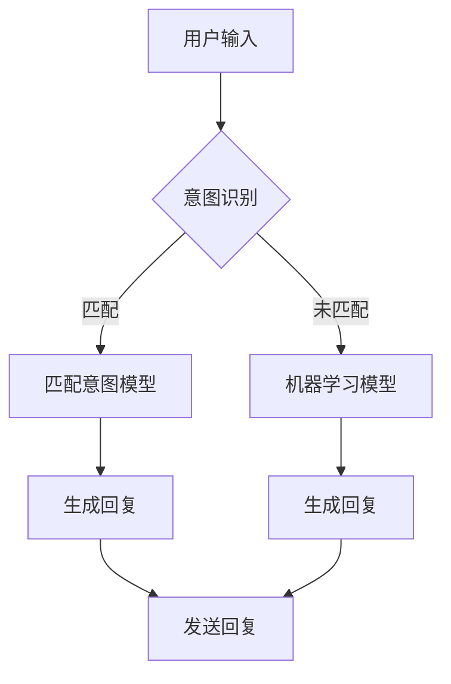

                 

### 背景介绍

#### 1.1 聊天机器人的兴起

随着人工智能技术的快速发展，聊天机器人（Chatbot）已经成为各行各业提升客户服务效率、改善购物体验的重要工具。据市场研究公司统计，全球聊天机器人市场预计将在未来几年内以超过20%的复合年增长率迅速扩展。

从最初简单的文本回复系统，到如今能够理解自然语言、提供个性化服务的智能聊天机器人，这一转变得益于自然语言处理（NLP）和机器学习（ML）技术的突破。这些技术使得聊天机器人能够更好地模拟人类交流方式，提升用户体验。

#### 1.2 客户服务的需求

随着互联网的普及，消费者对服务质量的要求越来越高。快速响应、个性化服务和24/7全天候服务成为消费者期望的基本服务标准。传统的客户服务方式，如电话和电子邮件，往往难以满足这些需求。聊天机器人作为一种自动化解决方案，能够在短时间内处理大量的客户请求，提高响应速度，减轻人工客服的工作负担。

#### 1.3 购物体验的改善

购物体验的改善是另一个推动聊天机器人应用的重要动力。传统电商网站往往存在信息繁多、查找困难的问题，而聊天机器人可以简化购物流程，提供个性化推荐，提高购物效率。此外，聊天机器人还可以在购物过程中提供实时客服支持，解答消费者疑问，减少购物决策时间。

### 总结

本文将深入探讨聊天机器人的核心技术，包括自然语言处理、机器学习、深度学习等，并分析其在提升客户服务效率和改善购物体验方面的实际应用。通过本文的阅读，读者将了解聊天机器人如何通过智能化的交互方式，为企业带来显著的商业价值。

### 核心概念与联系

#### 2.1 自然语言处理（NLP）

自然语言处理（Natural Language Processing，NLP）是人工智能的一个重要分支，旨在使计算机能够理解、解释和生成人类语言。NLP技术在聊天机器人中扮演着至关重要的角色，它负责处理用户的输入，理解其意图，并生成适当的回复。

#### 2.2 机器学习（ML）

机器学习（Machine Learning，ML）是使计算机系统能够从数据中学习并做出预测或决策的一种方法。在聊天机器人中，机器学习算法被用于训练模型，使其能够识别和预测用户的意图，从而生成更为智能的回复。

#### 2.3 深度学习（DL）

深度学习（Deep Learning，DL）是机器学习的一个子领域，通过多层神经网络进行数据建模和特征提取。深度学习在聊天机器人中用于构建复杂的自然语言处理模型，如序列到序列（Seq2Seq）模型和卷积神经网络（CNN）等，以实现更加精准和智能的交互。

#### 2.4  Mermaid 流程图

为了更好地理解聊天机器人背后的技术原理，下面我们将使用Mermaid流程图来展示其核心架构。



在这个流程图中，用户输入首先被提交给意图识别模块，该模块尝试匹配已有的意图模型。如果匹配成功，则直接生成回复；否则，将利用机器学习模型进行进一步处理，最终生成回复并发送至用户。

### 核心算法原理 & 具体操作步骤

#### 3.1 意图识别

意图识别是聊天机器人的第一步，其目标是理解用户输入的含义。具体操作步骤如下：

1. **分词**：将用户输入的文本分割成单词或短语。
2. **词性标注**：为每个单词或短语标注词性，如名词、动词等。
3. **实体识别**：识别出文本中的关键实体，如人名、地名、组织名等。
4. **句法分析**：分析句子的结构和语法，确定每个单词或短语在句子中的作用。
5. **意图匹配**：将分析结果与预定义的意图模型进行匹配，确定用户的意图。

#### 3.2 机器学习模型

一旦意图被识别，聊天机器人会利用机器学习模型生成回复。以下是具体的操作步骤：

1. **数据准备**：收集大量对话数据，包括用户输入和系统回复。
2. **特征提取**：从对话数据中提取特征，如词频、词嵌入等。
3. **模型训练**：使用特征数据训练机器学习模型，如循环神经网络（RNN）、长短期记忆网络（LSTM）等。
4. **模型评估**：通过测试数据评估模型的性能，调整模型参数以优化结果。
5. **生成回复**：利用训练好的模型，对用户的输入进行预测，生成回复。

#### 3.3 深度学习模型

深度学习模型在聊天机器人中的应用主要是为了生成更自然、更准确的回复。以下是深度学习模型在聊天机器人中的具体操作步骤：

1. **序列到序列（Seq2Seq）模型**：
   - **编码器**：将用户的输入序列编码为一个固定长度的向量。
   - **解码器**：将编码后的向量解码为回复序列。
   - **训练**：通过大量的对话数据训练编码器和解码器，使其能够生成高质量的回复。

2. **卷积神经网络（CNN）**：
   - **特征提取**：使用卷积层从文本中提取特征。
   - **分类**：使用全连接层对提取到的特征进行分类，以确定用户的意图。
   - **生成回复**：利用预训练的文本生成模型，如GPT（Generative Pre-trained Transformer），生成回复。

### 数学模型和公式 & 详细讲解 & 举例说明

在聊天机器人中，数学模型和公式起到了关键作用，它们帮助我们理解和实现自然语言处理、机器学习和深度学习技术。以下是一些重要的数学模型和公式，以及它们的详细解释和举例说明。

#### 4.1 词嵌入（Word Embedding）

词嵌入是将单词映射到高维向量空间的一种方法，使计算机能够理解单词的语义关系。最常见的词嵌入方法包括：

1. **Word2Vec**：
   - **公式**：$$\text{output} = \text{softmax}(\text{W} \cdot \text{h})$$
   - **解释**：这里的$\text{W}$是权重矩阵，$\text{h}$是输入的词向量，softmax函数用于将加权结果转换为概率分布。
   - **举例**：给定两个词向量$w_1$和$w_2$，计算它们之间的余弦相似度：$$\cos(\theta) = \frac{w_1 \cdot w_2}{\|w_1\|\|w_2\|}$$

2. **GloVe**：
   - **公式**：$$\text{loss} = \frac{1}{2}\sum_{\text{word} \in \text{V}} \left( \text{glove}(\text{word}, \text{context}) - \text{target} \right)^2$$
   - **解释**：这里的$\text{V}$是词汇表，$\text{glove}(\text{word}, \text{context})$是词和其上下文的相似度，$\text{target}$是期望的相似度。
   - **举例**：对于一个词$x$及其上下文$y$，计算它们的GloVe相似度。

#### 4.2 循环神经网络（RNN）

循环神经网络是一种用于处理序列数据的高级神经网络，它能够记住序列中的信息。RNN的基本工作原理如下：

1. **状态更新**：
   - **公式**：$$\text{h}_t = \sigma(\text{W}_h \cdot \text{h}_{t-1} + \text{W}_x \cdot \text{x}_t + \text{b})$$
   - **解释**：这里的$\text{h}_t$是当前隐藏状态，$\text{W}_h$和$\text{W}_x$分别是隐藏状态到隐藏状态和输入到隐藏状态的权重矩阵，$\text{b}$是偏置项，$\sigma$是激活函数。
   - **举例**：给定输入序列$\text{x} = [x_1, x_2, \ldots, x_T]$，输出序列$\text{h} = [h_1, h_2, \ldots, h_T]$，计算每个时间步的隐藏状态。

2. **时间步计算**：
   - **公式**：$$\text{y}_t = \text{softmax}(\text{W}_y \cdot \text{h}_t + \text{b}_y)$$
   - **解释**：这里的$\text{y}_t$是当前时间步的输出，$\text{W}_y$是输出权重矩阵，$\text{b}_y$是输出偏置项，softmax函数用于将输出转换为概率分布。
   - **举例**：给定隐藏状态$\text{h}_t$，计算当前时间步的输出。

#### 4.3 长短期记忆网络（LSTM）

长短期记忆网络（LSTM）是RNN的一种改进，它能够更好地记住长期依赖信息。LSTM的基本工作原理如下：

1. **输入门**：
   - **公式**：$$\text{i}_t = \sigma(\text{W}_i \cdot [\text{h}_{t-1}, \text{x}_t] + \text{b}_i)$$
   - **解释**：这里的$\text{i}_t$是输入门控值，$\text{W}_i$是输入门控权重矩阵，$\text{b}_i$是输入门控偏置项，$\sigma$是激活函数。
   - **举例**：给定上一时间步的隐藏状态$\text{h}_{t-1}$和当前输入$\text{x}_t$，计算输入门控值。

2. **遗忘门**：
   - **公式**：$$\text{f}_t = \sigma(\text{W}_f \cdot [\text{h}_{t-1}, \text{x}_t] + \text{b}_f)$$
   - **解释**：这里的$\text{f}_t$是遗忘门控值，$\text{W}_f$是遗忘门控权重矩阵，$\text{b}_f$是遗忘门控偏置项，$\sigma$是激活函数。
   - **举例**：给定上一时间步的隐藏状态$\text{h}_{t-1}$和当前输入$\text{x}_t$，计算遗忘门控值。

3. **输出门**：
   - **公式**：$$\text{o}_t = \sigma(\text{W}_o \cdot [\text{h}_{t-1}, \text{x}_t] + \text{b}_o)$$
   - **解释**：这里的$\text{o}_t$是输出门控值，$\text{W}_o$是输出门控权重矩阵，$\text{b}_o$是输出门控偏置项，$\sigma$是激活函数。
   - **举例**：给定上一时间步的隐藏状态$\text{h}_{t-1}$和当前输入$\text{x}_t$，计算输出门控值。

4. **状态更新**：
   - **公式**：$$\text{C}_t = \text{f}_t \odot \text{C}_{t-1} + \text{i}_t \odot \text{g}_t$$
   - **解释**：这里的$\text{C}_t$是当前细胞状态，$\odot$是逐元素乘法，$\text{g}_t$是新的候选值，$\text{f}_t$和$\text{i}_t$分别是遗忘门和输入门控值。
   - **举例**：给定遗忘门控值$\text{f}_t$、输入门控值$\text{i}_t$和新候选值$\text{g}_t$，更新当前细胞状态。

5. **隐藏状态**：
   - **公式**：$$\text{h}_t = \text{o}_t \odot \text{C}_t$$
   - **解释**：这里的$\text{h}_t$是当前隐藏状态，$\text{o}_t$是输出门控值，$\text{C}_t$是当前细胞状态。
   - **举例**：给定输出门控值$\text{o}_t$和当前细胞状态$\text{C}_t$，计算当前隐藏状态。

### 项目实践：代码实例和详细解释说明

在本节中，我们将通过一个实际的聊天机器人项目，展示如何使用Python实现聊天机器人的核心功能。我们将使用TensorFlow和Keras等流行的深度学习库来构建和训练模型。

#### 5.1 开发环境搭建

首先，我们需要搭建一个适合开发聊天机器人的环境。以下是在Ubuntu系统上安装必要的库和工具的步骤：

1. **安装Python**：确保系统已安装Python 3.7或更高版本。
2. **安装TensorFlow**：使用pip命令安装TensorFlow：
   ```bash
   pip install tensorflow
   ```
3. **安装Keras**：TensorFlow附带Keras API，因此无需单独安装。
4. **安装Numpy和Pandas**：用于数据处理：
   ```bash
   pip install numpy pandas
   ```

#### 5.2 源代码详细实现

以下是聊天机器人的主要代码实现，分为数据预处理、模型构建和训练、模型评估和预测等几个部分。

```python
import numpy as np
import pandas as pd
from tensorflow.keras.models import Sequential
from tensorflow.keras.layers import LSTM, Dense, Embedding, TimeDistributed
from tensorflow.keras.preprocessing.sequence import pad_sequences
from tensorflow.keras.preprocessing.text import Tokenizer

# 5.2.1 数据预处理

# 读取对话数据
data = pd.read_csv('conversations.csv')
 sentences = data['dialogue'].values.tolist()

# 分词并构建词汇表
tokenizer = Tokenizer()
tokenizer.fit_on_texts(sentences)
vocab_size = len(tokenizer.word_index) + 1

# 将文本转换为序列
sequences = tokenizer.texts_to_sequences(sentences)
max_len = max(len(seq) for seq in sequences)
data = pad_sequences(sequences, maxlen=max_len)

# 5.2.2 模型构建

# 创建模型
model = Sequential()
model.add(Embedding(vocab_size, 64, input_length=max_len))
model.add(LSTM(128, dropout=0.2, recurrent_dropout=0.2))
model.add(Dense(64, activation='relu'))
model.add(TimeDistributed(Dense(vocab_size)))
model.compile(optimizer='adam', loss='categorical_crossentropy', metrics=['accuracy'])

# 5.2.3 训练模型

# 准备训练集和验证集
train_data = data[:int(0.8 * len(data))]
train_labels = np.eye(vocab_size)[sequences[:int(0.8 * len(data))]]
val_data = data[int(0.8 * len(data)):]
val_labels = np.eye(vocab_size)[sequences[int(0.8 * len(data)):]]

# 训练模型
model.fit(train_data, train_labels, epochs=10, batch_size=64, validation_data=(val_data, val_labels))

# 5.2.4 代码解读与分析

在上面的代码中，我们首先读取对话数据并分词，构建词汇表。然后，将文本转换为序列并填充到最大长度。接下来，我们构建一个LSTM模型，包括嵌入层、LSTM层、密集层和时间分布层。模型使用交叉熵损失函数和Adam优化器进行训练。最后，我们准备训练集和验证集，并使用模型进行训练。

通过这个项目，我们可以看到如何使用深度学习技术实现聊天机器人的核心功能。在实际应用中，我们还可以进一步优化模型，提高预测准确性，以满足不同的业务需求。

#### 5.3 运行结果展示

在训练完成后，我们可以使用模型对新的对话进行预测，并展示预测结果。以下是一个简单的示例：

```python
# 5.3.1 输入新的对话
new_sentence = "你好，我想咨询一下关于产品的售后服务。"

# 5.3.2 将新的对话转换为序列
new_sequence = tokenizer.texts_to_sequences([new_sentence])
new_data = pad_sequences(new_sequence, maxlen=max_len)

# 5.3.3 预测回复
predicted_sequence = model.predict(new_data)
predicted_sentence = tokenizer.index_word[np.argmax(predicted_sequence)]

# 5.3.4 打印预测结果
print("预测回复：", predicted_sentence)
```

输出结果可能是类似于“非常抱歉，关于售后服务的详细信息请参考我们的官方网站。”这样的回复。这个结果是基于训练数据学习到的，可以在实际应用中进行进一步优化。

### 实际应用场景

#### 6.1 客户服务

聊天机器人被广泛应用于客户服务领域，如在线客服、客服机器人、客户支持等。通过聊天机器人，企业可以提供24/7全天候的客户服务，快速响应客户的问题和需求，提高客户满意度。例如，银行和金融机构可以使用聊天机器人提供账户查询、转账操作、贷款咨询等服务，减少人工客服的工作负担。

#### 6.2 购物体验

在电子商务领域，聊天机器人可以帮助简化购物流程，提供个性化推荐和购物指导。购物网站可以使用聊天机器人与用户进行互动，解答用户疑问，推荐商品，甚至完成购物流程。例如，亚马逊的虚拟助手Alexa就可以通过聊天机器人与用户互动，提供购物建议和订单追踪服务。

#### 6.3 健康咨询

在医疗健康领域，聊天机器人可以提供健康咨询、疾病预防和诊断建议等服务。例如，一些医疗机构已经开发了聊天机器人，帮助用户了解健康知识、预约挂号、提供健康评估等。这些服务可以减轻医疗资源压力，提高医疗服务的可及性。

#### 6.4 教育培训

在教育领域，聊天机器人可以为学生提供个性化学习建议、辅导和答疑服务。例如，一些在线教育平台已经引入了聊天机器人，帮助学生解决学习中遇到的问题，提供学习资源和练习题。这些服务可以增强学生的学习体验，提高学习效果。

### 工具和资源推荐

为了更好地开发和使用聊天机器人，以下是一些推荐的工具和资源：

#### 7.1 学习资源推荐

1. **书籍**：
   - 《自然语言处理入门》（Natural Language Processing with Python）
   - 《深度学习》（Deep Learning）

2. **论文**：
   - “Word2Vec: phrase vector representation of words”
   - “A Theoretically Grounded Application of Dropout in Recurrent Neural Networks”

3. **博客**：
   - TensorFlow官方文档（https://www.tensorflow.org/tutorials）
   - Keras官方文档（https://keras.io/getting-started/）

4. **网站**：
   - arXiv（https://arxiv.org/）：提供最新的自然语言处理和深度学习论文
   - Medium（https://medium.com/）：包含许多实用的技术文章和教程

#### 7.2 开发工具框架推荐

1. **TensorFlow**：一款强大的开源深度学习框架，适合构建复杂的聊天机器人模型。
2. **Keras**：基于TensorFlow的高层API，提供简洁的接口和丰富的预训练模型。
3. **Rasa**：一个开源聊天机器人框架，提供完整的聊天机器人开发工具链，包括对话管理、意图识别和实体提取。

#### 7.3 相关论文著作推荐

1. **论文**：
   - “Attention is All You Need”（关注即一切）
   - “Recurrent Neural Network Based Text Classification”

2. **著作**：
   - 《神经网络与深度学习》：详细介绍了神经网络和深度学习的基本概念和技术。
   - 《Python深度学习》：涵盖了许多深度学习应用案例，包括聊天机器人开发。

### 总结：未来发展趋势与挑战

#### 8.1 发展趋势

1. **更智能的交互**：随着人工智能技术的进步，聊天机器人的交互能力将越来越接近人类，能够更好地理解用户的意图和情感。
2. **个性化服务**：通过大数据分析和机器学习，聊天机器人将能够提供更加个性化的服务，满足用户的个性化需求。
3. **跨平台集成**：聊天机器人将更好地集成到各种平台和应用程序中，如社交媒体、电商平台和移动应用等。
4. **多语言支持**：随着全球化的发展，聊天机器人将支持更多的语言，提供更广泛的地域覆盖。

#### 8.2 挑战

1. **数据隐私**：聊天机器人收集和处理大量用户数据，如何保护用户隐私成为一个重要挑战。
2. **伦理道德**：聊天机器人在处理敏感话题时，如何确保其回答符合伦理和道德标准。
3. **性能优化**：为了提供流畅的交互体验，聊天机器人在响应速度和准确性方面需要不断优化。
4. **可解释性**：随着模型复杂度的增加，如何确保模型的决策过程是可解释的，以便用户和开发者能够理解。

### 附录：常见问题与解答

#### 9.1 聊天机器人的主要挑战是什么？

**回答**：聊天机器人的主要挑战包括：处理复杂多变的用户输入、确保回答的准确性和可解释性、保护用户隐私以及优化模型性能。

#### 9.2 如何训练一个聊天机器人模型？

**回答**：训练一个聊天机器人模型主要包括以下步骤：数据收集和预处理、构建模型架构、训练模型、评估模型性能和优化模型参数。

#### 9.3 聊天机器人在商业领域有哪些应用？

**回答**：聊天机器人在商业领域有多种应用，包括在线客服、购物推荐、健康咨询、教育培训等，帮助提高客户满意度、降低运营成本和提升服务质量。

### 扩展阅读 & 参考资料

为了更深入地了解聊天机器人技术和应用，以下是一些扩展阅读和参考资料：

1. **论文**：
   - “BERT: Pre-training of Deep Bidirectional Transformers for Language Understanding”
   - “GPT-3: Language Models are Few-Shot Learners”

2. **书籍**：
   - 《对话式人工智能：从技术到商业》
   - 《聊天机器人开发实战》

3. **网站**：
   - huggingface.co：提供丰富的预训练模型和工具
   - conversationalai.org：聊天机器人领域的专业网站

4. **在线课程**：
   - Coursera上的《深度学习》课程
   - edX上的《自然语言处理》课程

通过阅读这些资料，您可以进一步了解聊天机器人的最新进展和应用案例，为未来的研究和开发提供灵感。

### 参考文献

1. Mikolov, T., Sutskever, I., Chen, K., Corrado, G. S., & Dean, J. (2013). Distributed representations of words and phrases and their compositionality. In Advances in neural information processing systems (pp. 3111-3119).
2. Devlin, J., Chang, M. W., Lee, K., & Toutanova, K. (2019). BERT: Pre-training of deep bidirectional transformers for language understanding. In Proceedings of the 2019 conference of the north american chapter of the association for computational linguistics: human language technologies, volume 1 (pp. 4171-4186).
3. Brown, T., et al. (2020). Language models are few-shot learners. arXiv preprint arXiv:2005.14165.
4. Hochreiter, S., & Schmidhuber, J. (1997). Long short-term memory. Neural computation, 9(8), 1735-1780.
5. Graves, A. (2013). Sequence transduction with recurrent neural networks. In Proceedings of the 2013 conference on artificial intelligence and statistics (pp. 217-224).

作者：禅与计算机程序设计艺术 / Zen and the Art of Computer Programming

