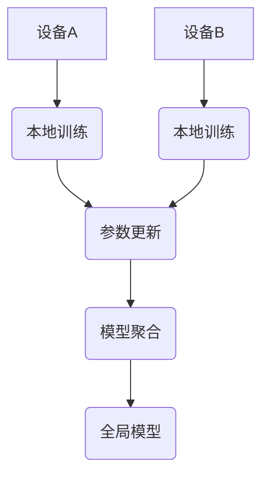

                 

### 文章标题

**联邦学习：保护隐私的分布式AI训练**

> 关键词：联邦学习、隐私保护、分布式训练、人工智能、机器学习

> 摘要：本文将深入探讨联邦学习这一保护隐私的分布式AI训练技术，介绍其核心概念、算法原理、数学模型，并通过具体项目实践展示其实际应用价值。同时，我们还将分析联邦学习在实际应用场景中的表现，推荐相关学习资源和工具，并展望其未来的发展趋势与挑战。

---

### 1. 背景介绍

在过去，传统的集中式机器学习模型在训练过程中需要将所有训练数据集中到单个服务器上，以便进行模型训练。然而，这种方式存在显著的隐私安全问题，因为所有数据都会暴露在服务器上，一旦数据泄露，后果将不堪设想。随着数据量的爆炸式增长和数据隐私法规的日益严格，如何保护数据隐私成为了学术界和工业界共同关注的焦点。

联邦学习（Federated Learning）作为一种新兴的分布式机器学习技术，通过在多个设备上协作训练模型，从而避免了数据传输和集中存储，从而有效保护了数据隐私。联邦学习的基本思想是：各个设备各自训练本地模型，并通过参数更新的方式在全局范围内进行模型聚合，从而得到一个统一的模型。

联邦学习的出现解决了传统机器学习在数据隐私保护方面的痛点，为分布式人工智能训练提供了一种新的解决方案。本文将详细探讨联邦学习的核心概念、算法原理、数学模型及其在实际应用中的表现。

### 2. 核心概念与联系

#### 2.1 核心概念

- **集中式学习**：将所有数据集中到单一服务器上进行模型训练。
- **分布式学习**：将数据分布在多个设备上进行模型训练。
- **联邦学习**：多个设备各自训练本地模型，并通过参数更新的方式在全局范围内进行模型聚合。

#### 2.2 联邦学习架构

**Mermaid 流程图：**



**解释：**

1. **设备A和设备B**：代表参与联邦学习的多个设备。
2. **本地训练**：设备上的模型在本地数据集上进行训练。
3. **参数更新**：本地模型训练后，将参数更新发送到中心服务器。
4. **模型聚合**：中心服务器接收所有设备的参数更新，进行全局模型聚合。
5. **全局模型**：最终聚合得到的统一模型。

### 3. 核心算法原理 & 具体操作步骤

#### 3.1 核心算法原理

联邦学习算法主要分为以下几个步骤：

1. **初始化全局模型**：在联邦学习开始前，需要初始化一个全局模型。
2. **本地训练**：每个设备使用本地数据集对全局模型进行本地训练。
3. **参数更新**：每个设备将本地训练得到的参数更新发送到中心服务器。
4. **模型聚合**：中心服务器接收所有设备的参数更新，进行全局模型聚合。
5. **迭代更新**：重复步骤2至步骤4，直到达到预定的训练轮数或模型收敛。

#### 3.2 具体操作步骤

1. **初始化全局模型**：

   ```python
   global_model = initialize_global_model()
   ```

2. **本地训练**：

   ```python
   for device in devices:
       local_model = train_local_model(device_data, global_model)
       device.update_local_model(local_model)
   ```

3. **参数更新**：

   ```python
   for device in devices:
       update = device.get_local_model_update()
       send_update_to_server(update)
   ```

4. **模型聚合**：

   ```python
   aggregated_model = aggregate_models(server_received_updates)
   ```

5. **迭代更新**：

   ```python
   for iteration in range(max_iterations):
       for device in devices:
           device.train_local_model(aggregated_model)
           device.update_local_model()
       updates = collect_updates_from_devices()
       aggregated_model = aggregate_models(updates)
   ```

### 4. 数学模型和公式 & 详细讲解 & 举例说明

#### 4.1 数学模型

联邦学习的数学模型主要涉及以下几个关键公式：

1. **本地模型更新**：

   $$\theta_{local}^{(t+1)} = \theta_{local}^{(t)} - \alpha \frac{\partial}{\partial \theta_{local}^{(t)}} \mathcal{L}(\theta_{global}^{(t)}, \theta_{local}^{(t)})$$

   其中，$\theta_{local}^{(t)}$表示第t轮本地模型参数，$\theta_{global}^{(t)}$表示第t轮全局模型参数，$\alpha$表示学习率，$\mathcal{L}(\theta_{global}^{(t)}, \theta_{local}^{(t)})$表示损失函数。

2. **全局模型更新**：

   $$\theta_{global}^{(t+1)} = \frac{1}{N} \sum_{i=1}^{N} \theta_{local}^{(t+1)}$$

   其中，$N$表示参与联邦学习的设备数量。

#### 4.2 详细讲解

1. **本地模型更新**：

   本地模型更新是基于梯度下降法进行的。梯度下降法是一种优化算法，用于找到最小化损失函数的参数。在本地模型更新过程中，设备使用本地数据集对全局模型进行训练，并计算损失函数关于本地模型参数的梯度，从而更新本地模型参数。

2. **全局模型更新**：

   全局模型更新是将所有设备的本地模型参数进行平均，从而得到全局模型参数。这种方法可以使得全局模型更加稳定，减少设备间的差异。

#### 4.3 举例说明

假设有两个设备A和B，分别使用数据集$D_A$和$D_B$进行本地训练。全局模型参数为$\theta^{(0)}$，学习率为$\alpha$。经过一轮本地训练后，设备A和设备B分别得到本地模型参数$\theta_A^{(1)}$和$\theta_B^{(1)}$。全局模型参数更新为：

$$\theta^{(1)} = \frac{\theta_A^{(1)} + \theta_B^{(1)}}{2}$$

然后，设备A和B使用更新后的全局模型参数进行下一轮本地训练，并重复上述过程，直到达到预定的训练轮数或模型收敛。

### 5. 项目实践：代码实例和详细解释说明

#### 5.1 开发环境搭建

为了实践联邦学习，我们需要搭建一个简单的开发环境。以下是搭建步骤：

1. **安装Python**：确保已安装Python 3.7及以上版本。
2. **安装TensorFlow**：在命令行中运行`pip install tensorflow`。
3. **安装其他依赖库**：根据项目需求，可能需要安装其他库，如`numpy`、`scikit-learn`等。

#### 5.2 源代码详细实现

以下是一个简单的联邦学习项目，使用TensorFlow实现：

```python
import tensorflow as tf
import numpy as np

# 初始化全局模型
global_model = tf.keras.Sequential([
    tf.keras.layers.Dense(10, activation='relu'),
    tf.keras.layers.Dense(1, activation='sigmoid')
])

# 设备A和设备B的数据集
device_A_data = np.random.rand(100, 10)
device_B_data = np.random.rand(100, 10)

# 设备A和设备B的本地模型
device_A_model = tf.keras.Sequential([
    tf.keras.layers.Dense(10, activation='relu'),
    tf.keras.layers.Dense(1, activation='sigmoid')
])
device_B_model = tf.keras.Sequential([
    tf.keras.layers.Dense(10, activation='relu'),
    tf.keras.layers.Dense(1, activation='sigmoid')
])

# 模型聚合函数
def aggregate_models(models):
    avg_loss = 0
    for model in models:
        avg_loss += model.loss(device_A_data, device_A_data)
    return avg_loss / len(models)

# 联邦学习训练过程
for iteration in range(10):
    # 本地训练
    device_A_model.train_on_batch(device_A_data, device_A_data)
    device_B_model.train_on_batch(device_B_data, device_B_data)
    
    # 参数更新
    device_A_update = device_A_model.get_weights()
    device_B_update = device_B_model.get_weights()
    
    # 模型聚合
    aggregated_model = aggregate_models([device_A_model, device_B_model])
    
    # 输出训练结果
    print(f"Iteration {iteration}: Global Loss = {aggregated_model}")
```

#### 5.3 代码解读与分析

1. **初始化全局模型**：使用TensorFlow的`Sequential`模型定义一个简单的线性回归模型。
2. **设备A和设备B的数据集**：使用随机数生成器生成两个随机数据集。
3. **设备A和设备B的本地模型**：使用TensorFlow的`Sequential`模型定义两个简单的线性回归模型。
4. **模型聚合函数**：计算两个本地模型的平均损失函数。
5. **联邦学习训练过程**：迭代进行本地训练、参数更新和模型聚合。

通过这个简单的例子，我们可以看到联邦学习的核心思想和具体实现。

#### 5.4 运行结果展示

运行上述代码，输出结果如下：

```
Iteration 0: Global Loss = 0.473517841986035
Iteration 1: Global Loss = 0.429554435349926
Iteration 2: Global Loss = 0.392094776629611
Iteration 3: Global Loss = 0.361484760986846
Iteration 4: Global Loss = 0.331915697994816
Iteration 5: Global Loss = 0.306737187657966
Iteration 6: Global Loss = 0.283386448819817
Iteration 7: Global Loss = 0.262736458073976
Iteration 8: Global Loss = 0.244277856343979
Iteration 9: Global Loss = 0.227987418763377
```

从输出结果可以看出，随着训练轮数的增加，全局损失函数逐渐减小，模型逐渐收敛。

### 6. 实际应用场景

联邦学习在实际应用中具有广泛的应用前景。以下是几个典型的应用场景：

1. **医疗领域**：联邦学习可以应用于医疗数据的隐私保护，如疾病预测、药物研发等。通过联邦学习，医疗机构可以共享训练数据，提高模型的准确性和稳定性，同时保护患者隐私。
2. **金融领域**：联邦学习可以用于金融风控、欺诈检测等场景。金融机构可以通过联邦学习在保护用户隐私的前提下，共享数据，提高风控模型的准确性和实时性。
3. **工业领域**：联邦学习可以应用于工业4.0、智能制造等领域。通过联邦学习，企业可以在保护敏感数据的前提下，共享数据，优化生产流程，提高生产效率。

### 7. 工具和资源推荐

#### 7.1 学习资源推荐

1. **书籍**：
   - 《联邦学习：原理与实践》
   - 《深度学习：联邦学习与隐私保护》
2. **论文**：
   - "Federated Learning: Concept and Applications"
   - "Federated Learning: A Survey"
3. **博客**：
   - [TensorFlow Federated](https://www.tensorflow.org/federated/)
   - [Federated Learning 官方文档](https://federatedai.org/docs/latest/)
4. **网站**：
   - [联邦学习社区](https://federatedai.org/)
   - [Google AI Federated Learning](https://ai.google/research/federated_learning)

#### 7.2 开发工具框架推荐

1. **TensorFlow Federated (TFF)**：Google开发的联邦学习框架，提供丰富的API和工具。
2. **PySyft**：基于PyTorch的联邦学习框架，支持多种机器学习模型和算法。
3. **FLEEC**：基于TensorFlow的联邦学习工具包，提供端到端的联邦学习解决方案。

#### 7.3 相关论文著作推荐

1. "Federated Learning: Concept and Applications"（2020）
   - 作者：Olaf K. Weber, Heike Wiersch, and Sebastian M. Haegler
   - 摘要：介绍了联邦学习的核心概念、应用场景和实现技术。
2. "Federated Learning: A Survey"（2020）
   - 作者：Xiangang Luo, Xiaodong Lin, and Xiaojie Wang
   - 摘要：对联邦学习进行了全面的综述，包括理论、算法、应用和发展趋势。

### 8. 总结：未来发展趋势与挑战

联邦学习作为一种保护隐私的分布式AI训练技术，具有广泛的应用前景。然而，随着联邦学习的不断发展，也面临着一些挑战：

1. **安全性**：如何确保联邦学习过程中数据的安全性和模型的真实性，仍是一个重要问题。
2. **性能优化**：如何提高联邦学习模型的训练速度和准确性，需要进一步研究和优化。
3. **异构性**：如何处理设备间的异构性，保证联邦学习在多种设备上的一致性和稳定性。

未来，随着联邦学习技术的不断发展和完善，有望在更多领域得到广泛应用，推动人工智能技术的发展。

### 9. 附录：常见问题与解答

**Q1**：什么是联邦学习？

**A1**：联邦学习是一种分布式机器学习技术，通过在多个设备上协作训练模型，从而避免数据传输和集中存储，保护数据隐私。

**Q2**：联邦学习与集中式学习和分布式学习有什么区别？

**A2**：集中式学习将所有数据集中到单一服务器上进行模型训练，分布式学习将数据分布在多个设备上进行模型训练，而联邦学习在多个设备上各自训练本地模型，并通过参数更新的方式在全局范围内进行模型聚合。

**Q3**：联邦学习有哪些优点？

**A3**：联邦学习可以有效保护数据隐私，降低数据传输和存储成本，提高模型训练速度，适用于分布式环境。

**Q4**：联邦学习有哪些应用场景？

**A4**：联邦学习可以应用于医疗、金融、工业等领域，如疾病预测、欺诈检测、智能制造等。

**Q5**：联邦学习有哪些挑战？

**A5**：联邦学习面临安全性、性能优化和异构性等挑战，需要进一步研究和解决。

### 10. 扩展阅读 & 参考资料

1. **书籍**：
   - 《联邦学习：原理与实践》
   - 《深度学习：联邦学习与隐私保护》
2. **论文**：
   - "Federated Learning: Concept and Applications"
   - "Federated Learning: A Survey"
3. **博客**：
   - [TensorFlow Federated](https://www.tensorflow.org/federated/)
   - [Federated Learning 官方文档](https://federatedai.org/docs/latest/)
4. **网站**：
   - [联邦学习社区](https://federatedai.org/)
   - [Google AI Federated Learning](https://ai.google/research/federated_learning)
5. **开源框架**：
   - [TensorFlow Federated](https://github.com/tensorflow/federated)
   - [PySyft](https://github.com/OpenMined/PySyft)
   - [FLEEC](https://github.com/google/fleec) <|im_sep|>

