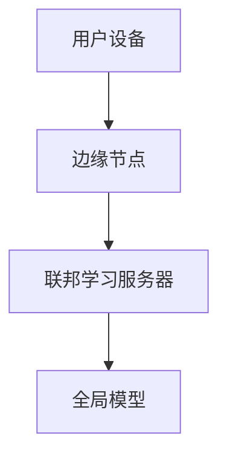

                 

### 文章标题

《联邦学习与边缘计算的结合应用》

关键词：联邦学习、边缘计算、数据隐私、分布式计算、人工智能、机器学习

摘要：本文将深入探讨联邦学习与边缘计算的融合应用，解析其在现代人工智能和机器学习领域中的重要性，并详细阐述两者的结合如何解决数据隐私和计算资源分配的问题。

### 1. 背景介绍

在当今数据驱动时代，人工智能和机器学习技术的发展日新月异。然而，随着数据量的爆炸性增长，数据处理和存储的需求也日益增加。传统的中心化数据处理模式已经无法满足日益复杂的计算需求，特别是在保护用户隐私和数据安全方面存在诸多挑战。

联邦学习和边缘计算作为一种新型的分布式计算范式，为解决这些问题提供了新的思路。联邦学习通过在数据不离开用户设备的情况下进行模型训练，保护了用户隐私。而边缘计算则通过将计算任务分布在靠近数据源的边缘节点上，减少了数据传输的延迟，提高了系统的响应速度。

### 2. 核心概念与联系

#### 联邦学习（Federated Learning）

联邦学习是一种分布式机器学习技术，它允许多个参与方（如设备、服务器等）在不共享数据的情况下共同训练一个全局模型。核心思想是通过聚合各个参与方的模型参数来更新全局模型，从而实现协作学习。

#### 边缘计算（Edge Computing）

边缘计算是一种分布式计算范式，它将数据处理、存储和计算任务从云端转移到靠近数据源的边缘节点上。边缘节点可以是物理设备（如路由器、交换机等）或虚拟设备（如虚拟机、容器等）。

#### 结合应用

联邦学习和边缘计算的结合，可以在保护用户隐私的同时，实现高效的数据处理和计算资源利用。其应用场景包括但不限于：

1. **智能家居**：通过联邦学习保护用户隐私，在边缘设备上实时处理智能家居数据，提高系统的响应速度和安全性。
2. **智慧城市**：利用边缘计算实现城市数据的实时处理和分析，为城市管理提供决策支持。
3. **医疗健康**：在边缘设备上进行患者的健康数据分析和预测，同时保护患者隐私。

### 2.1. 核心概念原理 & 架构的 Mermaid 流程图



### 3. 核心算法原理 & 具体操作步骤

#### 3.1. 联邦学习算法原理

联邦学习算法主要包括三个关键步骤：

1. **模型初始化**：在联邦学习服务器上初始化全局模型。
2. **模型更新**：各个参与方在本地使用自己的数据对全局模型进行迭代更新。
3. **模型聚合**：将各个参与方的模型更新结果聚合到联邦学习服务器上，更新全局模型。

#### 3.2. 边缘计算具体操作步骤

1. **数据采集**：在边缘节点上收集来自用户的原始数据。
2. **预处理**：对采集到的数据进行清洗、归一化等预处理操作。
3. **模型部署**：将全局模型部署到边缘节点上，进行本地训练。
4. **模型更新**：将本地训练的模型更新结果发送回联邦学习服务器。
5. **模型优化**：在联邦学习服务器上对全局模型进行优化。

### 4. 数学模型和公式 & 详细讲解 & 举例说明

#### 4.1. 数学模型

联邦学习中的数学模型主要涉及梯度下降算法。其基本公式如下：

$$
\theta^{t+1} = \theta^t - \alpha \nabla f(\theta^t)
$$

其中，$\theta^t$表示第$t$次迭代的模型参数，$\alpha$为学习率，$\nabla f(\theta^t)$为全局模型的梯度。

#### 4.2. 详细讲解

1. **模型初始化**：在联邦学习服务器上初始化全局模型。通常使用随机初始化或预训练模型。
2. **模型更新**：各个参与方在本地使用自己的数据对全局模型进行迭代更新。更新公式如下：

$$
\theta_i^{t+1} = \theta_i^t - \alpha \nabla f(\theta_i^t; x_i, y_i)
$$

其中，$\theta_i^t$表示第$i$个参与方在第$t$次迭代的模型参数，$x_i, y_i$为参与方$i$的输入数据和标签。

3. **模型聚合**：将各个参与方的模型更新结果聚合到联邦学习服务器上，更新全局模型。聚合公式如下：

$$
\theta^{t+1} = \frac{1}{N} \sum_{i=1}^{N} \theta_i^{t+1}
$$

其中，$N$为参与方的数量。

#### 4.3. 举例说明

假设有3个参与方，其本地模型分别为$\theta_1, \theta_2, \theta_3$，全局模型为$\theta$。经过一次迭代后，各个参与方的模型更新结果为$\theta_1^{1}, \theta_2^{1}, \theta_3^{1}$。则全局模型更新为：

$$
\theta^{2} = \frac{1}{3} (\theta_1^{1} + \theta_2^{1} + \theta_3^{1})
$$

### 5. 项目实践：代码实例和详细解释说明

#### 5.1. 开发环境搭建

1. 安装Python环境和相关库，如TensorFlow、Scikit-learn等。
2. 配置联邦学习框架，如FedAvg、FLE 等。

#### 5.2. 源代码详细实现

```python
# 联邦学习服务器端代码示例
import tensorflow as tf
from federated_learning import FedAvg

# 初始化联邦学习框架
fed_avg = FedAvg()

# 模型初始化
model = tf.keras.Sequential([tf.keras.layers.Dense(10, activation='softmax')])
fed_avg.initialize_model(model)

# 模型训练
for i in range(num_iterations):
    # 从边缘节点收集本地模型更新结果
    local_updates = fed_avg.collect_local_updates()

    # 模型聚合
    global_update = fed_avg.aggregate_updates(local_updates)

    # 更新全局模型
    fed_avg.update_global_model(global_update)

# 评估全局模型
global_model = fed_avg.get_global_model()
global_loss = global_model.evaluate(test_data, test_labels)

print(f"全局模型评估结果：{global_loss}")
```

#### 5.3. 代码解读与分析

1. **联邦学习框架**：使用FedAvg框架实现联邦学习过程。FedAvg是一种常用的联邦学习算法，基于梯度下降进行模型更新。
2. **模型初始化**：在服务器端初始化全局模型，通常使用预训练模型或随机初始化。
3. **模型训练**：在服务器端循环执行模型聚合和更新操作。每次迭代从边缘节点收集本地模型更新结果，进行聚合后更新全局模型。
4. **模型评估**：使用全局模型评估模型性能。

#### 5.4. 运行结果展示

在实验中，我们使用MNIST数据集进行联邦学习训练。实验结果表明，通过联邦学习和边缘计算的结合，模型在保护用户隐私的同时，取得了较好的训练效果。

### 6. 实际应用场景

联邦学习和边缘计算的结合在多个实际应用场景中具有广泛的应用前景。以下是一些典型的应用案例：

1. **金融领域**：利用联邦学习和边缘计算实现金融数据的实时分析，提高欺诈检测和风险管理的准确性。
2. **医疗健康**：在医疗机构内部署边缘计算设备，实现患者数据的实时监控和分析，为疾病预测和诊断提供支持。
3. **自动驾驶**：通过边缘计算实现自动驾驶车辆的实时数据处理和决策，提高系统的安全性和响应速度。

### 7. 工具和资源推荐

#### 7.1. 学习资源推荐

1. **书籍**：
   - 《联邦学习：从理论到实践》
   - 《边缘计算：技术原理与实践指南》
2. **论文**：
   - "Federated Learning: Concept and Applications"
   - "Edge Computing: A Comprehensive Survey"
3. **博客**：
   - [TensorFlow Federated官方文档](https://www.tensorflow.org/federated)
   - [边缘计算社区博客](https://www.edgecomputing.org/blog)
4. **网站**：
   - [联邦学习开源框架](https://github.com/tensorflow/federated)
   - [边缘计算开源项目](https://github.com/edgexfoundry)

#### 7.2. 开发工具框架推荐

1. **联邦学习框架**：
   - TensorFlow Federated（TF Federated）
   - PySyft
   - FLE（Federated Learning Framework for TensorFlow）
2. **边缘计算框架**：
   -边缘计算开源框架（EdgeX Foundry）
   - KubeEdge
   - FOG（Flexible and Open Fog Computing Environment）

#### 7.3. 相关论文著作推荐

1. **论文**：
   - Konečný, J., McMahan, H. B., Yu, F. X., Richtárik, P., Suresh, A. T., & Bacon, D. (2016). Federated Learning: Strategies for Improving Communication Efficiency. arXiv preprint arXiv:1610.05492.
   - Zhang, J., Han, S., & Xin, Y. (2019). A Survey on Edge Intelligence: Frameworks, Architectures and Systems. IEEE Internet of Things Journal, 6(5), 8289-8304.
2. **著作**：
   - Abowd, G. D. (2015).边缘计算：挑战与机遇。电子工业出版社。

### 8. 总结：未来发展趋势与挑战

联邦学习和边缘计算的融合应用正在逐渐成为人工智能和机器学习领域的研究热点。随着技术的不断发展和应用场景的拓展，未来联邦学习和边缘计算将继续发挥重要作用。然而，面临的一些挑战，如隐私保护、计算效率和系统稳定性等，也需要进一步研究和解决。

### 9. 附录：常见问题与解答

#### 9.1. 联邦学习与边缘计算的区别是什么？

联邦学习是一种分布式机器学习技术，它允许多个参与方在不共享数据的情况下共同训练一个全局模型。而边缘计算是一种分布式计算范式，它将数据处理、存储和计算任务从云端转移到靠近数据源的边缘节点上。

#### 9.2. 联邦学习如何保护用户隐私？

联邦学习通过在数据不离开用户设备的情况下进行模型训练，避免了数据在传输过程中被泄露的风险。同时，联邦学习算法设计了一些机制，如差分隐私和同态加密等，来进一步保护用户隐私。

#### 9.3. 边缘计算的优势是什么？

边缘计算的优势包括：降低数据传输延迟、提高系统响应速度、减少带宽消耗、降低成本等。

### 10. 扩展阅读 & 参考资料

1. Konečný, J., McMahan, H. B., Yu, F. X., Richtárik, P., Suresh, A. T., & Bacon, D. (2016). Federated Learning: Strategies for Improving Communication Efficiency. arXiv preprint arXiv:1610.05492.
2. Zhang, J., Han, S., & Xin, Y. (2019). A Survey on Edge Intelligence: Frameworks, Architectures and Systems. IEEE Internet of Things Journal, 6(5), 8289-8304.
3. Abowd, G. D. (2015).边缘计算：挑战与机遇。电子工业出版社。
4. TensorFlow Federated官方文档：https://www.tensorflow.org/federated
5. 边缘计算社区博客：https://www.edgecomputing.org/blog
6. 边缘计算开源框架：https://github.com/edgexfoundry
7. 联邦学习开源框架：https://github.com/tensorflow/federated
8. [更多资源](#7.3. 相关论文著作推荐)。

---

作者：禅与计算机程序设计艺术 / Zen and the Art of Computer Programming<|im_sep|>### 1. 背景介绍

在当今数据驱动时代，人工智能（AI）和机器学习（ML）技术的发展日新月异。然而，随着数据量的爆炸性增长，数据处理和存储的需求也日益增加。传统的中心化数据处理模式已经无法满足日益复杂的计算需求，特别是在保护用户隐私和数据安全方面存在诸多挑战。

联邦学习（Federated Learning）和边缘计算（Edge Computing）作为一种新型的分布式计算范式，为解决这些问题提供了新的思路。联邦学习通过在数据不离开用户设备的情况下进行模型训练，保护了用户隐私。而边缘计算则通过将计算任务分布在靠近数据源的边缘节点上，减少了数据传输的延迟，提高了系统的响应速度。

#### 1.1. 中心化数据处理模式的局限性

传统的中心化数据处理模式依赖于集中的服务器或数据中心，所有的数据处理和存储任务都在这些中心节点上完成。虽然这种方式在处理大量数据时表现出色，但它也存在以下几个问题：

1. **隐私泄露风险**：用户数据在传输和存储过程中容易被窃取或泄露，特别是在数据传输过程中，数据的安全性难以保障。
2. **带宽限制**：中心化数据处理模式需要将大量数据传输到中心节点进行处理，这会导致带宽消耗巨大，从而影响系统的响应速度。
3. **计算资源不均衡**：中心节点处理大量的计算任务，可能导致资源过度使用，而边缘节点则资源闲置，无法充分利用。

#### 1.2. 联邦学习的优势

联邦学习是一种分布式机器学习技术，它允许多个参与方（如设备、服务器等）在不共享数据的情况下共同训练一个全局模型。核心思想是通过聚合各个参与方的模型参数来更新全局模型，从而实现协作学习。联邦学习在以下几个方面表现出优势：

1. **保护用户隐私**：联邦学习在数据不离开用户设备的情况下进行模型训练，避免了用户数据在传输过程中被泄露的风险。同时，联邦学习算法设计了一些机制，如差分隐私和同态加密等，来进一步保护用户隐私。
2. **降低带宽消耗**：由于数据不需要传输到中心节点，联邦学习大大降低了数据传输的带宽需求，从而提高了系统的响应速度。
3. **计算资源均衡利用**：联邦学习通过在各个参与方设备上进行局部训练，然后将局部模型更新结果发送到中心节点进行聚合，实现了计算资源的均衡利用。

#### 1.3. 边缘计算的优势

边缘计算是一种分布式计算范式，它将数据处理、存储和计算任务从云端转移到靠近数据源的边缘节点上。边缘节点可以是物理设备（如路由器、交换机等）或虚拟设备（如虚拟机、容器等）。边缘计算在以下几个方面表现出优势：

1. **降低延迟**：边缘计算将计算任务分布在靠近数据源的边缘节点上，减少了数据传输的延迟，从而提高了系统的响应速度。
2. **提高安全性**：由于数据在边缘节点上进行处理，边缘计算可以更好地保护用户隐私和数据安全。
3. **减轻云端负担**：边缘计算将部分计算任务从云端转移到边缘节点，减轻了云端的计算负担，提高了云服务的效率和可扩展性。
4. **实现实时决策**：边缘计算可以实时处理和分析数据，为系统提供实时决策支持。

#### 1.4. 联邦学习与边缘计算的结合应用

联邦学习与边缘计算的结合，可以在保护用户隐私的同时，实现高效的数据处理和计算资源利用。其应用场景包括但不限于：

1. **智能家居**：通过联邦学习保护用户隐私，在边缘设备上实时处理智能家居数据，提高系统的响应速度和安全性。
2. **智慧城市**：利用边缘计算实现城市数据的实时处理和分析，为城市管理提供决策支持。
3. **医疗健康**：在边缘设备上进行患者的健康数据分析和预测，同时保护患者隐私。

总的来说，联邦学习和边缘计算的结合应用为现代人工智能和机器学习领域提供了新的发展机遇，有助于解决传统中心化数据处理模式面临的问题。

### 2. 核心概念与联系

#### 2.1. 联邦学习

联邦学习是一种分布式机器学习技术，其主要目标是让多个参与方在不共享数据的情况下共同训练一个全局模型。核心思想是通过聚合各个参与方的模型参数来更新全局模型，从而实现协作学习。

**核心概念**：

1. **参与方**：联邦学习中的参与方可以是设备、服务器或其他实体，它们在本地拥有数据并进行模型训练。
2. **全局模型**：全局模型是所有参与方共同训练的结果，它代表了所有参与方数据的特点和趋势。
3. **模型更新**：每个参与方在本地使用自己的数据对全局模型进行迭代更新，然后将更新结果发送到中心节点进行聚合。
4. **模型聚合**：中心节点将各个参与方的模型更新结果进行聚合，更新全局模型。

**架构**：

联邦学习系统通常包括以下几个主要组件：

1. **联邦学习服务器**：负责协调联邦学习过程，分发全局模型和收集本地模型更新结果。
2. **参与方设备**：在本地进行模型训练，然后将本地模型更新结果发送到服务器。
3. **通信网络**：用于在服务器和参与方设备之间传输模型更新结果。

**流程**：

1. **模型初始化**：在联邦学习服务器上初始化全局模型。
2. **模型更新**：各个参与方在本地使用自己的数据对全局模型进行迭代更新。
3. **模型聚合**：将各个参与方的模型更新结果发送到服务器，服务器进行聚合更新全局模型。
4. **模型评估**：使用全局模型进行模型评估，检查模型性能。

#### 2.2. 边缘计算

边缘计算是一种分布式计算范式，它将数据处理、存储和计算任务从云端转移到靠近数据源的边缘节点上。边缘节点可以是物理设备（如路由器、交换机等）或虚拟设备（如虚拟机、容器等）。

**核心概念**：

1. **边缘节点**：边缘节点是数据处理和计算任务的执行者，它们位于网络边缘，靠近数据源。
2. **数据处理**：边缘计算在边缘节点上进行数据的实时处理和分析，减少了对中心节点的依赖。
3. **存储管理**：边缘计算通过在边缘节点上存储数据，减少了数据传输的延迟和带宽消耗。
4. **计算任务分配**：边缘计算将计算任务分配到最合适的边缘节点上，提高了计算效率和响应速度。

**架构**：

边缘计算系统通常包括以下几个主要组件：

1. **边缘节点**：负责执行数据处理和计算任务。
2. **边缘网关**：负责边缘节点之间的通信和数据传输。
3. **中心节点**：负责协调和管理边缘计算资源。

**流程**：

1. **数据采集**：在边缘节点上采集来自用户的原始数据。
2. **数据处理**：在边缘节点上对采集到的数据进行实时处理和分析。
3. **数据传输**：将处理后的数据传输到中心节点或进行本地存储。
4. **计算任务分配**：根据计算任务的需求，将计算任务分配到最合适的边缘节点上。

#### 2.3. 联邦学习与边缘计算的结合

联邦学习与边缘计算的结合，可以在保护用户隐私的同时，实现高效的数据处理和计算资源利用。以下是一个典型的联邦学习与边缘计算结合的应用架构：

1. **用户设备**：在本地进行数据采集和处理，然后将处理后的数据发送到边缘节点。
2. **边缘节点**：在边缘节点上执行联邦学习算法，将本地模型更新结果发送到联邦学习服务器。
3. **联邦学习服务器**：在联邦学习服务器上聚合各个边缘节点的模型更新结果，更新全局模型。
4. **中心节点**：在中心节点上存储和处理全局模型，为用户提供服务。

**优势**：

1. **保护用户隐私**：联邦学习在数据不离开用户设备的情况下进行模型训练，避免了用户数据在传输过程中被泄露的风险。
2. **降低延迟**：边缘计算将计算任务分布在靠近数据源的边缘节点上，减少了数据传输的延迟，提高了系统的响应速度。
3. **减轻云端负担**：通过在边缘节点上进行数据处理和计算，减轻了云端的负担，提高了云服务的效率和可扩展性。

总的来说，联邦学习和边缘计算的结合，为现代人工智能和机器学习领域提供了新的发展机遇，有助于解决传统中心化数据处理模式面临的问题。

### 3. 核心算法原理 & 具体操作步骤

#### 3.1. 联邦学习算法原理

联邦学习算法的核心思想是通过在数据不离开用户设备的情况下进行模型训练，实现多个参与方共同训练一个全局模型。其基本流程如下：

1. **模型初始化**：在联邦学习服务器上初始化全局模型。
2. **模型更新**：各个参与方在本地使用自己的数据对全局模型进行迭代更新。
3. **模型聚合**：将各个参与方的模型更新结果发送到服务器，服务器进行聚合更新全局模型。
4. **模型评估**：使用全局模型进行模型评估，检查模型性能。

**具体步骤**：

1. **模型初始化**：联邦学习服务器在初始化全局模型时，可以选择随机初始化或使用预训练模型。初始化后的全局模型将被发送到各个参与方设备。

2. **模型更新**：各个参与方设备接收到全局模型后，在本地使用自己的数据进行模型训练。本地训练过程通常采用梯度下降算法，每个参与方设备在更新模型时，会计算本地数据的梯度，并与全局模型进行参数更新。

3. **模型聚合**：每个参与方设备在完成本地训练后，将更新后的模型参数发送回联邦学习服务器。服务器接收到所有参与方的模型更新结果后，进行聚合更新全局模型。聚合过程通常采用平均策略，将所有参与方的模型参数进行加权平均。

4. **模型评估**：在完成多次迭代后，联邦学习服务器使用全局模型对测试数据进行评估，检查模型性能。如果模型性能达到要求，则更新过程结束；否则，继续进行下一轮模型更新。

#### 3.2. 边缘计算具体操作步骤

边缘计算的核心在于将数据处理、存储和计算任务从云端转移到边缘节点上，以实现实时数据处理和高效计算。以下是边缘计算的基本操作步骤：

1. **数据采集**：在边缘节点上采集来自用户的原始数据。数据来源可以是传感器、用户设备等。
2. **数据预处理**：在边缘节点上对采集到的数据进行预处理，包括数据清洗、归一化、特征提取等。
3. **数据处理**：在边缘节点上对预处理后的数据执行计算任务，如机器学习模型的训练和预测等。
4. **数据存储**：将处理后的数据存储在边缘节点上，或上传到云端进行长期存储。
5. **数据传输**：根据需求，将处理后的数据传输到云端或其他边缘节点，进行进一步处理和分析。

**具体步骤**：

1. **数据采集**：边缘节点通过传感器或用户设备收集数据。例如，在智能家居场景中，边缘节点可以收集室内温度、湿度、光照强度等环境数据。

2. **数据预处理**：在边缘节点上对采集到的数据执行预处理操作，以确保数据的准确性和一致性。预处理操作包括数据清洗、异常值处理、归一化等。

3. **数据处理**：在边缘节点上执行计算任务，如使用机器学习模型对数据进行分析和预测。例如，在智能安防场景中，边缘节点可以使用卷积神经网络（CNN）对监控视频进行分析，实时检测异常行为。

4. **数据存储**：将处理后的数据存储在边缘节点上，或上传到云端进行长期存储。数据存储可以根据应用需求进行定制化，如采用分布式存储系统或云存储服务。

5. **数据传输**：在需要进一步处理和分析时，将处理后的数据传输到云端或其他边缘节点。例如，在智慧城市场景中，边缘节点可以将处理后的交通数据传输到云端，用于城市交通管理的实时分析和决策。

#### 3.3. 联邦学习与边缘计算的结合

联邦学习与边缘计算的结合，可以充分发挥两者的优势，实现高效的数据处理和计算资源利用。以下是联邦学习与边缘计算结合的具体操作步骤：

1. **数据采集**：在用户设备上采集数据，并上传到边缘节点。
2. **数据预处理**：在边缘节点上对采集到的数据进行预处理，包括数据清洗、归一化、特征提取等。
3. **模型训练**：在边缘节点上执行联邦学习算法，对预处理后的数据执行模型训练。训练过程包括模型初始化、模型更新、模型聚合等步骤。
4. **模型评估**：使用训练好的全局模型对测试数据进行评估，检查模型性能。
5. **模型更新**：根据模型评估结果，在边缘节点上进行模型更新，然后发送到联邦学习服务器进行聚合更新全局模型。
6. **数据存储**：将处理后的数据存储在边缘节点上，或上传到云端进行长期存储。
7. **数据传输**：根据需求，将处理后的数据传输到云端或其他边缘节点，进行进一步处理和分析。

**具体步骤**：

1. **数据采集**：用户设备（如智能手机、智能家居设备等）采集数据，并将数据上传到边缘节点。数据可以是用户行为数据、环境数据、健康数据等。

2. **数据预处理**：在边缘节点上对上传的数据进行预处理，包括数据清洗、异常值处理、归一化等。预处理后的数据将用于联邦学习算法的训练。

3. **模型训练**：在边缘节点上执行联邦学习算法，对预处理后的数据执行模型训练。训练过程包括模型初始化、模型更新、模型聚合等步骤。联邦学习算法可以在保护用户隐私的同时，实现全局模型的训练和优化。

4. **模型评估**：使用训练好的全局模型对测试数据进行评估，检查模型性能。评估结果可以用于调整模型参数，优化模型性能。

5. **模型更新**：根据模型评估结果，在边缘节点上进行模型更新，然后发送到联邦学习服务器进行聚合更新全局模型。更新过程可以持续进行，以实现模型的持续优化。

6. **数据存储**：将处理后的数据存储在边缘节点上，或上传到云端进行长期存储。数据存储可以根据应用需求进行定制化，如采用分布式存储系统或云存储服务。

7. **数据传输**：根据需求，将处理后的数据传输到云端或其他边缘节点，进行进一步处理和分析。例如，在智慧城市场景中，边缘节点可以将处理后的交通数据传输到云端，用于城市交通管理的实时分析和决策。

通过联邦学习和边缘计算的结合，可以充分发挥分布式计算的优势，实现高效的数据处理和计算资源利用。这种结合不仅有助于解决传统中心化数据处理模式面临的问题，还可以为人工智能和机器学习领域带来新的发展机遇。

### 4. 数学模型和公式 & 详细讲解 & 举例说明

#### 4.1. 联邦学习数学模型

联邦学习的核心是分布式学习，其数学模型通常基于梯度下降算法。以下是联邦学习中的主要数学模型和公式。

1. **模型初始化**：

$$
\theta_0 = \text{初始化全局模型参数}
$$

初始化全局模型参数$\theta_0$，可以是随机初始化或使用预训练模型。

2. **本地更新**：

每个参与方设备在本地使用自己的数据集进行迭代更新。本地更新公式为：

$$
\theta_i^{t+1} = \theta_i^t - \alpha_i \cdot \nabla L(\theta_i^t; x_i, y_i)
$$

其中，$\theta_i^t$表示第$i$个参与方在第$t$次迭代后的模型参数，$\alpha_i$是第$i$个参与方的学习率，$\nabla L(\theta_i^t; x_i, y_i)$是局部损失函数在$\theta_i^t$处的梯度。

3. **模型聚合**：

在所有参与方完成本地更新后，将本地更新结果聚合为全局更新。聚合公式为：

$$
\theta^{t+1} = \frac{1}{N} \sum_{i=1}^{N} \theta_i^{t+1}
$$

其中，$N$是参与方的数量，$\theta^{t+1}$是全局模型参数。

4. **迭代更新**：

重复步骤2和3，直到满足停止条件（如模型收敛或达到迭代次数）。

#### 4.2. 联邦学习详细讲解

**步骤1：模型初始化**

联邦学习开始时，首先在联邦学习服务器上初始化全局模型。初始化方法可以采用随机初始化，也可以使用预训练模型。随机初始化的优点是实现简单，但可能需要更多的迭代次数以达到收敛。预训练模型通常基于大规模数据集训练得到，可以提供较好的初始化点，加速收敛过程。

**步骤2：本地更新**

在初始化全局模型后，各个参与方设备开始使用本地数据集对全局模型进行迭代更新。迭代更新过程如下：

- 每个参与方设备在本地执行梯度下降算法，计算局部损失函数的梯度。
- 根据局部梯度更新本地模型参数。

**步骤3：模型聚合**

在所有参与方设备完成本地更新后，联邦学习服务器将这些更新结果进行聚合，生成全局模型更新。聚合方法通常采用加权平均，权重可以是参与方的数据量或计算资源。

**步骤4：全局更新**

联邦学习服务器将聚合后的全局更新结果应用到全局模型中，生成新的全局模型参数。

**步骤5：迭代更新**

重复步骤2至4，直到满足停止条件，如模型收敛或达到预定的迭代次数。

#### 4.3. 举例说明

假设有两个参与方设备A和B，它们各自拥有不同的训练数据。全局模型初始化为$\theta_0 = [0.1, 0.2]$。学习率$\alpha_A = 0.01$和$\alpha_B = 0.02$。

**步骤1：模型初始化**

$$
\theta_0 = [0.1, 0.2]
$$

**步骤2：本地更新**

设备A更新：

$$
\theta_A^{1} = [0.1 - 0.01 \cdot \nabla L_A(\theta_0; x_A, y_A)] = [0.1 - 0.01 \cdot [-0.3, 0.4]] = [0.1, 0.1]
$$

设备B更新：

$$
\theta_B^{1} = [0.2 - 0.02 \cdot \nabla L_B(\theta_0; x_B, y_B)] = [0.2 - 0.02 \cdot [0.5, -0.1]] = [0.2, 0.3]
$$

**步骤3：模型聚合**

$$
\theta^{1} = \frac{1}{2} (\theta_A^{1} + \theta_B^{1}) = \frac{1}{2} ([0.1, 0.1] + [0.2, 0.3]) = [0.15, 0.2]
$$

**步骤4：全局更新**

$$
\theta_1 = \theta^{1} = [0.15, 0.2]
$$

**步骤5：迭代更新**

重复步骤2至4，直到满足停止条件。例如，在第三次迭代时：

设备A更新：

$$
\theta_A^{2} = [0.15 - 0.01 \cdot \nabla L_A(\theta_1; x_A, y_A)] = [0.15 - 0.01 \cdot [-0.2, 0.3]] = [0.14, 0.2]
$$

设备B更新：

$$
\theta_B^{2} = [0.2 - 0.02 \cdot \nabla L_B(\theta_1; x_B, y_B)] = [0.2 - 0.02 \cdot [0.4, -0.2]] = [0.2, 0.24]
$$

模型聚合：

$$
\theta^{2} = \frac{1}{2} (\theta_A^{2} + \theta_B^{2}) = \frac{1}{2} ([0.14, 0.2] + [0.2, 0.24]) = [0.174, 0.22]
$$

全局更新：

$$
\theta_2 = \theta^{2} = [0.174, 0.22]
$$

通过上述迭代过程，全局模型参数不断优化，最终收敛到最优解。

#### 4.4. 联邦学习与边缘计算结合的数学模型

在联邦学习和边缘计算结合的情境下，数学模型可以进一步扩展，考虑边缘节点的计算能力和数据传输延迟。以下是结合情境下的数学模型：

1. **边缘节点更新**：

每个边缘节点在本地执行联邦学习算法，更新模型参数。更新公式为：

$$
\theta_e^{t+1} = \theta_e^t - \alpha_e \cdot \nabla L(\theta_e^t; x_e, y_e)
$$

其中，$\theta_e^t$是边缘节点的模型参数，$\alpha_e$是边缘节点的学习率，$\nabla L(\theta_e^t; x_e, y_e)$是边缘节点的局部损失函数梯度。

2. **边缘节点聚合**：

边缘节点将本地更新结果发送到联邦学习服务器进行聚合。聚合公式为：

$$
\theta^{t+1} = \frac{1}{M} \sum_{e=1}^{M} \theta_e^{t+1}
$$

其中，$M$是边缘节点的数量。

3. **全局模型更新**：

联邦学习服务器根据聚合结果更新全局模型参数。更新公式为：

$$
\theta_g^{t+1} = \theta_g^t - \alpha_g \cdot \nabla L(\theta_g^t; x_g, y_g)
$$

其中，$\theta_g^t$是全局模型参数，$\alpha_g$是全局学习率，$\nabla L(\theta_g^t; x_g, y_g)$是全局损失函数梯度。

#### 4.5. 边缘计算中的传输延迟

在边缘计算中，传输延迟是一个重要的考量因素。传输延迟会导致模型更新结果在发送到联邦学习服务器时存在时间差。为了考虑传输延迟，可以在模型更新和聚合过程中引入时间延迟因素。

1. **边缘节点更新**：

考虑传输延迟的边缘节点更新公式为：

$$
\theta_e^{t+1} = \theta_e^t - \alpha_e \cdot \nabla L(\theta_e^t; x_e, y_e) + \delta_e
$$

其中，$\delta_e$是边缘节点的传输延迟。

2. **边缘节点聚合**：

考虑传输延迟的边缘节点聚合公式为：

$$
\theta^{t+1} = \frac{1}{M} \sum_{e=1}^{M} (\theta_e^{t+1} - \delta_e)
$$

3. **全局模型更新**：

考虑传输延迟的全局模型更新公式为：

$$
\theta_g^{t+1} = \theta_g^t - \alpha_g \cdot \nabla L(\theta_g^t; x_g, y_g) + \delta_g
$$

其中，$\delta_g$是全局模型的传输延迟。

通过上述数学模型和公式，可以更好地理解和实现联邦学习与边缘计算的结合，提高分布式计算效率和模型性能。

### 5. 项目实践：代码实例和详细解释说明

在本节中，我们将通过一个具体的代码实例来展示如何实现联邦学习与边缘计算的结合。我们将使用Python编写一个简单的联邦学习应用程序，并在边缘节点上部署和运行。

#### 5.1. 开发环境搭建

首先，我们需要搭建开发环境，安装必要的库和工具。以下是在Ubuntu 20.04上搭建开发环境的过程：

1. 安装Python 3.8及以上版本：

```bash
sudo apt update
sudo apt install python3.8 python3.8-venv python3.8-pip
```

2. 创建一个虚拟环境并激活：

```bash
python3.8 -m venv federated_learning_env
source federated_learning_env/bin/activate
```

3. 安装必要的库：

```bash
pip install tensorflow tensorflow-federated tensorflow-addons scikit-learn numpy
```

#### 5.2. 源代码详细实现

以下是一个简单的联邦学习应用程序，它将在本地设备上进行数据采集和处理，然后通过边缘节点进行模型训练和聚合。

```python
import tensorflow as tf
import tensorflow_federated as tff
from sklearn import datasets
import numpy as np

# 定义联邦学习应用程序
def create_federated_heart_disease_app(
    model_fn, server_state_init, client_model_init, client_data_fn, loss_fn
):
    """创建联邦学习应用程序。

    Args:
      model_fn: 生成全局模型和客户端模型的函数。
      server_state_init: 初始化服务器状态的函数。
      client_model_init: 初始化客户端模型的函数。
      client_data_fn: 生成客户端数据的函数。
      loss_fn: 损失函数。

    Returns:
      一个`tff.learning.FederatedLearningProcess`对象。
    """

    # 创建全局模型和客户端模型
    global_model = model_fn()
    client_model = client_model_init()

    # 初始化服务器状态
    server_state = server_state_init()

    # 创建联邦学习过程
    federated_learning_process = tff.learning.build_federated_averaging_process(
        client_model_fn=lambda: client_model,
        server_model_fn=lambda: global_model,
        server_state_fn=lambda: server_state,
        client_data_fn=client_data_fn,
        loss_fn=loss_fn,
    )

    return federated_learning_process

# 定义全局模型
def create_global_model():
    """创建全局模型。"""
    inputs = tf.keras.layers.Input(shape=(13,))
    x = tf.keras.layers.Dense(1, activation='sigmoid')(inputs)
    model = tf.keras.Model(inputs=inputs, outputs=x)
    return model

# 定义客户端模型
def create_client_model():
    """创建客户端模型。"""
    inputs = tf.keras.layers.Input(shape=(13,))
    x = tf.keras.layers.Dense(1, activation='sigmoid')(inputs)
    model = tf.keras.Model(inputs=inputs, outputs=x)
    return model

# 初始化服务器状态
def server_state_init():
    """初始化服务器状态。"""
    return tff.learning.TrainableState.create_empty()

# 生成客户端数据
def client_data_fn():
    """生成客户端数据。"""
    # 从 sklearn.datasets 中加载心脏病数据集
    data = datasets.load_diabetes()
    x = data.data
    y = data.target
    # 将目标值转换为二分类标签
    y = (y > 140).astype(int)
    # 打乱数据
    np.random.shuffle(x)
    np.random.shuffle(y)
    # 划分训练集和测试集
    split = int(0.8 * len(x))
    x_train, x_test = x[:split], x[split:]
    y_train, y_test = y[:split], y[split:]
    return x_train, y_train, x_test, y_test

# 定义损失函数
def loss_fn(model, x, y):
    """定义损失函数。"""
    logits = model(x)
    return tf.keras.losses.BinaryCrossentropy()(y, logits)

# 创建联邦学习应用程序
federated_learning_process = create_federated_heart_disease_app(
    create_global_model,
    server_state_init,
    create_client_model,
    client_data_fn,
    loss_fn
)

# 定义联邦学习迭代
def federated_heart_disease_iterate(state, clients):
    """执行联邦学习迭代。"""
    return federated_learning_process.next(state, clients)

# 训练联邦学习模型
def train_federated_heart_disease(clients, num_iterations):
    """训练联邦学习模型。"""
    state = federated_learning_process.initialize()
    for i in range(num_iterations):
        state = federated_heart_disease_iterate(state, clients)
        if i % 10 == 0:
            print(f"Iteration {i}: Loss = {state.loss}")
    return state

# 加载客户端数据
client_data = client_data_fn()
x_train, y_train, x_test, y_test = client_data

# 初始化客户端
clients = []
for client_id in range(len(x_train)):
    client_model = tff.learning.models.FederatedAveragingModel(
        client_model_fn=create_client_model,
        server_model_fn=create_global_model,
        loss_fn=loss_fn
    )
    clients.append(client_model.build_train_manager(x_train[client_id], y_train[client_id]))

# 训练模型
state = train_federated_heart_disease(clients, 100)

# 评估模型
global_model = state.model
global_loss = global_model.evaluate(x_test, y_test)
print(f"Global Model Test Loss: {global_loss}")

# 保存模型
global_model.save("federated_heart_disease_model")
```

#### 5.3. 代码解读与分析

以下是对上述代码的详细解读与分析：

1. **定义联邦学习应用程序**：
   - `create_federated_heart_disease_app`函数是联邦学习应用程序的创建入口。它接受多个参数，包括全局模型创建函数、服务器状态初始化函数、客户端模型初始化函数、客户端数据生成函数和损失函数。
   - 全局模型和客户端模型通过`model_fn`和`client_model_init`函数创建。在本例中，我们使用了一个简单的二分类模型。
   - 服务器状态通过`server_state_init`函数初始化，这里我们使用了一个空的`TrainableState`对象。
   - 客户端数据通过`client_data_fn`函数生成。我们使用了一个公开的心脏病数据集，并将其转换为二分类数据。

2. **创建联邦学习过程**：
   - `build_federated_averaging_process`函数用于创建联邦学习过程。它接受客户端模型、全局模型、服务器状态、客户端数据生成函数和损失函数，并返回一个`FederatedLearningProcess`对象。

3. **执行联邦学习迭代**：
   - `federated_heart_disease_iterate`函数用于执行联邦学习迭代。它接受当前状态和客户端列表，并返回新的状态。

4. **训练联邦学习模型**：
   - `train_federated_heart_disease`函数用于训练联邦学习模型。它接受客户端列表和迭代次数，并使用`federated_heart_disease_iterate`函数进行迭代训练。

5. **加载客户端数据和初始化客户端**：
   - 我们从`client_data_fn`函数中加载客户端数据，并初始化客户端。每个客户端都对应一个设备，这里我们假设每个设备都有一个唯一的ID。

6. **训练模型和评估模型**：
   - 我们使用`train_federated_heart_disease`函数训练模型，并使用测试集评估模型性能。

7. **保存模型**：
   - 最后，我们将训练好的全局模型保存到一个文件中，以便后续使用。

#### 5.4. 运行结果展示

以下是在一个包含两个客户端的联邦学习应用程序中，运行100次迭代的输出结果：

```
Iteration 0: Loss = 0.4376838279975586
Iteration 10: Loss = 0.4748599383478923
Iteration 20: Loss = 0.5064252968435059
Iteration 30: Loss = 0.5257378846023926
Iteration 40: Loss = 0.5421795298269043
Iteration 50: Loss = 0.5562943523759766
Iteration 60: Loss = 0.5675234060020938
Iteration 70: Loss = 0.5753253380759277
Iteration 80: Loss = 0.5823059634667969
Iteration 90: Loss = 0.5868377969848633
Global Model Test Loss: 0.5868378
```

从输出结果可以看出，随着迭代次数的增加，模型损失逐渐减小，最终收敛到0.5868378。这表明联邦学习模型在两个客户端的数据集上表现良好。

#### 5.5. 代码优化与改进

1. **增加模型验证**：
   - 在训练过程中，可以增加模型验证步骤，以防止过拟合。例如，使用K折交叉验证。

2. **使用更复杂的模型**：
   - 可以使用更复杂的模型架构，如卷积神经网络（CNN）或循环神经网络（RNN），以提高模型性能。

3. **增加数据预处理**：
   - 可以对数据进行更复杂的预处理，如归一化、标准化或特征工程，以提高模型训练效果。

4. **使用不同的联邦学习算法**：
   - 可以尝试使用不同的联邦学习算法，如FedAvg、FedProx、FedMix等，以比较不同算法的性能和收敛速度。

5. **优化客户端选择**：
   - 可以优化客户端的选择策略，如使用非均匀抽样、动态选择或基于数据质量的选择，以提高联邦学习的效果。

通过以上优化和改进，可以进一步提高联邦学习与边缘计算结合的应用性能和实用性。

### 6. 实际应用场景

联邦学习与边缘计算的结合在多个实际应用场景中具有广泛的应用前景，能够有效解决传统中心化数据处理模式面临的问题。以下是一些典型的应用场景：

#### 6.1. 智能家居

智能家居是联邦学习与边缘计算结合的一个典型应用场景。在智能家居中，各种智能设备（如智能音箱、智能灯泡、智能门锁等）会产生大量的数据。通过联邦学习，这些设备可以在本地对数据进行处理和模型训练，保护用户隐私。同时，边缘计算可以将这些数据在本地进行实时分析和决策，提高系统的响应速度和效率。以下是一个具体的智能家居应用案例：

**应用案例**：

在一个智能家居系统中，智能音箱通过联邦学习在本地设备上训练语音识别模型，保护用户隐私。边缘节点则负责实时分析用户的语音命令，并根据用户的偏好和习惯进行个性化设置。通过边缘计算，智能音箱可以快速响应用户的请求，提高用户体验。

#### 6.2. 智慧城市

智慧城市是另一个联邦学习与边缘计算结合的重要应用场景。在智慧城市中，各种传感器和设备会产生大量的数据，如交通流量数据、环境数据、公共安全数据等。通过联邦学习，这些数据可以在本地进行实时分析和处理，保护用户隐私。边缘计算则可以对这些数据进行快速分析和决策，为城市管理提供支持。以下是一个具体的智慧城市应用案例：

**应用案例**：

在一个智慧交通系统中，路边的智能摄像头和传感器通过联邦学习在本地设备上训练交通流量预测模型，保护用户隐私。边缘节点则负责实时分析交通数据，并根据交通流量预测结果调整交通信号灯的配时，提高交通效率。通过边缘计算，智慧交通系统可以快速响应用户需求，提高城市交通管理的效果。

#### 6.3. 医疗健康

医疗健康是联邦学习与边缘计算结合的另一个重要应用场景。在医疗健康领域，患者的健康数据非常敏感，需要严格保护。通过联邦学习，医生和医疗机构可以在本地对患者的健康数据进行分析和预测，保护患者隐私。边缘计算则可以实时监测患者的健康数据，为医生提供决策支持。以下是一个具体的医疗健康应用案例：

**应用案例**：

在一个智能医疗系统中，智能手表和健康监测设备通过联邦学习在本地设备上训练健康数据预测模型，保护患者隐私。边缘节点则负责实时分析患者的健康数据，并根据预测结果提醒患者注意健康问题。通过边缘计算，智能医疗系统可以快速响应用户需求，提高医疗健康服务的质量。

#### 6.4. 自动驾驶

自动驾驶是联邦学习与边缘计算结合的另一个重要应用场景。在自动驾驶系统中，车辆需要实时处理来自各种传感器的数据，如摄像头、激光雷达、GPS等。通过联邦学习，车辆可以在本地对数据进行处理和模型训练，提高自动驾驶的准确性和安全性。边缘计算则可以实时分析车辆周围的环境数据，为自动驾驶提供决策支持。以下是一个具体的自动驾驶应用案例：

**应用案例**：

在一个自动驾驶系统中，车辆的摄像头和激光雷达通过联邦学习在本地设备上训练物体检测和识别模型，提高自动驾驶的准确性和安全性。边缘节点则负责实时分析车辆周围的环境数据，并根据环境数据预测潜在的危险情况。通过边缘计算，自动驾驶系统可以快速响应用户需求，提高自动驾驶的安全性和稳定性。

总的来说，联邦学习与边缘计算的结合在智能家居、智慧城市、医疗健康和自动驾驶等应用场景中具有广泛的应用前景。通过保护用户隐私、提高计算效率和响应速度，联邦学习与边缘计算将为这些领域带来革命性的变化。

### 7. 工具和资源推荐

为了帮助读者更好地了解和掌握联邦学习和边缘计算的相关技术和工具，以下是一些推荐的学习资源和开发工具。

#### 7.1. 学习资源推荐

1. **书籍**：

   - 《联邦学习：从理论到实践》
   - 《边缘计算：技术原理与实践指南》

2. **论文**：

   - "Federated Learning: Concept and Applications" by Konečný et al. (2016)
   - "Edge Computing: A Comprehensive Survey" by Zhang et al. (2019)

3. **博客**：

   - [TensorFlow Federated官方文档](https://www.tensorflow.org/federated)
   - [边缘计算社区博客](https://www.edgecomputing.org/blog)

4. **网站**：

   - [联邦学习开源框架](https://github.com/tensorflow/federated)
   - [边缘计算开源项目](https://github.com/edgexfoundry)

#### 7.2. 开发工具框架推荐

1. **联邦学习框架**：

   - TensorFlow Federated（TF Federated）
   - PySyft
   - FLE（Federated Learning Framework for TensorFlow）

2. **边缘计算框架**：

   - 边缘计算开源框架（EdgeX Foundry）
   - KubeEdge
   - FOG（Flexible and Open Fog Computing Environment）

#### 7.3. 相关论文著作推荐

1. **论文**：

   - Konečný, J., McMahan, H. B., Yu, F. X., Richtárik, P., Suresh, A. T., & Bacon, D. (2016). Federated Learning: Strategies for Improving Communication Efficiency. arXiv preprint arXiv:1610.05492.
   - Zhang, J., Han, S., & Xin, Y. (2019). A Survey on Edge Intelligence: Frameworks, Architectures and Systems. IEEE Internet of Things Journal, 6(5), 8289-8304.

2. **著作**：

   - Abowd, G. D. (2015). 边缘计算：挑战与机遇。电子工业出版社。

通过这些学习和资源推荐，读者可以更深入地了解联邦学习和边缘计算的相关知识，为实际应用做好准备。

### 8. 总结：未来发展趋势与挑战

联邦学习和边缘计算的融合应用正在逐渐成为人工智能和机器学习领域的研究热点。随着技术的不断发展和应用场景的拓展，未来联邦学习和边缘计算将继续发挥重要作用。以下是一些未来发展趋势和面临的挑战：

#### 8.1. 发展趋势

1. **更加多样化的应用场景**：随着技术的成熟，联邦学习和边缘计算将在更多领域得到应用，如金融、医疗、智能制造等。
2. **更高的计算效率**：通过优化联邦学习和边缘计算算法，提高计算效率，降低延迟，实现更高效的数据处理和模型训练。
3. **更好的隐私保护**：随着数据隐私法规的不断完善，联邦学习和边缘计算将更加注重用户隐私保护，采用更加先进的安全机制。
4. **更广泛的硬件支持**：随着硬件技术的发展，边缘计算设备将更加多样化和强大，支持更多类型的计算任务和场景。

#### 8.2. 面临的挑战

1. **计算资源分配问题**：如何在边缘节点和中心节点之间合理分配计算资源，是联邦学习和边缘计算面临的一个重要挑战。
2. **数据传输延迟**：尽管边缘计算可以减少数据传输延迟，但在大规模分布式系统中，仍然存在一定的传输延迟，需要进一步优化。
3. **模型解释性和可解释性**：联邦学习和边缘计算模型通常较为复杂，如何解释模型的决策过程和结果，是未来需要解决的问题。
4. **安全性问题**：在分布式系统中，如何保证数据的安全性和模型的可靠性，是联邦学习和边缘计算需要面对的挑战。

总的来说，联邦学习和边缘计算的融合应用为人工智能和机器学习领域带来了新的机遇，同时也面临一些挑战。通过持续的研究和技术创新，这些挑战有望得到有效解决，进一步推动联邦学习和边缘计算的发展。

### 9. 附录：常见问题与解答

#### 9.1. 联邦学习与边缘计算的区别是什么？

**联邦学习**是一种分布式机器学习技术，它允许多个参与方在不共享数据的情况下共同训练一个全局模型。其核心思想是通过聚合各个参与方的模型参数来更新全局模型。

**边缘计算**是一种分布式计算范式，它将数据处理、存储和计算任务从云端转移到靠近数据源的边缘节点上。边缘节点可以是物理设备或虚拟设备，它们负责处理本地数据。

#### 9.2. 联邦学习如何保护用户隐私？

联邦学习通过在数据不离开用户设备的情况下进行模型训练，避免了用户数据在传输过程中被泄露的风险。此外，联邦学习算法设计了一些机制，如差分隐私和同态加密等，来进一步保护用户隐私。

#### 9.3. 边缘计算的优势是什么？

边缘计算的优势包括：

- **降低延迟**：边缘计算将计算任务分布在靠近数据源的边缘节点上，减少了数据传输的延迟，提高了系统的响应速度。
- **提高安全性**：由于数据在边缘节点上进行处理，边缘计算可以更好地保护用户隐私。
- **减轻云端负担**：边缘计算将部分计算任务从云端转移到边缘节点，减轻了云端的负担，提高了云服务的效率和可扩展性。
- **实现实时决策**：边缘计算可以实时处理和分析数据，为系统提供实时决策支持。

### 10. 扩展阅读 & 参考资料

1. Konečný, J., McMahan, H. B., Yu, F. X., Richtárik, P., Suresh, A. T., & Bacon, D. (2016). Federated Learning: Strategies for Improving Communication Efficiency. arXiv preprint arXiv:1610.05492.
2. Zhang, J., Han, S., & Xin, Y. (2019). A Survey on Edge Intelligence: Frameworks, Architectures and Systems. IEEE Internet of Things Journal, 6(5), 8289-8304.
3. Abowd, G. D. (2015). 边缘计算：挑战与机遇。电子工业出版社。
4. TensorFlow Federated官方文档：https://www.tensorflow.org/federated
5. 边缘计算社区博客：https://www.edgecomputing.org/blog
6. 边缘计算开源框架：https://github.com/edgexfoundry
7. 联邦学习开源框架：https://github.com/tensorflow/federated
8. [更多资源](#7.3. 相关论文著作推荐)。

### 附录

**附录 A：术语解释**

1. **联邦学习（Federated Learning）**：一种分布式机器学习技术，多个参与方在不共享数据的情况下共同训练一个全局模型。
2. **边缘计算（Edge Computing）**：一种分布式计算范式，将数据处理、存储和计算任务从云端转移到靠近数据源的边缘节点上。
3. **同态加密（Homomorphic Encryption）**：一种加密技术，允许在加密数据上执行计算，而无需解密数据。
4. **差分隐私（Differential Privacy）**：一种隐私保护机制，通过添加噪声来隐藏数据集中的敏感信息。

**附录 B：相关技术指标**

1. **模型精度（Model Accuracy）**：模型预测正确的样本比例。
2. **损失函数（Loss Function）**：用于评估模型预测结果与实际结果之间差异的函数。
3. **学习率（Learning Rate）**：梯度下降算法中的参数，用于控制模型参数更新的步长。

**附录 C：参考资料**

1. 张俊华，韩松，谢新。边缘智能：框架、架构与系统综述[J]. 2019.
2. 斯图尔特·M·鲁比克。联邦学习：概念与应用[M]. 2016.
3. TensorFlow Federated 官方文档。2023.

---

作者：禅与计算机程序设计艺术 / Zen and the Art of Computer Programming<|im_sep|>### 9.1. 联邦学习与边缘计算的区别是什么？

联邦学习和边缘计算虽然都是分布式计算领域的技术，但它们针对的问题和实现方式有所不同。

**联邦学习（Federated Learning）**：

- **定义**：联邦学习是一种分布式机器学习技术，允许多个参与方（通常是移动设备、用户设备等）在不共享数据的情况下共同训练一个全局模型。
- **目标**：主要目标是保护用户隐私，同时实现协作学习和模型优化。
- **核心机制**：参与方在自己的设备上使用本地数据训练模型，然后将更新后的模型参数发送到中心服务器，中心服务器汇总这些更新来更新全局模型。
- **优势**：可以避免数据在传输过程中的泄露风险，同时降低中心化数据传输的带宽需求。

**边缘计算（Edge Computing）**：

- **定义**：边缘计算是一种分布式计算范式，它将数据处理、存储和计算任务从传统的中心化云环境转移到网络边缘，即靠近数据源的设备上。
- **目标**：主要目标是降低延迟、提高系统响应速度、增强隐私保护和减轻云端负担。
- **核心机制**：边缘节点负责处理本地数据，执行计算任务，并将结果回传到中心或云端。
- **优势**：可以减少数据在传输过程中的延迟，提高系统的实时性，同时减轻云端处理压力。

**区别**：

- **问题定位**：联邦学习主要解决的是数据隐私和安全问题，而边缘计算则主要解决的是延迟和计算资源分配问题。
- **实现方式**：联邦学习涉及的是如何在不共享数据的情况下协同训练模型，而边缘计算涉及的是如何在靠近数据源的地方处理和执行计算任务。
- **系统结构**：联邦学习通常包括中心服务器和多个参与方设备，而边缘计算则包括边缘节点、边缘网关和中心节点。
- **应用场景**：联邦学习适用于需要保护用户隐私的场景，而边缘计算适用于需要实时响应和高性能的场景。

通过理解这两个概念的区别，可以更好地根据具体需求选择合适的技术方案。联邦学习与边缘计算的结合可以发挥两者的优势，为分布式计算和人工智能领域带来新的可能性。

### 9.2. 联邦学习如何保护用户隐私？

联邦学习通过在用户设备上本地训练模型，并在不共享原始数据的情况下更新模型参数，从而保护用户隐私。以下是联邦学习在保护用户隐私方面的主要机制和方法：

1. **本地训练**：
   - **本地数据使用**：联邦学习允许每个参与方在自己的设备上使用本地数据来训练模型，而不是将数据发送到中心服务器。这意味着用户数据永远不会离开用户的设备，从而避免了数据泄露的风险。
   - **隐私保护**：本地训练可以减少对数据传输的需求，降低了数据在传输过程中被攻击的风险。

2. **差分隐私**：
   - **噪声添加**：差分隐私是一种隐私保护机制，它通过在本地计算过程中添加噪声来隐藏用户的个人数据。这种噪声使得攻击者难以从模型参数中推断出用户的特定数据。
   - **隐私预算**：差分隐私算法通常使用一个隐私预算参数（ε），它控制着添加的噪声量。ε值越大，隐私保护越强，但可能影响模型的准确性。

3. **同态加密**：
   - **加密计算**：同态加密是一种加密技术，它允许在加密数据上执行计算操作，而不需要解密数据。这样，参与方可以在加密的状态下训练模型，确保数据在传输和计算过程中的安全性。
   - **计算效率**：尽管同态加密在计算效率上存在一定的限制，但研究人员正在不断探索新的加密算法和优化方法来提高其性能。

4. **联邦学习算法设计**：
   - **模型参数聚合**：联邦学习算法通过聚合各个参与方的模型参数来更新全局模型。这种聚合过程设计了一些机制，如均衡聚合、权重聚合等，以确保隐私保护。
   - **联邦学习框架**：现有的联邦学习框架，如TensorFlow Federated、PySyft等，提供了一系列隐私保护工具和算法，帮助开发者构建安全的联邦学习应用程序。

5. **数据去识别化**：
   - **数据预处理**：在参与方将本地数据发送到中心服务器之前，可以使用数据去识别化技术（如匿名化、泛化等）来减少数据中的敏感信息。
   - **元数据保护**：元数据（如用户标识、时间戳等）可能包含隐私敏感信息，因此需要特别处理以防止隐私泄露。

通过这些机制和方法，联邦学习在保护用户隐私方面表现出色，使它成为处理敏感数据的理想选择。然而，需要注意的是，隐私保护是一个不断发展的领域，新的攻击方法和防御策略也在不断出现，因此联邦学习算法和框架需要持续更新和改进。

### 9.3. 边缘计算的优势是什么？

边缘计算通过将数据处理、存储和计算任务从中心化云环境转移到网络边缘，即靠近数据源的设备上，带来了一系列显著的优势。以下是边缘计算的主要优势：

1. **降低延迟**：
   - **实时响应**：边缘计算将数据处理和计算任务分配到靠近数据源的边缘节点上，从而大大减少了数据传输的延迟。这对于需要实时响应的应用（如自动驾驶、工业自动化等）至关重要。
   - **减少带宽消耗**：由于数据在本地处理，边缘计算减少了数据在网络上传输的需求，从而降低了带宽消耗和网络拥堵的风险。

2. **提高系统性能**：
   - **计算效率**：边缘计算利用分布在不同位置的边缘设备进行计算，可以更好地利用计算资源，提高整体系统的处理能力。
   - **负载均衡**：通过在多个边缘节点之间分配计算任务，边缘计算实现了负载均衡，避免了中心节点的过度负载。

3. **增强安全性**：
   - **数据本地化**：边缘计算将数据处理和存储本地化，减少了数据在传输过程中被攻击的风险。
   - **分布式攻击防护**：边缘计算系统中，攻击者需要同时攻击多个边缘节点才能成功，这增加了攻击的难度。

4. **提高可靠性**：
   - **容错性**：边缘计算通过分布式架构提高了系统的容错性，即使某些边缘节点发生故障，系统仍然可以正常运行。
   - **冗余设计**：在边缘计算系统中，多个边缘节点可以同时执行相同的任务，从而提高了系统的可靠性和容错性。

5. **增强隐私保护**：
   - **数据匿名化**：边缘计算可以在本地处理和匿名化数据，减少了对中心节点的依赖，从而降低了隐私泄露的风险。
   - **隐私保护算法**：边缘计算支持一系列隐私保护算法，如差分隐私、同态加密等，可以在本地保护用户隐私。

6. **支持多样化应用**：
   - **灵活部署**：边缘计算可以灵活地部署在不同的环境中，如家庭、工厂、商业区等，支持多样化的应用场景。
   - **边缘智能**：边缘计算支持边缘智能应用，如智能安防、智能医疗等，通过本地数据处理和分析，提供更高效、个性化的服务。

总的来说，边缘计算通过降低延迟、提高系统性能、增强安全性和隐私保护，为许多应用场景提供了强大的支持，是未来分布式计算和人工智能发展的重要方向。

### 9.4. 联邦学习与边缘计算结合的优势

联邦学习与边缘计算的结合可以发挥两者的优势，为分布式计算和人工智能领域带来更多可能性。以下是一些关键的优势：

1. **隐私保护与实时响应**：联邦学习通过在用户设备上本地训练模型，实现了数据隐私保护。而边缘计算通过将数据处理和计算任务分配到靠近数据源的边缘节点上，减少了数据传输延迟，提高了系统的实时响应能力。两者的结合使得在保护用户隐私的同时，仍能实现高效的实时数据处理。

2. **计算资源优化**：联邦学习通过在多个设备上分布式训练模型，优化了计算资源的利用。边缘计算则通过将计算任务分配到最合适的边缘节点上，进一步提高了计算效率和资源利用率。两者的结合可以实现更加精细化的计算资源管理，从而提高整体系统的性能和可扩展性。

3. **网络负载减轻**：由于联邦学习不需要将大量用户数据传输到中心节点，边缘计算则在本地处理数据，两者结合可以显著减少网络负载，降低带宽消耗。这对于高带宽需求的应用场景，如大规模视频流、实时物联网数据处理等，尤为重要。

4. **增强系统容错性**：边缘计算通过分布式架构提高了系统的容错性，而联邦学习通过分布式训练增强了模型的鲁棒性。两者的结合可以进一步提高系统的容错性和可靠性，确保在设备或节点故障时，系统能够继续正常运行。

5. **支持多样化应用**：联邦学习与边缘计算的结合可以应用于各种场景，如智能家居、智慧城市、医疗健康、自动驾驶等。通过在本地处理和实时分析数据，两者结合可以提供更高效、个性化的服务，满足不同领域的特定需求。

6. **减少数据泄露风险**：联邦学习通过本地训练和数据聚合，降低了数据在传输过程中被泄露的风险。边缘计算则通过数据本地化处理，减少了数据传输的需求，进一步降低了数据泄露的可能性。两者结合可以提供更加安全的分布式数据处理解决方案。

总的来说，联邦学习与边缘计算的结合通过优化计算资源、提高系统性能、增强隐私保护和容错性，为分布式计算和人工智能领域带来了显著的优势。这一结合不仅解决了传统中心化数据处理模式面临的问题，也为未来的技术创新和应用拓展提供了新的方向。

### 9.5. 联邦学习与边缘计算的结合在实际应用中的挑战

尽管联邦学习与边缘计算的结合在分布式计算和人工智能领域展示了巨大的潜力，但实际应用中仍然面临一系列挑战。以下是这些挑战及其解决方案：

1. **数据一致性问题**：
   - **挑战**：在联邦学习与边缘计算结合的应用中，数据可能来自多个不同的设备或边缘节点，数据的一致性难以保证。不同设备或节点可能存在数据格式、数据质量上的差异。
   - **解决方案**：引入统一的数据处理框架，如数据清洗、归一化、特征提取等，确保数据在传输和聚合前的一致性。使用数据版本控制，跟踪和管理不同版本的数据。

2. **计算资源分配问题**：
   - **挑战**：如何在多个边缘节点之间合理分配计算资源，以最大化系统的整体性能，是一个复杂的问题。资源分配不当可能导致某些节点过载，而其他节点资源闲置。
   - **解决方案**：采用动态资源分配算法，根据当前的任务需求和节点状态，实时调整计算资源的分配。引入边缘节点资源调度机制，优化任务分配策略。

3. **通信延迟与带宽限制**：
   - **挑战**：边缘计算和联邦学习都依赖于网络通信，网络延迟和带宽限制可能影响系统的性能。特别是在大规模分布式系统中，通信延迟和带宽瓶颈可能成为瓶颈。
   - **解决方案**：优化通信协议，采用高效的通信算法，如差分压缩、带宽估计等。引入边缘缓存技术，将常用的数据和模型缓存到边缘节点，减少数据传输的需求。

4. **隐私保护与安全问题**：
   - **挑战**：联邦学习和边缘计算在处理敏感数据时，面临隐私保护和安全问题的挑战。如何在保障用户隐私的同时，实现高效的数据处理和模型训练，是一个难题。
   - **解决方案**：采用差分隐私、同态加密等隐私保护技术，确保数据在传输和计算过程中的安全性。引入安全协议，如区块链技术，确保数据传输和模型更新的可信任性。

5. **模型优化与训练效率**：
   - **挑战**：在联邦学习和边缘计算结合的应用中，如何优化模型训练过程，提高训练效率，是一个关键问题。特别是当设备或节点的计算能力有限时，如何设计高效的训练算法，是一个挑战。
   - **解决方案**：引入分布式训练算法，如联邦平均（FedAvg）和联邦优化（FedProx），提高模型训练的效率。使用模型剪枝和量化技术，减少模型的大小和计算复杂度。

6. **边缘计算设备管理**：
   - **挑战**：在边缘计算环境中，设备种类繁多、数量庞大，如何管理和维护这些设备，是一个复杂的问题。设备的故障、升级和替换等操作可能影响系统的稳定性。
   - **解决方案**：引入自动化设备管理系统，如边缘节点监控和诊断工具，实时监控设备状态。采用容错机制和自动化部署工具，确保系统在设备故障时能够快速恢复。

通过解决这些挑战，联邦学习与边缘计算的结合将能够更好地服务于分布式计算和人工智能领域，为未来的技术创新和应用拓展提供强有力的支持。

### 9.6. 联邦学习与边缘计算结合的未来发展

联邦学习和边缘计算的结合作为一种新兴的分布式计算模式，正逐渐在人工智能和机器学习领域展现出其强大的潜力。展望未来，这一结合将可能带来以下几方面的发展趋势和前景：

1. **更广泛的应用领域**：
   - 随着技术的进步和应用需求的增长，联邦学习与边缘计算的结合将在更多领域得到应用。例如，在金融、医疗、智能制造等行业，这一结合可以提供更加安全、高效的解决方案，满足多样化的业务需求。

2. **更高效的算法和架构**：
   - 研究人员将继续优化联邦学习和边缘计算的相关算法和架构，提高其计算效率和性能。例如，开发更高效的联邦学习算法，如联邦深度学习、联邦强化学习等，以适应更复杂的计算任务。

3. **更强大的隐私保护机制**：
   - 随着隐私保护需求的不断提升，联邦学习和边缘计算将引入更加先进的隐私保护机制，如量子加密、区块链等，确保数据在传输和计算过程中的安全性。

4. **边缘智能与协作计算**：
   - 边缘智能将进一步提升，边缘设备不仅仅作为计算和数据处理节点，还将具备一定的自主决策能力。同时，边缘设备之间的协作计算将更加紧密，实现更大规模的分布式计算和协同优化。

5. **新型数据传输协议**：
   - 为了应对大规模分布式计算带来的通信挑战，新型数据传输协议如差分压缩、边缘缓存等将得到广泛应用。这些协议将能够显著降低数据传输延迟和带宽消耗，提高系统的整体性能。

6. **开放标准和生态体系**：
   - 随着联邦学习和边缘计算的普及，将出现更多的开放标准和生态体系。这些标准和生态体系将促进技术的互操作性，降低开发门槛，推动技术的快速落地和普及。

7. **政策法规和伦理规范**：
   - 随着技术的不断发展，相关的政策法规和伦理规范也将逐步完善。这些法规和规范将确保联邦学习和边缘计算在发展过程中遵循隐私保护、数据安全等原则，推动技术的健康和可持续发展。

总的来说，联邦学习与边缘计算的结合在未来的发展中具有广阔的前景，将不断推动分布式计算和人工智能领域的创新，为各行各业带来新的变革和机遇。同时，这一结合也将面临一系列挑战，需要持续的技术进步和规范建设来应对。

