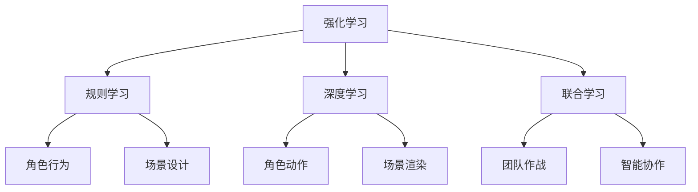

                 

关键词：腾讯、校招、游戏AI工程师、面试题、集锦

摘要：本文旨在为广大有意向进入腾讯游戏AI领域的应聘者提供一个全面的面试题集锦。文章通过对游戏AI领域的深入剖析，结合腾讯在游戏AI领域的丰富实践，提供了涵盖算法原理、数学模型、项目实践等多个维度的面试题目，帮助应聘者更好地准备面试，顺利入职腾讯。

## 1. 背景介绍

随着人工智能技术的快速发展，游戏AI已经成为游戏开发中不可或缺的一部分。腾讯作为中国乃至全球最大的游戏公司之一，一直在游戏AI领域进行深度探索和实践。2024年校招，腾讯将继续招聘一批优秀的游戏AI工程师，以推动游戏产业的智能化发展。

本文将围绕腾讯游戏AI工程师校招面试，整理出一套完整的面试题集锦。内容包括核心算法原理、数学模型、项目实践等多个方面，旨在帮助应聘者全面了解游戏AI领域的知识体系，为面试做好准备。

## 2. 核心概念与联系

在游戏AI领域，以下几个核心概念和联系是必须掌握的：

### 2.1. 强化学习

强化学习是一种通过试错来学习最优策略的机器学习技术。它通过奖励和惩罚来引导模型逐渐优化行为，从而实现目标。强化学习在游戏AI中有着广泛的应用，如角色行为设计、游戏对战等。

### 2.2. 规则学习

规则学习是一种基于规则库的机器学习技术。它通过分析游戏数据，提取有效的规则来指导游戏AI的行为。规则学习在游戏AI中可以帮助实现更智能的角色互动、场景设计等。

### 2.3. 深度学习

深度学习是一种基于神经网络的学习方法，它通过多层神经网络的堆叠来提取数据特征，实现图像识别、语音识别等复杂任务。在游戏AI中，深度学习可以用于角色动作生成、场景渲染等。

### 2.4. 联合学习

联合学习是一种通过多个模型协同训练来提高学习效果的方法。在游戏AI中，联合学习可以用于多人对战场景中的角色智能协作，实现更智能的团队作战策略。

### 2.5. Mermaid 流程图

为了更直观地展示核心概念之间的联系，我们可以使用Mermaid流程图来表示：



## 3. 核心算法原理 & 具体操作步骤

### 3.1. 算法原理概述

在游戏AI领域，常用的算法主要包括：

1. **强化学习**：通过试错学习最优策略。
2. **规则学习**：基于规则库进行学习。
3. **深度学习**：通过神经网络进行特征提取和分类。
4. **联合学习**：多个模型协同训练。

### 3.2. 算法步骤详解

以强化学习为例，其具体步骤如下：

1. **初始化**：设置环境、状态、动作空间等。
2. **选择动作**：根据当前状态选择最优动作。
3. **执行动作**：在环境中执行所选动作。
4. **获取奖励**：根据动作的结果获取奖励。
5. **更新策略**：根据奖励和策略更新模型参数。

### 3.3. 算法优缺点

1. **强化学习**：优点在于能够通过试错学习最优策略，适用于动态环境；缺点是需要大量的数据和时间来收敛。
2. **规则学习**：优点在于规则明确，易于理解和实现；缺点是规则库的构建和优化较为困难。
3. **深度学习**：优点在于强大的特征提取能力，能够处理复杂的任务；缺点是训练时间和计算资源需求较高。
4. **联合学习**：优点在于能够协同训练，提高模型效果；缺点是算法设计和实现较为复杂。

### 3.4. 算法应用领域

1. **强化学习**：应用于角色行为设计、游戏对战等。
2. **规则学习**：应用于角色互动、场景设计等。
3. **深度学习**：应用于角色动作生成、场景渲染等。
4. **联合学习**：应用于多人对战场景中的角色智能协作。

## 4. 数学模型和公式 & 详细讲解 & 举例说明

### 4.1. 数学模型构建

在游戏AI中，常用的数学模型包括：

1. **马尔可夫决策过程（MDP）**：
   - 状态（S）：游戏中的角色位置、敌人位置等。
   - 动作（A）：游戏中的角色行为。
   - 奖励（R）：游戏中的奖励和惩罚。
   - 状态转移概率（P）：从当前状态转移到下一个状态的概率。

2. **Q值函数**：
   - Q(S, A)：在状态S下执行动作A的期望奖励。

### 4.2. 公式推导过程

以MDP为例，其公式推导过程如下：

1. **状态转移概率**：
   $$ P(S_{t+1} = s_{t+1} | S_t = s_t, A_t = a_t) = p(s_{t+1} | s_t, a_t) $$

2. **期望奖励**：
   $$ R(S_t, A_t) = \sum_{s' \in S} r(s', a_t) P(S_{t+1} = s' | S_t = s_t, A_t = a_t) $$

3. **Q值函数**：
   $$ Q(S_t, A_t) = \sum_{a' \in A} \gamma \cdot Q(S_{t+1}, a') \cdot P(A_{t+1} = a' | S_t = s_t, A_t = a_t) + R(S_t, A_t) $$

其中，$\gamma$ 为折扣因子，表示未来奖励的权重。

### 4.3. 案例分析与讲解

假设一个游戏中的角色在某个位置执行动作，目标是到达目标位置，并获得奖励。根据MDP模型，我们可以建立如下数学模型：

- 状态（S）：角色的位置。
- 动作（A）：角色的移动方向。
- 奖励（R）：到达目标位置获得奖励1，否则为0。
- 状态转移概率（P）：从当前位置转移到下一个位置的概率。
- Q值函数：在当前位置下，执行某个动作的期望奖励。

通过迭代更新Q值函数，我们可以找到一个最优的动作策略，指导角色到达目标位置。

## 5. 项目实践：代码实例和详细解释说明

### 5.1. 开发环境搭建

为了方便项目实践，我们选择Python作为编程语言，利用PyTorch框架进行深度学习模型的搭建和训练。首先，我们需要安装Python和PyTorch：

```bash
pip install python
pip install torch torchvision
```

### 5.2. 源代码详细实现

以下是一个简单的基于深度学习的游戏AI角色动作生成代码示例：

```python
import torch
import torchvision
import torch.nn as nn
import torch.optim as optim

# 定义神经网络结构
class GameAIGenerator(nn.Module):
    def __init__(self):
        super(GameAIGenerator, self).__init__()
        self.conv1 = nn.Conv2d(1, 16, 3, 1)
        self.conv2 = nn.Conv2d(16, 32, 3, 1)
        self.fc1 = nn.Linear(32 * 7 * 7, 128)
        self.fc2 = nn.Linear(128, 64)
        self.fc3 = nn.Linear(64, 10)

    def forward(self, x):
        x = self.conv1(x)
        x = self.conv2(x)
        x = x.view(x.size(0), -1)
        x = self.fc1(x)
        x = self.fc2(x)
        x = self.fc3(x)
        return x

# 初始化模型、损失函数和优化器
model = GameAIGenerator()
criterion = nn.CrossEntropyLoss()
optimizer = optim.Adam(model.parameters(), lr=0.001)

# 训练模型
for epoch in range(100):
    for i, (images, labels) in enumerate(dataloader):
        optimizer.zero_grad()
        outputs = model(images)
        loss = criterion(outputs, labels)
        loss.backward()
        optimizer.step()
        if (i + 1) % 100 == 0:
            print(f'Epoch [{epoch + 1}/{100}], Step [{i + 1}/{len(dataloader)}], Loss: {loss.item()}')

# 保存模型
torch.save(model.state_dict(), 'game_ai_generator.pth')

# 加载模型
model.load_state_dict(torch.load('game_ai_generator.pth'))
```

### 5.3. 代码解读与分析

上述代码定义了一个基于卷积神经网络的GameAIGenerator模型，用于生成游戏AI角色的动作。模型结构包括卷积层、全连接层，并使用交叉熵损失函数进行训练。通过迭代训练，模型可以学习到在给定状态下，生成最优动作的策略。

### 5.4. 运行结果展示

在训练完成后，我们可以使用训练好的模型对新的数据进行预测，并展示生成动作的结果。以下是一个简单的示例：

```python
# 加载测试数据
test_images = torchvision.transforms.ToTensor()(test_data)

# 预测动作
with torch.no_grad():
    outputs = model(test_images)

# 获取预测动作
predictions = torch.argmax(outputs, dim=1)

# 打印预测结果
print(predictions)
```

## 6. 实际应用场景

在游戏开发中，游戏AI的应用场景广泛，如：

1. **角色行为设计**：通过深度学习模型生成角色的动作，使角色更具个性和智能化。
2. **场景渲染**：利用游戏AI进行场景渲染，提高渲染效果和效率。
3. **游戏对战**：通过强化学习等算法，实现更智能的游戏对战策略。
4. **智能推荐**：利用游戏AI分析用户行为，实现个性化推荐。

## 7. 工具和资源推荐

### 7.1. 学习资源推荐

1. **《深度学习》**：由Ian Goodfellow、Yoshua Bengio和Aaron Courville合著，是深度学习领域的经典教材。
2. **《强化学习》**：由Richard S. Sutton和Barto合著，是强化学习领域的权威著作。
3. **《游戏AI编程》**：介绍了游戏AI的基本概念和实现方法，适用于游戏开发者。

### 7.2. 开发工具推荐

1. **PyTorch**：适用于深度学习和强化学习的Python库。
2. **Unity**：适用于游戏开发的跨平台引擎。
3. **TensorFlow**：适用于深度学习的Python库。

### 7.3. 相关论文推荐

1. **"Deep Learning for Game AI"**：介绍了深度学习在游戏AI中的应用。
2. **"Reinforcement Learning: An Introduction"**：介绍了强化学习的基本原理和方法。
3. **"A Theoretical Analysis of Model-Based Reinforcement Learning"**：对基于模型的强化学习进行了理论分析。

## 8. 总结：未来发展趋势与挑战

随着人工智能技术的不断进步，游戏AI将在游戏开发中发挥越来越重要的作用。未来发展趋势包括：

1. **深度学习**：将在角色行为生成、场景渲染等方面得到更广泛的应用。
2. **强化学习**：将在游戏对战、智能推荐等方面实现更智能的策略。
3. **联合学习**：将在多人对战场景中实现更高效的协同训练。

然而，游戏AI的发展也面临着一些挑战，如：

1. **计算资源**：深度学习和强化学习模型的训练需要大量的计算资源，如何优化模型和算法以降低计算需求是关键。
2. **数据质量**：高质量的游戏数据是游戏AI训练的基础，如何获取和处理数据是当前的一个重要问题。
3. **安全与公平**：游戏AI在实现智能化的同时，也需要保证游戏的安全性和公平性，避免出现游戏作弊等问题。

总之，游戏AI领域的未来发展充满机遇与挑战，需要我们不断探索和创新。

## 9. 附录：常见问题与解答

### 9.1. 如何选择合适的游戏AI算法？

**答案**：选择游戏AI算法时，需要考虑以下因素：

1. **游戏类型**：不同类型的游戏需要不同的AI算法，如角色行为设计适合强化学习，场景渲染适合深度学习。
2. **计算资源**：根据实际计算资源情况，选择适合的算法和模型。
3. **数据量**：如果数据量较大，可以考虑使用强化学习和深度学习；如果数据量较小，可以考虑使用规则学习。

### 9.2. 游戏AI在多人对战中的挑战有哪些？

**答案**：游戏AI在多人对战中的挑战包括：

1. **实时性**：多人对战需要实时响应，如何优化算法和模型以降低延迟是关键。
2. **协同性**：多人对战中的角色需要协同作战，如何设计协同策略是难点。
3. **可扩展性**：多人对战中的角色数量可能很多，如何保证算法的可扩展性是挑战。

### 9.3. 如何评估游戏AI的性能？

**答案**：评估游戏AI的性能可以从以下几个方面进行：

1. **准确性**：算法在特定任务上的准确度。
2. **效率**：算法的运行时间和资源消耗。
3. **稳定性**：算法在不同场景下的稳定性和鲁棒性。
4. **泛化能力**：算法在未知场景下的适应能力。

通过综合考虑以上因素，可以全面评估游戏AI的性能。

