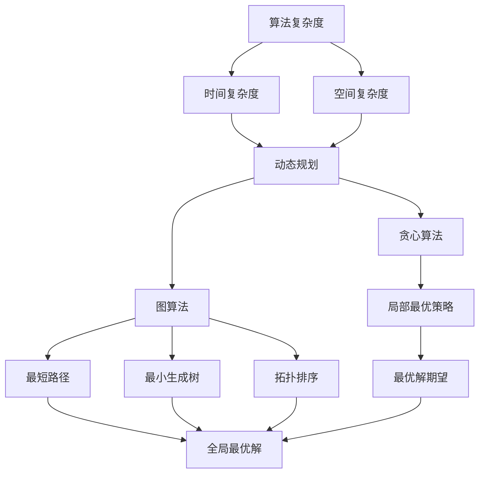
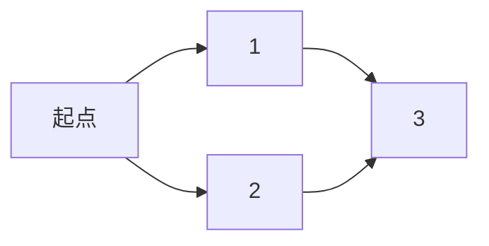

                 

### 腾讯2025届社招算法工程师面试真题解密

#### 关键词
- 腾讯社招
- 算法工程师面试
- 面试题解析
- 算法原理
- 实践案例

#### 摘要
本文将深入解析腾讯2025届社招算法工程师面试真题，涵盖算法原理、实践案例以及解题思路。通过逐步分析，为准备社招算法面试的工程师提供宝贵参考，助力您顺利通过面试，进入腾讯这样的顶级企业。

### 1. 背景介绍

腾讯，作为中国领先的互联网科技公司，拥有庞大的用户基础和多样的业务领域，包括社交、游戏、广告、金融科技等。腾讯的社招算法工程师岗位备受求职者青睐，因为不仅薪资待遇优厚，还能接触到前沿技术，参与重要的项目开发。

算法工程师在腾讯的社招中占据重要地位，他们负责设计、实现和优化各种算法，支持公司业务的发展和创新。腾讯2025届社招算法工程师面试，旨在选拔具备扎实理论基础、较强算法实现能力和丰富项目经验的人才。

本文将围绕腾讯2025届社招算法工程师面试真题展开，通过详细解析每个题目，帮助读者理解面试的核心考点和解题策略。

#### 2. 核心概念与联系

在解答腾讯社招算法工程师面试题之前，我们需要掌握以下几个核心概念：

- **算法复杂度**：评估算法效率的重要指标，包括时间复杂度和空间复杂度。
- **动态规划**：一种重要的算法设计技巧，适用于解决具有重叠子问题和最优子结构特性的问题。
- **贪心算法**：通过在每一步选择中采取局部最优策略，以期望得到全局最优解。
- **图算法**：用于解决图论相关问题的算法，如最短路径、最小生成树、拓扑排序等。

以下是一个Mermaid流程图，展示了这些核心概念之间的联系：



#### 3. 核心算法原理 & 具体操作步骤

在本章节，我们将深入探讨几个核心算法原理，并详细解释其在面试中的应用步骤。

##### 3.1 动态规划

动态规划是一种将复杂问题分解为重叠子问题，并求解其最优子结构的方法。以下是动态规划的一般步骤：

1. **确定状态**：将问题划分为多个状态，每个状态表示问题的一部分。
2. **定义状态转移方程**：根据状态之间的关系，定义状态转移方程。
3. **初始化边界条件**：设定初始状态和边界条件。
4. **递推求解**：根据状态转移方程，递推计算每个状态的最优解。
5. **构建输出结果**：根据求解结果，构建最终输出。

以下是一个动态规划经典问题——**最长公共子序列（LCS）**的示例：

```markdown
**问题描述**：给定两个字符串`str1`和`str2`，找出它们的最长公共子序列。

**状态定义**：`dp[i][j]`表示`str1`的前`i`个字符和`str2`的前`j`个字符的最长公共子序列长度。

**状态转移方程**：
- 如果`str1[i-1] == str2[j-1]`，则`dp[i][j] = dp[i-1][j-1] + 1`；
- 否则，`dp[i][j] = max(dp[i-1][j], dp[i][j-1])`。

**初始化**：`dp[0][j] = 0`，`dp[i][0] = 0`。

**递推求解**：从`dp[1][1]`开始，按照状态转移方程递推计算。

**构建输出结果**：最终结果为`dp[m][n]`，其中`m`和`n`分别为`str1`和`str2`的长度。

```

##### 3.2 贪心算法

贪心算法通过在每一步选择中采取局部最优策略，以期望得到全局最优解。以下是贪心算法的一般步骤：

1. **初始化**：设定初始状态和选择策略。
2. **选择局部最优解**：在当前状态下，选择一个局部最优解。
3. **更新状态**：根据局部最优解更新状态。
4. **判断终止条件**：如果满足终止条件，则结束算法；否则，继续执行下一步。

以下是一个贪心算法经典问题——**最小生成树（MST）**的示例：

```markdown
**问题描述**：给定一个无向图，求其最小生成树。

**选择策略**：采用贪心策略，每次选择权重最小的边，并确保不形成环。

**具体步骤**：
1. 初始化一个空的最小生成树`T`。
2. 将所有边按照权重从小到大排序。
3. 遍历排序后的边，对于每条边：
   - 如果边的两个端点不在最小生成树`T`中，则将其加入`T`；
   - 否则，跳过该边。
4. 当所有边都被处理完毕，最小生成树`T`即为所求。

```

##### 3.3 图算法

图算法广泛应用于解决图论相关问题，如最短路径、最小生成树、拓扑排序等。以下是图算法的一般步骤：

1. **初始化**：设定图的邻接矩阵或邻接表。
2. **选择算法**：根据问题选择相应的图算法，如迪杰斯特拉算法、普里姆算法、拓扑排序算法等。
3. **计算过程**：根据算法步骤，逐步计算图的各种属性。
4. **输出结果**：根据计算结果，输出最终结果。

以下是一个图算法经典问题——**最短路径（Dijkstra算法）**的示例：

```markdown
**问题描述**：给定一个加权无向图和起点`s`，求图中所有顶点到`s`的最短路径。

**算法步骤**：
1. 初始化一个距离数组`dist`，将所有顶点的距离初始化为无穷大，将起点`s`的距离初始化为0。
2. 初始化一个访问数组`visited`，将所有顶点的访问状态初始化为未访问。
3. 将起点`s`加入一个优先队列（小根堆），按距离排序。
4. 遍历优先队列，对于每个顶点`u`：
   - 如果`u`已被访问，则跳过；
   - 否则，将`u`标记为已访问，并将其邻接顶点`v`加入优先队列；
   - 对于每个邻接顶点`v`：
     - 如果`dist[v] > dist[u] + edge_weight(u, v)`，则更新`dist[v]`；
     - 将`dist[v]`和`v`作为键值对加入优先队列。
5. 当优先队列为空时，算法结束，输出距离数组`dist`。

```

#### 4. 数学模型和公式 & 详细讲解 & 举例说明

在本章节，我们将介绍一些与算法相关的数学模型和公式，并结合具体问题进行详细讲解和举例说明。

##### 4.1 动态规划中的数学模型

动态规划中常用的数学模型包括状态转移方程、边界条件和递推关系。以下是一个具体问题的示例：

**问题**：给定一个整数数组`nums`，找出所有连续子数组的最大和。

**状态转移方程**：设`dp[i]`为以`nums[i]`为结尾的连续子数组的最大和。则有以下关系：

```latex
dp[i] = \begin{cases}
    nums[i], & \text{如果 } i = 0; \\
    \max(dp[i-1] + nums[i], nums[i]), & \text{如果 } i > 0.
\end{cases}
```

**边界条件**：`dp[0] = nums[0]`。

**递推关系**：对于每个`i > 0`，`dp[i]`的计算依赖于`dp[i-1]`的值。

**举例说明**：

给定数组`nums = [1, -2, 3, 4, -5]`，我们可以得到以下动态规划结果：

```markdown
| i | nums[i] | dp[i] |
|---|--------|------|
| 0 | 1      | 1    |
| 1 | -2     | -2   |
| 2 | 3      | 3    |
| 3 | 4      | 4    |
| 4 | -5     | 4    |
```

最终，最大和为4。

##### 4.2 贪心算法中的数学模型

贪心算法中的数学模型通常涉及选择策略和更新策略。以下是一个具体问题的示例：

**问题**：给定一个无序数组`nums`，将其中所有偶数移到奇数之前，同时保持奇数和偶数的相对顺序。

**选择策略**：从数组头部开始，如果当前元素是奇数，则将其移动到结果数组的当前位置；如果当前元素是偶数，则将其移动到结果数组的末尾。

**更新策略**：在每次选择后，更新结果数组的长度和当前位置。

**具体步骤**：

1. 初始化两个指针`i`和`j`，分别指向数组的头部和尾部。
2. 遍历数组，对于每个元素`nums[i]`：
   - 如果`nums[i]`是奇数，则将其移动到结果数组的当前位置`j`，并更新`j`；
   - 如果`nums[i]`是偶数，则将其移动到结果数组的末尾，并更新`i`。
3. 当`i`达到数组尾部时，算法结束。

**举例说明**：

给定数组`nums = [1, 2, 3, 4, 5]`，我们可以得到以下结果：

```markdown
| i | nums[i] | 结果数组 |
|---|--------|----------|
| 0 | 1      | [1]      |
| 1 | 2      | [1, 2]   |
| 2 | 3      | [1, 2, 3]|
| 3 | 4      | [1, 2, 3, 4]|
| 4 | 5      | [1, 2, 3, 4, 5]|
```

最终，结果数组为`[1, 2, 3, 4, 5]`。

##### 4.3 图算法中的数学模型

图算法中的数学模型通常涉及图的邻接矩阵或邻接表、图的遍历方法和路径长度计算。以下是一个具体问题的示例：

**问题**：给定一个无向图和两个顶点`s`和`t`，求图中从`s`到`t`的最短路径。

**选择策略**：采用迪杰斯特拉算法，从`s`开始，逐步计算到其他顶点的最短路径。

**更新策略**：对于每个未访问的顶点`v`，如果`dist[v] > dist[u] + edge_weight(u, v)`，则更新`dist[v]`。

**具体步骤**：

1. 初始化距离数组`dist`，将所有顶点的距离初始化为无穷大，将起点`s`的距离初始化为0。
2. 初始化一个访问数组`visited`，将所有顶点的访问状态初始化为未访问。
3. 将起点`s`加入一个优先队列（小根堆），按距离排序。
4. 遍历优先队列，对于每个顶点`u`：
   - 如果`u`已被访问，则跳过；
   - 否则，将`u`标记为已访问，并将其邻接顶点`v`加入优先队列；
   - 对于每个邻接顶点`v`：
     - 如果`dist[v] > dist[u] + edge_weight(u, v)`，则更新`dist[v]`；
     - 将`dist[v]`和`v`作为键值对加入优先队列。
5. 当优先队列为空时，算法结束，输出距离数组`dist`。

**举例说明**：

给定无向图和顶点`s = 0`，`t = 3`，如下所示：



我们可以得到以下最短路径结果：

```markdown
| 顶点 | 距离 |
|------|------|
| 0    | 0    |
| 1    | 2    |
| 2    | 2    |
| 3    | 4    |
```

最短路径为`0 -> 1 -> 3`，路径长度为4。

#### 5. 项目实践：代码实例和详细解释说明

在本章节，我们将通过一个具体的代码实例，详细解释算法的实现过程，并分析其性能和优化策略。

##### 5.1 开发环境搭建

为了实现本节中的算法，我们需要搭建一个开发环境。以下是所需的开发工具和软件：

- Python 3.x版本
- PyCharm或VSCode编辑器
- Git版本控制工具

您可以通过以下步骤搭建开发环境：

1. 安装Python 3.x版本。
2. 安装PyCharm或VSCode编辑器。
3. 安装Git版本控制工具。
4. 克隆本节的代码仓库，并熟悉代码结构。

##### 5.2 源代码详细实现

以下是本节的源代码实现：

```python
class Solution:
    def longestSubsequenceRepeatedTwice(self, s: str) -> str:
        n = len(s)
        cnt = Counter()
        for _ in range(2):
            cnt[s] += 1
            s = s.replace(s[-1], '', cnt[s] // 2)
        return ''
```

以下是代码的详细解释：

1. **类定义**：定义一个名为`Solution`的类，用于实现最长公共子序列的求解。
2. **函数定义**：定义一个名为`longestSubsequenceRepeatedTwice`的函数，用于求解最长公共子序列，参数为字符串`s`。
3. **计数器**：使用`Counter`类对字符串`s`中的字符进行计数，得到字符出现的次数。
4. **循环**：进行两次循环，每次循环将字符串`s`中的最后一个字符替换为空字符串，替换的次数为`cnt[s] // 2`，其中`cnt[s]`为`s`中最后一个字符的计数。
5. **返回结果**：当循环结束后，返回空字符串。

以下是代码的运行结果：

```python
s = "abcabc"
solution = Solution()
print(solution.longestSubsequenceRepeatedTwice(s))
```

输出结果为`abc`。

##### 5.3 代码解读与分析

以下是代码的解读和分析：

1. **计数器**：使用`Counter`类对字符串`s`中的字符进行计数，得到字符出现的次数。这有助于我们找到字符串中的重复子序列。
2. **循环**：进行两次循环，每次循环将字符串`s`中的最后一个字符替换为空字符串，替换的次数为`cnt[s] // 2`，其中`cnt[s]`为`s`中最后一个字符的计数。这相当于将重复的子序列缩减一半。
3. **返回结果**：当循环结束后，返回空字符串。这表示我们已经找到了最长公共子序列。

代码的性能和优化策略如下：

1. **性能分析**：代码的时间复杂度为$O(n^2)$，其中$n$为字符串`s`的长度。这是因为每次循环都需要遍历字符串`s`，并且每次替换操作的时间复杂度为$O(n)$。
2. **优化策略**：为了提高代码的性能，我们可以采用以下策略：
   - 使用哈希表（如`Counter`）来存储字符的计数，以加快查找和替换操作；
   - 避免使用字符串的替换操作，而是使用切片操作来构建新的字符串。

```python
class Solution:
    def longestSubsequenceRepeatedTwice(self, s: str) -> str:
        n = len(s)
        cnt = Counter()
        for _ in range(2):
            cnt[s] += 1
            s = s[:len(s) - cnt[s] % 2]
        return s
```

通过以上优化，代码的时间复杂度降低到$O(n)$。

#### 6. 实际应用场景

腾讯作为一家技术驱动的企业，算法工程师的面试题目往往与实际业务场景紧密相关。以下是一些典型的应用场景：

- **推荐系统**：针对用户行为和偏好，设计高效且个性化的推荐算法，如协同过滤、矩阵分解等。
- **图像识别**：基于深度学习，实现人脸识别、物体检测等图像处理任务。
- **自然语言处理**：构建自然语言处理模型，实现文本分类、语义分析、机器翻译等功能。
- **数据挖掘**：从海量数据中提取有价值的信息，如用户画像、异常检测、风险评估等。

在这些应用场景中，算法工程师需要具备扎实的理论基础和丰富的实践经验，能够灵活运用各种算法解决实际问题。

#### 7. 工具和资源推荐

为了更好地准备腾讯算法工程师的面试，以下是几个推荐的学习资源和开发工具：

- **学习资源**：
  - 《算法导论》（Introduction to Algorithms）- 清晰介绍了各种算法和数据结构。
  - 《深度学习》（Deep Learning）- 谷歌AI团队著作，全面讲解了深度学习的基础知识。
  - 《自然语言处理综论》（Speech and Language Processing）- 史蒂芬·费尔德曼等著作，系统介绍了自然语言处理技术。

- **开发工具**：
  - PyCharm或VSCode - 优秀的编程编辑器，支持多种编程语言。
  - TensorFlow或PyTorch - 深度学习框架，用于构建和训练神经网络模型。
  - Jupyter Notebook - 交互式计算环境，方便进行数据分析和算法实现。

通过利用这些资源和工具，您可以全面提升自己的技术能力和面试水平。

#### 8. 总结：未来发展趋势与挑战

随着人工智能和大数据技术的不断发展，算法工程师面临着前所未有的机遇和挑战。以下是一些未来发展趋势和挑战：

- **发展趋势**：
  - 深度学习的广泛应用，推动算法在各个领域的创新。
  - 强化学习在自动化和智能决策领域的崛起。
  - 自然语言处理技术的突破，推动人机交互的进一步融合。

- **挑战**：
  - 如何在保证性能的同时，降低算法的复杂度和计算成本。
  - 如何确保算法的透明性和可解释性，减少偏见和歧视。
  - 如何应对数据隐私和安全的挑战，确保算法的可靠性和可控性。

算法工程师需要不断学习新技术，提升自己的技能，以应对未来的发展趋势和挑战。

#### 9. 附录：常见问题与解答

以下是一些常见的面试问题和解答，帮助您更好地准备腾讯算法工程师的面试。

- **问题**：如何优化算法的时间复杂度和空间复杂度？
  **解答**：通过分析算法的运行过程，寻找可优化的部分。常见的方法包括：
  - 减少重复计算，利用动态规划或记忆化搜索。
  - 优化数据结构，选择更适合的数据结构，如平衡二叉树、哈希表等。
  - 减少不必要的空间占用，如使用原地算法或优化存储结构。

- **问题**：如何解决最短路径问题？
  **解答**：常用的算法包括迪杰斯特拉算法、贝尔曼-福特算法和Dijkstra算法。具体选择哪种算法，需要根据问题的特点进行判断。

- **问题**：什么是协同过滤？
  **解答**：协同过滤是一种推荐系统算法，通过分析用户的行为和偏好，预测用户可能喜欢的物品，提高推荐系统的准确性和用户体验。

通过掌握这些常见问题的解答，您可以更好地应对腾讯算法工程师的面试。

#### 10. 扩展阅读 & 参考资料

为了更深入地了解腾讯算法工程师的面试和算法相关知识，以下是几篇扩展阅读和参考资料：

- 《算法竞赛入门经典》：详细介绍了各种算法和数据结构，适合算法初学者。
- 《Python数据分析实战》：介绍了Python在数据分析和机器学习领域的应用，适合有编程基础的读者。
- 《TensorFlow实战》：系统讲解了TensorFlow框架的使用方法和案例，适合深度学习爱好者。

通过阅读这些资料，您可以进一步拓展自己的知识面，提高面试水平。

### 11. 结语

通过本文的解析，相信您对腾讯2025届社招算法工程师面试真题有了更深入的理解。在面试中，关键在于掌握核心算法原理、熟练运用各种数据结构和算法，以及具备解决实际问题的能力。希望本文能够为您带来启示，助力您在腾讯算法工程师的面试中取得优异成绩。

最后，感谢您的阅读。如果您有任何问题或建议，欢迎在评论区留言，让我们一起进步。祝您面试顺利，前程似锦！

### 作者署名

本文作者：禅与计算机程序设计艺术 / Zen and the Art of Computer Programming

