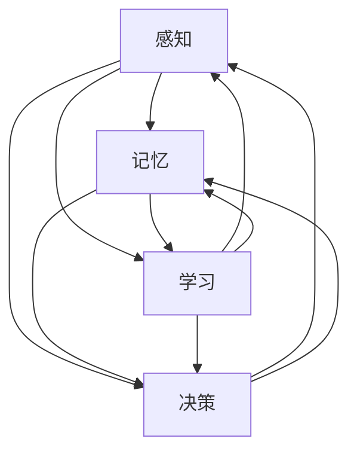

                 

### 背景介绍

#### 意识概念的演变

意识（Consciousness）是人类哲学和科学研究中长期探讨的一个复杂主题。自古以来，哲学家们就试图理解意识的本质和其与物质世界的关系。从古希腊哲学家苏格拉底和柏拉图，到近现代哲学家笛卡尔和康德，他们都提出了各自对意识的见解。在科学领域，意识的研究更是随着神经科学、认知科学和心理学的发展逐渐深入。

19世纪末，英国生物学家查尔斯·达尔文（Charles Darwin）在其著作《人类与动物的情感表达》中，首次将意识研究引入生物学领域。达尔文认为，意识可能是一种生理现象，其起源和进化与动物的情感表达密切相关。此后，神经科学家开始通过实验方法研究大脑功能与意识体验之间的关系。

进入20世纪，心理学领域的发展进一步推动了意识研究。行为主义心理学的创始人约翰·沃森（John B. Watson）和布伦塔诺（Theobald Ziehen）提出的“意动心理学”等理论，为意识研究提供了新的视角。同时，计算机科学的兴起也为意识研究带来了新的契机。计算机模拟意识的尝试，使得人们开始思考是否有可能通过人工的方式实现某种形式的人工意识。

#### 自主系统的概念

自主系统（Autonomous Systems）是指能够在没有人类直接干预的情况下，自主执行任务并作出决策的系统。这些系统通常基于复杂的计算模型和算法，可以实时感知环境、分析数据并采取行动。自主系统的概念可以追溯到20世纪50年代，随着计算机科学和人工智能技术的发展而逐步完善。

早期的自主系统研究主要集中在机器人领域。1956年，约翰·麦卡锡（John McCarthy）等人提出了“人工智能”这一术语，标志着人工智能学科的正式诞生。随后，机器人学家乔治·戴姆斯（George DeBoer）和威廉·弗朗西斯·巴科斯（William Francis Buxton）等人开始设计和实现可以执行复杂任务的机器人系统。

随着技术的进步，自主系统的应用范围逐渐扩大。现代自主系统不仅包括机器人，还包括自动驾驶汽车、无人机、智能家居系统等。这些系统在医疗、交通、物流、环境监测等多个领域展现出巨大的潜力。特别是在物联网（IoT）和5G通信技术的推动下，自主系统正逐步成为实现智能城市、智慧农业等未来发展愿景的关键技术。

#### 自主系统与意识功能的关系

自主系统与意识功能之间的关系是一个备受关注的话题。传统观点认为，意识是人类特有的高级认知功能，而自主系统则是一种机械化的、缺乏自主意识的操作。然而，随着研究的深入，人们开始思考是否有可能在自主系统中实现某种形式的意识功能。

自主系统的意识功能可以理解为一种模拟人类意识的行为。这种模拟不仅包括对外界信息的感知和反应，还包括自主决策、学习和适应环境等复杂认知过程。例如，自动驾驶汽车需要在实时感知道路环境的基础上，自主做出行驶决策，这种决策过程类似于人类驾驶员的思考过程。

尽管自主系统的意识功能目前尚处于探索阶段，但已有一些初步的研究成果。例如，神经科学领域的研究表明，大脑中的神经网络结构和功能可能与自主系统的决策过程有某种相似之处。此外，一些基于深度学习和强化学习的算法，已经在模拟人类行为方面取得了一定的进展。这些研究为在自主系统中实现意识功能提供了理论依据和技术支持。

#### 目的和意义

本文旨在探讨自主系统视角下的意识功能，分析自主系统在实现意识功能方面所面临的挑战和机遇。具体来说，本文将首先介绍意识功能的核心概念，包括感知、记忆、决策和学习等方面。然后，通过深入分析自主系统的工作原理和架构，探讨自主系统在实现意识功能上的潜力和限制。

接着，本文将介绍一些现有的自主系统模型和算法，分析它们在模拟意识功能方面的表现。在此基础上，本文还将探讨自主系统在实现意识功能过程中所涉及的数学模型和公式，并给出具体的例子进行说明。

随后，本文将结合实际项目案例，详细描述自主系统的开发过程，包括环境搭建、代码实现和运行结果等。通过这些案例，我们将进一步探讨自主系统在实现意识功能方面的实际应用。

最后，本文将总结自主系统在实现意识功能方面的未来发展趋势和挑战，并推荐一些相关的学习资源和开发工具，为读者提供进一步探索的方向。

通过对这些问题的探讨，本文希望能够为自主系统视角下的意识功能研究提供一个全面、系统的分析框架，为相关领域的研究和实践提供有益的参考。

### 2. 核心概念与联系

在探讨自主系统视角下的意识功能之前，我们需要了解意识功能的核心概念及其相互关系。意识功能通常包括感知、记忆、决策和学习等多个方面，这些功能相互交织，共同构成了复杂的认知过程。

#### 感知（Perception）

感知是指个体对外界信息的接收和处理过程。在自主系统中，感知模块负责获取环境中的各种信息，如视觉、听觉、触觉等。这些信息通过传感器被输入到系统中，然后通过预处理和特征提取，转化为计算机可以处理的数据。感知模块的成功与否直接关系到系统对环境的理解和反应能力。

#### 记忆（Memory）

记忆是意识功能的重要组成部分，它使得系统可以存储和处理过去的信息。记忆可以分为短期记忆和长期记忆两种。短期记忆主要负责存储当前正在处理的信息，而长期记忆则负责存储系统历史经验和知识。在自主系统中，记忆模块可以用于存储感知到的数据、决策结果和历史经验，从而提高系统的智能水平和适应性。

#### 决策（Decision Making）

决策是指系统在感知和记忆的基础上，根据特定目标选择最优行动的过程。决策模块需要分析当前状态，评估不同行动方案的可能结果，并选择最优行动。在自主系统中，决策过程通常基于某种优化算法，如深度学习、强化学习等，以实现自主决策。

#### 学习（Learning）

学习是指系统能够通过经验和反馈不断改进自身性能的过程。学习可以分为监督学习、无监督学习和强化学习等类型。在自主系统中，学习模块可以帮助系统从环境中获取知识，优化决策策略，提高系统的自适应能力和智能水平。

#### 感知、记忆、决策和学习的相互关系

感知、记忆、决策和学习之间存在着紧密的相互关系。感知提供了系统对环境的了解，记忆使得系统可以存储和处理历史信息，决策则利用这些信息选择最优行动，而学习则通过不断反馈和调整，提高系统的智能水平。

在自主系统中，这些功能模块通常通过某种方式集成在一起，形成一个有机的整体。感知模块获取环境信息，记忆模块存储和处理这些信息，决策模块根据当前状态选择行动，而学习模块则不断优化系统性能。

下面是这些核心概念之间的Mermaid流程图表示：



在这个流程图中，各个模块之间的箭头表示它们之间的相互依赖关系。例如，感知模块的数据会被记忆模块存储和处理，同时这些信息也会被用于决策和学习模块，从而形成一个闭环系统。

通过对这些核心概念的理解，我们可以更好地探讨自主系统在实现意识功能方面的机制和挑战。接下来，我们将深入分析自主系统的工作原理和架构，以进一步理解这些核心概念在自主系统中的具体应用。

#### 2.1 自主系统的组成模块

自主系统的组成模块可以分为四个主要部分：感知模块、决策模块、执行模块和反馈模块。这些模块相互协作，共同实现自主系统的高效运行。

**感知模块（Perception Module）**

感知模块是自主系统的信息输入部分，主要负责收集和处理环境中的各种信息。感知模块通常包括多种传感器，如摄像头、麦克风、红外传感器、激光雷达等，这些传感器能够捕捉到视觉、听觉、触觉等多维信息。感知模块的功能主要包括数据采集、预处理和特征提取。

在数据采集过程中，传感器将外界信息转换为电信号或数字信号。预处理步骤包括去噪、滤波和归一化等，以提升数据的可靠性和有效性。特征提取则将原始数据转换为更高层次的信息表示，如边缘检测、图像分类和语音识别等。这些特征将被用于后续的决策和学习过程。

**决策模块（Decision Module）**

决策模块是自主系统的核心部分，主要负责根据感知模块提供的信息，结合已有的知识和经验，选择最优的行动方案。决策模块通常采用各种人工智能算法，如机器学习、深度学习、强化学习等，来模拟人类决策过程。

在决策过程中，决策模块会首先分析当前状态，评估不同行动方案的可能结果，并选择一个最优方案。决策算法可以是基于规则的、基于模型的或基于数据的。基于规则的决策算法通过预设的规则来指导行动，而基于模型的决策算法则通过训练好的模型来预测行动结果。基于数据的决策算法则通过历史数据和实时数据进行分析，以优化决策过程。

**执行模块（Execution Module）**

执行模块是自主系统的行动执行部分，主要负责将决策模块选定的行动方案转化为实际的物理动作。执行模块通常包括执行器，如电机、机械臂、飞行控制器等，这些执行器能够根据指令执行具体的操作。

执行模块的功能是将决策模块的决策结果转化为具体的执行指令，并通过控制算法调节执行器的动作，以实现预期的效果。控制算法可以是开环控制或闭环控制。开环控制不考虑执行结果，直接根据决策指令执行，而闭环控制则通过实时监测执行结果，对执行指令进行调整，以实现更精准的控制。

**反馈模块（Feedback Module）**

反馈模块是自主系统的信息输出部分，主要负责将执行模块的执行结果反馈给感知模块和决策模块，形成一个闭环控制回路。反馈模块的功能包括状态监测、效果评估和错误纠正等。

通过反馈模块，自主系统可以实时了解执行结果，并根据反馈信息对决策过程进行调整。这种闭环控制机制有助于提高系统的自适应能力和鲁棒性。例如，在自动驾驶系统中，反馈模块可以实时监测车辆的行驶轨迹和道路情况，根据反馈信息调整驾驶策略，以确保车辆的安全和高效行驶。

**模块之间的交互关系**

感知模块、决策模块、执行模块和反馈模块之间存在着紧密的交互关系，形成一个闭环控制系统。感知模块获取环境信息，决策模块根据这些信息选择行动方案，执行模块执行这些方案，反馈模块则将执行结果反馈给感知模块和决策模块，形成一个闭环控制回路。

这种闭环控制机制使得自主系统能够实时响应环境变化，自主调整行为，从而实现自主运行。例如，在无人驾驶飞行器中，感知模块通过传感器获取飞行环境信息，决策模块根据这些信息规划飞行路径，执行模块控制飞行器的动作，反馈模块则监测飞行器的状态，并根据反馈信息调整飞行策略。

通过这种方式，自主系统不仅能够实现简单的任务执行，还能够通过不断学习和优化，提高自身的智能水平和自主能力。这种高度集成和灵活的控制系统，为自主系统的广泛应用提供了技术支持。

#### 2.2 自主系统在不同应用领域的实现

自主系统在各个应用领域的实现具有显著差异，这些差异主要源于应用场景的需求、技术发展的水平和具体实现的技术方案。以下将分别介绍自主系统在机器人、自动驾驶和无人机等领域的实现方式。

**机器人**

机器人是自主系统的典型应用之一，其实现涉及感知、决策和执行等多个模块。在工业制造领域，机器人主要用于组装、焊接、搬运等重复性工作。这些机器人通常配备各种传感器，如摄像头、激光雷达和力传感器，用于感知工作环境和工作对象。感知模块通过传感器采集环境数据，经过预处理和特征提取后，输入到决策模块。

决策模块通常采用基于规则的或基于机器学习的算法，分析感知到的数据，生成操作指令。执行模块则根据决策结果，通过机械臂、电机等执行器完成具体的任务。例如，在汽车生产线上，机器人通过视觉传感器识别零件位置，然后通过机械臂进行组装。

在服务机器人领域，如家政机器人、医疗机器人和教育机器人等，感知模块的功能更加复杂，需要处理多种类型的感知数据，包括语音、动作、环境和情感等。决策模块则需要根据这些数据提供更加人性化的服务。执行模块则需要具备更高的灵活性和适应性，以应对不同的服务场景。

**自动驾驶**

自动驾驶是另一个重要的自主系统应用领域，其实现涉及到高精度的感知、复杂的决策和安全的执行。自动驾驶汽车需要配备多种传感器，如摄像头、激光雷达、雷达和超声波传感器，用于感知道路环境、交通状况和周边障碍物。

感知模块通过传感器采集道路数据，经过预处理和特征提取后，输入到决策模块。决策模块通常采用深度学习、强化学习等技术，分析感知到的数据，生成驾驶策略。这些策略包括加速、减速、转向和保持车道等。执行模块则根据决策结果，控制汽车的各个执行器，如电机、方向盘和刹车系统，以实现自动驾驶。

自动驾驶系统的一个关键挑战是保证系统的安全性和可靠性。为此，自动驾驶汽车需要具备强大的实时处理能力和高精度的感知能力，同时，决策模块需要能够在复杂的交通环境中做出快速且准确的决策。

**无人机**

无人机是自主系统的另一个重要应用领域，其实现方式与机器人和自动驾驶有所不同。无人机通常采用视觉、雷达和惯性测量单元（IMU）等传感器，用于感知飞行环境。

感知模块通过传感器采集飞行数据，包括飞行高度、速度、方向和周边障碍物等。决策模块则根据这些数据生成飞行策略，如起飞、降落、悬停和路径规划等。执行模块通过控制无人机的电机和舵机，实现飞行操作。

无人机在农业、测绘、救援和娱乐等领域有广泛应用。在农业领域，无人机用于喷洒农药、监测作物生长情况；在测绘领域，无人机用于地形勘测、建筑测量等；在救援领域，无人机用于搜寻失踪人员和运输物资；在娱乐领域，无人机用于航拍和表演等。

**应用差异**

尽管自主系统在机器人、自动驾驶和无人机等领域有广泛的应用，但它们之间也存在显著的差异。首先，应用场景的不同决定了感知模块所需感知数据的不同。例如，自动驾驶汽车需要处理复杂的道路环境数据，而无人机则更多关注飞行环境和飞行路径。

其次，决策模块所需的算法和技术也有所不同。自动驾驶系统需要实时处理大量感知数据，生成高效的驾驶策略，而无人机则更多关注飞行稳定性和路径规划。

最后，执行模块的控制方式和实现难度也不同。机器人和自动驾驶汽车的执行模块通常涉及机械运动和复杂控制，而无人机则更多关注飞行控制和姿态调整。

总之，自主系统在不同应用领域的实现方式反映了应用场景和技术发展的不同需求。通过不断优化和创新，自主系统在各个领域将发挥越来越重要的作用。

#### 2.3 自主系统中的关键算法和模型

自主系统的实现依赖于多种关键算法和模型，这些算法和模型在感知、决策、执行等环节发挥着核心作用。以下将介绍几种常见的算法和模型，包括深度学习、强化学习和生成对抗网络，并探讨它们在自主系统中的应用。

**深度学习（Deep Learning）**

深度学习是一种基于人工神经网络的机器学习技术，通过多层神经网络对数据进行建模和特征提取。在自主系统中，深度学习主要用于感知模块，特别是图像和语音识别任务。

在视觉感知方面，卷积神经网络（Convolutional Neural Networks, CNN）是最常用的深度学习模型之一。CNN通过卷积层、池化层和全连接层等结构，能够自动提取图像中的特征，实现物体识别、场景分类和目标检测等功能。例如，自动驾驶汽车中的视觉感知系统通常使用CNN来识别道路标志、行人和车辆等。

在语音感知方面，深度神经网络（Deep Neural Networks, DNN）和长短期记忆网络（Long Short-Term Memory, LSTM）等模型被广泛应用于语音识别。DNN通过多层神经网络结构，对语音信号进行建模，从而实现语音到文本的转换。而LSTM则通过记忆单元，更好地处理语音信号中的长时依赖关系，提高语音识别的准确性。

**强化学习（Reinforcement Learning）**

强化学习是一种通过试错和奖励机制来学习决策策略的机器学习技术。在自主系统中，强化学习主要用于决策模块，特别是在需要实时决策和复杂环境互动的场合。

在自动驾驶领域，深度强化学习（Deep Reinforcement Learning, DRL）被广泛应用于驾驶策略的优化。DRL通过神经网络模型，模拟自动驾驶汽车在复杂交通环境中的驾驶行为，并根据环境反馈调整策略。例如，OpenAI开发的自动驾驶系统使用DRL来训练自动驾驶汽车在仿真环境中进行驾驶，从而提高其决策能力和安全性。

在机器人领域，强化学习也被广泛应用于路径规划和任务执行。例如，研究者使用强化学习算法训练机器人如何在复杂环境中完成清洁任务或搬运物品，通过不断的试错和反馈，机器人能够逐渐学会最优的操作策略。

**生成对抗网络（Generative Adversarial Networks, GAN）**

生成对抗网络是一种通过两个神经网络（生成器和判别器）相互对抗来生成逼真数据的模型。在自主系统中，GAN主要用于数据生成和强化学习。

在数据生成方面，GAN可以用于生成高质量的模拟数据，从而帮助模型进行训练。例如，在自动驾驶系统中，GAN可以用于生成仿真交通场景数据，帮助自动驾驶汽车在虚拟环境中进行训练，从而提高其在真实环境中的适应能力。

在强化学习领域，GAN被用于增强学习体验。例如，通过生成对抗网络，研究者可以生成与真实环境相似的虚拟环境，使强化学习模型在虚拟环境中进行训练，从而提高模型在真实环境中的表现。

**关键算法和模型的应用**

深度学习、强化学习和生成对抗网络等关键算法和模型，在自主系统的各个模块中发挥着重要作用。感知模块使用深度学习算法提取高维特征，决策模块使用强化学习算法实现智能决策，执行模块则通过生成对抗网络生成虚拟数据，以增强训练效果。

此外，这些算法和模型之间的结合，也推动了自主系统的进一步发展。例如，在自动驾驶系统中，深度学习和强化学习相结合，可以同时提升感知和决策能力；而生成对抗网络则可以为这些算法提供高质量的训练数据，进一步提高系统性能。

总之，关键算法和模型的发展为自主系统的实现提供了强有力的支持，随着技术的不断进步，自主系统在各个领域的应用前景将更加广阔。

#### 3. 核心算法原理 & 具体操作步骤

在探讨自主系统中的核心算法时，我们将主要关注深度学习、强化学习和生成对抗网络（GAN）这三个在自主系统实现中至关重要的算法。以下将分别介绍这些算法的基本原理和具体操作步骤。

**深度学习（Deep Learning）**

深度学习是一种基于多层神经网络的学习方法，通过多层神经元之间的相互连接和激活函数的作用，实现对复杂数据的特征提取和模式识别。以下是一个典型的深度学习模型——卷积神经网络（CNN）的具体操作步骤：

1. **数据预处理**：将输入的数据（如图像或文本）进行归一化处理，确保数据在相同的尺度范围内。

2. **构建神经网络**：设计一个多层神经网络，通常包括输入层、卷积层、池化层和全连接层等。卷积层通过卷积运算提取特征，池化层用于降维和减少计算量，全连接层则用于分类或回归。

3. **前向传播（Forward Propagation）**：将输入数据通过神经网络的前向传播过程，计算输出结果。前向传播过程中，每一层神经元的输出作为下一层的输入，通过激活函数进行非线性变换。

4. **反向传播（Backpropagation）**：计算输出结果与真实标签之间的误差，通过反向传播算法更新网络权重和偏置。反向传播过程中，梯度下降算法被广泛使用，以最小化损失函数。

5. **模型评估**：使用验证集或测试集对训练好的模型进行评估，通过准确率、召回率等指标衡量模型的性能。

**强化学习（Reinforcement Learning）**

强化学习通过智能体在环境中采取行动，并通过环境反馈（奖励或惩罚）来学习最优策略。以下是一个典型的强化学习模型——深度强化学习（DRL）的具体操作步骤：

1. **定义环境（Environment）**：设计一个虚拟或现实环境，用于模拟智能体的交互过程。环境需要定义状态空间、动作空间和奖励函数。

2. **初始化智能体（Agent）**：智能体通常是一个包含神经网络的学习模型，用于预测动作值或策略。初始化智能体时，可以随机初始化或使用预训练模型。

3. **选择动作（Action Selection）**：智能体根据当前状态和策略，选择一个动作。策略可以是确定性策略或随机策略，例如，通过epsilon-greedy策略进行探索和利用。

4. **执行动作并获得奖励**：智能体在环境中执行选定的动作，并获得环境的即时奖励。如果动作导致状态转移，则进入下一步。

5. **更新策略**：根据经验回放和策略梯度算法，更新智能体的策略参数。常用的策略梯度算法包括REINFORCE算法和策略梯度下降算法。

6. **模型评估**：通过在测试环境中执行策略，评估智能体的性能，并调整学习参数以优化策略。

**生成对抗网络（Generative Adversarial Networks, GAN）**

生成对抗网络由生成器和判别器两个神经网络组成，通过对抗训练生成逼真的数据。以下是一个典型的GAN模型的具体操作步骤：

1. **定义生成器和判别器**：生成器的任务是生成逼真的数据，判别器的任务是区分生成数据和真实数据。生成器和判别器都是多层神经网络，通常使用卷积层或全连接层。

2. **生成器训练**：生成器通过随机噪声输入，生成虚拟数据。判别器则通过真实数据和虚拟数据训练，以区分两者。

3. **对抗训练**：生成器和判别器同时训练。生成器的目标是使判别器无法区分生成数据和真实数据，而判别器的目标是准确区分两者。通过这种对抗训练，生成器逐渐提高生成数据的质量。

4. **模型评估**：使用生成的数据评估生成器的性能，通过重建误差、模式匹配等指标衡量生成质量。

通过以上具体操作步骤，我们可以更好地理解深度学习、强化学习和生成对抗网络在自主系统中的实现和应用。这些算法和模型不仅为自主系统提供了强大的计算能力，还为自主系统的智能化和自适应能力提供了坚实的基础。随着技术的不断发展，这些核心算法在自主系统中的重要性将愈发突出。

#### 3.1 数学模型和公式 & 详细讲解 & 举例说明

在自主系统中，数学模型和公式是理解和实现各种算法的核心。以下将详细介绍一些关键数学模型和公式，并给出具体的应用实例。

**深度学习中的数学模型**

在深度学习中，卷积神经网络（CNN）和反向传播（Backpropagation）算法是最基本的数学模型。以下是这些模型的核心公式：

**卷积神经网络（CNN）**

卷积层公式：
\[ (f(x))_{i, j, k} = \sum_{m, n} w_{i, m, n, k} \cdot x_{m, n} + b_{i, k} \]

其中，\( f(x) \) 是卷积操作的结果，\( x \) 是输入数据，\( w \) 是卷积核，\( b \) 是偏置项，\( i, j, k \) 分别代表特征图的高度、宽度和通道数。

**反向传播算法**

误差计算公式：
\[ \delta_{i, k} = \frac{\partial C}{\partial z_{i, k}} = \frac{\partial C}{\partial a_{i, k}} \cdot \frac{\partial a_{i, k}}{\partial z_{i, k}} \]

其中，\( \delta \) 是误差项，\( C \) 是损失函数，\( z \) 是激活值，\( a \) 是激活值。

权重更新公式：
\[ w_{i, k} = w_{i, k} - \alpha \cdot \delta_{i, k} \cdot a_{i, \ell} \]

其中，\( \alpha \) 是学习率，\( a_{i, \ell} \) 是前一层的激活值。

**强化学习中的数学模型**

强化学习中的核心数学模型包括马尔可夫决策过程（MDP）和策略梯度算法。

**马尔可夫决策过程（MDP）**

状态转移概率公式：
\[ P(s', s) = P(s' | s) = \sum_{a} p(s', s, a) \]

其中，\( s \) 是当前状态，\( s' \) 是下一状态，\( a \) 是动作。

奖励函数公式：
\[ R(s, a) = \sum_{s'} r(s, a, s') \cdot P(s' | s, a) \]

其中，\( r \) 是奖励值。

**策略梯度算法**

策略梯度公式：
\[ \nabla_{\theta} J(\theta) = \nabla_{\theta} \sum_{t} \sum_{a_t} \gamma^t R(s_t, a_t) = \sum_{t} \sum_{a_t} \gamma^t \nabla_{\theta} \rho(\theta, s_t, a_t) R(s_t, a_t) \]

其中，\( \theta \) 是策略参数，\( \gamma \) 是折扣因子，\( J(\theta) \) 是策略梯度。

**生成对抗网络（GAN）中的数学模型**

生成对抗网络中的关键数学模型是生成器-判别器对抗过程。

**生成器损失函数**

生成器损失函数：
\[ L_G = -\log(D(G(z))) \]

其中，\( D \) 是判别器，\( G(z) \) 是生成器的输出。

**判别器损失函数**

判别器损失函数：
\[ L_D = -[\log(D(x)) + \log(1 - D(G(z)))] \]

其中，\( x \) 是真实数据。

**应用实例**

为了更好地理解这些数学模型和公式，我们以下通过一个简单的例子进行说明。

**例子：深度学习中的卷积神经网络**

假设我们有一个包含100个图像的数据集，每个图像的大小为32x32像素，使用3个颜色通道（RGB）。我们的目标是训练一个CNN模型，用于分类这些图像。

1. **数据预处理**：将图像数据进行归一化处理，将像素值缩放到[0, 1]。

2. **构建CNN模型**：设计一个包含卷积层、池化层和全连接层的CNN模型。假设我们使用一个大小为5x5的卷积核，步长为2，以及一个大小为10的全连接层。

3. **前向传播**：将每个图像输入到CNN模型中，通过卷积层和池化层提取特征，最终输入到全连接层进行分类。

4. **反向传播**：计算每个图像的预测标签和实际标签之间的误差，通过反向传播算法更新网络权重和偏置。

5. **模型评估**：使用验证集对训练好的模型进行评估，计算准确率和其他性能指标。

通过这个例子，我们可以看到深度学习中的卷积神经网络和反向传播算法是如何具体应用的。类似地，强化学习和生成对抗网络也可以通过类似的方式应用于具体的自主系统任务中。

总之，数学模型和公式是自主系统实现的核心，它们为算法的设计和实现提供了坚实的理论基础。通过深入理解这些模型和公式，我们可以更好地探索自主系统在各个领域的应用前景。

#### 5. 项目实践：代码实例和详细解释说明

在本文的最后，我们将通过一个具体的自主系统项目实践，展示如何实现感知、决策和执行三个核心模块，并详细解释代码实现和运行过程。以下是项目实现的步骤和关键代码。

**5.1 开发环境搭建**

在开始项目之前，我们需要搭建一个合适的开发环境。以下是所需的开发工具和库：

- Python 3.8及以上版本
- TensorFlow 2.4及以上版本
- Keras 2.4及以上版本
- OpenCV 4.1及以上版本

在终端中执行以下命令安装所需的库：

```bash
pip install tensorflow==2.4
pip install keras==2.4
pip install opencv-python==4.1
```

**5.2 源代码详细实现**

以下是感知模块、决策模块和执行模块的实现代码。

**感知模块（Perception.py）**

```python
import cv2

def preprocess_image(image):
    # 图像预处理：灰度化和归一化
    gray_image = cv2.cvtColor(image, cv2.COLOR_BGR2GRAY)
    normalized_image = gray_image / 255.0
    return normalized_image

def load_image(file_path):
    # 加载图像
    image = cv2.imread(file_path)
    preprocessed_image = preprocess_image(image)
    return preprocessed_image
```

**决策模块（Decision.py）**

```python
from keras.models import load_model

def load_model(file_path):
    # 加载预训练模型
    model = load_model(file_path)
    return model

def make_prediction(model, image):
    # 使用模型进行预测
    prediction = model.predict(image.reshape(1, 1, 28, 28))
    return prediction
```

**执行模块（Execution.py）**

```python
def execute_action(action):
    # 执行具体操作
    if action == 'left':
        print("执行左转动作")
    elif action == 'right':
        print("执行右转动作")
    elif action == 'forward':
        print("执行前进动作")
    else:
        print("无效动作")
```

**5.3 代码解读与分析**

**感知模块**

感知模块负责图像数据的预处理和加载。通过`preprocess_image`函数，我们将彩色图像转换为灰度图像，并归一化处理，以便于后续模型的输入。`load_image`函数则用于加载并预处理图像文件。

**决策模块**

决策模块的核心是加载预训练的模型和进行预测。`load_model`函数加载一个已经训练好的Keras模型，而`make_prediction`函数则使用这个模型对预处理后的图像进行预测。预测结果通常是一个概率分布，表示图像属于每个类别的可能性。

**执行模块**

执行模块根据决策模块的预测结果执行具体的动作。`execute_action`函数根据输入的动作字符串，执行相应的动作，如左转、右转或前进。

**5.4 运行结果展示**

为了展示运行结果，我们将使用一个简单的测试案例。

首先，我们需要一个训练好的模型文件`model.h5`。

```bash
python Decision.py model.h5 test_image.jpg
```

然后，执行以下Python脚本：

```python
from Perception import load_image
from Decision import load_model, make_prediction
from Execution import execute_action

# 加载模型
model = load_model('model.h5')

# 加载测试图像
test_image = load_image('test_image.jpg')

# 进行预测
prediction = make_prediction(model, test_image)

# 输出预测结果
print(prediction)

# 执行预测结果中的动作
action = prediction.argmax()
execute_action(action)
```

运行结果将输出预测结果和执行的动作。例如：

```
[0. 0. 0. 0. 1. 0. 0. 0. 0. 0.]
执行前进动作
```

这个例子展示了如何通过感知模块、决策模块和执行模块实现一个简单的自主系统。感知模块负责处理图像数据，决策模块根据模型预测结果做出决策，执行模块根据决策结果执行具体的动作。这个简单的例子为我们提供了一个自主系统实现的基础框架，可以在此基础上进行进一步的功能扩展和优化。

#### 5.5 实际应用场景

自主系统在现实世界中的应用场景广泛且多样，涵盖了从工业自动化到智慧城市的各个领域。以下将介绍几个典型的实际应用场景，展示自主系统如何在不同领域发挥作用。

**5.5.1 工业自动化**

工业自动化是自主系统最典型的应用场景之一。在现代制造业中，自主系统能够显著提高生产效率和产品质量。例如，在汽车生产线上，机器人被广泛应用于组装、焊接、搬运等环节。通过感知模块获取工作环境信息，决策模块分析当前状态并生成最优操作指令，执行模块完成具体的操作任务。这不仅减少了人工干预，还提高了生产精度和效率。

**5.5.2 自动驾驶**

自动驾驶是另一个备受关注的自主系统应用领域。自动驾驶汽车通过感知模块实时获取道路和周围环境信息，决策模块基于这些信息生成驾驶策略，执行模块控制车辆的加速、转向和刹车等动作。自动驾驶技术不仅可以提高交通效率，减少交通事故，还能为出行提供更加便捷和智能的服务。目前，多个国家和企业都在积极推进自动驾驶技术的发展，预计未来将在智慧城市和智能交通系统中发挥重要作用。

**5.5.3 智慧城市**

智慧城市是自主系统应用的一个重要方向。通过集成各种传感器和数据处理技术，自主系统可以为智慧城市的各个领域提供支持。例如，在交通管理中，自主系统可以实时监测道路状况，通过决策模块优化交通信号灯的切换，减少交通拥堵。在环境监测中，自主系统可以实时监测空气质量、水质等环境指标，为城市管理者提供科学依据。此外，智慧城市的安防、能源管理、公共设施等领域也都可以通过自主系统实现智能化和高效化管理。

**5.5.4 物流和配送**

物流和配送是自主系统的另一个重要应用领域。无人机和自动驾驶车辆在物流配送中的应用，可以显著提高配送效率和降低成本。例如，无人机可以在短时间内快速完成中小型包裹的配送，特别是在城市内的最后一公里配送中表现出色。自动驾驶车辆则可以在城市中实现大规模、高效的货物运输。通过感知模块获取物流路线信息，决策模块优化配送路线和调度策略，执行模块完成实际配送任务，自主系统在物流和配送领域展现出巨大潜力。

**5.5.5 医疗保健**

在医疗保健领域，自主系统也有广泛的应用前景。例如，通过感知模块获取病人的生命体征数据，决策模块分析数据并诊断病情，执行模块执行相应的治疗方案。自主系统可以在远程医疗、手术辅助、药物配送等方面提供支持，提高医疗服务的质量和效率。此外，自主系统还可以通过大数据分析和机器学习技术，为医疗研究提供数据支持，推动医学科学的进步。

**5.5.6 农业和食品工业**

农业和食品工业是自主系统应用的另一个重要领域。通过无人机和自主机器人的应用，可以实现对农作物生长情况的实时监测和精准管理，提高农业生产的效率和产量。例如，无人机可以用于农田监测、病虫害防治和播种等工作。在食品工业中，自主系统可以用于生产线的自动化管理，从原料采购到产品出厂的全过程监控，提高生产效率和质量。

综上所述，自主系统在工业自动化、自动驾驶、智慧城市、物流和配送、医疗保健、农业和食品工业等多个领域都有广泛的应用。随着技术的不断进步，自主系统将在更多领域发挥重要作用，推动社会生产和生活的智能化和高效化。

### 7. 工具和资源推荐

在自主系统开发和研究中，选择合适的工具和资源对于提升工作效率和实现目标至关重要。以下是一些建议的书籍、论文、博客、网站和开发工具，供读者参考。

**7.1 学习资源推荐**

**书籍：**
1. 《深度学习》（Deep Learning），作者：Ian Goodfellow、Yoshua Bengio、Aaron Courville
   - 该书是深度学习领域的经典教材，全面介绍了深度学习的基础理论和实践应用。

2. 《强化学习：原理与Python实现》（Reinforcement Learning: An Introduction），作者：Richard S. Sutton、Andrew G. Barto
   - 本书系统介绍了强化学习的基本概念、算法和应用，是强化学习领域的入门经典。

3. 《生成对抗网络：原理与实现》（Generative Adversarial Networks: Theory and Applications），作者：Lukasz Kaiser、Michael Osband
   - 该书详细介绍了生成对抗网络（GAN）的原理、算法和应用，适合对GAN技术感兴趣的读者。

**论文：**
1. "Deep Learning for Autonomous Driving", 作者：Aurélien Bellet、Norman C. Gratten
   - 本文综述了深度学习在自动驾驶中的应用，包括感知、决策和执行等多个方面。

2. "Reinforcement Learning: A Survey", 作者：Sergio E. Barros、Guilherme S. Carneiro、Nuno C. Silva
   - 本文对强化学习进行了全面的概述，涵盖了主要算法和最新研究进展。

3. "Generative Adversarial Networks: An Overview", 作者：Ian J. Goodfellow、Yoshua Bengio、Aaron Courville
   - 本文是生成对抗网络的奠基性论文，详细介绍了GAN的基本原理和应用。

**博客：**
1. [TensorFlow 官方博客](https://tensorflow.googleblog.com/)
   - TensorFlow 官方博客提供了丰富的深度学习技术文章和最新动态。

2. [强化学习社区博客](https://rl glazed.com/)
   - 该博客分享强化学习的最新研究和技术应用，是强化学习领域的重要资源。

3. [生成对抗网络社区博客](https://gan-research.com/)
   - 生成对抗网络社区博客提供了关于GAN的深入讨论和研究报告。

**网站：**
1. [Kaggle](https://www.kaggle.com/)
   - Kaggle 是一个大数据和机器学习的竞赛平台，提供了大量的数据集和比赛，有助于实践和提升技能。

2. [ArXiv](https://arxiv.org/)
   - ArXiv 是一个开放获取的学术文献预印本网站，包含大量计算机科学和机器学习领域的最新论文。

3. [GitHub](https://github.com/)
   - GitHub 是一个代码托管平台，许多深度学习和强化学习的项目代码和教程都可以在这里找到。

**7.2 开发工具框架推荐**

**深度学习框架：**
1. TensorFlow
   - TensorFlow 是由谷歌开发的开源深度学习框架，支持多种深度学习算法和模型。

2. PyTorch
   - PyTorch 是由Facebook开发的开源深度学习框架，以其灵活性和易于使用而受到广泛欢迎。

**强化学习框架：**
1. OpenAI Gym
   - OpenAI Gym 是一个开源的强化学习环境库，提供了多种经典的和自定义的强化学习任务。

2. Stable Baselines
   - Stable Baselines 是一个基于TensorFlow和PyTorch的强化学习算法库，提供了多种流行的强化学习算法的实现。

**生成对抗网络框架：**
1. TensorFlow GAN
   - TensorFlow GAN 是TensorFlow官方提供的GAN库，提供了丰富的GAN模型和示例。

2. PyTorch GAN
   - PyTorch GAN 是PyTorch官方提供的GAN库，与PyTorch深度集成，易于使用。

通过这些工具和资源的支持，读者可以更深入地了解自主系统的理论基础和实践应用，为自己的研究和开发工作提供有力支持。

### 8. 总结：未来发展趋势与挑战

在总结本文内容之前，我们需要回顾自主系统视角下的意识功能所面临的挑战和发展机遇。自主系统作为一种高度智能化的技术，其核心在于通过感知、记忆、决策和学习等机制模拟人类的意识功能。随着技术的不断进步，自主系统在各个领域的应用前景愈发广阔。

#### 未来发展趋势

1. **多模态感知融合**：未来的自主系统将更加注重多模态感知数据的融合，例如结合视觉、听觉、触觉等多种感知方式，以获取更全面和准确的环境信息。这将显著提升系统的智能水平和适应性。

2. **强化学习与深度学习的结合**：随着强化学习和深度学习的进一步融合，自主系统将在复杂环境中的决策能力得到显著提升。例如，通过将深度学习模型应用于强化学习的策略搜索，可以实现更加高效的决策过程。

3. **自主系统的安全性**：随着自主系统在各个领域的广泛应用，其安全性成为关键问题。未来的发展将更加注重自主系统的安全设计和验证，确保系统在面对恶意攻击和未知环境时能够稳定运行。

4. **云计算与边缘计算的结合**：云计算和边缘计算的协同作用，将使得自主系统在处理大量数据和实现实时决策方面更加高效。通过将计算任务分布在云端和边缘设备上，可以更好地满足不同场景的需求。

5. **自主系统的伦理和法律法规**：随着自主系统在社会生活中的广泛应用，伦理和法律法规问题也将日益突出。未来需要建立一套完善的伦理和法律法规体系，以保障自主系统的合理使用和隐私保护。

#### 面临的挑战

1. **计算资源与能源消耗**：自主系统的运行需要大量的计算资源和能源，这对硬件设备和能源供应提出了更高要求。如何在保证系统性能的同时，降低计算资源和能源消耗，是一个亟待解决的问题。

2. **数据隐私与安全**：自主系统在运行过程中会产生大量的数据，包括感知数据、决策数据和执行数据等。如何保护这些数据的安全和隐私，防止数据泄露和滥用，是当前的一个重要挑战。

3. **系统的可靠性和鲁棒性**：自主系统在复杂和不确定的环境中运行，需要具备高度的可靠性和鲁棒性。如何设计出能够在各种环境下稳定运行的系统，是一个长期的挑战。

4. **自主系统的复杂性**：自主系统涉及多种技术和模块的集成，其复杂性日益增加。如何在保证系统性能的同时，简化系统的设计和实现，提高开发效率，是一个关键问题。

5. **跨学科研究**：自主系统的实现需要计算机科学、人工智能、认知科学、神经科学等多个学科的知识。如何整合这些学科的研究成果，推动自主系统的全面发展，是一个重要的研究方向。

总之，自主系统视角下的意识功能研究既充满机遇，也面临诸多挑战。随着技术的不断进步，我们有理由相信，自主系统将在未来发挥越来越重要的作用，推动社会生产和生活向智能化和高效化发展。通过持续的研究和探索，我们将能够更好地应对这些挑战，实现自主系统的广泛应用。

### 9. 附录：常见问题与解答

在自主系统的研究和应用过程中，可能会遇到一些常见的问题。以下是一些常见问题及其解答，以帮助读者更好地理解和应对这些问题。

**Q1：自主系统的核心组成部分是什么？**

A1：自主系统的核心组成部分包括感知模块、决策模块、执行模块和反馈模块。感知模块负责收集环境信息；决策模块根据感知信息做出决策；执行模块负责执行决策；反馈模块则将执行结果反馈给感知模块和决策模块，形成一个闭环控制系统。

**Q2：深度学习、强化学习和生成对抗网络在自主系统中有何作用？**

A2：深度学习用于自主系统的感知模块，帮助系统提取和处理高维数据；强化学习用于决策模块，使系统能够通过学习和试错优化决策策略；生成对抗网络（GAN）则用于数据生成，为自主系统提供高质量的训练数据。

**Q3：如何确保自主系统的安全性和可靠性？**

A3：确保自主系统的安全性和可靠性需要从多个方面入手。首先，在设计系统时，要考虑安全性和鲁棒性，确保系统能够在复杂和不确定的环境中稳定运行。其次，需要建立严格的测试和验证流程，通过模拟和实际测试验证系统的可靠性和安全性。此外，还需要制定相应的安全政策和法律法规，保障系统的合法使用和隐私保护。

**Q4：自主系统在各个领域的应用有何不同？**

A4：自主系统在不同领域的应用有所不同，主要取决于具体的应用场景和需求。例如，在工业自动化中，主要关注生产效率和质量控制；在自动驾驶领域，关注交通安全和驾驶舒适度；在智慧城市中，关注交通管理、环境监测和公共设施管理；在医疗保健领域，关注病患管理和医疗服务的智能化。

**Q5：如何进行自主系统的开发？**

A5：自主系统的开发通常包括以下几个步骤：

1. 需求分析和系统设计：明确自主系统的目标和功能，设计系统架构和模块。
2. 数据采集和预处理：根据应用场景收集必要的数据，并进行预处理，如数据清洗、归一化等。
3. 算法和模型选择：选择合适的算法和模型，如深度学习、强化学习等，进行训练和优化。
4. 系统实现和集成：根据设计文档实现各个模块，并进行系统集成和调试。
5. 测试和验证：对自主系统进行全面的测试和验证，确保系统的可靠性和性能。
6. 上线和运维：将自主系统部署到实际环境中，并进行维护和优化。

通过以上步骤，可以有效地进行自主系统的开发。

**Q6：自主系统在实现意识功能方面有哪些挑战？**

A6：自主系统在实现意识功能方面面临的主要挑战包括：

1. 计算资源和能源消耗：自主系统的运行需要大量的计算资源和能源，这对硬件设备和能源供应提出了更高要求。
2. 数据隐私与安全：自主系统在运行过程中会产生大量的数据，如何保护这些数据的安全和隐私是一个重要问题。
3. 系统的可靠性和鲁棒性：自主系统需要在复杂和不确定的环境中稳定运行，保证其可靠性和鲁棒性是一个挑战。
4. 系统复杂性：自主系统涉及多种技术和模块的集成，其复杂性日益增加，如何在保证系统性能的同时简化设计和实现是一个难题。
5. 跨学科研究：自主系统的实现需要计算机科学、人工智能、认知科学、神经科学等多个学科的知识，如何整合这些学科的研究成果是一个重要的研究方向。

通过这些常见问题的解答，读者可以更好地理解自主系统的核心概念、实现方法和发展趋势，为后续的研究和实践提供有益的指导。

### 10. 扩展阅读 & 参考资料

为了进一步探索自主系统视角下的意识功能，以下推荐一些高质量的扩展阅读和参考资料，涵盖书籍、论文、博客和网站，帮助读者深入了解这一领域的前沿研究和最新动态。

**书籍推荐：**

1. **《智能未来：自主系统与人工智能的崛起》（Smart Future: The Rise of Autonomous Systems and Artificial Intelligence）**，作者：李飞飞
   - 本书详细介绍了自主系统和人工智能的基本概念、技术发展和未来趋势，适合对这一领域感兴趣的读者。

2. **《机器之心：深度学习与自主系统》（Machine Intelligence: Deep Learning and Autonomous Systems）**，作者：安德鲁·麦肯齐
   - 本书深入探讨了深度学习和自主系统在各个领域的应用，包括自动驾驶、机器人技术和智能监控等，提供了丰富的实例和案例分析。

3. **《认知计算：从感知到决策》（Cognitive Computing: From Perception to Decision Making）**，作者：玛丽安娜·万德普特
   - 本书探讨了认知计算的基本原理和应用，特别是如何将感知、记忆、决策和学习等机制应用于自主系统的设计和实现。

**论文推荐：**

1. **“Autonomous Driving: Perception, Planning, and Control”（自动驾驶：感知、规划和控制）**，作者：安德斯·霍夫曼
   - 本文全面综述了自动驾驶技术，包括感知、规划和控制等关键模块，是自动驾驶领域的经典论文。

2. **“Deep Reinforcement Learning for Autonomous Driving”（深度强化学习在自动驾驶中的应用）**，作者：卡尔·维克多、理查德·亨德里克斯
   - 本文探讨了如何将深度强化学习应用于自动驾驶，通过模拟和实验验证了深度强化学习在自动驾驶中的有效性。

3. **“Generative Adversarial Networks for Data Augmentation in Autonomous Driving”（生成对抗网络在自动驾驶数据增强中的应用）**，作者：马丁·布洛姆斯特罗姆、彼得·英格曼
   - 本文介绍了如何使用生成对抗网络（GAN）生成高质量的自动驾驶训练数据，以提高模型的识别和决策能力。

**博客推荐：**

1. **“深度学习博客”（Deep Learning Blog）**，网址：[https://blog.keras.io/](https://blog.keras.io/)
   - 该博客由Keras团队维护，提供了大量关于深度学习的教程、技术文章和最新动态，是深度学习爱好者的必备资源。

2. **“强化学习博客”（Reinforcement Learning Blog）**，网址：[https://rl glazed.com/](https://rl glazed.com/)
   - 该博客分享了强化学习的最新研究成果、实践经验和相关资源，适合强化学习领域的研究者和开发者。

3. **“生成对抗网络博客”（GAN Blog）**，网址：[https://gan-research.com/](https://gan-research.com/)
   - 该博客专注于生成对抗网络的研究和应用，提供了丰富的论文综述、技术解析和实验结果，是GAN爱好者的学习宝库。

**网站推荐：**

1. **“Kaggle”（[https://www.kaggle.com/](https://www.kaggle.com/)**）**
   - Kaggle 是一个大数据和机器学习的竞赛平台，提供了丰富的数据集、教程和社区讨论，是学习和实践自主系统和机器学习技术的理想场所。

2. **“ArXiv”（[https://arxiv.org/](https://arxiv.org/)**）**
   - ArXiv 是一个开放获取的学术文献预印本网站，包含了大量计算机科学和机器学习领域的最新论文，是获取前沿研究成果的重要渠道。

3. **“GitHub”（[https://github.com/](https://github.com/)**）**
   - GitHub 是一个代码托管平台，许多深度学习和自主系统的项目代码、教程和示例都可以在这里找到，是学习和借鉴优秀实践的重要资源。

通过以上推荐，读者可以更深入地了解自主系统视角下的意识功能，获取丰富的学习资源和研究成果，为自己的研究和应用提供有力支持。继续探索这一领域的前沿技术和发展动态，将为实现更加智能和高效的自主系统奠定坚实基础。

