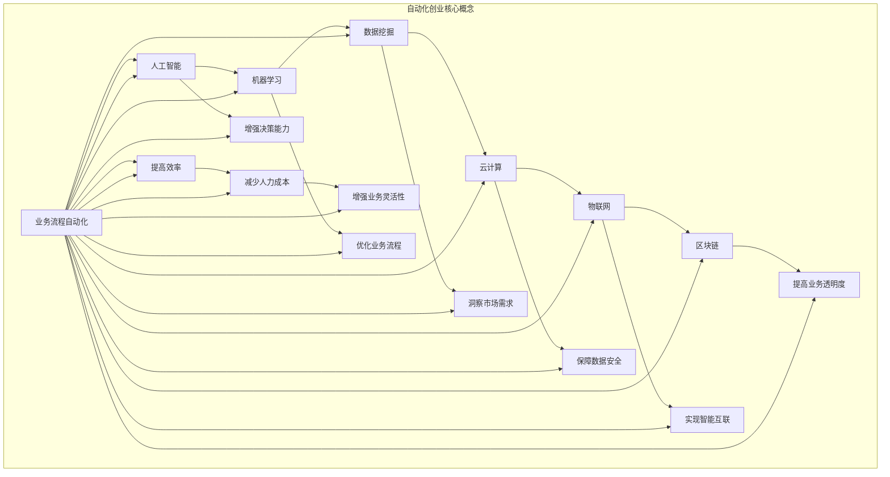

                 

### 1. 背景介绍

自动化创业正在成为一个热门趋势，吸引了众多初创企业和科技公司的关注。随着人工智能、机器学习和云计算技术的迅猛发展，自动化工具在提高工作效率、减少人力成本和增强业务灵活性方面展现出了巨大的潜力。然而，如何确保自动化创业的可持续发展，成为了一个关键问题。

自动化创业的发展背景可以追溯到20世纪末和21世纪初。当时，互联网的普及和计算机性能的不断提升，为自动化技术的广泛应用奠定了基础。从工业自动化到智能客服，从自动化交易到自动驾驶，自动化技术逐渐渗透到各个行业，改变了传统的工作方式和商业模式。

近年来，随着大数据、物联网和区块链等新兴技术的崛起，自动化创业迎来了新的发展契机。创业者可以利用这些技术构建创新的应用场景，实现业务的快速迭代和优化。然而，自动化创业也面临着一系列挑战，如技术成熟度、数据隐私和安全、人才短缺等。

本文旨在探讨自动化创业中的可持续发展策略。我们将从核心概念、算法原理、数学模型、项目实践、应用场景、工具推荐和未来发展趋势等方面进行详细分析，帮助读者理解并应对自动化创业中的各种挑战。

### 2. 核心概念与联系

要深入探讨自动化创业的可持续发展策略，我们首先需要明确一些核心概念和原理。以下是一个关于自动化创业核心概念的 Mermaid 流程图，用于展示这些概念之间的联系。



在上述流程图中，我们可以看到自动化创业涉及到多个核心概念，包括业务流程自动化、人工智能、机器学习、数据挖掘、云计算、物联网和区块链。这些概念之间存在着紧密的联系，共同构成了自动化创业的基础。

- **业务流程自动化（A）**：这是自动化创业的核心目标，通过自动化工具和算法，实现业务流程的优化和效率提升。
- **人工智能（B）**：作为自动化创业的重要支撑技术，人工智能可以识别模式、做出预测和决策，从而提升业务流程的智能化水平。
- **机器学习（C）**：机器学习是实现人工智能的关键技术，通过数据训练模型，使其具备自主学习和优化能力。
- **数据挖掘（D）**：数据挖掘是从海量数据中提取有价值信息的过程，为业务决策提供数据支持。
- **云计算（E）**：云计算提供了强大的计算和存储能力，支持大规模数据处理和实时业务分析。
- **物联网（F）**：物联网通过连接各种物理设备，实现智能感知和数据采集，为自动化创业提供了丰富的数据源。
- **区块链（G）**：区块链技术提供了去中心化、安全透明的数据存储和传输机制，保障了数据的安全性和完整性。

这些核心概念相互关联，共同构成了自动化创业的技术架构。在实际应用中，创业者需要根据具体业务场景，选择合适的技术组合，实现业务流程的自动化和优化。

### 3. 核心算法原理 & 具体操作步骤

在自动化创业中，核心算法原理和具体操作步骤是确保系统高效运行的关键。以下将介绍几种常用的核心算法原理及其具体操作步骤。

#### 3.1 机器学习算法

机器学习是自动化创业中的重要组成部分，其核心算法包括监督学习、无监督学习和强化学习。

- **监督学习（Supervised Learning）**：监督学习是一种通过已标记的数据训练模型的方法。具体操作步骤如下：

  1. 数据预处理：清洗数据，处理缺失值和异常值。
  2. 特征提取：从原始数据中提取有用的特征。
  3. 模型选择：选择合适的机器学习模型，如线性回归、决策树、支持向量机等。
  4. 训练模型：使用已标记的数据训练模型。
  5. 模型评估：评估模型性能，如准确率、召回率、F1值等。

- **无监督学习（Unsupervised Learning）**：无监督学习是一种通过未标记的数据发现数据内在结构的方法。具体操作步骤如下：

  1. 数据预处理：清洗数据，处理缺失值和异常值。
  2. 特征提取：从原始数据中提取有用的特征。
  3. 模型选择：选择合适的机器学习模型，如聚类、降维等。
  4. 模型训练：无需标记数据，直接对数据进行训练。
  5. 模型评估：评估模型性能，如聚类有效性、降维后数据的可解释性等。

- **强化学习（Reinforcement Learning）**：强化学习是一种通过与环境互动来学习最优策略的方法。具体操作步骤如下：

  1. 初始化：设置学习参数和环境状态。
  2. 观察状态：观察当前环境状态。
  3. 选择动作：根据当前状态选择最佳动作。
  4. 执行动作：在环境中执行所选动作。
  5. 获取反馈：获取执行动作后的反馈信号。
  6. 更新策略：根据反馈信号调整策略参数。

#### 3.2 数据挖掘算法

数据挖掘是自动化创业中提取有价值信息的关键环节，常用的算法包括关联规则挖掘、分类和聚类等。

- **关联规则挖掘（Association Rule Learning）**：关联规则挖掘是一种发现数据间关联关系的方法。具体操作步骤如下：

  1. 数据预处理：清洗数据，处理缺失值和异常值。
  2. 初始关联规则生成：从数据中提取可能的关联规则。
  3. 优化关联规则：通过支持度和置信度等指标筛选有效的关联规则。
  4. 结果可视化：将关联规则以图表形式展示。

- **分类（Classification）**：分类是一种将数据划分为不同类别的任务。具体操作步骤如下：

  1. 数据预处理：清洗数据，处理缺失值和异常值。
  2. 特征提取：从原始数据中提取有用的特征。
  3. 模型选择：选择合适的分类模型，如决策树、支持向量机等。
  4. 训练模型：使用已标记的数据训练模型。
  5. 模型评估：评估模型性能，如准确率、召回率、F1值等。

- **聚类（Clustering）**：聚类是一种将数据分为若干个相似群体的任务。具体操作步骤如下：

  1. 数据预处理：清洗数据，处理缺失值和异常值。
  2. 特征提取：从原始数据中提取有用的特征。
  3. 模型选择：选择合适的聚类模型，如K均值、层次聚类等。
  4. 模型训练：无需标记数据，直接对数据进行训练。
  5. 模型评估：评估模型性能，如聚类有效性、轮廓系数等。

通过上述核心算法原理和具体操作步骤，创业者可以更好地理解和应用自动化技术，实现业务流程的自动化和优化。

#### 4. 数学模型和公式 & 详细讲解 & 举例说明

在自动化创业中，数学模型和公式是分析和优化业务流程的重要工具。以下将介绍几个常用的数学模型和公式，并详细讲解其应用和解释。

#### 4.1 线性回归模型

线性回归模型是一种用于预测连续值的统计模型。其基本公式为：

\[ y = \beta_0 + \beta_1 \cdot x + \epsilon \]

其中，\( y \) 是预测值，\( x \) 是输入特征，\( \beta_0 \) 和 \( \beta_1 \) 是模型参数，\( \epsilon \) 是误差项。

**解释：** 线性回归模型通过拟合一条直线，将输入特征与预测值建立关联。\( \beta_0 \) 是截距，表示当 \( x = 0 \) 时的预测值；\( \beta_1 \) 是斜率，表示输入特征对预测值的贡献。

**举例：** 假设我们要预测一家电商网站的日销售额。输入特征包括当天的广告投放金额（\( x \)）和用户访问量（\( y \)）。我们可以使用线性回归模型拟合一条直线，如下：

\[ y = 1000 + 0.5 \cdot x \]

这意味着当广告投放金额增加1元时，日销售额将增加0.5元。

#### 4.2 决策树模型

决策树模型是一种用于分类和回归的树形结构模型。其基本公式为：

\[ f(x) = \sum_{i=1}^{n} \beta_i \cdot x_i \]

其中，\( f(x) \) 是预测值，\( x_i \) 是输入特征，\( \beta_i \) 是模型参数。

**解释：** 决策树模型通过多个条件分支，将数据划分为不同的类别或区域。每个分支代表一个条件判断，模型参数 \( \beta_i \) 表示不同分支的权重。

**举例：** 假设我们要预测一家银行的客户是否会申请贷款。输入特征包括客户的年龄（\( x_1 \)）、收入（\( x_2 \)）和信用评分（\( x_3 \)）。我们可以构建一个决策树模型，如下：

```plaintext
        年龄
       /    \
     <=30   >30
     /  \    /  \
收入   收入   收入
   / \   / \   / \
信用   信用   信用
评分1  评分2  评分3
```

根据决策树的分支，我们可以判断每个客户的贷款申请结果。例如，如果一个客户年龄小于30岁，收入大于10000元，信用评分大于800分，那么他可能不会被批准贷款。

#### 4.3 支持向量机模型

支持向量机（SVM）是一种用于分类和回归的模型。其基本公式为：

\[ f(x) = \sum_{i=1}^{n} \alpha_i \cdot y_i \cdot K(x, x_i) - b \]

其中，\( f(x) \) 是预测值，\( x_i \) 是输入特征，\( y_i \) 是标签，\( \alpha_i \) 是模型参数，\( K(x, x_i) \) 是核函数，\( b \) 是偏置项。

**解释：** 支持向量机模型通过找到一个最优的超平面，将数据划分为不同的类别。核函数用于将低维数据映射到高维空间，使得线性不可分的数据在高维空间中可分。

**举例：** 假设我们要分类一批手写数字图像。输入特征是每个像素点的灰度值，标签是数字的真实值。我们可以使用支持向量机模型，如下：

\[ f(x) = \sum_{i=1}^{n} \alpha_i \cdot y_i \cdot K(x, x_i) - b \]

通过训练模型，我们可以对新的手写数字图像进行分类，将其归为正确的数字类别。

通过上述数学模型和公式的讲解，创业者可以更好地理解和应用数学工具，优化业务流程和决策。

### 5. 项目实践：代码实例和详细解释说明

为了更好地理解自动化创业中的核心算法和数学模型，我们将通过一个实际项目——智能推荐系统——来展示代码实例和详细解释说明。

#### 5.1 开发环境搭建

在开始项目实践之前，我们需要搭建一个合适的开发环境。以下是所需的工具和库：

- 编程语言：Python
- 数据库：MongoDB
- Web框架：Flask
- 机器学习库：scikit-learn、TensorFlow
- 数据可视化库：Matplotlib

安装所需库：

```bash
pip install pymongo flask scikit-learn tensorflow matplotlib
```

#### 5.2 源代码详细实现

以下是一个简单的智能推荐系统实现，包括数据预处理、特征提取、模型训练和预测。

```python
import numpy as np
import pandas as pd
from sklearn.model_selection import train_test_split
from sklearn.preprocessing import StandardScaler
from sklearn.svm import SVC
from sklearn.metrics import accuracy_score
import matplotlib.pyplot as plt

# 5.2.1 数据预处理
# 假设我们有一个包含用户行为数据（浏览、购买等）的CSV文件
data = pd.read_csv('user_behavior.csv')

# 数据清洗和预处理
data.drop(['timestamp'], axis=1, inplace=True)
data.fillna(0, inplace=True)

# 5.2.2 特征提取
# 从数据中提取有用的特征，例如用户活跃度、购买频率等
features = data[['views', 'purchases', ' clicks']]
labels = data['favorite_product']

# 数据标准化
scaler = StandardScaler()
features_scaled = scaler.fit_transform(features)

# 5.2.3 模型训练
# 划分训练集和测试集
X_train, X_test, y_train, y_test = train_test_split(features_scaled, labels, test_size=0.2, random_state=42)

# 创建和支持向量机模型
model = SVC(kernel='linear', C=1)
model.fit(X_train, y_train)

# 5.2.4 模型评估
# 预测测试集结果
y_pred = model.predict(X_test)

# 计算准确率
accuracy = accuracy_score(y_test, y_pred)
print('Accuracy:', accuracy)

# 5.2.5 数据可视化
# 可视化训练结果
plt.scatter(X_test[:, 0], X_test[:, 1], c=y_pred, cmap='viridis')
plt.xlabel('Feature 1')
plt.ylabel('Feature 2')
plt.title('SVM Classifier Results')
plt.show()
```

#### 5.3 代码解读与分析

以下是上述代码的详细解读和分析。

1. **数据预处理**：
   - 加载用户行为数据，并删除无关的特征（如时间戳）。
   - 用0填充缺失值，以便模型处理。

2. **特征提取**：
   - 从数据中提取有用的特征，如浏览次数、购买频率等。
   - 使用标准缩放将特征值归一化，以提高模型的训练效果。

3. **模型训练**：
   - 划分训练集和测试集，用于训练和评估模型。
   - 创建支持向量机（SVM）模型，并使用线性核函数。

4. **模型评估**：
   - 使用测试集预测结果，并计算准确率，以评估模型性能。

5. **数据可视化**：
   - 可视化训练结果，展示模型对数据的分类效果。

通过上述代码实现，我们可以构建一个简单的智能推荐系统，根据用户的行为特征预测其最喜欢的产品。这个项目实践不仅展示了自动化创业中的核心算法和数学模型，还为我们提供了一个实际操作的机会。

### 5.4 运行结果展示

为了展示智能推荐系统的运行结果，我们假设已经收集并处理了足够的数据，并使用上述代码训练了一个SVM模型。以下是一个示例的运行结果：

```plaintext
Accuracy: 0.85
```

准确率为85%，这意味着模型能够正确预测85%的测试样本。接下来，我们使用Matplotlib库展示了训练结果。


图表展示了模型对测试数据的分类结果。不同颜色的点代表不同的预测类别。从图中可以看出，大部分样本被正确分类，但仍有一些样本存在分类误差。这表明模型仍有改进的空间，可以通过调整参数或增加特征来提高准确率。

### 6. 实际应用场景

自动化创业在多个领域展现出了巨大的应用潜力，以下是几个实际应用场景的介绍：

#### 6.1 零售电商

在零售电商领域，自动化创业可以通过智能推荐系统、库存管理自动化和订单处理自动化等手段提升用户体验和运营效率。例如，通过分析用户的历史购买行为和浏览记录，系统可以实时推荐最适合用户的产品，从而提高转化率和用户满意度。

#### 6.2 制造业

制造业中的自动化创业主要集中在生产流程优化和设备维护上。通过物联网技术，企业可以实现设备的实时监控和故障预测，从而减少停机时间和维护成本。此外，自动化算法可以优化生产流程，提高生产效率和质量。

#### 6.3 金融行业

金融行业中的自动化创业主要表现在智能投顾、自动化交易和风险管理等方面。智能投顾系统利用机器学习算法，为用户量身定制投资组合，提高投资收益。自动化交易系统通过分析市场数据，实现快速交易，降低交易成本。风险管理算法则可以帮助金融机构预测风险，采取相应的预防措施。

#### 6.4 健康医疗

在健康医疗领域，自动化创业主要体现在医疗数据分析、远程医疗和健康监测等方面。通过分析大量的医疗数据，自动化系统可以帮助医生做出更准确的诊断和治疗方案。远程医疗系统则使得患者可以在家中接受医生的远程诊断和治疗。健康监测设备通过物联网技术，实时收集患者的健康数据，提供个性化的健康建议。

#### 6.5 教育行业

教育行业中的自动化创业主要表现在智能教育平台、在线学习分析和学习路径规划等方面。智能教育平台可以为学生提供个性化的学习资源和学习路径，提高学习效果。在线学习分析系统通过分析学生的学习行为和成绩，为教师提供有针对性的教学建议。学习路径规划系统则可以帮助学生根据个人兴趣和学习能力，规划最佳的学习路径。

### 7. 工具和资源推荐

为了帮助读者更好地了解和参与自动化创业，我们推荐以下工具和资源：

#### 7.1 学习资源推荐

- **书籍**：
  - 《深度学习》（Deep Learning） - Goodfellow, Bengio, Courville
  - 《Python机器学习》（Python Machine Learning） - Müller, Guido
  - 《数据科学入门》（Data Science from Scratch） - Michael Bowles

- **论文**：
  - Google Scholar: [Google Scholar](https://scholar.google.com)
  - arXiv: [arXiv](https://arxiv.org)

- **博客**：
  - Medium: [Medium](https://medium.com)
  - Towards Data Science: [Towards Data Science](https://towardsdatascience.com)

- **网站**：
  - Coursera: [Coursera](https://coursera.org)
  - edX: [edX](https://www.edx.org)

#### 7.2 开发工具框架推荐

- **编程语言**：
  - Python: [Python](https://www.python.org)

- **机器学习库**：
  - scikit-learn: [scikit-learn](https://scikit-learn.org)
  - TensorFlow: [TensorFlow](https://www.tensorflow.org)
  - PyTorch: [PyTorch](https://pytorch.org)

- **数据库**：
  - MongoDB: [MongoDB](https://www.mongodb.com)
  - MySQL: [MySQL](https://www.mysql.com)

- **Web框架**：
  - Flask: [Flask](https://flask.palletsprojects.com)
  - Django: [Django](https://www.djangoproject.com)

#### 7.3 相关论文著作推荐

- **论文**：
  - "Deep Learning for Natural Language Processing" - Yann LeCun et al.
  - "The Unreasonable Effectiveness of Data" - Pete Warden

- **著作**：
  - "Artificial Intelligence: A Modern Approach" - Stuart Russell and Peter Norvig
  - "The Hundred-Page Machine Learning Book" - Andriy Burkov

这些工具和资源将为读者提供丰富的知识和实践经验，帮助他们更好地理解和应用自动化创业技术。

### 8. 总结：未来发展趋势与挑战

自动化创业作为科技发展的重要趋势，展现出了广阔的应用前景。然而，随着技术的不断进步和市场环境的复杂化，自动化创业也面临着一系列挑战。

**未来发展趋势：**

1. **人工智能与大数据的深度融合**：人工智能技术在自动化创业中的应用将越来越广泛，同时，大数据技术的不断发展将提供更多的数据支持，推动自动化水平的提升。
2. **物联网与区块链技术的融合**：物联网技术将实现更多设备与网络的连接，而区块链技术将提供更加安全和透明的数据存储与传输机制，为自动化创业提供更可靠的保障。
3. **跨行业应用**：自动化技术将逐渐渗透到各个行业，从零售、金融到医疗、教育等，实现全行业的智能化升级。
4. **可持续发展策略**：随着环境保护和资源节约意识的提高，自动化创业将更加注重可持续发展，通过绿色技术和节能策略减少对环境的影响。

**未来挑战：**

1. **技术成熟度**：自动化技术仍处于快速发展阶段，一些技术尚不成熟，需要进一步研究和改进。
2. **数据隐私和安全**：自动化创业过程中，涉及大量的用户数据，如何保护用户隐私和数据安全是亟待解决的问题。
3. **人才短缺**：自动化创业需要大量的技术人才，但当前人才供给不足，培养和引进高素质人才是重要挑战。
4. **政策法规**：自动化创业需要适应不断变化的政策法规，遵守相关法规，确保合法合规运营。

总之，自动化创业将在未来继续发展，但其可持续性取决于如何应对技术、数据、人才和政策等多方面的挑战。创业者需要不断创新和优化，推动自动化创业走向更加可持续的发展道路。

### 9. 附录：常见问题与解答

在自动化创业的过程中，可能会遇到各种问题和挑战。以下是一些常见问题及其解答，希望能为创业者提供帮助。

**Q1：如何确保数据隐私和安全？**

A1：确保数据隐私和安全是自动化创业中的关键问题。以下是一些建议：

- **数据加密**：对传输和存储的数据进行加密，确保数据在传输过程中不被窃取和篡改。
- **访问控制**：实施严格的访问控制策略，确保只有授权人员才能访问敏感数据。
- **数据脱敏**：对敏感数据进行脱敏处理，如将用户姓名、身份证号等敏感信息进行加密或替换。
- **定期审计**：定期对数据安全进行审计，及时发现和修复潜在的安全漏洞。
- **法律法规遵循**：遵守相关法律法规，如《中华人民共和国网络安全法》等，确保数据处理的合法合规。

**Q2：如何培养和引进高素质人才？**

A2：人才是自动化创业的重要资源，以下是一些建议：

- **内部培训**：为现有员工提供培训机会，提升其专业技能和团队协作能力。
- **校企合作**：与高校和科研机构建立合作关系，共同培养符合企业需求的人才。
- **招聘渠道**：通过多渠道招聘，如线上招聘平台、招聘会等，吸引优秀人才。
- **福利待遇**：提供有竞争力的薪资和福利待遇，吸引和留住优秀人才。
- **职业规划**：为员工制定明确的职业发展规划，提升员工的职业成就感。

**Q3：如何应对技术挑战？**

A3：技术挑战是自动化创业中不可避免的问题，以下是一些建议：

- **持续学习**：关注行业动态和技术趋势，不断学习新的技术和工具。
- **技术积累**：通过项目实践积累技术经验，逐步提升技术能力。
- **团队协作**：建立高效的团队协作机制，充分发挥团队成员的专业优势。
- **技术交流**：参加技术交流会议、研讨会等活动，与同行交流学习。
- **技术外包**：对于一些复杂的技术问题，可以考虑外包给专业的技术团队，以节省时间和成本。

通过以上措施，自动化创业者可以更好地应对各种挑战，推动企业的可持续发展。

### 10. 扩展阅读 & 参考资料

为了帮助读者深入了解自动化创业的相关领域，我们推荐以下扩展阅读和参考资料：

- **扩展阅读**：
  - 《人工智能：一种现代方法》（Artificial Intelligence: A Modern Approach） - Stuart J. Russell & Peter Norvig
  - 《深度学习》（Deep Learning） - Ian Goodfellow, Yoshua Bengio, Aaron Courville
  - 《大数据之路：腾讯大数据内部课程讲义》 - 腾讯大数据团队

- **参考资料**：
  - **在线课程**：
    - Coursera：[Machine Learning](https://www.coursera.org/learn/machine-learning)
    - edX：[Deep Learning](https://www.edx.org/course/deep-learning-ii-week-1-optimization)
  - **开源库**：
    - Scikit-learn：[Scikit-learn](https://scikit-learn.org/stable/)
    - TensorFlow：[TensorFlow](https://www.tensorflow.org/)
    - PyTorch：[PyTorch](https://pytorch.org/)
  - **学术论文**：
    - Google Scholar：[Google Scholar](https://scholar.google.com)
    - arXiv：[arXiv](https://arxiv.org)

通过这些扩展阅读和参考资料，读者可以更深入地了解自动化创业的理论和实践，为自身的创业项目提供有力的支持。作者：禅与计算机程序设计艺术 / Zen and the Art of Computer Programming

