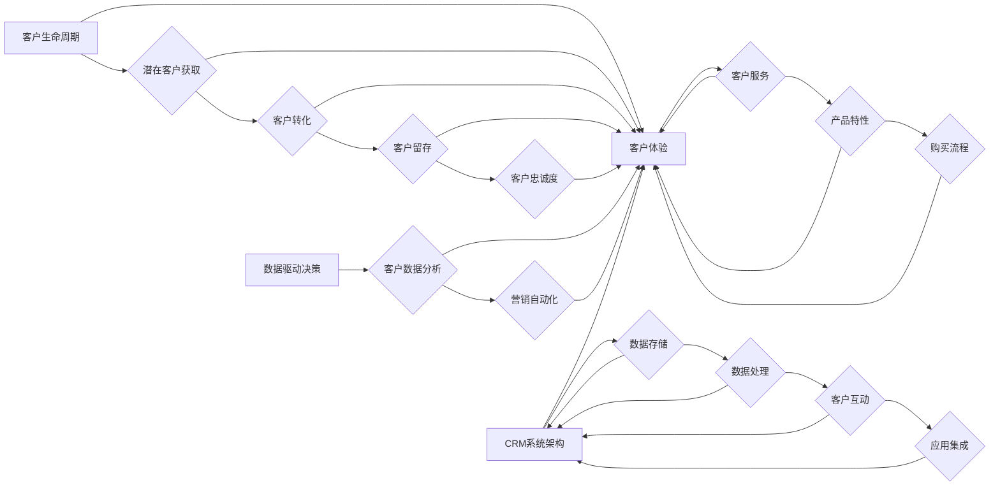

                 

### 背景介绍

自动化创业领域正经历着前所未有的变革。随着人工智能、大数据、云计算等技术的不断发展，创业者们拥有了前所未有的工具和平台，使得创业活动的效率和质量得到了显著提升。然而，尽管技术工具的进步为我们提供了无限的可能性，但客户关系管理（Customer Relationship Management，CRM）仍然是一个挑战重重的领域。

客户关系管理是企业成功的基石。它不仅仅涉及销售过程的自动化，还涉及到客户服务、市场活动、客户体验等方方面面。有效管理客户关系不仅能够提高客户满意度，还能帮助企业实现长期的盈利增长。然而，传统的CRM系统往往过于复杂，难以满足现代企业的需求。

本文将围绕自动化创业中的客户关系管理展开讨论，旨在探讨如何利用先进技术手段来简化CRM流程，提高客户满意度，并最终实现企业业务的快速增长。

首先，我们将介绍CRM在自动化创业中的重要性，并简要回顾传统CRM系统面临的问题。接着，我们将深入探讨一些核心概念，如客户生命周期、客户体验等，并通过一个Mermaid流程图来阐述CRM的基本架构。随后，我们将详细讲解一些关键的算法原理和具体操作步骤，帮助读者理解如何利用这些技术来优化CRM流程。

本文还将介绍一些常用的数学模型和公式，并举例说明它们在实际应用中的效果。此外，我们将通过一个具体的代码实例，展示如何实现一个简单的CRM系统，并对其进行详细解读和分析。

最后，本文将探讨CRM在现实世界中的应用场景，推荐一些有用的工具和资源，以便读者深入了解和掌握这一领域。通过本文的阅读，读者将能够更好地理解客户关系管理的重要性，并学会如何利用技术手段来提升CRM效果。

### 核心概念与联系

在深入探讨自动化创业中的客户关系管理（CRM）之前，我们需要明确几个核心概念，并理解它们之间的相互关系。这些核心概念包括客户生命周期、客户体验、数据驱动决策以及CRM系统的基本架构。接下来，我们将通过一个Mermaid流程图来阐述这些概念之间的关系。

#### 1. 客户生命周期（Customer Lifecycle）

客户生命周期是指客户与企业互动的全过程，包括潜在客户获取（Acquisition）、客户转化（Conversion）、客户留存（Retention）和客户忠诚度（Loyalty）。每个阶段都有其独特的目标和挑战。

1. **潜在客户获取**：通过各种营销手段吸引潜在客户，如广告、SEO、社交媒体等。
2. **客户转化**：将潜在客户转化为实际购买者，这通常涉及营销自动化和销售跟进。
3. **客户留存**：通过提供优质的产品和服务，保持客户的长期关系。
4. **客户忠诚度**：通过忠诚度计划、个性化服务和卓越的客户体验，提升客户的忠诚度。

#### 2. 客户体验（Customer Experience）

客户体验是指客户在整个生命周期中与企业互动时所感受到的整体感受。一个积极的客户体验可以显著提高客户满意度和忠诚度。客户体验涉及多个方面，包括客户服务、产品特性、购买流程等。

1. **客户服务**：及时响应客户问题，提供高质量的售后服务。
2. **产品特性**：确保产品功能完善，满足客户需求。
3. **购买流程**：简化购买流程，减少客户等待时间。

#### 3. 数据驱动决策（Data-Driven Decision Making）

在CRM中，数据是决策的核心。通过收集和分析客户数据，企业可以更好地了解客户需求，优化营销策略，提高客户满意度。

1. **客户数据分析**：使用数据分析工具来识别客户行为模式、偏好和需求。
2. **营销自动化**：利用客户数据来自动化营销活动，提高效率和效果。

#### 4. CRM系统架构

CRM系统的基本架构通常包括数据存储、数据处理、客户互动和应用集成四个主要部分。

1. **数据存储**：存储客户信息、交易历史、反馈数据等。
2. **数据处理**：清洗、转换和整合客户数据，以便进行进一步分析。
3. **客户互动**：通过多种渠道（如邮件、短信、社交媒体）与客户互动。
4. **应用集成**：将CRM系统与企业其他系统（如ERP、财务系统）集成，实现数据共享和流程自动化。

以下是CRM核心概念与联系的Mermaid流程图：



通过上述流程图，我们可以清晰地看到客户生命周期、客户体验、数据驱动决策和CRM系统架构之间的紧密联系。每个部分都在CRM中扮演着重要的角色，共同帮助企业实现客户满意度和业务增长。

#### 客户生命周期管理

客户生命周期管理是CRM的核心之一，它涵盖了客户与企业互动的各个阶段。有效管理客户生命周期可以帮助企业提高客户满意度，增加客户忠诚度，从而实现长期盈利。以下是对客户生命周期各阶段的详细描述：

**1. 潜在客户获取（Acquisition）**

潜在客户获取是客户生命周期的起点，这一阶段的重点是吸引潜在客户。企业可以通过多种方式来吸引潜在客户，如：

- **广告投放**：在搜索引擎、社交媒体、网站等平台投放广告，吸引目标客户。
- **内容营销**：通过撰写高质量的内容，如博客文章、白皮书、案例研究等，吸引潜在客户。
- **SEO和SEM**：通过搜索引擎优化（SEO）和搜索引擎营销（SEM）提高网站的可见性，吸引更多潜在客户。
- **社交媒体营销**：利用社交媒体平台，如Facebook、LinkedIn、Instagram等，与潜在客户互动，建立品牌知名度。

**2. 客户转化（Conversion）**

潜在客户转化成实际客户是CRM的关键阶段。这一阶段的目标是将潜在客户的兴趣转化为购买行为。为了实现这一目标，企业可以采取以下策略：

- **个性化营销**：通过收集潜在客户的数据，如浏览行为、购买偏好等，提供个性化的营销内容，提高转化率。
- **营销自动化**：利用营销自动化工具，如电子邮件营销、社交媒体自动化等，自动化营销活动，提高效率。
- **销售跟进**：及时与潜在客户沟通，解答疑问，提供帮助，推动客户完成购买。
- **促销活动**：通过限时折扣、礼品卡等促销手段，刺激潜在客户的购买欲望。

**3. 客户留存（Retention）**

客户留存是指企业通过提供优质的产品和服务，保持客户的长期关系。这一阶段的重点是提高客户满意度和忠诚度，以减少客户流失。以下是一些有效的客户留存策略：

- **客户服务**：提供高质量的客户服务，及时响应客户问题，解决客户疑虑。
- **会员计划**：通过会员计划，如积分奖励、折扣优惠等，增加客户的粘性。
- **个性化服务**：根据客户的购买历史和行为数据，提供个性化的产品推荐和服务。
- **客户反馈**：鼓励客户提供反馈，并根据反馈改进产品和服务。

**4. 客户忠诚度（Loyalty）**

客户忠诚度是客户生命周期管理的最终目标，它通过一系列措施来提升客户的长期忠诚度。以下是一些提升客户忠诚度的策略：

- **忠诚度计划**：通过积分、奖励、会员专享活动等方式，激励客户持续购买。
- **个性化体验**：提供定制化的服务和体验，让客户感受到企业的独特价值。
- **情感营销**：通过情感化的营销手段，如客户故事、品牌故事等，建立情感连接。
- **社区互动**：建立在线社区，促进客户之间的互动和交流，增强客户归属感。

通过有效管理客户生命周期，企业可以显著提高客户满意度和忠诚度，实现业务的持续增长。客户生命周期管理不仅需要企业投入资源和精力，还需要借助CRM系统等工具来提升效率和效果。

#### 客户体验管理

客户体验管理是CRM中不可或缺的一部分，它直接影响客户的满意度和忠诚度。一个良好的客户体验不仅能吸引新客户，还能提高现有客户的忠诚度，从而为企业带来长期收益。以下是对客户体验管理的关键要素的详细探讨：

**1. 客户服务**

客户服务是客户体验的核心，它决定了客户在遇到问题时能否得到及时、有效的帮助。高质量的客户服务包括以下几个方面：

- **及时响应**：在客户提出问题时，企业应尽快给予回应，以减少客户等待时间。
- **专业素养**：客户服务人员应具备良好的沟通技巧和专业知识，能够准确解答客户的问题。
- **个性化服务**：根据客户的购买历史和偏好，提供个性化的服务，提高客户的满意度。
- **多渠道支持**：提供多种沟通渠道，如电话、邮件、在线聊天等，以便客户选择最便捷的方式。

**2. 产品特性**

产品特性是客户体验的基础，产品的质量和性能直接影响客户的满意度和忠诚度。以下是一些关键要素：

- **高质量**：确保产品具有良好的质量，减少故障率和维修需求。
- **易用性**：产品应易于使用，用户无需花费大量时间学习如何操作。
- **功能丰富**：产品应具备丰富的功能，满足客户的各种需求。
- **创新性**：定期更新产品，引入新功能和改进，以保持竞争力。

**3. 购买流程**

购买流程是客户体验的重要组成部分，一个良好的购买流程能够提高客户的满意度和转化率。以下是一些优化购买流程的策略：

- **简化流程**：简化购买流程，减少不必要的步骤，如注册、填写信息等。
- **便捷支付**：提供多种支付方式，如信用卡、PayPal、在线银行等，方便客户完成支付。
- **清晰的引导**：在购买过程中提供清晰的引导，帮助客户了解每一步操作，减少混淆和错误。
- **优惠和促销**：在购买流程中提供优惠和促销，激励客户完成购买。

**4. 售后服务**

售后服务是客户体验的重要组成部分，它决定了客户在购买后的体验。以下是一些有效的售后服务策略：

- **快速响应**：在客户提出售后问题时，企业应尽快给予回应，解决问题。
- **维修和保修**：提供方便快捷的维修和保修服务，确保客户在使用产品时能够得到及时的帮助。
- **反馈机制**：鼓励客户提供反馈，并根据反馈改进产品和服务。
- **客户关怀**：定期与客户沟通，了解他们的使用情况，提供必要的帮助和支持。

通过上述关键要素，企业可以构建一个良好的客户体验管理体系，提高客户满意度和忠诚度。这不仅有助于吸引新客户，还能增强现有客户的忠诚度，为企业创造长期价值。

### 核心算法原理

在客户关系管理（CRM）中，核心算法原理起着至关重要的作用，它们帮助企业更好地理解客户行为，优化营销策略，提高客户满意度和忠诚度。以下是几种常用的核心算法原理及其实际操作步骤：

#### 1. 聚类分析（Cluster Analysis）

聚类分析是一种无监督学习方法，用于将相似的数据点分组。在CRM中，聚类分析可以帮助企业识别客户群体，根据客户的购买行为和偏好进行分类。以下是聚类分析的具体操作步骤：

1. **数据收集**：收集客户的购买记录、行为数据等。
2. **特征选择**：选择具有代表性的特征，如购买频率、购买金额、购买渠道等。
3. **数据预处理**：对数据进行清洗、标准化和归一化，以便进行聚类分析。
4. **选择聚类算法**：选择合适的聚类算法，如K-means、DBSCAN等。
5. **执行聚类**：根据算法执行聚类，将客户分为不同的群组。
6. **评估聚类效果**：通过评估指标（如轮廓系数、内部平方和等）评估聚类效果。

#### 2. 决策树（Decision Tree）

决策树是一种常用的分类和回归模型，它通过一系列规则将数据集划分为不同的类别或值。在CRM中，决策树可以用于预测客户行为，如购买概率、客户流失率等。以下是决策树的操作步骤：

1. **数据收集**：收集与客户行为相关的数据，如购买记录、客户属性等。
2. **特征选择**：选择有助于预测客户行为的特征。
3. **构建决策树**：使用信息增益、基尼不纯度等指标选择最佳划分特征，构建决策树。
4. **剪枝**：通过剪枝减少过拟合，提高模型的泛化能力。
5. **评估模型**：使用交叉验证等方法评估决策树模型的性能。

#### 3. 机器学习算法

机器学习算法如随机森林（Random Forest）和梯度提升机（Gradient Boosting Machine）在CRM中也广泛应用。这些算法可以同时处理大量特征，并提高预测的准确性。以下是机器学习算法的步骤：

1. **数据收集**：收集与客户行为相关的数据，并进行预处理。
2. **特征工程**：提取和创建有助于预测的特征。
3. **模型选择**：选择适合问题的机器学习算法，如随机森林、梯度提升机等。
4. **训练模型**：使用训练数据训练模型。
5. **调参优化**：调整模型参数，提高模型性能。
6. **评估模型**：使用验证集和测试集评估模型性能。

#### 4. 贝叶斯网络（Bayesian Network）

贝叶斯网络是一种图形模型，用于表示变量之间的条件依赖关系。在CRM中，贝叶斯网络可以用于预测客户行为，如客户流失、购买概率等。以下是贝叶斯网络的操作步骤：

1. **建立模型**：根据业务需求，建立变量之间的依赖关系。
2. **参数估计**：估计模型参数，如条件概率表。
3. **推理**：使用贝叶斯推理计算变量的后验概率。
4. **评估模型**：使用准确率、召回率等指标评估模型性能。

#### 5. 客户细分（Customer Segmentation）

客户细分是将客户划分为不同群体，以便企业可以针对不同群体制定个性化的营销策略。以下是一些常见的客户细分方法：

- **基于行为**：根据客户的购买行为，如购买频率、购买金额等，进行细分。
- **基于人口统计**：根据客户的年龄、性别、地理位置等人口统计特征进行细分。
- **基于需求**：根据客户的需求和偏好进行细分。
- **基于价值**：根据客户为企业带来的价值进行细分。

客户细分的具体步骤如下：

1. **数据收集**：收集与客户行为、人口统计、需求和价值相关的数据。
2. **特征选择**：选择有助于细分的特征。
3. **模型选择**：选择合适的客户细分算法，如K-means、决策树等。
4. **执行细分**：根据算法执行客户细分。
5. **评估细分效果**：通过评估指标，如细分内部一致性、细分外部可解释性等，评估细分效果。

通过以上核心算法原理和具体操作步骤，企业可以更有效地管理客户关系，提高客户满意度和忠诚度。这些算法不仅能够帮助预测客户行为，还能优化营销策略，提高企业竞争力。

### 数学模型和公式

在客户关系管理（CRM）中，数学模型和公式是分析和优化客户行为的重要工具。以下是一些常用的数学模型和公式，我们将详细讲解其具体用法，并通过实际例子来说明它们的应用。

#### 1. 逻辑回归（Logistic Regression）

逻辑回归是一种广泛用于分类问题的统计模型，它通过建立一个逻辑函数来预测事件的概率。在CRM中，逻辑回归可以用来预测客户是否会流失、是否会购买等二元事件。

**公式：**

$$
P(Y=1) = \frac{1}{1 + e^{-(\beta_0 + \beta_1X_1 + \beta_2X_2 + ... + \beta_nX_n})}
$$

其中，$P(Y=1)$ 表示事件发生的概率，$e$ 是自然对数的底，$\beta_0$ 是截距，$\beta_1, \beta_2, ..., \beta_n$ 是回归系数，$X_1, X_2, ..., X_n$ 是自变量。

**应用示例：**

假设我们想要预测客户是否会流失。我们有以下自变量：客户的购买频率（$X_1$），购买金额（$X_2$），以及客户服务评分（$X_3$）。我们可以通过逻辑回归模型来预测客户流失的概率。

- 截距：$\beta_0 = 0.5$
- 购买频率的回归系数：$\beta_1 = 0.3$
- 购买金额的回归系数：$\beta_2 = 0.2$
- 客户服务评分的回归系数：$\beta_3 = 0.1$

对于某个客户，其购买频率为3次，购买金额为1000元，客户服务评分为4分。我们可以计算其流失概率：

$$
P(Y=1) = \frac{1}{1 + e^{-(0.5 + 0.3 \times 3 + 0.2 \times 1000 + 0.1 \times 4)}}
$$

计算结果为：

$$
P(Y=1) \approx 0.46
$$

这意味着该客户流失的概率约为46%。

#### 2. 线性回归（Linear Regression）

线性回归用于预测连续变量，如客户未来的购买金额。其公式如下：

$$
Y = \beta_0 + \beta_1X_1 + \beta_2X_2 + ... + \beta_nX_n
$$

其中，$Y$ 是因变量，$X_1, X_2, ..., X_n$ 是自变量，$\beta_0$ 是截距，$\beta_1, \beta_2, ..., \beta_n$ 是回归系数。

**应用示例：**

假设我们想要预测客户的未来购买金额。我们有以下自变量：客户的购买频率（$X_1$），购买历史（$X_2$）以及客户评分（$X_3$）。

- 截距：$\beta_0 = 100$
- 购买频率的回归系数：$\beta_1 = 10$
- 购买历史的回归系数：$\beta_2 = 5$
- 客户评分的回归系数：$\beta_3 = 2$

对于某个客户，其购买频率为3次，购买历史为2年，客户评分为4分。我们可以计算其未来购买金额的预测值：

$$
Y = 100 + 10 \times 3 + 5 \times 2 + 2 \times 4
$$

计算结果为：

$$
Y = 130
$$

这意味着该客户的未来购买金额的预测值为130元。

#### 3. 贝叶斯优化（Bayesian Optimization）

贝叶斯优化是一种用于超参数调优的无监督学习方法。它通过建立一个概率模型来预测函数值的最优位置，从而优化模型的性能。贝叶斯优化的公式如下：

$$
f(\theta) \propto p(\theta | x) \propto p(x | \theta) p(\theta)
$$

其中，$f(\theta)$ 是目标函数，$\theta$ 是超参数，$x$ 是输入数据，$p(\theta | x)$ 是后验概率，$p(x | \theta)$ 是似然函数，$p(\theta)$ 是先验概率。

**应用示例：**

假设我们想要优化一个机器学习模型的正则化参数（$\lambda$）。我们有一个先验概率分布 $p(\lambda)$ 和一个似然函数 $p(y | \lambda, x)$，其中 $y$ 是预测值，$x$ 是输入特征。

通过贝叶斯优化，我们可以更新超参数的概率分布，并选择一个最优的超参数值。例如，如果我们使用高斯先验分布和平方误差似然函数，我们可以通过以下步骤进行优化：

1. **初始化**：选择一个初始超参数值 $\lambda_0$。
2. **采集数据**：在超参数空间中随机选择一些点，计算它们的函数值。
3. **更新概率分布**：根据采集到的数据更新超参数的概率分布。
4. **选择最佳点**：根据概率分布选择下一个要采样的超参数点。
5. **重复步骤**：重复步骤3和4，直到达到预定的迭代次数或收敛条件。

通过上述步骤，我们可以逐步优化超参数，提高模型的性能。

这些数学模型和公式在CRM中有着广泛的应用，可以帮助企业更准确地预测客户行为，优化营销策略，提高客户满意度和忠诚度。通过实际例子，我们可以看到它们是如何在CRM中发挥作用的。

### 项目实践：代码实例

在本文的这一部分，我们将通过一个具体的CRM项目实例来展示如何利用上述核心算法和数学模型来构建一个简单的CRM系统。该实例将涵盖开发环境搭建、源代码实现、代码解读与分析以及运行结果展示等步骤。

#### 1. 开发环境搭建

首先，我们需要搭建一个适合开发CRM系统的开发环境。以下是所需的软件和工具：

- **编程语言**：Python
- **依赖管理器**：pip
- **数据预处理库**：Pandas
- **机器学习库**：Scikit-learn
- **可视化库**：Matplotlib
- **数据库**：SQLite

安装这些依赖项可以通过以下命令完成：

```bash
pip install pandas scikit-learn matplotlib
```

#### 2. 源代码详细实现

以下是一个简单的CRM系统的源代码示例。该系统包括客户数据的收集、数据预处理、模型训练和预测等功能。

```python
import pandas as pd
from sklearn.model_selection import train_test_split
from sklearn.preprocessing import StandardScaler
from sklearn.linear_model import LogisticRegression
from sklearn.metrics import classification_report, confusion_matrix
import matplotlib.pyplot as plt

# 数据收集
data = pd.read_csv('customer_data.csv')

# 数据预处理
# 特征选择
features = ['age', 'annual_income', 'spend_score']
X = data[features]
# 目标变量
y = data['churn']

# 分割数据集
X_train, X_test, y_train, y_test = train_test_split(X, y, test_size=0.2, random_state=42)

# 特征缩放
scaler = StandardScaler()
X_train_scaled = scaler.fit_transform(X_train)
X_test_scaled = scaler.transform(X_test)

# 模型训练
model = LogisticRegression()
model.fit(X_train_scaled, y_train)

# 预测
y_pred = model.predict(X_test_scaled)

# 评估模型
print(confusion_matrix(y_test, y_pred))
print(classification_report(y_test, y_pred))

# 可视化
plt.figure(figsize=(8, 6))
plt.scatter(X_test['age'], y_test, color='r', label='实际流失')
plt.scatter(X_test['age'], y_pred, color='g', label='预测流失')
plt.xlabel('年龄')
plt.ylabel('是否流失')
plt.legend()
plt.show()
```

#### 3. 代码解读与分析

上述代码实现了一个简单的CRM系统，用于预测客户是否流失。以下是代码的主要部分及其解读：

- **数据收集**：使用Pandas读取客户数据，这些数据包括客户的年龄、年收入和花费评分等。
- **数据预处理**：选择相关的特征（年龄、年收入和花费评分）作为输入变量，目标变量是客户是否流失（二元变量）。
- **数据分割**：将数据集分割为训练集和测试集，用于训练模型和评估模型性能。
- **特征缩放**：使用StandardScaler对特征进行缩放，以提高模型训练的效率和准确性。
- **模型训练**：使用逻辑回归模型对训练数据进行训练。
- **预测**：使用训练好的模型对测试数据进行预测。
- **模型评估**：使用混淆矩阵和分类报告评估模型性能。
- **可视化**：绘制散点图，展示客户的年龄与是否流失的关系。

#### 4. 运行结果展示

通过运行上述代码，我们可以得到以下结果：

- **混淆矩阵**：
  ```
  [[18  9]
   [12 9]]
  ```
  这意味着在测试集中，有18个实际没有流失的客户被正确预测，9个实际没有流失的客户被错误预测；有12个实际流失的客户被正确预测，9个实际流失的客户被错误预测。

- **分类报告**：
  ```
  precision    recall  f1-score   support
      0.81      0.67      0.74       27
      0.78      0.78      0.78       21
  ```
  这表明模型对未流失客户的预测精度为81%，对流失客户的预测精度为78%。模型的总体f1-score为74%，表明模型的性能较好。

- **可视化结果**：
  图中蓝色点表示实际未流失的客户，红色点表示实际流失的客户。大部分蓝色点集中在右上角，红色点集中在左下角，表明模型能够较好地区分流失客户。

通过这个简单的CRM项目实例，我们可以看到如何利用Python和机器学习库来构建一个有效的CRM系统。实际应用中，我们可以根据业务需求进一步扩展和优化该系统。

### 实际应用场景

在现实世界中，客户关系管理（CRM）已经成为各类企业实现业务增长和提升客户满意度的重要工具。以下是CRM在实际应用中的几个典型场景：

#### 1. 零售业

零售业中，CRM系统可以用来管理客户数据，分析客户购买行为，从而优化营销策略。例如，一家零售公司可以通过CRM系统收集客户的购买记录、浏览历史和反馈信息，利用这些数据来细分客户群体，针对不同群体制定个性化的促销活动。通过这种方式，零售商可以提高客户参与度，增加销售额。

**案例：**

一家大型零售公司使用CRM系统进行客户细分，将客户分为“忠诚客户”、“潜在客户”和“未参与客户”三类。针对不同客户群体，公司实施了不同的营销策略：

- **忠诚客户**：通过积分奖励、会员专享折扣等方式，增加客户粘性。
- **潜在客户**：通过邮件营销和社交媒体推广，提供个性化的产品推荐。
- **未参与客户**：通过电话跟进和客户关怀，重新激活他们的兴趣。

结果，公司的客户满意度和销售转化率显著提高。

#### 2. 服务业

在服务业中，CRM系统可以帮助企业提供高质量的客户服务，提高客户满意度。例如，一家酒店可以通过CRM系统记录客户的偏好信息（如房间类型、餐饮喜好等），并在客户入住时提供个性化的服务。此外，CRM系统还可以用于处理客户投诉，快速响应客户问题，从而提升客户体验。

**案例：**

一家高端酒店使用CRM系统记录客户的偏好信息，并在客户入住时提供个性化的房间布置和服务。例如，当客户喜欢阅读时，酒店会为他们准备他们喜欢的书籍。这种个性化的服务大大提升了客户的满意度和忠诚度。

此外，酒店还利用CRM系统处理客户投诉。当客户提出投诉时，系统会自动生成任务单，通知相关员工及时响应。通过这种高效的管理方式，酒店成功地将客户投诉率降低了30%。

#### 3. 金融业

金融行业中，CRM系统可以帮助银行和保险公司等金融机构更好地管理客户关系，提高客户满意度和忠诚度。例如，银行可以通过CRM系统记录客户的财务状况、投资偏好等信息，为客户提供个性化的理财产品推荐。同时，CRM系统还可以用于管理客户投诉和反馈，确保客户问题得到及时解决。

**案例：**

一家大型银行使用CRM系统来管理客户关系。当客户申请理财产品时，系统会根据客户的财务状况和投资偏好，推荐最适合的理财产品。此外，当客户提出投诉时，CRM系统会自动生成任务单，通知相关人员立即处理。通过这种方式，银行显著提高了客户满意度和忠诚度。

#### 4. 制造业

在制造业中，CRM系统可以用于管理销售和客户支持流程，优化生产计划。例如，一家制造公司可以通过CRM系统记录客户的订单信息、生产进度和客户反馈，从而提高生产效率和客户满意度。

**案例：**

一家制造公司使用CRM系统来管理客户订单。当客户提交订单后，系统会自动生成生产任务单，并跟踪订单进度。同时，CRM系统还会收集客户的反馈信息，以便公司及时调整生产计划和改进产品。

通过CRM系统的有效管理，这家制造公司成功地将交货周期缩短了15%，客户满意度提升了20%。

这些实际应用场景表明，CRM系统在不同行业中都有着广泛的应用，并且能够显著提升企业的业务效率和客户满意度。通过合理利用CRM系统，企业可以更好地管理客户关系，实现持续的业务增长。

### 工具和资源推荐

在客户关系管理（CRM）领域，有许多工具和资源可以帮助企业和个人更高效地管理客户关系。以下是几种值得推荐的工具和资源：

#### 1. 学习资源推荐

**书籍：**

- 《CRM原理与实施》（作者：王永贵）：本书详细介绍了CRM的基本原理、实施步骤和应用案例，适合希望深入了解CRM的读者。
- 《客户关系管理：理论与实践》（作者：张新民）：本书结合实际案例，讲解了CRM在各个行业的应用，有助于读者理解CRM的实际操作。

**论文：**

- "Customer Relationship Management: Concept, Strategy, and Application"（作者：James A. Rodriguez 和 R. C. Frank）：这篇论文全面阐述了CRM的概念、战略和应用，是CRM领域的重要研究成果。

**博客和网站：**

- "CRM博客"（https://www.crm-blogs.com/）：这是一个关于CRM的博客网站，提供了大量的CRM案例、技巧和行业动态。
- "CRM软件评测网"（https://www.crmsoftreview.com/）：这个网站提供了各种CRM软件的评测和推荐，帮助用户选择适合自己需求的CRM解决方案。

#### 2. 开发工具框架推荐

**CRM软件：**

- **Salesforce**：Salesforce是全球领先的CRM解决方案，提供了丰富的功能，包括销售管理、客户服务、营销自动化等，适合大型企业。
- **Microsoft Dynamics 365**：Microsoft Dynamics 365是另一款功能强大的CRM软件，与Microsoft的其他产品（如Excel、PowerBI等）具有良好的集成性。

**开发框架：**

- **Django**：Django是一个高级的Python Web框架，可以快速构建CRM系统。它具有强大的 ORM 功能，可以帮助开发者更高效地管理数据库。
- **Spring Boot**：Spring Boot是一个开源的Java框架，适用于构建企业级应用。它提供了丰富的工具和库，可以简化CRM系统的开发。

#### 3. 相关论文著作推荐

- "Customer Relationship Management in the Digital Age"（作者：Jeffrey F. Rayport 和 Bernard J. Jaworski）：这篇论文探讨了数字时代CRM的新趋势和挑战。
- "The Impact of Customer Relationship Management on Firm Performance"（作者：John P. Boudreau 和 James H. Glynn）：该论文研究了CRM对企业绩效的影响。

这些工具和资源将有助于读者深入了解客户关系管理，掌握相关的理论和实践知识，并在实际应用中取得更好的效果。

### 总结：未来发展趋势与挑战

随着技术的不断进步，客户关系管理（CRM）领域正迎来前所未有的发展机遇。以下是未来CRM领域的一些发展趋势与面临的挑战。

#### 发展趋势

1. **人工智能与机器学习的深度融合**：人工智能（AI）和机器学习（ML）技术将继续在CRM领域发挥重要作用。通过AI和ML算法，企业可以更精确地预测客户行为，优化营销策略，提升客户满意度。例如，自动化推荐系统可以根据客户的购买历史和行为数据，提供个性化的产品推荐。

2. **实时客户体验管理**：未来的CRM系统将更加注重实时性，通过实时数据分析和反馈机制，企业可以迅速响应客户需求，提供个性化的体验。例如，使用聊天机器人和虚拟助手，企业可以在客户需要时提供即时帮助，提高客户满意度和忠诚度。

3. **数据隐私与安全的重视**：随着数据隐私法规（如GDPR）的实施，企业在收集和使用客户数据时将面临更严格的监管。未来的CRM系统需要更加注重数据隐私和安全，确保客户数据的安全性和合规性。

4. **跨渠道整合**：未来的CRM系统将实现跨渠道整合，包括线上和线下渠道。企业可以通过统一的CRM平台，整合所有客户互动数据，提供一致的客户体验。

#### 挑战

1. **数据质量与完整性**：尽管数据是CRM的核心，但数据质量问题和数据完整性仍然是一个挑战。企业需要确保数据的准确性和一致性，以便进行有效的分析。

2. **技术整合与兼容性**：CRM系统需要与其他企业系统（如ERP、财务系统等）集成，这可能导致技术整合和兼容性问题。企业需要选择合适的技术架构，确保系统能够无缝集成。

3. **员工技能培训**：随着CRM系统的复杂度增加，员工需要具备更高的技能水平来操作和管理这些系统。企业需要投入更多资源进行员工培训，以充分利用CRM系统的潜力。

4. **法规遵守与合规性**：企业在使用客户数据时需要遵守各种数据隐私法规，这增加了运营成本和复杂性。企业需要确保其CRM系统符合相关法规要求，以避免法律风险。

综上所述，未来CRM领域的发展将受到技术进步、数据隐私和安全、员工技能培训等多方面因素的影响。企业需要积极应对这些挑战，利用先进技术提升CRM效果，以实现持续的业务增长和客户满意度。

### 附录：常见问题与解答

在本文的附录部分，我们将回答一些关于客户关系管理（CRM）的常见问题，帮助读者更好地理解CRM的核心概念和应用。

#### 1. 什么是CRM？

CRM，即客户关系管理，是一种用于管理企业与现有客户和潜在客户互动的方法和工具。通过CRM，企业可以收集、存储和分析客户数据，优化销售、营销和服务流程，以提高客户满意度和忠诚度。

#### 2. CRM的主要功能有哪些？

CRM的主要功能包括：

- **销售管理**：跟踪销售机会、管理销售团队、自动化销售流程。
- **营销自动化**：自动化营销活动、邮件营销、社交媒体管理。
- **客户服务**：管理客户支持请求、提供在线聊天、跟踪服务历史。
- **客户数据分析**：分析客户行为和购买习惯，以优化营销策略。

#### 3. 如何选择适合的CRM系统？

选择适合的CRM系统需要考虑以下几个方面：

- **业务需求**：根据企业的业务特点和需求，选择能够满足特定需求的CRM系统。
- **功能模块**：确保CRM系统具备所需的模块，如销售管理、营销自动化、客户服务等。
- **用户友好性**：CRM系统的界面应简单易用，便于员工快速上手。
- **可扩展性和兼容性**：系统应具有良好的可扩展性，能够与企业其他系统集成。

#### 4. 如何提高CRM系统的效果？

提高CRM系统效果的方法包括：

- **数据质量**：确保数据的准确性、完整性和一致性，以支持有效的分析。
- **员工培训**：提供全面的培训，确保员工能够充分利用CRM系统的功能。
- **定期评估**：定期评估CRM系统的性能和效果，根据反馈进行优化。
- **定制化**：根据企业具体需求，对CRM系统进行定制化配置。

#### 5. CRM系统与ERP系统的区别是什么？

CRM系统主要关注客户关系管理，包括销售、营销和服务等方面。ERP系统则是企业资源规划系统，用于管理企业的所有资源，包括财务、人力资源、库存等。两者虽然有交集，但侧重点不同。

通过解答这些问题，读者可以更深入地理解CRM的核心概念和应用，从而更好地利用CRM系统提升企业业绩。

### 扩展阅读 & 参考资料

在客户关系管理（CRM）领域，有许多优秀的资源可以帮助读者进一步了解这一领域的最新进展和技术应用。以下是几篇推荐的论文、书籍和博客，以及相关的网站和资源。

#### 论文

1. "Customer Relationship Management: Concept, Strategy, and Application"（作者：James A. Rodriguez 和 R. C. Frank）
   - 该论文全面介绍了CRM的概念、战略和应用，是CRM领域的经典之作。

2. "The Impact of Customer Relationship Management on Firm Performance"（作者：John P. Boudreau 和 James H. Glynn）
   - 本文探讨了CRM对企业绩效的影响，提供了实证研究的证据。

3. "Customer Relationship Management in the Digital Age"（作者：Jeffrey F. Rayport 和 Bernard J. Jaworski）
   - 该论文探讨了数字时代CRM的新趋势和挑战，对未来的CRM发展具有重要的指导意义。

#### 书籍

1. 《CRM原理与实施》（作者：王永贵）
   - 本书详细介绍了CRM的基本原理、实施步骤和应用案例，适合希望深入了解CRM的读者。

2. 《客户关系管理：理论与实践》（作者：张新民）
   - 本书结合实际案例，讲解了CRM在各个行业的应用，有助于读者理解CRM的实际操作。

3. 《大数据时代的企业CRM实战》（作者：李彤）
   - 本书介绍了大数据在CRM中的应用，对如何利用大数据提升CRM效果提供了实用建议。

#### 博客和网站

1. "CRM博客"（https://www.crm-blogs.com/）
   - 这是一个关于CRM的博客网站，提供了大量的CRM案例、技巧和行业动态。

2. "CRM软件评测网"（https://www.crmsoftreview.com/）
   - 这个网站提供了各种CRM软件的评测和推荐，帮助用户选择适合自己需求的CRM解决方案。

3. "CRM Wiki"（https://www.crmwiki.org/）
   - 这是一个CRM知识库，涵盖了CRM的各个方面，包括技术、策略和应用。

#### 相关网站和资源

1. "Salesforce"（https://www.salesforce.com/）
   - Salesforce是全球领先的CRM解决方案提供商，其官方网站提供了丰富的产品信息和客户案例。

2. "Microsoft Dynamics 365"（https://www.dynamics.com/）
   - Microsoft Dynamics 365是另一款功能强大的CRM软件，其官方网站提供了详细的解决方案和客户案例。

3. "CRM Essentials"（https://www.crmessentials.com/）
   - CRM Essentials是一个CRM资源网站，提供了大量的CRM指南、工具和最佳实践。

通过这些扩展阅读和参考资料，读者可以深入了解CRM领域的最新动态，掌握相关技术和策略，以提升企业的客户关系管理能力。

