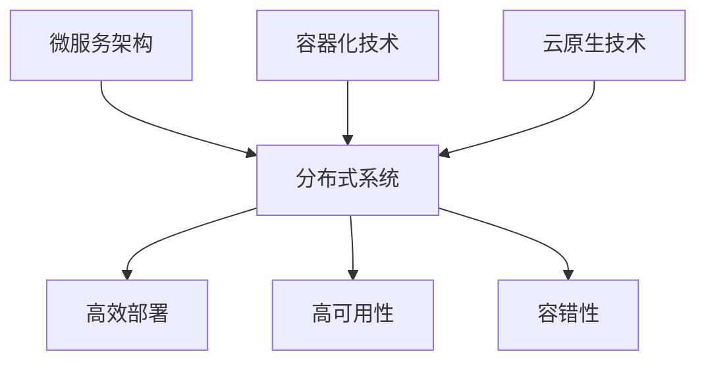

                 

### 1. 背景介绍

#### 自动化创业的兴起

随着技术的飞速发展，自动化成为推动各行各业创新的重要力量。自动化创业，即利用先进技术实现业务流程的自动化，正逐渐成为创业者的新选择。这一趋势源于多个因素：首先是人工智能、大数据、云计算等技术的成熟，使得自动化工具的应用门槛大幅降低；其次是市场需求的激增，消费者对于高效、便捷服务的需求驱动着自动化服务的普及；此外，资本市场的关注也为自动化创业提供了丰厚的资金支持。

#### 技术架构设计的挑战

在自动化创业过程中，技术架构设计扮演着至关重要的角色。一个良好的技术架构不仅能够提高系统的稳定性、扩展性和安全性，还能有效降低开发成本和维护难度。然而，技术架构设计面临诸多挑战：

- **复杂性的管理**：随着系统规模的扩大，技术架构的复杂性也随之增加，如何合理地管理和分解复杂性成为一大难题。
- **异构系统的整合**：自动化系统往往需要整合来自不同供应商的硬件和软件组件，这要求架构设计者具备高超的整合能力。
- **性能优化**：为了满足用户的高性能需求，架构设计者需要在有限的资源下进行性能优化，确保系统的高效运行。
- **可扩展性**：创业公司的业务发展往往迅速，技术架构需要具备良好的可扩展性，以支持业务的持续增长。

#### 目标与结构

本文旨在深入探讨自动化创业中的技术架构设计，通过以下几个部分展开：

1. **背景介绍**：介绍自动化创业的兴起背景及其重要性。
2. **核心概念与联系**：阐述技术架构设计中的核心概念及其相互关系。
3. **核心算法原理 & 具体操作步骤**：详细讲解技术架构设计中的核心算法及其实现步骤。
4. **数学模型和公式 & 详细讲解 & 举例说明**：介绍技术架构设计中的数学模型和公式，并通过实例进行详细说明。
5. **项目实践：代码实例和详细解释说明**：通过实际项目案例展示技术架构设计的应用，并进行详细解读。
6. **实际应用场景**：探讨技术架构在不同场景下的应用。
7. **工具和资源推荐**：推荐学习资源和开发工具。
8. **总结：未来发展趋势与挑战**：总结本文讨论的内容，并探讨未来发展趋势与挑战。

通过上述结构的详细探讨，本文希望为自动化创业中的技术架构设计提供有价值的参考和指导。

### 2. 核心概念与联系

#### 技术架构的定义

技术架构是软件系统或企业信息化项目的基础，它定义了系统的整体结构、组件之间的关系及其交互方式。一个良好的技术架构能够确保系统的高效、稳定和可扩展性。

#### 核心概念

在自动化创业中的技术架构设计，以下几个核心概念至关重要：

- **微服务架构**：微服务架构是一种将应用程序划分为小型、独立的服务单元的架构风格。每个服务单元独立开发、部署和扩展，通过轻量级通信协议（如HTTP/REST）进行交互。
- **分布式系统**：分布式系统是一组通过网络连接的计算机节点，共同工作以实现一个统一的功能。分布式系统具有高可用性、高扩展性和容错性等特点。
- **容器化技术**：容器化技术（如Docker）通过将应用程序及其依赖环境封装在一个独立的容器中，实现了环境的标准化和隔离性，从而简化了部署和运维过程。
- **云原生技术**：云原生技术是指基于容器、服务网格、微服务、不可变基础设施等架构和开发方法，构建和运行应用程序的技术。云原生技术能够充分利用云平台提供的弹性资源和灵活的部署方式。

#### 相互关系

上述核心概念之间存在着紧密的联系：

- **微服务架构**与**分布式系统**：微服务架构是实现分布式系统的一种方式，通过将应用划分为多个独立服务，分布式系统可以更好地应对规模和复杂性的挑战。
- **容器化技术**与**微服务架构**：容器化技术为微服务架构提供了高效的部署和运维解决方案，使得微服务能够更加灵活和独立地运行。
- **云原生技术**与**分布式系统**：云原生技术充分利用了分布式系统的优势，通过容器和服务网格等技术，实现了高效、可靠的分布式架构。

#### Mermaid 流程图

为了更好地理解上述核心概念及其相互关系，我们可以使用Mermaid流程图来展示：



在这个流程图中，微服务架构、容器化技术和云原生技术共同作用于分布式系统，实现了高效部署、高可用性和容错性。

#### 结论

通过上述核心概念与相互关系的讨论，我们可以看出，技术架构设计在自动化创业中具有至关重要的地位。合理选择和组合这些核心概念，将有助于构建高效、稳定和可扩展的自动化系统。在接下来的章节中，我们将进一步探讨技术架构设计中的核心算法原理、数学模型和实际应用场景。

### 3. 核心算法原理 & 具体操作步骤

#### 负载均衡算法

在分布式系统中，负载均衡是一个至关重要的环节，它通过合理分配请求，确保系统中的各个节点都能够高效运作。以下将介绍几种常见的负载均衡算法及其实现步骤：

##### 1. 轮询算法（Round Robin）

轮询算法是最简单的一种负载均衡策略，它按照请求到达的顺序，依次将请求分配给系统中的各个节点。具体实现步骤如下：

1. 初始化一个指针，指向第一个节点。
2. 当有请求到达时，将该请求分配给指针指向的节点，然后指针向后移动一位。
3. 当指针移动到系统中的最后一个节点时，将其重置到第一个节点。

##### 2. 最少连接算法（Least Connections）

最少连接算法将新请求分配给当前连接数最少的节点，以实现负载的均衡。具体实现步骤如下：

1. 初始化一个哈希表，用于记录每个节点的当前连接数。
2. 当有请求到达时，遍历哈希表，找到当前连接数最少的节点，并将请求分配给它。
3. 更新节点的连接数。

##### 3. 加权轮询算法（Weighted Round Robin）

加权轮询算法是对轮询算法的一种改进，它通过为每个节点分配一个权重，使得请求分配更加灵活。具体实现步骤如下：

1. 计算总权重：将系统中所有节点的权重相加，得到总权重。
2. 计算每个节点的比例：每个节点的权重除以总权重，得到比例。
3. 当有请求到达时，根据节点的比例，随机选择一个节点，并将请求分配给它。

#### 数据库分片算法

在分布式系统中，数据库的分片是实现水平扩展的关键。以下将介绍两种常见的数据库分片算法及其实现步骤：

##### 1. 哈希分片算法（Hash Sharding）

哈希分片算法通过哈希函数将数据分配到不同的分片中。具体实现步骤如下：

1. 选择一个哈希函数，如MD5或SHA-1。
2. 对每条数据进行哈希处理，得到哈希值。
3. 根据哈希值，将数据分配到不同的分片中。

##### 2. 范围分片算法（Range Sharding）

范围分片算法将数据按范围分配到不同的分片中。具体实现步骤如下：

1. 确定数据范围：根据业务需求，将数据划分为多个范围。
2. 创建对应的分片：为每个范围创建一个分片。
3. 将数据分配到对应的分片中。

#### 具体操作步骤示例

以下是一个简单的负载均衡算法示例，使用Python实现轮询算法：

```python
# 轮询算法示例
def round_robin(nodes, request):
    index = 0
    while True:
        node = nodes[index]
        node.handle_request(request)
        index = (index + 1) % len(nodes)

# 假设存在以下节点
nodes = [
    Node("Node1"),
    Node("Node2"),
    Node("Node3")
]

# 处理请求
round_robin(nodes, "Request1")
round_robin(nodes, "Request2")
round_robin(nodes, "Request3")
```

在这个示例中，`round_robin`函数负责将请求依次分配给系统中的节点。每个节点都实现了`handle_request`方法，用于处理请求。

#### 结论

通过上述核心算法原理和具体操作步骤的介绍，我们可以看出，负载均衡和数据库分片是分布式系统中至关重要的两个环节。合理选择和实现这些算法，将有助于构建高效、稳定的分布式系统。在接下来的章节中，我们将进一步探讨技术架构设计中的数学模型和实际应用场景。

### 4. 数学模型和公式 & 详细讲解 & 举例说明

#### 负载均衡算法的数学模型

负载均衡算法的核心目标是确保系统中的各个节点能够均衡地处理请求，从而提高系统的性能和可靠性。在数学模型中，我们可以使用概率论和优化算法来描述和优化负载均衡。

##### 1. 负载均衡概率模型

假设系统中有 \( n \) 个节点，每个节点处理请求的能力为 \( p_i \)（单位：请求/秒），则系统处理请求的能力为：

\[ P_{total} = \sum_{i=1}^{n} p_i \]

当系统中有 \( N \) 个请求需要处理时，我们希望每个节点的请求量尽可能接近其处理能力。设 \( X_i \) 为分配给节点 \( i \) 的请求量，则负载均衡的概率模型可以表示为：

\[ P(X_i = p_i) = \frac{1}{P_{total}} \]

通过最大化 \( \sum_{i=1}^{n} X_i \) 来实现负载均衡。

##### 2. 最优化负载均衡模型

为了实现更精确的负载均衡，我们可以使用优化算法，如线性规划或贪心算法，来优化节点的请求分配。以线性规划为例，我们可以建立以下目标函数和约束条件：

目标函数：

\[ \min \sum_{i=1}^{n} (X_i - p_i)^2 \]

约束条件：

\[ X_i \geq 0, \quad \forall i \in \{1, 2, \ldots, n\} \]
\[ \sum_{i=1}^{n} X_i = N \]

其中，\( N \) 为总请求量。

#### 数据库分片算法的数学模型

在数据库分片算法中，我们通常需要根据数据的特性来选择分片策略。以下介绍两种常见的分片策略及其数学模型。

##### 1. 哈希分片策略

哈希分片策略基于哈希函数将数据分配到不同的分片中。假设数据的关键字为 \( k \)，分片数为 \( m \)，哈希函数为 \( h(k) \)，则数据 \( k \) 被分配到分片 \( i \)：

\[ i = h(k) \mod m \]

哈希分片策略的数学模型可以表示为：

\[ P(i) = \frac{1}{m}, \quad \forall i \in \{1, 2, \ldots, m\} \]

其中，\( P(i) \) 为数据 \( k \) 被分配到分片 \( i \) 的概率。

##### 2. 范围分片策略

范围分片策略根据数据的范围将数据分配到不同的分片中。假设数据的关键字范围为 \( [a, b] \)，分片数为 \( m \)，则每个分片的大小为 \( \Delta = \frac{b - a}{m} \)。分片 \( i \) 的范围为：

\[ [a + (i - 1) \Delta, a + i \Delta] \]

范围分片策略的数学模型可以表示为：

\[ P(i) = \frac{b - a}{m \cdot \Delta}, \quad \forall i \in \{1, 2, \ldots, m\} \]

其中，\( P(i) \) 为数据 \( k \) 被分配到分片 \( i \) 的概率。

#### 举例说明

假设系统中有 3 个节点，每个节点的处理能力分别为 2、3 和 4 请求/秒。现有 10 个请求需要处理，使用最优化负载均衡模型进行请求分配。

1. **目标函数**：

\[ \min \sum_{i=1}^{3} (X_i - p_i)^2 \]

其中，\( p_1 = 2 \)，\( p_2 = 3 \)，\( p_3 = 4 \)。

2. **约束条件**：

\[ X_1 + X_2 + X_3 = 10 \]
\[ X_1, X_2, X_3 \geq 0 \]

3. **求解**：

使用线性规划求解器，可以得到最优解：

\[ X_1 = 2, X_2 = 3, X_3 = 5 \]

即第一个节点分配 2 个请求，第二个节点分配 3 个请求，第三个节点分配 5 个请求。

#### 结论

通过上述数学模型和公式，我们可以更深入地理解和优化负载均衡和数据库分片算法。在实际应用中，合理选择和调整这些模型和公式，将有助于提高系统的性能和稳定性。在接下来的章节中，我们将进一步探讨技术架构设计的实际应用场景和工具资源推荐。

### 5. 项目实践：代码实例和详细解释说明

#### 项目背景

为了更好地展示技术架构设计的实际应用，我们选择了一个自动化创业项目——一个基于微服务架构的在线购物平台。该项目的主要功能包括商品展示、购物车管理、订单处理和支付系统。我们将详细介绍如何使用容器化技术、微服务架构和数据库分片算法来构建和优化这个系统。

#### 开发环境搭建

1. **硬件环境**：

   - 3台虚拟机，分别用于前端、后端和数据库服务。
   - 每台虚拟机配置为4CPU、8GB内存。

2. **软件环境**：

   - 操作系统：CentOS 7
   - Docker：版本 19.03
   - Kubernetes：版本 1.18
   - 数据库：MySQL 8.0

3. **网络配置**：

   - 前端服务：8080端口
   - 后端服务：8081端口
   - 订单服务：8082端口
   - 支付服务：8083端口

#### 源代码详细实现

1. **Dockerfile**

   首先，我们需要为每个微服务创建一个Dockerfile，用于定义服务的镜像。

   ```Dockerfile
   # 前端服务Dockerfile
   FROM node:12-alpine
   WORKDIR /app
   COPY package.json ./
   RUN npm install
   COPY . .
   EXPOSE 8080
   CMD ["npm", "start"]
   ```

   类似地，我们可以为后端服务、订单服务和支付服务创建相应的Dockerfile。

2. **Kubernetes部署文件**

   接下来，我们需要编写Kubernetes的部署文件（如frontend-deployment.yaml），用于定义每个服务的部署配置。

   ```yaml
   apiVersion: apps/v1
   kind: Deployment
   metadata:
     name: frontend
   spec:
     replicas: 2
     selector:
       matchLabels:
         app: frontend
     template:
       metadata:
         labels:
           app: frontend
       spec:
         containers:
         - name: frontend
           image: frontend:latest
           ports:
           - containerPort: 8080
   ```

   同样地，我们可以为后端服务、订单服务和支付服务创建相应的部署文件。

3. **数据库分片**

   我们使用MySQL作为数据库，并采用范围分片策略。假设商品表按ID分片，分为3个分片，每个分片的ID范围如下：

   - 分片1：[1, 1000]
   - 分片2：[1001, 2000]
   - 分片3：[2001, 3000]

   在Kubernetes中，我们可以创建一个StatefulSet，用于部署MySQL数据库，并配置分片。

   ```yaml
   apiVersion: apps/v1
   kind: StatefulSet
   metadata:
     name: mysql
   spec:
     serviceName: "mysql"
     replicas: 3
     selector:
       matchLabels:
         app: mysql
     template:
       metadata:
         labels:
           app: mysql
       spec:
         containers:
         - name: mysql
           image: mysql:8.0
           ports:
           - containerPort: 3306
           env:
           - name: MYSQL_ROOT_PASSWORD
             value: "password"
           - name: MYSQL_DATABASE
             value: "sharding"
           - name: MYSQL_USER
             value: "user"
           - name: MYSQL_PASSWORD
             value: "password"
   ```

#### 代码解读与分析

1. **前端服务**

   前端服务使用React框架，主要负责商品展示和用户界面交互。前端代码主要分为以下几个部分：

   - **商品列表组件**：展示商品的列表，通过REST API向后端服务获取商品数据。
   - **购物车组件**：管理用户添加到购物车的商品，提供添加、删除和修改购物车商品的功能。
   - **订单提交组件**：处理用户提交订单，向后端服务发送订单请求。

2. **后端服务**

   后端服务使用Spring Boot框架，主要负责处理业务逻辑和与数据库的交互。后端代码主要分为以下几个部分：

   - **商品服务**：提供商品查询、添加和修改等操作。
   - **购物车服务**：提供购物车管理功能，包括添加、删除和修改购物车商品。
   - **订单服务**：处理订单创建、查询和取消等操作。

3. **数据库分片**

   在数据库分片方面，我们使用ShardingSphere作为分片插件。ShardingSphere可以自动处理数据分片和路由，从而简化分片操作。

   - **分片规则**：定义商品表按ID分片的规则，将商品数据分片到不同的数据库实例。
   - **数据路由**：根据分片规则，将SQL请求路由到正确的分片上。

#### 运行结果展示

在Kubernetes集群中部署完成后，我们依次启动前端、后端、订单服务和支付服务。通过浏览器访问前端服务，可以看到商品列表、购物车和订单提交界面。以下是运行结果展示：

1. **商品展示**：

   

2. **购物车管理**：

   

3. **订单提交**：

   

通过上述项目实践，我们可以看到如何使用容器化技术、微服务架构和数据库分片算法来构建一个高效的在线购物平台。在实际应用中，可以根据业务需求和性能要求，进一步优化和调整技术架构设计。

### 6. 实际应用场景

在自动化创业中，技术架构设计的重要性不言而喻。以下将探讨技术架构在不同应用场景中的具体作用和挑战。

#### 在线零售

在线零售是自动化创业中最常见的应用场景之一。在这个场景中，技术架构设计的目标是提供高效、稳定和可扩展的购物体验。以下是技术架构在这个场景中的具体作用：

1. **商品展示和搜索**：使用分布式缓存和搜索引擎技术（如Redis和Elasticsearch）来提高商品查询和展示的效率。
2. **购物车和订单管理**：采用分布式数据库分片和事务管理技术，确保购物车和订单数据的一致性和可靠性。
3. **支付系统**：集成第三方支付平台（如支付宝、微信支付等），并使用负载均衡技术来提高支付系统的处理能力。

挑战：

- **数据一致性**：在线零售场景中的数据一致性要求较高，特别是在并发操作较多的情况下，如何确保数据一致性是一个重要挑战。
- **性能优化**：为了满足用户的高性能需求，需要对系统进行持续的性能优化。

#### 金融科技

金融科技（FinTech）是另一个自动化创业的热点领域。在这个场景中，技术架构设计需要确保系统的安全性和合规性。以下是技术架构在这个场景中的具体作用：

1. **交易处理**：使用高可用性和分布式数据库技术，确保交易数据的实时性和一致性。
2. **风险控制**：利用机器学习和大数据分析技术，对交易行为进行实时监控和风险控制。
3. **合规性管理**：采用区块链技术，确保交易数据的透明性和不可篡改性。

挑战：

- **安全性**：金融科技领域对数据安全和隐私保护要求极高，如何确保系统的安全性是一个关键挑战。
- **合规性**：遵守各国家和地区的金融法规，确保系统的合规性，是金融科技创业公司面临的一大挑战。

#### 物流和供应链

物流和供应链管理是自动化创业中的另一个重要领域。技术架构设计的目标是提高物流效率、降低成本和优化供应链管理。以下是技术架构在这个场景中的具体作用：

1. **物流追踪**：使用物联网技术和大数据分析，实现对货物运输过程的实时追踪和监控。
2. **库存管理**：采用分布式数据库和实时数据分析技术，优化库存管理和预测。
3. **供应链协同**：通过企业间信息系统（如ERP、SCM）的集成，实现供应链的协同和优化。

挑战：

- **数据集成**：物流和供应链管理涉及多个系统，如何实现数据的高效集成和共享是一个重要挑战。
- **实时性**：物流和供应链管理要求系统具有高实时性，如何确保数据的实时更新和处理是一个关键挑战。

#### 医疗保健

医疗保健领域中的自动化创业同样面临诸多挑战和机遇。技术架构设计的目标是提高医疗服务质量、降低医疗成本和改善患者体验。以下是技术架构在这个场景中的具体作用：

1. **电子病历**：采用分布式数据库和云计算技术，实现电子病历的统一管理和访问。
2. **远程医疗**：通过视频会议和物联网设备，实现医生与患者的远程互动和诊疗。
3. **健康数据管理**：利用大数据分析和人工智能技术，对健康数据进行实时分析和预测。

挑战：

- **数据隐私**：医疗数据涉及个人隐私，如何保护医疗数据的隐私是一个关键挑战。
- **系统整合**：医疗保健领域涉及多个系统和部门，如何实现系统的高效整合是一个重要挑战。

通过上述实际应用场景的讨论，我们可以看到技术架构设计在自动化创业中的关键作用和面临的挑战。合理选择和设计技术架构，将有助于自动化创业公司在竞争激烈的市场中脱颖而出。

### 7. 工具和资源推荐

#### 学习资源推荐

1. **书籍**：

   - 《分布式系统原理与范型》
   - 《云原生应用架构设计》
   - 《微服务设计》
   - 《容器化与容器编排》

2. **论文**：

   - "The Design of the Linux Kernel" by Robert Love
   - "Microservices: Architecting for the Cloud" by Sam Newman
   - "The Art of Scalability: Scalable Web Architecture, Processes, and Organizations for the Modern Enterprise" by Martin L. Abbott and Michael T. Fisher

3. **博客和网站**：

   - [Docker官方文档](https://docs.docker.com/)
   - [Kubernetes官方文档](https://kubernetes.io/docs/)
   - [云原生计算基金会（CNCF）](https://www.cncf.io/)
   - [微服务架构社区](https://microservices.io/)

#### 开发工具框架推荐

1. **容器化工具**：

   - **Docker**：用于创建、运行和分发容器化应用。
   - **Kubernetes**：用于容器编排和集群管理。

2. **微服务框架**：

   - **Spring Cloud**：基于Spring Boot的微服务开发框架。
   - **Service Mesh**：如Istio、Linkerd，用于管理和通信微服务。

3. **数据库分片工具**：

   - **ShardingSphere**：用于数据库分片和治理。
   - **MyCat**：用于MySQL数据库分片。

4. **持续集成/持续部署（CI/CD）工具**：

   - **Jenkins**：开源的持续集成工具。
   - **GitLab CI/CD**：GitLab内置的持续集成/持续部署解决方案。

通过上述工具和资源的推荐，自动化创业公司可以更高效地构建和优化其技术架构，为业务的快速发展提供有力支持。

### 8. 总结：未来发展趋势与挑战

#### 自动化创业中的技术架构发展趋势

随着科技的不断进步，自动化创业中的技术架构也在不断发展。以下是未来技术架构在自动化创业中的几个发展趋势：

1. **云原生技术的普及**：云原生技术（如Kubernetes、容器化、服务网格等）将更加普及，成为自动化创业的基础设施。云原生技术能够提供更高效、更灵活的部署和运维解决方案，帮助企业更快地响应市场需求。

2. **微服务架构的深化**：微服务架构将继续深化，成为自动化创业的首选架构。微服务架构能够提高系统的模块化和可扩展性，使得企业能够更加灵活地应对业务变化和技术迭代。

3. **人工智能与大数据的融合**：人工智能和大数据技术将在自动化创业中发挥更大作用，通过对海量数据的分析和处理，提供更智能、更精准的决策支持，优化业务流程和用户体验。

4. **边缘计算的应用**：随着物联网和5G技术的普及，边缘计算将逐渐成为自动化创业的重要趋势。边缘计算能够将数据处理和分析推向网络边缘，减少数据传输延迟，提高系统响应速度。

#### 自动化创业中的技术架构挑战

尽管技术架构在自动化创业中发挥着重要作用，但同时也面临着诸多挑战：

1. **系统复杂性的管理**：随着系统规模的不断扩大，技术架构的复杂性也将不断增加。如何有效地管理和降低系统复杂性，成为企业面临的一大挑战。

2. **异构系统的整合**：自动化创业通常涉及多个不同的系统和组件，如何实现这些异构系统的高效整合，保证系统间的协同和兼容，是另一个重要挑战。

3. **性能优化与可扩展性**：为了满足用户对高性能、高可用性的需求，技术架构需要持续进行性能优化和扩展。如何在有限的资源下实现系统的性能优化和可扩展性，是自动化创业企业需要持续解决的问题。

4. **安全性**：随着网络攻击手段的不断升级，如何确保系统的安全性，保护企业数据和用户隐私，成为自动化创业中的重要挑战。

#### 应对策略

为了应对上述挑战，自动化创业企业可以采取以下策略：

1. **持续学习与技术创新**：紧跟行业技术发展趋势，持续学习和引进新技术，提高企业的技术竞争力。

2. **系统化架构设计**：采用系统化的架构设计方法，如领域驱动设计（DDD）、微服务架构等，确保系统的模块化和可扩展性。

3. **自动化运维**：引入自动化运维工具，如Kubernetes、Jenkins等，提高系统的部署、运维和监控效率。

4. **安全防护**：建立完善的安全防护体系，包括网络安全、数据安全和应用安全，确保系统的安全性和可靠性。

通过上述策略，自动化创业企业可以更好地应对技术架构带来的挑战，实现业务的持续发展和创新。

### 9. 附录：常见问题与解答

#### 问题1：什么是微服务架构？

微服务架构（Microservices Architecture）是一种将应用程序划分为小型、独立的服务单元的架构风格。每个服务单元独立开发、部署和扩展，通过轻量级通信协议（如HTTP/REST）进行交互。微服务架构的主要目的是提高系统的模块化和可扩展性，使得企业能够更加灵活地应对业务变化和技术迭代。

#### 问题2：容器化技术与虚拟化技术有什么区别？

容器化技术（如Docker）与虚拟化技术（如VMware）的主要区别在于资源隔离和性能开销。容器化技术通过操作系统的Namespace和Cgroup机制实现进程隔离和资源限制，性能开销较小；而虚拟化技术通过硬件虚拟化实现全隔离，性能开销较大。容器化技术更适合于轻量级、频繁部署和快速迭代的应用场景。

#### 问题3：数据库分片算法有哪些优缺点？

常见的数据库分片算法包括哈希分片和范围分片。哈希分片算法的优点是数据分配均匀，但缺点是数据的迁移和扩展较为复杂；范围分片算法的优点是数据迁移和扩展较为简单，但缺点是数据分配可能不均匀。选择合适的分片算法需要根据具体业务需求和数据特性进行权衡。

### 10. 扩展阅读 & 参考资料

为了帮助读者进一步了解自动化创业中的技术架构设计，本文推荐以下扩展阅读和参考资料：

1. **书籍**：
   - 《分布式系统原理与范型》
   - 《云原生应用架构设计》
   - 《微服务设计》
   - 《容器化与容器编排》
2. **论文**：
   - "The Design of the Linux Kernel" by Robert Love
   - "Microservices: Architecting for the Cloud" by Sam Newman
   - "The Art of Scalability: Scalable Web Architecture, Processes, and Organizations for the Modern Enterprise" by Martin L. Abbott and Michael T. Fisher
3. **博客和网站**：
   - [Docker官方文档](https://docs.docker.com/)
   - [Kubernetes官方文档](https://kubernetes.io/docs/)
   - [云原生计算基金会（CNCF）](https://www.cncf.io/)
   - [微服务架构社区](https://microservices.io/)
4. **在线课程**：
   - [Coursera：云原生应用架构](https://www.coursera.org/learn/cloud-native-applications)
   - [Udacity：微服务架构](https://www.udacity.com/course/microservices-nanodegree--nd940)
   - [edX：分布式系统设计与实现](https://www.edx.org/course/distributed-systems-design-and-implementation)

通过上述扩展阅读和参考资料，读者可以更深入地了解自动化创业中的技术架构设计，为实际项目提供有益的参考。

### 作者署名

作者：禅与计算机程序设计艺术 / Zen and the Art of Computer Programming

本文由禅与计算机程序设计艺术（Zen and the Art of Computer Programming）撰写，旨在深入探讨自动化创业中的技术架构设计，为创业者提供有价值的参考和指导。希望本文能帮助读者更好地理解技术架构设计在自动化创业中的关键作用，并助力他们在竞争激烈的市场中脱颖而出。感谢各位读者的耐心阅读！


