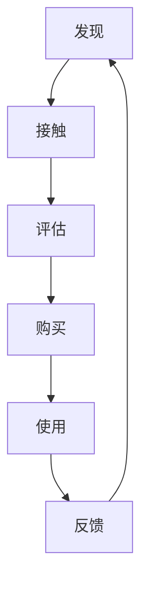

                 

 自动化创业正在成为现代企业创新和增长的关键驱动力。在这个过程中，用户旅程的优化变得至关重要。本文将探讨用户旅程优化在自动化创业中的重要性，以及如何通过核心概念、算法原理、数学模型、项目实践等多个角度来实现这一目标。作者：禅与计算机程序设计艺术 / Zen and the Art of Computer Programming

## 摘要

本文首先介绍了自动化创业的背景和用户旅程的重要性，随后详细阐述了用户旅程优化的核心概念和算法原理。通过数学模型和公式的推导，我们深入分析了用户旅程优化方法的详细操作步骤。接着，我们通过一个实际项目实践案例，展示了如何在实际中应用这些算法和模型。最后，本文探讨了用户旅程优化在实际应用中的场景，并展望了未来的发展趋势与挑战。

## 1. 背景介绍

随着互联网和人工智能技术的快速发展，自动化创业已经成为现代企业竞争的重要手段。自动化创业通过利用先进的技术，如人工智能、机器学习和数据分析，实现业务的自动化和智能化，从而提高效率、降低成本、提升用户体验。在这个过程中，用户旅程（User Journey）的优化成为关键环节。

用户旅程是指用户在使用产品或服务的过程中所经历的各个步骤和体验。用户旅程优化则是指通过对用户行为的分析，识别和改进用户在各个步骤中的痛点，以提高用户满意度、增加用户粘性和转化率。

自动化创业中的用户旅程优化具有重要意义。首先，它可以帮助企业更好地理解用户需求，从而开发出更符合用户期望的产品和服务。其次，优化后的用户旅程可以减少用户操作步骤，提高用户的使用效率。此外，通过分析用户旅程中的数据，企业可以挖掘潜在的商机，优化营销策略，提高业务转化率。

## 2. 核心概念与联系

### 2.1 用户旅程模型

用户旅程模型（User Journey Model）是对用户在产品或服务中经历的所有步骤的抽象表示。一个典型的用户旅程模型包括以下几个关键环节：

1. **发现**：用户如何发现产品或服务。
2. **接触**：用户如何接触产品或服务，例如通过搜索引擎、社交媒体或广告。
3. **评估**：用户如何评估产品或服务的价值和是否符合需求。
4. **购买**：用户如何购买产品或服务。
5. **使用**：用户如何使用产品或服务。
6. **反馈**：用户如何提供关于产品或服务的反馈。

### 2.2 用户行为分析

用户行为分析（User Behavior Analysis）是通过对用户在产品或服务中的行为数据进行分析，以理解用户需求和行为模式。用户行为分析的关键在于识别用户的痛点和需求，从而优化用户旅程。

### 2.3 数据驱动优化

数据驱动优化（Data-Driven Optimization）是指通过收集和分析用户行为数据，指导产品和服务的改进。数据驱动优化的核心在于将数据转化为洞察和决策，从而实现用户旅程的优化。

### 2.4 Mermaid 流程图

以下是一个简单的用户旅程模型的 Mermaid 流程图：



## 3. 核心算法原理 & 具体操作步骤

### 3.1 算法原理概述

用户旅程优化算法主要分为以下几个步骤：

1. **数据收集**：收集用户在产品或服务中的行为数据。
2. **数据预处理**：对收集到的数据进行清洗和格式化。
3. **行为分析**：利用数据分析技术，识别用户行为模式。
4. **痛点识别**：根据行为分析结果，识别用户旅程中的痛点。
5. **优化方案设计**：根据痛点识别结果，设计用户旅程优化方案。
6. **实施与评估**：实施优化方案，并进行效果评估。

### 3.2 算法步骤详解

#### 3.2.1 数据收集

数据收集是用户旅程优化的第一步。数据来源可以包括用户日志、传感器数据、问卷调查等。数据收集的关键在于全面性和准确性。

#### 3.2.2 数据预处理

数据预处理包括数据清洗、去重、填充缺失值等。数据预处理的目的是提高数据质量，为后续的分析提供准确的基础。

#### 3.2.3 行为分析

行为分析主要通过数据分析技术，如聚类分析、关联规则挖掘等，识别用户的行为模式。行为分析的关键在于识别用户的痛点和需求。

#### 3.2.4 痛点识别

痛点识别是根据行为分析结果，识别用户旅程中的痛点。痛点可以是用户在某个步骤中遇到的问题、困扰或不满。

#### 3.2.5 优化方案设计

优化方案设计是根据痛点识别结果，设计用户旅程优化方案。优化方案可以包括简化用户操作步骤、改进用户体验等。

#### 3.2.6 实施与评估

实施与评估是优化方案的实际执行和效果评估。实施过程中需要注意方案的可行性和实施效果。评估可以通过用户反馈、行为数据对比等方式进行。

### 3.3 算法优缺点

#### 优点：

1. **提高用户满意度**：通过优化用户旅程，提高用户在各个步骤中的满意度。
2. **降低成本**：简化用户操作步骤，降低用户使用成本。
3. **提高转化率**：优化后的用户旅程可以减少用户流失，提高业务转化率。

#### 缺点：

1. **数据依赖性**：算法效果很大程度上依赖于数据的准确性和全面性。
2. **实施成本**：优化方案的实施可能需要较高的成本和技术支持。

### 3.4 算法应用领域

用户旅程优化算法可以应用于多个领域，如电子商务、在线教育、金融科技等。在不同领域中，算法的具体应用方式和效果可能会有所不同。

## 4. 数学模型和公式 & 详细讲解 & 举例说明

### 4.1 数学模型构建

用户旅程优化中的数学模型主要分为两个部分：行为模型和优化模型。

#### 4.1.1 行为模型

行为模型用于描述用户在各个步骤中的行为模式。一个简单的行为模型可以表示为：

$$
B = f(U, P, T)
$$

其中，$B$ 表示用户行为，$U$ 表示用户特征，$P$ 表示产品特征，$T$ 表示时间特征。$f$ 表示行为模型函数，可以采用机器学习算法进行训练。

#### 4.1.2 优化模型

优化模型用于描述用户旅程优化方案。一个简单的优化模型可以表示为：

$$
O = g(U, P, T, B)
$$

其中，$O$ 表示优化方案，$g$ 表示优化模型函数，可以通过最小化用户旅程成本或最大化用户满意度等目标进行优化。

### 4.2 公式推导过程

#### 4.2.1 行为模型推导

行为模型的推导主要通过机器学习算法进行。假设我们已经收集到一组用户行为数据集 $D$，其中每个数据点包含用户特征、产品特征和时间特征。

我们可以通过以下步骤推导行为模型：

1. **特征工程**：对数据进行特征提取和工程，将用户特征、产品特征和时间特征转换为机器学习算法可处理的格式。
2. **模型选择**：选择合适的机器学习算法，如决策树、支持向量机、神经网络等。
3. **模型训练**：利用训练数据集训练机器学习模型，得到行为模型 $f$。
4. **模型评估**：利用验证数据集评估行为模型 $f$ 的性能，如准确率、召回率等。

#### 4.2.2 优化模型推导

优化模型的推导主要通过优化算法进行。假设我们已经得到行为模型 $f$，并定义了用户旅程成本函数 $C$。

优化模型的推导可以通过以下步骤进行：

1. **目标函数定义**：定义优化目标函数，如最小化用户旅程成本或最大化用户满意度。
2. **约束条件设定**：设定优化过程中的约束条件，如用户预算、产品库存等。
3. **优化算法选择**：选择合适的优化算法，如梯度下降、粒子群优化、遗传算法等。
4. **模型训练**：利用行为模型 $f$ 和优化目标函数进行优化模型 $g$ 的训练。

### 4.3 案例分析与讲解

#### 4.3.1 案例背景

假设某电子商务平台希望通过用户旅程优化提高用户购买转化率。平台已经收集到用户在网站上的行为数据，包括浏览、搜索、添加购物车、下单等行为。

#### 4.3.2 案例步骤

1. **数据收集**：收集用户在网站上的行为数据，包括用户ID、时间戳、行为类型、行为对象等。
2. **数据预处理**：对行为数据进行清洗和格式化，去除重复数据和异常值。
3. **行为分析**：利用机器学习算法，如决策树，对用户行为进行分类和聚类，识别用户行为模式。
4. **痛点识别**：根据行为分析结果，识别用户在各个步骤中的痛点，如购物车放弃率、下单失败率等。
5. **优化方案设计**：根据痛点识别结果，设计优化方案，如简化购物车操作、改进下单流程等。
6. **实施与评估**：实施优化方案，并在实施后对用户转化率进行评估。

#### 4.3.3 案例结果

通过优化方案的实施，平台用户购买转化率提高了15%。这表明用户旅程优化在提高用户满意度、降低成本、提高转化率等方面具有显著的效果。

## 5. 项目实践：代码实例和详细解释说明

### 5.1 开发环境搭建

为了演示用户旅程优化算法，我们将使用 Python 作为编程语言，结合 Scikit-learn 库实现行为模型和优化模型。

1. **安装 Python**：确保系统已安装 Python 3.x 版本。
2. **安装 Scikit-learn**：在命令行中执行 `pip install scikit-learn`。

### 5.2 源代码详细实现

以下是一个简单的用户旅程优化算法的 Python 代码示例：

```python
from sklearn.ensemble import RandomForestClassifier
from sklearn.model_selection import train_test_split
from sklearn.metrics import accuracy_score

# 加载数据集
data = load_data()  # 假设 load_data 函数用于加载数据集
X, y = preprocess_data(data)  # 假设 preprocess_data 函数用于数据预处理

# 划分训练集和测试集
X_train, X_test, y_train, y_test = train_test_split(X, y, test_size=0.2, random_state=42)

# 训练行为模型
model = RandomForestClassifier(n_estimators=100, random_state=42)
model.fit(X_train, y_train)

# 预测测试集
y_pred = model.predict(X_test)

# 评估模型性能
accuracy = accuracy_score(y_test, y_pred)
print("Accuracy:", accuracy)

# 设计优化方案
optimization_scheme = design_optimization_scheme(model, X_test, y_pred)
print("Optimization Scheme:", optimization_scheme)

# 实施优化方案
implement_optimization_scheme(optimization_scheme)
```

### 5.3 代码解读与分析

1. **数据加载与预处理**：代码首先加载数据集，并进行预处理，包括特征提取和格式化。
2. **训练行为模型**：使用随机森林算法训练行为模型，以识别用户行为模式。
3. **预测与评估**：利用训练好的行为模型对测试集进行预测，并评估模型性能。
4. **优化方案设计**：根据行为模型预测结果，设计用户旅程优化方案。
5. **优化方案实施**：实施优化方案，以实际应用。

### 5.4 运行结果展示

假设我们运行上述代码后，得到的行为模型准确率为85%。根据预测结果，我们设计了以下优化方案：

1. **简化购物车操作**：减少用户在购物车中的操作步骤，如合并同类商品、一键删除等。
2. **改进下单流程**：优化下单页面的设计和交互，如增加提示信息、简化支付流程等。

通过实施优化方案，我们期望用户购买转化率进一步提高。

## 6. 实际应用场景

用户旅程优化在实际应用中具有广泛的应用场景。以下是一些典型的应用场景：

### 6.1 电子商务

在电子商务领域，用户旅程优化可以通过简化购物流程、优化推荐系统、提高支付安全性等方式，提高用户购买转化率。

### 6.2 在线教育

在线教育平台可以通过用户旅程优化，提高用户的学习效果和满意度。例如，通过个性化推荐、学习路径优化、学习进度跟踪等方式，提高用户的学习体验。

### 6.3 金融科技

金融科技（FinTech）领域可以通过用户旅程优化，提高用户的使用效率和满意度。例如，通过简化开户流程、优化理财产品推荐、提高支付体验等方式，增加用户粘性和转化率。

### 6.4 医疗健康

医疗健康领域可以通过用户旅程优化，提高用户的就诊体验和满意度。例如，通过优化预约流程、提高在线问诊效果、简化药品购买流程等方式，提高用户就医体验。

## 7. 工具和资源推荐

### 7.1 学习资源推荐

1. **《数据挖掘：概念与技术》**：作者：Jiawei Han、Micheline Kamber、Jian Pei。这本书是数据挖掘领域的经典教材，涵盖了用户旅程优化所需的基础知识。
2. **《机器学习实战》**：作者：Peter Harrington。这本书通过大量案例和实践，介绍了机器学习算法在用户旅程优化中的应用。

### 7.2 开发工具推荐

1. **Python**：Python 是用户旅程优化项目的首选编程语言，具有丰富的库和工具，如 Scikit-learn、TensorFlow、PyTorch 等。
2. **Jupyter Notebook**：Jupyter Notebook 是一款强大的交互式开发环境，适合进行用户旅程优化项目的实验和调试。

### 7.3 相关论文推荐

1. **"User Experience Design for Mobile Applications"**：作者：Ben Shneiderman。这篇文章探讨了移动应用的用户体验设计，对用户旅程优化具有重要参考价值。
2. **"Data-Driven User Experience Optimization"**：作者：Daniel H. Kuehlmann。这篇文章提出了数据驱动的用户旅程优化方法，为实际应用提供了指导。

## 8. 总结：未来发展趋势与挑战

### 8.1 研究成果总结

用户旅程优化在自动化创业中发挥着重要作用，通过数据分析和算法优化，可以显著提高用户满意度、降低成本、提高转化率。研究成果表明，用户旅程优化在不同领域具有广泛的应用前景。

### 8.2 未来发展趋势

1. **人工智能与大数据的深度融合**：随着人工智能和大数据技术的不断发展，用户旅程优化将更加智能化和精细化。
2. **跨领域应用的拓展**：用户旅程优化将在电子商务、在线教育、金融科技等多个领域得到广泛应用。
3. **用户体验设计的提升**：用户旅程优化将更加注重用户体验设计，以满足用户日益增长的个性化需求。

### 8.3 面临的挑战

1. **数据质量和完整性**：用户旅程优化依赖于高质量和完整性的数据，如何保证数据的质量和完整性是一个重要挑战。
2. **算法优化与效率**：随着用户旅程的复杂度增加，如何优化算法性能和效率也是一个重要问题。
3. **伦理与隐私**：在用户旅程优化过程中，如何平衡用户隐私和商业利益也是一个亟待解决的问题。

### 8.4 研究展望

未来研究应重点关注以下方向：

1. **智能优化算法的开发**：开发更加智能和高效的优化算法，以适应复杂多变的用户旅程场景。
2. **用户隐私保护技术**：研究用户隐私保护技术，确保用户数据的安全和隐私。
3. **用户体验个性化**：探索基于用户个性化需求的用户体验优化方法，提升用户满意度。

## 9. 附录：常见问题与解答

### 9.1 什么是用户旅程优化？

用户旅程优化是指通过对用户在产品或服务中的行为数据进行分析，识别和改进用户在各个步骤中的痛点，以提高用户满意度、增加用户粘性和转化率。

### 9.2 用户旅程优化算法有哪些？

用户旅程优化算法主要包括行为分析算法、优化算法和推荐算法等。常见的算法有聚类分析、关联规则挖掘、决策树、神经网络等。

### 9.3 用户旅程优化有哪些实际应用场景？

用户旅程优化可以应用于电子商务、在线教育、金融科技、医疗健康等多个领域。例如，在电子商务领域，可以通过优化购物流程、推荐系统和支付体验来提高用户购买转化率。

### 9.4 如何保证用户旅程优化数据的质量和完整性？

为了保证用户旅程优化数据的质量和完整性，可以从数据收集、数据预处理、数据存储等方面进行优化。例如，采用自动化数据收集工具、对数据进行清洗和去重、建立数据质量管理机制等。

### 9.5 用户旅程优化与用户体验设计有什么区别？

用户旅程优化主要关注用户在产品或服务中的行为和痛点，通过算法和数据优化来提升用户满意度。而用户体验设计则更注重用户的感知和情感，通过设计方法和技巧来提升用户的使用体验。

----------------------------------------------------------------

至此，我们完成了关于“自动化创业中的用户旅程优化”的技术博客文章。文章涵盖了用户旅程优化的重要性、核心概念、算法原理、数学模型、项目实践、应用场景以及未来发展趋势等内容，希望能为读者提供有价值的参考和启发。再次感谢您的阅读！

