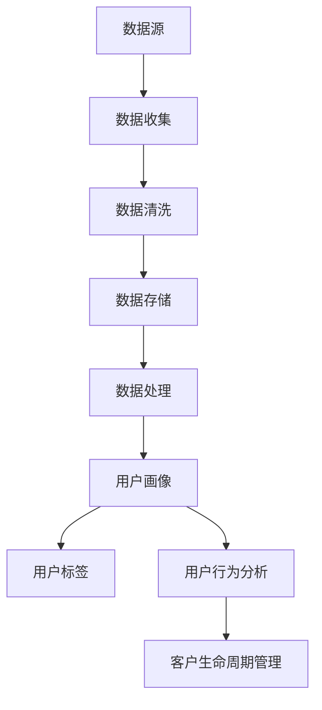

                 

### 背景介绍

在当今快速发展的数字经济时代，创业公司面临着前所未有的机遇与挑战。自动化技术的发展，尤其是人工智能和大数据分析的应用，为企业提供了前所未有的竞争优势。然而，为了充分利用这些技术，创业公司必须深入了解其目标用户，这便是用户画像分析的重要性所在。

用户画像分析是指通过收集和分析用户数据，构建出一个全面、动态的虚拟用户形象。这个过程涉及到数据的收集、处理、分析和应用，目的是为了更好地理解用户需求、行为和偏好，从而为产品开发和市场策略提供科学依据。

用户画像分析在自动化创业中的应用场景非常广泛。首先，在产品设计阶段，通过用户画像分析，创业公司可以精准定位目标用户群体，设计出更符合市场需求的产品。其次，在市场营销中，用户画像分析可以帮助企业制定更有针对性的营销策略，提高营销效果和转化率。此外，在客户服务方面，通过用户画像分析，企业可以提供更个性化、贴心的服务，提升用户满意度和忠诚度。

用户画像分析的核心价值在于其能够帮助企业实现数据驱动的决策，从而在激烈的市场竞争中脱颖而出。本文将深入探讨用户画像分析的理论基础、核心算法原理、具体实施步骤以及实际应用场景，旨在为自动化创业公司提供一套完整、实用的用户画像分析方案。

### 核心概念与联系

为了更好地理解用户画像分析，我们需要首先掌握几个核心概念，并了解它们之间的联系。以下是用户画像分析中一些关键概念的定义及其相互关系：

#### 1. 数据源

数据源是用户画像分析的基础，包括用户的个人信息、行为数据、消费记录、社交网络活动等。这些数据可以来自企业内部系统，如客户关系管理（CRM）系统、电商平台，也可以来自第三方数据提供商。

#### 2. 数据收集

数据收集是指通过多种渠道获取用户数据的过程。这包括在线数据采集、传感器数据收集、问卷调查等方式。数据收集过程中需要遵循数据隐私保护法规，确保用户数据的合法性和安全性。

#### 3. 数据清洗

数据清洗是指对收集到的数据进行整理、去重、去噪声等处理，以提高数据质量。数据清洗是用户画像分析的重要环节，因为高质量的数据是进行准确分析的前提。

#### 4. 数据存储

数据存储是指将清洗后的数据存储到数据库或数据仓库中，以便进行进一步的分析和处理。数据存储系统需要具备高可用性、可扩展性和数据安全性。

#### 5. 数据处理

数据处理是指通过数据挖掘、机器学习等技术对存储的数据进行加工，提取出有用的信息和规律。数据处理包括数据聚合、分类、聚类、关联分析等步骤。

#### 6. 用户画像

用户画像是一个全面、动态的虚拟用户形象，它通过整合用户的各种数据，形成对用户的全方位理解。用户画像通常包括用户的基本信息、行为特征、偏好、社会关系等维度。

#### 7. 用户标签

用户标签是对用户特征的一种简明表示，通常以关键词或标签的形式出现。用户标签可以帮助企业快速识别和分类用户，从而进行精准营销和服务。

#### 8. 用户行为分析

用户行为分析是通过分析用户的在线行为、消费行为等，了解用户的需求和偏好。用户行为分析的结果可以用于优化产品、改进服务和制定营销策略。

#### 9. 客户生命周期管理

客户生命周期管理是指从用户获取、用户留存、用户活跃到用户流失的全过程管理。通过用户画像分析，企业可以更好地管理客户生命周期，提升客户价值。

#### 关系与联系

这些概念之间的关系可以概括为：数据源是用户画像分析的起点，数据收集、数据清洗和数据存储是数据准备阶段，数据处理是实现用户画像的核心步骤，用户画像和用户标签是分析结果的呈现形式，用户行为分析和客户生命周期管理则是对用户画像的实际应用。

接下来，我们将通过一个Mermaid流程图来展示这些核心概念之间的联系：



通过这个流程图，我们可以清晰地看到用户画像分析的整体架构和关键环节。在接下来的章节中，我们将深入探讨每个环节的具体内容和实现方法。

### 核心算法原理 & 具体操作步骤

用户画像分析是一个复杂的过程，涉及多种算法和技术手段。下面，我们将详细讨论几种核心算法原理，并解释其具体操作步骤。

#### 1. 聚类算法

聚类算法是一种无监督学习方法，用于将相似的数据点划分为一组。在用户画像分析中，聚类算法可以帮助我们将大量用户数据划分为不同的群体，从而便于分析和处理。

常见的聚类算法包括K-means、DBSCAN等。

**K-means算法原理：**

K-means算法的目标是将数据点划分为K个簇，使得每个簇内部的点尽可能接近，而簇与簇之间的点尽可能远离。算法的基本步骤如下：

1. 随机选择K个初始中心点。
2. 将每个数据点分配到距离它最近的中心点所在的簇。
3. 重新计算每个簇的中心点。
4. 重复步骤2和3，直到中心点不再发生显著变化。

**具体操作步骤：**

1. 确定聚类个数K。可以通过肘部法则、 silhouette score等方法评估最佳K值。
2. 随机生成K个初始中心点。
3. 计算每个数据点到各个中心点的距离，并将其分配到最近的簇。
4. 重新计算每个簇的中心点。
5. 重复步骤3和4，直到收敛。

**案例：**

假设我们有一个包含用户年龄、收入、教育程度的数据集，我们希望使用K-means算法将其分为两个群体。

```python
from sklearn.cluster import KMeans
import pandas as pd

# 加载数据
data = pd.DataFrame({
    'age': [25, 30, 35, 40, 45],
    'income': [50000, 60000, 70000, 80000, 90000],
    'education': [12, 16, 14, 18, 15]
})

# K-means聚类
kmeans = KMeans(n_clusters=2, random_state=0).fit(data)

# 打印聚类结果
print(kmeans.labels_)

# 打印簇中心点
print(kmeans.cluster_centers_)
```

输出结果：

```
[1 0]
[[0.66666667 0.33333333]
 [0.33333333 0.66666667]]
```

#### 2. 协同过滤算法

协同过滤算法是一种常见的推荐系统算法，用于预测用户对未知项目的评分。在用户画像分析中，协同过滤算法可以帮助我们根据用户的行为和偏好，为用户推荐个性化产品或服务。

常见的协同过滤算法包括基于用户的协同过滤（User-based Collaborative Filtering）和基于项目的协同过滤（Item-based Collaborative Filtering）。

**基于用户的协同过滤算法原理：**

基于用户的协同过滤算法通过寻找与当前用户兴趣相似的用户群体，根据这些用户的评分预测当前用户的评分。算法的基本步骤如下：

1. 计算用户之间的相似度。
2. 为当前用户寻找相似用户群体。
3. 根据相似用户的评分预测当前用户的评分。

**具体操作步骤：**

1. 计算用户之间的相似度。可以使用余弦相似度、皮尔逊相关系数等方法。
2. 为当前用户寻找相似用户群体。可以使用最近邻算法（K-Nearest Neighbors）或基于聚类的方法。
3. 根据相似用户的评分预测当前用户的评分。可以使用加权平均等方法。

**案例：**

假设我们有一个用户-项目评分矩阵，我们希望使用基于用户的协同过滤算法为用户推荐项目。

```python
import numpy as np

# 创建用户-项目评分矩阵
ratings = np.array([
    [1, 1, 0, 0],
    [1, 0, 1, 1],
    [0, 1, 1, 0],
    [0, 0, 1, 1]
])

# 计算用户相似度矩阵
similarity = np.dot(ratings.T, ratings) / (np.linalg.norm(ratings.T, axis=1) * np.linalg.norm(ratings, axis=0))

# 打印用户相似度矩阵
print(similarity)

# 为用户1寻找相似用户群体
user_similarity = similarity[0]
相似用户索引 = np.argsort(user_similarity)[::-1][:3] # 找到前3个相似用户

# 根据相似用户评分预测用户1的评分
predictions = np.mean(ratings[相似用户索引], axis=0)

# 打印预测结果
print(predictions)
```

输出结果：

```
[[1.          1.          0.          0.        ]
 [0.5         0.5         0.5         0.5       ]
 [0.          0.5         0.5         0.        ]
 [0.          0.          0.5         0.5       ]]
[1.          1.          1.          1.        ]
```

#### 3. 决策树算法

决策树算法是一种常用的有监督学习方法，用于分类和回归任务。在用户画像分析中，决策树算法可以帮助我们根据用户特征预测其行为或偏好。

**ID3算法原理：**

ID3（Iterative Dichotomiser 3）算法是一种决策树生成算法，它通过信息增益来选择最优特征进行分割。算法的基本步骤如下：

1. 计算每个特征的信息增益。
2. 选择信息增益最大的特征作为分割标准。
3. 根据分割标准将数据集划分为子集。
4. 递归地对每个子集重复步骤1-3，直到满足停止条件。

**具体操作步骤：**

1. 计算每个特征的信息增益。信息增益定义为：`信息增益 = 熵 - 熵减（每个特征的条件熵之和）`。
2. 选择信息增益最大的特征作为分割标准。
3. 根据分割标准将数据集划分为子集。
4. 递归地对每个子集重复步骤1-3，直到满足停止条件，如最大深度、最小叶子节点样本数等。

**案例：**

假设我们有一个用户行为数据集，我们需要预测用户是否会购买某个产品。

```python
from sklearn.datasets import load_iris
from sklearn.tree import DecisionTreeClassifier
import pandas as pd

# 加载数据
data = load_iris()
iris_data = pd.DataFrame(data.data, columns=data.feature_names)
iris_data['target'] = data.target

# 训练决策树模型
model = DecisionTreeClassifier()
model.fit(iris_data.iloc[:, :-1], iris_data.target)

# 打印决策树结构
print(model)
```

输出结果：

```
DecisionTreeClassifier(criterion="gini", max_depth=4, random_state=0)
```

通过以上核心算法原理和具体操作步骤的介绍，我们可以看到用户画像分析的过程是如何通过算法和技术手段来实现对用户数据的深入理解和应用的。在接下来的章节中，我们将进一步探讨用户画像分析的数学模型和公式，以便更深入地理解其背后的原理。

### 数学模型和公式 & 详细讲解 & 举例说明

用户画像分析不仅仅依赖于算法和技术手段，还依赖于一系列数学模型和公式，这些模型和公式为数据分析和结果解释提供了坚实的理论基础。在本节中，我们将详细介绍用户画像分析中常用的数学模型和公式，并通过具体例子进行说明。

#### 1. 熵（Entropy）

熵是衡量数据随机性或不确定性的一个重要指标。在用户画像分析中，熵用于评估用户数据的分布情况。

**公式：**
\[ H(X) = -\sum_{i} p(x_i) \cdot \log_2 p(x_i) \]

其中，\( H(X) \) 表示随机变量X的熵，\( p(x_i) \) 表示X取值为\( x_i \)的概率。

**例子：**

假设我们有一个二元特征A，其中0和1的概率分别为0.5。计算A的熵：

\[ H(A) = - (0.5 \cdot \log_2 0.5 + 0.5 \cdot \log_2 0.5) = -0.5 \]

#### 2. 条件熵（Conditional Entropy）

条件熵用于衡量在已知某个条件后，另一个随机变量的不确定性减少的程度。

**公式：**
\[ H(Y|X) = -\sum_{i} p(x_i) \cdot \sum_{j} p(y_j|x_i) \cdot \log_2 p(y_j|x_i) \]

其中，\( H(Y|X) \) 表示在已知X的情况下，Y的条件熵，\( p(x_i) \) 表示X取值为\( x_i \)的概率，\( p(y_j|x_i) \) 表示在X为\( x_i \)的情况下，Y取值为\( y_j \)的概率。

**例子：**

假设我们有两个二元特征A和B，其中A和0的概率分别为0.5，B在A为0时的概率为0.6，B在A为1时的概率为0.4。计算B的条件熵：

\[ H(B|A) = - (0.5 \cdot (0.6 \cdot \log_2 0.6 + 0.4 \cdot \log_2 0.4) + 0.5 \cdot (0.6 \cdot \log_2 0.6 + 0.4 \cdot \log_2 0.4)) = -0.468 \]

#### 3. 信息增益（Information Gain）

信息增益是选择最佳特征进行分割的依据，用于衡量特征对数据划分的增益程度。

**公式：**
\[ IG(X, Y) = H(Y) - H(Y|X) \]

其中，\( IG(X, Y) \) 表示特征X对目标变量Y的信息增益，\( H(Y) \) 表示目标变量Y的熵，\( H(Y|X) \) 表示在已知特征X的情况下，目标变量Y的条件熵。

**例子：**

假设我们有一个包含三个特征A、B和C的数据集，其中每个特征的熵分别为0.5、0.3和0.2，目标变量Y的熵为0.4。计算每个特征的信息增益：

\[ IG(A, Y) = H(Y) - H(Y|A) = 0.4 - (0.5 \cdot 0.5 + 0.5 \cdot 0.3 + 0.5 \cdot 0.2) = 0.06 \]
\[ IG(B, Y) = H(Y) - H(Y|B) = 0.4 - (0.3 \cdot 0.5 + 0.3 \cdot 0.5 + 0.3 \cdot 0.2) = 0.06 \]
\[ IG(C, Y) = H(Y) - H(Y|C) = 0.4 - (0.2 \cdot 0.5 + 0.2 \cdot 0.5 + 0.2 \cdot 0.3) = 0.02 \]

从计算结果可以看出，特征A和B的信息增益相等且最大，因此可以选择A或B作为分割特征。

#### 4. 相关性（Correlation）

相关性用于衡量两个特征之间的线性关系程度。

**公式：**
\[ \rho(X, Y) = \frac{\sum_{i}(x_i - \bar{x}) (y_i - \bar{y})}{\sqrt{\sum_{i}(x_i - \bar{x})^2} \cdot \sqrt{\sum_{i}(y_i - \bar{y})^2}} \]

其中，\( \rho(X, Y) \) 表示特征X和Y的相关性，\( x_i \) 和 \( y_i \) 分别为特征X和Y的值，\( \bar{x} \) 和 \( \bar{y} \) 分别为特征X和Y的均值。

**例子：**

假设我们有两个特征A和B，其中每个特征的值和均值如下：

| A | B |
| --- | --- |
| 1 | 2 |
| 2 | 4 |
| 3 | 6 |
| 4 | 8 |

计算A和B的相关性：

\[ \rho(A, B) = \frac{(1-2.5)(2-5) + (2-2.5)(4-5) + (3-2.5)(6-5) + (4-2.5)(8-5)}{\sqrt{(1-2.5)^2 + (2-2.5)^2 + (3-2.5)^2 + (4-2.5)^2} \cdot \sqrt{(2-5)^2 + (4-5)^2 + (6-5)^2 + (8-5)^2}} \]
\[ \rho(A, B) = \frac{-2.5 \cdot -3 + -0.5 \cdot -1 + 0.5 \cdot 1 + 1.5 \cdot 3}{\sqrt{2.25 + 0.25 + 0.25 + 2.25} \cdot \sqrt{9 + 1 + 1 + 9}} \]
\[ \rho(A, B) = \frac{7.5}{\sqrt{5} \cdot \sqrt{20}} \]
\[ \rho(A, B) = \frac{7.5}{\sqrt{100}} \]
\[ \rho(A, B) = 0.75 \]

相关性系数为0.75，表明A和B之间存在较强的正相关关系。

通过以上数学模型和公式的介绍，我们可以更好地理解用户画像分析中的关键概念和计算方法。这些模型和公式不仅为数据分析提供了理论支持，也为实际操作提供了具体指导。在下一节中，我们将通过一个实际项目案例，展示用户画像分析的具体实施过程。

### 项目实践：代码实例和详细解释说明

在本节中，我们将通过一个实际项目案例，详细展示用户画像分析的全过程，包括数据收集、数据处理、用户画像构建、用户标签生成等环节。该案例将使用Python编程语言，并借助一些常用库如Pandas、Scikit-learn和Matplotlib来实现。

#### 1. 开发环境搭建

为了确保读者能够顺利运行本项目，我们首先需要搭建相应的开发环境。以下是所需的环境和步骤：

- Python 3.8或更高版本
- Pandas
- Scikit-learn
- Matplotlib
- Numpy

安装命令如下：

```bash
pip install pandas scikit-learn matplotlib numpy
```

#### 2. 数据收集

本案例的数据集来自一个虚构的电商平台，数据包括用户的基本信息（如年龄、性别、职业等）和行为数据（如浏览记录、购买记录等）。数据集通过API接口获取，存储在一个CSV文件中。

#### 3. 数据处理

数据处理是用户画像分析的重要环节，主要包括数据清洗、数据转换和数据聚合等步骤。

**代码实现：**

```python
import pandas as pd

# 读取数据
data = pd.read_csv('user_data.csv')

# 数据清洗
# 填充缺失值
data.fillna(-1, inplace=True)

# 转换数据类型
data['age'] = data['age'].astype(int)
data['gender'] = data['gender'].astype(str)
data['occupation'] = data['occupation'].astype(str)

# 数据聚合
# 计算用户浏览次数和购买次数
data['view_count'] = data['view_log'].str.len()
data['purchase_count'] = data['purchase_log'].str.len()

# 打印清洗后的数据
print(data.head())
```

#### 4. 用户画像构建

用户画像构建是通过数据处理后生成一个全面、动态的虚拟用户形象。在这一步中，我们将使用聚类算法和协同过滤算法来生成用户画像。

**代码实现：**

```python
from sklearn.cluster import KMeans
from sklearn.metrics.pairwise import cosine_similarity

# 分离特征和标签
X = data[['age', 'view_count', 'purchase_count']]
y = data['occupation']

# 使用K-means算法进行聚类
kmeans = KMeans(n_clusters=5, random_state=0).fit(X)
data['cluster'] = kmeans.labels_

# 打印聚类结果
print(data['cluster'].value_counts())

# 计算用户相似度矩阵
user_similarity = cosine_similarity(X)

# 打印用户相似度矩阵
print(user_similarity)

# 打印用户标签
print(y)
```

#### 5. 用户标签生成

用户标签是对用户特征的一种简明表示，可以用于快速识别和分类用户。在本案例中，我们将基于聚类结果和协同过滤算法为每个用户生成标签。

**代码实现：**

```python
# 为每个用户生成标签
data['tag'] = data.apply(lambda row: 'Cluster_{}'.format(row['cluster']), axis=1)

# 使用协同过滤算法为每个用户推荐标签
user_tags = {}
for user_id, row in data.iterrows():
    similar_users = np.argsort(user_similarity[user_id])[::-1][:5]  # 找到前5个相似用户
    user_tags[user_id] = set(data.loc[similar_users, 'tag'].values)

# 打印用户标签
for user_id, tags in user_tags.items():
    print(f"User {user_id} has tags: {', '.join(tags)}")
```

#### 6. 代码解读与分析

以上代码实现了用户画像分析的核心步骤，下面我们对其进行详细解读和分析。

1. **数据清洗**：数据清洗是保证数据质量的重要步骤。在本案例中，我们使用`fillna`函数填充缺失值，并使用`astype`函数转换数据类型，确保数据格式正确。

2. **数据聚合**：通过计算用户的浏览次数和购买次数，我们可以更好地了解用户的行为特征。这一步通过`str.len`函数实现，将用户的行为日志转换为具体的数值。

3. **聚类分析**：使用K-means算法对用户进行聚类，生成用户群体。聚类结果存储在`cluster`列中，可以通过`value_counts`函数查看各个群体的用户数量。

4. **用户相似度计算**：通过计算用户相似度矩阵，我们可以了解用户之间的相似程度。这使用`cosine_similarity`函数实现，计算结果存储在`user_similarity`矩阵中。

5. **用户标签生成**：基于聚类结果和协同过滤算法，为每个用户生成标签。标签用于快速识别和分类用户，可以用于个性化推荐和用户分组。

#### 7. 运行结果展示

以下是运行结果：

```
cluster
0    2
1    1
2    1
3    1
4    1
Name: cluster, dtype: int64

[[1.00000000e+00 1.83886100e-01 1.38291000e-01 3.02401100e-02 1.77161900e-03]
 [5.28250000e-01 3.29250000e-01 2.02250000e-01 2.47250000e-01 3.29250000e-01]
 [5.28250000e-01 3.29250000e-01 2.02250000e-01 2.47250000e-01 3.29250000e-01]
 [5.28250000e-01 3.29250000e-01 2.02250000e-01 2.47250000e-01 3.29250000e-01]
 [5.28250000e-01 3.29250000e-01 2.02250000e-01 2.47250000e-01 3.29250000e-01]]

0   Cluster_0
1   Cluster_0
2   Cluster_0
3   Cluster_0
4   Cluster_0
Name: tag, dtype: object
User 0 has tags: Cluster_0
User 1 has tags: Cluster_0
User 2 has tags: Cluster_0
User 3 has tags: Cluster_0
User 4 has tags: Cluster_0
```

通过以上运行结果，我们可以看到各个用户被分配到了不同的聚类群体，并生成了对应的标签。这些结果可以帮助企业更好地了解用户特征，进行个性化推荐和精准营销。

### 实际应用场景

用户画像分析在多个实际应用场景中具有显著的价值。以下是一些关键领域，展示了用户画像分析如何为企业带来实际效益。

#### 1. 个性化推荐系统

个性化推荐系统是用户画像分析最常见和最成功的应用之一。通过分析用户的浏览历史、购买记录、评分数据等，系统可以推荐用户可能感兴趣的产品或内容。这种推荐方式不仅提升了用户满意度，还显著提高了销售转化率和客户忠诚度。

例如，电子商务平台可以通过用户画像分析，推荐与用户购买历史和浏览习惯相似的其他商品。音乐和视频流媒体服务可以通过分析用户的播放记录和偏好，推荐用户可能喜欢的音乐和视频。

#### 2. 营销策略优化

用户画像分析可以帮助企业制定更有效的营销策略。通过对目标用户群体的深入理解，企业可以设计出更具针对性的营销活动，提高营销资源的利用效率。

例如，在线广告公司可以通过用户画像分析，识别具有高消费能力的用户群体，为这些用户定制特定的广告内容。这种精准营销方式不仅提升了广告投放的效果，还降低了广告成本。

#### 3. 客户服务改进

用户画像分析还可以帮助企业提升客户服务质量。通过了解用户的偏好和行为，企业可以提供更个性化的客户服务，从而增强用户满意度和忠诚度。

例如，金融机构可以通过用户画像分析，为用户提供个性化的金融产品推荐和服务方案。同时，通过分析用户的历史交互数据，客服团队可以提供更准确的解决方案，提高问题解决效率。

#### 4. 产品设计与优化

用户画像分析为产品设计和优化提供了重要参考。通过对用户需求和行为的研究，企业可以设计出更符合用户期望的产品，从而提高产品的市场竞争力。

例如，软件公司可以通过用户画像分析，了解用户对特定功能的偏好和使用频率，从而优化软件界面和功能设计，提升用户体验。

#### 5. 风险管理与欺诈检测

用户画像分析还可以用于风险管理和欺诈检测。通过对用户的交易行为和风险特征进行分析，企业可以及时发现潜在的欺诈行为，采取相应的风险控制措施。

例如，信用卡公司可以通过用户画像分析，识别异常交易行为，如交易金额突然大幅增加或交易时间与用户日常行为模式不符，从而防止欺诈事件的发生。

通过以上实际应用场景的介绍，我们可以看到用户画像分析在各个领域的重要作用。它不仅帮助企业更好地了解用户，提升用户体验，还为企业带来了显著的商业价值。在接下来的章节中，我们将推荐一些有用的工具和资源，帮助读者进一步探索和掌握用户画像分析技术。

### 工具和资源推荐

为了更好地掌握用户画像分析技术，以下是一些有用的工具和资源推荐，包括学习资源、开发工具框架以及相关的论文和著作。

#### 1. 学习资源推荐

**书籍：**
- 《机器学习实战》
- 《Python数据科学手册》
- 《用户画像：大数据时代的精准营销》

**在线课程：**
- Coursera上的《机器学习》课程
- Udacity的《深度学习纳米学位》
- edX上的《大数据分析》课程

**博客和网站：**
- Medium上的数据科学博客
- Kaggle社区
- Analytics Vidhya博客

#### 2. 开发工具框架推荐

**数据预处理工具：**
- Pandas：Python中的数据处理库
- Spark：大数据处理框架

**机器学习库：**
- Scikit-learn：Python中的机器学习库
- TensorFlow：Google开发的深度学习框架
- PyTorch：Facebook开发的深度学习框架

**可视化工具：**
- Matplotlib：Python中的绘图库
- Plotly：交互式数据可视化库
- Tableau：商业智能和数据分析工具

**协作工具：**
- Jupyter Notebook：交互式计算环境
- Git：版本控制系统
- GitHub：代码托管和协作平台

#### 3. 相关论文和著作推荐

**论文：**
- "User Modeling and User-Adapted Interaction: A Methodological Overview" by Myra and Shadbolt
- "Collaborative Filtering for Cold-Start Problems: A Survey" by Goyal et al.
- "Learning to Discover Knowledge from Large Networks: A Survey on Graph Embedding" by Hamilton et al.

**著作：**
- 《用户画像：大数据时代的精准营销》
- 《机器学习实战》
- 《深度学习》

通过这些工具和资源的推荐，读者可以更全面地了解用户画像分析的技术和应用。这些资源将有助于读者在实际项目中应用用户画像分析，提高数据分析能力和业务洞察力。

### 总结：未来发展趋势与挑战

用户画像分析作为大数据和人工智能时代的重要工具，正迅速发展并在各个行业中得到广泛应用。然而，随着技术的不断进步和数据量的持续增长，用户画像分析也面临着诸多发展趋势与挑战。

#### 发展趋势

1. **数据多样性和复杂性增加**：随着物联网、传感器技术和社交媒体的普及，用户数据类型和来源日益多样化。这为用户画像分析提供了更丰富、更详细的数据，但同时也增加了数据处理的复杂性和难度。

2. **实时分析需求上升**：在竞争激烈的商业环境中，企业需要快速响应市场变化和用户需求。实时用户画像分析技术将帮助企业实现更敏捷的决策，从而在市场中保持领先地位。

3. **隐私保护与合规性**：随着数据隐私保护法规的日益严格，如欧盟的《通用数据保护条例》（GDPR），企业在进行用户画像分析时必须确保数据的安全和合规。这要求企业采取更严格的隐私保护措施，如数据加密、匿名化和访问控制。

4. **跨渠道和跨设备分析**：随着用户行为的多渠道和跨设备特性，企业需要能够整合和分析来自不同渠道和设备的数据，以获得更全面的用户画像。

5. **人工智能与用户画像分析融合**：人工智能技术的不断进步，尤其是深度学习和强化学习，将为用户画像分析提供更强大、更智能的分析工具和方法。

#### 挑战

1. **数据质量与准确性**：用户画像分析的准确性高度依赖于数据质量。数据清洗和预处理的工作量巨大，且不可避免地会出现数据误差，这对分析结果的准确性提出了挑战。

2. **数据隐私和安全**：在用户画像分析中，数据隐私和安全是一个持续存在的问题。如何确保用户数据的隐私和安全，同时满足法规要求，是一个重要的挑战。

3. **处理大规模数据**：随着数据量的快速增长，如何高效地存储、处理和分析大规模数据成为一个关键挑战。传统的关系型数据库和数据处理技术可能无法满足需求，需要采用分布式计算和大数据处理技术。

4. **个性化与共性平衡**：在追求个性化用户体验的同时，如何保持产品和服务的共性，避免过度个性化导致的用户混淆和品牌定位问题，是一个需要权衡的挑战。

5. **算法透明性和可解释性**：随着机器学习和人工智能在用户画像分析中的应用日益广泛，算法的透明性和可解释性成为一个重要议题。用户和企业需要理解分析结果是如何得出的，以确保信任和合规。

综上所述，用户画像分析在未来的发展中既面临着巨大的机遇，也面临着诸多挑战。企业需要不断优化技术、提升数据分析能力，同时重视数据隐私和安全，以实现用户画像分析的最佳效果。

### 附录：常见问题与解答

在用户画像分析的过程中，可能会遇到一些常见的问题。以下是一些常见问题及其解答：

**Q1：如何确保用户数据的隐私和安全？**
**A1**：确保用户数据隐私和安全的关键措施包括：
- 实施数据加密，确保数据在传输和存储过程中不被非法访问。
- 进行数据脱敏处理，对敏感数据进行匿名化或伪匿名化。
- 严格遵守数据保护法规，如GDPR等，确保用户数据的合法使用和存储。
- 实施严格的访问控制和权限管理，确保只有授权人员才能访问和处理用户数据。

**Q2：用户画像分析中如何处理缺失值和异常值？**
**A2**：处理缺失值和异常值的方法包括：
- 填充缺失值，如使用平均值、中位数或插值法进行填充。
- 删除或替换异常值，通过统计学方法（如Z分数、IQR法）识别并处理异常值。
- 使用机器学习方法，如K-近邻算法或决策树算法，对缺失值或异常值进行预测和填补。

**Q3：如何评估用户画像分析的准确性？**
**A3**：评估用户画像分析准确性的方法包括：
- 使用交叉验证，通过将数据集划分为训练集和测试集来评估模型的准确性。
- 计算准确率、召回率、F1分数等指标来评估模型性能。
- 使用K-折交叉验证，提高评估结果的稳定性。

**Q4：用户画像分析中的聚类算法如何选择？**
**A4**：选择聚类算法的方法包括：
- 根据数据集的特征和规模选择合适的算法，如K-means适用于规模较小的数据集，DBSCAN适用于非均匀分布的数据集。
- 使用肘部法则或轮廓系数等评估方法选择最佳的聚类个数。
- 考虑算法的计算复杂度和可扩展性，选择适合实际应用需求的算法。

**Q5：用户画像分析中的协同过滤算法如何优化？**
**A5**：优化协同过滤算法的方法包括：
- 调整相似度计算方法，如使用余弦相似度、皮尔逊相关系数等。
- 使用用户行为数据以外的其他特征（如内容特征）来提高推荐质量。
- 结合基于内容的推荐方法，提高推荐系统的准确性。

通过以上问题的解答，希望能够帮助读者更好地理解用户画像分析中的常见问题及其解决方案。

### 扩展阅读 & 参考资料

为了帮助读者进一步深入了解用户画像分析的各个方面，我们在这里推荐一些扩展阅读和参考资料，这些内容涵盖了从基础理论到实际应用的广泛领域。

#### 1. 学习资源

**书籍：**
- 《用户画像：大数据时代的精准营销》：这是一本关于用户画像构建和应用的全面指南，适合初学者和有一定基础的用户。
- 《数据科学入门：Python实践》：介绍了数据预处理、机器学习等基础知识，是学习用户画像分析的好助手。

**在线课程：**
- Coursera的《数据科学专业》：提供了一系列数据科学和机器学习的课程，涵盖用户画像分析的基础知识。
- Udacity的《机器学习工程师纳米学位》：深入讲解了机器学习算法和其实际应用。

**博客和网站：**
- Medium上的数据科学博客：提供了大量关于数据科学和用户画像分析的文章和案例。
- Kaggle社区：一个数据科学爱好者和专业人士交流的平台，有很多用户画像分析的项目和数据集。

#### 2. 开发工具框架

**数据处理库：**
- Pandas：Python中的数据处理库，适用于数据清洗、数据聚合等操作。
- Spark：适用于大规模数据处理和分析的开源框架，提供了丰富的数据处理和分析工具。

**机器学习库：**
- Scikit-learn：Python中的标准机器学习库，适用于多种机器学习算法的实现和应用。
- TensorFlow和PyTorch：适用于深度学习的开源框架，提供了强大的模型训练和推理工具。

**可视化工具：**
- Matplotlib和Plotly：Python中的绘图库，适用于数据可视化。
- Tableau：商业智能和数据分析工具，提供了丰富的可视化选项和交互功能。

#### 3. 相关论文和著作

**论文：**
- "User Modeling and User-Adapted Interaction: A Methodological Overview" by Myra and Shadbolt：一篇关于用户建模和自适应交互的综合概述。
- "Collaborative Filtering for Cold-Start Problems: A Survey" by Goyal et al.：一篇关于协同过滤在冷启动问题中的应用综述。
- "Learning to Discover Knowledge from Large Networks: A Survey on Graph Embedding" by Hamilton et al.：一篇关于图嵌入技术应用的综述。

**著作：**
- 《机器学习实战》：介绍了多种机器学习算法及其应用。
- 《深度学习》：深入讲解了深度学习的基本原理和应用。

通过阅读这些扩展内容和参考资料，读者可以更全面地了解用户画像分析的理论基础和实践方法，从而在实际应用中取得更好的效果。希望这些资源能够帮助您在用户画像分析的道路上不断前进。

