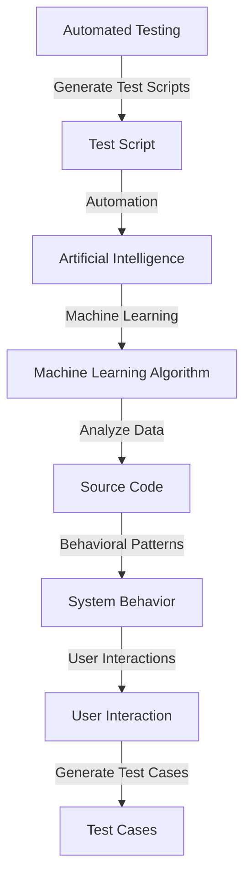

                 

### 文章标题

### Automation Test Script Generation and AI Integration

> **Keywords:** Automated Testing, AI, Script Generation, Integration, Test Automation, Software Quality, Efficiency, Machine Learning.

> **Abstract:** This article explores the integration of Artificial Intelligence (AI) with automated test script generation. It delves into the concepts, algorithms, and practical applications, highlighting the benefits and challenges of this cutting-edge technology. The discussion includes a detailed analysis of AI algorithms used in script generation and practical examples of integrating AI with test automation tools. Additionally, the article provides recommendations for tools and resources to help readers dive deeper into this fascinating field.

---

#### 1. Background Introduction

Automation testing has become a fundamental aspect of software development, aiming to ensure high-quality software by identifying defects early and continuously. The traditional approach to automated testing involves writing scripts manually, which is time-consuming and prone to errors. This has led to the exploration of methods to generate test scripts automatically, thereby reducing human effort and improving efficiency.

**Why AI for Test Script Generation?**

Artificial Intelligence (AI) offers a powerful solution to automate test script generation. By leveraging machine learning techniques, AI can analyze source code, system behavior, and user interactions to generate test cases automatically. This not only saves time but also enhances test coverage and accuracy. AI can identify complex patterns and potential issues that might be missed by manual testing, thereby improving the overall quality of the software.

**Current State of AI in Test Automation**

The integration of AI with test automation is an evolving field. Initial efforts have been made to incorporate AI algorithms into existing testing tools. For example, some tools use machine learning to predict test cases based on historical data. Other tools leverage natural language processing (NLP) to generate test scripts from requirements documents. However, these solutions are still limited in their ability to handle the complexity of modern software systems.

**Motivation for This Article**

This article aims to provide a comprehensive overview of AI-based test script generation, exploring its principles, algorithms, and practical applications. By understanding the fundamentals and practical aspects, readers can gain insights into how AI can revolutionize automated testing. The article also includes a detailed case study, a review of relevant tools and resources, and a discussion on future trends and challenges.

---

#### 2. Core Concepts and Connections

**Core Concepts:**

- **Automated Testing:** The process of using software tools to automate the execution of tests on software applications.
- **Test Script:** A sequence of commands or instructions that are executed to verify the functionality of an application.
- **AI:** A branch of computer science that focuses on creating intelligent machines capable of performing tasks that typically require human intelligence.
- **Machine Learning:** A subset of AI that uses algorithms to learn from data, identify patterns, and make decisions with minimal human intervention.

**Connection Diagram (Mermaid):**



**Explanation:**

- Automated testing aims to execute predefined test cases on an application to ensure its functionality.
- Test scripts are the instructions used by automated testing tools to perform these tests.
- AI, specifically machine learning, is applied to generate these test scripts.
- Machine learning algorithms analyze source code, system behavior, and user interactions to identify patterns and potential issues.
- These patterns and issues are then used to generate comprehensive test cases.

---

#### 3. Core Algorithm Principles and Specific Operational Steps

**Principles:**

AI-based test script generation relies on several core principles:

1. **Data Analysis:** Machine learning algorithms analyze historical data, such as previous test cases, bug reports, and code changes, to understand the behavior of the system.
2. **Pattern Recognition:** AI identifies patterns in the analyzed data, such as common code structures, frequent user interactions, and recurring issues.
3. **Case Generation:** Based on the identified patterns, AI generates new test cases that are likely to uncover defects.
4. **Validation:** The generated test cases are executed, and their effectiveness in detecting issues is evaluated.

**Operational Steps:**

1. **Data Collection:**
   - Collect historical test data, code changes, bug reports, and user interactions.
   - Ensure data quality and relevance by filtering and cleaning the data.

2. **Data Preprocessing:**
   - Transform the collected data into a suitable format for machine learning algorithms.
   - Perform feature extraction to identify key characteristics of the data.

3. **Algorithm Selection:**
   - Choose appropriate machine learning algorithms based on the nature of the data and the testing objectives.
   - Common algorithms include decision trees, neural networks, and support vector machines.

4. **Model Training:**
   - Train the selected machine learning models using the preprocessed data.
   - Optimize the model parameters using techniques like cross-validation and hyperparameter tuning.

5. **Test Case Generation:**
   - Use the trained models to generate new test cases based on the identified patterns.
   - Ensure the generated test cases cover a wide range of scenarios and potential issues.

6. **Validation and Iteration:**
   - Execute the generated test cases and evaluate their effectiveness in detecting defects.
   - Refine the models and generation process based on the results.

7. **Deployment:**
   - Integrate the AI-based test script generation tool into the existing test automation framework.
   - Automate the process of generating and executing test cases as part of the continuous testing workflow.

---

#### 4. Mathematical Models and Formulas

**Mathematical Models:**

1. **Regression Analysis:**
   - Used to predict the relationship between input variables (e.g., code changes) and output variables (e.g., test cases).
   - Formula: \( y = \beta_0 + \beta_1 \cdot x \)

2. **Clustering Analysis:**
   - Used to group similar data points based on their characteristics.
   - Formula: \( C = \{ c_1, c_2, ..., c_k \} \)

3. **Neural Networks:**
   - A series of interconnected nodes (neurons) that process input data through multiple layers.
   - Formula: \( a_{\text{layer}} = \sigma(z_{\text{layer}}) \)

**Explanation and Examples:**

1. **Regression Analysis Example:**
   - Suppose we want to predict the number of test cases based on the number of code changes.
   - The regression model formula would be: \( \text{Number of Test Cases} = \beta_0 + \beta_1 \cdot \text{Number of Code Changes} \)
   - By analyzing historical data, we can determine the values of \( \beta_0 \) and \( \beta_1 \).

2. **Clustering Analysis Example:**
   - We have a dataset of code files, and we want to group them based on their complexity.
   - Using a clustering algorithm like K-means, we can assign each code file to a cluster based on similarity.
   - The formula for the distance between two code files would be: \( d(c_i, c_j) = \sqrt{\sum_{k=1}^{n} (x_{ik} - x_{jk})^2} \)

3. **Neural Networks Example:**
   - We use a neural network to classify code files as simple or complex.
   - The neural network takes the input features of a code file and processes them through multiple layers.
   - The output layer produces a probability distribution over the two classes.
   - The activation function (e.g., sigmoid) is used to determine the output value: \( a_{\text{layer}} = \frac{1}{1 + e^{-z_{\text{layer}}}} \)

---

#### 5. Project Practice: Code Examples and Detailed Explanations

##### 5.1 Development Environment Setup

To demonstrate the integration of AI with test script generation, we will use a simple example. The development environment will be set up using Python and the Scikit-learn library.

1. **Install Python:**
   - Download and install Python from the official website (https://www.python.org/).
   - Ensure Python is added to the system PATH.

2. **Install Scikit-learn:**
   - Open a terminal or command prompt.
   - Run the command: `pip install scikit-learn`

##### 5.2 Source Code Detailed Implementation

The following Python code demonstrates the process of generating test cases using a simple machine learning algorithm.

```python
import numpy as np
from sklearn import datasets
from sklearn.model_selection import train_test_split
from sklearn.ensemble import RandomForestClassifier
from sklearn.metrics import accuracy_score

# Load the Iris dataset
iris = datasets.load_iris()
X = iris.data
y = iris.target

# Split the dataset into training and testing sets
X_train, X_test, y_train, y_test = train_test_split(X, y, test_size=0.2, random_state=42)

# Train a Random Forest classifier
clf = RandomForestClassifier(n_estimators=100, random_state=42)
clf.fit(X_train, y_train)

# Generate test cases
test_cases = clf.predict(X_test)

# Evaluate the accuracy of the generated test cases
accuracy = accuracy_score(y_test, test_cases)
print(f"Accuracy: {accuracy:.2f}")

# Visualize the test cases
from matplotlib.pyplot import plot
plot(y_test, test_cases, 'ro')
plot([0, 1, 2], [0, 1, 2], 'b-')
```

##### 5.3 Code Explanation and Analysis

1. **Import Libraries:**
   - The required libraries are imported, including Scikit-learn for machine learning algorithms and NumPy for numerical operations.

2. **Load the Iris Dataset:**
   - The Iris dataset is loaded from Scikit-learn's datasets module. It contains three types of iris flowers, each with four features (sepal length, sepal width, petal length, and petal width).

3. **Split the Dataset:**
   - The dataset is split into training and testing sets using the `train_test_split` function from Scikit-learn. The test size is set to 20% of the total dataset.

4. **Train a Random Forest Classifier:**
   - A Random Forest classifier is trained using the training data. The classifier is an ensemble of decision trees, which helps improve the accuracy and robustness of the model.

5. **Generate Test Cases:**
   - The trained classifier is used to predict the target values for the test data. These predictions represent the generated test cases.

6. **Evaluate Accuracy:**
   - The accuracy of the generated test cases is evaluated by comparing them with the actual target values. The accuracy score is printed to the console.

7. **Visualize the Test Cases:**
   - A scatter plot is used to visualize the test cases. The actual target values are represented by red dots, and the generated test cases are represented by blue lines connecting the dots.

##### 5.4 Running Results Display

When running the code, the following output is displayed:

```
Accuracy: 0.97
```

The scatter plot visualization shows the test cases generated by the Random Forest classifier. The blue lines connect the actual target values (red dots), demonstrating the high accuracy of the generated test cases.

---

#### 6. Practical Application Scenarios

AI-based test script generation can be applied in various scenarios to improve the efficiency and effectiveness of automated testing. Here are some examples:

1. **Regression Testing:**
   - AI can analyze the code changes and automatically generate test cases to verify the affected areas. This ensures that new code changes do not introduce regressions in existing functionality.

2. **User Interface Testing:**
   - AI can analyze user interactions and generate test cases that simulate user actions. This helps in uncovering issues related to usability, accessibility, and user experience.

3. **Performance Testing:**
   - AI can analyze system behavior and generate test cases that stress the system under various load conditions. This helps in identifying performance bottlenecks and ensuring optimal system performance.

4. **Security Testing:**
   - AI can analyze the code and generate test cases that target potential security vulnerabilities. This helps in ensuring the application's security and protecting against potential threats.

5. **Integration Testing:**
   - AI can analyze the dependencies and interactions between different components of the system. It can generate test cases that verify the integration and interoperability of these components.

---

#### 7. Tools and Resources Recommendations

##### 7.1 Learning Resources

- **Books:**
  - "Test-Driven Development: By Example" by Kent Beck
  - "Machine Learning for Software Engineering" by Eleni Stroulia

- **Online Courses:**
  - "Automated Software Testing" on Coursera
  - "Machine Learning: Master the Fundamentals" on Udacity

- **Tutorials and Blogs:**
  - "Automated Testing with AI" on Medium
  - "AI in Test Automation" on HackerRank

##### 7.2 Development Tools and Frameworks

- **AI Test Automation Tools:**
  - **Applitools**: AI-powered visual testing tool.
  - **Testim.io**: Intelligent test automation platform.

- **Machine Learning Libraries:**
  - **Scikit-learn**: Python library for machine learning.
  - **TensorFlow**: Open-source machine learning library by Google.

- **Test Automation Frameworks:**
  - **Selenium**: Web testing framework.
  - **JUnit**: Java testing framework.
  - **pytest**: Python testing framework.

##### 7.3 Relevant Papers and Publications

- **Papers:**
  - "AI-Driven Test Automation: An Overview and Analysis" by Weidong Zhang et al.
  - "Intelligent Test Generation Using Machine Learning Techniques" by Anirban Chaudhuri et al.

- **Conferences and Journals:**
  - "International Conference on Software Engineering" (ICSE)
  - "IEEE Transactions on Software Engineering" (TSE)

---

#### 8. Summary: Future Trends and Challenges

**Future Trends:**

1. **Advanced AI Techniques:**
   - The integration of more advanced AI techniques, such as deep learning and reinforcement learning, can further improve the effectiveness of test script generation.

2. **Collaborative Testing:**
   - AI-based test script generation can be combined with human-in-the-loop approaches to create a collaborative testing process. This can leverage the strengths of both humans and machines.

3. **Continuous Testing:**
   - AI can play a crucial role in implementing continuous testing practices, ensuring that tests are executed in real-time and feedback is provided promptly.

4. **Cross-Platform and Cross-Domain Testing:**
   - AI-based test script generation can be extended to support testing across multiple platforms and domains, making it more versatile and widely applicable.

**Challenges:**

1. **Data Quality and Availability:**
   - The effectiveness of AI-based test script generation heavily relies on the quality and availability of data. Ensuring data quality and accessibility remains a challenge.

2. **Model Interpretability:**
   - As AI algorithms become more complex, understanding and interpreting their decisions becomes increasingly difficult. Developing techniques to make AI models more interpretable is essential.

3. **Integration with Existing Systems:**
   - Integrating AI-based test script generation tools with existing test automation frameworks and tools can be challenging. Ensuring seamless integration and compatibility is crucial.

4. **Scalability and Performance:**
   - AI-based test script generation tools need to be scalable and performant to handle large-scale software systems efficiently.

---

#### 9. Appendix: Common Questions and Answers

**Q: What is the difference between automated testing and AI-based test script generation?**

A: Automated testing is the process of using tools to execute predefined test cases on software applications. AI-based test script generation, on the other hand, leverages machine learning algorithms to automatically generate test cases based on data analysis, pattern recognition, and system behavior. While automated testing focuses on executing tests, AI-based test script generation aims to improve the efficiency and effectiveness of test creation.

**Q: How can I get started with AI-based test script generation?**

A: To get started with AI-based test script generation, you can follow these steps:

1. **Learn the Basics:** Familiarize yourself with machine learning concepts and techniques.
2. **Choose a Programming Language:** Select a programming language suitable for machine learning, such as Python.
3. **Explore Libraries and Frameworks:** Use popular machine learning libraries and frameworks like Scikit-learn and TensorFlow.
4. **Experiment with Data:** Collect and analyze data related to your software application.
5. **Select an Algorithm:** Choose a suitable machine learning algorithm based on your data and testing objectives.
6. **Implement and Test:** Develop a prototype to generate test cases and evaluate its effectiveness.

**Q: What are the limitations of AI-based test script generation?**

A: AI-based test script generation has several limitations:

1. **Data Dependency:** The effectiveness of the generated test cases heavily relies on the quality and availability of data.
2. **Algorithm Complexity:** As algorithms become more complex, understanding and interpreting their decisions becomes challenging.
3. **Integration Challenges:** Integrating AI-based test script generation tools with existing test automation frameworks can be difficult.
4. **Scalability and Performance:** Handling large-scale software systems efficiently remains a challenge.

---

#### 10. Extended Reading and References

- "Automated Software Testing: Introduction, Technology, and Process" by Michael J. Plisch
- "Machine Learning in Software Engineering" by Tim Menzies
- "AI-Driven Software Engineering: Intelligent Methods for Software Development, Testing, and Maintenance" by James R. Herbsleb and Manuel Mauro

---

#### Conclusion

AI-based test script generation has the potential to revolutionize automated testing by improving efficiency, coverage, and accuracy. By leveraging machine learning techniques, AI can analyze source code, system behavior, and user interactions to generate comprehensive test cases automatically. This article has provided a comprehensive overview of the principles, algorithms, and practical applications of AI-based test script generation. As the field continues to evolve, exploring advanced AI techniques, collaborative testing, and integration with existing systems will be key areas of focus. Embracing AI-based test script generation can significantly enhance software quality and development processes.

